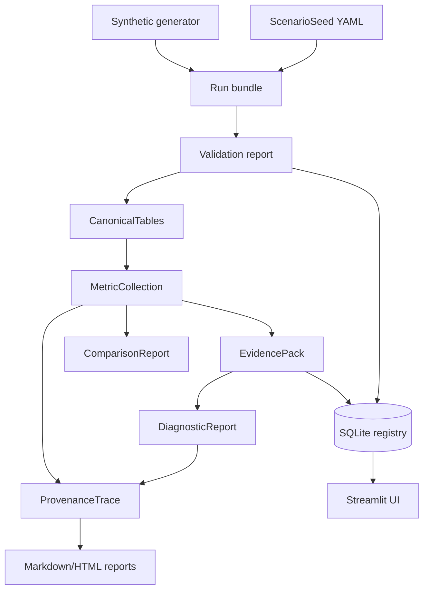

# TrafficTwin

TrafficTwin is an import-first research software prototype for reproducible urban traffic and vehicular edge-computing what-if analysis. It defines versioned scenario seeds, imports standard run bundles, validates and canonicalises source files, computes deterministic metrics, builds EvidencePacks, compares scenarios, evaluates deterministic diagnostic hypotheses, and traces results back to source rows through the Provenance Explorer. OffloadLens is the VEC analysis module inside the platform.

Status: standalone `v0.1.0` research prototype. The repository is usable without Randy's VEC
environment, SUMO artifacts, external services, or live feeds. All bundled demonstration data is
synthetic. An optional read-only integration can inspect and import Randy's separately supplied TOS
Data results package when it is available locally.

Public synthetic demonstration: <https://traffictwin-research-demo.netlify.app>. This static site
shows precomputed repository-generated scenarios and reports. It is not the full Streamlit
application and contains no Randy/TOS artifacts or live Manchester data.

## Current Scope

Implemented:

- Scenario seed YAML schema and deterministic import/export.
- Capability manifest with `true`, `false`, and `unknown`.
- Directory and ZIP run-bundle loading with validation reports.
- Manifest-driven generic CSV canonicalisation.
- Deterministic task, infrastructure, traffic, trip, comparison, and aggregation metrics.
- EvidencePack generation.
- Deterministic diagnostic hypotheses R0-R3 over EvidencePacks.
- Read-only provenance traces from metrics/rules to source files and rows where available.
- SQLite metadata registry for seeds, experiments, runs, bundle imports, metrics, and evidence packs.
- Streamlit UI over the tested library, including Experiment Planner, Scenario Builder, Experiment
  Manager, Reports, Guided Demo, Search, Settings, and About pages.
- Standalone synthetic generator, demo workspace, one-click launch, and deterministic reports.
- Synthetic-only Netlify static dashboard, Streamlit container definition, dependency lock, and
  release-readiness commands.
- Read-only TOS Data evaluation-summary import, versioned `vec_env` source contract, NPZ
  validation, unit-aware historical replay, task/action inspection, RSU pressure inspection,
  paired campaign comparison, training-history exploration, generalisation labels,
  reproducibility auditing, research-safe exports, partial EvidencePacks, and aggregate
  provenance.
- Deterministic experiment protocol YAML/CSV with exhaustive run slots and read-only completed-
  bundle matching.

Not implemented:

- Standard Randy/VEC bundle conversion and SUMO adapters.
- Direct simulator launch or asynchronous jobs.
- Real Manchester sensor ingestion.
- Near-live or true-live operation.
- LLM rendering, XAI, portfolio selection, or training orchestration.

## Ten-Minute Standalone Demo

Use Python 3.11 or newer. The examples assume the current directory is this repository root.

```bash
python3.12 -m venv .venv
source .venv/bin/activate
python -m pip install -e ".[dev]"
traffictwin demo initialise .demo
traffictwin demo status .demo
traffictwin demo launch .demo
```

The launch command starts:

```bash
streamlit run src/traffictwin/ui/app.py
```

with environment variables pointing the UI at `.demo/registry.sqlite` and `.demo/bundles`.

The demo workspace contains:

```text
.demo/
├── registry.sqlite
├── seeds/
├── bundles/
│   ├── baseline/
│   ├── stressed_demand/
│   ├── under_offloading/
│   ├── infrastructure_bottleneck/
│   ├── mixed_fault/
│   ├── partial_evidence/
│   └── trivial_multi_algorithm/
├── reports/
├── exports/
├── logs/
└── workspace.yaml
```

Every generated scenario is labelled synthetic. The generator is a controlled software fixture model; it is not a calibrated traffic, radio, VEC, SUMO, or Manchester model.

## Synthetic Demo Flow

1. Open Home and select **Start Guided Demo**. This button remains visible when the mobile sidebar
   is collapsed.
2. Choose **Standalone synthetic** and follow its eight validated pipeline stages.
3. Open Experiment Planner and preview a baseline/variation design using registered seeds and a
   common random seed. Export its protocol YAML or CSV run sheet. Registering the plan creates no
   runs.
4. Open Scenario Builder and duplicate or export a synthetic scenario configuration.
5. Validate `.demo/bundles/baseline` and `.demo/bundles/stressed_demand`.
6. Inspect baseline metrics, historical replay, and infrastructure state.
7. Compare baseline against stressed demand and inspect synthetic journey durations.
8. Review R0-R3 statuses, trace `task.completion.rate`, and export a deterministic report.

When the separately supplied package is available locally, the **Randy/TOS imported simulation**
track presents four read-only stages. It does not run Randy's environment or SUMO.

Detailed scripts:

- [docs/standalone_demo.md](docs/standalone_demo.md)
- [docs/product_polish.md](docs/product_polish.md)
- [docs/demo_script.md](docs/demo_script.md)
- [docs/demo_checklist.md](docs/demo_checklist.md)

## CLI Examples

Generate and verify standalone synthetic artifacts:

```bash
traffictwin synthetic presets
traffictwin synthetic generate-preset baseline --output /tmp/tt-baseline --overwrite
traffictwin synthetic experiment-generate-preset trivial_multi_algorithm \
  --seeds 1,2,3 \
  --output /tmp/tt-trivial \
  --overwrite
traffictwin synthetic verify .demo
```

Run the import-first workflow on any standard bundle:

```bash
traffictwin bundle validate .demo/bundles/baseline
traffictwin bundle import .demo/bundles/baseline --registry .demo/registry.sqlite
traffictwin metrics compute .demo/bundles/baseline
traffictwin evidence build .demo/bundles/baseline --output .demo/exports/evidence.json
traffictwin diagnose bundle .demo/bundles/under_offloading
```

Compare, trace, and report:

```bash
traffictwin compare .demo/bundles/baseline .demo/bundles/stressed_demand
traffictwin provenance metric .demo/bundles/baseline task.completion.rate
traffictwin provenance source .demo/bundles/baseline tasks.csv 2
traffictwin report run .demo/bundles/baseline --output .demo/reports/run.md
traffictwin report compare .demo/bundles/baseline .demo/bundles/stressed_demand \
  --output .demo/reports/comparison.md
traffictwin report full .demo/bundles/stressed_demand \
  --comparison-baseline .demo/bundles/baseline \
  --output .demo/reports/full.html
```

Export a registered research design for external coordination:

```bash
traffictwin experiment protocol --registry .demo/registry.sqlite \
  --experiment-id EXPERIMENT_ID --format yaml --output protocol.yaml
traffictwin experiment protocol --registry .demo/registry.sqlite \
  --experiment-id EXPERIMENT_ID --format csv --output run-sheet.csv
traffictwin experiment match-bundle COMPLETED_BUNDLE --registry .demo/registry.sqlite \
  --experiment-id EXPERIMENT_ID
```

These commands do not launch work or create `Run` records. See
[docs/experiment_protocol.md](docs/experiment_protocol.md).

Complete CLI reference: [docs/cli_reference.md](docs/cli_reference.md).

Optional offline TOS Data inspection requires NumPy:

```bash
python -m pip install -e ".[dev,tos]"
traffictwin integration tos contract
traffictwin integration tos inspect ../external/tos-data
traffictwin integration tos validate ../external/tos-data
traffictwin integration tos import ../external/tos-data \
  --registry data/registry/traffictwin.sqlite
traffictwin integration tos metrics ../external/tos-data \
  tos:baseline:wd_am:uk2030:fs0
traffictwin integration tos rsu-series ../external/tos-data \
  baseline_uk2030_wd_am_fs0 --stride 10 --limit 100
traffictwin integration tos matrix ../external/tos-data
traffictwin integration tos compare-campaigns ../external/tos-data \
  baseline ukfleettrain_mappo
traffictwin integration tos training-runs ../external/tos-data --limit 5
traffictwin integration tos audit ../external/tos-data
traffictwin integration tos readiness ../external/tos-data --format json
traffictwin integration tos results-pack ../external/tos-data \
  --output /tmp/traffictwin-tos-results
traffictwin integration tos supervisor-pack ../external/tos-data \
  --output /tmp/traffictwin-supervisor-pack
```

This path imports documented source summaries and exposes confirmed source-state semantics; it
does not launch Randy's environment or relabel RSU concurrency pressure as canonical utilisation.
See
[docs/integration/tos_data_adapter.md](docs/integration/tos_data_adapter.md) and the
[TOS Results Workbench](docs/integration/tos_results_workbench.md).

Stage the public-safe synthetic dashboard without reading external data:

```bash
traffictwin demo initialise .netlify-demo
traffictwin release stage-demo-site .netlify-demo --output public
```

The full Streamlit interface requires a Python runtime and is provided through the root
`Dockerfile`; the Netlify target is a static, interactive view over precomputed synthetic values.
The current deployment is <https://traffictwin-research-demo.netlify.app>. See
[docs/deployment.md](docs/deployment.md).

## Architecture Overview

TrafficTwin is deliberately layered. UI and CLI commands call service/library functions; calculations stay in deterministic library modules; external uncertainty stays behind adapters and capability manifests.



For details, see [docs/architecture.md](docs/architecture.md) and [docs/system_overview.md](docs/system_overview.md).

## Feature Matrix

| Area | Status | Notes |
|---|---|---|
| Standalone demo workspace | Implemented | `traffictwin demo initialise PATH`. |
| Synthetic generator | Implemented | Deterministic for fixed config and seed; synthetic-only. |
| Generic bundle import | Implemented | Directory and safe ZIP bundles. |
| Validation reports | Implemented | Stable codes, severity, file/row/field context. |
| Canonical records | Implemented | In-memory canonical tables; no row database. |
| Deterministic metrics | Implemented | Unavailable metrics are explicit, never zero-filled. |
| EvidencePack | Implemented | Only supported input for diagnostic rules. |
| Diagnostic rules R0-R3 | Implemented | Candidate hypotheses, not proven causes. |
| Provenance Explorer | Implemented | CLI and Streamlit trace inspection. |
| Report export | Implemented | Deterministic Markdown and standalone HTML. |
| Streamlit UI | Implemented | Thin presentation layer. |
| Experiment planning | Implemented | Validated seed/policy/common-seed matrix plus deterministic protocol YAML/CSV; no run creation or launch. |
| CI workflow | Implemented | GitHub Actions example for Python 3.11 and 3.12. |
| Synthetic static deployment | Implemented | Netlify-compatible; external data is excluded. |
| Streamlit container | Implemented | Initialised standalone synthetic workspace on port 8501. |
| Private supervisor pack | Implemented | Checksummed TOS reports, readiness gates, viva notes, and evaluation plan. |
| TOS Data offline results | Implemented, partial | Matrix, paired comparisons, training/audit, replay/source inspection, and aggregate exports; no canonical conversion or launch. |
| Full Randy/VEC integration | Blocked | Source semantics are documented; checkpoint, producer commit/writer, canonical outcome/identity fields, tested execution, and fixture permission remain unresolved. |
| SUMO integration | Blocked | No raw SUMO config/XML or trip output is available. |
| Direct launch | Unsupported | Capability remains `false`. |
| Near-live/true-live data | Not implemented | Must not be inferred from file recency. |

## Testing And Quality

```bash
.venv/bin/ruff format .
.venv/bin/ruff check .
.venv/bin/mypy
.venv/bin/python -m pytest
.venv/bin/python -m pytest --cov=traffictwin --cov-report=term-missing
.venv/bin/python -m build
uv lock --check
```

Release smoke:

```bash
.venv/bin/python scripts/verify_release.py
```

The current test count and coverage are documented in [docs/reproducibility.md](docs/reproducibility.md) after the latest full quality-gate run.

## Repository Structure

```text
.
├── AGENTS.md
├── README.md
├── pyproject.toml
├── uv.lock
├── Dockerfile
├── netlify.toml
├── .github/workflows/ci.yml
├── docs/
├── examples/
│   ├── seeds/
│   └── standalone/
├── scripts/
├── src/traffictwin/
│   ├── canonical/
│   ├── config/
│   ├── demo/
│   ├── diagnostics/
│   ├── domain/
│   ├── evidence/
│   ├── ingestion/
│   ├── integration/
│   ├── metrics/
│   ├── provenance/
│   ├── reporting/
│   ├── rules/
│   ├── storage/
│   ├── synthetic/
│   ├── ui/
│   └── validation/
└── tests/
```

## Data-Mode Disclaimer

All repository-contained run data is synthetic unless an imported source explicitly says otherwise.
The optional TOS Data package is an external simulation-results source and is labelled imported
historical replay, not live Manchester data. The UI does not support true live or near-live data.

## External Integration Status

Phase 6 discovery inspected Randy's separately cloned TOS Data and `vec_env` repositories.
TrafficTwin now supports a conservative offline integration with source-evidenced field meanings,
units, evaluation summaries, and instrumented views. Neither external repository is committed
here, and the result package is not a standard TrafficTwin run bundle. Full canonical conversion,
canonical RSU infrastructure metrics, SUMO XML support, and direct execution remain blocked.
Integration evidence and remaining questions are documented under
[docs/integration/](docs/integration/).

## Documentation Index

Start at [docs/index.md](docs/index.md). Key documents:

- [docs/standalone_demo.md](docs/standalone_demo.md)
- [docs/synthetic_data_model.md](docs/synthetic_data_model.md)
- [docs/report_export.md](docs/report_export.md)
- [docs/release_guide.md](docs/release_guide.md)
- [docs/deployment.md](docs/deployment.md)
- [docs/supervisor_pack.md](docs/supervisor_pack.md)
- [docs/dissertation_evaluation_plan.md](docs/dissertation_evaluation_plan.md)
- [docs/provenance_explorer.md](docs/provenance_explorer.md)
- [docs/user_guide.md](docs/user_guide.md)
- [docs/developer_guide.md](docs/developer_guide.md)
- [docs/reproducibility.md](docs/reproducibility.md)
- [docs/viva_guide.md](docs/viva_guide.md)
- [docs/limitations_and_future_work.md](docs/limitations_and_future_work.md)
- [docs/integration/tos_data_adapter.md](docs/integration/tos_data_adapter.md)

## Citation And Attribution Placeholder

Dissertation citation details are not final. Suggested placeholder:

> Abdulla Al Mamun Akash. TrafficTwin: an import-first research software prototype for traffic and vehicular edge-computing what-if analysis. MSc dissertation project, 2026.

## Licence Status

Licence not yet specified. No project licence file is currently present; do not assume reuse rights beyond the repository owner's permission until a licence is added.
