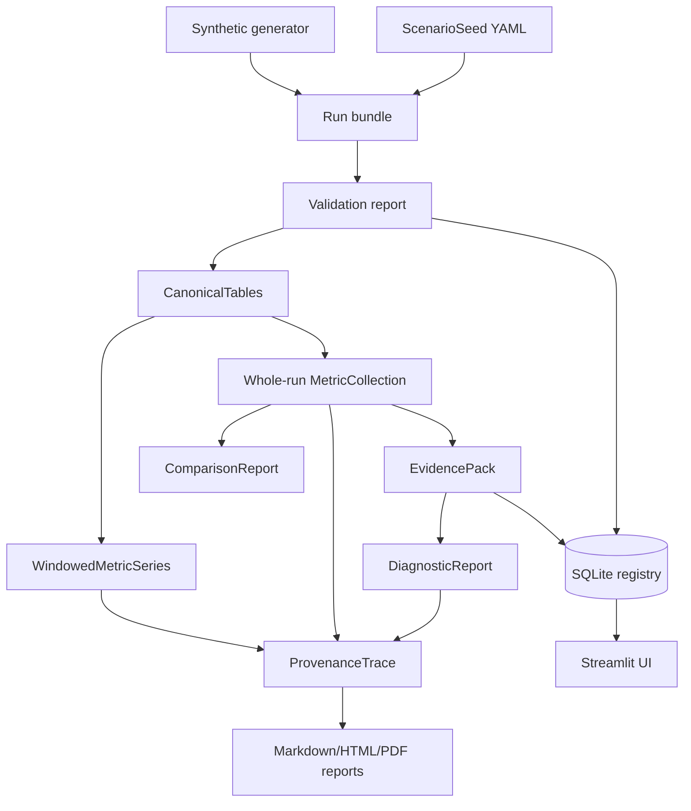

# TrafficTwin

TrafficTwin is an import-first research software prototype for reproducible urban traffic and vehicular edge-computing what-if analysis. It defines versioned scenario seeds, imports standard run bundles, validates and canonicalises source files, computes deterministic metrics, builds EvidencePacks, compares scenarios, evaluates deterministic diagnostic hypotheses, and traces results back to source rows through the Provenance Explorer. OffloadLens is the VEC analysis module inside the platform.

Status: `v0.6.0` research prototype. The repository is usable without Randy's VEC
environment, external services, or live feeds. All bundled demonstration and SUMO acceptance data
is synthetic. The import-only SUMO adapter accepts checksummed 1.27 tripinfo/summary outputs, and
the confirmation-gated manifest wizard can suggest generic CSV mappings without making them
analysis inputs. Standard bundles may also declare gzip-CSV and flat scalar Parquet through the
same validation, unit, metric, and provenance path. Explicit bundle paths/globs can be validated or
imported as a deterministic failure-isolated batch. Large generic tables can use opt-in row/byte-
bounded streaming canonicalisation with exact cross-chunk validation. Accepted ordinary generic
bundles can use a separate content-addressed, checksummed Parquet canonical cache that re-hashes raw
evidence before every hit. Accepted ordinary generic bundles can also be published as
permission-aware deterministic RO-Crate 1.3 archives with CFF citation and offline checksum
verification. A closed general external-source interface now exposes exact discovery, validation,
semantics, capabilities, provenance, conversion, and blockers for the distinct public SUMO and
private TOS reference adapters without treating them as equivalent. Validated generic bundles can
also produce deterministic aligned fixed-window metrics with explicit gaps, edge coverage, and
per-window provenance. An optional read-only integration can inspect and import Randy's separately
supplied TOS Data results package when it is available locally. A separate optional VEC-06 library
can validate and preprocess a caller-supplied one-second SUMO FCD/network pair with the exact
audited source scripts, immutable outputs, and a deterministic receipt. The VEC-07 library can run
the exact audited Randy evaluator locally through a closed typed request and immutable receipt; it
does not launch SUMO, expose a product Run control, or establish VEC-08 numerical reproduction.

The in-development `codex/traffictwin-v0.7` branch additionally contains private, operator-triggered
Manchester evidence workflows. BODS supplies source-timed live bus positions. The current National
Highways developer REST service supplies source-separated near-live/stale closures and incidents,
imposed temporary restrictions, and digital VMS status for Strategic Road Network features inside
a declared study envelope. A real three-product acceptance run passed on 24 July 2026. These
features require credentials supplied through environment variables and never run in the
background. Manchester Operations also includes attributed, hash-verified ONS Manchester/Greater
Manchester display boundaries and a downloadable aggregate-only source-status manifest. It does
not provide continuous traffic flow, measured road speed, congestion, complete city-road coverage,
traffic-signal phases, raw/position public export, or a change to the immutable v0.6 release.

Public synthetic demonstration: <https://traffictwin-research-demo.netlify.app>. This static site
shows precomputed repository-generated scenarios and reports. It is not the full Streamlit
application and contains no Randy/TOS artifacts or live Manchester data.

For installation, end-to-end workflows, 38 concrete use cases, UI and CLI instructions, output
interpretation, reporting, deployment, and troubleshooting, start with the
[complete product and usage guide](docs/full_product_guide.md).

## Current Scope

Implemented:

- Scenario seed YAML schema and deterministic import/export.
- Capability manifest with `true`, `false`, and `unknown`.
- Directory and ZIP run-bundle loading with validation reports.
- Deterministic batch validation/import with per-bundle outcomes and isolated registry transactions.
- Manifest-driven plain CSV, gzip-CSV, and flat scalar Parquet canonicalisation.
- Opt-in memory-bounded streaming validation and metadata import with chunk-size equivalence.
- Content-addressed six-table Parquet canonical caching with exact cold/warm equivalence and
  fail-closed invalidation outside raw bundles.
- Permission-aware deterministic RO-Crate 1.3 ZIP export with CFF 1.2 citation, explicit raw
  embed/reference/exclude policy, checksums, offline verification, and atomic publication.
- Runtime-checkable read-only external-source discovery/contract/inspection with distinct SUMO
  partial-canonical and TOS aggregate-summary profiles, explicit unknowns, and no dynamic adapters.
- Deterministic task, infrastructure, traffic, trip, comparison, and aggregation metrics.
- Contract-gated task energy per observed task, energy per completed task, and energy-delay
  product with explicit coverage and compatible-comparison semantics.
- Deterministic fixed-window task, infrastructure, traffic, and trip metrics with half-open
  boundaries, explicit partial/empty states, and per-window source lineage.
- EvidencePack generation.
- Deterministic diagnostic hypotheses R0-R8 over run-, experiment-, typed temporal, exact
  operational-group, and contract-gated energy EvidencePacks, including sustained degradation,
  declared-event recovery, operational disparity, and completed-task energy candidates.
- Closed trusted-local declarative YAML rule definitions over already-computed EvidencePack
  metrics, with bounded threshold/boolean grammar and no arbitrary code or UI-side evaluation.
- Verified single-boundary nearest-flip analysis for eligible non-triggered R5/R7/R8 results,
  with unchanged support constraints, ordinary-engine verification, and no threshold persistence.
- Interactive deterministic threshold sensitivity for R5/R7/R8, retaining every grid status,
  sampled/exact boundary separation, provisional-default labels, and explicit session-only
  complete-config import/download without silent persistence.
- Typed deterministic cross-rule conflict, corroboration, and R0 readiness suppression over
  retained RuleResults, with exact evidence overlap, explicit precedence, no confidence changes,
  and no inferred undeclared pairs.
- Predeclared common-seed paired statistical studies with complete compatibility/exclusion audit,
  original-unit effect, deterministic bootstrap interval, two-sided sign-flip test, paired effect
  sizes, versioned provenance, CLI exports, and a thin Streamlit workflow.
- Predeclared N-way common-seed policy rankings that extend the winner map with identical
  complete-seed denominators, explicit ties/missingness/incompatibility, deterministic joint
  bootstrap mean/rank uncertainty, typed exports, CLI, and the same thin Statistical Study page.
- Predeclared paired TOST equivalence studies over the unchanged STA-01 cohort, requiring an
  original-unit margin, basis, justification, and explicit alpha; ordinary non-significance is
  never relabelled as equivalence.
- Versioned STA-04 regression gates over completed metric collections or paired-study artifacts,
  with explicit golden approval, absolute/relative tolerances, exact or compatible-context source
  policies, complete assertion audits, and distinct CI pass/fail/unavailable exit codes.
- Prospective STA-05 paired common-seed power planning from a declared target effect,
  paired-difference variance, alpha, and target power, with smallest-integer verification and
  explicit small-sample, synthetic, provisional, assumption, and planning-only labels.
- PRO-01 accepted-row difference provenance with reconciled terms for admitted direct scalar
  formulas and weight-free eligible lineage for percentiles and other non-additive aggregates.
- PRO-02 deterministic bounded provenance graphs with stable IDs, exact omission counts,
  path-safe/structure-only disclosure, Graphviz DOT, GraphML, CLI exports, and an explorer view.
- PRO-03 explicit typed report-claim provenance completeness with unavailable claims retained,
  reconciled accepted-row rules, named exclusions, null empty-denominator handling, and CLI/UI
  JSON/CSV inventories.
- EXP-01 bounded parameter sweeps over closed seed/synthetic scalar fields, producing parent-linked
  seeds, labelled local synthetic bundles plus ordinary metric response rows, or external requests
  that remain explicitly `not_executed` with no launch command.
- EXP-02 deterministic row-dropout, timestamp-jitter, and RSU-removal mutations over copied,
  validated, explicitly labelled synthetic/evaluation CSV bundles, with exact change ledgers and
  no inferred rerouting or external launch.
- Read-only provenance traces from metrics/rules to source files and rows where available.
- SQLite metadata registry for seeds, experiments, runs, bundle imports, metrics, evidence packs,
  and database-guarded append-only analyst annotations.
- Five-version ordered transactional SQLite migrations with immutable checksummed history,
  historical payload preservation, read-only status inspection, and full-plan rollback.
- Streamlit UI over the tested library, including Experiment Planner, Scenario Builder, Experiment
  Manager, Reports, Guided Demo, Search, Settings, and About pages.
- Standalone synthetic generator, demo workspace, one-click launch, and deterministic reports.
- Synthetic-only Netlify static dashboard, Streamlit container definition, dependency lock, and
  release-readiness commands.
- Read-only TOS Data evaluation-summary import, versioned `vec_env` source contract, NPZ
  validation, unit-aware historical replay, task/action inspection, RSU pressure inspection,
  paired campaign comparison, training-history exploration, generalisation labels,
  reproducibility auditing, research-safe exports, partial EvidencePacks, and aggregate
  provenance.
- v0.6 `VEC-01` deterministic audit of Randy's exact updated Git snapshots, covering 154 hashed
  source/data/permission evidence files, exact trace-to-occupancy reconstruction, enriched
  per-step/per-task schemas, actor checkpoints, tripinfo coverage, claim reconciliation, and
  permission-scoped blockers without modifying either external worktree. See the
  [source-snapshot audit](docs/integration/randy-source-snapshot-audit-v0_6.md).
- v0.6 `VEC-02` accepted audited contract with complete exact trace/per-step/per-task/occupancy
  schemas, deterministic validators, typed semantic refusals, synthetic golden/negative fixtures,
  and the VEC-11 permission-manifested real sanitised Gate-B sample.
- v0.6 `VEC-03` occupancy-bounded identity with exact inclusive span reconciliation, full
  active-mask coverage, trace-bound mobility joins, synthetic refusal tests, and read-only
  acceptance across all five audited trace/occupancy pairs (17,210,508 identity cells with no
  gaps or inactive assignments). See the [VEC-03 guide](docs/integration/vec_identity.md).
- v0.6 `VEC-04` tier/EV/task/action/target joins with exact cross-stream reconciliation and typed
  no-target semantics, accepted over 46,861,416 tasks in all six matched instrumented runs. See the
  [VEC-04 guide](docs/integration/vec_task_join.md).
- v0.6 `VEC-05` exact-ID tripinfo integration for all four audited files and five scenario joins,
  preserving the full-day clock and reporting 42,881 matches, 872 boundary-censored vehicles, and
  14 missing-before-boundary exclusions. See the [VEC-05 guide](docs/integration/vec_trip_join.md).
- v0.6 `VEC-11` accepted permission-bounded dissertation pack: three pseudonymised/rounded matched
  `_s102` rows, all 26 VEC-09 metric states, exact citations/hashes/report bindings, and explicit
  raw/checkpoint/source exclusions. See the
  [VEC-11 guide](docs/integration/vec_dissertation_pack.md).
- v0.6 `VEC-06` bounded FCD/network preprocessing using exact pinned Git blobs, read-only
  preflight, safe subprocess execution, atomic new-only publication, immutable trace/occupancy/site
  artifacts, and a deterministic receipt. See the
  [VEC-06 usage guide](docs/integration/vec_fcd_preprocessing.md).
- v0.6 `VEC-07` safe local Model-C evaluator runner with exact source/actor allowlists, typed
  requests and receipts, VEC-02/VEC-06 trace admission, CPU-only JAX isolation, bounded logs,
  timeout/cancellation, atomic new-only publication, and a real non-mutating two-step acceptance
  run. The exact evaluator is now available conditionally through VEC-10 preflight-gated
  foreground execution. See the
  [VEC-07 usage guide](docs/integration/vec_evaluator_runner.md).
- v0.6 `VEC-08` full weekend protocol-seed reproduction verification against exact pinned master,
  JSON, and enriched per-step Git blobs. Two independent full CPU runs were repeat-exact for all
  scientific arrays and passed 61 exact plus two predeclared float-reduction checks with zero
  mismatches. See the
  [VEC-08 verification guide](docs/integration/vec_reproduction_verification.md).
- v0.6 `VEC-09` deterministic scientific admission over audited task/trip evidence: 18 compatible
  existing or separately named TOS metrics admitted, eight unsupported metric definitions kept
  unavailable, R1/R2/R7 blocked, and R6 conditional without threshold evaluation or findings. See
  the [VEC-09 guide](docs/integration/vec_scientific_admission.md).
- v0.6 `VEC-10` thin CLI/UI integration for snapshot, validate, preprocess, foreground run/monitor,
  inspect, compare, and export workflows. Execution is conditional on exact typed preflight; there
  is no arbitrary command input or persistent job queue. See the
  [VEC-10 guide](docs/integration/vec_interface.md).
- One-click controlled VEC execution and automatic result import: two closed presets (two-step
  smoke, exact VEC-08 protocol-seed full run) run preflight, the allowlisted evaluator, output
  revalidation, source-immutability checks, and one idempotent registry import from a single
  explicit action. Imported records stay structural evidence with scientific admission
  explicitly unavailable. See the
  [one-click guide](docs/integration/vec_one_click_execution.md).
- Controlled one-click SUMO execution (post-v0.6, ADR-053): one closed synthetic preset runs
  the discovered SUMO 1.27.x binary in the foreground with a fixed argv, then validates and
  imports the outputs through the existing import-only adapter idempotently. Real runtime
  acceptance stays visibly unavailable until SUMO is installed locally; generic direct launch
  remains false. See the
  [controlled SUMO guide](docs/integration/sumo_controlled_execution.md).
- v0.6 `VEC-12` accepted deterministic end-to-end research artifact: one offline-verifiable
  27-member ZIP binding VEC-01–VEC-11 source, execution, join, scientific, interface, permission,
  provenance, environment, exclusion, and limitation evidence without raw external bytes. See the
  [VEC-12 guide](docs/integration/vec_end_to_end_research_artifact.md).
- Deterministic experiment protocol YAML/CSV with exhaustive run slots and read-only completed-
  bundle matching.
- Dedicated Triviality/R5 pair analysis, compatibility-filtered per-seed winner maps, a transparent
  synthetic portfolio with a fixed multi-family held-out study, and manual protocol-slot tracking.
- Synthetic S5 stadium-event/RSU-siting and S6 road-clearing/lane-closure presets with
  round-trippable incident/event authoring and incident-seeded what-if export.
- Draft, explicitly unapproved participant-evaluation and ethics materials.
- Expanded synthetic fault-injection evaluation, portfolio variability/dominance reports, and a
  checksummed three-scenario synthetic case-study pack.
- Complete accepted-canonical-row metric contribution ledgers with JSON/CSV export.
- Deterministic Markdown, standalone HTML, and A4 PDF research reports.
- Escaped LaTeX metric/comparison/statistical/rule tables with deterministic SVG/PDF figures,
  shared projection fingerprints, explicit source modes, and no reporting-layer calculations.
- Typed append-only analyst notes/decisions with stored-target checks, immutable ordered history,
  and visibly separate non-computed Markdown/HTML/PDF report sections.
- Compatibility-gated structured report diffs over prose-free typed metric/rule/comparison claim
  snapshots, with exact JSON Pointer changes and no rendered-text or annotation comparison.
- Deterministic one-page executive summaries over saved typed reports, with complete availability
  and omission counts, all warnings/limitations, fingerprinted provenance links, and fail-closed
  A4 overflow.
- Deterministic read-only full-text registry/report search over six labelled categories, with
  bounded lexical ranking, stable fingerprints, and local-path redaction before matching.
- A constrained non-LLM diagnostic findings renderer that only restates computed findings.
- A non-geographic vehicle coordinate replay, automated desktop/mobile screenshots, and basic
  accessibility regression checks.
- Descriptive analysis for explicitly labelled synthetic mock participant results only.

Not implemented in the immutable v0.6 release (the bounded v0.7 development exceptions are
described above):

- Standard Randy/VEC bundle conversion, SUMO FCD/other-output adapters, and simulator launch.
- Direct simulator launch or asynchronous jobs.
- Complete real Manchester sensor ingestion or continuous city-road telemetry.
- Generic near-live or true-live operation beyond the source-specific private v0.7 workflows.
- LLM rendering, XAI, trained/calibrated portfolio selection, or training orchestration. The
  deterministic findings renderer is not an LLM and adds no claims.

## Ten-Minute Standalone Demo

Use Python 3.11 or newer. The examples assume the current directory is this repository root.

```bash
python3.12 -m venv .venv
source .venv/bin/activate
python -m pip install -e ".[dev]"
traffictwin demo initialise .demo
traffictwin demo status .demo
traffictwin demo launch .demo
```

The launch command starts:

```bash
streamlit run src/traffictwin/ui/app.py
```

with environment variables pointing the UI at `.demo/registry.sqlite` and `.demo/bundles`.

The demo workspace contains:

```text
.demo/
├── registry.sqlite
├── seeds/
├── bundles/
│   ├── baseline/
│   ├── stressed_demand/
│   ├── under_offloading/
│   ├── infrastructure_bottleneck/
│   ├── mixed_fault/
│   ├── partial_evidence/
│   ├── s5_stadium_event_siting/
│   ├── s6_road_clearing_corridor/
│   └── trivial_multi_algorithm/
├── reports/
├── exports/
├── logs/
└── workspace.yaml
```

Every generated scenario is labelled synthetic. The generator is a controlled software fixture model; it is not a calibrated traffic, radio, VEC, SUMO, or Manchester model.

## Synthetic Demo Flow

1. Open Home and select **Start Guided Demo**. This button remains visible when the mobile sidebar
   is collapsed.
2. Choose **Standalone synthetic** and follow its eight validated pipeline stages.
3. Open Experiment Planner and preview a baseline/variation design using registered seeds and a
   common random seed. Export its protocol YAML or CSV run sheet. Registering the plan creates no
   runs.
4. Open Scenario Builder and duplicate or export a synthetic scenario configuration.
5. Validate `.demo/bundles/baseline` and `.demo/bundles/stressed_demand`.
6. Inspect baseline metrics, historical replay, and infrastructure state.
7. Compare baseline against stressed demand and inspect synthetic journey durations.
8. Review R0-R8 statuses, trace `task.completion.rate`, and export a deterministic report.
9. Open Triviality to inspect experiment EvidencePacks, R3/R5, the winner map, and the transparent
   synthetic portfolio's fixed development/held-out evaluation.
10. Open Reports to export a `.tex` research table and optional SVG/PDF figure from an existing
    typed artifact.
11. Add a typed analyst annotation and deliberately regenerate a report with its append-only
    history shown in the non-computed annotations section.
12. Save two same-type reports as `.json`, then use `traffictwin report diff` or the Reports page
    to inspect typed changed/added/removed/unavailable sections without diffing prose.
13. Use `traffictwin report executive` or the Reports page to render the saved typed report as a
    bounded supervisor PDF/HTML/Markdown/JSON summary without hiding caveats.
14. Open Search or run `traffictwin registry search` to locate findings, annotations, reports,
    runs, experiments, and evidence references without changing the registry.
15. Run `traffictwin registry migration-status .demo/registry.sqlite` to inspect the current
    schema and immutable migration ledger without changing it.

When the separately supplied package is available locally, the **Randy/TOS imported simulation**
track presents four read-only stages. It does not run Randy's environment or SUMO.

Detailed scripts:

- [docs/standalone_demo.md](docs/standalone_demo.md)
- [docs/product_polish.md](docs/product_polish.md)
- [docs/demo_script.md](docs/demo_script.md)
- [docs/demo_checklist.md](docs/demo_checklist.md)
- [docs/registry_migrations.md](docs/registry_migrations.md)

## CLI Examples

Generate and verify standalone synthetic artifacts:

```bash
traffictwin synthetic presets
traffictwin synthetic generate-preset baseline --output /tmp/tt-baseline --overwrite
traffictwin synthetic measurement-contract
traffictwin synthetic generate-config \
  --config examples/synthetic_measurement_imperfections.yaml \
  --output /tmp/tt-measurement-robustness
traffictwin synthetic experiment-generate-preset trivial_multi_algorithm \
  --seeds 1,2,3 \
  --output /tmp/tt-trivial \
  --overwrite
traffictwin synthetic verify .demo
traffictwin synthetic case-study-pack --output /tmp/tt-case-study --overwrite
traffictwin experiment parameter-sweep-contract
traffictwin experiment parameter-sweep \
  --request examples/parameter_sweep_request.yaml \
  --output /tmp/tt-demand-capacity-sweep
traffictwin experiment mutation-contract
traffictwin experiment mutate-scenario \
  --bundle .demo/bundles/baseline \
  --request examples/scenario_mutation_request.yaml \
  --output /tmp/tt-mutated-baseline
```

Run the import-first workflow on any standard bundle:

```bash
traffictwin bundle validate .demo/bundles/baseline
traffictwin bundle import .demo/bundles/baseline --registry .demo/registry.sqlite
traffictwin bundle batch-validate '.demo/bundles/*' --format json
traffictwin bundle stream-validate .demo/bundles/baseline --format json
traffictwin metrics compute .demo/bundles/baseline
traffictwin metrics windows .demo/bundles/baseline --width-s 60 --format json
traffictwin evidence build .demo/bundles/baseline --output .demo/exports/evidence.json
traffictwin diagnose bundle .demo/bundles/under_offloading
traffictwin diagnose temporal .demo/bundles/stressed_demand \
  --width-s 60 --metric-key task.completion.rate --format json
traffictwin diagnose render .demo/bundles/under_offloading --format markdown
```

Compare, trace, and report:

```bash
traffictwin compare .demo/bundles/baseline .demo/bundles/stressed_demand
traffictwin provenance metric .demo/bundles/baseline task.completion.rate
traffictwin provenance source .demo/bundles/baseline tasks.csv 2
traffictwin provenance contributors .demo/bundles/baseline task.latency.mean_ms --format csv
traffictwin provenance difference-contributors .demo/bundles/baseline \
  .demo/bundles/stressed_demand task.completion.rate --format json
traffictwin provenance export .demo/bundles/baseline \
  --root-type metric --root-id task.completion.rate \
  --format graphml --redaction safe --output completion-provenance.graphml
traffictwin provenance window-metric .demo/bundles/baseline task.completion.rate \
  --width-s 60 --window-ordinal 0 --format json
traffictwin report run .demo/bundles/baseline --output .demo/reports/run.md
traffictwin report compare .demo/bundles/baseline .demo/bundles/stressed_demand \
  --output .demo/reports/comparison.md
traffictwin report full .demo/bundles/stressed_demand \
  --comparison-baseline .demo/bundles/baseline \
  --output .demo/reports/full.html
traffictwin report run .demo/bundles/baseline --output .demo/reports/run.pdf
traffictwin participant-evaluation analyse-mock docs/evaluation/mock_results.json
```

Export a registered research design for external coordination:

```bash
traffictwin experiment protocol --registry .demo/registry.sqlite \
  --experiment-id EXPERIMENT_ID --format yaml --output protocol.yaml
traffictwin experiment protocol --registry .demo/registry.sqlite \
  --experiment-id EXPERIMENT_ID --format csv --output run-sheet.csv
traffictwin experiment match-bundle COMPLETED_BUNDLE --registry .demo/registry.sqlite \
  --experiment-id EXPERIMENT_ID
```

These commands do not launch work or create `Run` records. See
[docs/experiment_protocol.md](docs/experiment_protocol.md).

Complete CLI reference: [docs/cli_reference.md](docs/cli_reference.md).

Infer and explicitly confirm mappings for externally named CSV columns:

```bash
traffictwin manifest contract --format json
traffictwin manifest infer raw-csv-directory \
  --format yaml --output mapping-draft.yaml
traffictwin manifest confirm mapping-draft.yaml raw-csv-directory \
  --accept-suggestions --confirmed-by "analyst-role" \
  --output canonicalisation.yaml
traffictwin manifest apply canonicalisation.yaml manifest-template.yaml \
  --output manifest.yaml
traffictwin bundle validate path/to/completed-bundle
```

The draft is always non-executable. Ambiguous file kinds, mappings, and units require an explicit
edit; the wizard never invents bundle/run metadata. See the
[Manifest Inference Wizard](docs/integration/manifest_inference_wizard.md).

Reuse canonical tables for an unchanged accepted generic bundle:

```bash
traffictwin bundle cache-status path/to/completed-bundle \
  --cache-root .traffictwin-cache
traffictwin bundle cache-validate path/to/completed-bundle \
  --cache-root .traffictwin-cache
```

The cache directory must be outside the raw bundle. The first validation writes a verified entry;
the next exact run reports `hit`. See
[canonical-table caching](docs/canonical_table_caching.md).

Diagnose the runtime and selected local artifacts without changing them:

```bash
traffictwin doctor
traffictwin doctor --workspace .demo
traffictwin doctor --registry .demo/registry.sqlite --format json
traffictwin doctor --bundle path/to/completed-bundle \
  --cache-root .traffictwin-cache
```

The doctor never installs, creates, migrates, repairs, launches, or changes permissions. Missing
optional tools and unsupported launch capabilities remain visible without breaking a healthy core
import-first installation. See [TrafficTwin doctor](docs/doctor.md).

Import existing SUMO 1.27 tripinfo and summary outputs:

```bash
traffictwin integration sumo contract
traffictwin integration sumo validate tests/fixtures/sumo/square_public
traffictwin integration sumo metrics tests/fixtures/sumo/square_public
traffictwin integration sumo import tests/fixtures/sumo/square_public \
  --registry data/registry/traffictwin.sqlite
```

This is output ingestion only: FCD and direct/asynchronous SUMO launch remain unavailable. See the
[SUMO Output Adapter](docs/integration/sumo_output_adapter.md).

Optional offline TOS Data inspection requires NumPy:

```bash
python -m pip install -e ".[dev,tos]"
traffictwin integration tos contract
traffictwin integration tos inspect ../external/tos-data
traffictwin integration tos validate ../external/tos-data
traffictwin integration tos import ../external/tos-data \
  --registry data/registry/traffictwin.sqlite
traffictwin integration tos metrics ../external/tos-data \
  tos:baseline:wd_am:uk2030:fs0
traffictwin integration tos rsu-series ../external/tos-data \
  baseline_uk2030_wd_am_fs0 --stride 10 --limit 100
traffictwin integration tos matrix ../external/tos-data
traffictwin integration tos compare-campaigns ../external/tos-data \
  baseline ukfleettrain_mappo
traffictwin integration tos training-runs ../external/tos-data --limit 5
traffictwin integration tos audit ../external/tos-data
traffictwin integration tos readiness ../external/tos-data --format json
traffictwin integration tos results-pack ../external/tos-data \
  --output /tmp/traffictwin-tos-results
traffictwin integration tos supervisor-pack ../external/tos-data \
  --output /tmp/traffictwin-supervisor-pack
```

This path imports documented source summaries and exposes confirmed source-state semantics; it
does not launch Randy's environment or relabel RSU concurrency pressure as canonical utilisation.
See
[docs/integration/tos_data_adapter.md](docs/integration/tos_data_adapter.md) and the
[TOS Results Workbench](docs/integration/tos_results_workbench.md).

Stage the public-safe synthetic dashboard without reading external data:

```bash
traffictwin demo initialise .netlify-demo
traffictwin release stage-demo-site .netlify-demo --output public
```

The full Streamlit interface requires a Python runtime and is provided through the root
`Dockerfile`; the Netlify target is a static, interactive view over precomputed synthetic values.
The current deployment is <https://traffictwin-research-demo.netlify.app>. See
[docs/deployment.md](docs/deployment.md).

## Architecture Overview

TrafficTwin is deliberately layered. UI and CLI commands call service/library functions; calculations stay in deterministic library modules; external uncertainty stays behind adapters and capability manifests.



For details, see [docs/architecture.md](docs/architecture.md) and [docs/system_overview.md](docs/system_overview.md).

## Feature Matrix

| Area | Status | Notes |
|---|---|---|
| Standalone demo workspace | Implemented | `traffictwin demo initialise PATH`. |
| Synthetic generator | Implemented | Deterministic for fixed config and seed; synthetic-only. |
| Generic bundle import | Implemented | Directory and safe ZIP bundles. |
| Validation reports | Implemented | Stable codes, severity, file/row/field context. |
| Canonical records | Implemented | In-memory canonical tables; no row database. |
| Canonical-table cache | Implemented for accepted ordinary generic bundles | Six typed Parquet tables keyed by raw/adapter/validator/mapping/schema/format identity; every hit re-hashes raw evidence and bad entries are never used or overwritten. |
| Read-only environment doctor | Implemented | Python/core/optional dependencies, adapter capabilities, bounded workspace, immutable registry, advisory permissions, and cache state with explicit health/exit semantics and no repair mode. |
| RO-Crate archival export | Implemented for accepted ordinary generic bundles | Deterministic attached RO-Crate 1.3/CFF 1.2 ZIP with typed derived artifacts, explicit permission-aware raw embed/reference/exclude modes, checksums, offline verification, and no inferred rights. |
| General external-source contract | Implemented for reviewed SUMO and TOS adapters | Exact fail-closed marker discovery, source-validator projection, field semantics, complete capability/provenance truth, non-ordinal conversion profiles, blockers, and deterministic path-free inspection; no launch or false source equivalence. |
| Deterministic metrics | Implemented | Unavailable metrics are explicit, never zero-filled. |
| Time-windowed metrics | Implemented | 60 applicable metrics; aligned `[start,end)` windows, explicit gaps/partial edges, JSON/UI/provenance. |
| Task latency percentiles | Implemented | Deterministic P50/P95/P99, explicit sample-size policy, whole-run/window/report/UI/provenance support. |
| Task energy metrics | Implemented when contracted | Per-observed-task energy, completed-task energy, and energy-delay product require explicit v1.0 joule/eligibility semantics; TOS/SUMO remain unsupported. |
| Operational fairness metrics | Implemented when evidence-complete | Vehicle-tier completion and per-RSU normalised-load groups/gaps/Jain require exact groups, complete coverage, and minimum support; no protected attributes are inferred. |
| Spatial and per-RSU metrics | Implemented when contracted | Exact V2I target-RSU outcomes and named source-frame vehicle grids require complete target/coordinate evidence; SUMO/TOS remain unsupported. |
| Custom metric plugin API | Implemented for trusted local code | Explicit typed registration, bounded canonical inputs, two-run repeatability verification, closed outputs, failure isolation, comparison fingerprints, and row provenance; no uploaded/dynamic code or sandbox claim. |
| Difference provenance | Implemented for compatible generic/synthetic scalar comparisons | Complete two-side accepted-row ledgers; arithmetic terms only for admitted direct formulas; non-decomposable metrics retain lineage without weights; JSON/CSV warn that lineage is not causality. |
| Provenance graph export/view | Implemented | Deterministic root-centred bounded DOT/GraphML with stable IDs, exact omissions, local-path redaction, structure-only disclosure, CLI/demo exports, and Streamlit inspection. |
| Provenance completeness | Implemented for typed generic/import-first reports | Run, diagnostics, comparison, and full report claims use an explicit denominator; unavailable stays included, only reconciled non-empty accepted-row lineage enters the unweighted numerator, and empty reports score null. |
| Registry/report search | Implemented, read-only | Six labelled local categories, bounded Unicode lexical AND ranking, stable ties/fingerprints, direct-report safety, and pre-match absolute-path redaction; no raw-row/web/semantic search or scientific importance score. |
| Parameter sweep composer | Implemented for strict seed/synthetic bases | Closed grids are capped at four axes/256 points; local mode creates labelled synthetic bundles and ordinary numeric metric rows, while external requests stay `not_executed` with no launcher/command. |
| Scenario mutation operators | Implemented for valid labelled synthetic/evaluation CSV bundles | One deterministic row-dropout, timestamp-jitter, or RSU-removal operator creates a separately validated copy with an exact ledger; imported/raw evidence, rerouting inference, and external launch are rejected. |
| Synthetic measurement noise/dropout | Implemented for generated observation streams | Separately seeded bounded-uniform errors and exact retain-one dropout over selected vehicle/traffic/infrastructure observations, with a strict manifest audit; not calibrated sensor evidence. |
| EvidencePack | Implemented | Only supported input for diagnostic rules. |
| Diagnostic rules R0-R8 | Implemented | Candidate hypotheses, not proven causes; R4–R8 thresholds are provisional, R6 needs temporal evidence, R7 exact groups, and R8 exact completed-task energy. |
| Verified nearest flip | Implemented for R5/R7/R8 | Exact one-axis sensitivity with unchanged discrete support and ordinary-engine verification; not calibration or a recommended threshold. |
| Cross-rule reasoning | Implemented for bounded R0/R1/R2/R4 policy | Additive typed relationships with exact activation/overlap and retained original results; no probability, ranking, or causal conclusion. |
| Declarative YAML rules | Implemented for trusted local definitions | Closed bounded threshold/boolean grammar over EvidencePack metrics; no imports, arbitrary formulas/code, uploaded-rule UI, or sandbox claim. |
| Provenance Explorer | Implemented | CLI and Streamlit trace inspection. |
| Report export | Implemented | Deterministic Markdown, standalone HTML, and A4 PDF. |
| Streamlit UI | Implemented | Thin presentation layer. |
| Experiment planning | Implemented | Validated seed/policy/common-seed matrix plus deterministic protocol YAML/CSV; no run creation or launch. |
| Experiment research tools | Implemented | Strict explicit R5 pairs, Triviality view, compatibility-filtered winner maps, fixed synthetic held-out portfolio study, and manual tracking. |
| N-way policy ranking | Implemented for compatible registered experiments | Per-scenario-family complete common-seed ranking, explicit numerical ties/missingness/incompatibility, and joint-bootstrap mean/rank uncertainty; not equivalence or causal superiority. |
| Paired equivalence testing | Implemented for compatible registered experiments | Symmetric original-unit margin with declared basis/justification, paired Student-t TOST, both one-sided p-values, 90% interval at alpha 0.05, and inherited STA-01 audit; failed TOST is not proof of difference. |
| Versioned regression gates | Implemented for completed MetricCollection and STA-01 artifacts | Approved golden contracts, explicit `max(absolute, relative)` tolerance semantics, exact/compatible-context source policies, typed pass/fail/unavailable checks, CLI/UI, and deterministic JSON/Markdown/CSV audits. |
| S5/S6 event scenarios | Implemented, synthetic | Workflow fixtures only; not calibrated Manchester/SUMO output. |
| Participant-evaluation materials | Draft | Not submitted or approved; no recruitment is authorised. |
| CI workflow | Implemented | GitHub Actions example for Python 3.11 and 3.12. |
| Synthetic static deployment | Implemented | Netlify-compatible; external data is excluded. |
| Streamlit container | Implemented | Initialised standalone synthetic workspace on port 8501. |
| Private supervisor pack | Implemented | Checksummed TOS reports, readiness gates, viva notes, and evaluation plan. |
| TOS Data offline results | Implemented, partial | Matrix, paired comparisons, training/audit, replay/source inspection, and aggregate exports; no canonical conversion or launch. |
| Full Randy/VEC integration | Implemented, evidence-bounded | VEC-01–VEC-12 and Gates A–G are accepted; generic/SUMO launch, full canonical conversion, unavailable source semantics, new platform/scenario equivalence, formal licensing, and public hosting remain outside that boundary. |
| CSV manifest inference wizard | Implemented, confirmation-gated | Bounded deterministic suggestions only; explicit file/field/unit confirmation required before ordinary bundle validation. |
| SUMO tripinfo/summary output import | Implemented, bounded | SUMO 1.27.x only; public synthetic acceptance fixture; FCD and launch unavailable. |
| Direct launch | Adapter-specific | Generic/SUMO launch remains `false`; exact VEC foreground execution is conditional on a complete accepted VEC-07 preflight. |
| Near-live/true-live data | v0.7 candidate, source-bounded | BODS live buses and National Highways operational events are classified from source timestamps; WebTRIS and retrieval recency cannot be promoted to live. Continuous city-road telemetry remains unavailable. |

## Testing And Quality

```bash
.venv/bin/ruff format .
.venv/bin/ruff check .
.venv/bin/mypy
.venv/bin/python -m pytest
.venv/bin/python -m pytest --cov=traffictwin --cov-report=term-missing
.venv/bin/python -m build
uv lock --check
```

Release smoke:

```bash
.venv/bin/python scripts/verify_release.py
```

The current test count and coverage are documented in [docs/reproducibility.md](docs/reproducibility.md) after the latest full quality-gate run.

## Repository Structure

```text
.
├── AGENTS.md
├── README.md
├── pyproject.toml
├── uv.lock
├── Dockerfile
├── netlify.toml
├── .github/workflows/ci.yml
├── docs/
├── examples/
│   ├── seeds/
│   └── standalone/
├── scripts/
├── src/traffictwin/
│   ├── canonical/
│   ├── config/
│   ├── demo/
│   ├── diagnostics/
│   ├── domain/
│   ├── evidence/
│   ├── ingestion/
│   ├── integration/
│   ├── metrics/
│   ├── provenance/
│   ├── reporting/
│   ├── rules/
│   ├── storage/
│   ├── synthetic/
│   ├── ui/
│   └── validation/
└── tests/
```

## Data-Mode Disclaimer

All repository-contained run data is synthetic unless an imported source explicitly says otherwise.
The optional TOS Data package is an external simulation-results source and is labelled imported
historical replay, not live Manchester data. On the v0.7 development branch, Manchester Operations
can fetch private BODS and National Highways evidence only after an operator supplies the relevant
environment credential and clicks the explicit refresh form. Ordinary reruns remain offline; no
real response or credential is bundled with the repository.

## External Integration Status

Phase 6 discovery inspected Randy's separately cloned TOS Data and `vec_env` repositories.
TrafficTwin now supports a conservative offline integration with source-evidenced field meanings,
units, evaluation summaries, and instrumented views. Neither external repository is committed
here, and the result package is not a standard TrafficTwin run bundle. Full canonical conversion,
canonical RSU infrastructure metrics, source-package SUMO XML, and direct execution remain blocked.
Public SUMO 1.27 tripinfo/summary ingestion is independently implemented and does not establish
compatibility with Randy's private package.
Integration evidence and remaining questions are documented under
[docs/integration/](docs/integration/).

As of 7 August 2026, complete authorised private mirrors of
[`vec_env`](https://github.com/Abdulla4akash/vec_env) and
[`tos-data`](https://github.com/Abdulla4akash/tos-data) preserve their current histories and the
exact TrafficTwin-reviewed snapshots. Local SUMO 1.27.1 is also available. These facts establish a
research-start inventory; they do not by themselves prove end-to-end reproduction, change formal
capability status, or authorise public redistribution. See the
[dated research-start status](docs/research_start_2026-08-07.md) for the two active research
threads and their first verification milestone.

## Documentation Index

Start at [docs/index.md](docs/index.md). Key documents:

- [docs/traffictwin-design-v0_7.md](docs/traffictwin-design-v0_7.md) — canonical planned Manchester evidence and product-experience design
- [docs/research_start_2026-08-07.md](docs/research_start_2026-08-07.md) — secured assets and the supervisor-aligned and independent-bus research start
- [docs/traffictwin-design-v0_6.md](docs/traffictwin-design-v0_6.md) — implemented evidence-gated Randy/VEC release design
- [docs/integration/vec_end_to_end_research_artifact.md](docs/integration/vec_end_to_end_research_artifact.md) — VEC-12 archive use, rebuild, verification, and limits
- [docs/traffictwin-design-v0_5.md](docs/traffictwin-design-v0_5.md) — implemented baseline
- [docs/full_product_guide.md](docs/full_product_guide.md)
- [docs/standalone_demo.md](docs/standalone_demo.md)
- [docs/synthetic_data_model.md](docs/synthetic_data_model.md)
- [docs/report_export.md](docs/report_export.md)
- [docs/release_guide.md](docs/release_guide.md)
- [docs/deployment.md](docs/deployment.md)
- [docs/supervisor_pack.md](docs/supervisor_pack.md)
- [docs/dissertation_evaluation_plan.md](docs/dissertation_evaluation_plan.md)
- [docs/provenance_explorer.md](docs/provenance_explorer.md)
- [docs/difference_provenance.md](docs/difference_provenance.md)
- [docs/provenance_graph_exports.md](docs/provenance_graph_exports.md)
- [docs/user_guide.md](docs/user_guide.md)
- [docs/developer_guide.md](docs/developer_guide.md)
- [docs/reproducibility.md](docs/reproducibility.md)
- [docs/viva_guide.md](docs/viva_guide.md)
- [docs/limitations_and_future_work.md](docs/limitations_and_future_work.md)
- [docs/integration/tos_data_adapter.md](docs/integration/tos_data_adapter.md)
- [docs/integration/sumo_output_adapter.md](docs/integration/sumo_output_adapter.md)
- [docs/integration/external_source_contract.md](docs/integration/external_source_contract.md)

## Citation And Attribution

Machine-readable software citation metadata is provided in [CITATION.cff](CITATION.cff). Each
OPS-04 research object contains a separate archive-specific `CITATION.cff`; see
[RO-Crate research objects and citation](docs/research_objects.md).

Dissertation citation details are not final. Suggested text remains:

> Abdulla Al Mamun Akash. TrafficTwin: an import-first research software prototype for traffic and vehicular edge-computing what-if analysis. MSc dissertation project, 2026.

## Licence Status

Licence not yet specified. No project licence file is currently present; do not assume reuse rights beyond the repository owner's permission until a licence is added.
