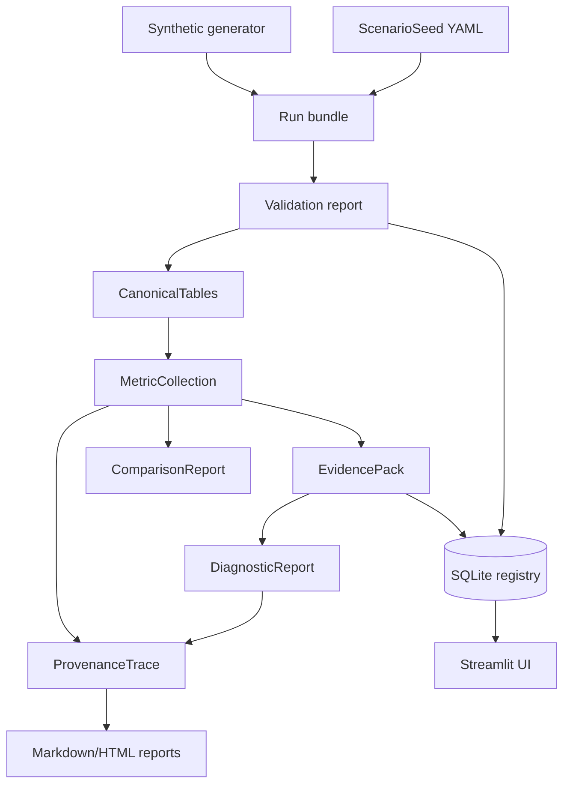

# TrafficTwin

TrafficTwin is an import-first research software prototype for reproducible urban traffic and vehicular edge-computing what-if analysis. It defines versioned scenario seeds, imports standard run bundles, validates and canonicalises source files, computes deterministic metrics, builds EvidencePacks, compares scenarios, evaluates deterministic diagnostic hypotheses, and traces results back to source rows through the Provenance Explorer. OffloadLens is the VEC analysis module inside the platform.

Status: standalone `v0.1.0` research prototype. The repository is usable without Randy's VEC environment, SUMO artifacts, external services, or live feeds. All bundled demonstration data is synthetic.

## Current Scope

Implemented:

- Scenario seed YAML schema and deterministic import/export.
- Capability manifest with `true`, `false`, and `unknown`.
- Directory and ZIP run-bundle loading with validation reports.
- Manifest-driven generic CSV canonicalisation.
- Deterministic task, infrastructure, traffic, trip, comparison, and aggregation metrics.
- EvidencePack generation.
- Deterministic diagnostic hypotheses R0-R3 over EvidencePacks.
- Read-only provenance traces from metrics/rules to source files and rows where available.
- SQLite metadata registry for seeds, experiments, runs, bundle imports, metrics, and evidence packs.
- Streamlit UI over the tested library.
- Standalone synthetic generator, demo workspace, one-click launch, and deterministic reports.

Not implemented:

- Randy/VEC or SUMO adapters.
- Direct simulator launch or asynchronous jobs.
- Real Manchester sensor ingestion.
- Near-live or true-live operation.
- LLM rendering, XAI, portfolio selection, or training orchestration.

## Ten-Minute Standalone Demo

Use Python 3.11 or newer. The examples assume the current directory is this repository root.

```bash
python3.12 -m venv .venv
source .venv/bin/activate
python -m pip install -e ".[dev]"
traffictwin demo initialise .demo
traffictwin demo status .demo
traffictwin demo launch .demo
```

The launch command starts:

```bash
streamlit run src/traffictwin/ui/app.py
```

with environment variables pointing the UI at `.demo/registry.sqlite` and `.demo/bundles`.

The demo workspace contains:

```text
.demo/
├── registry.sqlite
├── seeds/
├── bundles/
│   ├── baseline/
│   ├── stressed_demand/
│   ├── under_offloading/
│   ├── infrastructure_bottleneck/
│   ├── mixed_fault/
│   ├── partial_evidence/
│   └── trivial_multi_algorithm/
├── reports/
├── exports/
├── logs/
└── workspace.yaml
```

Every generated scenario is labelled synthetic. The generator is a controlled software fixture model; it is not a calibrated traffic, radio, VEC, SUMO, or Manchester model.

## Synthetic Demo Flow

1. Open Home and confirm the standalone demo badge and capability manifest.
2. Open Scenario Studio and export a seed YAML.
3. Open Bundle Import & Validation and validate `.demo/bundles/baseline`.
4. Validate `.demo/bundles/stressed_demand`.
5. Open Run Overview for baseline task and latency metrics.
6. Open Operations View and confirm `HISTORICAL REPLAY`.
7. Open Infrastructure & Congestion and inspect queue/utilisation.
8. Open What-if Compare and compare baseline against stressed demand.
9. Open Journey-Time Lens and inspect synthetic trip durations.
10. Open Evidence & Diagnostic Hypotheses for R0-R3 statuses.
11. Open Provenance Explorer and trace `task.completion.rate`.
12. Export an EvidencePack, DiagnosticReport, provenance trace, or research report.

Detailed scripts:

- [docs/standalone_demo.md](docs/standalone_demo.md)
- [docs/demo_script.md](docs/demo_script.md)
- [docs/demo_checklist.md](docs/demo_checklist.md)

## CLI Examples

Generate and verify standalone synthetic artifacts:

```bash
traffictwin synthetic presets
traffictwin synthetic generate-preset baseline --output /tmp/tt-baseline --overwrite
traffictwin synthetic experiment-generate-preset trivial_multi_algorithm \
  --seeds 1,2,3 \
  --output /tmp/tt-trivial \
  --overwrite
traffictwin synthetic verify .demo
```

Run the import-first workflow on any standard bundle:

```bash
traffictwin bundle validate .demo/bundles/baseline
traffictwin bundle import .demo/bundles/baseline --registry .demo/registry.sqlite
traffictwin metrics compute .demo/bundles/baseline
traffictwin evidence build .demo/bundles/baseline --output .demo/exports/evidence.json
traffictwin diagnose bundle .demo/bundles/under_offloading
```

Compare, trace, and report:

```bash
traffictwin compare .demo/bundles/baseline .demo/bundles/stressed_demand
traffictwin provenance metric .demo/bundles/baseline task.completion.rate
traffictwin provenance source .demo/bundles/baseline tasks.csv 2
traffictwin report run .demo/bundles/baseline --output .demo/reports/run.md
traffictwin report compare .demo/bundles/baseline .demo/bundles/stressed_demand \
  --output .demo/reports/comparison.md
traffictwin report full .demo/bundles/stressed_demand \
  --comparison-baseline .demo/bundles/baseline \
  --output .demo/reports/full.html
```

Complete CLI reference: [docs/cli_reference.md](docs/cli_reference.md).

## Architecture Overview

TrafficTwin is deliberately layered. UI and CLI commands call service/library functions; calculations stay in deterministic library modules; external uncertainty stays behind adapters and capability manifests.



For details, see [docs/architecture.md](docs/architecture.md) and [docs/system_overview.md](docs/system_overview.md).

## Feature Matrix

| Area | Status | Notes |
|---|---|---|
| Standalone demo workspace | Implemented | `traffictwin demo initialise PATH`. |
| Synthetic generator | Implemented | Deterministic for fixed config and seed; synthetic-only. |
| Generic bundle import | Implemented | Directory and safe ZIP bundles. |
| Validation reports | Implemented | Stable codes, severity, file/row/field context. |
| Canonical records | Implemented | In-memory canonical tables; no row database. |
| Deterministic metrics | Implemented | Unavailable metrics are explicit, never zero-filled. |
| EvidencePack | Implemented | Only supported input for diagnostic rules. |
| Diagnostic rules R0-R3 | Implemented | Candidate hypotheses, not proven causes. |
| Provenance Explorer | Implemented | CLI and Streamlit trace inspection. |
| Report export | Implemented | Deterministic Markdown and standalone HTML. |
| Streamlit UI | Implemented | Thin presentation layer. |
| CI workflow | Implemented | GitHub Actions example for Python 3.11 and 3.12. |
| Randy/VEC integration | Blocked | No real artifacts, schemas, units, or commands present. |
| SUMO integration | Blocked | No SUMO files or output samples present. |
| Direct launch | Unsupported | Capability remains `false`. |
| Near-live/true-live data | Not implemented | Must not be inferred from file recency. |

## Testing And Quality

```bash
.venv/bin/ruff format .
.venv/bin/ruff check .
.venv/bin/mypy
.venv/bin/python -m pytest
.venv/bin/python -m pytest --cov=traffictwin --cov-report=term-missing
.venv/bin/python -m build
```

Release smoke:

```bash
.venv/bin/python scripts/verify_release.py
```

The current test count and coverage are documented in [docs/reproducibility.md](docs/reproducibility.md) after the latest full quality-gate run.

## Repository Structure

```text
.
├── AGENTS.md
├── README.md
├── pyproject.toml
├── .github/workflows/ci.yml
├── docs/
├── examples/
│   ├── seeds/
│   └── standalone/
├── scripts/
├── src/traffictwin/
│   ├── canonical/
│   ├── config/
│   ├── demo/
│   ├── diagnostics/
│   ├── domain/
│   ├── evidence/
│   ├── ingestion/
│   ├── metrics/
│   ├── provenance/
│   ├── reporting/
│   ├── rules/
│   ├── storage/
│   ├── synthetic/
│   ├── ui/
│   └── validation/
└── tests/
```

## Data-Mode Disclaimer

All repository-contained run data is synthetic unless a future imported bundle explicitly says otherwise. The UI supports synthetic fixtures, imported historical bundles, and historical replay over timestamps. It does not support true live data, near-live data, or real Manchester feeds.

## External Integration Status

Phase 6A discovery found no real Randy/VEC or SUMO artifacts in the repository. There are no real schemas, units, output files, notebooks, checkpoints, job scripts, launch commands, or runtime measurements to build against. Integration documents under [docs/integration/](docs/integration/) list what must be requested before adapter implementation.

## Documentation Index

Start at [docs/index.md](docs/index.md). Key documents:

- [docs/standalone_demo.md](docs/standalone_demo.md)
- [docs/synthetic_data_model.md](docs/synthetic_data_model.md)
- [docs/report_export.md](docs/report_export.md)
- [docs/release_guide.md](docs/release_guide.md)
- [docs/provenance_explorer.md](docs/provenance_explorer.md)
- [docs/user_guide.md](docs/user_guide.md)
- [docs/developer_guide.md](docs/developer_guide.md)
- [docs/reproducibility.md](docs/reproducibility.md)
- [docs/viva_guide.md](docs/viva_guide.md)
- [docs/limitations_and_future_work.md](docs/limitations_and_future_work.md)

## Citation And Attribution Placeholder

Dissertation citation details are not final. Suggested placeholder:

> Abdulla Al Mamun Akash. TrafficTwin: an import-first research software prototype for traffic and vehicular edge-computing what-if analysis. MSc dissertation project, 2026.

## Licence Status

Licence not yet specified. No project licence file is currently present; do not assume reuse rights beyond the repository owner's permission until a licence is added.
