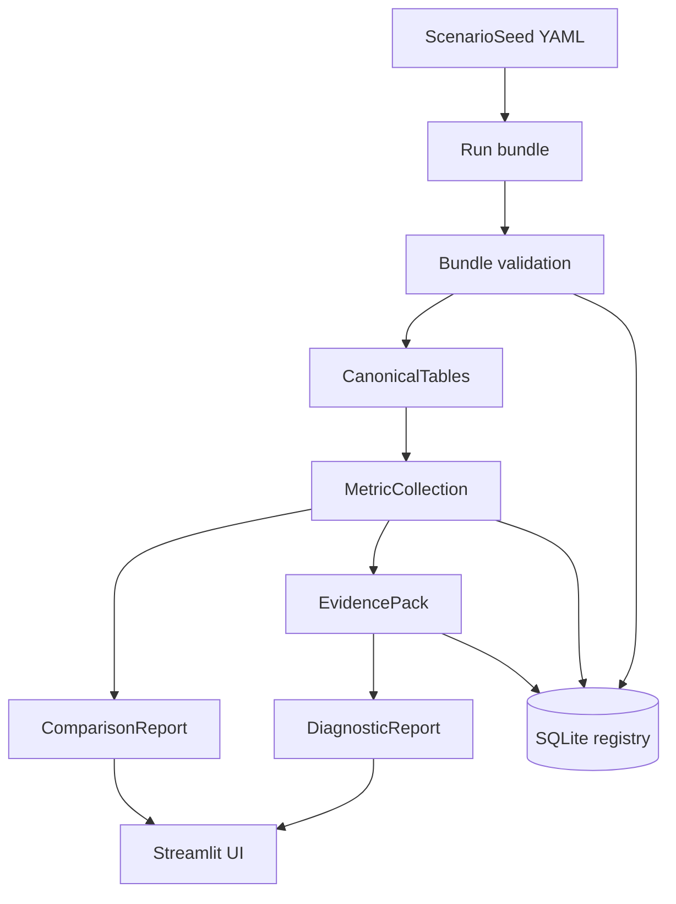

# TrafficTwin

TrafficTwin is an import-first research software prototype for reproducible urban traffic and vehicular edge-computing what-if experiments. It lets a user define a versioned scenario seed, import a completed run bundle, validate source files, canonicalise records, compute deterministic metrics, build a structured EvidencePack, compare baseline and variation runs, evaluate deterministic diagnostic hypotheses, and inspect provenance from displayed results back to source rows. OffloadLens is the VEC analysis module inside the platform.

Status: Phase 1-6A plus Provenance Explorer prototype. The current repository supports synthetic fixtures, generic run-bundle import, deterministic metrics, deterministic diagnostic hypotheses R0-R3, provenance tracing, a SQLite metadata registry, a Typer CLI, and a Streamlit UI. It does not include Randy's environment, SUMO adapters, Manchester sensor data, live data, near-live polling, external launchers, LLM rendering, XAI, or portfolio selection.

## Current Scope

Implemented:

- Scenario seed schema and deterministic YAML import/export.
- Capability manifest using `true`, `false`, and `unknown`.
- SQLite registry for seeds, experiments, runs, bundle imports, metric JSON, and evidence-pack JSON.
- Directory and safe ZIP run-bundle loading.
- Manifest-driven generic CSV validation and canonicalisation.
- In-memory canonical records for tasks, infrastructure, vehicles, traffic observations, trips, and incidents.
- Validation reports with stable machine-readable codes.
- Deterministic metrics over canonical records.
- EvidencePack generation.
- Baseline-versus-variation comparison.
- Deterministic diagnostic hypotheses R0-R3 over EvidencePacks.
- Read-only provenance tracing for metrics, diagnostic rules, run context, and CSV source rows.
- Streamlit UI over the tested library.
- Synthetic baseline, variation, partial, invalid-manifest, invalid-row, and diagnostic fault-injection fixtures.

Not implemented:

- Randy/VEC or SUMO adapters.
- Direct simulator launch.
- Asynchronous jobs.
- Real Manchester sensor ingestion.
- Near-live or true-live operation.
- LLM prose rendering.
- XAI or decision-time counterfactual analysis.
- Portfolio selection or training orchestration.

## Architecture Overview

TrafficTwin is deliberately layered. The UI and CLI call library services; library services call validation, metrics, evidence, and rules modules; external uncertainty stays behind adapters and capability manifests.



For details, see [docs/architecture.md](docs/architecture.md) and [docs/system_overview.md](docs/system_overview.md).

## Feature Matrix

| Area | Status | Notes |
|---|---|---|
| Seed YAML | Implemented | Version `1.0`; strict Pydantic validation. |
| Generic CSV bundle import | Implemented | Directory and ZIP bundles. |
| Synthetic fixtures | Implemented | Demonstration and tests only. |
| Validation reports | Implemented | Stable codes, severity, affected file/row/field. |
| Canonical in-memory records | Implemented | No canonical row database yet. |
| Deterministic metrics | Implemented | Missing evidence yields unavailable results. |
| EvidencePack | Implemented | Only supported input for diagnostics. |
| Diagnostic rules R0-R3 | Implemented | Candidate hypotheses, not proven causes. |
| Provenance Explorer | Implemented | Read-only trace from metrics/rules to definitions, canonical evidence, validation, source rows, and run context where available. |
| Streamlit UI | Implemented | Thin presentation layer over library services. |
| Registry | Implemented | SQLite metadata and JSON payload references. |
| Randy/VEC integration | Blocked | No real artifacts, schemas, units, or command contract present. |
| SUMO integration | Blocked | No SUMO files or output formats present. |
| Direct launch | Unsupported | Capability remains `false`. |
| Near-live/true-live data | Not implemented | Must not be claimed from file recency. |

## Quick Start

Use Python 3.11 or newer. The examples below assume the current directory is the repository root.

```bash
python3.12 -m venv .venv
source .venv/bin/activate
python -m pip install -e ".[dev]"
```

Validate the example scenario seed:

```bash
traffictwin validate-seed examples/seeds/arena_gridlock.yaml
```

Validate the synthetic baseline bundle:

```bash
traffictwin bundle validate tests/fixtures/bundles/baseline_valid
```

Compute metrics:

```bash
traffictwin metrics compute tests/fixtures/bundles/baseline_valid
```

Compare baseline and variation:

```bash
traffictwin compare \
  tests/fixtures/bundles/baseline_valid \
  tests/fixtures/bundles/variation_valid
```

Evaluate deterministic diagnostics:

```bash
traffictwin diagnose bundle tests/fixtures/bundles/baseline_valid
```

Trace a metric back to source evidence:

```bash
traffictwin provenance metric tests/fixtures/bundles/baseline_valid task.completion.rate
```

Launch the UI:

```bash
streamlit run src/traffictwin/ui/app.py
```

## Synthetic Demo Walkthrough

The demo uses only repository fixtures:

- Baseline bundle: `tests/fixtures/bundles/baseline_valid`
- Variation bundle: `tests/fixtures/bundles/variation_valid`
- Partial-evidence bundle: `tests/fixtures/bundles/partial_valid`
- Diagnostic cases: `tests/fixtures/diagnostics/cases.json`

Recommended flow:

1. Launch Streamlit.
2. Open Home and confirm the prototype notice and capability manifest.
3. Open Scenario Studio and export the example seed YAML.
4. Open Bundle Import & Validation and validate the baseline bundle.
5. Validate the variation bundle.
6. Open Run Overview for baseline task and latency metrics.
7. Open Operations View and check the `HISTORICAL REPLAY` label.
8. Open Infrastructure & Congestion and inspect queue/utilisation charts.
9. Open What-if Compare and compare baseline against variation.
10. Open Journey-Time Lens and inspect synthetic trip-duration metrics.
11. Open Evidence & Diagnostic Hypotheses and download JSON if needed.
12. Open Provenance Explorer and trace `task.completion.rate` to `tasks.csv` rows.

Full scripts:

- [docs/demo_script.md](docs/demo_script.md)
- [docs/demo_checklist.md](docs/demo_checklist.md)

## CLI Examples

```bash
traffictwin capabilities
traffictwin registry init data/registry/traffictwin.sqlite
traffictwin registry inspect data/registry/traffictwin.sqlite
traffictwin bundle inspect tests/fixtures/bundles/partial_valid
traffictwin bundle import tests/fixtures/bundles/baseline_valid --registry data/registry/traffictwin.sqlite
traffictwin bundle report tests/fixtures/bundles/partial_valid --format json
traffictwin metrics report tests/fixtures/bundles/variation_valid --format json
traffictwin evidence build tests/fixtures/bundles/baseline_valid --output evidence-baseline.json
traffictwin diagnose report tests/fixtures/bundles/baseline_valid --format json
traffictwin diagnose evaluate tests/fixtures/diagnostics/cases.json
traffictwin provenance metric tests/fixtures/bundles/baseline_valid task.completion.rate
traffictwin provenance source tests/fixtures/bundles/baseline_valid tasks.csv 2
traffictwin provenance export tests/fixtures/bundles/baseline_valid --root-type metric --root-id task.completion.rate --format markdown
```

Complete CLI reference: [docs/cli_reference.md](docs/cli_reference.md).

## Repository Structure

```text
.
├── AGENTS.md
├── README.md
├── pyproject.toml
├── docs/
├── examples/
│   └── seeds/
├── scripts/
│   └── generate_reference_docs.py
├── src/
│   └── traffictwin/
│       ├── adapters/
│       ├── canonical/
│       ├── config/
│       ├── diagnostics/
│       ├── domain/
│       ├── evidence/
│       ├── experiments/
│       ├── ingestion/
│       ├── metrics/
│       ├── provenance/
│       ├── rules/
│       ├── storage/
│       ├── ui/
│       └── validation/
└── tests/
    ├── fixtures/
    ├── golden/
    ├── integration/
    ├── ui/
    └── unit/
```

## Testing And Quality

```bash
.venv/bin/ruff format .
.venv/bin/ruff check .
.venv/bin/mypy
.venv/bin/python -m pytest
.venv/bin/python -m pytest --cov=traffictwin --cov-report=term-missing
.venv/bin/python scripts/generate_reference_docs.py
```

At the latest provenance productisation pass, the suite reported 147 tests passing and 77% coverage. Treat the exact numbers as a checked snapshot, not a permanent target.

## Data-Mode Disclaimer

All included run data is synthetic unless a future document explicitly says otherwise. The current prototype supports:

- `SYNTHETIC` fixtures;
- imported historical bundles;
- historical replay over imported timestamps.

It does not support true live data, near-live data, or real Manchester feeds.

## External-Integration Status

Phase 6A discovery found no real Randy/VEC or SUMO artifacts in the repository. There are no real schemas, units, output files, notebooks, checkpoints, job scripts, launch commands, or runtime measurements to build against. Integration documents under [docs/integration/](docs/integration/) list exactly what must be requested before adapter implementation.

## Documentation Index

Start at [docs/index.md](docs/index.md). Key documents:

- [docs/system_overview.md](docs/system_overview.md)
- [docs/architecture.md](docs/architecture.md)
- [docs/user_guide.md](docs/user_guide.md)
- [docs/developer_guide.md](docs/developer_guide.md)
- [docs/api_reference.md](docs/api_reference.md)
- [docs/cli_reference.md](docs/cli_reference.md)
- [docs/reproducibility.md](docs/reproducibility.md)
- [docs/provenance_explorer.md](docs/provenance_explorer.md)
- [docs/viva_guide.md](docs/viva_guide.md)
- [docs/limitations_and_future_work.md](docs/limitations_and_future_work.md)

## Citation And Attribution Placeholder

Dissertation citation details are not final. Suggested placeholder:

> Abdulla Al Mamun Akash. TrafficTwin: an import-first research software prototype for traffic and vehicular edge-computing what-if analysis. MSc dissertation project, 2026.

## Licence Status

No project licence file is currently present. Do not assume reuse rights beyond the repository owner's permission until a licence is added.
