# TrafficTwin Architecture

This document describes the architecture implemented through the immutable v0.6 release, including
the standalone platform, Provenance Explorer, evidence-gated TOS/VEC integration, request-specific
foreground VEC execution, and controlled synthetic SUMO execution. It is grounded in the current
repository and the canonical future design at
[docs/traffictwin-design-v0_7.md](traffictwin-design-v0_7.md). The
[v0.6 specification](traffictwin-design-v0_6.md) records the implemented release boundary and the
[v0.5 specification](traffictwin-design-v0_5.md) records its import-first expansion baseline. The
implemented system does not yet claim Manchester source adapters, a live city-road feed,
observation-to-SUMO calibration, or the v0.7 product redesign. The generic bundle adapter admits
explicitly declared CSV, gzip-CSV, and flat scalar Parquet inputs.

The full v0.5 comparison/statistics group is implemented: STA-01 paired study, STA-02 N-way policy
ranking, STA-03 paired equivalence, STA-04 regression gates, and STA-05 prospective paired power
planning. PRO-01 compatible accepted-row difference lineage, PRO-02 bounded path-safe DOT/GraphML
trace projection, PRO-03 explicit report-claim completeness, and EXP-01 bounded parameter-sweep
composition are implemented. EXP-02 implements a bounded deterministic scenario-mutation
boundary over validated, explicitly labelled synthetic/evaluation bundles. EXP-03 implements a
separate bounded generated-observation noise/dropout layer with a typed manifest audit. The
REP-01 renderer-only LaTeX/static-figure export layer, REP-02 append-only typed analyst-annotation
layer, REP-03 prose-free structured report diff layer, REP-04 deterministic one-page executive
projection, and REP-05 bounded read-only registry/report search are implemented over completed
local artifacts. OPS-01 provides the five-version transactional SQLite migration boundary and
OPS-02 provides a content-addressed, fail-closed Parquet cache for accepted ordinary generic
canonical tables. OPS-03 adds an always-read-only typed environment/workspace/registry/cache
doctor with explicit optional and blocked capability states. OPS-04 adds permission-aware,
deterministic attached RO-Crate publication over the complete ordinary generic artifact pipeline.
OPS-05 adds a closed runtime-checkable external-source interface whose public SUMO and TOS
reference adapters retain distinct discovery, semantics, provenance, conversion, and blocker
truth. The bounded
declarative rule layer, its R7 reference rule, and the contract-gated R8 energy candidate are
implemented. The diagnostics layer also implements verified single-boundary nearest flips for
eligible R5/R7/R8 results and a complete-grid deterministic Streamlit threshold explorer over the
same contracted axes. DIA-07 adds a bounded typed relationship pass over completed RuleResults;
it retains originals and admits only the static R1/R2, R1/R4, and R0-blocker policies.
Evidence-blocked source-specific extensions remain unavailable until their own contracts and
acceptance gates exist; the implemented architecture and capability manifest remain exactly as
described below.

## Architectural Position

TrafficTwin is a tested Python research-software library with a thin Streamlit interface and Typer CLI. The guaranteed workflow is import-first:

```text
seed YAML -> run bundle -> validation -> canonical records -> metrics -> EvidencePack -> diagnostics/provenance/UI
```

Direct launch is an adapter capability, not a default feature.

## A. High-Level Platform Architecture

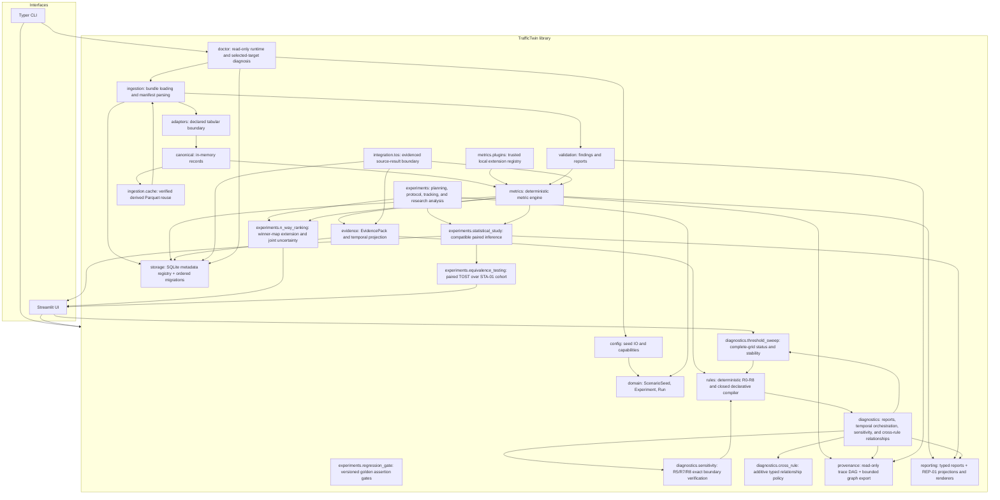

## Layer Responsibilities

| Layer | Modules | Responsibility |
|---|---|---|
| Configuration | `src/traffictwin/config/` | Seed YAML loading/dumping and capability manifests. |
| Domain | `src/traffictwin/domain/` | `ScenarioSeed`, `Experiment`, `Run`, strict validation, and versioned energy/fairness semantic policies. |
| Experiment research | `src/traffictwin/experiments/` | Validated plans, protocol export/matching, manual slot tracking, compatibility-checked experiment EvidencePacks and winner maps, transparent portfolio/held-out evaluation, STA-01 paired studies, STA-02 per-family common-seed N-way rankings, STA-03 paired TOST, STA-04 golden-contract regression gates, and STA-05 prospective paired common-seed power planning. |
| Ingestion | `src/traffictwin/ingestion/` | Bundle loading, manifest parsing, fingerprints, validation orchestration, and OPS-02 content-addressed canonical-table caching outside raw bundles. |
| Adapters | `src/traffictwin/adapters/`, `src/traffictwin/integration/external/` | Raw source interpretation at boundaries. The generic adapter supports manifest-declared CSV, gzip-CSV, and flat scalar Parquet. OPS-05 publishes a closed read-only discovery/contract/validation/inspection protocol over the separate SUMO and TOS reference adapters. |
| Canonical | `src/traffictwin/canonical/` | In-memory canonical record models and table container. |
| Validation | `src/traffictwin/validation/` | Stable codes, findings, reports, and reconciliation helpers. |
| Metrics | `src/traffictwin/metrics/` | Deterministic whole-run and fixed-window metric definitions/calculators, comparison, aggregation, and explicit trusted local plugin admission/execution. |
| Evidence | `src/traffictwin/evidence/` | Versioned EvidencePack construction, data-readiness summaries, and optional typed temporal projection from existing window artifacts. |
| Rules | `src/traffictwin/rules/` | Deterministic R0-R8 and trusted-local closed declarative rule evaluation over EvidencePack only. |
| Diagnostics | `src/traffictwin/diagnostics/` | DiagnosticReport schema/serialisation, temporal orchestration, typed verified R5/R7/R8 nearest-flip analysis, complete-grid threshold-sensitivity reports, and additive DIA-07 relationships over retained RuleResults. |
| Provenance | `src/traffictwin/provenance/` | Read-only trace graph, source-row preview, complete single-run eligibility ledgers, compatible PRO-01 arithmetic/lineage-only difference reports, PRO-02 bounded path-safe DOT/GraphML exports, and PRO-03 typed report-claim completeness. |
| Parameter sweeps | `src/traffictwin/experiments/parameter_sweep.py` | Closed bounded seed/synthetic grid expansion, labelled local synthetic materialisation, explicitly unexecuted external requests, and provenance-bearing numeric response surfaces. |
| Scenario mutations | `src/traffictwin/experiments/scenario_mutation.py` | One closed deterministic row-dropout, timestamp-jitter, or RSU-removal operator over a copied validated synthetic/evaluation CSV bundle, with exact row/file ledgers and transactional output. |
| Measurement imperfections | `src/traffictwin/domain/measurement.py`, `src/traffictwin/synthetic/measurement.py` | Strict EXP-03 config/audit contract plus independently hash-derived bounded noise and exact dropout over copied generated observation rows. |
| Rendering | `src/traffictwin/rendering/` | Constrained deterministic prose over already-computed diagnostic findings. |
| Reporting | `src/traffictwin/reporting/`, `src/traffictwin/annotations.py` | Markdown, standalone HTML, and A4 PDF rendering over `ResearchReport`; bounded REP-01 LaTeX/static figures; REP-02 typed append-only analyst history outside computed claims; REP-03 compatibility-gated typed claim/section diffs that exclude rendered prose; and REP-04 bounded supervisor summaries with complete caveat retention and verified one-page PDF layout. |
| Search | `src/traffictwin/registry_search.py` | REP-05 on-demand six-category, bounded, path-redacted lexical projection over read-only registry and direct report records, with fixed ranking/ties and result fingerprints. |
| Case studies | `src/traffictwin/case_studies/` | Checksummed synthetic baseline/incident/infrastructure evidence packs. |
| Evaluation | `src/traffictwin/evaluation/` | Validation and descriptive analysis of explicitly labelled synthetic mock participant results. |
| Storage | `src/traffictwin/storage/` | SQLite registry for metadata/JSON payload references plus OPS-01 versioned, checksummed, transactional schema migration and read-only status inspection. |
| Operations | `src/traffictwin/doctor.py` | OPS-03 typed read-only Python/dependency, integration, capability, workspace, registry, permission, and canonical-cache diagnosis with no installer or repair path. |
| Research objects | `src/traffictwin/research_object.py` | OPS-04 strict request/policy/inventory models, deterministic RO-Crate/CFF/checksum renderers, bounded offline verification, and atomic ZIP publication over existing typed artifacts. |
| UI | `src/traffictwin/ui/` | Streamlit presentation and UI services over library calls. |
| Product UX | `src/traffictwin/ui/pages/` and `src/traffictwin/ui/components/` | Scenario Builder, Experiment Manager, Reports, Search, Settings, About, replay controls, and reusable presentation helpers. |
| TOS integration | `src/traffictwin/integration/tos/` | Versioned source contract, read-only validation/import, evaluation/training analysis, unit-aware replay, source task/RSU summaries, audit, aggregate exports, partial evidence, and provenance. |

## Dependency Direction

Dependencies flow inward from interfaces to library modules. Metrics do not read raw files. Rules do not read raw files or canonical rows. Provenance does not recompute metrics or reinterpret rules. The UI does not implement metrics, validation, comparison, diagnostic formulas, or provenance derivation logic.

R6 follows the same boundary: the window engine first creates a complete, fingerprinted
`WindowedMetricSeries`; the evidence layer projects one eligible scalar metric without dropping
gaps; the ordinary rule engine consumes only the resulting `EvidencePack`. A declared event is
context, not an inferred finding.

Nearest-flip analysis also stays behind the EvidencePack boundary. It evaluates one selected
R5/R7/R8 result, derives the exact supported inclusive threshold from the admitted RuleResult,
retains discrete support, and invokes the same rule engine with an in-memory one-field candidate.
It never reads rows, persists a threshold, or searches unlike configuration units.

DIA-06 reuses that monotonicity boundary without calculating status in Streamlit. The library
generates a bounded inclusive grid, temporarily changes only the contracted threshold, invokes the
ordinary rule engine for every point with one timestamp, and returns the complete typed sequence.
Sampled adjacent transitions stay distinct from the exact DIA-05 artifact. Complete-config import
and export are explicit session actions; neither the service nor page writes registry/default state.

DIA-07 runs only after every enabled ordinary rule has produced a completed `RuleResult`. It reads
those typed outputs—not raw files, canonical rows, or metrics—and returns a separate additive
relationship artifact. Exact declared key overlap gates fixed pairs; R0 suppression uses only its
explicit `blocked_rules` metadata. The artifact cannot change a status/confidence or remove a
result. Legacy conflict prose is derived from typed conflict relationships.

STA-01 is separate from diagnostic evaluation and does not use an EvidencePack. The experiment
plan and already-computed `MetricCollection` artifacts enter a compatibility/pairing gate; only
exact common-random-seed pairs enter the predeclared estimand. The library then calculates the
paired estimate, seeded bootstrap, sign-flip test, and paired effect sizes. The CLI and UI only
select a registered plan and render/download the typed artifact. The service reads no raw rows,
recomputes no metric, changes no collection, and performs no causal attribution.

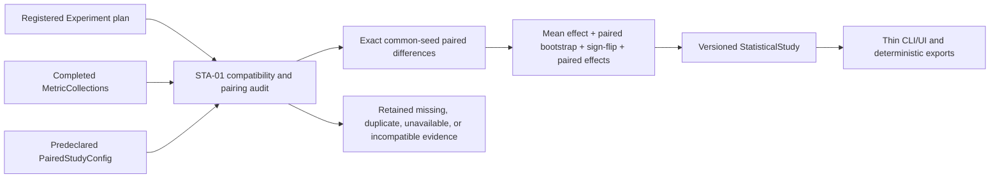

STA-02 uses the same registered experiment and completed-metric boundary. It forms complete
random-seed rows containing every selected policy independently inside each scenario family,
excludes incompatible rows, and delegates descriptive order/ties/regret to `build_winner_map`.
Only families with at least three complete compatible rows receive joint paired-bootstrap mean and
rank uncertainty. The UI/CLI never calculate ranks or intervals.

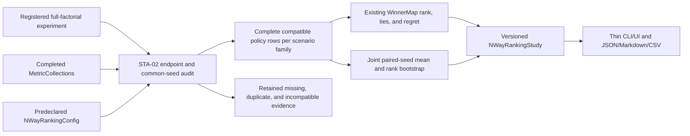

STA-03 reuses the complete STA-01 pairing service rather than defining a second compatibility
path. `EquivalenceStudyConfig` supplies the same registered selection plus a positive symmetric
original-unit margin, declared basis/justification, optional required literature reference, and
alpha. Only an available STA-01 cohort with at least three pairs and positive finite difference
variance reaches paired-mean TOST. Both one-sided nulls must reject, and the corresponding
`1 - 2 alpha` Student-t interval must lie strictly inside the margin. The source paired-study
fingerprint, observations, audit, and input fingerprints are copied into the STA-03 artifact.

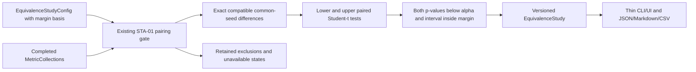

STA-04 consumes a completed `MetricCollection` or STA-01 `StatisticalStudy` plus an approved
`RegressionGoldenContract`. The golden declares typed context, exact or compatible-context source
identity, stable scalar selectors, expected values, units/versions, and absolute/relative
tolerances. The core applies the inclusive `max(absolute, relative × |expected|)` boundary and
returns pass only when every assertion is available and inside tolerance. Context, source,
unit/version, missing, partial, or non-finite evidence is unavailable; complete out-of-tolerance
evidence fails. Candidate goldens cannot pass, and the evaluator never mutates its subject,
registry, source, or golden.

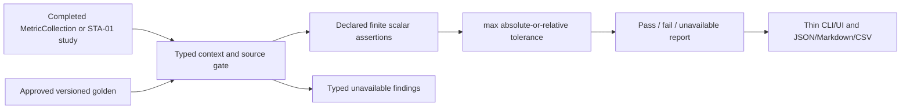

STA-05 is prospective and deliberately does not consume completed results. A strict
`PowerAnalysisConfig` records a researcher-declared target paired effect, prospective
paired-difference variance, alpha, target power, input bases, labels, and a bounded replicate
search. The deterministic core evaluates two-sided normal-approximation power and returns the
smallest qualifying integer with `n - 1` verification. The UI and CLI only collect and render this
typed plan. They do not infer an effect/variance, calculate retrospective power, launch runs, or
turn the estimate into a guarantee.

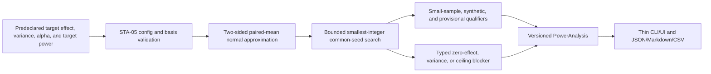

PRO-01 reuses both the ordinary metric-comparison gate and the complete single-run accepted-row
ledger. It never recomputes a metric or matches unrelated row IDs. A closed registry calculates
direct row terms only for admitted scalar count/sum/mean/rate formulas; the signed sum must
reconcile to the ordinary delta. Every other compatible scalar aggregate retains both eligibility
ledgers with null row weights. Incompatible and mapping-valued comparisons stay unavailable. The
CLI and **What-if Compare** page render the same `DifferenceContributionReport`, including its
mandatory non-causality statement.

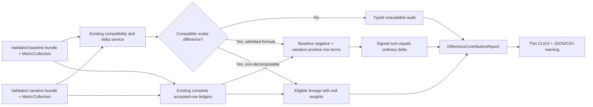

PRO-02 consumes one completed `ProvenanceTrace` and changes no lineage semantics. A deterministic
root-centred traversal retains a bounded neighbourhood, preserves direction on retained edges,
reports exact omissions, removes volatile timestamps, and applies the selected path-safe disclosure
profile. The same typed `ProvenanceGraphView` feeds DOT, GraphML, the CLI, and Streamlit; renderer
layout is explicitly outside the research artifact.

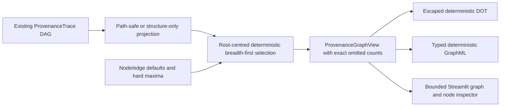

PRO-03 consumes the typed claim inventory produced beside each deterministic report. It never
parses rendered text. Every referenced unavailable result remains in the denominator; named
non-claim categories are published separately. Metric completeness combines directed trace depth
with the complete accepted-row ledger, rules require complete cited metric dependencies, and
comparisons require complete PRO-01 ledgers on both sides. The same immutable report feeds JSON,
CSV, CLI summaries, and static Streamlit tables.

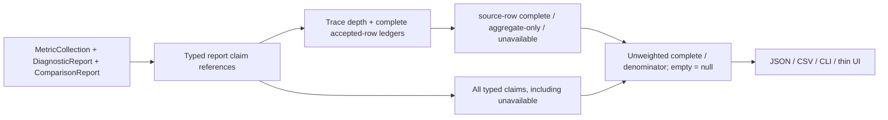

### Parameter-sweep boundary

EXP-01 sits above strict `ScenarioSeed`/`SyntheticScenarioConfig` schemas and below the ordinary
synthetic bundle, validation, and metric services. `expand_parameter_sweep` is a pure complete-grid
operation: it checks the four-axis/16-value/256-point limits, applies only closed parameter paths,
validates the published value ranges and every derived snapshot, enforces the complete local
2,000,000 declared-row estimate, and derives ordered point/seed fingerprints without filesystem
mutation.

`execute_parameter_sweep` materialises the complete expansion in a temporary sibling directory.
Seed mode writes only parent-linked seed snapshots. Local mode delegates to
`write_synthetic_bundle`, `validate_bundle`, and `compute_metrics_for_bundle`; it does not contain
a second generator, validator, or metric formula. External mode writes `ExternalRunRequest`
artifacts whose status is `not_executed`, whose direct-launch support is false, and whose launcher
and command are null. It is not an asynchronous queue.

The long-form response surface accepts finite numeric values from selected core metrics and
retains ordinary unavailable/partial/invalid status and reasons. Full assignments and
seed/bundle fingerprints travel with every row. Mapping values are not silently flattened, and
seed-only/external modes do not fabricate response rows. The exact destination is replaced only
after a complete successful materialisation and only with explicit overwrite. All points remain
synthetic/evaluation evidence; raw/base artifacts are not changed.

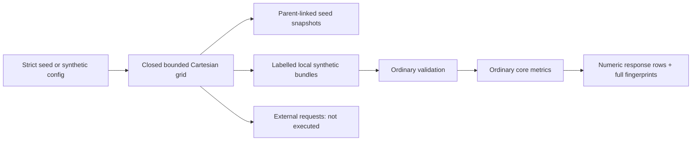

### Scenario-mutation boundary

EXP-02 consumes one ordinarily valid bundle whose source or execution label explicitly identifies
synthetic/evaluation evidence. It rejects imported/raw evidence, inferred/canonicalised manifests,
source symlinks, undeclared tables, and compressed or Parquet mutation targets. The selected target
must be a declared uncompressed CSV table. Every non-target source file is copied byte-for-byte;
the parent bundle remains read-only.

One request applies exactly one closed operator: deterministic row dropout, bounded common-delta
timestamp jitter, or exact-ID RSU removal. The first two derive per-row choices from SHA-256 plus
the declared seed rather than process-global randomness. RSU removal deletes matching
`infra_state` rows and updates declared scenario failure/count metadata where available; it does
not reroute tasks, rewrite target IDs, or imply simulator behaviour. The complete changed-row
ledger is never truncated: requests exceeding its 20,000-row bound are rejected before output.

`plan_scenario_mutation` performs the complete admission and mutation plan without writing.
`execute_scenario_mutation` copies into a temporary sibling directory, writes the exact request and
mutation manifest beside the derived `bundle/`, runs ordinary bundle validation, verifies the
planned fingerprint, and only then atomically publishes the destination. Results explicitly state
that evidence is synthetic, the raw source was not changed, and no external launch occurred.

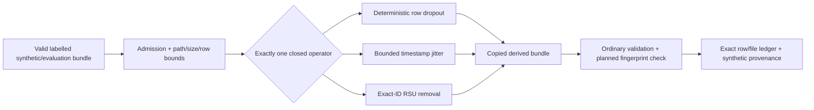

### Measurement-imperfection boundary

EXP-03 is inside the existing synthetic generator and before ordinary bundle writing. A strict
`SyntheticMeasurementImpairmentConfig` targets only enabled generated observation streams. The
clean generator first computes every task, trip, incident, and observation row. The measurement
layer copies the row tables, selects exact dropout rows by stable SHA-256 rank, then derives each
enabled field's bounded error independently from the retained clean row and original generated-row
index. It neither reads nor mutates an imported bundle.

`SyntheticMeasurementImpairmentAudit` reconciles the configuration with exactly the expected field
and dropout audits before fingerprint validation. The bundle manifest then requires synthetic
execution/source labels and every referenced observation declaration. The ordinary validator,
canonical adapter, metrics, diagnostics, reports, and provenance receive a normal bundle; no
duplicate analysis formula exists in the CLI or Scenario Builder.

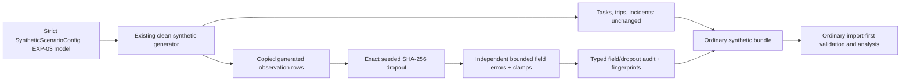

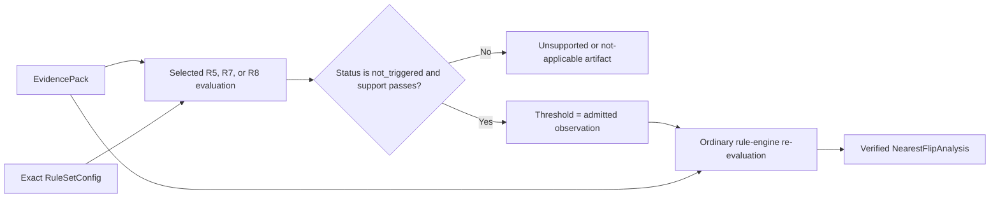

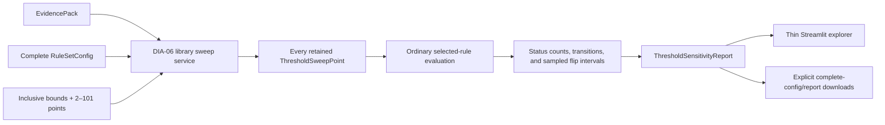

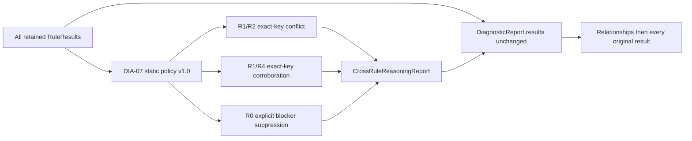

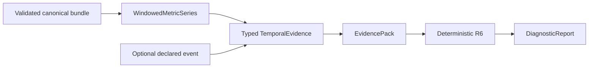

Declarative rules follow the same dependency direction. Static YAML is parsed into a strict typed
definition, compiled into an ordinary rule, and evaluated only against
`EvidencePack.metric_collection`. R7's selected vehicle-tier or exact target-RSU metric is never
recomputed by the rule or UI.

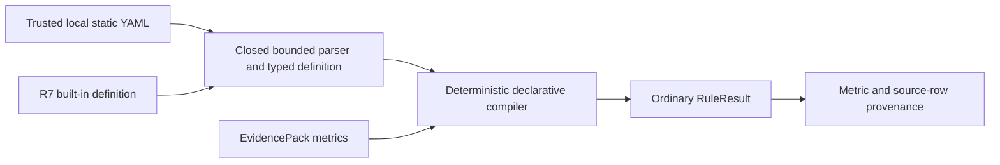

R8 follows the ordinary core-rule path and never reads task rows. `MET-03` first produces the exact
contract-gated energy value and completed-task denominator. R8 admits their version, fingerprint,
units, complete coverage, counts, and consistency before applying the configured boundary.

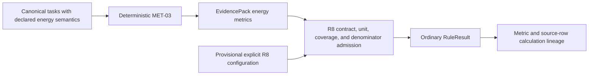

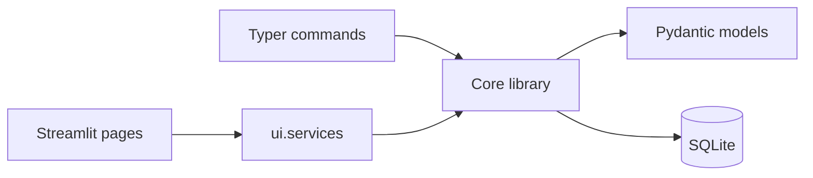

## B. Import Pipeline

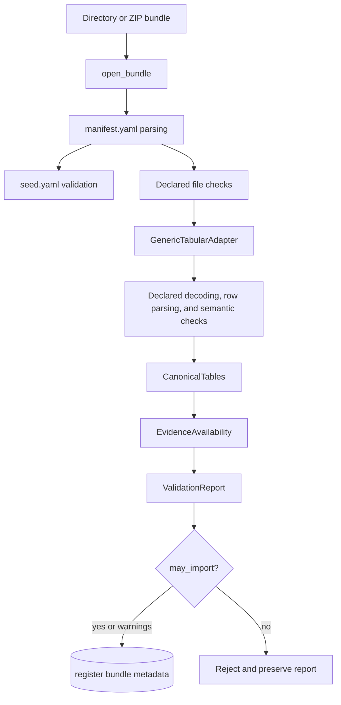

Bundle loading supports directories and ZIP files. ZIP extraction rejects absolute paths, path
traversal, and symlinks, and works in a controlled temporary directory. Individual generic tables
declare `format` and optional outer `compression`; `ING-03` admits plain CSV, gzip-CSV, and flat
scalar Parquet through the same downstream contracts. Exact raw bytes remain the fingerprint and
registry identity, while golden tests establish canonical/metric equivalence across encodings.

## Canonical Records

Canonical records are Pydantic models in [src/traffictwin/canonical/records.py](../src/traffictwin/canonical/records.py):

- `TaskRecord`
- `InfrastructureRecord`
- `VehicleStateRecord`
- `TrafficObservationRecord`
- `TripRecord`
- `IncidentRecord`

Every record preserves `source_file` and `source_row`. For generic tabular inputs, `source_row` is
the one-based data-record ordinal plus the historical header offset, so the first record is `2`
for CSV, gzip-CSV, and Parquet. Missing optional source fields remain absent
or null. Full canonical rows are not stored in SQLite. The TOS source-summary path does not create
canonical records because source task counts, task identities, RSU semantics, and units are not yet
sufficiently evidenced; it records that boundary explicitly instead.

## Validation

Validation runs before metrics. It produces `ValidationReport`, a serialisable report with:

- status: `accepted`, `accepted_with_warnings`, or `rejected`;
- `may_import`;
- stable validation findings;
- files inspected;
- canonical record counts;
- available and unavailable evidence categories.

Validation continues where safe so a user sees a complete report rather than only the first problem.

## Metrics

Metrics are deterministic functions over `CanonicalTables`, `RunMetricContext`, `EvidenceAvailability`, and `MetricEngineConfig`.

Key properties:

- stable metric definitions;
- no mutation of canonical records;
- unavailable metrics are explicit;
- no `NaN` or infinity in JSON;
- synthetic-demo saturation threshold is configurable and documented.
- task-latency P50/P95/P99 share the versioned `linear-rank-n-minus-1-v1` method and explicit
  sample-count/minimum metadata; unmet configured minima are unavailable, never zero;
- task-energy metrics require a strict manifest `TaskEnergyContract`; missing values are excluded,
  negative values are rejected, and comparisons require matching semantic fingerprints;
- operational fairness metrics use a strict `OperationalFairnessPolicy`; every admitted group has
  exact membership, complete coverage, minimum support, and policy/group-set fingerprints;
- per-RSU task outcomes and vehicle grid summaries require independent strict target/grid
  contracts; exact joins and complete coordinate coverage precede every grouped output;
- custom metrics require an explicit strict registry contract, receive only declared deep-copied
  canonical inputs, pass two-run repeatability and closed-output validation, and fail independently;

`metrics.windowed` filters every canonical table into aligned half-open `[start,end)` slices and
calls the same metric engine for each included slice. `WindowedMetricSeries` records the window
configuration, explicit/inferred range, table anchors, edge coverage, partial/empty dispositions,
source counts, availability, fingerprint, and per-window `MetricCollection`. It does not mutate or
replace the ordinary whole-run collection.

```mermaid
flowchart LR
    Canonical[CanonicalTables] --> WindowContract[WindowedMetricConfig]
    WindowContract --> Filter[Versioned table-anchor filter]
    Filter --> Slice[Half-open canonical slice]
    Slice --> ExistingEngine[Existing deterministic metric engine]
    ExistingEngine --> Series[WindowedMetricSeries]
    Series --> TemporalUI[Temporal Metrics UI]
    Series --> WindowTrace[Window trace and complete row ledger]
```

Tasks are assigned by arrival, trips by departure, and observation tables by timestamp. Coverage
means requested-range overlap, not sensor completeness. Empty windows remain visible and
unavailable; excluded partial edges remain visible without a metric collection. See
[ADR-016](decisions/ADR-016-fixed-window-metric-semantics.md).

### Contract-gated task energy

The generic adapter may canonicalise `energy_j` only from an explicitly declared `J` source unit,
but unit conversion alone does not establish quantity or denominator meaning. A manifest-level
`TaskEnergyContract` therefore gates all three canonical outputs: mean energy per observed task,
mean energy per completed task, and mean completed-task energy-delay product. The metric engine
records eligible/population counts, coverage, contract version, and contract fingerprint.

```mermaid
flowchart LR
    Source["Declared task energy in J"] --> Canonical["TaskRecord.energy_j"]
    Contract["TaskEnergyContract v1.0"] --> Gate{"Semantic contract present?"}
    Canonical --> Gate
    Gate -->|yes| Family["Three deterministic energy metrics"]
    Gate -->|no| Unavailable["Explicit unavailable reason"]
    Family --> Compare{"Fingerprints match?"}
    Compare -->|yes| Delta["Compatible comparison"]
    Compare -->|no| Incompatible["Pair incompatible"]
```

Generated synthetic bundles declare this contract because their generator owns the modelled
field semantics. Existing fixtures without the declaration remain unavailable. The current SUMO
and TOS source boundaries do not satisfy it: the TOS per-arrival aggregate remains a distinct
source-specific metric. See [ADR-018](decisions/ADR-018-contract-gated-task-energy-metrics.md).

### Evidence-gated operational fairness

`metrics.fairness` owns the grouped completion-rate and capacity-normalised-load family. It joins
tasks to exact vehicle IDs whose tier is non-empty and stable inside the metric scope, or groups
eligible infrastructure observations by exact RSU ID. `OperationalFairnessPolicy` v1.0 requires
two groups, two observations per observed group, and complete coverage before any group value,
maximum gap, or Jain index is released.

```mermaid
flowchart LR
    Canonical["Canonical task, vehicle, and infrastructure rows"] --> GroupGate{"Exact stable groups, support, and coverage?"}
    Policy["OperationalFairnessPolicy v1.0"] --> GroupGate
    GroupGate -->|yes| Outputs["Grouped means, maximum gap, and Jain index"]
    GroupGate -->|no| Unavailable["Explicit coverage/support reason"]
    Outputs --> Compare{"Policy and group-set fingerprints match?"}
    Compare -->|yes| Delta["Compatible scalar comparison"]
    Compare -->|no| Incompatible["Pair incompatible"]
```

Vehicle tier is an operational compute/resource label, not a protected or demographic attribute.
Equal load or completion rates do not establish good outcomes or causal fairness. The current SUMO
and TOS boundaries do not provide a compatible contract and remain unavailable. See
[ADR-019](decisions/ADR-019-evidence-gated-operational-fairness.md).

### Contract-gated spatial and per-RSU breakdowns

`metrics.spatial` has two deliberately separate inputs. `TaskRsuTargetContract` declares that a
canonical V2I `target_id` is the observed executing RSU and requires an exact match to an in-scope
canonical `rsu_id` for every V2I task. `VehicleSpatialGridContract` declares a named metre-based
source frame, fixed origin/cell geometry, and vehicle-position observation semantics. Requiring one
contract never silently supplies the other.

```mermaid
flowchart TD
    Tasks["Canonical V2I tasks"] --> TargetGate{"Target contract and complete exact RSU joins?"}
    Infra["Canonical RSU IDs"] --> TargetGate
    TargetContract["TaskRsuTargetContract v1.0"] --> TargetGate
    TargetGate -->|yes| RsuOutputs["Count, completion, and completed-observed miss by target RSU"]
    TargetGate -->|no| TargetUnavailable["Explicit target contract/coverage/join reason"]
    Vehicles["Canonical vehicle x/y/speed rows"] --> GridGate{"Grid contract and complete finite x/y?"}
    GridContract["VehicleSpatialGridContract v1.0"] --> GridGate
    GridGate -->|yes| GridOutputs["Observations, distinct vehicles, and speed by source-frame cell"]
    GridGate -->|no| GridUnavailable["Explicit coordinate contract/coverage reason"]
```

Fixed windows filter task, infrastructure, and vehicle tables independently before these gates.
No task position, nearest RSU, route, CRS, geographic area, or causal attribution is inferred.
Current SUMO/TOS source boundaries do not satisfy the contracts. See
[ADR-020](decisions/ADR-020-contract-gated-spatial-and-rsu-breakdowns.md).

### Trusted local metric extensions

`metrics.plugins` is a deliberate developer boundary over the ordinary engine. A registry is
constructed in application code and passed explicitly; no registry is discovered from uploaded
files, arbitrary module names, or ambient entry points. Registration validates key namespace,
version consistency, definition/input alignment, canonical fields, availability policy, output
schema, provenance mapping, and window anchor before any function is called.

```mermaid
flowchart LR
    Contract["PluginMetricContract"] --> Registry["Explicit MetricPluginRegistry"]
    Function["Reviewed local callable"] --> Registry
    Registry --> Admission["Evidence and declared-row admission"]
    Admission --> Copies["Fresh deep-copied canonical input views"]
    Copies --> Run1["Execution 1"]
    Copies --> Run2["Execution 2"]
    Run1 --> Verify["Canonical equality and output schema"]
    Run2 --> Verify
    Verify -->|valid| Metric["Ordinary MetricValue + embedded contract"]
    Verify -->|failure| Unavailable["Isolated stable unavailable reason"]
    Metric --> Ledger["Declared-input contribution ledger"]
```

Equal repeated output is evaluated-input repeatability evidence, not a sandbox or proof of global
purity/scientific validity. Plugin scalar comparisons require equal contract fingerprints. Plugins
marked window-applicable reuse the ordinary half-open filtering engine. See
[ADR-021](decisions/ADR-021-trusted-local-custom-metric-plugin-api.md).

## C. Evidence And Diagnostics Pipeline

```mermaid
flowchart TD
    Canonical[CanonicalTables] --> MetricEngine[compute_metrics]
    Validation[ValidationReport] --> MetricEngine
    Availability[EvidenceAvailability] --> MetricEngine
    MetricEngine --> Collection[MetricCollection]
    Collection --> EvidencePack[EvidencePack]
    Validation --> EvidencePack
    Availability --> EvidencePack
    EvidencePack --> R0[R0 insufficient evidence]
    EvidencePack --> R1[R1 under-offloading candidate]
    EvidencePack --> R2[R2 infrastructure-bottleneck candidate]
    EvidencePack --> R3[R3 scenario-triviality candidate]
    EvidencePack --> R4[R4 load-imbalance candidate]
    EvidencePack --> R5[R5 training-validation drift candidate]
    R0 --> Report[DiagnosticReport]
    R1 --> Report
    R2 --> Report
    R3 --> Report
    R4 --> Report
    R5 --> Report
```

EvidencePack is the only supported input to diagnostic rules. Rules cite metric keys and return candidate hypotheses with alternatives, missing evidence, and conditional recommendations. They do not prove root causes.

The cross-rule layer is downstream of rules and is not itself a rule. It records deterministic
context/precedence between existing results and does not create a new hypothesis. Its source,
target, shared/source-only/target-only evidence keys, unchanged result fingerprints, policy
fingerprint, and source-evidence fingerprint make every relationship auditable.

## Provenance Pipeline

```mermaid
flowchart TD
    Report[DiagnosticReport] --> RuleResult[RuleResult]
    RuleResult --> Finding[Finding]
    Finding --> EvidenceKey[Evidence key]
    EvidenceKey --> MetricResult[MetricValue]
    MetricResult --> MetricDefinition[MetricDefinition]
    MetricResult --> CanonicalTable[Canonical table]
    CanonicalTable --> CanonicalRecord[Canonical record sample]
    CanonicalRecord --> SourceRow[Source tabular row]
    SourceRow --> SourceFile[Source file]
    CanonicalRecord --> ValidationFinding[Validation finding]
    SourceFile --> Manifest[manifest.yaml]
    Manifest --> Run[Run metadata]
    Run --> Seed[ScenarioSeed]
    Run --> Experiment[Experiment id]
    Run --> Environment[Environment version]
    Manifest --> Fingerprint[Bundle fingerprint]
```

The provenance layer builds a small internal DAG from existing objects:

- `BundleValidationResult`;
- `MetricCollection`;
- `EvidencePack`;
- `DiagnosticReport`;
- metric and rule catalogues;
- canonical record `source_file` and `source_row` fields.

The normal trace DAG reports eligible input records and bounded source-row samples. A window trace
first applies the exact versioned half-open filter and then uses the same lineage builder. An additive
`MetricContributionReport` query enumerates every accepted canonical candidate row, its source
file/row, canonical values, eligibility state, and inclusion reason for one selected metric. It
does not assign fabricated causal weights. Rows rejected before canonicalisation remain in the
validation report. EvidencePack-only diagnostic fixtures cannot recover source rows unless the
original run bundle is available.

`ProvenanceGraphView` is a bounded projection of that DAG. Safe IDs remain unchanged, unsafe
path-bearing IDs receive deterministic aliases, and stable hash-based edge IDs reconcile DOT and
GraphML. Safe export recursively redacts local absolute paths; structure-only export also removes
descriptions, attributes, and source references. Neither profile opens a path or guarantees full
anonymisation.

## Advanced Research-Support Flow

```mermaid
flowchart LR
    Fixtures[Labelled synthetic faults] --> FaultEval[Expanded R0-R5 evaluation]
    Metrics[Stored MetricCollections] --> Portfolio[Variability and dominance study]
    Bundle[Validated bundle] --> Ledger[Complete accepted-row ledger]
    Bundle --> CasePack[Synthetic three-scenario case pack]
    Bundle --> Report[ResearchReport]
    Report --> PDF[A4 PDF renderer]
    Diagnostic[DiagnosticReport] --> Narrative[Constrained findings renderer]
    Coordinates[Canonical vehicle x/y] --> Corridor[Non-geographic replay]
    Mock[synthetic_mock result file] --> Participant[Descriptive mock analysis]
    UI[Streamlit UI] --> BrowserAudit[Screenshots and semantic regression audit]
```

These paths are consumers of validated/computed objects. The findings renderer cannot calculate
metrics or create diagnoses; PDF rendering cannot reinterpret results; the participant analyser
rejects datasets that are not explicitly labelled mock; the corridor cannot invent coordinates.

## REP-01 Research-Export Boundary

```mermaid
flowchart LR
    Metrics["MetricCollection"] --> Projection["ResearchExportProjection"]
    Comparison["ComparisonReport"] --> Projection
    Study["StatisticalStudy"] --> Projection
    Rules["DiagnosticReport"] --> Projection
    Projection --> Table["Escaped LaTeX2e fragment"]
    Projection --> SVG["Self-contained SVG"]
    Projection --> StaticPDF["Invariant PDF figure"]
    Projection --> Receipt["Fingerprint + checksums"]
```

The four projectors copy already-computed values and states into one bounded typed projection.
Both renderers embed its fingerprint. Reporting cannot invoke a metric definition, comparison
formula, statistical test, or rule. Diagnostic export uses stable evidence identity rather than a
clock-derived report ID. The CLI and Reports page call the same writer, which validates exact
suffixes, stages sibling files, refuses symbolic links, and requires explicit overwrite. This is
presentation integrity, not new scientific evidence.

## REP-02 Analyst-Annotation Boundary

```mermaid
flowchart LR
    Target["Typed artifact reference"] --> Verify["Stored-target check or detached reference"]
    Author["Author + note + decision label"] --> Append["SQLite append transaction"]
    Verify --> Append
    Append --> Sequence["Monotonic sequence + content-bound ID"]
    Sequence --> History["Bounded ordered history"]
    History --> Report["Analyst Annotations — Non-computed"]
    Computed["Computed sections + claim references"] --> Report
```

Annotations use a separate table and model family. Database triggers reject update and delete;
corrections are later entries. `ResearchReport.annotation_targets` controls matching, and report
attachment refuses incomplete bounded history. `analyst_annotations` is never merged into
computed `sections` or `claim_references`, so review commentary cannot alter a metric, rule,
availability state, provenance trace, source fingerprint, or claim count. See
[ADR-040](decisions/ADR-040-append-only-analyst-annotations.md).

## REP-03 Structured Report-Diff Boundary

```mermaid
flowchart LR
    Baseline["Baseline ResearchReport JSON"] --> Gate["Schema + type + source + denominator + inventory gate"]
    Variation["Variation ResearchReport JSON"] --> Gate
    Gate --> BaselineClaims["Baseline typed claim snapshots"]
    Gate --> VariationClaims["Variation typed claim snapshots"]
    BaselineClaims --> Diff["Canonical JSON Pointer comparison"]
    VariationClaims --> Diff
    Diff --> Classes["Unchanged / added / removed / changed / unavailable"]
    Classes --> JSON["Complete JSON"]
    Classes --> Markdown["Non-causal Markdown view"]
    Prose["Bodies, rendering, timestamps, annotations"] -. excluded .-> Diff
```

Report builders add one prose-free snapshot beside each typed claim reference. Metrics preserve
their exact status/value/unit/scope/version/dimensions, rules preserve categorical machine state
and typed observations without hypothesis or recommendation prose, and comparisons preserve their
already-computed typed values/deltas/direction. The diff service compares those snapshots by
report-independent claim key. Narrative-only matched sections are explicitly unavailable; it does
not parse values back from section strings. Scientific fingerprints exclude report identity,
rendering, warnings, commands, labels, and annotations. See
[ADR-041](decisions/ADR-041-typed-structured-report-diffing.md).

## REP-04 One-page Executive-summary Boundary

```mermaid
flowchart LR
    Source["Saved typed ResearchReport JSON"] --> Gate["REP-03 schema + inventory gate"]
    Gate --> Projection["Deterministic five-slot claim projection"]
    Projection --> Availability["Complete availability + omitted count"]
    Projection --> Caveats["All warnings + exact limitations"]
    Projection --> Links["Relative report + claim provenance links"]
    Availability --> Outputs["JSON / Markdown / HTML / A4 PDF"]
    Caveats --> Outputs
    Links --> Outputs
    Outputs --> PageCheck{"Exactly one PDF page?"}
    PageCheck -->|yes| PDF["Invariant supervisor PDF"]
    PageCheck -->|no| Refuse["Fail closed; omit nothing"]
```

The projector consumes typed references and snapshots but performs no metric, rule, comparison, or
causal calculation. A quota policy chooses no more than five existing claims while the complete
claim totals and bounded omission remain explicit. Three mandatory interpretation warnings, every
source warning, and every exact top-level limitation are retained. Source and selected-claim links
carry exact fingerprints; absolute display paths are redacted. Analyst annotations do not enter
the projection. The PDF renderer validates a single A4 page after layout and refuses overflow
rather than deleting caveats. See
[ADR-042](decisions/ADR-042-deterministic-one-page-executive-summary.md).

## Metadata Registry

The registry in [src/traffictwin/storage/registry.py](../src/traffictwin/storage/registry.py) uses SQLite and stores:

- seeds;
- experiments;
- runs;
- bundle import metadata;
- metric collection JSON;
- evidence pack JSON;
- experiment-level evidence pack JSON;
- manual experiment-protocol and slot status records.
- append-only typed analyst annotations with update/delete guards.

It does not store raw files, canonical rows, or private simulator data. All schema changes now
require a new ordered migration and acceptance evidence under ADR-044.

## OPS-01 Registry-migration Boundary

```mermaid
flowchart LR
    DB["Empty, v1-v4, or known unversioned registry"] --> Lock["BEGIN IMMEDIATE"]
    Lock --> Validate["Version + objects + columns + ledger"]
    Validate --> Ordered["Pending migrations in ascending order"]
    Ordered --> Ledger["Immutable name + checksum + timestamp rows"]
    Ledger --> Integrity["Per-version validation + SQLite quick_check"]
    Integrity --> Commit["Commit current schema"]
    Validate -->|unsupported| Refuse["Rollback / no schema change"]
    Ordered -->|any failure| Refuse
    Integrity -->|failure| Refuse
```

`storage/migrations.py` is the only schema owner. `PRAGMA user_version` records the authoritative
integer version; a protected ledger binds versions 1–5 to the embedded ordered SQL. The complete
pending plan is one transaction, so a failure cannot leave intermediate schema objects or an
advanced version. Required types and columns, ledger continuity/checksums, and `quick_check` are
validated before commit. Existing payloads are not re-serialised.

An immutable `mode=ro` status path distinguishes empty, legacy-unversioned, upgrade-available, and
current registries without migration. Ordinary Registry and ProtocolTracker access automatically
migrates only a recognised supported schema. Unknown objects, malformed/tampered schemas, future
versions, and downgrades fail closed. See
[ADR-044](decisions/ADR-044-versioned-transactional-registry-migrations.md).

## OPS-02 Canonical-table Cache Boundary

```mermaid
flowchart LR
    Raw["Raw directory or ZIP"] --> Fingerprint["Reopen + exact raw fingerprint"]
    Manifest["Current raw manifest mapping"] --> Key["Complete content-addressed key"]
    Fingerprint --> Key
    Versions["Adapter + validator + canonical schema + format"] --> Key
    Key --> Probe["Verify exact entry"]
    Probe -->|hit| Typed["Six checksummed typed Parquet tables"]
    Probe -->|miss| Cold["Ordinary validation + canonicalisation"]
    Cold -->|accepted| Atomic["Temporary write + reread + atomic rename"]
    Atomic --> Typed
    Probe -->|stale / incompatible / corrupt| Refuse["Never use or overwrite entry"]
    Raw -. "immutable and separate" .-> Typed
```

`ingestion/cache.py` owns the key, typed manifest, Arrow schemas, file/row/decoded-size limits,
checksums, strict metadata reconciliation, read-only probe, and atomic publisher. The bundle
orchestrator always fingerprints raw files and parses the current raw manifest before a hit. The
cache root is explicit and must be outside a directory bundle.

A verified hit reconstructs the exact accepted cold `BundleValidationResult`; existing metric,
evidence, diagnostic, report, and provenance engines receive no cache-specific scientific path.
Raw, mapping, adapter, validator, canonical-schema, or format changes cannot reuse the prior key.
Bad entries are classified and bypassed; they are never silently repaired, deleted, or overwritten.
SUMO/TOS source paths, rejected results, and streaming summaries remain outside OPS-02. See
[ADR-045](decisions/ADR-045-content-addressed-canonical-table-cache.md).

## OPS-03 Read-only Doctor Boundary

```mermaid
flowchart LR
    Runtime["Python + package metadata"] --> Doctor["Typed OPS-03 checks"]
    Commands["Optional command path lookup"] --> Doctor
    Capabilities["Generic / SUMO / TOS manifests"] --> Doctor
    Workspace["Bounded workspace marker + paths"] --> Doctor
    Registry["OPS-01 immutable SQLite inspection"] --> Doctor
    Cache["OPS-02 read-only cache probe"] --> Doctor
    Permissions["Advisory os.access probes"] --> Doctor
    Doctor --> Report["Healthy / degraded / blocked report"]
    Doctor -. "never" .-> Mutate["Install / migrate / repair / create / launch"]
```

`doctor.py` owns the strict contract, dependency inventory, stable checks, complete adapter
capability summaries, bounded workspace parser, selected-target permission observations, overall
status policy, fingerprint, and text renderer. The root Typer command only collects paths, selects
JSON/text rendering, and applies the published exit policy.

Default diagnosis never executes an external command. Workspace inspection does not initialise or
regenerate content; registry inspection never calls the migration path; cache inspection never
publishes or repairs an entry. Expected unsupported launch/TOS states and missing optional tools
remain explicit without making the core generic import path unhealthy. Requested corrupt,
unreadable, unsafe, or incomplete targets block. See
[ADR-046](decisions/ADR-046-read-only-environment-doctor.md).

## OPS-04 Permission-aware Research-object Boundary

```mermaid
flowchart LR
    Bundle["Accepted ordinary generic bundle"] --> Gate["Raw fingerprint + permission policy"]
    Request["Date / scope / licence / permission / identifier"] --> Gate
    Gate --> Pipeline["Existing metrics / evidence / rules / provenance / reports"]
    Gate --> Raw["Embed / reference / exclude"]
    Pipeline --> Inventory["Typed TrafficTwin inventory"]
    Raw --> Inventory
    Inventory --> Render["RO-Crate 1.3 + CFF 1.2 + checksums"]
    Render --> Verify["Bounded offline structural and integrity verification"]
    Verify --> Publish["fsync + atomic explicit ZIP replacement"]
    Unknown["Unknown or denied public imported evidence"] -. "exclude only" .-> Raw
    Pipeline -. "never" .-> Recalculate["Renderer-owned scientific calculation"]
```

`research_object.py` owns the complete OPS-04 request, resolved inclusion policy, inventory,
manifest, receipt, and verifier models. The CLI supplies caller declarations and renders the typed
receipt; it does not inspect hidden registries, caches, workspaces, simulators, or network sources.
Metrics and hypotheses remain owned by their existing deterministic libraries.

The source is reopened safely, validated, bounded, fingerprinted, and re-read before publication.
Derived paths are redacted; raw bytes are copied unchanged only for `embed`; reference mode keeps
relative identity metadata without bytes; exclusion keeps only an aggregate count/reason. Imported
public embed/reference is permission- and licence-gated. Sorted stored ZIP members use fixed
timestamps and modes, and the complete archive is verified before atomic publication. SUMO/TOS
are explicitly false until a later source-specific contract provides the complete artifact chain.
See [ADR-047](decisions/ADR-047-permission-aware-deterministic-ro-crate.md).

## OPS-05 General External-source Boundary

```mermaid
flowchart LR
    Source["Completed external package"] --> Discovery["Exact direct marker discovery"]
    Discovery -->|"one match"| Select["Selected reviewed adapter"]
    Discovery -->|"none / ambiguous / symlink"| Refuse["Visible refusal"]
    Select --> Validator["Existing source-specific validator"]
    Validator --> Inspection["Portable validation + provenance"]
    Contract["Semantics + capabilities + conversion + blockers"] --> Inspection
    Inspection --> Sumo["SUMO: partial canonical trips"]
    Inspection --> Tos["TOS: aggregate summary / source views"]
    Select -. "never" .-> Mutate["Launch / repair / registry mutation / automatic conversion"]
```

`integration/external/` owns strict portable models, the runtime-checkable four-operation protocol,
the closed two-adapter registry, exact marker selection, the source-neutral catalogue, and path-free
inspection fingerprints. It calls the existing SUMO or TOS validator rather than duplicating source
parsing. A discovery match says only that required markers exist; it does not establish validity,
permission, realism, canonical completeness, or cross-source compatibility.

The conversion profile is explicitly non-ordinal. SUMO lists only its compatible canonical
`TripRecord` projection and keeps summary/FCD gaps visible. TOS lists source-summary, registry, and
replay outputs with no canonical rows. Unknown TOS licence and public redistribution permission stay
unknown. Generic bundles keep the ordinary first-party bundle path. See
[ADR-048](decisions/ADR-048-generalised-external-source-contract.md) and the
[external-source guide](integration/external_source_contract.md).

## REP-05 Read-only Registry-search Boundary

```mermaid
flowchart LR
    Registry["SQLite registry (mode=ro + immutable + query_only)"] --> Projection["Six typed categories"]
    Reports["Bounded direct workspace reports"] --> Projection
    Projection --> Redaction["Absolute-path redaction"]
    Redaction --> Match["NFKC case-folded lexical AND match"]
    Match --> Rank["Published integer score + stable ties"]
    Rank --> Result["Counts + labelled hits + snippets + fingerprint"]
    Raw["Raw rows / nested files / PDF body / external services"] -. excluded .-> Projection
```

`registry_search.py` rebuilds a bounded in-memory projection per request and never creates an FTS
table or persistent index. Finding records come from stored validation reports and structured JSON
report findings/rule snapshots; evidence references come from stored EvidencePacks and report
claim references. The engine redacts local absolute paths before matching so path terms cannot
affect rank or leak through snippets. The CLI and Search page render the same typed result and do
not calculate relevance independently. See
[ADR-043](decisions/ADR-043-deterministic-read-only-registry-search.md).

## D. UI, Service, And Library Flow

```mermaid
flowchart TD
    Pages[ui.pages] --> State[ui.state]
    Pages --> Components[ui.components]
    Pages --> Services[ui.services]
    Services --> Bundle[validate_bundle/import_bundle]
    Services --> Metrics[compute_metrics_for_bundle]
    Services --> Evidence[build_evidence_pack]
    Services --> Rules[evaluate_rules]
    Services --> Provenance[build provenance traces]
    Services --> Compare[compare_metric_collections]
    Services --> Registry[Registry]
```

The Streamlit app is launched with:

```bash
streamlit run src/traffictwin/ui/app.py
```

All calculations come from library services. UI modules prepare chart/table data and render unavailable states honestly.

## E. External-Adapter Boundary

```mermaid
flowchart LR
    TOS[TOS Data result package] --> TOSReader[integration.tos readers and validation]
    VecSource[vec_env source evidence] --> SourceContract[Versioned source contract]
    SourceContract --> TOSReader
    TOSReader --> Summary[Source-summary MetricCollection]
    TOSReader --> Views[Bounded replay, task/action, and RSU-state views]
    TOSReader --> Workbench[Source analysis and reproducibility audit]
    Workbench --> Matrix[Evaluation/generalisation matrices]
    Workbench --> Paired[Paired campaign comparison]
    Workbench --> Exports[Report and static atlas]
    Summary --> PartialEvidence[Partial EvidencePack]
    PartialEvidence --> ExistingRules["Existing R0-R8 rules; R6, R7, and R8 require typed evidence"]
    Summary --> AggregateTrace[Aggregate provenance]
    Summary --> Registry[(SQLite registry)]

    SUMO[SUMO result directory] --> SUMOContract[sumo-source.yaml contract]
    SUMOContract --> SUMOValidation[Checksum and safe XML validation]
    SUMOValidation --> CanonicalTrips[Canonical completed/incomplete trips]
    SUMOValidation --> SummarySteps[Source-specific summary steps]
    CanonicalTrips --> TripMetrics[Existing deterministic trip metrics]
    TripMetrics --> Registry

    Other[Future Randy/SUMO/sensor sources] --> FutureAdapter[Future evidenced adapter]
    FutureAdapter --> StandardBundle[Standard TrafficTwin run bundle]
    StandardBundle --> ExistingPipeline[Existing validation and canonical pipeline]
```

Phase 6 discovery inspected Randy's external `TOS Data` and `vec_env` repositories. TrafficTwin
has a conservative, package-specific read-only integration for contracts established from the
data and source evidence:

- evaluation-master rows become versioned source-summary metric collections;
- source JSON summaries are reconciled against matching evaluation rows;
- NPZ archives are inspected with bounded, non-pickle loading and explicit key/shape checks;
- matched arrays support historical replay, task/action inspection, and RSU active-task/backlog
  inspection using confirmed source units and meanings;
- `analysis.py` groups source measures into deterministic campaign/cell matrices and pairs only
  common fleet seeds for comparison;
- `training.py` represents non-finite warm-up fields as unavailable and exposes bounded curves;
- `audit.py` reports artifact coverage and blocked dependencies without reading private machine
  metadata;
- `exports.py` reuses analysis objects to produce deterministic reports and a self-contained,
  aggregate-only static atlas;
- registry import stores run metadata, source-summary metrics, and partial EvidencePacks
  idempotently;
- diagnostics continue to use the existing EvidencePack-only rules and therefore remain
  insufficient where canonical evidence is absent;
- provenance reaches the exact evaluation CSV row, package commit, package fingerprint, run,
  experiment grouping, actor, engine version, and separate semantics evidence commit.

The package is not a standard TrafficTwin run bundle. The previously inspected source confirms
`rsu_load` as in-flight
task count, `rsu_busy_ms` as remaining compute backlog, and `rsu_max_concurrent` as a concurrency
bound. Their ratio is exposed only as source-specific concurrency pressure, not relabelled as
canonical queue length or CPU utilisation. Vehicle-array slots are time-indexed references rather
than persistent identifiers. The integration does not fabricate seed snapshots, physical
completion, trip records, action targets, link quality, or raw SUMO data.

The evaluator boundary is exposed only through a typed, conditional product interface. `VEC-01`
reads the exact updated remote commits as immutable Git objects and verifies the actors, writer,
occupancy/target/trip evidence, FCD builder, dictionary command, hashes, and scoped permission while
leaving both older external worktrees clean and unchanged. VEC-06 separately executes only the two
audited preprocessing blobs on an admitted FCD/network pair. VEC-07 stages the exact evaluator,
environment, actor, and trace under a controlled CPU-only runtime, validates all outputs, and
publishes an immutable typed receipt. VEC-08 passes for its pinned full weekend protocol-seed CPU
case, and VEC-10 now exposes foreground execution only after the exact VEC-07 preflight passes.
Default generic/SUMO direct launch remains false.

### Evidence-gated v0.6 Randy/VEC boundary

The approved v0.6 architecture adds a future layer without weakening the current read-only path:

```mermaid
flowchart LR
    Snapshots["Pinned clean vec_env and tos-data snapshots"] --> Audit["VEC-01/VEC-02 audit and contract"]
    Audit --> Imports["VEC-03 to VEC-05 read-only joins"]
    Audit --> FCD["VEC-06 FCD/network preprocessing"]
    FCD --> Runner["VEC-07 safe local evaluator"]
    Runner --> Verify["VEC-08 reproduction report"]
    Imports --> Science["VEC-09 admitted metrics/rules"]
    Verify --> Science
    Science --> Interfaces["VEC-10 thin CLI/UI"]
    Interfaces --> Pack["VEC-11 sanitised dissertation pack"]
    Pack --> Reconcile["VEC-12 deterministic offline research artifact"]
```

`VEC-01`–`VEC-12` are accepted with scoped scientific and publication blockers. VEC-02 is closed by
the exact observed contract plus the VEC-11 permission-manifested real sanitised pack. VEC-11
atomically publishes only three rounded pseudonymous task/trip rows, the 26
admitted/unavailable VEC-09 metric states, and a strict manifest. VEC-12 binds that pack to every
accepted upstream contract/report in a deterministic 27-member ZIP with an offline verifier.
The machine audit is generated by `scripts/audit_vec_source_snapshot.py` and records one SHA-256
digest per admitted external or permission-evidence file. External repositories remain read-only,
generated outputs use isolated workspaces, and the runner accepts only a closed typed request—never
a shell command or arbitrary script. See the
[source-snapshot audit](integration/randy-source-snapshot-audit-v0_6.md) and canonical v0.6 design
for the evidence and remaining acceptance catalogue.

VEC-06 is a narrow library boundary under `integration.vec_preprocessing`. Its read-only preflight
admits only hashed regular XML files beneath an explicit input root, verifies exact one-second FCD
spacing and bounded coordinates against network metadata, checks optional dependency versions, and
requires the external source worktree to remain clean at the audited remote ref. Execution stages
exact Git blobs in a private workspace, uses fixed argv without a shell, validates the complete NPZ,
occupancy, and placement result, re-hashes source and inputs, then atomically publishes a new
directory of read-only artifacts with a deterministic receipt. The analysis-site coordinates are
not real-RSU evidence, and coordinate-envelope consistency is not cryptographic network-pair
provenance. See the
[VEC-06 guide](integration/vec_fcd_preprocessing.md).

VEC-07 is a separate library boundary under `integration.vec_runner`. It repeats source/input
admission, stages only exact Git blobs, neutralises the evaluator's fixed import path with a
namespace-only controlled `PYTHONPATH`, and constructs one allowlisted argv. It captures bounded
logs and terminal receipts, validates outputs through VEC-02, rechecks immutability, and atomically
publishes only success. VEC-10 now provides the thin conditional CLI/UI wiring, while VEC-08
separately verifies one complete
protocol-seed case against exact pinned source artifacts.
See the [VEC-07 guide](integration/vec_evaluator_runner.md).

VEC-08 is a read-only verification boundary under `integration.vec_reproduction`. It fixes one
full weekend case, loads the master/JSON/per-step expectations as exact audited Git blobs, verifies
the VEC-07 receipt and all hashes, then compares schemas, counts, aggregates, and arrays. The method
freezes two float32-reduction tolerances from a calibration run and requires an independent
acceptance repeat with exact scientific arrays. It excludes wall time and records the absent
expected per-task artifact explicitly. See the
[VEC-08 guide](integration/vec_reproduction_verification.md).

The VEC-02 foundation under `integration.tos.contract_v2` serializes all audited schemas and
fail-closed semantic blockers. It is the contract source for the VEC-03–VEC-05 joins;
the existing v0.5 TOS adapter remains the read-only aggregate/replay implementation. ADR-049 fixes
inclusive occupancy identity, deadline-success terminology, eligible-target meaning, operational
slot attributes, and no-fill trip exclusions. ADR-050 fixes the isolation and allowlisting rules
for the VEC-07 runner. Only VEC-10 exposes the runner conditionally; these decisions do not enable
generic launch or canonical conversion.

VEC-03 is a read-only identity boundary under `integration.vec_identity`. It validates the exact
VEC-02 trace first, reconstructs its active mask from inclusive occupancy spans, refuses overlap,
gaps, inactive assignments, and out-of-range spans, then binds the accepted span index to a hash of
every trace array. Identity lookup never crosses a span boundary or treats a recycled slot as one
vehicle. Mobility joins stream only admitted active cells; task/action consumers must use the same
resolver and remain governed by VEC-04. The real acceptance record reconciles all 17,210,508 active
cells across all five audited scenario pairs without copying raw vehicle IDs into documentation.

VEC-04 under `integration.vec_task_join` consumes that bound identity plus exact per-step and
per-task artifacts. It reconciles every task/count/deadline/latency stream before yielding rows and
models target `-1` as availability evidence, not failure. Its accepted six-run report contains only
hashes and aggregates; action remains distinct from transfer confirmation.

VEC-05 under `integration.vec_trip_join` binds raw gzip/XML hashes to the same identity snapshot,
joins exact IDs without aligning incompatible clocks, and separates complete, boundary-censored,
and missing-before-boundary cohorts. Only matched duration statistics reuse compatible existing
definitions; completion metrics over a different denominator remain unavailable.

VEC-09 under `integration.vec_science` is a fail-closed semantic adapter over accepted VEC-03–VEC-05
and VEC-08 reports. It recomputes the task join before producing an ordinary `EvidencePack`, reuses
only compatible existing metric definitions, and isolates source-specific deadline-success,
operational slot-tier, and no-target quantities under `tos.*` keys. Unsupported families are
materialised as unavailable `MetricValue` objects rather than omitted or filled. Rule readiness is
separate from rule execution: R1/R2/R7 remain blocked and R6 remains conditional, with threshold
evaluation and finding emission fixed false. See the
[VEC-09 guide](integration/vec_scientific_admission.md).

VEC-10 under `integration.vec_interface` is a thin orchestration boundary. The CLI and Streamlit
workbench load typed requests, call the same preflight/execution services, and render typed results;
they do not build evaluator argv, preprocess data, join records, calculate metrics, or decide
scientific availability. Execution is foreground current-process only and conditional on accepted
preflight. Artifact inspection is closed to VEC-06–VEC-09 types, comparison admits only compatible
available scalars, and exports perform no recomputation. See the
[VEC-10 guide](integration/vec_interface.md).

The one-click layer under `integration.vec_orchestration` composes those accepted services in
a fixed order — registry admission, VEC-07 preflight, VEC-07 execution, byte-exact
receipt/output revalidation, external-repository and raw-input immutability verification, and
one idempotent `register_bundle_import` registration — without duplicating any calculation or
adding SQLite schema. Requests come only from two closed presets; imported records are
immutable, fingerprint-bound, and literal about unavailable scientific admission. See
[ADR-052](decisions/ADR-052-one-click-vec-execute-and-import.md) and the
[one-click guide](integration/vec_one_click_execution.md).

The sibling layer under `integration.sumo_execution` applies the same pattern to SUMO:
controlled PATH discovery resolving normal package-manager links to a regular supported 1.27.x
binary, runtime name/version/digest re-verification immediately before execution, read-only
preflight over one pinned synthetic preset, a fixed-argv foreground run in a private staged
workspace, byte-identical input verification, atomic read-only publication, then validation and
idempotent import exclusively through the existing `ING-01` adapter. It adds no second parser or
metric engine, keeps generic `direct_launch` false, and reports the exact missing-runtime reason
when no SUMO binary exists. See
[ADR-053](decisions/ADR-053-controlled-one-click-sumo-execution.md) and the
[controlled SUMO guide](integration/sumo_controlled_execution.md).

VEC-12 under `integration.vec_research` is the final reconciliation boundary. It copies no raw
external or execution payloads: it admits only audit/software metadata, generated contracts,
accepted reports, citations, limitations, and the VEC-11 sanitised sample/aggregates. The manifest
binds source commits, request/receipt/output hashes, runtime, joins, metric availability,
diagnostic readiness, permissions, exclusions, and all VEC-01–VEC-11 lineage. The VEC-08
protocol-seed case remains explicitly distinct from the VEC-09/VEC-11 `_s102` result. Creation is
atomic/new-only and byte-deterministic; verification reads without extraction and enforces the
closed member set, ZIP metadata/size bounds, checksums, inventory, artifact ID, sample count, and
private-path exclusion. See [ADR-051](decisions/ADR-051-deterministic-vec-end-to-end-research-artifact.md)
and the [VEC-12 guide](integration/vec_end_to_end_research_artifact.md).

Future canonical adapters must:

- declare supported schemas and units;
- preserve raw sources;
- map only evidenced fields;
- emit validation findings for ambiguous data;
- produce standard TrafficTwin bundles or canonical records through existing validation;
- keep unsupported capabilities `unknown` or `false`.

The generic CSV adapter does not contain TOS-specific assumptions. The current boundary and
remaining questions are documented in
[integration/tos_data_adapter.md](integration/tos_data_adapter.md).
The product workbench is documented in
[integration/tos_results_workbench.md](integration/tos_results_workbench.md).

The independent `integration.sumo` adapter is validated against the public Eclipse SUMO 1.27.1
square scenario. It requires a checksummed `sumo-source.yaml`, maps only documented tripinfo
semantics, retains departed unfinished vehicles as incomplete trips, keeps never-departed records
source-only, and stores summary steps in a SUMO-specific typed artifact. Summary `running` is not
mapped to canonical traffic `count` because it is instantaneous occupancy rather than interval
flow. FCD, person/container canonicalisation, and launch are unavailable. The exact decision and
usage contract are documented in [ADR-011](decisions/ADR-011-sumo-output-mapping.md) and the
[SUMO output adapter guide](integration/sumo_output_adapter.md).

## Confirmation-Gated Manifest Inference

`src/traffictwin/ingestion/manifest_inference.py` implements `ING-02` without changing the
authority of `manifest.yaml`:

```mermaid
flowchart LR
    CSV["Immutable CSV files"] --> Draft["ManifestInferenceDraft\nanalysis_ready=false"]
    Draft --> Review["Explicit user review/edit"]
    Review --> Confirmed["CanonicalisationManifest\nchecksummed confirmation"]
    Confirmed --> Template["Complete metadata template"]
    Template --> Manifest["BundleManifest"]
    Manifest --> Validate["Existing bundle validation"]
    Validate --> Canonical["Existing canonicalisation"]
```

Inference examines bounded headers and samples through a closed exact-header, alias, and distinctive
task-value catalogue. It emits no source samples and treats its deterministic score as ordering,
not probability. Units require an explicit supported header suffix or user selection. File-kind
ties have no selection. Confirmation recomputes the complete CSV fingerprint; only a confirmed
artifact can be applied to a complete metadata template. Normal validation still checks the
generated manifest, seed, source checksums, units, and rows before metrics can run. See
[ADR-012](decisions/ADR-012-confirmation-gated-manifest-inference.md) and the
[manifest inference guide](integration/manifest_inference_wizard.md).

## Declared Tabular Formats

`src/traffictwin/ingestion/tabular.py` implements `ING-03` behind the ordinary bundle manifest.
It dispatches only from the explicit `format`/`compression` declaration, rejects duplicate columns
and unsupported Parquet types, applies a 10,000,000-byte decoded-table bound, and converts admitted
scalars into the existing generic mapping/unit path. The adapter does not change canonical formulas
or metric computation. Row preview uses the same reader, and evidence invalidation follows the
declared path rather than assuming a `.csv` filename.

Raw bundle identity remains the existing relative-path plus raw-SHA-256 fingerprint. Gzip
recompression and Parquet conversion therefore change raw identity even when canonical evidence
matches. This prevents immutable evidence from being silently collapsed. See
[ADR-013](decisions/ADR-013-declared-tabular-formats-and-raw-identity.md) and the
[tabular input guide](integration/tabular_formats.md).

## Memory-Bounded Streaming Canonicalisation

`src/traffictwin/ingestion/streaming.py` implements `ING-05` as an explicit alternative
orchestrator over the same manifest-driven adapter:

```mermaid
flowchart LR
    Raw["Immutable declared table"] --> Prepass["Bounded structural pre-pass"]
    Prepass --> Chunks["Ordered row/byte-bounded chunks"]
    Chunks --> Canonical["CanonicalChunk consumer"]
    Chunks --> SQLite[("Temporary exact reconciliation index")]
    SQLite --> Report["Final ValidationReport"]
    Canonical --> Gate{"report.may_import?"}
    Report --> Gate
```

CSV/gzip rows and Parquet record batches share stable logical source rows. The parser retains one
chunk; global task-ID and reference state is held in a temporary disk-backed SQLite index and
removed after validation. The consumer is synchronous and chunks remain provisional until the
final validation gate. Summary-only validation and metadata import do not retain canonical rows;
the optional collection helper intentionally forfeits that property for existing in-memory metric
workflows. Ordinary ingestion remains unchanged. See
[ADR-015](decisions/ADR-015-memory-bounded-streaming-canonicalisation.md) and the
[streaming guide](integration/streaming_canonicalisation.md).

## Failure-Isolated Batch Ingestion

`src/traffictwin/ingestion/batch.py` implements `ING-04` as orchestration over the ordinary bundle
validator and registry operation:

```mermaid
flowchart LR
    Inputs["Explicit paths/globs"] --> Resolve["Bounded expansion, sort, deduplicate"]
    Resolve --> A["Validate candidate A"]
    Resolve --> B["Validate candidate B"]
    A --> TA["Independent registry transaction"]
    B --> TB["Independent registry transaction"]
    A --> Summary["Versioned consolidated summary"]
    B --> Summary
    TA --> Summary
    TB --> Summary
```

The resolver accepts no implicit discovery scope, admits at most 64 references and 256 candidates,
and rejects an over-limit request before mutation. Each accepted candidate uses its own existing
registry transaction. A validation rejection, identifier conflict, or registry failure is recorded
against that candidate and cannot roll back or relabel a successful neighbour. Exact single-bundle
fingerprint, idempotency, and conflict semantics remain authoritative. Batch import does not compute
metrics or diagnostics. See [ADR-014](decisions/ADR-014-failure-isolated-batch-bundle-import.md)
and the [batch import guide](integration/batch_bundle_import.md).

## Standalone Product Layer

The standalone product layer is intentionally outside the core metric and diagnostic logic:

```mermaid
flowchart TD
    Config[SyntheticScenarioConfig] --> Generator[Synthetic generator]
    Generator --> Bundle[Standard run bundle]
    Bundle --> Phase2[Existing validation and canonicalisation]
    Phase2 --> Phase3[Existing metric and evidence pipeline]
    Phase3 --> Phase5[Existing diagnostic rules]
    Phase3 --> Provenance[Existing Provenance Explorer]
    Phase5 --> Reports[Deterministic reports]
    Provenance --> Reports
    Workspace[Demo workspace] --> Registry[(SQLite registry)]
    Phase2 --> Registry
    Phase3 --> Registry
```

`src/traffictwin/synthetic/` writes ordinary bundles. `src/traffictwin/demo/` prepares a local
workspace and imports those bundles through the same registry path as historical imports.
`src/traffictwin/reporting/` renders existing validation, metric, evidence, diagnostic, comparison,
and provenance objects into Markdown, standalone HTML, or A4 PDF. Its REP-01 path separately
projects completed metric/comparison/statistical/diagnostic artifacts into escaped LaTeX table
fragments and optional deterministic SVG/PDF figures.

No standalone module introduces Randy/SUMO behavior, live data, new metrics, new rules, or simulator
launch support.

## Security Considerations

- Imported files are read as data, not executed.
- ZIP loading rejects path traversal, absolute paths, and symlinks.
- TOS NPZ inspection rejects unsafe archive members, disables pickle loading, limits decompressed
  content, and loads only documented keys needed for bounded views.
- SUMO result validation rejects symlinks, escaping paths, checksum drift, DTD/entity declarations,
  malformed roots, invalid values, duplicate trip IDs, and non-monotonic summary timestamps.
- Manifest inference rejects symlinked/escaping CSVs, duplicate/empty headers, configured bounds,
  stale source fingerprints, ambiguous unedited mappings, duplicate source use, and unsupported or
  missing units. Drafts contain no sampled source values and cannot enter analysis.
- Raw source fixtures remain unchanged.
- SQLite is local metadata storage, not a credential store.
- Randy's external `TOS Data` package is kept outside `diss/`; raw external files should not be
  copied into this repository until sanitised fixture permission is explicit.
- Future live or user-study data would require a stronger privacy and threat model.

See [security_and_privacy.md](security_and_privacy.md).

## Extension Points

| Extension | Current gate |
|---|---|
| New canonical record | Add model, table field, validation, metrics availability, docs, tests. |
| New manifest field | Add Pydantic field, validation, bundle spec, fixtures, tests. |
| New metric | Add definition, calculator, availability behavior, golden tests, metrics docs. |
| New diagnostic rule | Add EvidencePack inputs, rule config, rule model output, tests, docs. |
| Provenance trace root | Add builder/query support without recomputing metrics or reading unsafe paths. |
| New Streamlit page | Add service-backed page; no duplicated formulas. |
| Full TOS canonical adapter | Obtain eventual-completion semantics, persistent identifiers or an approved time-local model, exact producer provenance, and compatible canonical infrastructure fields. |
| Additional SUMO output or version | Add an explicit source mapping, semantic/version evidence, immutable fixture, validation codes, tests, and an ADR update. |
| Manifest inference alias or value pattern | Version the deterministic catalogue, retain bounded sampling, add ambiguity/golden tests, and never bypass explicit confirmation. |
| TOS/SUMO launcher | Supply checkpoint/writer artifacts and verify a path-independent headless command; current capability remains unsupported. |

## Product Polish Layer

The Product Polish & Research UX phase adds workflow pages and reusable presentation components
without changing the deterministic pipeline:

```mermaid
flowchart LR
    Pages[Streamlit pages] --> Services[ui.services]
    Components[Reusable UI components] --> Pages
    Services --> Generator[Synthetic generator]
    Services --> Registry[SQLite registry]
    Services --> Reports[Reporting builders]
    Services --> Existing[Validation / metrics / evidence / diagnostics / provenance]
```

Scenario Builder uses `SyntheticScenarioConfig` and `write_synthetic_bundle`; Experiment Manager
uses registry and workspace metadata; Reports calls `traffictwin.reporting`; Search performs local
metadata search. None of these pages implement new metrics, rules, adapters, live data, or launchers.

Experiment Planner validates an `Experiment` against typed `ScenarioSeed` objects through
`experiments.planning.summarise_experiment_plan`. It previews the Cartesian product of conditions,
policy labels, and common random seeds with a fixed display bound, serialises the plan as YAML, and
uses the existing transactional SQLite registry to persist status `planned`. Planning never creates
`Run` rows and has no dependency on a simulator adapter.

## Experiment Research And Tracking Flow

```mermaid
flowchart LR
    Stored[Stored MetricCollections] --> ExpEvidence[Experiment EvidencePack]
    ExplicitPairs[Explicit compatible training-validation pairs] --> ExpEvidence
    ExpEvidence --> R3R5[R3 and R5]
    Stored --> Winner[Per-seed winner map]
    Seeds[Registered ScenarioSeeds] --> Selector[Transparent synthetic selector]
    Winner --> Evaluation[Portfolio evaluation]
    Selector --> Evaluation
    Split[Fixed development and held-out seed split] --> Study[Held-out portfolio study]
    Winner --> Study
    Selector --> Study
    Experiment[Registered Experiment] --> Protocol[Deterministic protocol]
    Protocol --> Tracking[Manual slot tracking]
    Imported[Externally received bundle] --> Tracking
```

Experiment evidence rejects mixed pair provenance, and winner maps exclude seed families with
incompatible metric contracts. Both remain deterministic descriptive aggregates. The selector is
an inspectable synthetic prototype, not a learned model; the held-out split verifies workflow and
does not establish performance. Protocol tracking records manual external progress and never
launches, schedules, validates, or imports a simulator run by itself.

## Planned v0.7 Manchester Evidence And Product Shell

This section records the approved future dependency direction. It is not implementation truth;
every `MAN-*`, `UX-*`, and `REL-01` capability remains planned until its acceptance gate passes.

```mermaid
flowchart TD
    Sources["Allowlisted DfT / WebTRIS / TfGM / BODS / optional Randy sources"] --> Sync["Bounded source sync"]
    Sync --> Raw["Immutable raw source snapshot"]
    Raw --> SourceValidation["Source-specific validation"]
    SourceValidation --> Normalised["Source-specific typed artifact"]
    Normalised --> Projection["Evidence-compatible projection"]
    Normalised --> Manchester["Manchester map and replay service"]
    Projection --> Mapping["Network binding and edge-map candidates"]
    Mapping --> Calibration["Reviewed deterministic calibration candidate"]
    Calibration --> ExistingSumo["Existing controlled SUMO service"]
    ExistingSumo --> Compare["Observed-versus-simulated comparison"]
    ExistingSumo --> ExistingVec["Existing VEC-06 to VEC-12 gates"]
    Manchester --> Pages["Task-oriented Streamlit pages"]
    Compare --> Pages
    ExistingVec --> Pages
```

The acquisition boundary preserves response bytes, request/retrieval metadata, hashes, licence,
source time, and freshness before parsing. `MAN-01` is intentionally split across two gates. Gate A
is accepted in the
[Manchester source audit](integration/manchester-source-gate-a-audit-v0_7.md) and ADR-054 through
ADR-057; it freezes source, authentication, dependency, threat, time-basis, freshness, fixture,
publication, and licence decisions. Gate B implements and accepts the immutable acquisition
service against those frozen decisions. The current candidate foundation supplies the common
exact-host/path bounded transport, hardened XML/gzip/zip boundaries, a single secret-free
transport-to-snapshot mapping, and an atomic quarantine-before-parse service. Promotion to the
separate accepted area rechecks hashes, receipts, stored policy, exact inventory, and every common
provenance field after source validation. These source-neutral services and their synthetic tests do not
accept `MAN-01` or any source adapter. DfT counts remain historical surveys, WebTRIS remains
strategic-road evidence, TfGM signals remain
infrastructure, BODS remains live transit-vehicle evidence, and Randy artifacts retain the v0.6
permission and science limits. The canonical `TrafficObservationRecord` remains unchanged;
source-specific records carry absolute observation time and `ManchesterTimeBasis` deterministically
projects them onto `timestamp_s` from an explicit UTC analysis-window anchor.

Every geographic source and generated layer has a versioned spatial-admission record containing
its source CRS, target CRS, transformation, bounds, coordinate meaning, uncertainty, and admission
status. Unknown or source-local coordinates may support non-geographic replay but cannot appear on
the Manchester map. Gate A freezes the bounded HTTP client, explicitly hardened XML/archive
parser, PyDeck, base-tile,
offline, attribution, and licence choices. Streamlit pages read accepted local snapshots through
services; external network sync, parsing, projection, map matching, calibration, metrics, and
execution stay in tested library boundaries.

The planned product shell uses `st.navigation`/`st.Page` with Overview, Build & run, Analyse,
Evidence, and Advanced groups. The entry point remains `src/traffictwin/ui/app.py`; direct page
scripts live under `src/traffictwin/ui/app_pages/`, avoiding Streamlit's reserved `pages/`
auto-discovery directory. The normative 34-page migration inventory in the v0.7 design must be
complete before one atomic navigation cutover; until then the complete v0.6 navigation remains
available. v0.7 requires `streamlit>=1.58,<2` with the reviewed `streamlit==1.59.2` development
lock, tests the minimum and locked versions, and removes every deprecated `use_container_width`
call during the migration.
Cached loaders read accepted artifacts, independently refreshing `st.fragment(parallel=True)`
regions poll disjoint local snapshot state, forms batch expensive requests, and native
Streamlit/Altair/PyDeck components provide the responsive map-led experience. No UI state decides
source truth, scientific availability, licence, or capability status.

The candidate `UX-01` implementation preserves the complete legacy router as the default and
enables the new router only through `TRAFFICTWIN_V07_NAVIGATION=1`. A normative typed inventory maps
all 34 `UiPage` values to unique direct scripts and URL paths. A shared page runtime serves both
routers, while candidate page-to-page callbacks use registered `st.switch_page` targets. The
feature flag cannot become the default until direct-URL/browser, cross-page state, accessibility,
screenshot, package-requirement, and final reconciliation gates pass. Minimum/locked Streamlit
tests, isolated installed-wheel execution, all 34 live direct paths, direct refresh, a cross-page
action, and browser history now pass for the candidate foundation. Candidate page actions invoke
`st.switch_page` only from normal top-level script execution, because rerun-triggering navigation
inside a widget callback is a no-op in Streamlit.

`REL-01` isolation applies from the first v0.7 change: v0.7 uses a separate workspace,
registry/cache version, and release identity. Compatibility with `v0.6.0` is read-only and
copy-on-write; the source workspace and release tag remain immutable. The final release gate
verifies this boundary rather than introducing it late.

The candidate `REL-01` foundation in `src/traffictwin/release/compatibility.py` creates only a
new, separately marked v0.7 workspace. It can inspect one closed registry at the frozen v0.6
schema and atomically publish a byte-exact copy under a non-active compatibility directory. The
receipt reconciles source-before, source-after, copied-registry, and active-v0.7-registry hashes;
symlinks, SQLite sidecars, incompatible schemas, existing destinations, and verification failures
fail closed. This is implementation evidence for isolation, not full migration or `REL-01`
acceptance: producer-release attestation, bundle/workspace migration, backup, activation,
interruption quarantine, rollback, downgrade refusal, and side-by-side release tests remain.

## Release And Deployment Boundary

```mermaid
flowchart LR
    Workspace[Synthetic demo workspace] --> Existing[Existing metrics and diagnostics JSON]
    Existing --> Static[release.stage_synthetic_demo_site]
    Static --> Netlify[Static synthetic dashboard]
    Workspace --> Container[Standalone Streamlit container]
    TOS[External TOS package] --> Private[Private supervisor pack]
    TOS --> Permission{Publication permission attested?}
    Permission -->|No or unknown| Blocked[Public staging blocked]
    Permission -->|Yes| Atlas[Aggregate TOS atlas staging]
```

The static dashboard reads existing standalone pipeline outputs and contains no external source
data. The container initialises the same synthetic workspace and runs the ordinary Streamlit app.
The TOS supervisor pack is private by default and includes machine-readable integration gates and
checksums. Neither path changes metric formulas, diagnostic logic, canonical records, or adapter
capabilities.

## Related Documents

- [Canonical v0.7 Manchester evidence and product design](traffictwin-design-v0_7.md)
- [Implemented v0.6 Randy/VEC integration design](traffictwin-design-v0_6.md)
- [System overview](system_overview.md)
- [Developer guide](developer_guide.md)
- [Data contract](data_contract.md)
- [Run bundle specification](run_bundle_spec.md)
- [Experiment protocol export](experiment_protocol.md)
- [Experiment research tools](experiment_research_tools.md)
- [Metrics catalogue](metrics_catalogue.md)
- [Diagnostic rules](diagnostic_rules.md)
- [Declarative diagnostic rules](declarative_rules.md)
- [R7 operational outcome-disparity diagnosis](fairness_diagnosis.md)
- [Provenance Explorer](provenance_explorer.md)
- [Provenance model](provenance_model.md)
- [Provenance graph exports](provenance_graph_exports.md)
- [Provenance completeness](provenance_completeness.md)
- [Parameter sweep composer](parameter_sweeps.md)
- [ADR-036: bounded deterministic parameter-sweep composer](decisions/ADR-036-bounded-parameter-sweep-composer.md)
- [Scenario mutation operators](scenario_mutations.md)
- [ADR-037: deterministic scenario-mutation operators](decisions/ADR-037-deterministic-scenario-mutation-operators.md)
- [Synthetic measurement noise and dropout](measurement_imperfections.md)
- [ADR-038: deterministic bounded measurement imperfections](decisions/ADR-038-deterministic-bounded-measurement-imperfections.md)
- [LaTeX research tables and static figures](latex_research_exports.md)
- [ADR-039: deterministic LaTeX and static figure exports](decisions/ADR-039-deterministic-latex-and-static-figure-exports.md)
- [TrafficTwin doctor](doctor.md)
- [ADR-046: read-only environment doctor](decisions/ADR-046-read-only-environment-doctor.md)
- [RO-Crate research objects and citation](research_objects.md)
- [ADR-047: permission-aware deterministic RO-Crate](decisions/ADR-047-permission-aware-deterministic-ro-crate.md)
- [General external-source contract](integration/external_source_contract.md)
- [ADR-048: generalised external-source contract](decisions/ADR-048-generalised-external-source-contract.md)
- [Standalone demo](standalone_demo.md)
- [Synthetic data model](synthetic_data_model.md)
- [Report export](report_export.md)
- [Deployment](deployment.md)
- [Supervisor and viva pack](supervisor_pack.md)
- [Integration decision](integration/phase6_decision.md)
- [TOS Results Workbench](integration/tos_results_workbench.md)
