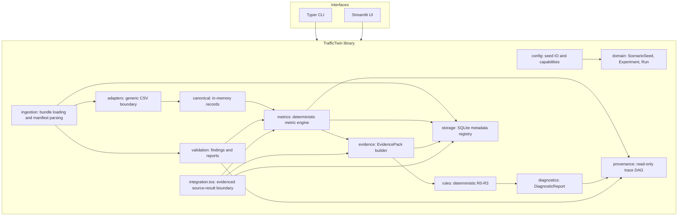
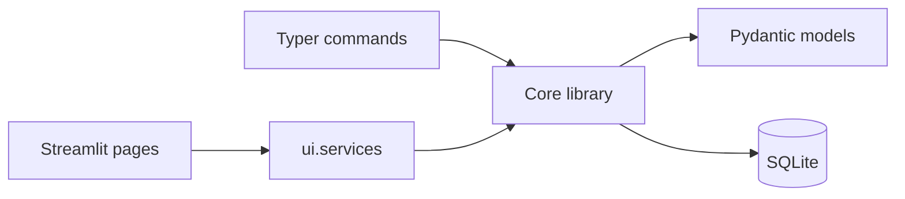
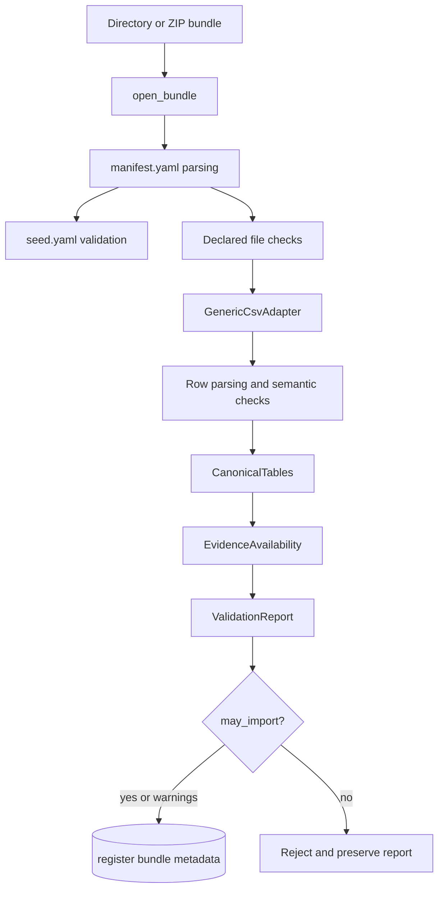
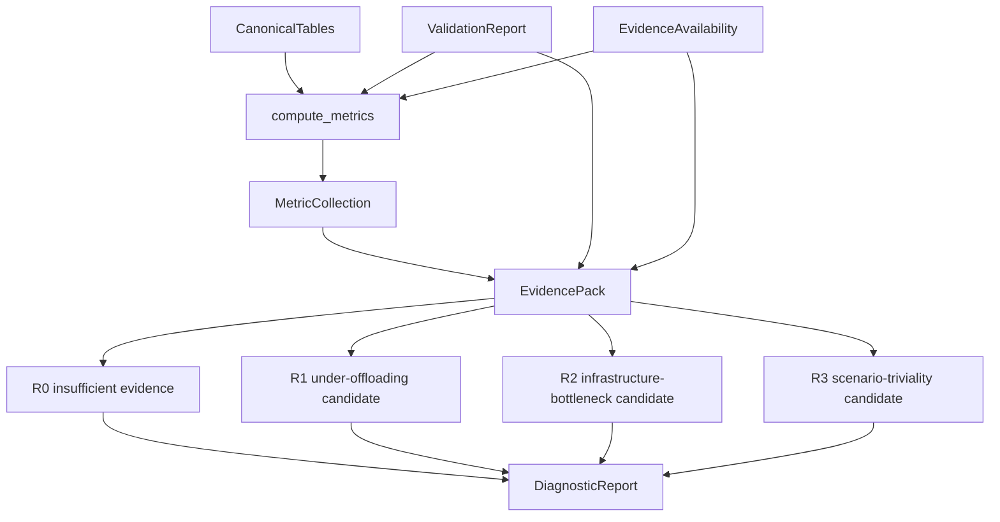
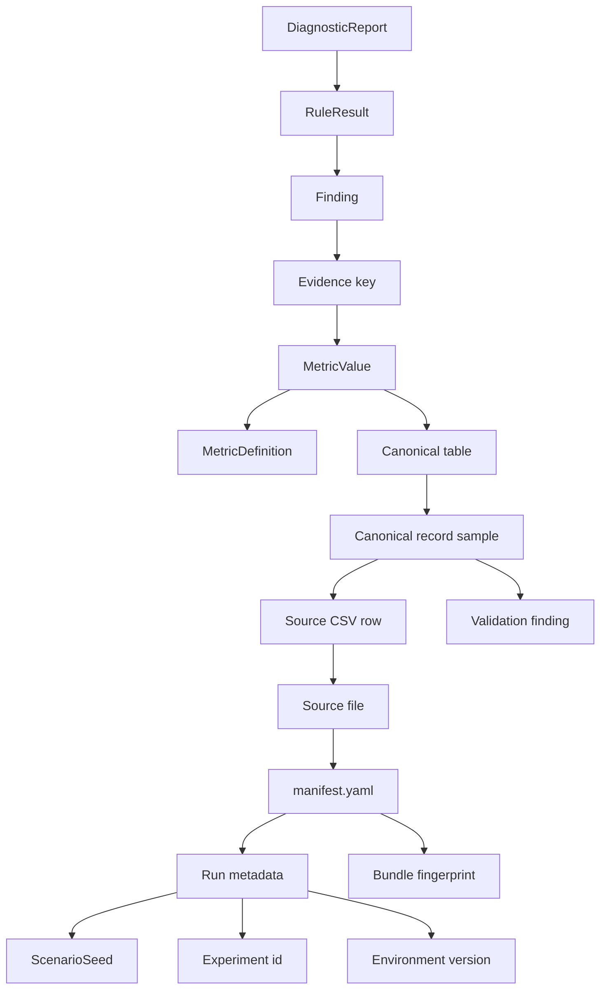
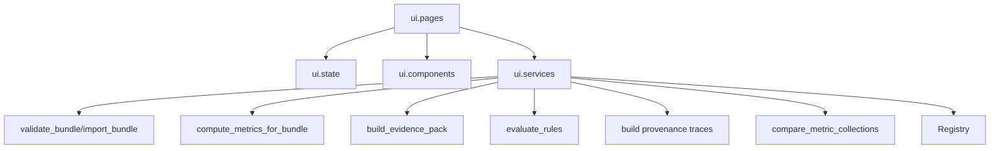
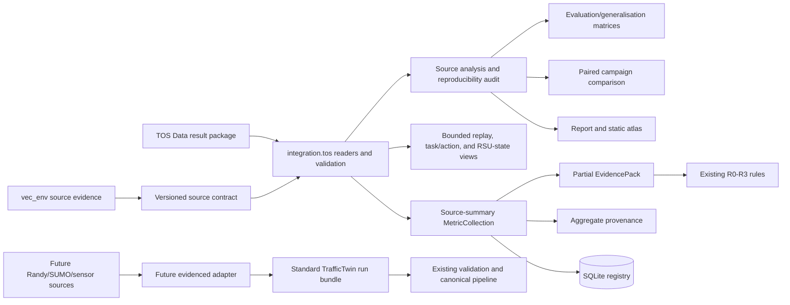
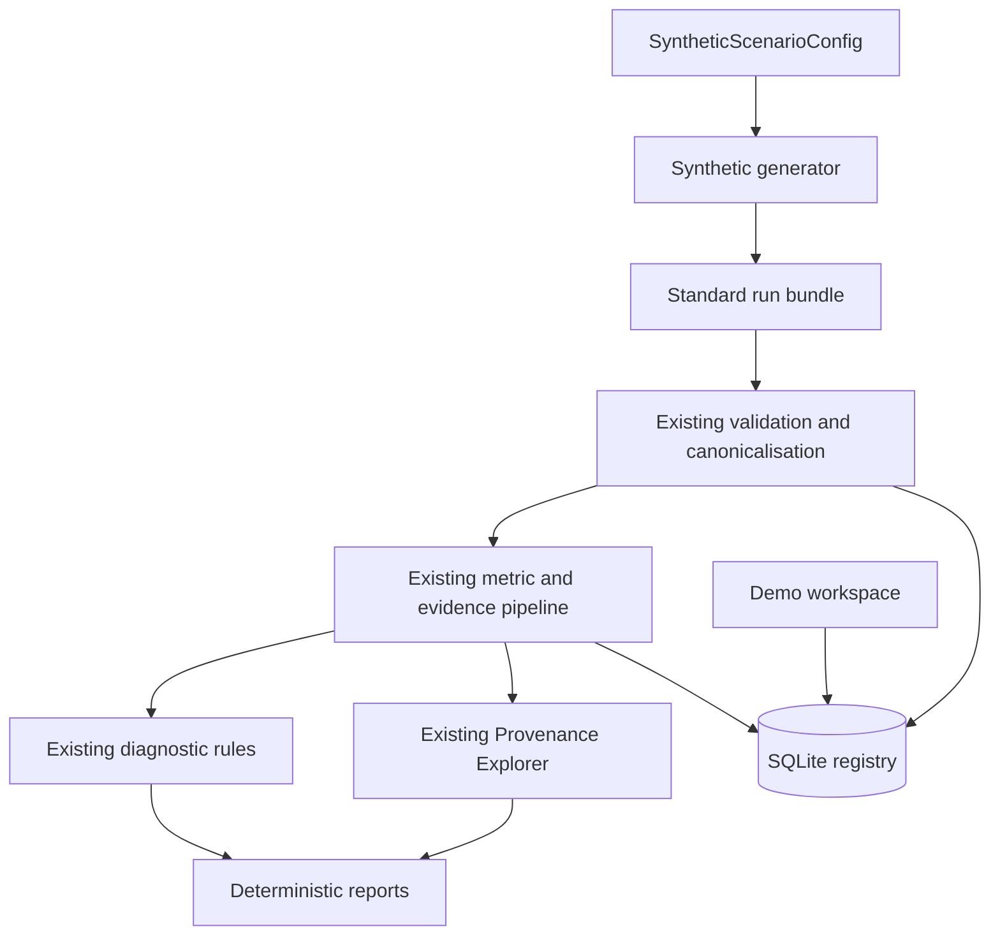
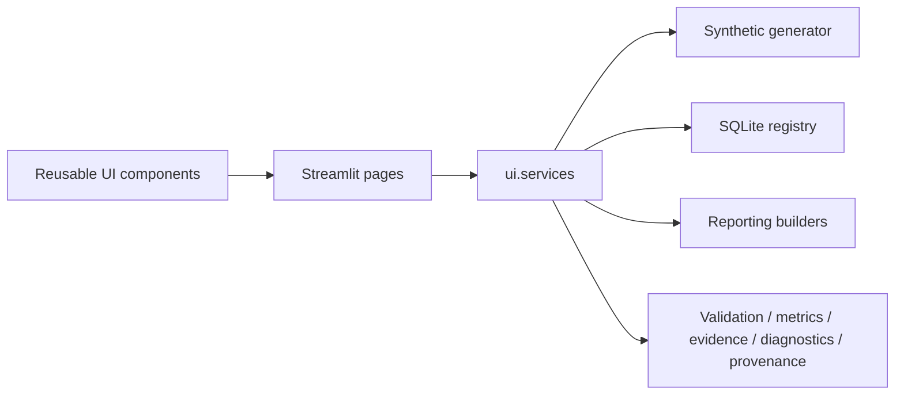
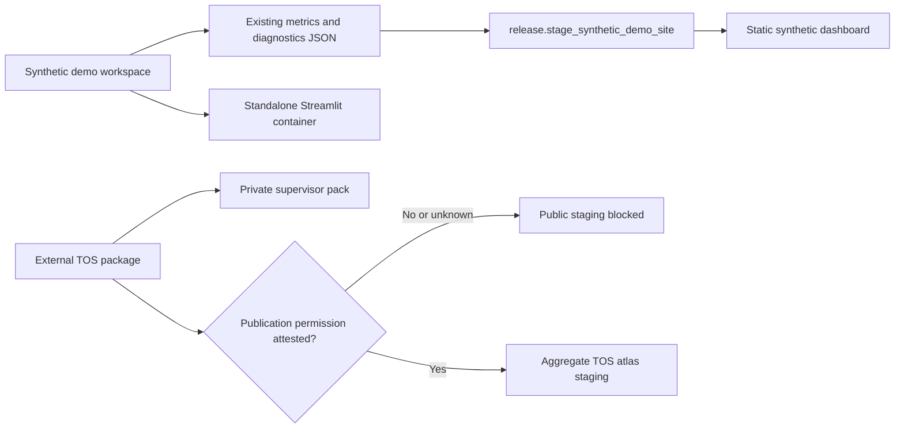

# TrafficTwin Architecture

This document describes the implemented standalone architecture, Provenance Explorer, and the
evidence-gated read-only TOS Data integration. It is grounded in the current repository and the
canonical design specification at [docs/traffictwin-design-v0_4.md](traffictwin-design-v0_4.md).
It does not assume a runnable Randy/VEC environment, SUMO XML, Manchester sensors, near-live,
true-live, or external launch support.

## Architectural Position

TrafficTwin is a tested Python research-software library with a thin Streamlit interface and Typer CLI. The guaranteed workflow is import-first:

```text
seed YAML -> run bundle -> validation -> canonical records -> metrics -> EvidencePack -> diagnostics/provenance/UI
```

Direct launch is an adapter capability, not a default feature.

## A. High-Level Platform Architecture



## Layer Responsibilities

| Layer | Modules | Responsibility |
|---|---|---|
| Configuration | `src/traffictwin/config/` | Seed YAML loading/dumping and capability manifests. |
| Domain | `src/traffictwin/domain/` | `ScenarioSeed`, `Experiment`, `Run`, enums, and strict validation. |
| Ingestion | `src/traffictwin/ingestion/` | Bundle loading, manifest parsing, fingerprints, and validation orchestration. |
| Adapters | `src/traffictwin/adapters/` | Raw source interpretation at boundaries. Currently generic CSV only. |
| Canonical | `src/traffictwin/canonical/` | In-memory canonical record models and table container. |
| Validation | `src/traffictwin/validation/` | Stable codes, findings, reports, and reconciliation helpers. |
| Metrics | `src/traffictwin/metrics/` | Deterministic metric definitions, calculators, comparison, and aggregation. |
| Evidence | `src/traffictwin/evidence/` | Versioned EvidencePack construction and data-readiness summaries. |
| Rules | `src/traffictwin/rules/` | Deterministic R0-R3 rule evaluation over EvidencePack only. |
| Diagnostics | `src/traffictwin/diagnostics/` | DiagnosticReport schema and serialisation. |
| Provenance | `src/traffictwin/provenance/` | Read-only trace graph, source-row preview, JSON and Markdown export. |
| Storage | `src/traffictwin/storage/` | SQLite registry for metadata and JSON payload references. |
| UI | `src/traffictwin/ui/` | Streamlit presentation and UI services over library calls. |
| Product UX | `src/traffictwin/ui/pages/` and `src/traffictwin/ui/components/` | Scenario Builder, Experiment Manager, Reports, Search, Settings, About, replay controls, and reusable presentation helpers. |
| TOS integration | `src/traffictwin/integration/tos/` | Versioned source contract, read-only validation/import, evaluation/training analysis, unit-aware replay, source task/RSU summaries, audit, aggregate exports, partial evidence, and provenance. |

## Dependency Direction

Dependencies flow inward from interfaces to library modules. Metrics do not read raw files. Rules do not read raw files or canonical rows. Provenance does not recompute metrics or reinterpret rules. The UI does not implement metrics, validation, comparison, diagnostic formulas, or provenance derivation logic.



## B. Import Pipeline



Bundle loading supports directories and ZIP files. ZIP extraction rejects absolute paths, path traversal, and symlinks, and works in a controlled temporary directory.

## Canonical Records

Canonical records are Pydantic models in [src/traffictwin/canonical/records.py](../src/traffictwin/canonical/records.py):

- `TaskRecord`
- `InfrastructureRecord`
- `VehicleStateRecord`
- `TrafficObservationRecord`
- `TripRecord`
- `IncidentRecord`

Every record preserves `source_file` and `source_row`. Missing optional source fields remain absent
or null. Full canonical rows are not stored in SQLite. The TOS source-summary path does not create
canonical records because source task counts, task identities, RSU semantics, and units are not yet
sufficiently evidenced; it records that boundary explicitly instead.

## Validation

Validation runs before metrics. It produces `ValidationReport`, a serialisable report with:

- status: `accepted`, `accepted_with_warnings`, or `rejected`;
- `may_import`;
- stable validation findings;
- files inspected;
- canonical record counts;
- available and unavailable evidence categories.

Validation continues where safe so a user sees a complete report rather than only the first problem.

## Metrics

Metrics are deterministic functions over `CanonicalTables`, `RunMetricContext`, `EvidenceAvailability`, and `MetricEngineConfig`.

Key properties:

- stable metric definitions;
- no mutation of canonical records;
- unavailable metrics are explicit;
- no `NaN` or infinity in JSON;
- synthetic-demo saturation threshold is configurable and documented.

## C. Evidence And Diagnostics Pipeline



EvidencePack is the only supported input to diagnostic rules. Rules cite metric keys and return candidate hypotheses with alternatives, missing evidence, and conditional recommendations. They do not prove root causes.

## Provenance Pipeline



The provenance layer builds a small internal DAG from existing objects:

- `BundleValidationResult`;
- `MetricCollection`;
- `EvidencePack`;
- `DiagnosticReport`;
- metric and rule catalogues;
- canonical record `source_file` and `source_row` fields.

For aggregate metrics, row provenance is reported as eligible input records and bounded source-row samples. The explorer does not assign fabricated per-row contribution weights. EvidencePack-only diagnostic fixtures can trace rule findings to metric keys, but source rows are explicit unavailable links unless the original run bundle is also available.

## Metadata Registry

The registry in [src/traffictwin/storage/registry.py](../src/traffictwin/storage/registry.py) uses SQLite and stores:

- seeds;
- experiments;
- runs;
- bundle import metadata;
- metric collection JSON;
- evidence pack JSON.

It does not store raw files, canonical rows, or private simulator data. Schema changes must be additive unless an explicit migration is designed.

## D. UI, Service, And Library Flow



The Streamlit app is launched with:

```bash
streamlit run src/traffictwin/ui/app.py
```

All calculations come from library services. UI modules prepare chart/table data and render unavailable states honestly.

## E. External-Adapter Boundary



Phase 6 discovery inspected Randy's external `TOS Data` and `vec_env` repositories. TrafficTwin
has a conservative, package-specific read-only integration for contracts established from the
data and source evidence:

- evaluation-master rows become versioned source-summary metric collections;
- source JSON summaries are reconciled against matching evaluation rows;
- NPZ archives are inspected with bounded, non-pickle loading and explicit key/shape checks;
- matched arrays support historical replay, task/action inspection, and RSU active-task/backlog
  inspection using confirmed source units and meanings;
- `analysis.py` groups source measures into deterministic campaign/cell matrices and pairs only
  common fleet seeds for comparison;
- `training.py` represents non-finite warm-up fields as unavailable and exposes bounded curves;
- `audit.py` reports artifact coverage and blocked dependencies without reading private machine
  metadata;
- `exports.py` reuses analysis objects to produce deterministic reports and a self-contained,
  aggregate-only static atlas;
- registry import stores run metadata, source-summary metrics, and partial EvidencePacks
  idempotently;
- diagnostics continue to use the existing EvidencePack-only rules and therefore remain
  insufficient where canonical evidence is absent;
- provenance reaches the exact evaluation CSV row, package commit, package fingerprint, run,
  experiment grouping, actor, engine version, and separate semantics evidence commit.

The package is not a standard TrafficTwin run bundle. Source code confirms `rsu_load` as in-flight
task count, `rsu_busy_ms` as remaining compute backlog, and `rsu_max_concurrent` as a concurrency
bound. Their ratio is exposed only as source-specific concurrency pressure, not relabelled as
canonical queue length or CPU utilisation. Vehicle-array slots are time-indexed references rather
than persistent identifiers. The integration does not fabricate seed snapshots, physical
completion, trip records, action targets, link quality, or raw SUMO data.

The evaluator CLI is documented but not launchable from TrafficTwin: actor files and the
instrumented writer are missing, paths are source-author-specific, and the runtime has not been
verified locally. Direct launch therefore remains false.

Future canonical adapters must:

- declare supported schemas and units;
- preserve raw sources;
- map only evidenced fields;
- emit validation findings for ambiguous data;
- produce standard TrafficTwin bundles or canonical records through existing validation;
- keep unsupported capabilities `unknown` or `false`.

The generic CSV adapter does not contain TOS-specific assumptions. The current boundary and
remaining questions are documented in
[integration/tos_data_adapter.md](integration/tos_data_adapter.md).
The product workbench is documented in
[integration/tos_results_workbench.md](integration/tos_results_workbench.md).

## Standalone Product Layer

The standalone product layer is intentionally outside the core metric and diagnostic logic:



`src/traffictwin/synthetic/` writes ordinary bundles. `src/traffictwin/demo/` prepares a local
workspace and imports those bundles through the same registry path as historical imports.
`src/traffictwin/reporting/` renders existing validation, metric, evidence, diagnostic, comparison,
and provenance objects into Markdown or standalone HTML.

No standalone module introduces Randy/SUMO behavior, live data, new metrics, new rules, or simulator
launch support.

## Security Considerations

- Imported files are read as data, not executed.
- ZIP loading rejects path traversal, absolute paths, and symlinks.
- TOS NPZ inspection rejects unsafe archive members, disables pickle loading, limits decompressed
  content, and loads only documented keys needed for bounded views.
- Raw source fixtures remain unchanged.
- SQLite is local metadata storage, not a credential store.
- Randy's external `TOS Data` package is kept outside `diss/`; raw external files should not be
  copied into this repository until sanitised fixture permission is explicit.
- Future live or user-study data would require a stronger privacy and threat model.

See [security_and_privacy.md](security_and_privacy.md).

## Extension Points

| Extension | Current gate |
|---|---|
| New canonical record | Add model, table field, validation, metrics availability, docs, tests. |
| New manifest field | Add Pydantic field, validation, bundle spec, fixtures, tests. |
| New metric | Add definition, calculator, availability behavior, golden tests, metrics docs. |
| New diagnostic rule | Add EvidencePack inputs, rule config, rule model output, tests, docs. |
| Provenance trace root | Add builder/query support without recomputing metrics or reading unsafe paths. |
| New Streamlit page | Add service-backed page; no duplicated formulas. |
| Full TOS canonical adapter | Obtain eventual-completion semantics, persistent identifiers or an approved time-local model, exact producer provenance, and compatible canonical infrastructure fields. |
| TOS/SUMO launcher | Supply checkpoint/writer artifacts and verify a path-independent headless command; current capability remains unsupported. |

## Product Polish Layer

The Product Polish & Research UX phase adds workflow pages and reusable presentation components
without changing the deterministic pipeline:



Scenario Builder uses `SyntheticScenarioConfig` and `write_synthetic_bundle`; Experiment Manager
uses registry and workspace metadata; Reports calls `traffictwin.reporting`; Search performs local
metadata search. None of these pages implement new metrics, rules, adapters, live data, or launchers.

## Release And Deployment Boundary



The static dashboard reads existing standalone pipeline outputs and contains no external source
data. The container initialises the same synthetic workspace and runs the ordinary Streamlit app.
The TOS supervisor pack is private by default and includes machine-readable integration gates and
checksums. Neither path changes metric formulas, diagnostic logic, canonical records, or adapter
capabilities.

## Related Documents

- [System overview](system_overview.md)
- [Developer guide](developer_guide.md)
- [Data contract](data_contract.md)
- [Run bundle specification](run_bundle_spec.md)
- [Metrics catalogue](metrics_catalogue.md)
- [Diagnostic rules](diagnostic_rules.md)
- [Provenance Explorer](provenance_explorer.md)
- [Provenance model](provenance_model.md)
- [Standalone demo](standalone_demo.md)
- [Synthetic data model](synthetic_data_model.md)
- [Report export](report_export.md)
- [Deployment](deployment.md)
- [Supervisor and viva pack](supervisor_pack.md)
- [Integration decision](integration/phase6_decision.md)
- [TOS Results Workbench](integration/tos_results_workbench.md)
