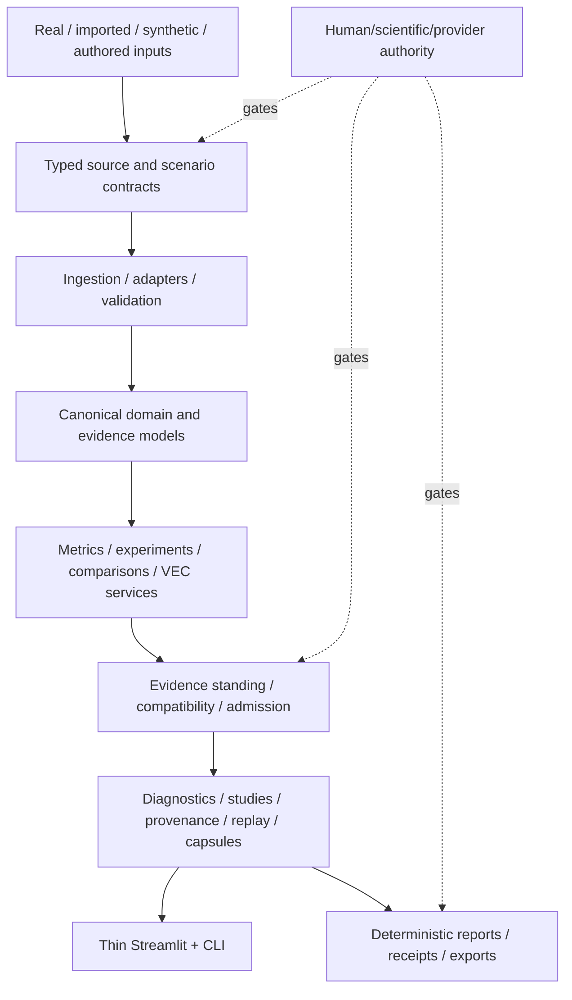
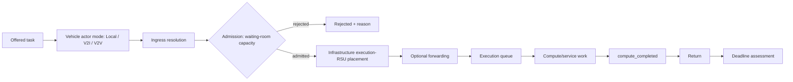
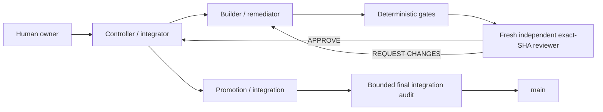

# TrafficTwin Current Release Architecture

**Authoritative release:** `337f1624e5ffe188393554b1110a35ababcce8e1`  
**Date:** 15 August 2026  
**Status:** CURRENT ARCHITECTURE OVERLAY

This file is the current high-level architecture overlay for the integrated release. `docs/architecture.md` and versioned v0.5/v0.6/v0.7/v0.8 documents retain detailed historical/module-level architecture and design evolution.

## 1. Architectural position

TrafficTwin is a Python research-software platform with tested service/library layers, a thin Streamlit product interface, CLI surfaces, deterministic provenance/validation/reporting, Manchester evidence/context integrations, scenario/comparison tooling, and VEC/resource-management research-product surfaces.

The platform is evidence-first and fail-closed. User-interface availability does not itself establish scientific, provider, human, or operational authority.

## 2. High-level data/control flow



## 3. Core architectural boundaries

### 3.1 Evidence/source boundary

Adapters and source-specific integrations interpret source formats and semantics. Downstream services consume typed/canonical artifacts rather than guessing source meaning. Source standing, freshness, rights, compatibility, and unavailable states remain explicit.

### 3.2 Scientific calculation boundary

Metrics, lifecycle accounting, comparisons, diagnostics, and statistical artifacts are deterministic code outputs. UI/controller/LLM layers may orchestrate or render those outputs but must not invent measurements or scientific findings.

### 3.3 UI boundary

Streamlit pages remain presentation/orchestration surfaces over tested library/services. They must not silently recalculate scientific values or widen evidence standing.

### 3.4 Provenance/release boundary

Fingerprints, exact Git identities, receipts, admission state, review identity, and deterministic exports form the audit chain. Release composition cannot retroactively make absent evidence available.

## 4. Manchester context architecture

Manchester-related evidence remains source-separated:

- static geography/infrastructure;
- accepted historical Manchester observations where available;
- BODS bus-only live/recent context when configured;
- National Highways strategic-road context when configured;
- imported/accepted evidence;
- authored/synthetic scenario context;
- provider-dependent unavailable feeds.

There is no architecture-level claim of continuous general-road city-wide live telemetry.

## 5. VEC dynamic-resource architecture



Architectural invariants:

- actor mode choice is not exact RSU choice;
- ingress RSU and execution RSU are distinct concepts;
- admission is a waiting-room/queue gate;
- placement is infrastructure-side target selection;
- scaling is service/compute resource adjustment;
- queue capacity and compute capacity are not interchangeable;
- forwarding, compute completion, return, and deadline success remain separately accounted;
- simulated resource scaling is not a real Kubernetes deployment.

The preferred neutral implementation phrase for deterministic target management is **deterministic infrastructure-side RSU load management**.

## 6. Research/evidence availability architecture

The integrated E3 product intentionally supports a truthful zero-result state. The current immutable policy is:

```text
LANE_09 = BLOCKED_BY_RESEARCHER_EXECUTION_HOLD
E3_SCIENTIFIC_EXECUTION_NOT_AUTHORIZED
evidence_state = NOT_EXECUTED
result_availability = NO_E3_RESEARCH_RESULTS_AVAILABLE
research_workloads_launched = 0
```

Validators, UI, receipts, and exports must preserve that state. No fallback path may fabricate E3 evidence.

## 7. Integrated release identity

Key reviewed/frozen lineage:

```text
Expansion V1              85a6d98464ba5065f578632fd97456b91fa6ab0e
Dynamic approved content  4d35a80407268877323fc073e3027a37fc42f63d
Binding remediation       c96b407bc9cb3915e2e3908a20b9a122b5e61f11
Dynamic freeze             32f8b05be58ca8be00d48566003f8d12d45a3f79
Mypy/pin remediation       cebe0c05d959af99cac3a9f98f3dbc30ab948966
Final Dynamic freeze       d9e9944e4258578c4743a524c9de6ddce1bd7dde
Integrated release/main    337f1624e5ffe188393554b1110a35ababcce8e1
```

Historical reviewed branches/receipts remain evidence; new work starts from current `main` unless explicitly stated otherwise.

## 8. Engineering-agent architecture



Roles:

- owner controls scope/science/release authority;
- controller coordinates dependency state and composition;
- builder changes source but cannot self-approve;
- reviewer is read-only and bound to the exact pushed SHA;
- Git/tests/static checks/validators/receipts provide deterministic trust evidence.

Process exit status is not review approval. Any source change creates a new review identity.

## 9. Final integration audit boundary

The final audit is intentionally bounded. It may block a concrete new/reintroduced final-composition defect in functionality, safety, truth/provenance, security, deterministic build/reproduction, or cross-feature integration. It must not become an open-ended restyling/refactoring exercise or reopen accepted lane-local design without a composition-specific defect.

## 10. Future orchestration runtime

The current trust architecture is independent of the shell/session runtime. A future durable graph/state-machine controller (for example a LangGraph-style runtime) may manage DAG state, retries, persistence, and parallel readiness. Such a migration must retain Git exact-SHA authority, independent review, deterministic gates, idempotent side effects, and human owner control. It is future engineering work, not part of the current released product claim.
