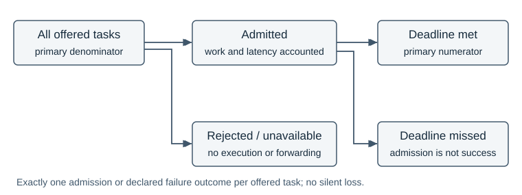
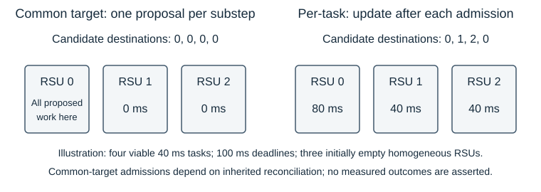

# TrafficTwin: Auditable Infrastructure Scheduling for Vehicular Edge Computing under a Frozen MAPPO Policy

S M Abdulla Al Mamun  
The University of Manchester  
Master's dissertation — complete revised draft, 7 September 2026  
Supervisor: Dr Sandra Sampaio

This draft uses evidence baseline `04f3b6a95c7bc06c80ed95b54762f12861bba183`. The historical August manuscript is preserved separately. Programme title, student identifier and submission declarations require author confirmation; they are listed in the accompanying author-input record rather than represented as completed declarations here.

## Abstract

Vehicular edge computing combines wireless communication, heterogeneous vehicle resources and roadside computation. Evaluating an offloading policy therefore requires more than measuring its action choices: admission, execution placement and task accounting can change the apparent result. This dissertation investigates deterministic infrastructure-side roadside-unit (RSU) load management while retaining a frozen multi-agent proximal policy optimisation (MAPPO) actor that selects Local, vehicle-to-vehicle or vehicle-to-infrastructure processing.

The experimental programme first corrects and validates task outcomes and service-work conservation. It then separates finite waiting-room capacity from compute service and isolates placement from a workload-based deadline admission gate. Across four matched fleet draws in a Manchester incident scenario, an inherited scheduler choosing one common least-busy RSU per task substep performs 2.122 percentage points below ingress execution. Sequential per-task placement reverses this ranking, performing 0.527 points above ingress and 2.649 points above the common-target implementation.

A locally prespecified replication uses four new fleet draws and three scheduling arms in a second Manchester morning scenario. The inspected pilot is excluded from primary inference. Per-task placement exceeds ingress by 3.899 points, while common-target placement falls below ingress by 3.232 points; simultaneous intervals support both directions. A post-hoc audit connects repeated use of RSUs 0–4 to five common-target decisions, empty batch starts and lowest-index tie-breaking. Intermediate workload reconstruction does not establish that every rejected task could succeed elsewhere.

Single-draw state-information and fixed-forwarding-overhead sensitivities provide bounded supporting evidence. The contribution is an auditable demonstration that infrastructure implementation semantics can reverse scheduler rankings under the same frozen vehicle policy. The findings remain conditional on the tested simulator, actor, fleet model and two Manchester scenarios; they do not establish physical deployment performance or independent geographical generalisation.

## 1. Introduction

### 1.1 Problem and motivation

A vehicle with a computational task can process it locally, send it to another vehicle, or enter roadside infrastructure. Each option combines communication and computation differently. A strong radio connection may reach a busy server; an idle server may require an additional transfer; accepting a task may consume resources without completing it before its deadline. Mobile edge computing consequently couples radio and computational resource management, as organised in Mao et al.'s survey [[1]](#ref-1). For an evaluation, the practical question is which part of that coupled system caused an observed improvement.

TrafficTwin addresses this question through a trace-driven vehicular edge computing (VEC) evaluator and an evidence-oriented software artifact. The evaluator reuses an existing trained MAPPO vehicle policy. Its three actions are Local, vehicle-to-infrastructure (V2I) and vehicle-to-vehicle (V2V). The actor does not select an exact RSU. The environment identifies a radio ingress, and infrastructure logic determines where an admitted V2I task executes. Holding the actor fixed makes this downstream layer experimentally accessible without introducing a new learning algorithm or retraining confound [[S4]](#source-s4).

The initial infrastructure question concerned RSU queue capacity. However, a larger waiting room is not a faster processor. With fixed service, a higher admission limit can retain more work while also admitting tasks that wait too long. An aggregate latency value is especially difficult to interpret when rejected tasks receive penalties or when one configuration admits a different population of tasks. Before comparing schedulers, the evaluator must therefore account for every offered task and distinguish admission from deadline success. These requirements motivated the E0 validation stage and the later use of offered-task deadline attainment as the primary outcome [[S0]](#source-s0).

The subsequent experiments exposed a second interpretive problem. Two implementations described as least-busy placement can make materially different decisions. One may choose a destination once for a batch of candidates; another may reconsider the destination after each admitted task. Both can query the same workload variable and apply the same admission predicate, yet generate different queues. In this project, that distinction changed the sign of the comparison against strongest-link ingress execution. Explaining the operative algorithm is therefore central to the scientific result, rather than an implementation footnote.

### 1.2 Related work and the position of this study

The selected literature establishes three foundations: joint offloading and resource allocation, the role of cooperative reinforcement learning, and the need to identify implementation-dependent improvements. It is a focused review of directly relevant work, not an exhaustive survey or a claim that no similar architecture exists elsewhere. The experimental contribution is assessed against these foundations without importing numerical comparisons from incompatible simulators.

Karimi, Chen and Akbari investigate cooperation between vehicular edge and central-cloud resources using deep reinforcement learning, with task acceptance and response-time requirements central to the problem [[2]](#ref-2). This is a useful comparison because offloading and computational allocation are considered together. TrafficTwin instead fixes an inherited vehicle policy and varies infrastructure execution logic. Its reference is the same actor under another downstream scheduler, not the reported performance of Karimi et al.'s method. Their different architecture and task model preclude a direct numerical ranking. The available publisher abstract and introduction support this architectural comparison, but are insufficient for claims about all implementation details of their algorithm.

Schulman et al.'s proximal policy optimisation (PPO) methods alternate environment sampling with optimisation of a surrogate objective and support repeated minibatch updates [[3]](#ref-3). Yu et al. examine PPO in cooperative multi-agent settings and show that carefully configured PPO-based methods can perform strongly across several benchmarks [[4]](#ref-4). These papers motivate the provenance of the inherited MAPPO actor. They do not establish that the particular TrafficTwin checkpoint is optimal for Manchester traffic, nor that its radio targets or downstream scheduler are learned. No training comparison is conducted in this dissertation. Maintaining that distinction avoids attributing an infrastructure improvement to a change in the policy optimiser.

Henderson et al. examine how experimental choices and randomness complicate reproducibility in deep reinforcement learning [[5]](#ref-5). Their work makes a single favourable run an insufficient basis for broad comparative claims. Agarwal et al. likewise show why finite-run uncertainty matters when summarising reinforcement-learning results, advocating interval estimates and more informative aggregate reporting [[6]](#ref-6). The relevant lesson here is to show uncertainty at the actual replication level. This dissertation does not adopt their benchmark-wide aggregation procedure: its paired unit is a newly generated fleet under a fixed actor and traffic trace. Millions of dependent tasks cannot substitute for additional fleet draws.

Gorsane et al.'s study of cooperative MARL evaluation is particularly close to the methodological problem. Their analysis identifies inconsistent reporting, implementation variation and insufficient uncertainty estimation, and recommends exposing experimental details and the true source of improvement [[7]](#ref-7). TrafficTwin provides a concrete downstream example: the policy checkpoint remains unchanged while infrastructure scheduling semantics alter the result. The relevance is methodological rather than a new MARL benchmark. A scheduler label alone is insufficient to describe what was compared, and an apparently favourable aggregate workload distribution does not identify the mechanism producing deadline outcomes.

Finally, SUMO provides a microscopic traffic-simulation foundation and supports coupling traffic simulation to other models [[8]](#ref-8). Here, saved SUMO-derived trajectories supply vehicle presence and mobility to the VEC evaluator. This makes scenarios replayable and enables matched comparisons. It does not validate all radio or computing assumptions, and a simulated trace must not be described as measured city-wide traffic ground truth. The two evaluated traces share a Manchester setting; using another period and layout extends the operating conditions examined without providing independent geographical replication.

Together, these works justify a narrower contribution than proposing a universally superior offloading system. The gap addressed is the lack of a defensible attribution within this particular inherited system: whether benefits arise from admission, waiting-room limits or the precise downstream placement algorithm. The study responds with explicit source identities, controlled comparisons and an audit of the observed destination pattern. It makes no priority claim for least-busy scheduling, hierarchical control or reproducibility itself.

### 1.3 Aim, research questions and contribution

The aim is to determine whether deterministic infrastructure-side RSU load management improves offered-task deadline attainment under a frozen vehicle policy, and to establish which claims the available evidence can support. The questions developed with the programme; the morning replication questions and analysis were declared before its new outcomes, while the mechanism audit was explicitly post-hoc.

**RQ1 — Measurement and capacity.** After repairing task accounting, does increasing the RSU waiting-room limit at fixed compute service improve offered-task deadline attainment? This question requires correct rejection handling and conservation before any performance interpretation.

**RQ2 — Admission and dispatch semantics.** Under matched inputs and the inherited workload-based admission rule, how do ingress execution, common-target least-busy placement and sequential per-task least-busy placement compare in the incident scenario? The distinction concerns the implemented decision process, including its reconciliation semantics.

**RQ3 — Replication and mechanism.** Does the incident ordering recur across newly declared fleet draws in the morning scenario, and what recorded or reconstructable behaviour explains the common-target scheduler's repeatedly selected RSU identities? The replication and the subsequent explanatory audit have different evidential roles.

**RQ4 — Bounded sensitivities.** Within one incident fleet draw, how do aged placement-workload reports and a fixed forwarding overhead affect the comparison? These studies test specific model assumptions descriptively, without establishing population-level robustness or a physical backhaul design.

The contributions are an accounting-valid evaluation foundation; a controlled decomposition of queue capacity, admission and placement; an implementation-dependent incident ranking reversal; a three-arm replication excluding an inspected pilot; and a mechanism audit separating recorded observations from reconstructed intermediate states. The accompanying TrafficTwin artifact preserves evidence identity and makes these distinctions reviewable. Its value lies in connecting a performance claim to a particular executable model and experiment, rather than presenting a dashboard value without provenance [[S11]](#source-s11).

### 1.4 Scope and report structure

The work uses one frozen actor, a provisional heterogeneous fleet model and two simulated Manchester scenarios. It evaluates infrastructure placement after vehicle-level mode selection; it does not learn V2V neighbours, retrain MAPPO, deploy Kubernetes or simulate packet-level inter-RSU forwarding. Optional simulator-side resource-scaling software belongs to a separate research campaign whose execution remains unperformed. Completed follow-up studies in this report use the E2d-derived evaluator and must not be relabelled as results from that separate campaign.

Section 2 specifies the architecture, accounting model, scheduling algorithms, experimental progression and statistical design. Section 3 evaluates the completed evidence and reflects on implementation, reproducibility and validity. Section 4 answers the research questions and identifies limited future work. Appendix A provides source identities, while the accompanying claim-to-source map and validation report support review of this complete draft.

## 2. Methodology

### 2.1 Research design and evidence hierarchy

The design combines controlled simulator experiments with implementation validation and a subsequent read-only mechanism audit. A frozen policy permits downstream interventions under matched traffic, fleet and task inputs. This is suitable for attributing differences within the evaluator because it limits changes to defined infrastructure conditions. Retraining a policy for each condition would answer a different question about adaptation and would combine training variation with placement effects. Conversely, treating the whole system as a black box would conceal whether a change arose from admission or execution assignment.

Evidence progresses from validation to exploratory comparisons and then matched replication. This sequence is not presented as one prospectively registered programme: observations from earlier stages informed later questions. E2c excludes the seed used to discover its hypothesis; the morning replication separately excludes its already inspected pilot. Frozen source, manifests and accepted records determine experimental meaning. Reports summarise those records, while implementation correspondence helps clarify intended behaviour. Product diagrams and literature do not override executable experimental semantics [[S0]](#source-s0)–[[S8]](#source-s8).

### 2.2 Architecture and information boundaries

Figure 1 separates three decisions. The actor chooses an offloading mode; the environment chooses a communication target; the infrastructure chooses an execution RSU and applies admission. For V2I, the ingress is the RSU with the strongest current simulated radio link. In ingress execution, it is also the execution node. In load-balancing arms, the radio ingress remains fixed while execution may move elsewhere. A selected target is only a proposal until the task passes the live admission checks [[S4]](#source-s4).


*Figure 1. Experimental responsibility boundaries. Only admitted V2I work enters the selected execution queue; logical forwarding applies when ingress and execution differ. Resource scaling is outside the completed comparison.*

The checkpoint uses a 17-dimensional observation comprising task descriptors, vehicle load and queue summaries, state of charge, link-quality summaries, nearby compute availability, a task-presence flag, vehicle compute tier, an electric-vehicle flag and the observed V2V target's compute tier. It does not receive the current RSU workload vector. MAPPO consequently cannot directly implement the infrastructure's least-workload rule through its action space. The actor selects one mode per active vehicle per second, reused across the task slots in that second.

V2V target selection is environmental: exclude the source and peers whose queues are full, then select the remaining strongest instantaneous simulated link. Distance contributes to link quality, but fading also contributes; this is not simply nearest-neighbour selection. Peer workload and capability affect latency after selection, while capability is not itself the target-ranking criterion. Observation and operational link calculations use separate fading samples. The correspondence confirms this and the per-vehicle-second decision convention as intended inherited behaviour, not an accidental change introduced by the placement study [[S4]](#source-s4).

### 2.3 Scenarios, actor and controlled inputs

Table 1 identifies the two scenarios. Traffic positions are imported from saved traces; the evaluator does not rerun SUMO during each scheduling comparison. The morning input audit reconstructs the canonical trace arrays from their source records and checks entry markers and slot assignment. This matters because padded array slots are not necessarily permanent vehicle identities. On morning vehicle entry, the recorded convention resets vehicle queues for the new visit; state of charge is not reset by that queue operation. The incident trace retains its earlier convention without the same entry channel [[S7]](#source-s7).

*Table 1. Scenario identity and fixed placement controls. Differences between scenarios are retained and documented, not treated as a single-factor intervention.*

| Setting | Incident scenario | Morning scenario |
|---|---|---|
| Date and local window | 15 March 2024, 20:00–21:00 | 15 October 2024, 08:00–11:00 |
| One-second steps | 3,600 | 10,800 |
| Padded vehicle slots | 2,488 | 215 |
| RSUs | 10 | 9 |
| SUMO seed | 43 | 42 |
| Vehicle queue convention | Conserved, legacy trace convention | Conserved, canonical per-visit reset |
| Placement-study RSU limit | 6,220 tasks per RSU | 6,220 tasks per RSU |
| Service / forwarding / scaling | 1× / 0 ms / off | 1× / 0 ms / off |

The same one-hot-17 MAPPO checkpoint, identified by its archived hash, is retained throughout. Its inherited training provenance is Model C with synthetic mobility, 128 environments, learning rate 0.003 and training seed 100. Those facts identify the input artifact; they are not a training reproduction performed here. The provisional UK2030 fleet preset generates heterogeneous vehicle capabilities. Fleet seeds vary between replicates, while evaluator seed 0 and arrival parameter 1.5 remain fixed. Thus the estimand concerns fleet variability conditional on the actor and scenario, not uncertainty over training or traffic generation.

The three task types have deadlines of 100, 500 and 100 ms and mean input sizes of 1, 0.0012 and 0.001 MB. Frozen workloads are 1,254, 2,100 and 15 million cycles, with type-dependent acceleration and parallelism in the service model. Each task slot samples its own task properties under Model C. The maximum of five slots is part of the task-generation contract; changing it would alter the workload, not merely give the scheduler more opportunities [[S4]](#source-s4).

An absolute capacity setting is essential across traces. The incident ratio of 2.5 times padded fleet width resolves to 6,220 tasks per RSU. Reusing that ratio on the smaller morning trace would produce a 538-task limit. The morning protocol instead explicitly fixes 6,220, avoiding an unintended queue-limit intervention. It still cannot make the two scenarios identical: density, duration, layout, RSU count and entry conventions differ.

### 2.4 Time, queues, admission and outcomes

The evaluator advances in one-second batches. Its five internal task substeps establish admission order, first by substep and then by padded vehicle index. They do not advance the clock by 200 ms. Admitted service work accumulates during the batch, followed by the existing one-second service drain. Remaining RSU workload is measured in milliseconds of service, while the admission-capacity state tracks tasks. These are distinct quantities: doubling a task limit does not halve service times [[S4]](#source-s4).

For a selected RSU r and task deadline D, the inherited gate accepts the workload condition when its effective existing workload W[r] is strictly less than D. Capacity additionally requires space under the task-count limit, and the ingress radio path must be viable. Effective workload includes relevant prior admitted reservations. The predicate excludes the candidate's own service time, transmission time and forwarding overhead. Accordingly, “deadline-aware admission” is retained as the historical name for a backlog-based filter; it is not an end-to-end feasibility guarantee. A task admitted at W[r] just below D can still miss its deadline.

Figure 2 shows the accounting boundary. Each offered task receives exactly one admission or declared rejection/unavailability outcome. Categories distinguish local queue rejection, V2V queue rejection or unavailability, and V2I unavailability, deadline-gate rejection or capacity rejection. Rejected work contributes neither executed service nor forwarding. Admitted tasks receive modelled latency and deadline outcomes; admission itself is not success. The evaluator's queue carry and service ledger are aggregate simulation states, not a packet-level trace of physical completion and result-return events.



*Figure 2. Offered tasks remain in the primary denominator whether admitted, rejected or unavailable. Deadline attainment is evaluated for admitted tasks using the modelled latency; selected execution targets must not be counted as actual execution before admission.*

The primary per-run metric is A = N_met / N_offered. Secondary quantities include N_met / N_admitted, rejection categories, forwarding counts and admitted service work per RSU. Latency means require their denominator: offered latency may include rejection penalties, admitted latency conditions on acceptance, and successful-task latency selects another subset. None can silently replace offered-task attainment. Queue validation uses initial workload plus admitted work equals served work plus final remaining workload, together with task-count carry checks. This detects silent work loss without asserting that the simplified service process is physically exact.

The task-count drain is itself an approximation worth making explicit. When a queue empties, its task count becomes zero. Otherwise, the evaluator removes the floored fraction of tasks corresponding to the fraction of aggregate work served, retaining at least one task when positive work remains. It does not maintain a departure event for every queued job with its individual remaining service time. Conservation checks test this declared carry rule and the workload ledger. They cannot independently validate an alternative discrete-event interpretation. Preserving the same rule across arms supports the internal comparison, while limiting claims about precise queue occupancy in a physical system.

### 2.5 Placement algorithms and their implementation

Table 2 separates placement from the admission switch. The inherited `jsq` identifier is preserved for reproducibility; its behaviour is common-target least-busy placement, not a guarantee that it implements a canonical per-arrival shortest-queue algorithm. Similarly, `dla` combines least-busy placement with the deadline admission gate. Names alone do not specify the algorithm [[S2]](#source-s2), [[S4]](#source-s4).

*Table 2. Infrastructure conditions in the experimental progression. Every arm retains strongest-link radio ingress; all admitted remote execution uses the same service model.*

| Evaluator mode | Execution destination | Backlog deadline gate |
|---|---|---|
| `off` | Radio ingress | Off |
| `jsq` | One common least-busy RSU per substep | Off |
| `ingress_dla` | Radio ingress | On |
| `dla` | One common least-busy RSU per substep | On |
| `per_task_dla` | Least-busy RSU recomputed per candidate | On |

Common-target placement computes an argmin of remaining compute workload at the start of a task substep and broadcasts that destination across its V2I candidates. It retains the inherited three-pass vectorised reconciliation of admissions and offsets. Per-task placement instead processes candidates causally in ascending padded-vehicle order. For each candidate it selects the current lowest-workload RSU, applies the same workload predicate and capacity condition to actual state, and reserves the candidate's actual service work only if admitted. Rejected or unavailable candidates reserve nothing. Ties choose the lowest RSU index.

Algorithm 1 expresses the causal rule. The configured reconciliation count is retained, but each causal pass starts from the same initial state; repetitions do not multiply reservations. By contrast, the common-target implementation retains its vectorised reconciliation. The experiment therefore compares these concrete implementation semantics. It would overstate the control to describe them as mathematically identical algorithms differing only in the frequency of an argmin call.

```text
Algorithm 1: sequential per-task placement, fresh state
for each task substep k:
    for each candidate i in ascending padded-vehicle order:
        r = lowest-index argmin(current working RSU workload)
        evaluate ingress viability, live backlog gate and live capacity
        if admitted:
            record actual execution at r
            add actual service work and one task to working state at r
        otherwise:
            record the declared failure; reserve no work
apply the existing one-second service drain after all substeps
```

A small illustrative example clarifies the distinction. Suppose three homogeneous RSUs start empty and four viable tasks each require 40 ms of service with a 100 ms deadline. Sequential placement chooses 0, 1, 2, then 0, leaving workloads 80, 40 and 40 ms before service. A common-target substep selects RSU 0 for the whole group. Its candidate reconciliation determines admissions, but it cannot send that group's work to RSUs 1 or 2. This is an algorithm illustration, not a measured run or a reconstruction of every common-target admission. Figure 3 highlights destination concentration without claiming counterfactual deadline gains.



*Figure 3. Four illustrative candidates in one substep: common-target placement proposes the same RSU, while causal per-task placement updates the selection after admitted work. Common-target admissions remain governed by its inherited reconciliation.*

### 2.6 Experimental progression and inference

E0 validates accounting before performance analysis. E1 compares three queue limits at fixed service across five matched fleet draws. E2 and E2b are exploratory single-draw studies separating the placement and admission switches. E2c evaluates common-target against ingress on four new incident draws, seeds 1–4. E2d adds per-task placement on those draws and reuses the exact E2c controls; those controls are not counted as new independent observations [[S0]](#source-s0)–[[S3]](#source-s3).

The morning pilot uses seed 1 for ingress and per-task placement. After inspecting it, the replication declares seeds 0, 2, 3 and 4 and all three arms, yielding twelve new full runs. The primary contrasts are per-task minus ingress, common-target minus ingress, and per-task minus common-target. The pilot is excluded; a supplementary two-arm five-draw summary is descriptive. The local protocol and manifest preceded the new outcomes, but there was no external preregistration [[S7]](#source-s7), [[S8]](#source-s8).

For each contrast, a fleet draw supplies one paired difference in percentage points. Draws receive equal weight. The mean difference has a Student-t interval, mean ± t × sample standard deviation / square root of n. Incident E2c/E2d retain their reported individual 95% intervals. The morning protocol additionally uses Bonferroni simultaneous intervals for three contrasts, with critical value t at probability 1 − 0.05/(2 × 3), three degrees of freedom. Its reversal criterion requires the simultaneous common-target-minus-ingress interval below zero and the per-task-minus-ingress interval above zero. Four draws cannot strongly diagnose distributional assumptions; these small-sample intervals remain conditional parametric summaries, not task-level significance tests.

### 2.7 Sensitivities, mechanism audit and validation

The state-information pilot uses incident fleet seed 1 and delays of 0, 100, 500 and 1,000 ms, alongside ingress. Only placement workload reports are aged; admission uses actual queues with immediate acknowledgements. If B is the previous batch's post-admission workload, a positive delay d supplies max(B − (1,000 − d), 0). This explicitly adds a continuous-service interpretation between batches without redistributing task arrivals. Current-batch admitted reservations are added immediately to the placement view. Startup has no history and uses live state with recorded age zero [[S5]](#source-s5).

The forwarding study adds fixed costs of 1, 2.5, 5 and 10 ms to admitted forwarded tasks' modelled latency. Four direct ten-step probes qualify a transformation of saved full-run records because these charges do not affect admission, queues or actions in the frozen model. No full positive-cost simulations were run. The study cannot represent backhaul congestion, topology, migration protocols or delayed task arrival. Ambiguous penalty-equal latencies are not invented to compute a new mean [[S6]](#source-s6).

The five-RSU audit reads the four saved morning common-target runs. It checks per-second targets and queue endpoints, reconstructs intermediate admitted service work, and compares the resulting minima with frozen tie-breaking logic. It is post-hoc and launches no simulations. The proposed rotating-tie-break prefix test remains unrun [[S9]](#source-s9), [[S10]](#source-s10).

Execution validation checks source and input identities, finite values, outcome exclusivity, matched fleet/task/action/ingress streams, conservation and probe-to-full-prefix agreement. All twelve morning 300-step probes were checked before full runs. Stop rules concern invalidity, drift, errors, storage and timeouts, never a disappointing effect. The delay extension records 66 passing tests and five ten-step probes, including fresh-state compatibility checks; these establish validity within tested cases, not a full rerun of historical campaigns. Appendix A binds the scientific sources separately from the product repository and records the limits of remote preservation.

Compatibility and treatment checks serve different purposes. The parent-versus-zero comparison checks existing output array shapes, types and bytes, together with scientific summary fields excluding runtime. Positive-delay probes instead check capture ages, report construction, matched task inputs and conservation under the changed information condition. Agreement with the parent is not required for a positive treatment intended to alter placement. The full studies retain their own validations after those short probes. This separation avoids treating a successful software test as a completed experiment or treating a deliberate treatment effect as a backward-compatibility failure.

## 3. Evaluation and Reflection

### 3.1 Accounting validity and the capacity question

E0 established the measurement foundation. The corrected bounded smoke and full 3,600-step strongest-link reference passed the recorded outcome, finite-value and service-work checks. Each offered task reconciled to admission or an explicit rejection/unavailability category, and rejected work did not execute. Both vehicle and V2I service-work ledgers were checked. This is a substantive achievement because a scheduler comparison using silently discarded or spuriously executed work would answer an ill-defined question. It is nevertheless validation against the implemented model, not proof that the radio channel, workload distribution or service approximation matches a deployment [[S0]](#source-s0).

E1 then varied waiting-room capacity across five matched draws. The mean offered-attainment difference for 99,520 versus 1,866 tasks per RSU was −0.01094 percentage points, with a 95% interval from −0.02465 to +0.00276 points. The interval includes zero. RQ1 therefore has an inconclusive performance answer at this replication size: larger capacity did not establish an improvement, but the study also did not establish equivalence or a statistically supported degradation [[S1]](#source-s1).

Secondary outcomes explain why admission cannot stand in for useful service. Increasing the limit admitted more tasks and reduced rejection, yet mean admitted latency rose from approximately 3.77 seconds at the lowest capacity to 12.19 seconds at the middle setting and 132.49 seconds at the highest. Admitted-task attainment also declined. These quantities describe the accepted population and should not be read as contradictory to the small, inconclusive primary difference. The additional waiting-room space can retain work that does not become additional on-time service.

This changed the direction of the project. A capacity-only study could have recommended larger queues because fewer tasks were rejected. The corrected denominator instead required examining whether infrastructure decisions generated deadline successes among all offered work. Compute scaling would have been a legitimate next intervention, but it would change the available service budget. The selected placement programme first investigated whether existing service could be used more effectively, holding the waiting-room ceiling and service multiplier fixed. It also preserved the earlier inconclusive result rather than rewriting it as a failed experiment to be omitted.

### 3.2 From admission decomposition to the incident reversal

E2's exploratory seed-0 comparison showed offered attainment of approximately 68.362% for strongest-link execution without the deadline gate, 67.568% for inherited least-busy placement without the gate, and 69.494% for inherited least-busy placement with the gate. The last comparison changed both placement and admission relative to the strongest-link reference. Its improvement could not establish that load balancing itself helped [[S2]](#source-s2).

E2b added ingress execution with the same deadline gate, reaching approximately 71.577%. The gate improved the strongest-link arm by about 3.215 points and the inherited least-busy arm by about 1.926 points in that draw. With admission aligned, common-target least-busy remained approximately 2.083 points below ingress. This factorial decomposition was useful despite being exploratory: it identified admission as a major source of improvement and prevented a confounded placement claim. The unequal gate effects also caution against assuming that placement and admission act independently.

E2c tested the common-target comparison on four new incident fleet draws, excluding discovery seed 0. Its mean difference from ingress was −2.122 points, with an individual 95% interval of [−2.234, −2.011]. All four paired differences were negative. Inspection then established that the inherited scheduler chose one common target per task substep. E2d introduced the causal per-task implementation under the same actor, trace, gate predicate, queue ceiling, service and forwarding controls. Table 3 retains all four draw-level results [[S3]](#source-s3).

*Table 3. Incident offered-task deadline attainment, expressed as percentages. E2d reused the exact E2c ingress and common-target controls; these are four paired draws, not separate sets of independent controls.*

| Fleet seed | Ingress | Common-target | Per-task | Per-task − ingress, pp |
|---|---:|---:|---:|---:|
| 1 | 72.003 | 69.794 | 72.467 | +0.464 |
| 2 | 70.369 | 68.317 | 70.956 | +0.587 |
| 3 | 70.298 | 68.153 | 70.805 | +0.507 |
| 4 | 70.887 | 68.805 | 71.438 | +0.551 |

Per-task placement exceeded ingress by a mean 0.527 points, with an individual 95% interval of [+0.442, +0.612]. Its secondary direct contrast with common-target was +2.649 points, interval [+2.621, +2.678]. Thus RQ2 has a clear conditional answer: the inherited common-target scheduler performed worse than ingress, whereas the causal per-task implementation performed better on the same four fleet draws. The direction reversal is not a claim that a trained policy improved. The vehicle actor was frozen, and the intervention occurred in infrastructure execution logic.

The result also does not support an unrestricted claim that least-busy placement is superior. Both implementations use remaining service workload as the selection variable, but differ in candidate-level state updates and reconciliation. Their observed difference is precisely why a policy label is insufficient. The per-task improvement over ingress is much smaller than its improvement over common-target; presenting only the latter would make the practical gain over the stronger reference appear larger than it is. Reporting both contrasts preserves the distinction between repairing an unfavourable implementation and exceeding an already effective comparator.

### 3.3 Morning replication with the inspected pilot excluded

The morning pilot offered 1,744,116 tasks. Ingress achieved 91.075% attainment and per-task placement 94.028%, a difference of 2.953 points or 51,503 additional deadline successes in that draw. This favourable result motivated further work and was already inspected. It therefore remains exploratory; including it among supposedly unseen confirmation runs would misstate the sequence of evidence [[S7]](#source-s7).

The subsequent protocol declared four new fleet seeds and the common-target arm before their outcomes. Table 4 reports the resulting twelve full runs. Every draw follows the incident ordering, common-target below ingress below per-task. Mean attainment was 88.887%, 85.655% and 92.785% for ingress, common-target and per-task respectively. The lower primary-draw mean relative to the pilot illustrates why the pilot alone should not define the expected effect or baseline level [[S8]](#source-s8).

*Table 4. Morning primary replication. Seed 1 is absent because it was the inspected pilot; each row is a matched fleet draw on the same morning trace.*

| Fleet seed | Ingress, % | Common-target, % | Per-task, % | Per-task − ingress, pp |
|---|---:|---:|---:|---:|
| 0 | 88.817 | 85.660 | 92.705 | +3.888 |
| 2 | 87.536 | 83.537 | 92.060 | +4.524 |
| 3 | 89.082 | 85.862 | 92.978 | +3.896 |
| 4 | 90.113 | 87.559 | 93.399 | +3.286 |

The prespecified primary analysis in Table 5 accounts for the family of three contrasts. The simultaneous interval for per-task minus ingress is entirely positive, and that for common-target minus ingress entirely negative. The declared uncertainty-based reversal criterion is therefore met, beyond the descriptive observation that all four rows share an ordering. Figure 4 displays the archived primary replication results.

*Table 5. Morning paired contrasts in percentage points. Individual intervals are two-sided 95% Student-t intervals; simultaneous intervals use the prespecified three-contrast Bonferroni adjustment. The replication unit is the fleet draw, n = 4.*

| Contrast | Mean | Individual 95% interval | Simultaneous 95% interval |
|---|---:|---|---|
| Per-task − ingress | +3.899 | [+3.094, +4.703] | [+2.671, +5.126] |
| Common-target − ingress | −3.232 | [−4.176, −2.289] | [−4.672, −1.793] |
| Per-task − common-target | +7.131 | [+5.385, +8.877] | [+4.466, +9.795] |


*Figure 4. Archived morning primary replication. The inspected pilot is excluded; uncertainty concerns four newly declared fleet draws, conditional on the frozen actor and morning scenario [[S8]](#source-s8).*

The supplementary five-draw ingress/per-task summary, which explicitly includes the pilot, has a descriptive mean difference of +3.709 points. It does not replace Table 5 or contribute to its intervals. No common-target result is invented for the pilot. This separation retains useful completed evidence without erasing the distinction between hypothesis generation and replication.

The larger morning effect is scientifically interesting but is not itself a causal estimate of traffic density. The morning scenario changes RSU layout and count, date, duration, padded fleet width and entry conventions as well as operating conditions. The incident and morning analyses therefore remain separate. Together they support recurrence of the implementation-dependent ordering in two Manchester scenarios. They do not identify which scenario difference enlarged the effect, estimate a pooled Manchester-wide benefit or establish geographical generalisation.

### 3.4 Post-hoc explanation of the five-RSU pattern

Workload diagnostics revealed a striking morning contrast. Common-target admitted work used only RSUs 0–4, while per-task placement used all nine. Mean common-target workload shares were approximately 48.34%, 30.33%, 14.63%, 5.21% and 1.48% across those five RSUs, with zero work at RSUs 5–8. Per-task shares were close to one ninth each. Figure 5 is descriptive evidence of allocation, not proof that workload equality alone caused the attainment difference [[S8]](#source-s8).


*Figure 5. Admitted service-work distribution in the morning replication. Aggregate shares motivated a separate post-hoc audit; they do not by themselves establish intermediate scheduling decisions or counterfactual task outcomes.*

The audit examined 43,200 recorded seconds and 216,000 task substeps across the four common-target runs. Every recorded end-of-second RSU workload and task count was zero, covering 388,800 RSU/second entries per field. Of 179,427 substeps with an observable V2I target, every one selected RSU k at substep k, with zero exceptions. The remaining 36,573 substeps had no recorded V2I attempt; their internal selector output is not treated as an observed measurement. The full-run union was five RSUs, but all five were used in only 15,803 individual seconds [[S9]](#source-s9).

Intermediate substep workloads were not directly saved for common-target. They were reconstructed from recorded admissions and execution destinations using the previously qualified service-work reference and frozen replay. The reconstruction matched every saved workload and task-count endpoint exactly and identified the lowest-index workload minimum for every observable target. Maximum reconstructed pre-drain workloads ranged from approximately 534.281 to 538.730 ms across draws, below the 1,000 ms service interval. The corresponding maximum task counts were only 22–25, far below the 6,220-task limit.

These findings support a specific mechanical deduction. At an empty batch start, nine RSUs tie at zero and lowest-index argmin selects RSU 0. After positive admitted work enters that RSU, the next empty minimum is RSU 1. Subsequent productive substeps continue through the empty prefix. With only five common-target decisions, at most five different RSUs can receive new work during that second. The queues then clear, restoring the initial tie before the next batch. If a substep adds no work, the minimum does not advance.

Two restrictions must remain distinct. Five decisions explain the per-second limit on distinct destinations. Repeated empty starts and deterministic tie-breaking explain why the same low-index identities recur across seconds. Without the second condition, a scheduler could still choose at most five destinations per second while using all nine over the full run. The audit therefore explains the fixed identities under the observed conditions, rather than proving a general five-server property of common-target scheduling.

The arrays recorded 511,684 deadline-gate rejections and zero RSU-capacity rejections. In the reconstructed state, every gate rejection occurred with at least five other RSUs idle and possessing spare admission capacity. This shows that unused infrastructure coexisted with rejection and that enlarging the waiting room would not address the observed bottleneck. It does not mean all 511,684 tasks could have met their deadlines elsewhere. Redistribution changes later workload and admission decisions, and another RSU's spare task capacity is not proof of end-to-end feasibility.

The unavailable fields limit the inference further. Candidate-level working offsets and intermediate reconciliation masks were not saved, and empty endpoints alone cannot establish every intermediate decision. Agreement among recorded targets, reconstructed work and frozen code supports the destination explanation, while a full counterfactual performance attribution would require additional evidence. The separately proposed test changes only tie-breaking over two 30-second prefixes. Its prediction is all nine identities over the prefix but no more than five within a second. Unchanged admission and deadline outcomes are conditional predictions under homogeneous service and zero forwarding charges. The test remains proposed and unrun; it is not a completed result or a requirement for finishing this report [[S10]](#source-s10).

### 3.5 Bounded state-information and forwarding sensitivities

The incident state-information pilot supplies an important example of a nominal treatment that does not always change the information used. Fresh per-task placement achieved 72.46695% attainment in seed 1, compared with ingress at 72.00328%. The 100 ms condition exactly matched fresh outcomes. The 500 ms condition reached 72.46856%, while 1,000 ms reached 72.45510%. Relative to fresh, those latter differences are approximately +0.00161 and −0.01185 percentage points. They are descriptive outcomes from one draw, without a confidence interval or equivalence conclusion [[S5]](#source-s5).

The report-state audit explains the 100 ms equality. Across 35,990 non-startup RSU/batch observations, live batch-entry workload was zero and all 100 ms workload reports were identical to fresh. The queues had emptied before those capture times. In contrast, 500 ms reports differed from fresh in approximately 79.58% of observations, and 1,000 ms reports differed in all of them. Identical 100 ms performance therefore demonstrates an inactive workload-information perturbation in this setting; it does not show that communication delay is harmless.

The live admission model also matters. Even when placement uses an old workload report, the selected RSU checks its actual state, and successful reservations are acknowledged immediately into the current placement view. This protects against some effects of stale reports by construction. A controller with stale capacity information, delayed acknowledgements or dispersed arrivals would implement a different information system. The pilot answers RQ4 only for the defined report-age model and should not be promoted into a general conclusion about distributed infrastructure resilience.

The forwarding sensitivity similarly has a precise scope. At 0, 1, 2.5, 5 and 10 ms fixed overhead, per-task attainment was approximately 72.46695%, 72.44783%, 72.41882%, 72.37240% and 72.28579%. At the largest tested cost it remained 0.28251 points above ingress, corresponding to 36,942 additional deadline successes in that draw. The cost introduced 23,689 extra misses relative to zero forwarding overhead [[S6]](#source-s6).

These are full-record transformed outcomes qualified by four direct short probes, not four newly executed full simulations. The method is valid within the checked frozen accounting path because forwarding charges are applied after admission and do not feed back into queues or actions. It cannot predict effects of network congestion or arrival postponement. A further 104 forwarded tasks had penalty-equal latency ambiguity but were already deadline misses and remained misses under every non-negative cost. Their exact latency values were left unresolved; no reconstructed mean-latency claim depends on filling them in. The positive advantage at 10 ms is evidence at that grid point, not an estimated break-even threshold beyond it.

### 3.6 Artifact achievement, validation and critical reflection

The project achievement combines an experimental result with the means to inspect it. TrafficTwin's architecture separates imported evidence, canonical representations, deterministic metrics and provenance from presentation surfaces. Within this study, exact manifests, task-path records, compact tables, checksums and preserved attempts connect findings to an executable source identity. That organisation made it possible to identify the common-target implementation, qualify a report-age extension and audit saved records without changing historical runs [[S11]](#source-s11).

The morning validation provides more than aggregate agreement. Inputs, fleet draws, task streams, actions and radio ingress were matched within each seed; actor logits were checked with an absolute tolerance of 0.00001. Each full run's prefix agreed with its own probe. An independent service-work reconstruction reproduced workload endpoints and task-count carry, with a maximum accumulated work-balance discrepancy of about 0.00174 ms against declared tolerances. These checks support the internal comparison while leaving numerical and modelling limitations explicit. They do not amount to independent replication by another research group.

A further design strength is that workload diagnostics describe admitted work rather than merely counting target proposals. A rejected task can have a selected destination without executing there. Recording ingress, selected target, admitted execution and forwarding separately makes that difference inspectable. It also permits an audit to report missing internal fields honestly: retaining many output arrays does not mean every intermediate scheduler state was recorded. The five-RSU investigation benefited from the available records while explicitly identifying the candidate offsets and reconciliation masks that could not be recovered as direct observations.

The archive preserves compact results, figures, source snapshots, validation receipts and the mechanism audit. However, 87 raw array files, approximately 1.76 GB, remain local with archived paths and hashes. The actor and traffic inputs likewise are not made a complete remote backup merely by recording their identities. A checksum detects a changed file when the file is available; it cannot recover missing bytes. Preservation completeness and analysis validity are therefore separate properties. The dissertation revision checks claims against the frozen evidence; it does not claim a fresh raw-array reanalysis or full figure regeneration.

There are four principal validity limits. First, workload and task-count carry approximate execution through batched admissions and service accounting, so sub-second latency predictions should not be mistaken for packet-level event simulation. Second, one actor and provisional fleet model limit transfer to other vehicle populations and policies. Third, four fleet draws per placement replication provide limited information about the distribution of paired effects, even though the morning simultaneous intervals support the declared ordering. Fourth, scenario changes are bundled, preventing attribution of the different effect sizes to density, layout or entry handling alone.

The development sequence creates an additional interpretive risk: once a favourable per-task result is visible, it is tempting to narrate every later diagnostic as confirmation of an anticipated mechanism. The record instead preserves exploratory pilots, later prespecification and the post-hoc audit as different stages. Negative common-target results and inconclusive capacity findings remain part of the account. Future studies could improve causal discrimination, but their absence does not erase the completed comparison or justify presenting a predicted test outcome as observed.

The strongest practical lesson is to align the decision model, measurements and claim. A reduced rejection count is not automatically a deadline gain; balanced workload is not automatically evidence of a better scheduler; and unchanged behaviour under a nominal delay is not automatically robustness. In this programme, explicit distinctions exposed an implementation-dependent reversal that a single mean-latency chart would have obscured. The remaining work is extension and external validation of a bounded result, rather than further computation needed to decide what the existing records say.

## 4. Conclusion

This dissertation investigated deterministic infrastructure-side RSU load management under a frozen vehicle-level MAPPO policy. The completed programme shows that credible performance attribution depends on identifying the accounting denominator, the admission rule and the executable placement process together. Its central empirical result is a scheduler-ranking reversal: an inherited common-target least-busy implementation performed below ingress execution, while causal per-task least-busy placement performed above it. The same ordering recurred in a separately analysed, locally prespecified morning replication.

RQ1 first required a valid measure of offered work. E0 established explicit outcomes and checked task and service-work conservation in the recorded evaluator. E1 then showed why waiting-room capacity must be separated from compute service. Across five draws, increasing the queue limit did not establish improved offered-task attainment, despite admitting more tasks and reducing rejection. The primary interval remained inconclusive. This result supports careful capacity terminology and denominator selection, rather than a universal recommendation for either smaller or larger queues.

RQ2 established that placement effects cannot be inferred from an intervention that also changes admission. E2b's exploratory decomposition identified a substantial contribution from the workload-based gate. Under matched admission settings, E2c's common-target scheduler remained 2.122 percentage points below ingress across four incident draws. E2d's per-task implementation instead exceeded ingress by 0.527 points and common-target by 2.649 points. These are infrastructure effects conditional on one unchanged actor, not evidence of improved MAPPO training or a new learned target-selection policy.

RQ3 examined recurrence and explanation at different evidential levels. The morning replication excluded its inspected seed-1 pilot and ran twelve full cells on four newly declared draws. Per-task placement exceeded ingress by 3.899 points, while common-target fell below ingress by 3.232 points; the prespecified simultaneous intervals supported both directions. The subsequent post-hoc audit linked repeated RSUs 0–4 to five common-target decisions, empty queue starts and lowest-index ties. Recorded targets and endpoints support the observations, while intermediate workload reconstruction supports the state explanation. This does not assign the entire deadline-performance difference to tie-breaking or claim that all rejected tasks could succeed elsewhere.

RQ4 supplied narrower supporting evidence. The 100 ms information condition supplied the same empty workload values as fresh state, explaining identical outcomes without establishing general staleness resilience. Longer report ages changed placement information within a model retaining live admission and immediate acknowledgements. Fixed forwarding costs reduced the per-task advantage, which remained positive at the tested 10 ms endpoint in one draw. That sensitivity used qualified transformations of saved full records and short direct probes; it did not introduce a physical inter-RSU network model.

The artifact contribution is the connection between these claims and inspectable evidence: frozen identities, manifests, task-path distinctions, validation receipts, compact analysis and preserved historical records. This makes the result revisable when assumptions change and prevents software readiness from being misrepresented as scientific execution. The available archive supports review of the reported comparisons, but a complete remote preservation package still requires the underlying large arrays and inputs. The dissertation therefore distinguishes an auditable report from unrestricted reproduction by any reader.

Future work should target specific remaining uncertainties. The proposed rotating-tie-break prefix test could discriminate destination identity from within-batch concentration while retaining the five-slot arrival contract. It remains unrun. Independent geographical scenarios, additional fleet and task-stream replication, and more detailed arrival, admission-message and forwarding models would strengthen external validity. Retraining or learning neighbour selection could then investigate adaptation, provided those studies use their own controls and do not retrospectively redefine the present experiment.

The completed evidence supports a bounded conclusion: under the tested TrafficTwin configurations, deterministic infrastructure scheduling can improve deadline attainment without changing the vehicle policy, and its precise implementation can reverse the comparison with ingress execution. The wider contribution is a method for making that statement defensible—correct the accounting, isolate the control layer, preserve unfavourable results, replicate on declared draws, and keep observations distinct from explanation and untested predictions.

## References

<a id="ref-1"></a>
[1] Y. Mao, C. You, J. Zhang, K. Huang and K. B. Letaief. “A Survey on Mobile Edge Computing: The Communication Perspective.” *IEEE Communications Surveys & Tutorials*, 19(4), 2322–2358, 2017. DOI: 10.1109/COMST.2017.2745201. [Author manuscript](https://arxiv.org/abs/1701.01090).

<a id="ref-2"></a>
[2] E. Karimi, Y. Chen and B. Akbari. “Task offloading in vehicular edge computing networks via deep reinforcement learning.” *Computer Communications*, 189, 193–204, 2022. DOI: 10.1016/j.comcom.2022.04.006. [Publisher record and preview](https://www.sciencedirect.com/science/article/abs/pii/S0140366422001104).

<a id="ref-3"></a>
[3] J. Schulman, F. Wolski, P. Dhariwal, A. Radford and O. Klimov. “Proximal Policy Optimization Algorithms.” arXiv:1707.06347, 2017. [Author manuscript](https://arxiv.org/abs/1707.06347).

<a id="ref-4"></a>
[4] C. Yu, A. Velu, E. Vinitsky, J. Gao, Y. Wang, A. Bayen and Y. Wu. “The Surprising Effectiveness of PPO in Cooperative Multi-Agent Games.” *Advances in Neural Information Processing Systems*, 35, 24611–24624, 2022. [Proceedings paper](https://papers.nips.cc/paper/2022/file/9c1535a02f0ce079433344e14d910597-Paper-Datasets_and_Benchmarks.pdf).

<a id="ref-5"></a>
[5] P. Henderson, R. Islam, P. Bachman, J. Pineau, D. Precup and D. Meger. “Deep Reinforcement Learning That Matters.” *Proceedings of the AAAI Conference on Artificial Intelligence*, 32(1), 2018. DOI: 10.1609/aaai.v32i1.11694. [Publisher record](https://ojs.aaai.org/index.php/AAAI/article/view/11694).

<a id="ref-6"></a>
[6] R. Agarwal, M. Schwarzer, P. S. Castro, A. Courville and M. G. Bellemare. “Deep Reinforcement Learning at the Edge of the Statistical Precipice.” *Advances in Neural Information Processing Systems*, 34, 29304–29320, 2021. [Proceedings record](https://proceedings.neurips.cc/paper/2021/hash/f514cec81cb148559cf475e7426eed5e-Abstract.html).

<a id="ref-7"></a>
[7] R. Gorsane, O. Mahjoub, R. de Kock, R. Dubb, S. Singh and A. Pretorius. “Towards a Standardised Performance Evaluation Protocol for Cooperative MARL.” *Advances in Neural Information Processing Systems*, 35, 5510–5521, 2022. [Author manuscript](https://arxiv.org/abs/2209.10485).

<a id="ref-8"></a>
[8] P. Alvarez Lopez, M. Behrisch, L. Bieker-Walz, J. Erdmann, Y.-P. Flötteröd, R. Hilbrich, L. Lücken, J. Rummel, P. Wagner and E. Wießner. “Microscopic Traffic Simulation using SUMO.” *21st International Conference on Intelligent Transportation Systems (ITSC)*, 2575–2582, 2018. DOI: 10.1109/ITSC.2018.8569938. [DLR author repository](https://elib.dlr.de/127994/).

## Appendix A. Evidence sources and reproducibility

The sources below are project evidence, separate from the scholarly references. Relative links resolve in the preserved repository checkout; the [baseline tree](https://github.com/Abdulla4akash/traffictwin/tree/04f3b6a95c7bc06c80ed95b54762f12861bba183) fixes their contents. The accompanying [claim-to-source map](CLAIM_SOURCE_MAP.md) provides claim-level limits and additional receipts.

<a id="source-s0"></a>
**S0 — Accounting validity.** [E0 report and evidence](../../evaluation/vec_followup_2026-09-07/historical_e0_e2d/experiments/E0/README.md). Full evidence commit `29d8945862b7df1bd5d7879ba1d980a388f6be0d`.

<a id="source-s1"></a>
**S1 — Waiting-room capacity.** [E1 report](../../evaluation/vec_followup_2026-09-07/historical_e0_e2d/experiments/E1/README.md), with five-draw comparison and validation records.

<a id="source-s2"></a>
**S2 — Exploratory admission/placement decomposition.** [E2b report and factorial evidence](../../evaluation/vec_followup_2026-09-07/historical_e0_e2d/experiments/E2b/README.md).

<a id="source-s3"></a>
**S3 — Incident replication and reversal.** [E2c report](../../evaluation/vec_followup_2026-09-07/historical_e0_e2d/experiments/E2c/README.md) and [E2d report](../../evaluation/vec_followup_2026-09-07/historical_e0_e2d/experiments/E2d/README.md). Frozen E2d evaluator commit `2f63706f46319433a2ba3af1df97afd0e56a95d1`; exact E2c controls reused.

<a id="source-s4"></a>
**S4 — Experimental architecture and implementation.** [Frozen method](../../evaluation/vec_followup_2026-09-07/historical_e0_e2d/docs/METHODOLOGY.md), [per-task source](../../evaluation/vec_followup_2026-09-07/frozen_evaluator/eval/e2d_per_task_placement.py), [evaluator source](../../evaluation/vec_followup_2026-09-07/frozen_evaluator/eval/eval_sumo_stage1_mc.py), [environment source](../../evaluation/vec_followup_2026-09-07/frozen_evaluator/jaxmarl/env/vec_jax.py), and [implementation correspondence](../../correspondence/sandra_randy_vec_progress_email_thread_2026-08-18.md), PDF pages 1–2 for Randy's confirmations.

<a id="source-s5"></a>
**S5 — State-information sensitivity.** [Timing contract](../../evaluation/vec_followup_2026-09-07/frozen_evaluator/docs/RSU_STATE_DELAY.md), [five-cell comparison](../../evaluation/vec_followup_2026-09-07/state-delay-pilot-2026-09-07/comparison.csv) and [report-state audit](../../evaluation/vec_followup_2026-09-07/state-delay-pilot-2026-09-07/mechanism_audit.json).

<a id="source-s6"></a>
**S6 — Forwarding sensitivity.** [Qualification](../../evaluation/vec_followup_2026-09-07/forwarding-sensitivity-2026-09-07/qualification.json), [outcomes](../../evaluation/vec_followup_2026-09-07/forwarding-sensitivity-2026-09-07/forwarding_sensitivity.csv) and [analysis validation](../../evaluation/vec_followup_2026-09-07/forwarding-sensitivity-2026-09-07/analysis_validation.json).

<a id="source-s7"></a>
**S7 — Morning exploratory pilot.** [Results](../../evaluation/vec_followup_2026-09-07/generalisation-pilot-2026-09-07/RESULTS.md) and [canonical input validation](../../evaluation/vec_followup_2026-09-07/generalisation-pilot-2026-09-07/input_validation.json).

<a id="source-s8"></a>
**S8 — Morning primary replication.** [Protocol](../../evaluation/vec_followup_2026-09-07/generalisation-replication-2026-09-07/PROTOCOL.md), [manifest](../../evaluation/vec_followup_2026-09-07/generalisation-replication-2026-09-07/manifest.json), [paired differences](../../evaluation/vec_followup_2026-09-07/generalisation-replication-2026-09-07/paired_differences.csv) and [paired intervals](../../evaluation/vec_followup_2026-09-07/generalisation-replication-2026-09-07/paired_intervals.csv). Full follow-up evaluator commit `908bd10f86542de94fc38af90dd56c2ccc08cf9b`.

<a id="source-s9"></a>
**S9 — Five-RSU mechanism audit.** [Completed post-hoc report](../../evaluation/common_target_mechanism_audit_2026-09-07/evidence/REPORT.md) and [audit results with input identities](../../evaluation/common_target_mechanism_audit_2026-09-07/evidence/audit_results.json).

<a id="source-s10"></a>
**S10 — Unrun falsification proposal.** [Rotating-tie-break prefix protocol](../../evaluation/common_target_mechanism_audit_2026-09-07/TIEBREAK_PREFIX_PROPOSAL.md).

<a id="source-s11"></a>
**S11 — Artifact and preservation.** [Product architecture](../../architecture_current_release.md), [release/execution boundary](../../quality/final_release_status_20260815.md), [evidence archive inventory](../../evaluation/vec_followup_2026-09-07/ARCHIVE_INVENTORY.json) and [compact verification receipt](../../evaluation/vec_followup_2026-09-07/COMPACT_VERIFICATION.json). The separate E3 Dynamic Resource V2 campaign remains unexecuted.

The follow-up CPU runtime records CPython 3.11.15, JAX/JAXlib 0.4.30 and NumPy 1.26.4, with CPU execution and 64-bit JAX mode disabled. Historical experiments retain their own runtime manifests. The actor, trace and evaluator hashes are preserved in the individual manifests rather than inferred from filenames. The morning protocol fixes fleet seeds 0, 2, 3 and 4, evaluator seed 0, the provisional UK2030 preset, 6,220 tasks per RSU, service 1×, forwarding 0 ms and scaling off.

Reproduction requires the referenced frozen source and runtime, the identified actor and traffic inputs, the declared commands and successful validity checks. Compact archives permit checking reported arithmetic and claim provenance, but do not contain all underlying arrays or inputs. Private correspondence and repository access are not assumed available to every external reader. No new simulation, evaluator modification, supervisor approval or independent technical review is implied by the preparation of this manuscript.
