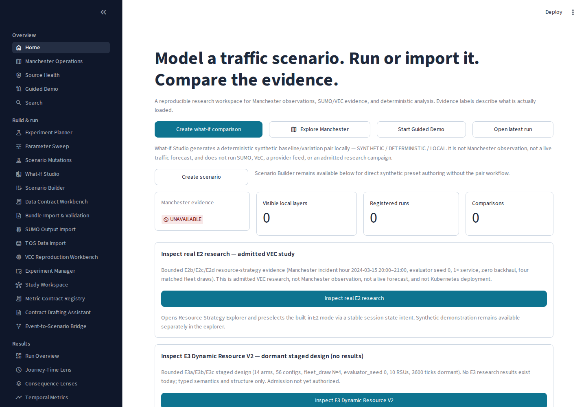

# Dynamic Resource Management for Intelligent Transport Systems

S M Abdulla Al Mamun  
The University of Manchester  
Master's dissertation, 2026  
Supervisor: Dr Sandra Sampaio


## Declaration

**Assistance and attribution.** I designed this study and every evaluation experiment reported here, and I am responsible for the analysis and its interpretation. The software was developed by me with generative-AI assistance: Codex and ChatGPT produced code, campaign tooling and draft text to my specification, which I reviewed and in many cases rewrote before use. Randy Prasetia Putra supplied the MAPPO actor, the vec_env environment and evaluator, and the accounting repair of 5 August 2026. Dr Sandra Sampaio suggested the report-age levels used in Section 2.7. Automated build and validation receipts identify the checks that were executed; my own verification of the results is recorded in the contribution statement (Section 3.7).

## Acknowledgements

I thank Dr Sandra Sampaio for supervising this project and suggesting the report-age levels. I thank Randy Prasetia Putra for supplying the MAPPO actor, the vec_env environment and evaluator, and the accounting repair. Automated assistance is disclosed in the Declaration.

## Abstract

A vehicle's strongest radio link can lead to a busy computing server, and admitting its task does not guarantee a result before the deadline. TrafficTwin investigates how infrastructure scheduling changes offered-task deadline attainment under a fixed, pretrained vehicle offloading policy. The comparison separates radio ingress, execution placement, admission and workload reservation.

Common-target least-workload placement underperformed execution at ingress, while causal per-task placement improved it. This reversal appeared in an adaptive incident study and a separate four-draw morning replication that excluded its inspected pilot. A later confirmation completed 32 evaluations across eight fresh joint fleet/evaluator-seed blocks. Per-task minus ingress was +4.137 percentage points; common-target minus ingress was −3.504. Per-task also exceeded causal cyclic spreading by +0.631 points, with a Bonferroni simultaneous 95% interval of [+0.511, +0.750]. All actions matched, although feedback was permitted and small observation/logit differences occurred in one block.

Retrospective analysis explains recurring common destinations through shared assignment, queue clearing and deterministic ties. The exact-model proof establishes when fixed-target reconciliation reproduces sequential admission; rounding limits its application to executable arithmetic. Original morning task accounting locates most gains in reduced gate rejection, while retaining individual losses. Separate CPU fixtures show that workload-aware targeting costs more than cyclic spreading, despite outperforming the common-target implementation in scheduler-only timing.

The findings support a bounded benefit from workload awareness beyond spreading. One actor, the same morning trace for confirmation, global service-work information and aggregate timing restrict generalisation and physical interpretation. Historical capacity findings separately retain inconclusive statistics and unresolved scoring uncertainty; the later gate-enabled results do not resolve that gap.

## 1. Introduction

### 1.1 Problem and motivation

Vehicular edge computing concerns where a vehicle's computational tasks should run and whether their results can return before a deadline. A task may execute locally, use a neighbouring vehicle through vehicle-to-vehicle communication (V2V), or enter roadside infrastructure through vehicle-to-infrastructure communication (V2I) [[1]](#ref-1), [[2]](#ref-2). A roadside unit (RSU) combines a radio access point with a simulated computing server in this study. Offloading therefore couples communication conditions with the work already waiting for computation [[3]](#ref-3).

WHO's *Global status report on road safety 2023* estimates 1.19 million road traffic deaths in 2021 [[43]](#ref-43), motivating research into timely information sharing. 3GPP TS 22.186 v16.2.0 sets maximum end-to-end latencies of 100 ms for automated-driving information sharing between a vehicle and an RSU (clause 5.3, Table 5.3-1) and 500 ms for platooning reporting, including vehicle–RSU communication (clause 5.2, Table 5.2-1) [[42]](#ref-42). The 100 ms and 500 ms task deadlines used in this study correspond to those two requirement classes; the correspondence motivates the deadlines and does not validate the simulation.

Deadline attainment matters because a computed answer has value only within the time window in which an application can use it [[4]](#ref-4). Offloading gives a vehicle access to additional computing resources, but transmission and waiting can consume that window. The mobile-edge literature frames the problem as joint communication and computation management [[3]](#ref-3). I therefore measure timely results over all offered tasks, so successful transmission or selective admission cannot stand in for useful completion.

Mobility makes this harder: radio conditions and the vehicles around an RSU can change while previously admitted work still occupies its server [[5]](#ref-5). A good connection at offloading does not establish spare computing service. Research on heterogeneous vehicular edge computing accordingly considers communication and resource allocation together with stringent latency requirements [[6]](#ref-6). This motivates examining infrastructure decisions under fixed vehicle-policy weights.

The Manchester scenarios give the comparison a concrete traffic setting. I use saved SUMO working-day and incident-model traces as repeatable inputs, exposing the same scheduling rules to different scenario conditions. These simulated movements do not establish live performance on Manchester roads. An operator must decide whether to retain ingress execution, distribute work or alter admission, accounting for coordination cost and available service.

Research on RSU-to-RSU cooperation [[7]](#ref-7) and task inference across vehicle, RSU and edge resources [[8]](#ref-8) supplies a wider context for execution placement, as does deep-reinforcement-learning offloading in vehicular edge networks [[9]](#ref-9), [[10]](#ref-10), [[11]](#ref-11); I do not transfer its performance claims to TrafficTwin.

The **ingress RSU** is the roadside unit through which a vehicle reaches the infrastructure. TrafficTwin chooses ingress using the strongest simulated radio link. **Execution placement** is the subsequent choice of server for the task. Keeping execution at ingress avoids logical forwarding, but strong radio quality says nothing about that server's backlog. Assigning the work to another RSU can reduce waiting while introducing a different information and coordination requirement. Figure 1 shows the decision boundary studied here: the vehicle selects an offloading mode, while the infrastructure resolves the execution destination and admission [[S4]](#source-s4).

Admission is itself distinct from timely completion. A finite waiting room can accept another task even when the queued service would make it late. TrafficTwin's deadline-aware gate supplements a count-only limit by inspecting backlog, but it does not include the candidate's own service or transmission time. An admitted task can consequently miss its deadline. I retain rejected tasks in the offered population; measuring success only among admitted work would allow selective rejection to change the population being compared.

I froze the supplied multi-agent proximal policy optimisation (MAPPO) actor's upstream weights. Matched inputs and action checks distinguish infrastructure effects from retraining and possible observation feedback. The study compares scheduling implementations supporting an existing actor. The programme progressed from accounting and capacity to opposite ingress rankings for two least-workload implementations, distinguished by target timing, reservations and admission [[S0]](#source-s0)–[[S4]](#source-s4). Communication and computation jointly determine whether an offloaded task returns in time [[3]](#ref-3), [[6]](#ref-6).


*Figure 1. Experimental responsibility boundaries. Only admitted V2I work enters the selected execution queue; logical forwarding applies when ingress and execution differ. Resource scaling is outside the completed comparison [[S11]](#source-s11). Reading: follow the separation between vehicle mode choice, radio ingress and infrastructure execution placement.*

### 1.2 Related work and the position of this study

With RL supplying the upstream policy, the closest comparison is parallel-server dispatch: what information estimates waiting time, and when an assignment changes it.

**Queue count and remaining work.** Shortest-queue dispatch compares numbers of jobs; shortest-workload dispatch compares their outstanding service requirements [[12]](#ref-12), [[13]](#ref-13). With heterogeneous task sizes, these orderings can disagree. Harchol-Balter, Crovella and Murta explicitly study dynamic least-work-remaining assignment when service demand is known, alongside random, round-robin and size-based assignment. Their model assumes immediate per-arrival assignment, identical hosts, non-preemptive first-come-first-served service and Poisson arrivals. Their analysis shows that preferred assignment policies depend on task-size variability [[14]](#ref-14). Consequently, neither choosing the least workload nor achieving balanced allocation establishes universal optimality. TrafficTwin's inherited `jsq` name is misleading if read literally: the implemented selector compares service milliseconds, while a separate task count enforces finite admission capacity.

**Batch decisions and reservations.** Batching does not inherently imply sending a batch to one server. Sparrow pools probes across a parallel job and spreads its tasks over selected workers; late binding queues reservations and assigns tasks when workers become ready. Its discussion identifies both queue-count prediction errors and races between schedulers using apparently idle workers [[15]](#ref-15). This distinguishes two issues that a generic “batch versus per-task” description would conflate: sharing information across candidates can help, whereas committing many assignments against one unchanged destination can concentrate work. TrafficTwin evaluates the latter implementation. Its immediate service-work reservation is also different from Sparrow's worker-triggered task binding: TrafficTwin assumes the necessary information and acknowledgement are already available.

Ying, Srikant and Kang make the reservation distinction especially explicit: batch-filling samples queue counts, assigns tasks one by one and updates the chosen queue after each assignment. Their analysis assumes identical servers, exponential service, Poisson batch arrivals and random ties [[16]](#ref-16). This is close prior art for sequential within-batch updates. The evaluator also implements a power-of-two-choices variant (`dla_p2c`) that was not evaluated here [[17]](#ref-17). Although the evaluator comments mention their batch-filling work, its common-target reconciliation does not implement that destination rule. TrafficTwin's causal change is therefore an adaptation of established dispatch semantics, evaluated with workload information and deadline admission, rather than a novel batching principle.

**Local information and common destinations.** Vargaftik, Keslassy and Orda's Local Shortest Queue (LSQ) policies maintain possibly outdated queue-count estimates at multiple dispatchers. Their slotted model can send all jobs arriving at one dispatcher in a slot to one locally shortest queue, with random tie-breaking. Algorithms update local estimates by the jobs sent and refresh selected entries through communication. Their stability result requires stated arrival/service assumptions and bounded expected estimation error [[18]](#ref-18). Common destinations, stale-information herding [[45]](#ref-45) and local updates therefore predate TrafficTwin [[19]](#ref-19). TrafficTwin uses service-work information, deterministic ties, a backlog gate, five ordered slots and one-second aggregate draining. Neither the LSQ stability theorem nor its distributed communication results transfer directly to these finite-horizon deadline outcomes.

**Admission and useful completion.** Niño-Mora jointly studies admission and routing to heterogeneous multiserver queues, charging separately for rejection and admitted deadline misses. The model uses Poisson arrivals, exponential service, soft deadlines and state-dependent index policies; admitted late jobs remain until completion [[20]](#ref-20). This establishes admission as an optimisation decision with consequences beyond the admitted population. TrafficTwin instead preserves a simple inherited backlog filter to make the placement contrast interpretable. The gate does not estimate the complete response time or promise success. Counting successes over all offered tasks makes a reject-all policy score zero and prevents selective admission from concealing failures. That denominator is a deliberate measurement choice, not a newly invented admission algorithm.

Kovalenko et al. report lower deadline-miss rates with heterogeneous federation than no redirection [[46]](#ref-46). Their probabilistic placement and communication model differ from TrafficTwin's frozen-actor comparison; Table 1 compares mechanisms.

*Table 1. Closest-work comparison. “Work” means remaining service demand; “count” means queued jobs. TrafficTwin rows describe the frozen implementation, not a scheduling-family definition. Reading: compare decision semantics and evidence boundaries rather than equating methods by their scheduling labels.*

| Work / decision layer and arrivals | Information and update semantics | Admission / objective | Relationship to TrafficTwin |
|---|---|---|---|
| Harchol-Balter et al. [[14]](#ref-14): dispatch each arrival | Known service work; central per-arrival choice | Mean waiting time; size-normalised waiting | Closest least-workload comparator; no vehicular gate |
| Sparrow [[15]](#ref-15): parallel-job task placement | Sampled workers; queued reservations; worker replies bind tasks | Job response time; placement constraints | Batch spreading differs from one common destination; communication is explicit |
| Ying et al. [[16]](#ref-16): tasks within an arriving batch | Sampled counts; update after each assignment; random ties | Delay and sampling cost | Closest within-batch update rule; no deadline gate |
| LSQ [[18]](#ref-18): dispatcher batch per time slot | Local queue counts; own-assignment increments and sampled/pushed updates | Stability under specified assumptions | Common routing is established; random ties and distributed estimates differ |
| Niño-Mora [[20]](#ref-20): joint admission/routing per arrival | Queue counts and model-based indices | Rejection and deadline-miss costs | Supports joint evaluation, not the inherited backlog predicate |
| TrafficTwin common-target: one choice per substep | Global service work; vectorised candidate offsets and three reconciliations | Backlog gate plus finite task limit | Frozen vehicle policy; instantaneous logical forwarding |
| TrafficTwin per-task: ordered candidate scan | Global service work; actual admitted work reserved immediately | Same predicate and limit, causal admission | Tested implementation change; global information is assumed |

**Attribution and simulation validity.** Sargent distinguishes verification of a computer model from operational validation for its intended application [[21]](#ref-21). TrafficTwin's conservation and replay checks primarily establish the former; observed physical RSU service and network measurements would be needed for stronger deployment claims. SUMO supplies a microscopic simulation framework [[22]](#ref-22), but importing its trajectories does not independently validate a coupled radio/computing model. This distinction explains why a source-correct result can be scientifically useful while remaining conditional on simulation semantics.

PPO and MAPPO identify the reused actor's provenance [[23]](#ref-23), [[24]](#ref-24). Henderson et al., Agarwal et al. and Gorsane et al. motivate exposing implementation choices and finite-run uncertainty [[25]](#ref-25), [[26]](#ref-26), [[27]](#ref-27). TrafficTwin checks action equality empirically and uses draws or joint-seed blocks, not tasks, as replications.

Digital-twin work spans distinct interventions [[28]](#ref-28). Dasgupta et al. study adaptive traffic control [[29]](#ref-29); Xie, Wu and Fan study offloading and allocation with estimation error at a single base station [[30]](#ref-30). Cho et al. explicitly model parallel computation queues [[31]](#ref-31). These differ from the fixed-actor, multiple-RSU dispatch comparison here, motivating clear control and queue semantics.

Communication remains part of feasibility: Wu et al. model heterogeneous links under latency/reliability constraints [[6]](#ref-6), while hybrid vehicular/cloud offloading coordinates communication-constrained V2V and edge resources [[32]](#ref-32). TrafficTwin instead fixes vehicle mode choice to expose infrastructure dispatch.

### 1.3 Aim, objectives and research questions

Five objectives organise the programme. The aim is to assess infrastructure admission and placement under a frozen vehicle actor.

**O1 — Establish the measurement contract.** Distinguish offers, admissions, failures and deadline success. Treat E0/E1 as validation and scoping, retaining historical evidence limits.

**O2 — Distinguish dispatch alternatives.** Specify ingress, common-target, causal per-task and cyclic placement, including control boundaries, reservation timing and validation.

**O3 — Estimate matched contrasts.** Compare incident and morning draws, then test declared contrasts on separate joint-randomness blocks.

**O4 — Explain mechanisms and boundaries.** Connect dispatch to destination concentration, the conditional exact result and completed information-age/forwarding sensitivities.

**O5 — Deliver an inspectable artefact.** Document evaluator, campaign, verification and product components with reproducible inventory and evaluation boundaries.

Three research questions follow. **RQ1:** Under matched gate-enabled controls, how do common-target and causal per-task placement compare with ingress execution, and what implementation semantics explain the observed direction reversal? **RQ2:** Does the reversal recur in separate morning samples, and does workload-aware causal placement add benefit over cyclic spreading in the new joint-randomness blocks? **RQ3:** What do the completed information-age and fixed-forwarding sensitivities establish about the boundaries of per-task placement?

Established work addresses least-workload routing, within-batch updates and vehicular cooperation [[14]](#ref-14), [[16]](#ref-16), [[7]](#ref-7), [[8]](#ref-8). The gap addressed here is narrower: whether the operational timing of destination selection and reservation reverses a matched deadline-attainment comparison under a preserved vehicle actor. The contribution joins offered-task accounting, explicit implementation contracts and separate replications; it is not a new dispatch principle. Section 4.1 gives an objective-by-objective verdict.

### 1.4 Scope and report structure

I evaluate the trace-driven VEC scheduler. Section 3.7 separately assesses TrafficTwin's Streamlit interface, typed services, command-line workflows and provenance facilities; their existence does not establish execution of the research campaigns or effects on physical Manchester traffic.

I did not conduct the planned user evaluation; usability, operator benefit and adoption remain unestablished. E3 Dynamic Resource V2 also remains unexecuted [[S11]](#source-s11). Section 2 specifies the method, Section 3 evaluates completed work, and Section 4 concludes.

**Ethical and professional considerations.** This study used simulated SUMO traces, with no human participants or personal data, and my University of Manchester Ethics Decision Tool check on 15 September 2026 indicated that ethics approval was not required [[44]](#ref-44). I acknowledge the supplied evaluator, environment and actor with their provenance; the Declaration discloses AI assistance. Simulation outcomes support no deployment or road-safety claim. The sealed confirmation comprised 32 cells and took approximately 107 minutes on one CPU, with exact timing boundaries in Appendix E.

## 2. Methodology

### 2.1 Research design and evidence hierarchy

Matched traffic, fleet and task inputs isolate infrastructure changes under a frozen policy; recorded actions are checked rather than assumed identical. Conclusions concern this evaluator, not retrained or physically validated systems.

Frozen source and accepted records determine experimental meaning; correspondence clarifies intention. Section 2.6 separates adaptive development from replication and confirmation. Audits and kernel explanations remain retrospective [[S0]](#source-s0)–[[S8]](#source-s8), [[S13]](#source-s13).

### 2.2 Architecture and information boundaries

Figure 1 separates actor mode choice, environmental radio targeting and infrastructure execution/admission. V2I ingress is the strongest simulated radio link. Ingress execution retains that RSU; load-balancing arms may assign elsewhere. A target remains a proposal until admission [[S4]](#source-s4).

The 17-dimensional observation includes task descriptors, vehicle queues, state of charge, radio summaries, compute capability, EV status and observed V2V target tier, but excludes RSU workload. One mode per active vehicle-second serves all independently sampled operational tasks in its five slots. Admission can nevertheless affect transmit energy, then SoC and later observations/actions. Frozen weights therefore do not guarantee fixed actions; the old matched-action finding is empirical, and the new protocol allows this feedback.

V2V helper selection follows the inherited strongest-link convention, held constant across arms (Appendix F).

### 2.3 Scenarios, actor and controlled inputs

Both scenarios are drawn from the Manchester SUMO working-day and incident models: `manchester_workingday/trace_wd_am_wdrsu.npz` and the 15 March 2024 incident trace (Table 2). Coordinates are local trace metres. Evaluations import saved positions without rerunning SUMO. Morning input checks reconstruct canonical arrays and verify entry markers because padded slots need not retain one vehicle identity. Queues reset for each new visit; SoC does not. The incident trace retains its earlier convention without the same entry channel [[S7]](#source-s7).

Figure 2 shows the authenticated morning RSU layout in local trace metres, not deployed Manchester equipment. Incident coordinates are absent from the compact evidence and are not invented. Each comparison preserves its scenario's trace and layout (Table 2).


*Figure 2. Morning trace RSU positions copied from the canonical input-validation record, with original zero-based indices. The incident trace contains ten RSUs; its positions are not reconstructed here. Local network coordinates are not latitude/longitude or a verified street-map projection [[S8]](#source-s8). Reading: the nine morning locations are spatial inputs, whereas the dispatch comparisons change task destinations without moving these RSUs.*

*Table 2. Scenario identity and fixed placement controls. Differences between scenarios are retained and documented, not treated as a single-factor intervention. Reading: note the bundled scenario differences before attributing an effect to traffic density.*

| Setting | Incident scenario | Morning scenario |
|---|---|---|
| Date and local window | 15 March 2024, 20:00–21:00 | 15 October 2024, 08:00–11:00 |
| One-second steps | 3,600 | 10,800 |
| Padded vehicle slots | 2,488 | 215 |
| RSUs | 10 | 9 |
| SUMO seed | 43 | 42 |
| Vehicle queue convention | Conserved, legacy trace convention | Conserved, canonical per-visit reset |
| Placement-study RSU limit | 6,220 tasks per RSU | 6,220 tasks per RSU |
| Service / forwarding / scaling | 1× / 0 ms / off | 1× / 0 ms / off |

One archived MAPPO checkpoint and one device-tier preset are fixed throughout; training was not reproduced (Appendix F).

Each active vehicle offers min(Poisson(1.5), 5) tasks per second; inactive slots offer none. Operational task types are independently sampled with probabilities (0.20, 0.30, 0.50). Types 1–3 have deadlines (100, 500, 100) ms, mean input sizes (1, 0.0012, 0.001) MB and workloads (1,254, 2,100, 15) million cycles. Input sizes multiply their type mean by an independent uniform 0.8–1.2 factor. The five-slot cap changes offered work as well as scheduling opportunities [[S4]](#source-s4).

Service times derive from task cycles, device frequency, parallelism, utilisation and acceleration, giving about 21, 35 and 2.5 ms for the three types before noise (Appendix F).

Absolute capacity avoids a confound: the incident ratio 2.5 × 2,488 gives 6,220 tasks per RSU; applying 2.5 to the morning width would give only 538. The morning protocol fixes 6,220 explicitly. Density, duration, layout and vehicle-entry conventions still differ.

### 2.4 Time, queues, admission and outcomes

A batch advances simulated time by one second. Five internal task substeps order admissions; they are not five 200 ms clock advances. Let W[r] denote remaining service milliseconds at RSU r, Q[r] its aggregate task count and C the task limit. Identical counts can represent different work, and increasing C does not accelerate service. Work accumulates across all five substeps before one service drain [[S4]](#source-s4).

For each offered task i, let a[i] indicate admission, y[i] indicate the recorded deadline success, and z[i,c] indicate terminal failure category c. The intended accounting contract requires one admission or failure and no success for rejected work. The per-run primary outcome and validation requirements are:

**(1)** A = N_met / N_offered = Σ y[i] / N_offered; reported percentage = 100A.

**(2)** a[i] + Σ z[i,c] = 1; y[i] ≤ a[i]; N_offered = N_admitted + N_failed.

Here N_failed includes both rejection and unavailability. Categories distinguish local queue rejection, V2V queue rejection or unavailability, and V2I unavailability, backlog-gate rejection or capacity rejection. Gate failure takes precedence over capacity failure when both apply. Selected targets are proposals; rejected tasks neither execute nor reserve work (Figure 3). Admitted attainment uses N_admitted instead, so must not replace Equation (1). Offered, admitted and successful-task latency means similarly have different populations.


*Figure 3. Offered tasks remain in the primary denominator. Admission, execution assignment and deadline outcome are separate fields; selecting an RSU does not establish that work executed there. Reading: follow every offered task to an admission or terminal failure before interpreting deadline attainment.*

The inherited gate tests existing effective workload, including the candidate offset O[i], against deadline D[i]:

**(3)** W[r] + O[i] < D[i], together with an available task-count place.

The inequality is strict. It excludes the candidate's service, radio transfer and forwarding cost, and therefore is a backlog filter rather than an end-to-end feasibility guarantee. Candidate ordering and offsets differ between algorithms (§2.5). Admission uses positive ingress link quality as its coarse radio condition; the latency model additionally requires quality at least 0.15 for a usable transmission. Consequently, admission can still lead to a transmission-related deadline miss.

For viable V2I execution, the modelled response latency is:

**(4)** L_raw[i] = T(input[i], q, c) + W[r] + O[i] + s[i,r] + T(0.001, q, c) + f · 1(r ≠ ingress[i]).

Transfer, service and return-term constants are given in Appendix F.

Appendix F states the legacy `off` scoring path and the penalty mapping; success uses L[i] ≤ D[i].

For each queue over an interval, work accounting requires:

**(5)** W_initial + Σ admitted service = Σ served service + W_final.

After the fifth substep each queue drains up to 1,000 ms of work; Appendix F gives the count-update rule.

### 2.5 Placement algorithms and their implementation

The inherited identifiers do not define canonical scheduling algorithms: `jsq` selects least service workload rather than shortest task count, and `dla` combines that common-target selector with Equation (3) [[S2]](#source-s2), [[S4]](#source-s4). The evaluator's own help text and source comment document that `jsq` and `dla` broadcast one argmin per substep to every V2I candidate, and that a randomised two-choice mode (`p2c`, `dla_p2c`) exists as a per-vehicle spreading alternative. Table 3 makes their execution destination and gate switch explicit.

*Table 3. Infrastructure conditions. All retain strongest-link radio ingress. “Live” eligibility is refreshed at each substep; the historical off mode retains step-entry coarse eligibility. `p2c` and `dla_p2c` are available; not evaluated. The other listed modes were evaluated. Reading: follow the fixed quantities and changed decision rules for each comparison.*

| Mode | Execution destination | Backlog gate | Coarse eligibility |
|---|---|---|---|
| `off` | Ingress | Off | Step entry |
| `jsq` | Common least-workload target | Off | Live |
| `ingress_dla` | Ingress | On | Live |
| `dla` | Common least-workload target | On | Live |
| `per_task_dla` | Causal least-workload target | On | Live |
| `causal_round_robin` | Persistent cyclic target | On | Live |
| `p2c` | Per-vehicle two random candidates, least workload | Off | Live |
| `dla_p2c` | Per-vehicle two random candidates, least workload | On | Live |

Both placement algorithms below operate once per task substep, using its entry state W, Q. Index i follows ascending padded-vehicle order, not arrival-time or deadline priority. Each candidate has actual service s[i,r], deadline D[i] and a fixed actor action and radio ingress. Every argmin considers all RSUs and breaks ties by lowest index; a full selected RSU is rejected rather than excluded and retried elsewhere.

Proposition 1 supplies an exact-model guarantee under stated assumptions, not a blanket float32 guarantee. For common-target reconciliation, let E[i] mean active V2I attempt, positive ingress quality and Q[r[i]] < C at substep entry. For an admission mask M, define O[i,M] as the sum of s[j,r[i]] over earlier j < i with the same target and M[j] true; H[i,M] is their count. Offsets are exclusive: a candidate's own service is omitted. Algorithm 1 performs exactly three simultaneous replacements.

```text
Algorithm 1: common-target placement with gate (one substep)
r[i] = lowest-index argmin(W), shared by all candidates
M = E
repeat exactly three times:
    compute O[i,M] and H[i,M] from the previous whole mask
    M_new[i] = E[i] and (W[r[i]] + O[i,M] < D[i])
                       and (H[i,M] < C - Q[r[i]])
    M = M_new simultaneously
recompute final offsets O[i,M] for latency
label E-candidates failing the final workload test as gate failures
label remaining E-candidates excluded by M as capacity failures
commit each M-admitted task and its full service once
unavailable or rejected tasks reserve nothing
```

Target selection never changes during reconciliation. The retained mask and recomputed offsets determine recorded processing. Section 3.5 distinguishes the exact guarantee from its float32 boundary. Ingress with the gate uses the same offset/reconciliation machinery with individual ingress targets instead of the common argmin. Gate-off modes omit the workload test.

```text
Algorithm 2: causal per-task placement with gate (one substep)
repeat exactly three complete passes:
    working_W = W; working_Q = Q       # restart, not cumulative
    for i in ascending padded-vehicle order:
        r[i] = lowest-index argmin(working_W)
        O[i] = working_W[r[i]] - W[r[i]]
        require active V2I, positive quality and Q[r[i]] < C
        test working_W[r[i]] < D[i], then working_Q[r[i]] < C
        if admitted:
            working_W[r[i]] += s[i,r[i]]
            working_Q[r[i]] += 1
        otherwise label failure; reserve nothing
retain the last pass; commit its admitted work once
```

This intervention changes selection frequency, reservation visibility and reconciliation semantics, rather than argmin frequency alone. Repeated passes restart identically and commit once; they neither triple reservations nor drain service between substeps. The causal gate and capacity see earlier admissions immediately.

Figure 4 is a constructed mechanics example, neither a recorded task group nor an estimate of recoverable historical failures. Assume three empty identical RSUs, four viable 40 ms tasks with 100 ms deadlines, nonbinding capacity and negligible communication. Common-target chooses RSU 0; its masks settle at three admissions and one gate rejection. The admitted offsets are 0, 40 and 80 ms, leaving 120, 0, 0 ms: the third admitted task misses its deadline despite passing the backlog gate. Per-task selects 0, 1, 2, 0, leaves 80, 40, 40 ms and all four meet deadlines under these assumptions.


*Figure 4. Four illustrative proposals. The common destination remains fixed through reconciliation; causal placement updates after admissions. The accompanying worked example states admissions and deadline outcomes under deliberately simplified assumptions. Reading: compare the unchanged common destination with immediate reservations and reselection after each admitted task.*

### 2.6 Experimental progression and inference

E0 and E1 form the validation and scoping stage. E0 supplies the recorded measurement foundation; E1 compares three queue limits at fixed service over five matched draws; E2/E2b explore placement and admission on one draw. E2c compares common-target with ingress on new incident seeds 1–4. After inspecting them, E2d adds per-task placement on those same draws and reuses their controls: an adaptive extension, not new independent observations [[S0]](#source-s0)–[[S3]](#source-s3).

The morning pilot uses seed 1 for ingress and per-task placement. After inspecting it, the replication declares seeds 0, 2, 3 and 4 and all three arms, yielding twelve new full runs. The primary contrasts are per-task minus ingress, common-target minus ingress, and per-task minus common-target. The pilot is excluded; a supplementary two-arm five-draw summary is descriptive. The local protocol and manifest preceded the new outcomes, but there was no external preregistration [[S7]](#source-s7), [[S8]](#source-s8) [[33]](#ref-33).

For each contrast, a fleet draw supplies one paired difference in percentage points. Draws receive equal weight. The mean difference has a Student-t interval, mean ± t × sample standard deviation / square root of n. Incident E2c/E2d retain their reported individual 95% intervals. The original morning protocol additionally uses Bonferroni simultaneous intervals for three contrasts, with critical value t at probability 1 − 0.05/(2 × 3), three degrees of freedom [[34]](#ref-34). Its reversal criterion requires the simultaneous common-target-minus-ingress interval below zero and the per-task-minus-ingress interval above zero. Four draws cannot strongly diagnose distributional assumptions; these small-sample intervals remain conditional parametric summaries, not task-level significance tests.

The later confirmation uses eight paired fleet/evaluator-seed blocks, (100,200) through (107,207), and four arms: ingress, common-target, per-task and causal round-robin. Controls, rotating arm order and analysis were sealed before full outcomes [[33]](#ref-33). Per-task minus ingress, common-target minus ingress and per-task minus round-robin receive equal block weights and two-sided Bonferroni simultaneous 95% Student-t intervals, df=7. The same two-direction criterion tests recurrence; original draws and pilots remain separate. Independent joint blocks and approximately normal paired effects remain assumptions that eight blocks cannot strongly diagnose [[S16]](#source-s16).

### 2.7 Sensitivities, mechanism audit and validation

The state-information pilot uses incident seed 1 and report ages 0, 100, 500 and 1,000 ms, alongside ingress. The report ages follow Dr Sampaio's suggestion of 100 ms, 500 ms and 1 s. Admission remains live. For previous post-admission workload B and positive age d, the report is max(B − (1,000 − d), 0), with current-batch reservations added immediately. This assumes continuous service between batches without redistributing arrivals. Startup uses live state and recorded age zero [[S5]](#source-s5).

Four ten-step forwarding probes qualify fixed-latency transformations of saved full records: charges leave admission, queues and actions unchanged. No full positive-cost simulation or network model is implied; penalty-equal ambiguity remains unresolved [[S6]](#source-s6).

Execution fields record admitted assignment, not departures [[S13]](#source-s13). Morning checks covered matched inputs/actions and full/probe prefixes, with logit tolerance 0.00001 and workload-balance error up to about 0.00174 ms [[S8]](#source-s8).

A retrospective audit cross-checks admission, categories, latency and assignments; Appendix B records its coverage and the A/B/C diagnostic design.

### 2.8 Cyclic comparator and retrospective measurement design

Causal round-robin isolates workload awareness from spreading. Its pointer starts at RSU 0, persists across substeps/batches, and advances modulo R for every active positive-radio V2I attempt, including rejections. Unavailable radio and padding do not advance it; there is no retry or full-node skipping. Order, sampled work, gate/capacity, precision, accounting, forwarding and drain match per-task placement. Repeated passes restart identically; the pointer commits once. A versioned evaluator preserves frozen implementations. Qualification checks compatibility, shared inputs, admission accounting and restart; Appendix E bounds coverage [[S15]](#source-s15), [[S16]](#source-s16).

Scheduler-only timing follows the protocol in Appendix D over sixteen configurations.

Retrospective type aggregation retains all types and draws without subgroup significance tests, using the eight authenticated ingress/per-task files from the original four-draw morning sample. Categories supply admission, gate rejection and admitted misses; type totals must reproduce all-task summaries and paired net changes.

### 2.9 Method selection and alternatives

Table 3a makes the design trade-offs explicit, using the controls and limitations already described. The alternatives provide a retrospective comparison of methodological choices; they were not all evaluated. Matched conditions support attribution within the evaluator, while replication defines which uncertainty the intervals address.

*Table 3a. Method selection and alternatives. Reasons refer to the implemented study, with consequences limiting interpretation. Reading: connect each selected method to its alternative, purpose and resulting evidence boundary.*

| Choice | Alternative considered | Reason here | Consequence |
|---|---|---|---|
| Frozen actor with matched inputs | Retrain per arm | Isolates infrastructure effect | No claim about co-adapted policies |
| Offered-task denominator | Admitted-task success | Reject-all scores zero; selective admission cannot hide failures | Rates lower than admitted-only figures |
| Fleet draws / joint blocks | Task-level tests | Within-run tasks are dependent | Wide intervals; few degrees of freedom |
| Student-t with Bonferroni | Bootstrap or permutation | Four and eight paired replicates; prespecified three-contrast family | Conservative intervals; parametric assumptions remain |
| Causal round-robin control | Random or two-choice (`dla_p2c`) spreading | Isolates workload awareness with identical admission kernel; Section 3.2 explains comparator development | Two-choice comparison deferred (Section 4.4) |
| Fixed forwarding charge on saved records | Network simulation | Admission, queues and actions unchanged; bounded qualification | No congestion or feedback modelled |
| Absolute capacity 6,220 per RSU | Ratio to fleet width | Avoids confounding capacity with fleet size | Morning limit non-binding |
| Trace-driven JAX evaluator | Re-running SUMO per arm | Identical mobility across arms; deterministic replay | No traffic response to offloading |

## 3. Evaluation and Reflection

### 3.1 Validation and scoping: accounting and historical capacity

Addresses O1 and the measurement basis of RQ1.

E0 addressed a concrete mismatch between task scoring and queue admission. In the legacy clamp path, the evaluator scored eligible V2I tasks and multiplied their combined service work by the fraction fitting the task-count ceiling. Surplus tasks were not individually identified in earlier scoring. The 5 August repair introduced per-task admission/rejection and full enqueueing of admitted work. Putra implemented the repair after I identified the mismatch between task scoring and queue admission; E0 qualified recorded accounting in that configuration [[S0]](#source-s0), [[S12]](#source-s12).

Appendix B gives a constructed two-task example of the legacy fractional enqueue and states the admission/failure partition invariant.

Archived E0 receipts report passing their checks, but source inspection identifies a remaining exception in E0/E1 and E2's reused off path: coarse eligibility reaches latency scoring while refined admission governs enqueueing. Recorded capacity rejections establish exposure, not false successes. Raw per-task arrays for E0, E1 and E2 were not retained; their run summaries, validation receipts and manifests are archived and reproduce the reported intervals. The task-level impact of the scoring-mask exception therefore cannot be quantified for those studies; Appendix B distinguishes this gap from later audit coverage [[S13]](#source-s13).

E1 varied waiting-room capacity across five matched draws. The archived score difference for 99,520 versus 1,866 tasks per RSU was −0.01094 percentage points, with a 95% interval [−0.02465, +0.00276]. Recalculation from surviving run summaries reproduces this interval; it is not fresh task-level validation. The archived E1 score contrast is statistically inconclusive under the historical implementation. Its interpretation as admission-consistent deadline attainment remains qualified by the unquantified scoring-mask exception. The interval describes sampling uncertainty conditional on that implementation, not the additional measurement uncertainty. Neither equivalence nor statistically supported degradation follows [[S1]](#source-s1).

The saved secondary summaries report more admissions and lower rejection at larger limits, while mean admitted latency rises from approximately 3.77 to 12.19 and 132.49 seconds. These changing admitted populations cannot substitute for the offered-task contrast; their latency summaries retain the scoring-mask qualification. More retained work need not mean more useful service.

Changing the off scoring mask could affect transmit energy, SoC and later observations: even admission-consistent saved flags would describe fixed history, not a corrected rerun. Separately, the completed audit found no non-admitted successes or non-penalty rejection latencies in 19 authenticated September gate-enabled runs, with admission/category/summary agreement. It supports those outcomes without resolving historical measurement impact.

### 3.2 From admission decomposition to the incident reversal

O2 and O3 address RQ1 here.

**Setting.** E2's exploratory seed-0 comparison showed offered attainment of approximately 68.362% for strongest-link execution without the deadline gate, 67.568% for inherited least-busy placement without the gate, and 69.494% for inherited least-busy placement with the gate. The last comparison changed both placement and admission relative to the strongest-link reference. Its improvement could not establish that load balancing itself helped [[S2]](#source-s2).

E2b added ingress execution with the same deadline gate, reaching approximately 71.577%. The strongest-link contrast was +3.215 points and the common-target contrast +1.926 points, giving an interaction of −1.290 points. However, `off` uses step-entry coarse saturation eligibility while `ingress_dla` refreshes eligibility per substep. Their contrast and interaction bundle the gate with this timing difference and retain the legacy scoring-mask exception (§2.4). The manifest records 138 unavailable V2I attempts among 13,076,234 offered tasks in off; that count does not bound downstream effects. E2b identifies a stronger comparator without assigning its entire gain solely to the gate. Subsequent gate-held placement comparisons use live eligibility and refined scoring masks in all arms. In the exploratory draw, common-target remained 2.083 points below ingress with the gate.

**Results.** E2c tested the common-target comparison on four new incident fleet draws, excluding discovery seed 0. Its mean difference from ingress was −2.122 points, with an individual 95% interval of [−2.234, −2.011]. All four paired differences were negative. The inherited scheduler selects one least-workload target per task substep and assigns it to every V2I candidate in that substep, a behaviour recorded in the evaluator's documentation. I chose to test a causal per-task implementation rather than the evaluator's randomised two-choice mode, because it isolates target timing and reservation visibility while holding the least-workload criterion fixed; the two-choice mode remains the first comparator to add (Section 4.4). E2d introduced the causal per-task implementation under the same actor, trace, gate predicate, queue ceiling, service and forwarding controls. Table 4 retains all four draw-level results [[S3]](#source-s3).

*Table 4. Incident offered-task deadline attainment, expressed as percentages. E2d reused the exact E2c ingress and common-target controls; these are four paired draws, not separate sets of independent controls. Reading: compare policies within the same incident fleet draw.*

| Fleet seed | Ingress | Common-target | Per-task | Per-task − ingress, pp |
|---|---:|---:|---:|---:|
| 1 | 72.003 | 69.794 | 72.467 | +0.464 |
| 2 | 70.369 | 68.317 | 70.956 | +0.587 |
| 3 | 70.298 | 68.153 | 70.805 | +0.507 |
| 4 | 70.887 | 68.805 | 71.438 | +0.551 |

Per-task exceeds ingress by 0.527 points, individual 95% interval [+0.442, +0.612], and common-target by 2.649 points, interval [+2.621, +2.678]. RQ1 therefore yields opposite rankings for the two implementations. These intervals summarise an adaptive extension on examined draws; the morning protocol supplies prospective replication.

Neither arm establishes optimal dispatch; the conversions here describe the observed mean. The larger +2.649-point common-target contrast diagnoses that implementation rather than the gain over the stronger reference. Against ingress attainment of 70.889%, the +0.527-point difference means about 53 extra successes per 10,000 offered, or a 0.744% relative increase.

### 3.3 Morning replication with the inspected pilot excluded

O3 addresses RQ2 through prospective replication.

**Setting.** The inspected morning pilot offered 1,744,116 tasks and produced 91.075% ingress versus 94.028% per-task attainment: +2.953 points or 51,503 successes. It motivated replication but remains exploratory [[S7]](#source-s7).

**Results.** The morning protocol declared four new seeds and all three arms before outcomes. Table 5 reproduces common-target < ingress < per-task in every draw. Mean attainment is 85.655%, 88.887% and 92.785%, respectively; its lower ingress/per-task means than the pilot underline the need for replication [[S8]](#source-s8).

*Table 5. Morning primary replication. Seed 1 is absent because it was the inspected pilot; each row is a matched fleet draw on the same morning trace. Reading: compare policies within a row; the inspected pilot is absent.*

| Fleet seed | Ingress, % | Common-target, % | Per-task, % | Per-task − ingress, pp |
|---|---:|---:|---:|---:|
| 0 | 88.817 | 85.660 | 92.705 | +3.888 |
| 2 | 87.536 | 83.537 | 92.060 | +4.524 |
| 3 | 89.082 | 85.862 | 92.978 | +3.896 |
| 4 | 90.113 | 87.559 | 93.399 | +3.286 |

Table 6's simultaneous per-task-minus-ingress interval is positive and common-target-minus-ingress interval negative, satisfying the prespecified reversal criterion. Figure 5 displays these primary results.

*Table 6. Morning paired contrasts in percentage points. Individual intervals are two-sided 95% Student-t intervals; simultaneous intervals use the prespecified three-contrast Bonferroni adjustment. Replication uses four fleet draws. Reading: use the simultaneous intervals for the declared three-contrast decision.*

| Contrast | Mean | Individual 95% interval | Simultaneous 95% interval |
|---|---:|---|---|
| Per-task − ingress | +3.899 | [+3.094, +4.703] | [+2.671, +5.126] |
| Common-target − ingress | −3.232 | [−4.176, −2.289] | [−4.672, −1.793] |
| Per-task − common-target | +7.131 | [+5.385, +8.877] | [+4.466, +9.795] |


*Figure 5. Redrawn from archived morning primary data. Left: within-draw attainment. Right: draw differences, mean diamonds and three-contrast Bonferroni intervals. The inspected pilot is excluded; uncertainty concerns four newly declared fleet draws, conditional on the frozen actor and morning scenario [[S8]](#source-s8). Reading: read the four new fleet draws as matched replications and the adjusted intervals as the declared contrast family.*

The five-draw ingress/per-task mean including the pilot is +3.709 points descriptively, outside Table 6; no common-target pilot result is available.

The larger morning effect cannot be attributed solely to density: RSU layout/count, date, duration, padded fleet width and entry conventions also change. Separate scenario analyses support recurrence rather than a pooled geographical effect. The morning gain is about 390 extra successes per 10,000 offered, a 4.386% relative increase over ingress.

### 3.4 Confirmation under joint randomness and comparison with cyclic spreading

O2 and O3 address RQ2 through confirmation.

**Results.** All 32 full morning cells and eight block-control receipts passed after bounded qualification, with no failed attempts, retries or exclusions. Table 7 reports the declared contrasts; Appendix E retains every block [[S16]](#source-s16).

**Setting.** Evaluator seed varies observation descriptors, arrivals, operational types/sizes, fading and service wobble; fleet seed varies tier, EV status and initial SoC. The estimand remains the total scheduling intervention under frozen weights, without forcing replay or guaranteeing future action equality. Small observation and logit differences occurred in block 1; they did not change actions. All four arms shared the required exogenous arrays exactly within each block, and actions matched exactly in all 24 non-reference arm/block comparisons.

*Table 7. New morning confirmation, eight paired joint-seed blocks with equal weighting. Two-sided Bonferroni simultaneous 95% Student-t intervals cover the three predeclared contrasts; positive differences favour the first arm. Reading: both reversal directions and the cyclic-control increment are assessed in one three-contrast family.*

| Contrast | Mean difference, pp | Simultaneous 95% interval, pp |
|---|---:|---|
| Per-task − ingress | +4.137 | [+3.556, +4.717] |
| Common-target − ingress | −3.504 | [−3.980, −3.028] |
| Per-task − round-robin | +0.631 | [+0.511, +0.750] |

The declared reversal criterion holds, evaluated using both directional requirements within the same simultaneous family. The mean per-task difference corresponds to +413.7 successes per 10,000 offered tasks relative to ingress. Workload-aware targeting outperformed cyclic spreading in this study. Its mean benefit is 63.1 successes per 10,000 offered tasks over round-robin, accompanying higher scheduler-only cost on the separate fixtures in Appendix D, Table D2.

Figure 6 shows all four arms in each of the eight blocks, rather than reusing the earlier four-draw plot for this confirmation. Equal block weighting gives mean attainment of 88.372% for ingress, 91.879% for round-robin and 92.509% for per-task placement. The descriptive round-robin-minus-ingress difference is +3.506 percentage points, and the further per-task-minus-round-robin increment is +0.631 points. Their sum is the +4.137-point per-task-minus-ingress difference [[S16]](#source-s16).

The unrounded mean increments give **84.8% for ingress-to-round-robin and 15.2% for the additional round-robin-to-per-task step**. These are descriptive shares of arm-mean differences, not causal mechanism shares or a fourth declared inferential contrast. The closer workload-awareness comparison is per-task versus causal round-robin: cyclic spreading captures most of the ingress gain, with a smaller, consistently positive workload-aware increment.


*Figure 6. Offered-task deadline attainment recomputed as 100 times successes divided by offers for each of the 32 archived cells. Lines connect the same policy across eight matched blocks; block labels show fleet/evaluator seeds. No tasks are treated as independent replications and no uncertainty intervals are inferred from the line segments [[S16]](#source-s16). Reading: every block retains common-target below ingress and per-task above round-robin; Table 7 supplies the declared simultaneous intervals.*

The critical value is 3.127552 with seven degrees of freedom; full controls are in Appendix E. Joint randomness does not vary geography, actor training or the physical model. It extends the original fleet-conditional finding to new evaluator streams.

### 3.5 Why destination semantics matter

O4 addresses the mechanism component of RQ1.

Common-target placement assigned morning work only to RSUs 0–4, whereas causal per-task placement used all nine. With K substeps and R RSUs, selecting one destination per substep admits new work to at most min(K, R) destinations in a batch. Empty starts, lowest-index ties, positive admissions and no intervening drain further produce the recurring low-index prefix. Under the exact gate/service model, workload remains below 538.889 ms before the 1,000 ms drain, explaining the recurring empty starts. Appendix C retains the reconstructed states and Figure 8 [[S8]](#source-s8), [[S9]](#source-s9). The live-state mechanism differs from stale-information herding [[45]](#ref-45); federation benefits remain implementation-specific [[46]](#ref-46).

**Proposition 1 (fixed-target admission in the studied exact model).** Fix candidate order, eligibility, destinations, initial nonnegative workload/count and nonnegative service demands, with strict backlog and exclusive count-capacity tests and no intervening drain. At each nonempty destination, let n be the eligible candidate count and d the number of distinct deadlines. Starting from the eligibility mask, simultaneous replacement reaches the unique causal fixed point within min(n, 2d−1) replacements; destinations decouple.

**Remark.** With fixed destinations, repeated admission updates eventually agree with admitting candidates in order, under the stated exact-arithmetic assumptions. The guarantee concerns admission at those destinations; it neither chooses better destinations nor guarantees that floating-point execution follows the same decisions.

With the studied two deadline values, the bound is three replacements in exact arithmetic. This rules out unrestricted fixed-target reconciliation failure as an explanation within that model; it does not equate fixed targets with reselection or exact arithmetic with float32 execution. The proof, numerical boundaries and adverse example are retained together in Appendix C [[S14]](#source-s14).

Matched outcome accounting in the original four-draw morning sample records 284,821 gained successes and 12,842 losses, for 271,979 net successes. Gate-rejection recovery supplies most gains. These are descriptive transitions under diverging later queues, not individual-decision causal effects. Tables C2 and C3 preserve the full transitions and type breakdown in Appendix C: the mechanism concentrates destinations, while the outcome accounting shows where attainment changes.

### 3.6 Bounded state-information and forwarding sensitivities

O4 addresses RQ3 through bounded sensitivities.

**Setting.** In incident seed 1, fresh per-task attainment was 72.46695%, versus ingress 72.00328%. Report ages 100, 500 and 1,000 ms yielded 72.46695%, 72.46856% and 72.45510%; single-draw changes do not establish equivalence or population robustness [[S5]](#source-s5).

**Results.** Every 100 ms report equalled fresh state over 35,990 non-startup RSU/batch observations: queues had emptied, making that treatment inactive. Reports differed at 500 ms in 79.58% of observations and at 1,000 ms in all. Live admission and immediate reservations protect this older-report model; stale capacity, delayed acknowledgements or dispersed arrivals would change it. Equal outcomes do not establish harmless communication delay.

Fixed forwarding overheads 0, 1, 2.5, 5 and 10 ms yielded 72.46695%, 72.44783%, 72.41882%, 72.37240% and 72.28579% attainment. At 10 ms the advantage remained 0.28251 points, or 36,942 successes over ingress, despite 23,689 extra misses relative to zero overhead [[S6]](#source-s6).

These are saved-record transformations qualified by four short direct probes. Forwarding charges do not feed back into admission, queues or actions in that path; the calculation models neither congestion nor postponed arrivals. A further 104 forwarded tasks had penalty-equal latency ambiguity but were already misses and remained misses under every nonnegative charge. Their latency ambiguity remains unresolved. RQ3 supports the tested information and fixed-cost models, not an extrapolated break-even threshold or network design.

### 3.7 Computational trade-offs and research implementation

Addresses O5 and the computational context of RQ2.

Per-task ran at about 0.05–0.6 ms per five-substep batch against 1–6 ms for the three-replacement arms (Appendix D, Table D2).

Fixed order and uncontrolled frequency/thermal state limit timing comparisons; durations and IQRs remain available. Sparse padding traverses N positions. Per-task outpaced three-pass reconciliation, and cyclic selection cost less. Section 3.4 separately assesses attainment.

Measured orderings differ from asymptotic work for compiler reasons set out in Appendix D.

Compilation took 0.058–0.267 seconds per configuration, separate from lowering and execution. Transfer, peak memory and full-evaluator costs were unmeasured; host time is not simulated latency or a roadside guarantee [[S15]](#source-s15).

The research path combines a trace-driven JAX evaluator, versioned schedulers, sealed runner and separate validation/analysis [[36]](#ref-36). The product supplies Streamlit, typed services and command-line scenario, import, comparison and evidence workflows, exposing provenance alongside measurements [[S11]](#source-s11), [[S17]](#source-s17).

Contracts require admission before recorded execution and a passing validation receipt before accepting a scientific cell. The runner binds source, seeds and outputs; interface-ready E3 remains unexecuted.

Table A1 in Appendix A lists each component's size, recorded checks and refusal gate.

The inventory measures project scope, not individually authored new code. Hosted run [34631121188](https://github.com/Abdulla4akash/traffictwin/actions/runs/34631121188), 11 September 2026, collected 8,301 tests: 8,179 passed, 56 failed (including five tier-4 UI text assertions in `tests/unit/ui/test_page_presentation_tier4.py`, plus provenance/ancestry, artifact and other UI checks), and 66 skipped; Ruff passed and 938 frozen files were verified. These are the completed Python 3.12 job's outcomes; Python 3.11 was cancelled. The separate five-page browser check found no application exceptions or horizontal overflow; it is not a usability study. Code size, provenance and verification have distinct evidential roles [[37]](#ref-37), [[38]](#ref-38). Figure 7 shows the actual Streamlit interface.



*Figure 7. TrafficTwin's actual Streamlit interface captured from the pinned repository in a clean browser session; the capture receipt identifies source, route and environment. It demonstrates the software surface, not execution of the dissertation campaigns or a user-evaluation result [[S17]](#source-s17). Reading: use the interface to inspect and organise evidence; use the bound campaign outputs to support the numerical research claims.*

I designed the research questions and every evaluation experiment in this report: the E1 capacity levels, the E2b ingress-with-gate control, the E2c four-draw replication, the E2d per-task implementation and its reuse of the E2c controls, the morning pilot and its exclusion, the primary seeds, the three declared contrasts, the round-robin comparator, and the eight joint fleet/evaluator blocks with rotating arm order. The report-age levels in Section 2.7 follow my supervisor's suggestion. The software was developed with generative-AI assistance: Codex and ChatGPT produced code and tooling to my specification, which I reviewed and in many cases modified before it was run (vec_env commit 2f63706 records the per-task mode under my name). Putra supplied the actor, environment and the accounting repair [[S12]](#source-s12). I ran or authorised every campaign, recomputed the block-0 paired effect from the offered counts, checked the Table 6 and Table 7 intervals, worked through Proposition 1 and Table C1, and traced the common-target selection in the frozen evaluator source. The contribution is the formulation, design and investigation of the comparison, not the inherited software.

Table 8 records the limits of aggregate departures and global work with immediate reservations. Separate lifecycle fields distinguish placement, admission and success.

*Table 8. Validity limits and their consequences for interpretation. Reading: use each row to identify the evidence needed before extending the corresponding claim.*

| Limitation | Claim restricted | Consequence / evidence needed |
|---|---|---|
| Batched arrivals, aggregate departures, backlog-only gate | Physical deadline feasibility | Interpret as evaluator outcomes; validate an event/transfer model against measurements |
| Global actual service work; immediate reservations | Distributed deployability | Measure estimation error and coordination delay before implementation claims |
| Original four fleet draws; new eight joint blocks on one morning trace/actor | Population uncertainty and generalisation | Joint randomness broadens stream coverage; geographical, actor and model uncertainty remain |
| Bundled scenario changes | Morning gain caused by lower density | Separate scenario analyses; factor-controlled evidence needed |
| Legacy off scoring masks differ | Admission-consistent E1 attainment and gate-only E2b attribution | Historical score intervals remain; measurement impact is not assessable from available records |
| Exact arithmetic versus float32; finite fixtures and unobserved intermediate masks | Numerical prevalence and historical causal decomposition | Two-deadline exact bound proved; constructed rounding discrepancy and reduced adverse example do not establish fleet-frequency effects |
| Two-choice spreading not evaluated | Workload-aware benefit relative to sampled placement | Run `dla_p2c` on the same blocks |
| Single-draw sensitivities | General staleness/forwarding robustness | Describe tested information and fixed-cost models only |
| Separately arranged raw-input access | Unrestricted full reproduction | Portable compact checks reproduce central summaries; full replay needs authorised raw inputs and preserved dependencies |

Compact checks need neither actor nor JAX; full raw verification requires separately arranged access. Appendix A records access and off-machine preservation boundaries [[S13]](#source-s13), [[S16]](#source-s16).

## 4. Conclusion

Within the studied evaluator and matched populations, implementation semantics reverse the ingress comparison, and workload-aware causal placement improves attainment over the tested spreading rule.

Under a frozen vehicle policy, common-target placement underperformed ingress while causal per-task placement exceeded it across incident, morning and joint-randomness studies. This controlled implementation comparison demonstrates the importance of destination timing and reservation visibility within established scheduling ideas.

### 4.1 Verdict against the objectives

*Table 9. Objective-by-objective verdict for the completed work. “Met” refers to the stated evaluator/software scope, not real-road deployment or unperformed user testing. Reading: the evidence supports the dispatch findings while leaving historical measurement impact and external validation as distinct open obligations.*

| Objective | Verdict | Evidence and meaning |
|---|---|---|
| O1 Measurement contract | Partly met | Offered/admitted/failure definitions and later authenticated checks are explicit; the historical off-mask impact remains unquantified (Section 3.1; Appendix B). |
| O2 Dispatch implementations | Met within the model | Ingress, common-target, per-task and causal cyclic contracts are operationally specified and bound to checks (Sections 2.5, 2.8 and 3.7). |
| O3 Matched estimates | Met for the sampled settings | The reversal recurs in the incident and morning samples; the separate eight-block confirmation supports all three declared contrasts (Tables 4–7). |
| O4 Mechanism and boundaries | Partly met | Destination concentration, the conditional exact bound and completed sensitivities are supported; unique causal decomposition and distributed robustness are not established (Sections 3.5–3.6; Appendix C). |
| O5 Inspectable artefact | Met for software; user benefit unassessed | Product and research components, source inventory, validation route and real interface capture are exposed (Section 3.7; Appendix A). No user study or E3 research result is claimed. |

### 4.2 Analysis of the project approach

**Complexity and scope.** I coordinated an investigation across two Manchester scenarios, one frozen actor and three replication stages: incident draws, prospective morning replication and joint-randomness confirmation. The research path combines a frozen JAX evaluator of 1,204 lines, a versioned confirmation copy of 1,331 lines, four infrastructure schedulers with explicit contracts, and a sealed 32-cell campaign with validators and receipts. An exact-model proposition and its numerical boundary complement a separate scheduler benchmark. TrafficTwin supplies the surrounding product: 678 Python files and 8,301 collected tests. These sizes describe the integration scope; the contribution lies in specifying and investigating the comparison, with supplied components acknowledged.

**Execution quality.** I required fail-closed validation and conservation checks before accepting evidence. All 32 cells were valid without retries, and actions matched in all 24 non-reference comparisons. The maximum reconstructed RSU service discrepancy was 0.000121593 ms; vehicle queues have their separately reported bound. Compact recomputation checks the numerical summaries underlying the tables. The hosted product result also includes 56 failures, so campaign validity cannot be presented as an entirely passing software suite.

**Challenges.** I had to recover inherited evaluator semantics from source. The adaptive E2c-to-E2d decision required prospective replication, while the legacy scoring-mask exception remains unquantifiable because early task arrays were not retained. I controlled AI assistance through specification, review and modification, retaining responsibility for the design and interpretation. These difficulties made evidence boundaries and retention part of the method rather than administrative details.

### 4.3 Research answers and interpretation

RQ1 separates comparator choice from implementation. Exploratory decomposition identified gate-enabled ingress without isolating a gate-only effect. Causal per-task placement reversed common-target's ingress ranking; separate morning samples extend support beyond adaptive incident development.

RQ2 is answered by two distinct morning samples. The original four fleet draws excluded the inspected pilot and met their simultaneous-interval reversal criterion. The new eight joint fleet/evaluator blocks reproduced that result: per-task minus ingress was +4.137 percentage points and common-target minus ingress −3.504. Descriptively, the cyclic spreading step captures 84.8% of the per-task gain over ingress, and the further workload-aware increment 15.2%; these are arm-mean shares, not causal mechanism shares. Per-task exceeded causal round-robin by +0.631 points, with its simultaneous interval entirely positive.

RQ3 is limited to the completed models. The 100 ms reports equalled fresh state; older-report changes were small under live admission and reservations. A single-draw fixed-overhead calculation retained a positive ingress advantage through 10 ms without modelling congestion or feedback. Treatment-activation checks therefore determine what these sensitivities actually test.

The exact-model bound and gate/service/drain assumptions explain recurring destinations, within Appendix C's numerical limits. Four-draw descriptive accounting locates most gains in reduced rejection, alongside recovered admitted misses and smaller losses; it does not identify task-level causal effects.

### 4.4 Prioritised future work

First, I would evaluate `dla_p2c` on the sealed eight blocks under identical controls, to separate randomised sampling from exact least-workload selection. This post-hoc addition would be outside the sealed family.

Second, an event-level service and communication model should be checked against measured timing, including transfers and individual departures. Simulation verification and VEC communication/resource models provide the relevant foundation [[21]](#ref-21), [[31]](#ref-31), [[6]](#ref-6). The decisive test would be whether the reversal survives a calibrated timing model, not whether another abstract queue simulation produces more significant digits.

Third, I would separate imperfect workload estimates, acknowledgement delay and admission policy, following imperfect-information routing and digital-twin estimation models [[18]](#ref-18), [[30]](#ref-30). This tests how live admission protects placement based on older reports.

Fourth, I would test independently selected traces and actors under prospective controls and seed-level reporting [[25]](#ref-25), [[26]](#ref-26), [[39]](#ref-39). Action masking and V2V-helper selection need separate studies [[32]](#ref-32), [[40]](#ref-40); product user evaluation requires its own protocol.

### 4.5 Reflection on the process

I learned that an adaptive experiment can identify a useful question without independently confirming its answer. E2c made the negative common-target comparison repeatable across fleet draws. I then designed E2d to change target timing and reservation visibility while reusing the E2c controls. That reuse supported an interpretable comparison, but the inspected result had influenced my intervention. I therefore needed prospective replication with declared inputs and contrasts. I excluded the morning pilot from primary inference; the later sealed joint blocks gave the additional comparator a separate evidence boundary.

I narrowed the project as the work developed. I dropped the planned user evaluation, leaving usability and operator benefit unestablished. E3 remained unexecuted: implemented interfaces and campaign preparation supplied no research results. These decisions concentrated the report on a supported comparison and left other questions to their own protocols. In hindsight, I should have made the evaluator's existing two-choice option more prominent when explaining comparator selection.

Raw-data retention was another practical lesson. Summaries and receipts preserve the historical intervals, but cannot answer every later question about task-level scoring. I should have planned retention around future audit needs as well as immediate analysis. The retained September inventory improves traceability, while an independently verified off-machine copy and examiner access still require completion.

I controlled AI assistance through specifications, code review, personal modification and campaign boundaries. Codex and ChatGPT helped generate implementation and text; I decided what matched my design and entered the report. Sealed controls and deterministic receipts made execution inspectable, while my completed author checks addressed my understanding. The lesson was to record design decisions, supplied code, automated assistance and personal verification separately throughout the work.

## References

<a id="ref-1"></a>
[1] L. Liu, C. Chen, Q. Pei, S. Maharjan and Y. Zhang. “Vehicular Edge Computing and Networking: A Survey.” *Mobile Networks and Applications*, 26(3), 1145–1168, 2021. DOI: 10.1007/s11036-020-01624-1. [Source](https://doi.org/10.1007/s11036-020-01624-1).

<a id="ref-2"></a>
[2] S. Raza, S. Wang, M. Ahmed and M. R. Anwar. “A Survey on Vehicular Edge Computing: Architecture, Applications, Technical Issues, and Future Directions.” *Wireless Communications and Mobile Computing*, 2019, 1–19, 2019. DOI: 10.1155/2019/3159762. [Source](https://doi.org/10.1155/2019/3159762).

<a id="ref-3"></a>
[3] Y. Mao, C. You, J. Zhang, K. Huang and K. B. Letaief. “A Survey on Mobile Edge Computing: The Communication Perspective.” *IEEE Communications Surveys & Tutorials*, 19(4), 2322–2358, 2017. DOI: 10.1109/COMST.2017.2745201. [Author manuscript](https://arxiv.org/abs/1701.01090).

<a id="ref-4"></a>
[4] C. L. Liu and J. W. Layland. “Scheduling Algorithms for Multiprogramming in a Hard-Real-Time Environment.” *Journal of the ACM*, 20(1), 46–61, 1973. DOI: 10.1145/321738.321743. [Source](https://doi.org/10.1145/321738.321743).

<a id="ref-5"></a>
[5] A. Molisch, F. Tufvesson, J. Karedal and C. Mecklenbrauker. “A survey on vehicle-to-vehicle propagation channels.” *IEEE Wireless Communications*, 16(6), 12–22, 2009. DOI: 10.1109/MWC.2009.5361174. [Source](https://doi.org/10.1109/MWC.2009.5361174).

<a id="ref-6"></a>
[6] Q. Wu, W. Wang, P. Fan, Q. Fan, J. Wang and K. B. Letaief. “URLLC-Awared Resource Allocation for Heterogeneous Vehicular Edge Computing.” arXiv:2311.18352, 2023. [Source](https://arxiv.org/abs/2311.18352).

<a id="ref-7"></a>
[7] W. Fan, Y. Zhang, G. Zhou and Y. Liu. “Deep Reinforcement Learning-Based Task Offloading for Vehicular Edge Computing With Flexible RSU-RSU Cooperation.” *IEEE Transactions on Intelligent Transportation Systems*, 25(7), 7712–7725, 2024. DOI: 10.1109/TITS.2024.3349546. [Source](https://doi.org/10.1109/TITS.2024.3349546).

<a id="ref-8"></a>
[8] W. Fan, Y. Yu, C. Bao and Y. Liu. “Vehicular Edge Intelligence: DRL-Based Resource Orchestration for Task Inference in Vehicle-RSU-Edge Collaborative Networks.” *IEEE Transactions on Mobile Computing*, 24(10), 10927–10944, 2025. DOI: 10.1109/TMC.2025.3572296. [Source](https://doi.org/10.1109/TMC.2025.3572296).

<a id="ref-9"></a>
[9] J. Zhang and K. B. Letaief. “Mobile Edge Intelligence and Computing for the Internet of Vehicles.” *Proceedings of the IEEE*, 108(2), 246–261, 2020. DOI: 10.1109/JPROC.2019.2947490. [Source](https://doi.org/10.1109/JPROC.2019.2947490).

<a id="ref-10"></a>
[10] Y. Liu, H. Yu, S. Xie and Y. Zhang. “Deep Reinforcement Learning for Offloading and Resource Allocation in Vehicle Edge Computing and Networks.” *IEEE Transactions on Vehicular Technology*, 68(11), 11158–11168, 2019. DOI: 10.1109/TVT.2019.2935450. [Source](https://doi.org/10.1109/TVT.2019.2935450).

<a id="ref-11"></a>
[11] Z. Ning, P. Dong, X. Wang, J. J. P. C. Rodrigues and F. Xia. “Deep Reinforcement Learning for Vehicular Edge Computing: An Intelligent Offloading System.” *ACM Transactions on Intelligent Systems and Technology*, 10(6), 1–24, 2019. DOI: 10.1145/3317572. [Source](https://doi.org/10.1145/3317572).

<a id="ref-12"></a>
[12] R. R. Weber. “On the optimal assignment of customers to parallel servers.” *Journal of Applied Probability*, 15(2), 406–413, 1978. DOI: 10.2307/3213411. [Source](https://doi.org/10.2307/3213411).

<a id="ref-13"></a>
[13] M. Harchol-Balter. “Performance Modeling and Design of Computer Systems: Queueing Theory in Action.” *Cambridge University Press*, 2013. DOI: 10.1017/CBO9781139226424. [Source](https://doi.org/10.1017/CBO9781139226424).

<a id="ref-14"></a>
[14] M. Harchol-Balter, M. E. Crovella and C. D. Murta. “On Choosing a Task Assignment Policy for a Distributed Server System.” *Computer Performance Evaluation (TOOLS 1998)*, LNCS 1469, 231–242, 1998. DOI: 10.1007/3-540-68061-6_19. [Author manuscript](https://www.cs.cmu.edu/~harchol/Papers/tools.pdf).

<a id="ref-15"></a>
[15] K. Ousterhout, P. Wendell, M. Zaharia and I. Stoica. “Sparrow: Distributed, Low Latency Scheduling.” *24th ACM Symposium on Operating Systems Principles*, 69–84, 2013. DOI: 10.1145/2517349.2522716. [Proceedings paper](https://sigops.org/s/conferences/sosp/2013/papers/p69-ousterhout.pdf).

<a id="ref-16"></a>
[16] L. Ying, R. Srikant and X. Kang. “The Power of Slightly More than One Sample in Randomized Load Balancing.” *IEEE INFOCOM*, 1131–1139, 2015. [doi:10.1109/INFOCOM.2015.7218487](https://doi.org/10.1109/INFOCOM.2015.7218487). [Author technical manuscript](https://bpb-us-w2.wpmucdn.com/sites.coecis.cornell.edu/dist/9/287/files/2019/08/Srikant-1-YinSriKan14tech.pdf).

<a id="ref-17"></a>
[17] M. Mitzenmacher. “The power of two choices in randomized load balancing.” *IEEE Transactions on Parallel and Distributed Systems*, 12(10), 1094–1104, 2001. DOI: 10.1109/71.963420. [Source](https://doi.org/10.1109/71.963420).

<a id="ref-18"></a>
[18] S. Vargaftik, I. Keslassy and A. Orda. “LSQ: Load Balancing in Large-Scale Heterogeneous Systems With Multiple Dispatchers.” *IEEE/ACM Transactions on Networking*, 28(3), 1186–1198, 2020. DOI: 10.1109/TNET.2020.2980061. [Author manuscript](https://webee.technion.ac.il/~isaac/p/ton20_lsq.pdf).

<a id="ref-19"></a>
[19] M. van der Boor, S. C. Borst, J. S. H. van Leeuwaarden and D. Mukherjee. “Scalable Load Balancing in Networked Systems: A Survey of Recent Advances.” *SIAM Review*, 64(3), 554–622, 2022. DOI: 10.1137/20M1323746. [Source](https://doi.org/10.1137/20M1323746).

<a id="ref-20"></a>
[20] J. Niño-Mora. “Admission and routing of soft real-time jobs to multiclusters: Design and comparison of index policies.” *Computers & Operations Research*, 39, 3431–3444, 2012. DOI: 10.1016/j.cor.2012.05.004. [Author manuscript, deposited 2022](https://arxiv.org/abs/2207.12815).

<a id="ref-21"></a>
[21] R. G. Sargent. “Verification and Validation of Simulation Models.” *Proceedings of the 2011 Winter Simulation Conference*, 183–198, 2011. [Proceedings paper](https://www.informs-sim.org/wsc11papers/016.pdf).

<a id="ref-22"></a>
[22] P. Alvarez Lopez, M. Behrisch, L. Bieker-Walz, J. Erdmann, Y.-P. Flötteröd, R. Hilbrich, L. Lücken, J. Rummel, P. Wagner and E. Wießner. “Microscopic Traffic Simulation using SUMO.” *21st International Conference on Intelligent Transportation Systems (ITSC)*, 2575–2582, 2018. DOI: 10.1109/ITSC.2018.8569938. [DLR author repository](https://elib.dlr.de/127994/).

<a id="ref-23"></a>
[23] J. Schulman, F. Wolski, P. Dhariwal, A. Radford and O. Klimov. “Proximal Policy Optimization Algorithms.” arXiv:1707.06347, 2017. [Author manuscript](https://arxiv.org/abs/1707.06347).

<a id="ref-24"></a>
[24] C. Yu, A. Velu, E. Vinitsky, J. Gao, Y. Wang, A. Bayen and Y. Wu. “The Surprising Effectiveness of PPO in Cooperative Multi-Agent Games.” *Advances in Neural Information Processing Systems*, 35, 24611–24624, 2022. [Proceedings paper](https://papers.nips.cc/paper/2022/file/9c1535a02f0ce079433344e14d910597-Paper-Datasets_and_Benchmarks.pdf).

<a id="ref-25"></a>
[25] P. Henderson, R. Islam, P. Bachman, J. Pineau, D. Precup and D. Meger. “Deep Reinforcement Learning That Matters.” *Proceedings of the AAAI Conference on Artificial Intelligence*, 32(1), 2018. DOI: 10.1609/aaai.v32i1.11694. [Publisher record](https://ojs.aaai.org/index.php/AAAI/article/view/11694).

<a id="ref-26"></a>
[26] R. Agarwal, M. Schwarzer, P. S. Castro, A. Courville and M. G. Bellemare. “Deep Reinforcement Learning at the Edge of the Statistical Precipice.” *Advances in Neural Information Processing Systems*, 34, 29304–29320, 2021. [Proceedings record](https://proceedings.neurips.cc/paper/2021/hash/f514cec81cb148559cf475e7426eed5e-Abstract.html).

<a id="ref-27"></a>
[27] R. Gorsane, O. Mahjoub, R. de Kock, R. Dubb, S. Singh and A. Pretorius. “Towards a Standardised Performance Evaluation Protocol for Cooperative MARL.” *Advances in Neural Information Processing Systems*, 35, 5510–5521, 2022. [Author manuscript](https://arxiv.org/abs/2209.10485).

<a id="ref-28"></a>
[28] F. Tao, H. Zhang, A. Liu and A. Y. C. Nee. “Digital Twin in Industry: State-of-the-Art.” *IEEE Transactions on Industrial Informatics*, 15(4), 2405–2415, 2019. DOI: 10.1109/TII.2018.2873186. [Source](https://doi.org/10.1109/TII.2018.2873186).

<a id="ref-29"></a>
[29] S. Dasgupta, M. Rahman, A. D. Lidbe, W. Lu and S. Jones. “A Transportation Digital-Twin Approach for Adaptive Traffic Control Systems.” arXiv:2109.10863, 2021. [Source](https://arxiv.org/abs/2109.10863).

<a id="ref-30"></a>
[30] Y. Xie, Q. Wu and P. Fan. “Digital Twin Vehicular Edge Computing Network: Task Offloading and Resource Allocation.” arXiv:2407.11310, 2024. [Source](https://arxiv.org/abs/2407.11310).

<a id="ref-31"></a>
[31] S. Cho, S. I. Choi, S. H. Oh, I. P. Roberts and S. H. Lee. “Autonomous Task Offloading of Vehicular Edge Computing with Parallel Computation Queues.” *IEEE Transactions on Mobile Computing*, 25(5), 7166–7181, 2026. DOI: 10.1109/TMC.2025.3640244. Author version arXiv:2509.03935v2. [Source](https://arxiv.org/abs/2509.03935v2).

<a id="ref-32"></a>
[32] E. Krijestorac, A. Memedi, T. Higuchi, S. Ucar, O. Altintas and D. Cabric. “Hybrid Vehicular and Cloud Distributed Computing: A Case for Cooperative Perception.” arXiv:2010.05693, 2020. [Source](https://arxiv.org/abs/2010.05693).

<a id="ref-33"></a>
[33] B. A. Nosek, C. R. Ebersole, A. C. DeHaven and D. T. Mellor. “The preregistration revolution.” *Proceedings of the National Academy of Sciences*, 115(11), 2600–2606, 2018. DOI: 10.1073/pnas.1708274114. [Source](https://doi.org/10.1073/pnas.1708274114).

<a id="ref-34"></a>
[34] O. J. Dunn. “Multiple Comparisons among Means.” *Journal of the American Statistical Association*, 56(293), 52–64, 1961. DOI: 10.1080/01621459.1961.10482090. [Source](https://doi.org/10.1080/01621459.1961.10482090).

<a id="ref-35"></a>
[35] JAX authors. “Benchmarking JAX code.” Official JAX documentation, accessed 8 September 2026. [Benchmarking guidance](https://docs.jax.dev/en/latest/benchmarking.html). Used for timing procedure, not scheduler efficacy.

<a id="ref-36"></a>
[36] J. Bradbury et al. “JAX: composable transformations of Python+NumPy programs.” Software, version 0.4.30, 2018. [Source](https://github.com/jax-ml/jax).

<a id="ref-37"></a>
[37] G. Wilson et al. “Best Practices for Scientific Computing.” *PLOS Biology*, 12(1), e1001745, 2014. DOI: 10.1371/journal.pbio.1001745. [Source](https://journals.plos.org/plosbiology/article?id=10.1371/journal.pbio.1001745).

<a id="ref-38"></a>
[38] G. K. Sandve, A. Nekrutenko, J. Taylor and E. Hovig. “Ten Simple Rules for Reproducible Computational Research.” *PLOS Computational Biology*, 9(10), e1003285, 2013. DOI: 10.1371/journal.pcbi.1003285. [Source](https://journals.plos.org/ploscompbiol/article?id=10.1371/journal.pcbi.1003285).

<a id="ref-39"></a>
[39] J. Pineau, P. Vincent-Lamarre, K. Sinha, V. Larivière, A. Beygelzimer, F. d'Alché-Buc, E. Fox and H. Larochelle. “Improving Reproducibility in Machine Learning Research (A Report from the NeurIPS 2019 Reproducibility Program).” *Journal of Machine Learning Research*, 22(164), 1–20, 2021. [Source](https://jmlr.org/papers/v22/20-303.html).

<a id="ref-40"></a>
[40] S. Huang and S. Ontañón. “A Closer Look at Invalid Action Masking in Policy Gradient Algorithms.” arXiv:2006.14171, 2020. [Source](https://arxiv.org/abs/2006.14171).

<a id="ref-41"></a>
[41] D. Goldberg. “What every computer scientist should know about floating-point arithmetic.” *ACM Computing Surveys*, 23(1), 5–48, 1991. DOI: 10.1145/103162.103163. [Source](https://doi.org/10.1145/103162.103163).

<a id="ref-42"></a>
[42] 3GPP. *Service requirements for enhanced V2X scenarios.* TS 22.186, version 16.2.0, Release 16; ETSI TS 122 186 V16.2.0, November 2020. Clauses 5.2–5.3, Tables 5.2-1 (R.5.2-008) and 5.3-1 (R.5.3-004/005), pp. 9–10. [Primary document](https://www.etsi.org/deliver/etsi_ts/122100_122199/122186/16.02.00_60/ts_122186v160200p.pdf). Accessed 15 September 2026.

<a id="ref-43"></a>
[43] World Health Organization. *Global status report on road safety 2023.* Geneva: WHO, 2023. ISBN 978-92-4-008651-7. Executive summary p. viii and p. 4. [Primary document](https://iris.who.int/server/api/core/bitstreams/46275f9f-ef66-4892-8ddd-a496ef8c1b74/content). Accessed 15 September 2026.

<a id="ref-44"></a>
[44] The University of Manchester. *Ethics Decision Tool.* [University guidance](https://www.manchester.ac.uk/research/environment/governance/ethics/approval/); [decision tool](https://www.training.itservices.manchester.ac.uk/uom/ERM/ethics_decision_tool/story.html). Checked by the author on 15 September 2026; outcome: ethics approval not required.

<a id="ref-45"></a>
[45] M. Mitzenmacher. “How useful is old information?” *IEEE Transactions on Parallel and Distributed Systems*, 11(1), 6–20, 2000. DOI: 10.1109/71.824633. [Source](https://doi.org/10.1109/71.824633). [Author manuscript](https://www.eecs.harvard.edu/~michaelm/NEWWORK/postscripts/oldinfo-jver-submit.pdf).

<a id="ref-46"></a>
[46] A. Kovalenko, R. F. Hussain, O. Semiari and M. A. Salehi. “Robust Resource Allocation Using Edge Computing for Vehicle to Infrastructure (V2I) Networks.” *2019 IEEE 3rd International Conference on Fog and Edge Computing (ICFEC)*, 1–6, 2019. DOI: 10.1109/CFEC.2019.8733151. [Source](https://doi.org/10.1109/CFEC.2019.8733151). [Author manuscript, arXiv:1905.04458v1](https://arxiv.org/abs/1905.04458v1).

## Appendix A. Evidence sources and reproducibility

The sources below are project evidence, separate from scholarly references. Relative links resolve in the repository checkout. The [historical baseline](https://github.com/Abdulla4akash/traffictwin/tree/04f3b6a95c7bc06c80ed95b54762f12861bba183) and later packages retain their respective source identities. The current [claim-to-source map](CLAIM_SOURCE_MAP.md) records support and limits.

<a id="source-s0"></a>
**S0 — Accounting validity.** [E0 report and evidence](../../evaluation/vec_followup_2026-09-07/historical_e0_e2d/experiments/E0/README.md). Full evidence commit `29d8945862b7df1bd5d7879ba1d980a388f6be0d`.

<a id="source-s1"></a>
**S1 — Waiting-room capacity.** [E1 report](../../evaluation/vec_followup_2026-09-07/historical_e0_e2d/experiments/E1/README.md), with five-draw comparison and validation records.

<a id="source-s2"></a>
**S2 — Exploratory admission/placement decomposition.** [E2b report and factorial evidence](../../evaluation/vec_followup_2026-09-07/historical_e0_e2d/experiments/E2b/README.md).

<a id="source-s3"></a>
**S3 — Incident replication and reversal.** [E2c report](../../evaluation/vec_followup_2026-09-07/historical_e0_e2d/experiments/E2c/README.md) and [E2d report](../../evaluation/vec_followup_2026-09-07/historical_e0_e2d/experiments/E2d/README.md). Frozen E2d evaluator commit `2f63706f46319433a2ba3af1df97afd0e56a95d1`; exact E2c controls reused.

<a id="source-s4"></a>
**S4 — Experimental architecture and implementation.** [Frozen method](../../evaluation/vec_followup_2026-09-07/historical_e0_e2d/docs/METHODOLOGY.md), [per-task source](../../evaluation/vec_followup_2026-09-07/frozen_evaluator/eval/e2d_per_task_placement.py), [evaluator source](../../evaluation/vec_followup_2026-09-07/frozen_evaluator/eval/eval_sumo_stage1_mc.py), [environment source](../empirical_extension_2026-09-08/experimental/vendor/vec_jax.py), and [implementation correspondence](../../correspondence/sandra_randy_vec_progress_email_thread_2026-08-18.md), PDF pages 1–2 for Putra's confirmations.

<a id="source-s5"></a>
**S5 — State-information sensitivity.** [Timing contract](../../evaluation/vec_followup_2026-09-07/frozen_evaluator/docs/RSU_STATE_DELAY.md), [five-cell comparison](../../evaluation/vec_followup_2026-09-07/state-delay-pilot-2026-09-07/comparison.csv) and [report-state audit](../../evaluation/vec_followup_2026-09-07/state-delay-pilot-2026-09-07/mechanism_audit.json).

<a id="source-s6"></a>
**S6 — Forwarding sensitivity.** [Qualification](../../evaluation/vec_followup_2026-09-07/forwarding-sensitivity-2026-09-07/qualification.json), [outcomes](../../evaluation/vec_followup_2026-09-07/forwarding-sensitivity-2026-09-07/forwarding_sensitivity.csv) and [analysis validation](../../evaluation/vec_followup_2026-09-07/forwarding-sensitivity-2026-09-07/analysis_validation.json).

<a id="source-s7"></a>
**S7 — Morning exploratory pilot.** [Results](../../evaluation/vec_followup_2026-09-07/generalisation-pilot-2026-09-07/RESULTS.md) and [canonical input validation](../../evaluation/vec_followup_2026-09-07/generalisation-pilot-2026-09-07/input_validation.json).

<a id="source-s8"></a>
**S8 — Morning primary replication.** [Protocol](../../evaluation/vec_followup_2026-09-07/generalisation-replication-2026-09-07/PROTOCOL.md), [manifest](../../evaluation/vec_followup_2026-09-07/generalisation-replication-2026-09-07/manifest.json), [paired differences](../../evaluation/vec_followup_2026-09-07/generalisation-replication-2026-09-07/paired_differences.csv) and [paired intervals](../../evaluation/vec_followup_2026-09-07/generalisation-replication-2026-09-07/paired_intervals.csv). Full follow-up evaluator commit `908bd10f86542de94fc38af90dd56c2ccc08cf9b`.

<a id="source-s9"></a>
**S9 — Five-RSU mechanism audit.** [Completed post-hoc report](../../evaluation/common_target_mechanism_audit_2026-09-07/evidence/REPORT.md) and [audit results with input identities](../../evaluation/common_target_mechanism_audit_2026-09-07/evidence/audit_results.json).

<a id="source-s10"></a>
**S10 — Unrun falsification proposal.** [Rotating-tie-break prefix protocol](../../evaluation/common_target_mechanism_audit_2026-09-07/TIEBREAK_PREFIX_PROPOSAL.md).

<a id="source-s11"></a>
**S11 — Artifact and preservation.** [Product architecture](../../architecture_current_release.md), [release/execution boundary](../../quality/final_release_status_20260815.md), [evidence archive inventory](../../evaluation/vec_followup_2026-09-07/ARCHIVE_INVENTORY.json) and [compact verification receipt](../../evaluation/vec_followup_2026-09-07/COMPACT_VERIFICATION.json). The separate E3 Dynamic Resource V2 campaign remains unexecuted.

<a id="source-s12"></a>
**S12 — Contribution and repair history.** Read-only inspection of `vec_env` commits [4cb7c06](https://github.com/Abdulla4akash/vec_env/commit/4cb7c06aab1b455d68f71ea9143172463784dea9), [0f01f4d](https://github.com/Abdulla4akash/vec_env/commit/0f01f4d2082d3e8b735e74a873095ab8eeba37cc) and [2f63706](https://github.com/Abdulla4akash/vec_env/commit/2f63706f46319433a2ba3af1df97afd0e56a95d1), and TrafficTwin [E0 validation tests at 29d894](https://github.com/Abdulla4akash/traffictwin/blob/29d8945862b7df1bd5d7879ba1d980a388f6be0d/tests/test_validate_e0_smoke.py). Source comments explicitly credit my questions; my [15 September confirmation](AUTHOR_ACTIONS.md) records my design, implementation changes and completed verification.

<a id="source-s13"></a>
**S13 — Retrospective gap closure, 8 September 2026.** The [verification entry point](../gap_closure_2026-09-08/verification/README.md) documents the field contract, source bindings, 87-file authentication, 19-run audit, [23 paired transitions](../gap_closure_2026-09-08/verification/results/OUTCOME_TRANSITIONS.json), [440-case reference](../gap_closure_2026-09-08/verification/results/KERNEL_RESULTS.json) and production comparison. These completed checks and their historical sources remain unchanged.

<a id="source-s14"></a>
**S14 — Production-domain mechanism analysis.** [Model and proof](../production_mechanism_2026-09-08/analysis/MATHEMATICS.md), [initial diagnostic protocol](../production_mechanism_2026-09-08/analysis/PROTOCOL.md), [bounded follow-up protocol](../production_mechanism_2026-09-08/analysis/FOLLOWUP_PROTOCOL.md), [executable diagnostics](../production_mechanism_2026-09-08/analysis/diagnostics.py), [full results](../production_mechanism_2026-09-08/analysis/results/DIAGNOSTICS.json), [numerical follow-up](../production_mechanism_2026-09-08/analysis/results/NUMERICAL_FOLLOWUP.json), [adverse example and helper checks](../production_mechanism_2026-09-08/analysis/results/ADVERSE_PRODUCTION.json), [dimension checks](../production_mechanism_2026-09-08/analysis/results/DIMENSION_CHECK.json) and [outcome accounting](../production_mechanism_2026-09-08/analysis/results/OUTCOME_ACCOUNTING.json). This is retrospective analysis added after the completed experiments and gap closure.

<a id="source-s15"></a>
**S15 — Retrospective empirical/engineering extension.** [Declared analysis protocol](../empirical_extension_2026-09-08/analysis/PROTOCOL.md), [task-type counts and bindings](../empirical_extension_2026-09-08/analysis/results/TASK_TYPES.json), [benchmark implementation](../empirical_extension_2026-09-08/analysis/benchmark.py) and [measured results](../empirical_extension_2026-09-08/analysis/results/BENCHMARK.json), [cyclic implementation](../empirical_extension_2026-09-08/experimental/round_robin.py), [compatibility evidence](../empirical_extension_2026-09-08/analysis/results/COMPATIBILITY_TESTS.json), [sealed confirmation protocol](../empirical_extension_2026-09-08/confirmation/PROTOCOL.md), [dry-run receipt](../empirical_extension_2026-09-08/confirmation/DRY_RUN.json), and [verification route](../empirical_extension_2026-09-08/README.md). That original preparation package remains disabled and unchanged; S16 records the separately authorised execution.


<a id="source-s16"></a>
**S16 — Authorised joint-randomness confirmation.** [Execution amendment](../joint_confirmation_2026-09-08/confirmation/EXECUTION_AMENDMENT.md), [qualified execution protocol](../joint_confirmation_2026-09-08/confirmation/PROTOCOL_EXECUTION.md), [execution seal](../joint_confirmation_2026-09-08/confirmation/SEALED_EXECUTION.json), [versioned evaluator](../joint_confirmation_2026-09-08/experimental/evaluator_v2.py), [runner and completion gate](../joint_confirmation_2026-09-08/confirmation/runner.py), [task/queue/block validation](../joint_confirmation_2026-09-08/confirmation/validation.py), [sealed analysis](../joint_confirmation_2026-09-08/confirmation/analyse.py), [qualification receipt](../joint_confirmation_2026-09-08/evidence/QUALIFICATION.json), [prelaunch safeguard checks](../joint_confirmation_2026-09-08/evidence/QUALIFICATION_FOLLOWUP.json), and [verification/access route](../joint_confirmation_2026-09-08/README.md). [Completed primary analysis](../joint_confirmation_2026-09-08/evidence/ANALYSIS.json), [all cell counts](../joint_confirmation_2026-09-08/evidence/CELL_RESULTS.csv), [block controls](../joint_confirmation_2026-09-08/evidence/BLOCK_CONTROLS.json) and [raw inventory](../joint_confirmation_2026-09-08/evidence/RAW_INVENTORY.json) bind the new results. This study is separate from the original four-draw sample, pilot and retrospective analyses.

The runtime is CPython 3.11.15, JAX/JAXlib 0.4.30 and NumPy 1.26.4, CPU, x64 disabled. Historical manifests retain their own identities. Full reproduction also needs the frozen actor, traces and authorised inputs.


<a id="source-s17"></a>
**S17 — Examiner-revision artefact evidence.** The [source inventory](evidence/ARTEFACT_INVENTORY.json), [compact recomputation](evidence/COMPACT_CHECKS.json), [descriptive split](evidence/DESCRIPTIVE_SPLIT.json), [figure inputs](evidence/RSU_LAYOUT.json) and [revision validation](document/REVISION_VALIDATION.json) are generated from the pinned repository without new research execution. The [revision record](README.md) distinguishes historical receipts, fresh document checks, actual browser capture and author-only completion items. The manuscript's source base is `1e01b755b8b633f43c9c7bb6fdd0d75beb6469e8`.

*Table A1. Research and product artefact inventory at source commit 1e01b75. Sizes count physical Python source lines, including comments and blank lines; hosted test outcomes are reported separately from collection. Research coverage refers to archived receipts unless explicitly labelled as a new document check [[S17]](#source-s17). Reading: the role and refusal gates explain what each component contributes; size alone proves neither quality nor independent authorship.*

| Component | Size | Tests / recorded checks | Gate | Role |
|---|---|---|---|---|
| Evaluator | 1,204 lines; versioned confirmation copy 1,331 | E0 negative fixture; archived compatibility and 32 cell receipts | Admission, outcomes and service conservation | Computes the experimental task population and outcomes |
| Per-task selector | 169 lines | Reference/helper and restart checks in S13–S16 | Immediate reservation; one final commitment | Sequential least-workload dispatch |
| Cyclic comparator | 46 lines | Pointer/restart and unchanged-arm compatibility | Persistent pointer; no retry or full-node skipping | Workload-unaware causal control |
| Campaign runner | 138 lines | Prelaunch safeguards; 32 completed cells in S16 | Source, seeds, completion and validation bindings | Executes and records the declared campaign |
| Campaign validators | 160 lines plus compact verifier | 8 block receipts; 32-cell compact recomputation | Reject inconsistent inputs, counts and identities | Separates successful execution from admissible evidence |
| TrafficTwin product | 678 Python files; 270,721 lines | 590 test files; run 34631121188 (11 September 2026): 8,301 collected, 8,179 passed, 56 failed (provenance/ancestry, artifact and UI assertions), 66 skipped | Configured Ruff, mypy, pytest, archive and fixture gates | Streamlit, CLI, typed services and provenance workflows |

## Appendix B. Audit coverage and diagnostic boundaries

The September audit independently identifies offers from active masks, V2I admission from enqueue fields and non-V2I failures from rejection predicates, then reconciles flags, categories, latency/deadlines, assignments and summaries.

Task joins require matched trace-row/substep/slot coordinates and corresponding fleet, task, arrival, action and ingress fields. Unsaved sizes correspond through the arm-independent key schedule. Gains minus losses must equal the success difference over the common offered denominator; later queues can diverge, so these are descriptive transitions.

Retrospective diagnostics distinguish simultaneous common-target admission A, causal admission replaying A's targets B, and causal reselection C. The completed proof and numerical investigation are retained in Appendix C, separately from observed fleet results [[S14]](#source-s14).

Consider a constructed explanation, not an observed historical pair: one queue place remains and two viable tasks each require 40 ms. Legacy fractional enqueue adds (1/2) × 80 = 40 ms, although both can remain in the scored population. With unequal services, fractional enqueue can also differ from the work of the particular admitted task. Reject-mode admission instead accepts one task in order, enqueues its full 40 ms and assigns the other a failure.

The relevant invariant is that offers partition into admissions and terminal failures, with no execution or success assigned to rejected work. E0's negative fixture changes the summary offered count without adding a task record and must fail. Summary work partition alone is weaker: rejected work is calculated as offered minus admitted. Later reconstruction instead checks enqueue, drain and queue endpoints independently.

Table B1 retains the completed gap-closure audit coverage. Those raw checks and joins were not repeated for this revision.

*Table B1. Historical availability and retained gap-closure audit coverage, 8 September 2026. Historical receipts remain unchanged. Reading: distinguish archived summaries from raw-array audit coverage and retain unquantifiable historical scoring impact.*

| Records | Available evidence / coverage | Completed gap-closure checks | Consequence |
|---|---|---|---|
| E0: two ten-step repeats and full seed 0 | Surviving receipts, manifests, sources; full receipt records 834,120 cap rejections | Not assessable from available records | Raw arrays not retained; summaries and receipts archived |
| E1: five seeds × three caps | Fifteen run summaries/receipts; seed-0 middle cap reuses E0 | Not assessable from available records | Original interval reproduced from summaries; scoring impact unresolved |
| E2 off/jsq/dla seed 0 and E2b reused cells | Hash-bound summaries and receipts; E2b reuses E2 exactly | Not assessable from available records | No new cell or historical task join inferred from reuse |
| E2b new ingress / E2c / E2d originals | Compact sources/records survive; original raw availability not established | Not assessable from available records | No non-retention or fresh raw-validation claim extended to these studies |
| September morning primary | Twelve full runs, seeds 0/2/3/4; 1,744,116 offered per cell | Zero discrepancies in each inspected run | Supports these gate-enabled records; excludes pilot from inference |
| September morning pilot | Two full seed-1 runs, 1,744,116 offered each | Zero discrepancies in each inspected run | Remains exploratory, outside primary inference |
| September incident sensitivity pilot | Five full seed-1 runs, 13,076,234 offered each | Zero discrepancies in each inspected run | Does not replace historical E2d records |
| Other September arrays | Remaining inventory entries authenticated only | Integrity-only in the prior audit | Qualification/preflight files are not additional fleet replications |

The per-run JSON records preserve offered/admitted counts, explicit rejection and unavailability categories, false-success and latency discrepancy counts, penalty-equal ambiguity, summary reconciliation and source bindings. A rejected task's finite latency is not necessarily a false success. For the 19 available full runs, both false-success and non-penalty rejection-latency counts are zero, and fixed-history admission-consistent scores equal their archived values. Historical unavailable cells are labelled “not assessable,” never zero. Receipt checks are reported as past observations, not freshly rerun validation.

Table B2 details primary morning ingress→per-task task accounting. “Both” columns partition the same offered population; no task-level confidence intervals are constructed.

*Table B2. Descriptive task transitions from ingress to per-task placement; four primary morning draws, pilot excluded. Reading: follow gains and losses within each fleet draw; their difference is the net change over the same offered tasks.*

| Fleet seed | Failure → success | Success → failure | Success both | Failure both | Net successes |
|---|---:|---:|---:|---:|---:|
| 0 | 71,152 | 3,340 | 1,545,724 | 123,900 | 67,812 |
| 2 | 83,543 | 4,640 | 1,522,085 | 133,848 | 78,903 |
| 3 | 70,862 | 2,913 | 1,550,789 | 119,552 | 67,949 |
| 4 | 59,264 | 1,949 | 1,569,719 | 113,184 | 57,315 |

All 23 eligible within-study pairs are retained in the machine-readable record. Task identity uses matched trace-row/substep/slot coordinates and verified stream identities; sampled sizes are source-derived correspondence, not independently observed fields. Later queue divergence prevents these descriptive transitions from identifying a unique causal contribution of individual placements.

The scalar suite includes 440 primary cases and ten deletion trials, below its 500-case limit. The five-task case is minimal under single-candidate deletion, not a globally minimal counterexample over every numeric parameter. A's retained mask remains unchanged by the diagnostic code: the fourth replacement is inspected only. C's repeated complete passes restart from the same state. That scalar exercise performed no full-evaluator prefix, actor inference, SUMO run, campaign or retraining; the new authorised campaign is separate.


## Appendix C. Exact-model result and numerical boundary

This appendix retains the retrospective exact-model argument, numerical boundary evidence and adverse example. These are distinct from the sampled fleet contrasts. Sources S13–S15 bind the completed mathematical and executable diagnostics; the Declaration records assistance.

### C.1 Model and objects that must remain separate

Candidates have a fixed order i=1,…,n and fixed destination r_i. At each destination r, initial workload W_r≥0, integer task count Q_r≥0 and capacity C_r are fixed throughout reconciliation. E_i is fixed active/radio/coarse-capacity eligibility. Candidate service s_i≥0 and deadline D_i are finite. There is no intervening service drain. All sums here are exact.

For mask M≤E, define O_i(M)=Σ_{j<i,r_j=r_i} s_j M_j and H_i(M)=Σ_{j<i,r_j=r_i} M_j. The map is

**(C1)** F_i(M)=E_i · 1{W_{r_i}+O_i(M)<D_i} · 1{Q_{r_i}+H_i(M)<C_{r_i}}.

Start M⁰=E; the historical algorithm retains M³=F³(E), then recomputes O(M³). Its gate-failure label is E_i·1{W+O_i(M³)≥D_i}; its capacity label covers other eligible non-admissions, even when the retained mask is not fixed. Enqueueing follows M³. Diagnostic success is M³_i·1{W+O_i(M³)+s_i≤D_i}, with zero transfer latency for these fixtures. Production latency additionally contains the source-defined communication/forwarding terms. Neither admission nor a rejection label alone determines the final deadline outcome.

The causal fixed-target scan computes b_i=F_i(b) in order, reserving s_i and one count immediately when admitted. It uses the same E, destinations and input arrays. This scan is B in a one-substep comparison. Across multiple substeps B replays A's entire target sequence; it is a target-conditioned diagnostic, not automatically an autonomous deployment policy.

### C.2 Existence, uniqueness and candidate-count bound

**Proof.** F_i depends only on earlier candidates at the same destination. Define b_1 from its constant predicate, then b_2 from b_1, and so on. This constructs a fixed point. If two fixed points differed, their earliest differing candidate would see identical preceding inputs and hence could not differ. Thus b is unique and is exactly the causal scan.

From any initial mask, after t simultaneous replacements the first t eligible candidates at each fixed destination have their final values: induction uses the already-correct preceding values. Therefore at most n_r replacements suffice at destination r, and at most max_r n_r globally. Ineligible candidates can be removed because their mask is fixed at zero. Multiple fixed destinations form disjoint dependency chains. This argument alone does not justify three replacements for an arbitrary candidate population.

### C.3 A deadline-count bound from eligibility

Let d_r be the number of distinct deadline thresholds among eligible candidates at destination r. Starting at E, exact reconciliation reaches b in at most min(n_r,2d_r−1) replacements per nonempty destination. Empty destinations need none. Nonnegative work makes F order-reversing: U≥V implies F(U)≤F(V). Since E≥b, odd iterates are lower bounds on b and even iterates are upper bounds. We prove the stronger statement that any upper mask b≤U≤E reaches b within 2d−1 replacements at one destination.

**Proof.** If U=b there is nothing to prove. Otherwise let p be its earliest extra admission: U_p=1, b_p=0. All earlier entries coincide with b, so after one replacement the entire prefix through p is correct and remains correct. If p is rejected by capacity, that fixed earlier prefix already fills capacity, and every later candidate is rejected; F(U)=b.

Otherwise p is gate-rejected and the fixed earlier workload is at least D_p. Every later candidate with deadline≤D_p must then be rejected, because subsequent work is nonnegative. These entries are zero after the first replacement and stay zero. After two replacements, F²(U) is again an upper bound on b, with that prefix and those later rejected classes fixed. Delete those fixed entries and absorb the fixed prefix into W and Q. The remaining suffix has at most d−1 distinct deadlines, unchanged order and the same form of gate/capacity rule. Induction needs at most 2(d−1)−1 further replacements, giving 2d−1 overall. For d=1, the first gate rejection excludes every later candidate, so one replacement suffices. Capacity can only terminate the suffix earlier.

Zero work is allowed: it need not advance workload, but every admission still advances count. Initial workload at/above a deadline, capacity already full, ineligible gaps and arbitrary ordering of the two thresholds do not defeat the proof. The same argument also gives one replacement when deadlines are nonincreasing in candidate order: the first extra gate rejection excludes every subsequent deadline class. The bound is sufficient; it need not be attained for a particular input.

TrafficTwin's distinct production deadlines are 100 and 500 ms, so **three replacements equal the causal fixed-target mask in exact arithmetic** under these assumptions. Its service distributions are positive and do not weaken this conclusion; no independent choice of a convenient service/deadline is needed for the proof. Ingress with fixed individual targets also decomposes by destination. Causal per-task reselection does not have fixed targets, so this result does not equate A with C.

The earlier five-task 1/1/41/41/81 example has three deadline thresholds and lies outside this two-threshold result. Its instability is therefore not evidence for an exact-arithmetic production-domain reconciliation defect. The new deduction explains why the earlier two-threshold grid was stable without using that grid as proof.

### C.4 Why float32 requires a separate claim

The frozen helper computes an inclusive `jnp.cumsum(w, axis=0)` and subtracts w to form the exclusive prefix. Exact cancellation removes the current candidate; rounded addition/subtraction need not do so identically for both values of its own mask. It also adds base workload after prefix accumulation. The causal helper starts at base workload and adds admitted services in scan order; floating-point associativity differs. Thus the exact dependency and upper/lower arguments are not a proof of float32 equivalence or convergence.

Count ranks use float32 cumulative sums too. Integer counts within the small suite and the studied slot widths are exactly representable, but that does not certify arbitrarily large populations. Strict gate comparisons require exact mask comparison, not an allclose acceptance criterion. The diagnostic protocol declares numerical reporting tolerances before execution, retains all discrete disagreements and separates task-parameter compatibility, whole-model reachability and observed frequency. No saved September candidate masks establish how often any constructed threshold case occurs.

### C.5 Consequence for queue clearing in the stated exact model

With service multiplier 1, the largest possible RSU task service is less than 38.889 ms (type2, nominal 35.354 ms times noise below 1.1). At a destination with admissions, the last admitted task sees less than its deadline, at most 500 ms, before adding its own service. The final accumulated workload is therefore less than 538.889 ms, provided initial workload does not already exceed this bound. If nothing is admitted, workload is unchanged. Starting empty, induction across substeps preserves the bound for either fixed-target causal admission or causal reselection. The exact two-deadline result transfers it to three-pass fixed-target reconciliation.

One 1,000 ms drain consequently clears every queue from this initialisation. Thus the empty-boundary assumption in the earlier destination-prefix explanation follows from the stated exact gate/service/timing model, not traffic sparsity alone. The observed zero endpoints and reconstructed maxima near 538 ms are consistent with that consequence. This is not a float32 error bound, a validation of event-level service or a theorem for other deadlines/service multipliers/drain intervals. Together with R≥K, positive productive admissions and lowest-index ties, it supports recurrence of the low-index destination prefix; it does not identify every deadline loss.

### C.6 Retained diagnostic evidence

The initial 671 inputs comprise 128 general mathematical fixtures, 324 coupled fixtures, 210 deliberate threshold fixtures and nine completion boundaries. Bounded adverse reductions/transfers and numerical follow-ups bring the total to 719, within the predeclared ceiling of 800. Protocol amendments precede their specific follow-ups; no outcome-driven expansion beyond that budget occurred. Full negative and unchanged results remain in the machine-readable record.

The numerical alternating case uses seven type3 services of 2.5252525806427 ms followed by one type1 service of 21.11111068725586 ms, all with 100 ms deadlines. Initial W=82.32322692871094 ms and Q=4, C=6,220. Four earlier type1 services of W/4 construct this queue in a separate local admission substep; their noise multiplier lies within 0.9–1.1. This establishes local kernel compatibility under explicit arrays, not exact RNG/actor/traffic reachability.

Exact arithmetic admits all eight, with the last gate margin about 0.000005007 ms; the last task nevertheless misses completion. The instrumented float32 mirror alternates 11111111→11111110→11111111→11111110→11111111. The unchanged production helper confirms the retained third mask, recomputed offsets and capacity-failure count. Its causal float32 scan also rejects the last candidate, though via its own rounded gate. Thus this fixture distinguishes exact from implemented arithmetic and exposes an unstable label, not a demonstrated A→B success improvement. The mirror's intermediate masks are constructed diagnostics, not recorded September fields.

Four padding checks retain the alternating mask at N=215/R=9 and N=2,488/R=10, with the active block at either end. Their target is imposed: a busy target would not be the common argmin while others are empty. A final fixture prepends the four services, starts every queue empty and selects RSU0 at the correct N=215/R=9 dimensions. Its third mask is stable, although the last admission differs from exact arithmetic. This comparison prevents treating fixed-target instability as demonstrated on a full common-target trajectory.

One separate inclusive-completion boundary also differs: saved-offset arithmetic rounds a just-late exact completion to an on-time float32 value. This is a zero-transfer calculation, not execution of the full latency scorer. Neither numerical example measures historical frequency or changes the reported fleet estimates.

The two-RSU adverse case is minimal under the tested shared-position deletions and one-substep reduction. It retains production task/deadline/capacity values but changes infrastructure dimensions; its twelve transfers to the studied RSU/substep parameters retain no adverse result. No fixture frequency is interpreted as a fleet probability; that numerical investigation contains no confidence intervals, raw audits or full-system runs.


### C.7 Retained adverse dispatch illustration

Target reselection can separately lose useful completions. Table C1 uses two empty RSUs, two substeps, capacity 6,220, zero transfer latency and repeated type2/type2/type1/type2 tasks with nominal production service demands. Both arms admit all eight tasks. B replays A's targets 0 then 1, whereas C chooses the current least workload after every reservation.

*Table C1. Reduced-infrastructure illustration with production task/deadline/capacity values. Every listed task is admitted in both arms; completion is diagnostic service latency in milliseconds. “Slot.task” preserves candidate order. Values shown to three decimals; tests retain full precision. Reading: trace the later short-deadline task to see why reselection can lose a completion.*

| Slot.task | Deadline | Service | B: RSU / work before | B: completion | C: RSU / work before | C: completion |
|---|---:|---:|---|---|---|---|
| 1.1 | 500 | 35.354 | 0 / 0.000 | 35.354 met | 0 / 0.000 | 35.354 met |
| 1.2 | 500 | 35.354 | 0 / 35.354 | 70.707 met | 1 / 0.000 | 35.354 met |
| 1.3 | 100 | 21.111 | 0 / 70.707 | 91.818 met | 0 / 35.354 | 56.465 met |
| 1.4 | 500 | 35.354 | 0 / 91.818 | 127.172 met | 1 / 35.354 | 70.707 met |
| 2.1 | 500 | 35.354 | 1 / 0.000 | 35.354 met | 0 / 56.465 | 91.818 met |
| 2.2 | 500 | 35.354 | 1 / 35.354 | 70.707 met | 1 / 70.707 | 106.061 met |
| 2.3 | 100 | 21.111 | 1 / 70.707 | 91.818 met | 0 / 91.818 | 112.929 **miss** |
| 2.4 | 500 | 35.354 | 1 / 91.818 | 127.172 met | 1 / 106.061 | 141.414 met |

B preserves an empty RSU for substep 2. C spreads earlier work across both, making the later 100 ms task finish at 112.929 ms: eight admissions produce seven successes. Current workload omits future deadlines, and the gate omits own service; neither directly maximises deadline-success count. Tested deletions remove this loss, without establishing global minimality.

The loss did not persist in twelve tested transfers to nine/ten RSUs and five substeps, with four/six candidates. The example identifies an order/service/deadline interaction, not the cause of recorded losses at full dimensions. B replays A targets and is not an autonomous deployable comparator. Original full-evaluator prefixes remain unrun [[S10]](#source-s10), [[S14]](#source-s14).

### C.8 Reconstruction and task-outcome details

Original morning common-target work used only RSUs 0–4, with mean shares approximately 48.34%, 30.33%, 14.63%, 5.21% and 1.48%; RSUs 5–8 received none. Per-task shares were close to one ninth each. Figure 8 describes allocation, without establishing that equal workloads caused the attainment difference [[S8]](#source-s8).


*Figure 8. Admitted service-work distribution, redrawn from archived CSVs. Bars are means; whiskers are observed minima/maxima over four fleet draws, not confidence intervals. Aggregate shares motivated a separate post-hoc audit; they do not by themselves establish intermediate scheduling decisions or counterfactual task outcomes. Reading: compare the five occupied common-target destinations with the nearly even per-task distribution.*

The post-hoc audit found zero saved end-of-second workload and task counts in all four common-target runs, and target k at substep k whenever a V2I attempt exposed it. Empty substeps do not reveal the internal selector. Intermediate workloads were reconstructed, not saved directly, using recorded admissions/destinations and the qualified service reference. All endpoints and observable target minima agreed, although zero endpoints alone weakly constrain intermediate paths. Reconstructed pre-drain workload reached approximately 538.730 ms; task counts stayed below 26, far from the 1,000 ms drain and 6,220-task ceiling [[S9]](#source-s9).

A conditional deduction from Algorithm 1 explains the concentration. With K substeps and R RSUs, at most min(K, R) distinct destinations receive new assignments in one batch: each substep contributes at most one target, so their union has at most K members. This bound does not require empty queues or a particular tie rule, and concerns new assignments rather than all work already present.

A recurring low-index prefix additionally requires empty batch starts, positive productive admissions, lowest-index ties and no intervening drain. RSU 0 is selected first; its new work makes the next empty index preferable. Induction gives a prefix when R ≥ K, while an unproductive substep does not advance it. End-of-batch clearing resets the tie. Without clearing or deterministic ties, the per-batch bound could hold while the full-run union covered every RSU.

The arrays recorded 511,684 deadline-gate rejections and zero RSU-capacity rejections. In reconstructed states, every gate rejection coexisted with at least five idle RSUs possessing spare task capacity. Larger waiting rooms would not address that gate bottleneck. Spare capacity does not establish that each task would succeed elsewhere: redistribution changes later queues, and end-to-end latency also matters.

**Proof sketch.** Earlier-candidate dependence yields the unique causal solution and the candidate-count bound. The update reverses inclusion. Removing the first excess admission either exhausts capacity or fixes rejection of all later deadlines at or below its threshold. Every two replacements therefore eliminate at least one unresolved deadline class; one class needs one replacement. Appendix C gives the full induction and assumptions [[S14]](#source-s14).

Here “production” means the studied evaluator configuration, not deployed roadside hardware. Its two deadline values imply three replacements suffice in exact arithmetic, including nonempty queues and capacity limits. The earlier three-threshold instability is outside this domain. This rules out unrestricted reconciliation failure as an exact-model explanation, while leaving target reselection and executable rounding distinct.

The same model makes clearing structural from empty initialisation. The last admitted task sees less than 500 ms of backlog and contributes at most approximately 38.889 ms of service. Each queue therefore remains below 538.889 ms before a 1,000 ms drain. The observed zero endpoints and reconstructed maxima near 538 ms agree with this consequence. Queue clearing and the resulting destination prefix thus follow from the stated gate/service/timing assumptions, not traffic density alone. This deduction is conditional on exact admission arithmetic and service multiplier 1.

Float32 limits executable equivalence. Inclusive prefix sums followed by subtraction can round differently from causal accumulation, changing a strict gate even for sub-0.001 ms differences [[41]](#ref-41). The completed numerical investigation includes discrete disagreements and a constructed alternating mask; that task misses its deadline under either treatment. These fixtures neither establish full-trajectory reachability nor measure historical prevalence. Appendix C retains the intermediate masks, threshold values and unsuccessful transfers, alongside the exact proof.

Reselection can also lose completions. In the two-RSU illustration, both arms admit eight tasks; fixed-target admission completes eight and per-task reselection seven. Spreading earlier long-deadline work makes a later 100 ms task finish at 112.929 rather than 91.818 ms. Current workload omits future deadlines and the gate omits own service. Table C1 preserves the calculation: production task values, reduced infrastructure, zero transfers, and B replaying A targets rather than acting autonomously. Twelve transfers to the studied dimensions retained no loss. This identifies a possible interaction, not the cause or frequency of recorded losses; proposed full-evaluator prefixes remain unrun [[S10]](#source-s10), [[S14]](#source-s14).

**Task outcomes in the original morning sample.**

The mechanism explains destination concentration, but does not uniquely allocate the performance gap to individual decisions. The following recorded accounting locates gains and losses in the original four-draw morning comparison, separately from the eight-block confirmation.

Table C2 partitions gains and losses over the same 1,744,116 offered tasks per original morning draw: 284,821 gains − 12,842 losses = 271,979 net successes. Previously gate-rejected tasks supply most gains, alongside recovered admitted misses; both kinds of losses remain visible. Later queues differ, so these are descriptive transitions, not individual-decision causal effects. The four draws remain the replications [[S13]](#source-s13), [[S14]](#source-s14).

*Table C2. Morning ingress→per-task outcome accounting, re-extracted from the authenticated paired results. Gains become successes; losses cease to be successes. All four primary draws are retained; the pilot is excluded. Reading: subtract losses from gains and check that the net equals the matched success difference.*

| Seed | Gain: gate rejection | Gain: admitted miss | Loss: non-admitted | Loss: admitted miss | Net successes |
|---|---:|---:|---:|---:|---:|
| 0 | 53,061 | 18,091 | 395 | 2,945 | 67,812 |
| 2 | 64,418 | 19,125 | 496 | 4,144 | 78,903 |
| 3 | 52,432 | 18,430 | 105 | 2,808 | 67,949 |
| 4 | 41,823 | 17,441 | 48 | 1,901 | 57,315 |
| Total | 211,734 | 73,087 | 1,044 | 11,798 | 271,979 |

*Table C3. Retrospective type-level net additional successes, per-task minus ingress. Each type has the stated offered population in every primary draw; full successes, admissions and failure counts are supplied in Appendix D. Reading: compare type-specific gains within each draw without treating types as additional independent replications.*

| Type / deadline | Offered per draw | Seed 0 | Seed 2 | Seed 3 | Seed 4 |
|---|---:|---:|---:|---:|---:|
| 1 / 100 ms | 349,045 | +19,823 | +19,165 | +20,339 | +20,254 |
| 2 / 500 ms | 523,060 | +72 | +62 | +6 | +5 |
| 3 / 100 ms | 872,011 | +47,917 | +59,676 | +47,604 | +37,056 |

Table C3 locates 79,581 net successes in Type 1, 145 in Type 2 and 192,253 in Type 3. Type 3 supplies 70.7% of the net gain. Within-type improvements span 5.491–5.827, 0.001–0.014 and 4.249–6.843 points, respectively. The two 100 ms types differ substantially in payload and service (§2.3). No type loses net successes in any draw, but individual losses persist. In draw 2, Type 1 gate rejections fall by 23,152 while admitted misses rise by 3,987. This supports reduced rejection as an important contributor, without isolating deadlines from communication/service demand or identifying individual-placement causal effects [[S15]](#source-s15).


## Appendix D. Type aggregation and engineering evidence

Scheduler timing uses actual JAX helpers, including three-replacement prefixes; precomputed candidate work replaces only the service provider. Sixteen configurations combine four arms, N/R=215/9 or 2,488/10, K=5 and sparse/empty or busy/nonempty fixtures. Arms share arrays with coupled type/deadline/service values. Busy entry queues are imposed stress states, excluded by exact clearing from empty initialisation (§3.5). Following JAX guidance, compilation is separate, inputs are device-resident, five warm-ups precede 100 synchronised calls. Actor, radio, service generation, transfer, scoring and I/O are excluded. Repetitions measure host variability, not fleet uncertainty [[35]](#ref-35).

Compiler buffer reuse and elimination of unused broadcasts or identical passes affect execution, so asymptotic work alone does not predict the measured ordering. Three vectorised replacements materialise N×R arrays: O(KNR) work and O(NR) intermediate space with parallel prefix dependence. Per-task also requires O(KNR) work for R-way minima, but has a K×N sequential dependency chain. Round-robin removes minima, giving O(KN) target/predicate work in an indexed-state model. Both retain R queue entries and emit O(KN) diagnostics.

The retained retrospective type analysis read eight original primary-morning task arrays, authenticated their hashes, and aggregated categories by type; it was not repeated here. The prior 19-run admission validation and 23 task joins are reused, not repeated. All-task totals and paired net changes reconcile. The following table exposes every type/draw/arm; attainment uses the offered column. Other terminal failures are available in the linked CSV and unchanged within each pair.

*Table D1. Type outcomes. I = ingress, P = per-task; offered and category counts are tasks, attainment is percent. Gate rejection and admitted misses are disjoint. Reading: compare gate rejections, admitted misses and successes by task type under its own offered denominator.*

| Seed / type | Arm | Offered | Success | Attainment | Admitted | Gate rejected | Admitted miss |
|---|---|---:|---:|---:|---:|---:|---:|
| 0/1 | I | 349,045 | 252,283 | 72.278 | 328,923 | 19,548 | 76,640 |
| 0/1 | P | 349,045 | 272,106 | 77.957 | 347,605 | 866 | 75,499 |
| 0/2 | I | 523,060 | 516,034 | 98.657 | 522,134 | 46 | 6,100 |
| 0/2 | P | 523,060 | 516,106 | 98.671 | 522,180 | 0 | 6,074 |
| 0/3 | I | 872,011 | 780,747 | 89.534 | 821,868 | 48,572 | 41,121 |
| 0/3 | P | 872,011 | 828,664 | 95.029 | 868,284 | 2,156 | 39,620 |
| 2/1 | I | 349,045 | 242,629 | 69.512 | 324,165 | 24,149 | 81,536 |
| 2/1 | P | 349,045 | 261,794 | 75.003 | 347,317 | 997 | 85,523 |
| 2/2 | I | 523,060 | 515,409 | 98.537 | 521,901 | 40 | 6,492 |
| 2/2 | P | 523,060 | 515,471 | 98.549 | 521,941 | 0 | 6,470 |
| 2/3 | I | 872,011 | 768,687 | 88.151 | 809,915 | 60,362 | 41,228 |
| 2/3 | P | 872,011 | 828,363 | 94.995 | 867,771 | 2,506 | 39,408 |
| 3/1 | I | 349,045 | 253,921 | 72.747 | 330,364 | 18,383 | 76,443 |
| 3/1 | P | 349,045 | 274,260 | 78.574 | 348,537 | 210 | 74,277 |
| 3/2 | I | 523,060 | 517,080 | 98.857 | 522,533 | 1 | 5,453 |
| 3/2 | P | 523,060 | 517,086 | 98.858 | 522,534 | 0 | 5,448 |
| 3/3 | I | 872,011 | 782,701 | 89.758 | 824,760 | 46,357 | 42,059 |
| 3/3 | P | 872,011 | 830,305 | 95.217 | 870,539 | 578 | 40,234 |
| 4/1 | I | 349,045 | 260,449 | 74.618 | 333,800 | 14,596 | 73,351 |
| 4/1 | P | 349,045 | 280,703 | 80.420 | 348,250 | 146 | 67,547 |
| 4/2 | I | 523,060 | 516,064 | 98.662 | 521,928 | 1 | 5,864 |
| 4/2 | P | 523,060 | 516,069 | 98.663 | 521,929 | 0 | 5,860 |
| 4/3 | I | 872,011 | 795,155 | 91.186 | 834,388 | 35,739 | 39,233 |
| 4/3 | P | 872,011 | 832,211 | 95.436 | 869,818 | 309 | 37,607 |

The [benchmark record](../empirical_extension_2026-09-08/analysis/results/BENCHMARK.json) retains lowering/compilation times, median, quartiles, p95, minima/maxima, compiler buffer estimates and exact source/runtime identities for all 16 configurations. [Raw call durations](../empirical_extension_2026-09-08/analysis/results/BENCHMARK_TIMES.csv) permit descriptive timing checks. [Precision sensitivity](../empirical_extension_2026-09-08/confirmation/PRECISION.json) records pre-outcome assumptions about block variance; it is not observed power for the new results.


*Table D2. Scheduler-only engineering trade-off on Apple M5 CPU, JAX/JAXlib 0.4.30, float32, default runtime threads. Times are milliseconds per five-substep batch; S/B denote sparse/busy fixtures. Temporary memory is XLA buffer analysis, not peak RSS. Reading: compare scheduler-only cost separately from simulated task latency.*

| Policy | N=215 median S/B | N=2,488 median S/B | Busy p95, 215/2,488 | Temporary KiB, 215/2,488 |
|---|---:|---:|---:|---:|
| Ingress | 1.031/1.019 | 6.096/6.113 | 1.103/6.230 | 24.6/294.9 |
| Common-target | 0.952/0.962 | 5.797/5.815 | 1.014/5.935 | 23.8/285.2 |
| Per-task | 0.052/0.055 | 0.501/0.616 | 0.062/0.641 | 11.7/139.1 |
| Round-robin | 0.025/0.021 | 0.223/0.186 | 0.023/0.201 | 11.7/139.1 |

## Appendix E. Joint-randomness study controls and execution

The execution-authorised seal preserves the disabled preparation package and binds its own source version, current actor/trace identities, runtime, output root, lock and qualification receipts. Fleet/evaluator pairs are (100,200) through (107,207). The accessible manifest check found no prior outcomes for these pairs; this is a scoped absence check, not proof that no record exists elsewhere. Block 0 starts ingress/common-target/per-task/round-robin; each subsequent block rotates that order by one position.

Qualification used the previously inspected fleet/evaluator pair (1,0), never confirmation outcomes. Three frozen/instrumented pairs ran for 300 steps, followed by round-robin at 300 and a fresh-process 150-step restart: eight attempts total. All 83 shared scientific fields matched exactly in each unchanged-arm pair. The 300-step cyclic run advanced its pointer 8,817 times, including 28 subsequently rejected attempts; its final pointer was 6. The 150-step run matched the longer run's prefix. No unavailable-radio, RSU-capacity or local-capacity failures occurred in these short records, so their end-to-end branches were not empirically exercised. Preserved kernel tests cover those branches separately. Qualification is neither an extra replication nor proof of full-horizon equivalence.

Added records expose final admission independently of success, actual local/peer service, queue counts, post-service workloads, SoC/energy and cyclic pointer state. Negative checks refused a corrupted offered count, mismatched shared-input binding, absent block receipt and changed output hash. A separate prelaunch critique identified a possible alternate-root attempt-budget bypass, incomplete type-summary checking and misleading failed-process timing. The final version binds one raw root/global lock, validates type numerators/denominators and records failure phase and elapsed process time. Existing short records were rechecked; no ninth qualification evaluator ran.

Each full cell requires exact discrete accounting, proposal/admission/execution/forwarding consistency, penalty latency exactly ten times the deadline, inclusive deadline success and independent queue-work reconstruction. Retained tolerances are 0.01 ms absolute per queue-second for service conservation, 0.001 ms plus relative 0.000001 for drain, and 0.000001 task for reconstructed JSON score/type numerators. Within each block, fleet arrays, key streams, offers, observation descriptors, operational types/sizes and pre-admission service work must agree exactly. Observations, logits, actions, SoC and selected radio quantities are separately reported; equality is not forced.

Execution is serial with at most 32 full attempts including failures, no retries or seed substitution, a three-hour per-cell timeout, 50 GiB initial free-space requirement and 20 GiB before each attempt. Incomplete attempts are retained. Completed-output hashes, commands, source identities and all eight block receipts gate the sealed primary analysis. The first included block supplies a remaining-runtime estimate; effects cannot change continuation. Process time includes startup, compilation, evaluation and compressed output writing; validation is timed separately. These times are not the scheduler-only benchmark in Appendix D, Table D2.


The completed full matrix has 32 valid cells, eight valid block receipts and no failed attempts. The following tables retain every cell and block. I = ingress, D = common-target, P = per-task and R = round-robin; fleet/evaluator seeds are 100+b and 200+b for block b. Other terminal categories are retained in CELL_RESULTS.csv and each validation receipt.

*Table E1. Full new-study counts. Offered populations match within blocks; attainment is offered-task percent. Gate rejection and admitted misses are disjoint. Reading: retain all eight paired blocks and four policies rather than pooling tasks as replications.*

| Block / arm | Offered | Admitted | Successes | Attainment | Gate rejected | Admitted misses |
|---|---:|---:|---:|---:|---:|---:|
| 0/I | 1,744,761 | 1,655,779 | 1,525,913 | 87.457 | 86,625 | 129,866 |
| 0/D | 1,744,761 | 1,582,636 | 1,459,384 | 83.644 | 159,768 | 123,252 |
| 0/P | 1,744,761 | 1,737,398 | 1,605,152 | 91.998 | 5,006 | 132,246 |
| 0/R | 1,744,761 | 1,726,560 | 1,592,830 | 91.292 | 15,844 | 133,730 |
| 1/I | 1,740,970 | 1,662,805 | 1,534,040 | 88.114 | 76,351 | 128,765 |
| 1/D | 1,740,970 | 1,593,599 | 1,470,819 | 84.483 | 145,557 | 122,780 |
| 1/P | 1,740,970 | 1,736,301 | 1,607,919 | 92.358 | 2,855 | 128,382 |
| 1/R | 1,740,970 | 1,727,104 | 1,596,377 | 91.695 | 12,052 | 130,727 |
| 2/I | 1,741,855 | 1,639,136 | 1,510,719 | 86.730 | 99,922 | 128,417 |
| 2/D | 1,741,855 | 1,556,771 | 1,436,166 | 82.450 | 182,287 | 120,605 |
| 2/P | 1,741,855 | 1,732,694 | 1,598,164 | 91.751 | 6,364 | 134,530 |
| 2/R | 1,741,855 | 1,718,789 | 1,583,772 | 90.924 | 20,269 | 135,017 |
| 3/I | 1,744,227 | 1,677,045 | 1,557,192 | 89.277 | 65,368 | 119,853 |
| 3/D | 1,744,227 | 1,616,965 | 1,501,691 | 86.095 | 125,448 | 115,274 |
| 3/P | 1,744,227 | 1,740,631 | 1,624,157 | 93.116 | 1,782 | 116,474 |
| 3/R | 1,744,227 | 1,734,468 | 1,614,712 | 92.575 | 7,945 | 119,756 |
| 4/I | 1,743,484 | 1,680,263 | 1,560,221 | 89.489 | 61,226 | 120,042 |
| 4/D | 1,743,484 | 1,623,533 | 1,507,624 | 86.472 | 117,956 | 115,909 |
| 4/P | 1,743,484 | 1,738,717 | 1,622,888 | 93.083 | 2,772 | 115,829 |
| 4/R | 1,743,484 | 1,732,685 | 1,613,895 | 92.567 | 8,804 | 118,790 |
| 5/I | 1,745,078 | 1,685,944 | 1,564,006 | 89.624 | 56,788 | 121,938 |
| 5/D | 1,745,078 | 1,629,177 | 1,511,177 | 86.597 | 113,555 | 118,000 |
| 5/P | 1,745,078 | 1,740,768 | 1,623,996 | 93.062 | 1,964 | 116,772 |
| 5/R | 1,745,078 | 1,735,213 | 1,614,934 | 92.542 | 7,519 | 120,279 |
| 6/I | 1,742,095 | 1,669,339 | 1,541,879 | 88.507 | 69,142 | 127,460 |
| 6/D | 1,742,095 | 1,603,847 | 1,481,655 | 85.050 | 134,634 | 122,192 |
| 6/P | 1,742,095 | 1,736,400 | 1,611,494 | 92.503 | 2,081 | 124,906 |
| 6/R | 1,742,095 | 1,729,087 | 1,601,138 | 91.909 | 9,394 | 127,949 |
| 7/I | 1,744,742 | 1,657,846 | 1,531,566 | 87.782 | 84,523 | 126,280 |
| 7/D | 1,744,742 | 1,588,286 | 1,468,334 | 84.158 | 154,083 | 119,952 |
| 7/P | 1,744,742 | 1,736,713 | 1,608,728 | 92.204 | 5,656 | 127,985 |
| 7/R | 1,744,742 | 1,726,431 | 1,596,904 | 91.527 | 15,938 | 129,527 |

*Table E2. All eight paired effects, percentage points. These blocks, not tasks or RSUs, are the new replications. Reading: compare the three paired arm differences within each joint block; eight blocks define the replication unit.*

| Block | Per-task − ingress | Common-target − ingress | Per-task − round-robin |
|---|---:|---:|---:|
| 0 | +4.542 | −3.813 | +0.706 |
| 1 | +4.244 | −3.631 | +0.663 |
| 2 | +5.020 | −4.280 | +0.826 |
| 3 | +3.839 | −3.182 | +0.542 |
| 4 | +3.594 | −3.017 | +0.516 |
| 5 | +3.438 | −3.027 | +0.519 |
| 6 | +3.996 | −3.457 | +0.594 |
| 7 | +4.423 | −3.624 | +0.678 |

Actions matched exactly in all 24 non-reference arm/block comparisons. Small observation and logit differences occurred in block 1; they did not change actions. The estimand remains the total scheduling intervention under frozen weights. Observed action matching extends the original finding to these streams without forcing replay or guaranteeing future equality. In block 1 (fleet 101/evaluator 201), each alternative differed from ingress by at most 0.0000000149012 in observations and SoC, and 0.000000357628 in logits. These are dimensionless recorded differences; no action was altered or forced. The [block receipts](../joint_confirmation_2026-09-08/evidence/BLOCK_CONTROLS.json) retain every comparison and exact maxima. The [cell records](../joint_confirmation_2026-09-08/evidence/CELL_RESULTS.json) and [paired effects](../joint_confirmation_2026-09-08/evidence/PAIRED_EFFECTS.csv) preserve unrounded values. No task-level significance tests or new type subgroup analysis were added.

All 32 records passed final-admission/score/category/penalty, assignment and queue checks under the sealed contract. Maximum reconstructed per-queue-second service discrepancy was 0.000121593 ms for RSUs and 0.000244141 ms for vehicle queues. This finite result does not certify every possible path or repair the historical off scorer.

The campaign elapsed 6440.25 seconds (107.34 minutes) from first attempt to completion. Full evaluator processes took 6375.54 seconds in total; cell validation took 49.59 seconds, block validation 10.83 seconds, and sealed analysis with completion/hash checks 3.44 seconds. Qualification processes separately took 68.09 seconds. [Timing records](../joint_confirmation_2026-09-08/evidence/TIMING.json) and per-cell logs retain the exact boundaries. The first-block estimate used runtime only.

The [raw inventory](../joint_confirmation_2026-09-08/evidence/RAW_INVENTORY.json) binds the locally retained task/step arrays and supporting files. The [verifier (requires NumPy and SciPy)](../joint_confirmation_2026-09-08/document/verify_results.py) regenerates central tables from compact evidence and accepts an optional explicit raw root for integrity checking. Compact arithmetic is not repeated task-level validation; hashes are not a backup. Approved off-machine storage and examiner access remain unresolved.

## Appendix F. Latency, scoring and drain details

The same archived one-hot-17 checkpoint is used throughout. Its supplied Model C training used synthetic mobility, 128 environments, learning rate 0.003 and seed 100; training was not reproduced here. The provisional UK2030 preset samples RPi/Jetson/GPU tiers with probabilities (0.40, 0.35, 0.25) and EV status with probability 0.22, not measured Manchester shares. Actor training and trace remain fixed. Original replications vary fleet seed at evaluator seed 0; the later eight blocks vary both (§3.4).

V2V selection excludes the source and full-queue peers, then chooses the strongest remaining simulated link. Fading as well as distance determines quality, so this is not nearest-neighbour selection. Peer workload and capability affect latency, not this ranking. Observation and operational links use separate fading samples. Randy Prasetia Putra confirmed these inherited conventions and one mode/helper per vehicle-second; they were held constant across placement arms [[S4]](#source-s4).

For homogeneous RSUs, service milliseconds are s = ξ × C_t / [2.2 × 1.5 × min(12, p_t) × 0.9 × min(5, g_t)], where C_t is million cycles, p_t = (4, 4, 2), g_t = (40, 5, 1), and ξ is uniform on 0.9–1.1. The denominator uses 2.2 GHz, 1.5 instructions per cycle, effective cores, utilisation and capped GPU acceleration. Million-cycle/GHz conversion yields milliseconds. Before noise, services are approximately (21.111, 35.354, 2.525) ms. All placement arms use service multiplier 1.

T(b,q,c) is 0.1 + 1,000 × 8b/c milliseconds for q ≥ 0.15 and capacity c > 0.000000001 Mbps, with b in MB; otherwise it uses a 10⁹ ms failure value (up to the 0.1 ms propagation addition). The 0.001 MB return term reuses the ingress quality and capacity. It is not a separately simulated downlink or inter-RSU route. The fixed forwarding charge f is added once. Local latency is vehicle backlog plus local service; V2V adds input/return transfers on the selected peer link, peer backlog, preceding local/V2V reservations and peer service. Service s derives from task cycles, device frequency, parallelism, utilisation and acceleration, with a sampled 0.9–1.1 multiplier. The placement code reserves the same sampled work used for latency: exact service knowledge is a declared information assumption.

The gate-enabled paths pass final admission into latency scoring. Historical `off` instead passes earlier coarse eligibility while enqueueing uses refined admission: an in-substep capacity rejection need not receive penalty latency. Its historical numerical impact remains unquantified (§3.1). The final mapping is L[i] = 10D[i] when L_raw[i] ≥ 10⁸ ms, and L[i] = L_raw[i] otherwise. Finite late latencies are not generally clipped; success uses L[i] ≤ D[i], inclusively. Finite rejection latency alone is not a false deadline success.

This aggregate carry approximation has no individual departure-event model; Equation (5) checks its declared dynamics rather than physical calibration. After the fifth substep, S[r] = min(W_post[r], 1,000) is served and W_next[r] = W_post[r] − S[r]. If this empties the queue, its task count becomes zero. Otherwise the evaluator subtracts floor(Q_post[r] × S[r]/W_post[r]), retaining at least one task while positive work remains.
