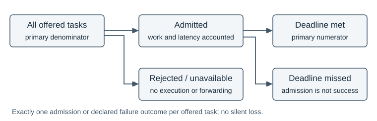
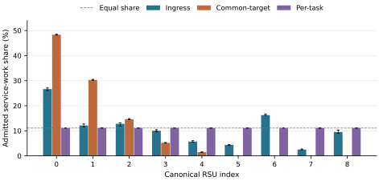

# TrafficTwin: Admission and Dispatch Semantics in Vehicular Edge Computing under a Frozen MAPPO Policy

S M Abdulla Al Mamun  
The University of Manchester  
Master's dissertation — evidence-gap revision for author review, 8 September 2026  
Supervisor: Dr Sandra Sampaio

This revision preserves the manuscript at `227c95e8e3e6b949eacb2b92c6e32c0ffdcd8133` and scientific evidence at `04f3b6a95c7bc06c80ed95b54762f12861bba183`. Newly constructed diagnostics and dated evidence-availability updates are identified separately. Submission details and assessment-specific AI-use instructions remain in the [author-review record](AUTHOR_INPUTS.md); no approval or declaration is implied.

## Abstract

Infrastructure admission and dispatch can change vehicular computing outcomes even when the vehicle policy is frozen. This dissertation studies those decisions in a trace-driven simulator, comparing strongest-link roadside execution, a common least-workload destination per task substep, and causal per-task placement with immediate work reservations. The contribution is an implementation study using established scheduling ideas.

A capacity comparison is statistically inconclusive under its historical scoring implementation. Source inspection identifies a mismatch between admission and latency-scoring masks; its numerical impact remains unquantified because the author reports deletion of the original task records. Surviving summaries and validation receipts retain their evidential role without being presented as fresh task-level validation.

Gate-enabled comparisons show an implementation-dependent reversal. Across four incident fleet draws, common-target placement falls 2.122 percentage points below ingress, while an adaptive per-task extension exceeds it by 0.527 points. A separate four-draw morning replication excludes its inspected pilot and yields −3.232 and +3.899 points, with simultaneous intervals supporting both directions. The practical per-task gains are approximately 53 and 390 additional deadline successes per 10,000 offered tasks.

A retrospective audit finds no admission/success discrepancy across 19 authenticated September runs. Matched morning records locate gains in previously rejected tasks and admitted misses, alongside smaller losses. A 440-case independent scheduling reference demonstrates that three mask replacements need not stabilise and that target reselection can improve or worsen synthetic attainment. These diagnostics sharpen, but do not complete, the historical mechanism explanation.

The findings support precise implementation and outcome accounting rather than universal scheduler superiority. Global service-work knowledge, aggregate timing, limited replication and unavailable historical raw records restrict interpretation. A relocatable verification package exposes what can be checked and what remains unresolved.

## 1. Introduction

### 1.1 Problem and motivation

A vehicle with a computational task can process it locally, send it to another vehicle, or enter roadside infrastructure. Each option combines communication and computation differently. A strong radio connection may reach a busy server; an idle server may require an additional transfer; accepting a task may consume resources without completing it before its deadline. Mobile edge computing consequently couples radio and computational resource management, as organised in Mao et al.'s survey [[1]](#ref-1). For an evaluation, the practical question is which part of that coupled system caused an observed improvement.

TrafficTwin addresses this question through a trace-driven vehicular edge computing (VEC) evaluator and an evidence-oriented software artifact. The evaluator reuses an existing trained MAPPO vehicle policy. Its three actions are Local, vehicle-to-infrastructure (V2I) and vehicle-to-vehicle (V2V). The actor does not select an exact RSU. The environment identifies a radio ingress, and infrastructure logic determines where an admitted V2I task executes. Holding the actor fixed makes this downstream layer experimentally accessible without introducing a new learning algorithm or retraining confound [[S4]](#source-s4).

The initial question concerned queue capacity: a larger waiting room can retain more work without producing more on-time completions. Comparisons therefore require every offered task to be accounted for, with admission distinguished from deadline success. These requirements motivated E0 validation and offered-task deadline attainment as the primary outcome [[S0]](#source-s0).

A second problem emerged when two least-busy implementations produced opposite rankings against ingress execution. One chose a shared destination for a group; the other reconsidered after each admitted reservation. Both used workload information and the same gate predicate, yet generated different queues. Their operational semantics therefore became central to the research question.

### 1.2 Related work and the position of this study

The closest intellectual comparison is task dispatch to parallel servers, particularly the information used to estimate waiting time and the point at which an assignment changes that information. RL supplies the upstream policy, but it does not define the downstream scheduling problem. The following synthesis positions the completed experiments retrospectively: these papers were newly inspected during manuscript revision and are not presented as having guided the historical experiments.

**Queue count and remaining work.** Shortest-queue dispatch compares numbers of jobs; shortest-workload dispatch compares their outstanding service requirements. With heterogeneous task sizes, these orderings can disagree. Harchol-Balter, Crovella and Murta explicitly study dynamic least-work-remaining assignment when service demand is known, alongside random, round-robin and size-based assignment. Their model assumes immediate per-arrival assignment, identical hosts, non-preemptive first-come-first-served service and Poisson arrivals. Their analysis shows that preferred assignment policies depend on task-size variability [[2]](#ref-2). Consequently, neither choosing the least workload nor achieving balanced allocation establishes universal optimality. TrafficTwin's inherited `jsq` name is misleading if read literally: the implemented selector compares service milliseconds, while a separate task count enforces finite admission capacity.

**Batch decisions and reservations.** Batching does not inherently imply sending a batch to one server. Sparrow pools probes across a parallel job and spreads its tasks over selected workers; late binding queues reservations and assigns tasks when workers become ready. Its discussion identifies both queue-count prediction errors and races between schedulers using apparently idle workers [[9]](#ref-9). This distinguishes two issues that a generic “batch versus per-task” description would conflate: sharing information across candidates can help, whereas committing many assignments against one unchanged destination can concentrate work. TrafficTwin evaluates the latter implementation. Its immediate service-work reservation is also different from Sparrow's worker-triggered task binding: TrafficTwin assumes the necessary information and acknowledgement are already available.

Ying, Srikant and Kang make the reservation distinction especially explicit: batch-filling samples queue counts, assigns tasks one by one and updates the chosen queue after each assignment. Their analysis assumes identical servers, exponential service, Poisson batch arrivals and random ties [[13]](#ref-13). This is close prior art for sequential within-batch updates. Although the evaluator comments mention their batch-filling work, its common-target reconciliation does not implement that destination rule. TrafficTwin's causal change is therefore an adaptation of established dispatch semantics, evaluated with workload information and deadline admission, rather than a novel batching principle.

**Local information and common destinations.** Vargaftik, Keslassy and Orda's Local Shortest Queue (LSQ) policies maintain possibly outdated queue-count estimates at multiple dispatchers. Their slotted model can send all jobs arriving at one dispatcher in a slot to one locally shortest queue, with random tie-breaking. Algorithms update local estimates by the jobs sent and refresh selected entries through communication. Their stability result requires stated arrival/service assumptions and bounded expected estimation error [[10]](#ref-10). This is particularly useful counterevidence to an overbroad novelty claim: common destinations and local updates both predate TrafficTwin. What differs here is service-work information, deterministic index ties, a backlog gate, five ordered task slots and one-second aggregate draining. Neither the LSQ stability theorem nor its distributed communication results transfer directly to these finite-horizon deadline outcomes.

**Admission and useful completion.** Niño-Mora jointly studies admission and routing to heterogeneous multiserver queues, charging separately for rejection and admitted deadline misses. The model uses Poisson arrivals, exponential service, soft deadlines and state-dependent index policies; admitted late jobs remain until completion [[11]](#ref-11). This establishes admission as an optimisation decision with consequences beyond the admitted population. TrafficTwin instead preserves a simple inherited backlog filter to make the placement contrast interpretable. The gate does not estimate the complete response time or promise success. Counting successes over all offered tasks makes a reject-all policy score zero and prevents selective admission from concealing failures. That denominator is a deliberate measurement choice, not a newly invented admission algorithm.

Table 1 locates the comparison along operational dimensions. The papers identify relevant mechanisms and alternatives; they are not external benchmark arms. Their arrival processes, objectives and resource models differ too much for published performance percentages to be compared as controlled results.

*Table 1. Closest-work comparison. “Work” means remaining service demand; “count” means queued jobs. TrafficTwin rows describe the frozen implementation, not a scheduling-family definition.*

| Work / decision layer and arrivals | Information and update semantics | Admission / objective | Relationship to TrafficTwin |
|---|---|---|---|
| Harchol-Balter et al. [2]: dispatch each arrival | Known service work; central per-arrival choice | Mean waiting time; size-normalised waiting | Closest least-workload comparator; no vehicular gate |
| Sparrow [9]: parallel-job task placement | Sampled workers; queued reservations; worker replies bind tasks | Job response time; placement constraints | Batch spreading differs from one common destination; communication is explicit |
| Ying et al. [13]: tasks within an arriving batch | Sampled counts; update after each assignment; random ties | Delay and sampling cost | Closest within-batch update rule; no deadline gate |
| LSQ [10]: dispatcher batch per time slot | Local queue counts; own-assignment increments and sampled/pushed updates | Stability under specified assumptions | Common routing is established; random ties and distributed estimates differ |
| Niño-Mora [11]: joint admission/routing per arrival | Queue counts and model-based indices | Rejection and deadline-miss costs | Supports joint evaluation, not the inherited backlog predicate |
| TrafficTwin common-target: one choice per substep | Global service work; vectorised candidate offsets and three reconciliations | Backlog gate plus finite task limit | Frozen vehicle policy; instantaneous logical forwarding |
| TrafficTwin per-task: ordered candidate scan | Global service work; actual admitted work reserved immediately | Same predicate and limit, causal admission | Tested implementation change; global information is assumed |

**Attribution and simulation validity.** Sargent distinguishes verification of a computer model from operational validation for its intended application [[12]](#ref-12). TrafficTwin's conservation and replay checks primarily establish the former; observed physical RSU service and network measurements would be needed for stronger deployment claims. SUMO supplies a microscopic simulation framework [[8]](#ref-8), but importing its trajectories does not independently validate a coupled radio/computing model. This distinction explains why a source-correct result can be scientifically useful while remaining conditional on simulation semantics.

PPO and MAPPO remain relevant as provenance of the reused actor [[3]](#ref-3), [[4]](#ref-4). They do not show that this checkpoint is optimal, that it learns an execution destination, or that freezing weights guarantees identical actions under changed observations. The actual input/action agreement checks therefore matter. Henderson et al. and Agarwal et al. motivate reporting variation and finite-run uncertainty [[5]](#ref-5), [[6]](#ref-6); Gorsane et al. emphasise exposing implementation choices and the source of improvement in cooperative MARL evaluation [[7]](#ref-7). Here the independent unit is a fleet draw, not a training run or individual task. Those papers support careful reporting, rather than authorising a particular small-sample distributional assumption.

The resulting contribution is an implementation study at a defined control boundary. Gate-held comparisons exposed an inherited common-target implementation that balanced work yet underperformed ingress. Causal placement reversed that ranking. This connects established dispatch ideas to a concrete attribution problem: scheduler names and allocation balance do not determine deadline performance. It neither defines a new scheduler family nor establishes that common destinations are inherently inferior.

### 1.3 Aim, research questions and contribution

The aim is to determine whether deterministic infrastructure-side RSU load management improves offered-task deadline attainment under a frozen vehicle policy, and to establish which claims the available evidence can support. The questions developed with the programme; the morning replication questions and analysis were declared before its new outcomes, while the mechanism audit was explicitly post-hoc.

**RQ1 — Measurement and capacity.** What do the recorded accounting checks establish, and does increasing the RSU waiting-room limit at fixed compute service improve the archived score? Interpretation as admission-consistent deadline attainment additionally depends on the unresolved legacy scoring-mask exception (§3.1). Sampling and measurement uncertainty are separate questions.

**RQ2 — Admission and dispatch semantics.** Under matched inputs and the inherited workload-based admission rule, how do ingress execution, common-target least-busy placement and sequential per-task least-busy placement compare in the incident scenario? The distinction concerns the implemented decision process, including its reconciliation semantics.

**RQ3 — Replication and mechanism.** Does the incident ordering recur across newly declared fleet draws in the morning scenario, and what recorded or reconstructable behaviour explains the common-target scheduler's repeatedly selected RSU identities? The replication and the subsequent explanatory audit have different evidential roles.

**RQ4 — Bounded sensitivities.** Within one incident fleet draw, how do aged placement-workload reports and a fixed forwarding overhead affect the comparison? These studies test specific model assumptions descriptively, without establishing population-level robustness or a physical backhaul design.

The contributions are a source-audited evaluation foundation; an admission/placement comparison with an adaptive incident extension and separate morning replication; and a conditional mechanism explanation. Retrospective raw-record checks and a small independent scheduling reference further test that explanation. TrafficTwin links these claims to executable semantics and preserved evidence, while identifying unavailable records and unresolved personal attribution [[S11]](#source-s11), [[S13]](#source-s13).

### 1.4 Scope and report structure

One actor, a provisional fleet model and two Manchester traces bound the study. There is no retraining, learned neighbour selection, infrastructure deployment or packet-level forwarding model. Section 2 specifies the model and design; Section 3 evaluates findings and achievement; Section 4 answers the questions. Appendices identify project evidence and audit coverage.

## 2. Methodology

### 2.1 Research design and evidence hierarchy

Controlled simulator comparisons isolate infrastructure changes under matched traffic, fleet and task inputs. The vehicle policy is frozen, and recorded action agreement is checked. This identifies implementation effects conditional on the evaluator; it does not estimate the performance of a retrained policy or physically validate the coupled model.

The sequence is adaptive: earlier observations informed later questions. E2c excludes its discovery seed, while the morning replication excludes its inspected pilot. Frozen source and accepted records determine experimental meaning; correspondence clarifies intention. The new raw audit and kernel tests are retrospective investigations, not part of the original protocols [[S0]](#source-s0)–[[S8]](#source-s8), [[S13]](#source-s13).

### 2.2 Architecture and information boundaries

Figure 1 separates actor mode choice, environmental radio targeting and infrastructure execution/admission. V2I ingress is the strongest simulated radio link. Ingress execution retains that RSU; load-balancing arms may assign elsewhere. A target remains a proposal until admission [[S4]](#source-s4).


*Figure 1. Experimental responsibility boundaries. Only admitted V2I work enters the selected execution queue; logical forwarding applies when ingress and execution differ. Resource scaling is outside the completed comparison.*

The checkpoint uses a 17-dimensional observation comprising task descriptors, vehicle load and queue summaries, state of charge, link-quality summaries, nearby compute availability, a task-presence flag, vehicle compute tier, an electric-vehicle flag and the observed V2V target's compute tier. It does not receive the current RSU workload vector. MAPPO consequently cannot directly implement the infrastructure's least-workload rule through its action space. The actor observes a separately sampled task descriptor and selects one mode per active vehicle per second. That mode is reused for independently sampled operational tasks whose descriptors replace the observation task during processing. This inherited convention limits claims about task-conditioned policy quality; matched infrastructure comparisons retain the same convention.

V2V target selection is environmental: exclude the source and peers whose queues are full, then select the remaining strongest instantaneous simulated link. Distance contributes to link quality, but fading also contributes; this is not simply nearest-neighbour selection. Peer workload and capability affect latency after selection, while capability is not itself the target-ranking criterion. Observation and operational link calculations use separate fading samples. The correspondence confirms this and the per-vehicle-second decision convention as intended inherited behaviour, not an accidental change introduced by the placement study [[S4]](#source-s4).

### 2.3 Scenarios, actor and controlled inputs

Table 2 identifies the two scenarios. Traffic positions are imported from saved traces; the evaluator does not rerun SUMO during each scheduling comparison. The morning input audit reconstructs the canonical trace arrays from their source records and checks entry markers and slot assignment. This matters because padded array slots are not necessarily permanent vehicle identities. On morning vehicle entry, the recorded convention resets vehicle queues for the new visit; state of charge is not reset by that queue operation. The incident trace retains its earlier convention without the same entry channel [[S7]](#source-s7).

*Table 2. Scenario identity and fixed placement controls. Differences between scenarios are retained and documented, not treated as a single-factor intervention.*

| Setting | Incident scenario | Morning scenario |
|---|---|---|
| Date and local window | 15 March 2024, 20:00–21:00 | 15 October 2024, 08:00–11:00 |
| One-second steps | 3,600 | 10,800 |
| Padded vehicle slots | 2,488 | 215 |
| RSUs | 10 | 9 |
| SUMO seed | 43 | 42 |
| Vehicle queue convention | Conserved, legacy trace convention | Conserved, canonical per-visit reset |
| Placement-study RSU limit | 6,220 tasks per RSU | 6,220 tasks per RSU |
| Service / forwarding / scaling | 1× / 0 ms / off | 1× / 0 ms / off |

The same one-hot-17 MAPPO checkpoint, identified by its archived hash, is retained throughout. Its inherited training provenance is Model C with synthetic mobility, 128 environments, learning rate 0.003 and training seed 100. Those facts identify the input artifact; they are not a training reproduction performed here. The provisional UK2030 fleet preset samples RPi-, Jetson- and GPU-vehicle tiers with probabilities (0.40, 0.35, 0.25), and electric-vehicle status with probability 0.22. These are modelling assumptions, not measured Manchester fleet shares. Fleet seeds vary between replicates, while evaluator seed 0 remains fixed. Thus the estimand concerns fleet variability conditional on the actor and scenario, not uncertainty over training or traffic generation.

Each active vehicle offers min(Poisson(1.5), 5) tasks per second; inactive slots offer none. Operational task types are independently sampled with probabilities (0.20, 0.30, 0.50). Types 1–3 have deadlines (100, 500, 100) ms, mean input sizes (1, 0.0012, 0.001) MB and workloads (1,254, 2,100, 15) million cycles. Input sizes multiply their type mean by an independent uniform 0.8–1.2 factor. The five-slot cap changes offered work as well as scheduling opportunities [[S4]](#source-s4).

For homogeneous RSUs, service milliseconds are s = ξ × C_t / [2.2 × 1.5 × min(12, p_t) × 0.9 × min(5, g_t)], where C_t is million cycles, p_t = (4, 4, 2), g_t = (40, 5, 1), and ξ is uniform on 0.9–1.1. The denominator uses 2.2 GHz, 1.5 instructions per cycle, effective cores, utilisation and capped GPU acceleration. Million-cycle/GHz conversion yields milliseconds. Before noise, services are approximately (21.111, 35.354, 2.525) ms. All placement arms use service multiplier 1.

Absolute capacity avoids a confound: the incident ratio 2.5 × 2,488 gives 6,220 tasks per RSU; applying 2.5 to the morning width would give only 538. The morning protocol fixes 6,220 explicitly. Density, duration, layout and vehicle-entry conventions still differ.

### 2.4 Time, queues, admission and outcomes

A batch advances simulated time by one second. Five internal task substeps order admissions; they are not five 200 ms clock advances. Work accumulates across them before one service drain. Let W[r] denote remaining service milliseconds at RSU r, Q[r] its aggregate task count and C the task limit. These variables serve different purposes: identical counts can represent different work, and increasing C does not accelerate service [[S4]](#source-s4).

For each offered task i, let a[i] indicate admission, y[i] indicate the recorded deadline success, and z[i,c] indicate terminal failure category c. The intended accounting contract requires one admission or failure and no success for rejected work. The per-run primary outcome and validation requirements are:

**(1)** A = N_met / N_offered = Σ y[i] / N_offered; reported percentage = 100A.

**(2)** a[i] + Σ z[i,c] = 1; y[i] ≤ a[i]; N_offered = N_admitted + N_failed.

Here N_failed includes both rejection and unavailability. Categories distinguish local queue rejection, V2V queue rejection or unavailability, and V2I unavailability, backlog-gate rejection or capacity rejection. Gate failure takes precedence over capacity failure when both apply. Selected targets are proposals; rejected tasks neither execute nor reserve work (Figure 2). Admitted attainment uses N_admitted instead, so must not replace Equation (1). Offered, admitted and successful-task latency means similarly have different populations.



*Figure 2. Offered tasks remain in the primary denominator. Admission, execution assignment and deadline outcome are separate fields; selecting an RSU does not establish that work executed there.*

The inherited gate tests existing effective workload, including the candidate offset O[i], against deadline D[i]:

**(3)** W[r] + O[i] < D[i], together with an available task-count place.

The inequality is strict. It excludes the candidate's service, radio transfer and forwarding cost, and therefore is a backlog filter rather than an end-to-end feasibility guarantee. Candidate ordering and offsets differ between algorithms (§2.5). Admission uses positive ingress link quality as its coarse radio condition; the latency model additionally requires quality at least 0.15 for a usable transmission. Consequently, admission can still lead to a transmission-related deadline miss.

For viable V2I execution, the modelled response latency is:

**(4)** L_raw[i] = T(input[i], q, c) + W[r] + O[i] + s[i,r] + T(0.001, q, c) + f · 1(r ≠ ingress[i]).

T(b,q,c) is 0.1 + 1,000 × 8b/c milliseconds for q ≥ 0.15 and capacity c > 0.000000001 Mbps, with b in MB; otherwise it uses a 10⁹ ms failure value (up to the 0.1 ms propagation addition). The 0.001 MB return term reuses the ingress quality and capacity. It is not a separately simulated downlink or inter-RSU route. The fixed forwarding charge f is added once. Local latency is vehicle backlog plus local service; V2V adds input/return transfers on the selected peer link, peer backlog, preceding local/V2V reservations and peer service. Service s derives from task cycles, device frequency, parallelism, utilisation and acceleration, with a sampled 0.9–1.1 multiplier. The placement code reserves the same sampled work used for latency: exact service knowledge is a declared information assumption.

The gate-enabled paths pass final admission into latency scoring. Historical `off` instead passes earlier coarse eligibility while enqueueing uses refined admission: an in-substep capacity rejection need not receive penalty latency. Its historical numerical impact remains unquantified (§3.1). The final mapping is L[i] = 10D[i] when L_raw[i] ≥ 10⁸ ms, and L[i] = L_raw[i] otherwise. Finite late latencies are not generally clipped; success uses L[i] ≤ D[i], inclusively. Finite rejection latency alone is not a false deadline success.

For each queue over an interval, work accounting requires:

**(5)** W_initial + Σ admitted service = Σ served service + W_final.

After the fifth substep, S[r] = min(W_post[r], 1,000) is served and W_next[r] = W_post[r] − S[r]. If this empties the queue, its task count becomes zero. Otherwise the evaluator subtracts floor(Q_post[r] × S[r]/W_post[r]), retaining at least one task while positive work remains. This aggregate carry approximation has no individual departure-event model. Equation (5) checks the declared dynamics, not their physical calibration.

### 2.5 Placement algorithms and their implementation

Table 3 separates execution destination from the gate switch. The identifier `jsq` actually selects least service workload, not shortest task count. `dla` combines this common-target selector with Equation (3); these inherited names do not define canonical scheduling algorithms [[S2]](#source-s2), [[S4]](#source-s4).

*Table 3. Infrastructure conditions. All retain strongest-link radio ingress. “Live” eligibility is refreshed at each substep; the historical off mode retains step-entry coarse eligibility.*

| Mode | Execution destination | Backlog gate | Coarse eligibility |
|---|---|---|---|
| `off` | Ingress | Off | Step entry |
| `jsq` | Common least-workload target | Off | Live |
| `ingress_dla` | Ingress | On | Live |
| `dla` | Common least-workload target | On | Live |
| `per_task_dla` | Causal least-workload target | On | Live |

Both placement algorithms below operate once per task substep, using its entry state W, Q. Index i follows ascending padded-vehicle order, not arrival-time or deadline priority. Each candidate has actual service s[i,r], deadline D[i] and a fixed actor action and radio ingress. Every argmin considers all RSUs and breaks ties by lowest index; a full selected RSU is rejected rather than excluded and retried elsewhere.

For common-target reconciliation, let E[i] mean active V2I attempt, positive ingress quality and Q[r[i]] < C at substep entry. For an admission mask M, define O[i,M] as the sum of s[j,r[i]] over earlier j < i with the same target and M[j] true; H[i,M] is their count. Offsets are exclusive: a candidate's own service is omitted. Algorithm 1 follows the frozen implementation's three simultaneous replacements, without claiming convergence.

```text
Algorithm 1: common-target placement with gate (one substep)
r[i] = lowest-index argmin(W), shared by all candidates
M = E
repeat exactly three times:
    compute O[i,M] and H[i,M] from the previous whole mask
    M_new[i] = E[i] and (W[r[i]] + O[i,M] < D[i])
                       and (H[i,M] < C - Q[r[i]])
    M = M_new simultaneously
recompute final offsets O[i,M] for latency
label E-candidates failing the final workload test as gate failures
label remaining E-candidates excluded by M as capacity failures
commit each M-admitted task and its full service once
unavailable or rejected tasks reserve nothing
```

Target selection never changes during reconciliation. The final admission mask and the offsets recomputed from it determine the recorded processing; three passes are an implementation constant, not a proof of a fixed point. Ingress with the gate uses the same offset/reconciliation machinery with individual ingress targets instead of the common argmin. Gate-off modes omit the workload test.

```text
Algorithm 2: causal per-task placement with gate (one substep)
repeat exactly three complete passes:
    working_W = W; working_Q = Q       # restart, not cumulative
    for i in ascending padded-vehicle order:
        r[i] = lowest-index argmin(working_W)
        O[i] = working_W[r[i]] - W[r[i]]
        require active V2I, positive quality and Q[r[i]] < C
        test working_W[r[i]] < D[i], then working_Q[r[i]] < C
        if admitted:
            working_W[r[i]] += s[i,r[i]]
            working_Q[r[i]] += 1
        otherwise label failure; reserve nothing
retain the last pass; commit its admitted work once
```

The causal gate and capacity see earlier admissions immediately. Repeated passes begin from identical initial state and reproduce the same decisions; they do not triple reservations. Physical queue arrays receive the final result once, before the next substep. Both algorithms drain service only after all five substeps. Thus the comparison changes selection frequency, reservation visibility and reconciliation semantics; it is not an isolated change to argmin frequency.

For an illustrative scheduling calculation, assume three empty identical RSUs, four viable 40 ms tasks with 100 ms deadlines, nonbinding capacity and negligible communication. Common-target chooses RSU 0; its masks settle at three admissions and one gate rejection. The admitted offsets are 0, 40 and 80 ms, leaving 120, 0, 0 ms: the third admitted task misses its deadline despite passing the backlog gate. Per-task selects 0, 1, 2, 0, leaves 80, 40, 40 ms and all four meet deadlines under these assumptions. Figure 3 depicts the proposals. This constructed example explains mechanics; it is neither a recorded task group nor an estimate of recoverable historical failures.


*Figure 3. Four illustrative proposals. The common destination remains fixed through reconciliation; causal placement updates after admissions. The accompanying worked example states admissions and deadline outcomes under deliberately simplified assumptions.*

### 2.6 Experimental progression and inference

E0 validates recorded accounting before performance analysis. E1 compares three queue limits at fixed service across five matched fleet draws. E2 and E2b are exploratory single-draw studies separating placement and admission. E2c evaluates common-target against ingress on four new incident draws, seeds 1–4. E2d is an adaptive extension after inspecting E2c: it adds per-task placement on those previously examined draws and reuses the exact controls. They are not new independent observations [[S0]](#source-s0)–[[S3]](#source-s3).

The morning pilot uses seed 1 for ingress and per-task placement. After inspecting it, the replication declares seeds 0, 2, 3 and 4 and all three arms, yielding twelve new full runs. The primary contrasts are per-task minus ingress, common-target minus ingress, and per-task minus common-target. The pilot is excluded; a supplementary two-arm five-draw summary is descriptive. The local protocol and manifest preceded the new outcomes, but there was no external preregistration [[S7]](#source-s7), [[S8]](#source-s8).

For each contrast, a fleet draw supplies one paired difference in percentage points. Draws receive equal weight. The mean difference has a Student-t interval, mean ± t × sample standard deviation / square root of n. Incident E2c/E2d retain their reported individual 95% intervals. The morning protocol additionally uses Bonferroni simultaneous intervals for three contrasts, with critical value t at probability 1 − 0.05/(2 × 3), three degrees of freedom. Its reversal criterion requires the simultaneous common-target-minus-ingress interval below zero and the per-task-minus-ingress interval above zero. Four draws cannot strongly diagnose distributional assumptions; these small-sample intervals remain conditional parametric summaries, not task-level significance tests.

### 2.7 Sensitivities, mechanism audit and validation

The state-information pilot uses incident seed 1 and report ages 0, 100, 500 and 1,000 ms, alongside ingress. Admission remains live. For previous post-admission workload B and positive age d, the report is max(B − (1,000 − d), 0), with current-batch reservations added immediately. This assumes continuous service between batches without redistributing arrivals. Startup uses live state and recorded age zero [[S5]](#source-s5).

Four ten-step forwarding probes qualify fixed-latency transformations of saved full records: charges leave admission, queues and actions unchanged. No full positive-cost simulation or network model is implied; penalty-equal ambiguity remains unresolved [[S6]](#source-s6).

The completed post-hoc five-RSU audit checks recorded targets/endpoints and reconstructs intermediate work. Neither it nor the proposed tie-break prefixes are executed here [[S9]](#source-s9), [[S10]](#source-s10).

Original protocols checked identities, accounting, conservation and prefix agreement; twelve morning 300-step probes preceded full runs. Their invalidity-based stop rules and separate compatibility/treatment checks remain in the archived receipts.

The 8 September audit authenticated all 87 September arrays, then processed 19 full runs individually: twelve morning primary, two excluded pilot and five incident sensitivity cells. Active masks define offers; the enqueue field defines V2I admission independently of success. Non-V2I admission excludes local/V2V rejection predicates. Checks compare flags, categories, latency/deadlines, assignments and summary counts. Execution fields identify admission, not observed departures. Missing historical arrays are not replaced [[S13]](#source-s13).

Task joins require identical manifest/fleet and trace-row/substep/slot coordinates, with matching active/type, arrival, action and ingress fields. Unsaved sizes correspond through the arm-independent random-key schedule. All same-seed pairs within each study are retained. Gains minus losses must equal the archived success difference over the common offered denominator; this is descriptive, not decision-level causal attribution.

A predeclared scalar reference tests A, common-target/three simultaneous replacements; B, causal admission retaining A's complete target sequence; and C, causal least-workload reselection. Eight hand cases and a 432-case grid cover queue states, equal/unequal/zero work, deadlines, capacity, rejected/inactive candidates, ties, R>K and R<K. Inputs are shared; diagnostic success assumes zero transfer latency. All A masks and a diagnostic fourth replacement are retained. The unchanged production function is extracted and called with explicit service arrays; the independent scalar reference does not copy it. This checks admission semantics, not physical service generation.

## 3. Evaluation and Reflection

### 3.1 Accounting validity and the capacity question

E0 addressed a concrete mismatch between task scoring and queue admission. In the legacy clamp path, the evaluator scored eligible V2I tasks and multiplied their combined service work by the fraction fitting the task-count ceiling. Surplus tasks were not individually identified in earlier scoring. The 5 August repair introduced per-task admission/rejection and full enqueueing of admitted work. Source history credits Randy's implementation and Abdulla's motivating accounting analysis; E0 qualified recorded accounting in that configuration [[S0]](#source-s0), [[S12]](#source-s12).

An illustrative reconstruction shows why the distinction matters. Suppose one queue place remains and two otherwise viable candidates each require 40 ms. Legacy fractional enqueue adds (1/2) × 80 = 40 ms, yet both candidates can remain in the previously scored population. The queue represents only half their combined demand. Corrected reject-mode admission accepts one candidate in the declared order, rejects the other, enqueues the accepted 40 ms in full and gives the rejected task a failure outcome. These are explanatory numbers, not a historical measured task pair. With unequal service times, fractional enqueue can additionally differ from the work of the particular task actually admitted.

The relevant invariant is that offered tasks partition into admitted and declared failed attempts, and rejected tasks do not execute. E0's validator cross-checks active records, terminal categories and summary counts. Its archived regression fixture changes offered count from two to three without adding a record and requires failure; another changes offered vehicle work from 10 to 11 ms against an 8 + 2 ms partition. However, summary work partition alone is weak evidence of dynamics because rejected work is calculated as offered minus admitted. Later independent reconstruction checks enqueue, drain and endpoints directly.

The E0 smoke/full receipts report passing checks, including deadline-flag/outcome agreement. Source versions identify the exception precisely: E0/E1 use `0f01f4d`, E2 uses `e11f444`, and E2b reuses E2's off cell while adding ingress at `0e5ed2f`. E0 and E2 off each record 834,120 capacity rejections; this establishes exposure, not a false-success count. On 8 September the author reported deletion of the original E0/E1/E2 raw outputs, with no known backup. Fresh task-level checks and admission-consistent rescoring are therefore not assessable from available records. Surviving receipts cannot quantify non-penalty rejection latency or replace independent reinspection [[S13]](#source-s13).

E1 varied waiting-room capacity across five matched draws. The archived score difference for 99,520 versus 1,866 tasks per RSU was −0.01094 percentage points, with a 95% interval [−0.02465, +0.00276]. Recalculation from surviving run summaries reproduces this interval; it is not fresh task-level validation. The archived E1 score contrast is statistically inconclusive under the historical implementation. Its interpretation as admission-consistent deadline attainment remains qualified by the unquantified scoring-mask exception. The interval describes sampling uncertainty conditional on that implementation, not the additional measurement uncertainty. Neither equivalence nor statistically supported degradation follows [[S1]](#source-s1).

The saved secondary summaries report more admissions and lower rejection at larger limits, while mean admitted latency rises from approximately 3.77 to 12.19 and 132.49 seconds. These changing admitted populations cannot substitute for the offered-task contrast; their latency interpretation also retains the mask qualification. Larger waiting rooms can retain work without increasing useful service.

Changing the off scoring mask could also change V2I transmission energy, state of charge and later actor observations. Even an admission-consistent adjustment of saved flags would describe fixed history, not a corrected rerun. Separately, the September gate-enabled audit found zero non-admitted successes, zero non-penalty rejection latencies and complete admission/category/summary agreement across its 19 authenticated runs. Their admission-consistent scores equal the archived scores. This finite result supports those later outcomes, without resolving the missing historical records or proving universal correctness.

### 3.2 From admission decomposition to the incident reversal

E2's exploratory seed-0 comparison showed offered attainment of approximately 68.362% for strongest-link execution without the deadline gate, 67.568% for inherited least-busy placement without the gate, and 69.494% for inherited least-busy placement with the gate. The last comparison changed both placement and admission relative to the strongest-link reference. Its improvement could not establish that load balancing itself helped [[S2]](#source-s2).

E2b added ingress execution with the same deadline gate, reaching approximately 71.577%. The strongest-link contrast was +3.215 points and the common-target contrast +1.926 points, giving an interaction of −1.290 points. However, `off` uses step-entry coarse saturation eligibility while `ingress_dla` refreshes eligibility per substep. Their contrast and interaction bundle the gate with this timing difference and retain the legacy scoring-mask exception (§2.4). The manifest records 138 unavailable V2I attempts among 13,076,234 offered tasks in off; that count does not bound downstream effects. E2b identifies a stronger comparator without assigning its entire gain solely to the gate. Subsequent gate-held placement comparisons use live eligibility and refined scoring masks in all arms. In the exploratory draw, common-target remained 2.083 points below ingress with the gate.

E2c tested the common-target comparison on four new incident fleet draws, excluding discovery seed 0. Its mean difference from ingress was −2.122 points, with an individual 95% interval of [−2.234, −2.011]. All four paired differences were negative. Inspection then established that the inherited scheduler chose one common target per task substep. E2d introduced the causal per-task implementation under the same actor, trace, gate predicate, queue ceiling, service and forwarding controls. Table 4 retains all four draw-level results [[S3]](#source-s3).

*Table 4. Incident offered-task deadline attainment, expressed as percentages. E2d reused the exact E2c ingress and common-target controls; these are four paired draws, not separate sets of independent controls.*

| Fleet seed | Ingress | Common-target | Per-task | Per-task − ingress, pp |
|---|---:|---:|---:|---:|
| 1 | 72.003 | 69.794 | 72.467 | +0.464 |
| 2 | 70.369 | 68.317 | 70.956 | +0.587 |
| 3 | 70.298 | 68.153 | 70.805 | +0.507 |
| 4 | 70.887 | 68.805 | 71.438 | +0.551 |

Per-task exceeds ingress by 0.527 points, individual 95% interval [+0.442, +0.612], and common-target by 2.649 points, interval [+2.621, +2.678]. RQ2 therefore yields opposite rankings for the two implementations. These intervals summarise an adaptive extension on examined draws; the morning protocol supplies prospective replication.

Ingress determines the practical scale: against 70.889% mean attainment, +0.527 points means about 53 extra successes per 10,000 offered, or a 0.744% relative increase. The larger +2.649-point common-target contrast diagnoses that implementation; it is not the gain over the stronger reference. These are descriptive conversions of the same mean, and neither arm establishes optimal dispatch.

### 3.3 Morning replication with the inspected pilot excluded

The inspected morning pilot offered 1,744,116 tasks and produced 91.075% ingress versus 94.028% per-task attainment: +2.953 points or 51,503 successes. It motivated replication but remains exploratory [[S7]](#source-s7).

The morning protocol declared four new seeds and all three arms before outcomes. Each draw reproduces common-target < ingress < per-task. Mean attainment is 85.655%, 88.887% and 92.785%, respectively; its lower ingress/per-task means than the pilot underline the need for replication [[S8]](#source-s8).

*Table 5. Morning primary replication. Seed 1 is absent because it was the inspected pilot; each row is a matched fleet draw on the same morning trace.*

| Fleet seed | Ingress, % | Common-target, % | Per-task, % | Per-task − ingress, pp |
|---|---:|---:|---:|---:|
| 0 | 88.817 | 85.660 | 92.705 | +3.888 |
| 2 | 87.536 | 83.537 | 92.060 | +4.524 |
| 3 | 89.082 | 85.862 | 92.978 | +3.896 |
| 4 | 90.113 | 87.559 | 93.399 | +3.286 |

Table 6's simultaneous per-task-minus-ingress interval is positive and common-target-minus-ingress interval negative, satisfying the prespecified reversal criterion. Figure 4 displays these primary results.

*Table 6. Morning paired contrasts in percentage points. Individual intervals are two-sided 95% Student-t intervals; simultaneous intervals use the prespecified three-contrast Bonferroni adjustment. The replication unit is the fleet draw, n = 4.*

| Contrast | Mean | Individual 95% interval | Simultaneous 95% interval |
|---|---:|---|---|
| Per-task − ingress | +3.899 | [+3.094, +4.703] | [+2.671, +5.126] |
| Common-target − ingress | −3.232 | [−4.176, −2.289] | [−4.672, −1.793] |
| Per-task − common-target | +7.131 | [+5.385, +8.877] | [+4.466, +9.795] |


*Figure 4. Redrawn from archived morning primary data. Left: within-draw attainment. Right: draw differences, mean diamonds and three-contrast Bonferroni intervals. The inspected pilot is excluded; uncertainty concerns four newly declared fleet draws, conditional on the frozen actor and morning scenario [[S8]](#source-s8).*

The supplementary five-draw ingress/per-task mean, including the pilot, is +3.709 points descriptively; it does not enter Table 6. No common-target pilot result is available.

The morning gain is about 390 extra successes per 10,000 offered, a 4.386% relative increase over ingress. Its larger magnitude cannot be attributed solely to density: RSU layout/count, date, duration, padded fleet width and entry conventions also change. Separate analyses support recurrence in two Manchester scenarios, without estimating a pooled geographical effect.

New matched accounting clarifies where these successes occur. Across the four primary draws, ingress→per-task gains total 284,821 and losses 12,842, giving 271,979 net additional successes. Of the gains, 211,734 were ingress gate rejections and 73,087 admitted misses; losses comprise 1,044 newly rejected tasks and 11,798 admitted misses. The common offered denominator is 1,744,116 per draw; these totals do not create extra replications. All 23 available within-study pairs, including pilots and adverse transitions, satisfy the gain-minus-loss identity. Changed later queues prevent assigning each transition to one scheduling decision [[S13]](#source-s13).

### 3.4 Post-hoc explanation of the five-RSU pattern

Workload diagnostics revealed a striking morning contrast. Common-target admitted work used only RSUs 0–4, while per-task placement used all nine. Mean common-target workload shares were approximately 48.34%, 30.33%, 14.63%, 5.21% and 1.48% across those five RSUs, with zero work at RSUs 5–8. Per-task shares were close to one ninth each. Figure 5 is descriptive evidence of allocation, not proof that workload equality alone caused the attainment difference [[S8]](#source-s8).



*Figure 5. Admitted service-work distribution, redrawn from archived CSVs. Bars are means; whiskers are observed minima/maxima over four fleet draws, not confidence intervals. Aggregate shares motivated a separate post-hoc audit; they do not by themselves establish intermediate scheduling decisions or counterfactual task outcomes.*

The audit examined 43,200 recorded seconds and 216,000 task substeps across the four common-target runs. Every recorded end-of-second RSU workload and task count was zero, covering 388,800 RSU/second entries per field. Of 179,427 substeps with an observable V2I target, every one selected RSU k at substep k, with zero exceptions. The remaining 36,573 substeps had no recorded V2I attempt; their internal selector output is not treated as an observed measurement. The full-run union was five RSUs, but all five were used in only 15,803 individual seconds [[S9]](#source-s9).

Intermediate substep workloads were not directly saved for common-target. They were reconstructed from recorded admissions and execution destinations using the previously qualified service-work reference and frozen replay. Every saved endpoint matched exactly, but all-zero endpoints have limited power to distinguish intermediate states. The stronger combined support is the qualified service reference, recorded admissions, frozen enqueue semantics and agreement with every observable target's lowest-index workload minimum. Maximum reconstructed pre-drain workloads ranged from approximately 534.281 to 538.730 ms, below the 1,000 ms service interval; maximum task counts were 22–25, far below 6,220.

A conditional deduction from Algorithm 1 explains the concentration. With K substeps and R RSUs, at most min(K, R) distinct destinations receive new assignments in one batch: each substep contributes at most one target, so their union has at most K members. This bound does not require empty queues or a particular tie rule, and concerns new assignments rather than all work already present.

The repeated low-index prefix requires additional assumptions. At an empty batch start, lowest-index ties select RSU 0. Positive admitted work makes that RSU busier than untouched empty nodes; without intervening draining, the next productive substep selects the next empty index. Induction gives a prefix when R ≥ K; a substep adding no work does not advance it. Complete end-of-batch clearing restores the initial tie. The recorded endpoints and reconstructed maxima satisfy those conditions here. Without clearing or deterministic ties, the per-batch bound could still hold while the full-run union covered all nine RSUs. This is analysis of the stated model, not a universal theorem against batching.

The arrays recorded 511,684 deadline-gate rejections and zero RSU-capacity rejections. In the reconstructed state, every gate rejection occurred with at least five other RSUs idle and possessing spare admission capacity. This shows that unused infrastructure coexisted with rejection and that enlarging the waiting room would not address the observed bottleneck. It does not mean all 511,684 tasks could have met their deadlines elsewhere. Redistribution changes later workload and admission decisions, and another RSU's spare task capacity is not proof of end-to-end feasibility.

The original audit did not save candidate masks and therefore explains destination identities rather than the whole performance gap. The new reference distinguishes two competing mechanisms. A and B differ in admission in one of 440 primary cases but never in diagnostic deadline success. B→C increases successes in 69 cases, decreases them in 16 and leaves 355 unchanged. Target reselection can therefore alter attainment independently of three-pass reconciliation; this finite, synthetic distribution is not a benchmark or a causal decomposition of the fleet results [[S13]](#source-s13).

No instability occurred in the 432-case grid. The hand counterexample uses synthetic deadlines outside the production task types; reachability under the production task model remains unestablished. It reduces to five viable 40 ms tasks on one empty RSU, capacity 10, deadlines (1,1,41,41,81) ms. A's masks are 11111→10000→10111→10100; final exclusive offsets are (0,40,40,80,80) ms. A fourth replacement gives 10101. The fifth task is labelled capacity-rejected although its final rank is 2 and eight places remain. B admits it, but its 120 ms completion still misses the 81 ms deadline. Thus three replacements need not converge, and an outcome label need not identify the binding constraint; this example does not demonstrate false deadline success. Ten deletion trials retained this case without changing A.

Production A/C returned fields agree with the independent reference over all 1,304 primary substeps and the reduced case. Independence is limited to admission arithmetic: the production comparison substitutes explicit service/deadline arrays and shares JAX execution, while the scalar reference does not. No complete observed historical substep inputs support a fleet replay of A/B/C. An adverse grid case also gives C four successes against B's six: less admitted work or broader allocation is insufficient to establish useful completion. The original tie-break prefixes remain unrun [[S10]](#source-s10).

### 3.5 Bounded state-information and forwarding sensitivities

The incident state-information pilot supplies an important example of a nominal treatment that does not always change the information used. Fresh per-task placement achieved 72.46695% attainment in seed 1, compared with ingress at 72.00328%. The 100 ms condition exactly matched fresh outcomes. The 500 ms condition reached 72.46856%, while 1,000 ms reached 72.45510%. Relative to fresh, those latter differences are approximately +0.00161 and −0.01185 percentage points. They are descriptive outcomes from one draw, without a confidence interval or equivalence conclusion [[S5]](#source-s5).

Across 35,990 non-startup RSU/batch observations, live batch-entry workload was zero and every 100 ms report equalled fresh: queues had already emptied. Reports at 500 ms differed in 79.58% of observations, and 1,000 ms reports differed in all. The 100 ms treatment was therefore inactive for workload information; equal outcomes do not establish harmless communication delay.

Live admission checks actual queues even when selection uses an old report, and immediately acknowledged reservations update the placement view. These protections are part of the treatment. Stale capacity, delayed acknowledgements or dispersed arrivals would define different systems; RQ4 is bounded by the implemented information model.

The forwarding sensitivity similarly has a precise scope. At 0, 1, 2.5, 5 and 10 ms fixed overhead, per-task attainment was approximately 72.46695%, 72.44783%, 72.41882%, 72.37240% and 72.28579%. At the largest tested cost it remained 0.28251 points above ingress, corresponding to 36,942 additional deadline successes in that draw. The cost introduced 23,689 extra misses relative to zero forwarding overhead [[S6]](#source-s6).

These are full-record transformed outcomes qualified by four direct short probes, not four newly executed full simulations. The method is valid within the checked frozen accounting path because forwarding charges are applied after admission and do not feed back into queues or actions. It cannot predict effects of network congestion or arrival postponement. A further 104 forwarded tasks had penalty-equal latency ambiguity but were already deadline misses and remained misses under every non-negative cost. Their exact latency values were left unresolved; no reconstructed mean-latency claim depends on filling them in. The positive advantage at 10 ms is evidence at that grid point, not an estimated break-even threshold beyond it.

### 3.6 Technical achievement and attribution

Engineering had to preserve experimental meaning while exposing decisions. Separate ingress, selected-target, admitted-execution and forwarding fields make rejected proposals distinguishable from work that enters a queue. Path instrumentation was checked against parent outputs. The per-task selector reuses execution's service-time subkey: resampling would change workload as well as placement [[S4]](#source-s4).

Table 7 distinguishes documented intellectual work, supplied code and project implementation. Randy's source explicitly credits Abdulla's accounting questions and clamp reconstruction. The August correspondence records Abdulla's analysis of control boundaries, interpretation of the inconclusive capacity result and explanation of the placement reversal. Those are substantive activities beyond coding; the record does not establish that they were unaided or independently checked. Personal/AI allocation remains for confirmation [[S12]](#source-s12).

*Table 7. Component ownership and evidence. Attribution certainty concerns what the records establish, not a declaration of independent authorship.*

| Component | Inherited starting point | Candidate contribution (project record) | Validation evidence | Attribution certainty |
|---|---|---|---|---|
| Actor, environment and radio targets | Randy's trained actor and VEC model; PPO/MAPPO/JAX reused | Analyse control boundary; hold actor and inputs fixed | Randy's confirmations; actor/input/action checks | Supplied origin clear; no training contribution claimed |
| Accounting corrections | Randy's reject-mode, co-batch, vehicle-queue and lifecycle repairs | Accounting questions and clamp reconstruction credited to Abdulla; project E0 qualification | Commits 4cb7c06/0f01f4d; E0 records and negative fixtures | Requirements credit explicit; repair code supplied, unaided analysis unverified |
| Experimental design and analysis | Existing evaluator and traces | Capacity, admission/placement decomposition, paired replication and bounded follow-ups | Frozen manifests, exclusions, tables and correspondence | Project-level work clear; personal/AI allocation requires confirmation |
| Per-task selector | Common-target selector and three-pass evaluator | Causal selector, matching service reservations, compatibility validation | vec_env 2f63706; selector tests and production probes | Project change verified; Git author does not prove unaided coding |
| TrafficTwin evidence software | Python, typed models, Streamlit and existing infrastructure | Canonical evidence, provenance and reviewable comparison workflows | Source contracts, validation and release records | AI agent involvement recorded; individual component ownership unresolved |
| Revision and retrospective diagnostics | Preserved manuscript, sources and records | Personal review and acceptance pending | New raw audits, reference kernels, arithmetic and rendering | Codex constructed these diagnostics and drafted the revision; no student execution or approval inferred |

Canonical representations preserve meaning across formats. Padded slots can represent successive vehicle visits, so entry markers and queue resets prevent false continuity. Typed records separate parsing from deterministic metrics; provenance rejects links to absent nodes. Canonical serialisation excludes volatile timestamps while preserving substantive fields, allowing stable comparisons of equivalent exports [[S11]](#source-s11).

For generic imported bundles, accepted-row provenance explains a completion-rate difference as signed success indicators divided by each run's own denominator. Terms must reconcile with the ordinary metric difference or produce an error. This detects denominator changes without inventing matched task identities. It is a software capability distinct from the new VEC coordinate joins; SUMO/TOS adapters do not implement that decomposition.

Two trade-offs are central. First, vectorised fixed-count reconciliation fits the inherited JAX execution path, but does not offer the transparent candidate-level causality of a scan. The per-task implementation gains that transparency while retaining repeated scans for compatibility, at the cost of redundant work and sequential dependence; no scheduler-runtime superiority is claimed. Second, retaining aggregate service-work and task-count carry makes the existing experiments tractable and comparable, but cannot reproduce individual completion events. A discrete-event redesign could improve temporal fidelity while changing the experimental model and requiring new qualification. Neither trade-off is resolved by counting tests or features.

Original morning validation checked matched inputs/actions, logits within 0.00001 and full/probe prefixes. Its separate workload reconstruction reported maximum accumulated discrepancy about 0.00174 ms; that dynamic audit was not rerun here. The new raw audit independently rechecks recorded actions, admissions and outcomes. Logits need not be byte-identical even when actions match. These are complementary checks, not physical validation. Table 8 links each limitation to its affected claim.

*Table 8. Validity limits and their consequences for interpretation.*

| Limitation | Claim restricted | Consequence / evidence needed |
|---|---|---|
| Batched arrivals, aggregate departures, backlog-only gate | Physical deadline feasibility | Interpret as evaluator outcomes; validate an event/transfer model against measurements |
| Global actual service work; immediate reservations | Distributed deployability | Measure estimation error and coordination delay before implementation claims |
| Four fleet draws, one actor/task seed per scenario | Population uncertainty and generalisation | Intervals condition on these controls; more independent draws and streams needed |
| Bundled scenario changes | Morning gain caused by lower density | Separate scenario analyses; factor-controlled evidence needed |
| Legacy off masks differ; E0/E1/E2 originals unavailable | Admission-consistent E1 attainment and gate-only E2b attribution | Historical score intervals remain; measurement impact is not assessable from available records |
| Missing historical masks; finite synthetic A/B/C suite | Historical causal decomposition or rescue count | Three-pass instability demonstrated synthetically; historical contribution unquantified |
| Single-draw sensitivities | General staleness/forwarding robustness | Describe tested information and fixed-cost models only |
| Unconfirmed backup/access and personal ownership | Unrestricted reproduction and individual achievement | Portable compact checks supplied; raw access and component/AI allocation require confirmation |

The relocatable verification entry point regenerates central tables from bound compact inputs and runs the scalar suite; an explicit optional raw root enables September audits. It passed a clean temporary-directory test and fails on missing or mismatched inputs. The 87 September arrays, 1,762,464,782 bytes, were authenticated locally; no off-machine backup is established. E0/E1/E2 original raw outputs are unavailable following author-reported deletion, with no known backup. This dated update does not assert that no copy exists anywhere or that other studies were deleted. E2b ingress/E2c/E2d original raw availability remains unestablished. Private links and hashes supply neither access nor recovery. A restricted University-managed backup destination is proposed, pending an actual approved endpoint and examiner access [[S13]](#source-s13).

## 4. Conclusion

This study establishes an implementation-dependent ranking reversal under a frozen vehicle policy: common-target least-workload dispatch underperformed ingress, whereas causal per-task placement exceeded it in both Manchester scenarios. Established workload and reservation ideas provide the comparison; the contribution is their precise evaluation and qualified explanation within the inherited model.

For RQ1, explicit rejection replaced fractional enqueueing, but recorded accounting checks did not establish universal scoring correctness. The archived E1 score contrast is statistically inconclusive under the historical implementation. Its interpretation as admission-consistent deadline attainment remains qualified by the unquantified off-mask exception. Author-reported deletion of the original E0/E1/E2 raw outputs prevents fresh task-level resolution. Reproducing the interval from summaries addresses arithmetic and sampling uncertainty, not that measurement gap; equivalence remains unsupported.

For RQ2, admission-enabled ingress is the stronger practical comparator. The exploratory gate contrast retains eligibility/scoring differences. Later gate-held comparisons yield common-target −2.122 and per-task +0.527 percentage points against ingress on four incident draws; E2d is adaptive and reuses controls. Matched actions support the stated implementation comparison, without equating frozen weights with unchanged behaviour by assumption.

For RQ3, the separate morning replication excludes the inspected pilot and reproduces the ordering under simultaneous intervals: −3.232 and +3.899 points against ingress. Matched outcomes show both recovered gate rejections/admitted misses and smaller losses, rather than a gain obtained merely by changing denominators. Scenario differences prevent attributing the larger effect solely to density. The observational audit explains repeated RSU identities conditionally; it does not explain every missed deadline.

The new reference sharpens that boundary. On synthetic inputs, three simultaneous replacements can retain an unstable mask and a misleading rejection label, while causal target reselection can improve or worsen synthetic outcomes. Exact helper agreement validates the reference's admission arithmetic on these cases, not its physical assumptions or a decomposition of historical effects. No discrepancy was found in the separately authenticated September admission/outcome records; this finite audit cannot certify all configurations.

For RQ4, identical 100 ms reports made that information treatment inactive. Live admission and immediate reservations protect the tested older-report model. Fixed forwarding costs reduce the per-task advantage but leave it positive at 10 ms in one draw; they do not model congestion or delayed arrival.

Three lessons follow for this evaluator: inspect scoring and enqueue predicates separately; verify that an information treatment actually changes observed state; and assess offered-task outcomes alongside workload balance. The verification package makes these checks inspectable, while personal contribution, permitted AI use and examiner access remain author decisions.

The priority is a matched fixed-target comparison of simultaneous and causal admission with mask/queue logging. Its bounded protocol remains unexecuted, as do the original tie-break prefixes. Independent streams and calibrated service/communication evidence would be needed for broader claims. Missing originals and future experiments remain explicit gaps.

## References

<a id="ref-1"></a>
[1] Y. Mao, C. You, J. Zhang, K. Huang and K. B. Letaief. “A Survey on Mobile Edge Computing: The Communication Perspective.” *IEEE Communications Surveys & Tutorials*, 19(4), 2322–2358, 2017. DOI: 10.1109/COMST.2017.2745201. [Author manuscript](https://arxiv.org/abs/1701.01090).

<a id="ref-2"></a>
[2] M. Harchol-Balter, M. E. Crovella and C. D. Murta. “On Choosing a Task Assignment Policy for a Distributed Server System.” *Computer Performance Evaluation (TOOLS 1998)*, LNCS 1469, 231–242, 1998. DOI: 10.1007/3-540-68061-6_19. [Author manuscript](https://www.cs.cmu.edu/~harchol/Papers/tools.pdf).

<a id="ref-3"></a>
[3] J. Schulman, F. Wolski, P. Dhariwal, A. Radford and O. Klimov. “Proximal Policy Optimization Algorithms.” arXiv:1707.06347, 2017. [Author manuscript](https://arxiv.org/abs/1707.06347).

<a id="ref-4"></a>
[4] C. Yu, A. Velu, E. Vinitsky, J. Gao, Y. Wang, A. Bayen and Y. Wu. “The Surprising Effectiveness of PPO in Cooperative Multi-Agent Games.” *Advances in Neural Information Processing Systems*, 35, 24611–24624, 2022. [Proceedings paper](https://papers.nips.cc/paper/2022/file/9c1535a02f0ce079433344e14d910597-Paper-Datasets_and_Benchmarks.pdf).

<a id="ref-5"></a>
[5] P. Henderson, R. Islam, P. Bachman, J. Pineau, D. Precup and D. Meger. “Deep Reinforcement Learning That Matters.” *Proceedings of the AAAI Conference on Artificial Intelligence*, 32(1), 2018. DOI: 10.1609/aaai.v32i1.11694. [Publisher record](https://ojs.aaai.org/index.php/AAAI/article/view/11694).

<a id="ref-6"></a>
[6] R. Agarwal, M. Schwarzer, P. S. Castro, A. Courville and M. G. Bellemare. “Deep Reinforcement Learning at the Edge of the Statistical Precipice.” *Advances in Neural Information Processing Systems*, 34, 29304–29320, 2021. [Proceedings record](https://proceedings.neurips.cc/paper/2021/hash/f514cec81cb148559cf475e7426eed5e-Abstract.html).

<a id="ref-7"></a>
[7] R. Gorsane, O. Mahjoub, R. de Kock, R. Dubb, S. Singh and A. Pretorius. “Towards a Standardised Performance Evaluation Protocol for Cooperative MARL.” *Advances in Neural Information Processing Systems*, 35, 5510–5521, 2022. [Author manuscript](https://arxiv.org/abs/2209.10485).

<a id="ref-8"></a>
[8] P. Alvarez Lopez, M. Behrisch, L. Bieker-Walz, J. Erdmann, Y.-P. Flötteröd, R. Hilbrich, L. Lücken, J. Rummel, P. Wagner and E. Wießner. “Microscopic Traffic Simulation using SUMO.” *21st International Conference on Intelligent Transportation Systems (ITSC)*, 2575–2582, 2018. DOI: 10.1109/ITSC.2018.8569938. [DLR author repository](https://elib.dlr.de/127994/).

<a id="ref-9"></a>
[9] K. Ousterhout, P. Wendell, M. Zaharia and I. Stoica. “Sparrow: Distributed, Low Latency Scheduling.” *24th ACM Symposium on Operating Systems Principles*, 69–84, 2013. DOI: 10.1145/2517349.2522716. [Proceedings paper](https://sigops.org/s/conferences/sosp/2013/papers/p69-ousterhout.pdf).

<a id="ref-10"></a>
[10] S. Vargaftik, I. Keslassy and A. Orda. “LSQ: Load Balancing in Large-Scale Heterogeneous Systems With Multiple Dispatchers.” *IEEE/ACM Transactions on Networking*, 28(3), 1186–1198, 2020. DOI: 10.1109/TNET.2020.2980061. [Author manuscript](https://webee.technion.ac.il/~isaac/p/ton20_lsq.pdf).

<a id="ref-11"></a>
[11] J. Niño-Mora. “Admission and routing of soft real-time jobs to multiclusters: Design and comparison of index policies.” *Computers & Operations Research*, 39, 3431–3444, 2012. DOI: 10.1016/j.cor.2012.05.004. [Author manuscript, deposited 2022](https://arxiv.org/abs/2207.12815).

<a id="ref-12"></a>
[12] R. G. Sargent. “Verification and Validation of Simulation Models.” *Proceedings of the 2011 Winter Simulation Conference*, 183–198, 2011. [Proceedings paper](https://www.informs-sim.org/wsc11papers/016.pdf).

<a id="ref-13"></a>
[13] L. Ying, R. Srikant and X. Kang. “The Power of Slightly More than One Sample in Randomized Load Balancing.” *IEEE INFOCOM*, 1131–1139, 2015. [doi:10.1109/INFOCOM.2015.7218487](https://doi.org/10.1109/INFOCOM.2015.7218487). [Author technical manuscript](https://bpb-us-w2.wpmucdn.com/sites.coecis.cornell.edu/dist/9/287/files/2019/08/Srikant-1-YinSriKan14tech.pdf).

## Appendix A. Evidence sources and reproducibility

The sources below are project evidence, separate from the scholarly references. Relative links resolve in the preserved repository checkout; the [baseline tree](https://github.com/Abdulla4akash/traffictwin/tree/04f3b6a95c7bc06c80ed95b54762f12861bba183) fixes their contents. The accompanying [claim-to-source map](CLAIM_SOURCE_MAP.md) provides claim-level limits and additional receipts.

<a id="source-s0"></a>
**S0 — Accounting validity.** [E0 report and evidence](../../evaluation/vec_followup_2026-09-07/historical_e0_e2d/experiments/E0/README.md). Full evidence commit `29d8945862b7df1bd5d7879ba1d980a388f6be0d`.

<a id="source-s1"></a>
**S1 — Waiting-room capacity.** [E1 report](../../evaluation/vec_followup_2026-09-07/historical_e0_e2d/experiments/E1/README.md), with five-draw comparison and validation records.

<a id="source-s2"></a>
**S2 — Exploratory admission/placement decomposition.** [E2b report and factorial evidence](../../evaluation/vec_followup_2026-09-07/historical_e0_e2d/experiments/E2b/README.md).

<a id="source-s3"></a>
**S3 — Incident replication and reversal.** [E2c report](../../evaluation/vec_followup_2026-09-07/historical_e0_e2d/experiments/E2c/README.md) and [E2d report](../../evaluation/vec_followup_2026-09-07/historical_e0_e2d/experiments/E2d/README.md). Frozen E2d evaluator commit `2f63706f46319433a2ba3af1df97afd0e56a95d1`; exact E2c controls reused.

<a id="source-s4"></a>
**S4 — Experimental architecture and implementation.** [Frozen method](../../evaluation/vec_followup_2026-09-07/historical_e0_e2d/docs/METHODOLOGY.md), [per-task source](../../evaluation/vec_followup_2026-09-07/frozen_evaluator/eval/e2d_per_task_placement.py), [evaluator source](../../evaluation/vec_followup_2026-09-07/frozen_evaluator/eval/eval_sumo_stage1_mc.py), [environment source](../../evaluation/vec_followup_2026-09-07/frozen_evaluator/jaxmarl/env/vec_jax.py), and [implementation correspondence](../../correspondence/sandra_randy_vec_progress_email_thread_2026-08-18.md), PDF pages 1–2 for Randy's confirmations.

<a id="source-s5"></a>
**S5 — State-information sensitivity.** [Timing contract](../../evaluation/vec_followup_2026-09-07/frozen_evaluator/docs/RSU_STATE_DELAY.md), [five-cell comparison](../../evaluation/vec_followup_2026-09-07/state-delay-pilot-2026-09-07/comparison.csv) and [report-state audit](../../evaluation/vec_followup_2026-09-07/state-delay-pilot-2026-09-07/mechanism_audit.json).

<a id="source-s6"></a>
**S6 — Forwarding sensitivity.** [Qualification](../../evaluation/vec_followup_2026-09-07/forwarding-sensitivity-2026-09-07/qualification.json), [outcomes](../../evaluation/vec_followup_2026-09-07/forwarding-sensitivity-2026-09-07/forwarding_sensitivity.csv) and [analysis validation](../../evaluation/vec_followup_2026-09-07/forwarding-sensitivity-2026-09-07/analysis_validation.json).

<a id="source-s7"></a>
**S7 — Morning exploratory pilot.** [Results](../../evaluation/vec_followup_2026-09-07/generalisation-pilot-2026-09-07/RESULTS.md) and [canonical input validation](../../evaluation/vec_followup_2026-09-07/generalisation-pilot-2026-09-07/input_validation.json).

<a id="source-s8"></a>
**S8 — Morning primary replication.** [Protocol](../../evaluation/vec_followup_2026-09-07/generalisation-replication-2026-09-07/PROTOCOL.md), [manifest](../../evaluation/vec_followup_2026-09-07/generalisation-replication-2026-09-07/manifest.json), [paired differences](../../evaluation/vec_followup_2026-09-07/generalisation-replication-2026-09-07/paired_differences.csv) and [paired intervals](../../evaluation/vec_followup_2026-09-07/generalisation-replication-2026-09-07/paired_intervals.csv). Full follow-up evaluator commit `908bd10f86542de94fc38af90dd56c2ccc08cf9b`.

<a id="source-s9"></a>
**S9 — Five-RSU mechanism audit.** [Completed post-hoc report](../../evaluation/common_target_mechanism_audit_2026-09-07/evidence/REPORT.md) and [audit results with input identities](../../evaluation/common_target_mechanism_audit_2026-09-07/evidence/audit_results.json).

<a id="source-s10"></a>
**S10 — Unrun falsification proposal.** [Rotating-tie-break prefix protocol](../../evaluation/common_target_mechanism_audit_2026-09-07/TIEBREAK_PREFIX_PROPOSAL.md).

<a id="source-s11"></a>
**S11 — Artifact and preservation.** [Product architecture](../../architecture_current_release.md), [release/execution boundary](../../quality/final_release_status_20260815.md), [evidence archive inventory](../../evaluation/vec_followup_2026-09-07/ARCHIVE_INVENTORY.json) and [compact verification receipt](../../evaluation/vec_followup_2026-09-07/COMPACT_VERIFICATION.json). The separate E3 Dynamic Resource V2 campaign remains unexecuted.

<a id="source-s12"></a>
**S12 — Contribution and repair history.** Read-only inspection of `vec_env` commits [4cb7c06](https://github.com/Abdulla4akash/vec_env/commit/4cb7c06aab1b455d68f71ea9143172463784dea9), [0f01f4d](https://github.com/Abdulla4akash/vec_env/commit/0f01f4d2082d3e8b735e74a873095ab8eeba37cc) and [2f63706](https://github.com/Abdulla4akash/vec_env/commit/2f63706f46319433a2ba3af1df97afd0e56a95d1), and TrafficTwin [E0 validation tests at 29d894](https://github.com/Abdulla4akash/traffictwin/blob/29d8945862b7df1bd5d7879ba1d980a388f6be0d/tests/test_validate_e0_smoke.py). Source comments explicitly credit Abdulla's questions; commit authorship does not establish independent human authorship.

<a id="source-s13"></a>
**S13 — Retrospective gap closure, 8 September 2026.** [Verification entry point and field contract](verification/README.md), [source bindings](verification/SOURCE_BINDINGS.json), [raw inventory check](verification/results/INVENTORY_CHECK.json), [historical coverage](verification/results/HISTORICAL_COVERAGE.json), [September audit](verification/results/RAW_AUDIT.json), [matched transitions](verification/results/OUTCOME_TRANSITIONS.json), [predeclared kernel protocol](verification/KERNEL_PROTOCOL.md), [complete kernel results](verification/results/KERNEL_RESULTS.json) and [production agreement](verification/results/PRODUCTION_AGREEMENT.json). These are newly constructed retrospective checks; historical artifacts are unchanged.

The follow-up CPU runtime records CPython 3.11.15, JAX/JAXlib 0.4.30 and NumPy 1.26.4, with CPU execution and 64-bit JAX mode disabled. Historical experiments retain their own runtime manifests. The actor, trace and evaluator hashes are preserved in the individual manifests rather than inferred from filenames. The morning protocol fixes fleet seeds 0, 2, 3 and 4, evaluator seed 0, the provisional UK2030 preset, 6,220 tasks per RSU, service 1×, forwarding 0 ms and scaling off.

Compact verification uses this package and declared analysis dependencies; raw verification additionally requires an explicit September-data root. Full reproduction needs the frozen actor, traces, source/runtime and commands. E0/E1/E2 originals are unavailable following author-reported deletion, with no known backup; other historical raw availability is unestablished. A rerun would be new evidence, not recovery. No upload, full simulation or human approval occurred here.


**Assistance and author review.** Codex performed substantive research, drafting, retrospective auditing, scalar-reference construction and document checks. Implementation independence is not independent student execution. The [author checklist](AUTHOR_INPUTS.md) identifies pending ownership, assessment-specific AI authority and claim/statistical review. No student reading, approval or unaided authorship is implied.

## Appendix B. Audit coverage and diagnostic boundaries

Table B1 separates unavailable historical records from newly audited September records.

*Table B1. Current availability and fresh audit coverage, 8 September 2026. Historical receipts remain unchanged.*

| Records | Available evidence / coverage | Fresh false-success and latency checks | Consequence |
|---|---|---|---|
| E0: two ten-step repeats and full seed 0 | Surviving receipts, manifests, sources; full receipt records 834,120 cap rejections | Not assessable from available records | Original raw outputs unavailable; deletion reported by author; no known backup |
| E1: five seeds × three caps | Fifteen run summaries/receipts; seed-0 middle cap reuses E0 | Not assessable from available records | Original interval reproduced from summaries; scoring impact unresolved |
| E2 off/jsq/dla seed 0 and E2b reused cells | Hash-bound summaries and receipts; E2b reuses E2 exactly | Not assessable from available records | No new cell or historical task join inferred from reuse |
| E2b new ingress / E2c / E2d originals | Compact sources/records survive; original raw availability not established | Not assessable from available records | No deletion or fresh raw-validation claim extended to these studies |
| September morning primary | Twelve full runs, seeds 0/2/3/4; 1,744,116 offered per cell | Zero discrepancies in each inspected run | Supports these gate-enabled records; excludes pilot from inference |
| September morning pilot | Two full seed-1 runs, 1,744,116 offered each | Zero discrepancies in each inspected run | Remains exploratory, outside primary inference |
| September incident sensitivity pilot | Five full seed-1 runs, 13,076,234 offered each | Zero discrepancies in each inspected run | Does not replace historical E2d records |
| Other September arrays | Remaining inventory entries authenticated only | Not task-audited in this revision | Qualification/preflight files are not additional fleet replications |

The per-run JSON records preserve offered/admitted counts, explicit rejection and unavailability categories, false-success and latency discrepancy counts, penalty-equal ambiguity, summary reconciliation and source bindings. A rejected task's finite latency is not necessarily a false success. For the 19 available full runs, both false-success and non-penalty rejection-latency counts are zero, and fixed-history admission-consistent scores equal their archived values. Historical unavailable cells are labelled “not assessable,” never zero. Receipt checks are reported as past observations, not freshly rerun validation.

Table B2 details primary morning ingress→per-task task accounting. “Both” columns partition the same offered population; no task-level confidence intervals are constructed.

*Table B2. Descriptive task transitions from ingress to per-task placement; four primary morning draws, pilot excluded.*

| Fleet seed | Failure → success | Success → failure | Success both | Failure both | Net successes |
|---|---:|---:|---:|---:|---:|
| 0 | 71,152 | 3,340 | 1,545,724 | 123,900 | 67,812 |
| 2 | 83,543 | 4,640 | 1,522,085 | 133,848 | 78,903 |
| 3 | 70,862 | 2,913 | 1,550,789 | 119,552 | 67,949 |
| 4 | 59,264 | 1,949 | 1,569,719 | 113,184 | 57,315 |

All 23 eligible within-study pairs are retained in the machine-readable record. Task identity uses matched trace-row/substep/slot coordinates and verified stream identities; sampled sizes are source-derived correspondence, not independently observed fields. Later queue divergence prevents these descriptive transitions from identifying a unique causal contribution of individual placements.

The scalar suite includes 440 primary cases and ten deletion trials, below its 500-case limit. The five-task case is minimal under single-candidate deletion, not a globally minimal counterexample over every numeric parameter. A's retained mask remains unchanged by the diagnostic code: the fourth replacement is inspected only. C's repeated complete passes restart from the same state. No full-evaluator tie-break prefix, actor inference, SUMO execution, campaign or retraining was performed.
