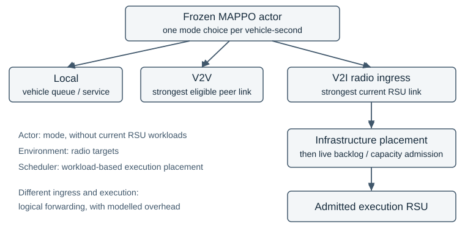

# TrafficTwin: Admission and Dispatch Semantics in Vehicular Edge Computing under a Frozen MAPPO Policy

S M Abdulla Al Mamun  
The University of Manchester  
Master's dissertation — joint-confirmation revision for author review, 8 September 2026  
Supervisor: Dr Sandra Sampaio

This revision starts from the reviewed LaTeX/Markdown manuscripts at `c049f00f2247bfbd1196d5e6524de8198fdd2df7`, retaining the completed task-type analysis and scheduler timings. The original scientific evidence remains at `04f3b6a95c7bc06c80ed95b54762f12861bba183`; the separately authorised joint-randomness study uses execution source `c4fe33681bd11e5af429d9f2c8c7f70f2bb745f1`. [Author inputs](AUTHOR_INPUTS.md) identify pending attribution, assessment-specific AI-use and submission decisions. No approval or declaration is implied.

## Abstract

Infrastructure scheduling can reverse a vehicular computing comparison under frozen policy weights. TrafficTwin studies strongest-link ingress, common-target least-workload and causal per-task placement. A new, separately sealed morning study completes 32 evaluations across eight joint fleet/evaluator-seed blocks. Per-task minus ingress is +4.137 percentage points, common-target minus ingress −3.504, and per-task minus causal round-robin +0.631; simultaneous 95% intervals are [+3.556, +4.717], [−3.980, −3.028] and [+0.511, +0.750], respectively. Workload awareness improves deadline attainment over cyclic spreading in this comparison.

The earlier four-draw morning replication, excluding its inspected pilot, remains separate from the new joint-randomness sample. Retrospective analysis distinguishes shared destinations, immediate reservations and admission reconciliation. In the exact studied model, two deadline values guarantee that three simultaneous replacements equal causal fixed-target admission; service/timing constraints explain queue clearing and recurring destinations. Constructed float32 boundaries qualify executable equivalence without establishing historical prevalence.

Retained morning accounting locates 284,821 gains and 12,842 losses, with almost all net gains in the two distinct 100 ms task types. These are descriptive transitions, not individual-decision causal effects. Separate compiled CPU fixtures show lower scheduler cost for causal per-task scans than three-pass reconciliation and a further reduction for cyclic targeting.

The contribution is an inspectable implementation study, not a new learned controller. Joint randomness broadens evidence within one morning trace, while global service-work knowledge, aggregate timing and one actor restrict generalisation. Historical capacity statistics remain inconclusive and separately qualified by an unquantified scoring-mask exception whose original task records are unavailable.

## 1. Introduction

### 1.1 Problem and motivation

Vehicular edge computing couples radio and computational resources: a strong radio connection can reach a busy server, and accepting work does not ensure timely completion [[1]](#ref-1). TrafficTwin asks which implementation decisions cause an observed scheduling advantage.

TrafficTwin combines a trace-driven VEC evaluator with an evidence-oriented software artifact. A supplied MAPPO actor selects Local, V2I or V2V; infrastructure logic selects the execution RSU after radio ingress. This boundary exposes downstream scheduling without retraining the vehicle policy [[S4]](#source-s4).

The initial capacity question distinguished waiting-room space from useful service, motivating E0 accounting and the offered-task denominator. Opposite rankings for common-target and per-task least-workload implementations then made decision and reservation semantics central.


### 1.2 Related work and the position of this study

The closest intellectual comparison is task dispatch to parallel servers, particularly the information used to estimate waiting time and the point at which an assignment changes that information. RL supplies the upstream policy, but it does not define the downstream scheduling problem. The following synthesis positions the completed experiments retrospectively: these papers were newly inspected during manuscript revision and are not presented as having guided the historical experiments.

**Queue count and remaining work.** Shortest-queue dispatch compares numbers of jobs; shortest-workload dispatch compares their outstanding service requirements. With heterogeneous task sizes, these orderings can disagree. Harchol-Balter, Crovella and Murta explicitly study dynamic least-work-remaining assignment when service demand is known, alongside random, round-robin and size-based assignment. Their model assumes immediate per-arrival assignment, identical hosts, non-preemptive first-come-first-served service and Poisson arrivals. Their analysis shows that preferred assignment policies depend on task-size variability [[2]](#ref-2). Consequently, neither choosing the least workload nor achieving balanced allocation establishes universal optimality. TrafficTwin's inherited `jsq` name is misleading if read literally: the implemented selector compares service milliseconds, while a separate task count enforces finite admission capacity.

**Batch decisions and reservations.** Batching does not inherently imply sending a batch to one server. Sparrow pools probes across a parallel job and spreads its tasks over selected workers; late binding queues reservations and assigns tasks when workers become ready. Its discussion identifies both queue-count prediction errors and races between schedulers using apparently idle workers [[9]](#ref-9). This distinguishes two issues that a generic “batch versus per-task” description would conflate: sharing information across candidates can help, whereas committing many assignments against one unchanged destination can concentrate work. TrafficTwin evaluates the latter implementation. Its immediate service-work reservation is also different from Sparrow's worker-triggered task binding: TrafficTwin assumes the necessary information and acknowledgement are already available.

Ying, Srikant and Kang make the reservation distinction especially explicit: batch-filling samples queue counts, assigns tasks one by one and updates the chosen queue after each assignment. Their analysis assumes identical servers, exponential service, Poisson batch arrivals and random ties [[13]](#ref-13). This is close prior art for sequential within-batch updates. Although the evaluator comments mention their batch-filling work, its common-target reconciliation does not implement that destination rule. TrafficTwin's causal change is therefore an adaptation of established dispatch semantics, evaluated with workload information and deadline admission, rather than a novel batching principle.

**Local information and common destinations.** Vargaftik, Keslassy and Orda's Local Shortest Queue (LSQ) policies maintain possibly outdated queue-count estimates at multiple dispatchers. Their slotted model can send all jobs arriving at one dispatcher in a slot to one locally shortest queue, with random tie-breaking. Algorithms update local estimates by the jobs sent and refresh selected entries through communication. Their stability result requires stated arrival/service assumptions and bounded expected estimation error [[10]](#ref-10). This is particularly useful counterevidence to an overbroad novelty claim: common destinations and local updates both predate TrafficTwin. What differs here is service-work information, deterministic index ties, a backlog gate, five ordered task slots and one-second aggregate draining. Neither the LSQ stability theorem nor its distributed communication results transfer directly to these finite-horizon deadline outcomes.

**Admission and useful completion.** Niño-Mora jointly studies admission and routing to heterogeneous multiserver queues, charging separately for rejection and admitted deadline misses. The model uses Poisson arrivals, exponential service, soft deadlines and state-dependent index policies; admitted late jobs remain until completion [[11]](#ref-11). This establishes admission as an optimisation decision with consequences beyond the admitted population. TrafficTwin instead preserves a simple inherited backlog filter to make the placement contrast interpretable. The gate does not estimate the complete response time or promise success. Counting successes over all offered tasks makes a reject-all policy score zero and prevents selective admission from concealing failures. That denominator is a deliberate measurement choice, not a newly invented admission algorithm.

Table 1 locates the comparison along operational dimensions. The papers identify relevant mechanisms and alternatives; they are not external benchmark arms. Their arrival processes, objectives and resource models differ too much for published performance percentages to be compared as controlled results.

*Table 1. Closest-work comparison. “Work” means remaining service demand; “count” means queued jobs. TrafficTwin rows describe the frozen implementation, not a scheduling-family definition.*

| Work / decision layer and arrivals | Information and update semantics | Admission / objective | Relationship to TrafficTwin |
|---|---|---|---|
| Harchol-Balter et al. [2]: dispatch each arrival | Known service work; central per-arrival choice | Mean waiting time; size-normalised waiting | Closest least-workload comparator; no vehicular gate |
| Sparrow [9]: parallel-job task placement | Sampled workers; queued reservations; worker replies bind tasks | Job response time; placement constraints | Batch spreading differs from one common destination; communication is explicit |
| Ying et al. [13]: tasks within an arriving batch | Sampled counts; update after each assignment; random ties | Delay and sampling cost | Closest within-batch update rule; no deadline gate |
| LSQ [10]: dispatcher batch per time slot | Local queue counts; own-assignment increments and sampled/pushed updates | Stability under specified assumptions | Common routing is established; random ties and distributed estimates differ |
| Niño-Mora [11]: joint admission/routing per arrival | Queue counts and model-based indices | Rejection and deadline-miss costs | Supports joint evaluation, not the inherited backlog predicate |
| TrafficTwin common-target: one choice per substep | Global service work; vectorised candidate offsets and three reconciliations | Backlog gate plus finite task limit | Frozen vehicle policy; instantaneous logical forwarding |
| TrafficTwin per-task: ordered candidate scan | Global service work; actual admitted work reserved immediately | Same predicate and limit, causal admission | Tested implementation change; global information is assumed |

**Attribution and simulation validity.** Sargent distinguishes verification of a computer model from operational validation for its intended application [[12]](#ref-12). TrafficTwin's conservation and replay checks primarily establish the former; observed physical RSU service and network measurements would be needed for stronger deployment claims. SUMO supplies a microscopic simulation framework [[8]](#ref-8), but importing its trajectories does not independently validate a coupled radio/computing model. This distinction explains why a source-correct result can be scientifically useful while remaining conditional on simulation semantics.

PPO and MAPPO identify the reused actor's provenance [[3]](#ref-3), [[4]](#ref-4), without establishing checkpoint optimality or identical actions under changed observations. Henderson et al., Agarwal et al. and Gorsane et al. motivate exposing implementation choices and finite-run uncertainty [[5]](#ref-5), [[6]](#ref-6), [[7]](#ref-7). TrafficTwin checks actions and uses draws or joint-seed blocks as replications; these references do not establish its small-sample distributional assumption.

The contribution concerns a defined control boundary: established workload and reservation ideas yield opposite rankings against ingress. Decision semantics and offered-task accounting make that result interpretable.

### 1.3 Aim, research questions and contribution

The aim is to determine whether deterministic infrastructure-side RSU load management improves offered-task deadline attainment under a frozen vehicle policy, and to establish which claims the available evidence can support. The questions developed with the programme; the morning replication questions and analysis were declared before its new outcomes, while the mechanism audit was explicitly post-hoc.

**RQ1 — Measurement and capacity.** What do the recorded accounting checks establish, and does increasing the RSU waiting-room limit at fixed compute service improve the archived score? Interpretation as admission-consistent deadline attainment additionally depends on the unresolved legacy scoring-mask exception (§3.1). Sampling and measurement uncertainty are separate questions.

**RQ2 — Admission and dispatch semantics.** Under matched inputs and the inherited workload-based admission rule, how do ingress execution, common-target least-busy placement and sequential per-task least-busy placement compare in the incident scenario? The distinction concerns the implemented decision process, including its reconciliation semantics.

**RQ3 — Replication and mechanism.** Does the incident ordering recur across newly declared fleet draws in the morning scenario, and what recorded or reconstructable behaviour explains the common-target scheduler's repeatedly selected RSU identities? The original replication, subsequent explanatory audit and new joint-randomness confirmation have distinct evidential roles.

**RQ4 — Bounded sensitivities.** Within one incident fleet draw, how do aged placement-workload reports and a fixed forwarding overhead affect the comparison? These studies test specific model assumptions descriptively, without establishing population-level robustness or a physical backhaul design.

The contributions are source-audited accounting, adaptive incident comparisons, separate morning replication and an exact-model explanation with numerical limits. Retrospective task-type and cost analyses are retained. A newly authorised eight-block study tests reversal under joint fleet/evaluator randomness and workload awareness against cyclic spreading. These extensions followed the earlier findings; personal attribution is separately assessed [[S11]](#source-s11), [[S13]](#source-s13)–[[S16]](#source-s16).

### 1.4 Scope and report structure

One actor, a provisional fleet model and two Manchester traces bound the study. Section 2 specifies the model and design; Section 3 evaluates findings and achievement; Section 4 answers the questions. Appendices support verification.

## 2. Methodology

### 2.1 Research design and evidence hierarchy

Matched traffic, fleet and task inputs isolate infrastructure changes under a frozen policy; recorded actions are checked rather than assumed identical. Conclusions concern this evaluator, not retrained or physically validated systems.

The sequence is adaptive: earlier observations informed later questions. E2c excludes its discovery seed, while the morning replication excludes its inspected pilot. Frozen source and accepted records determine experimental meaning; correspondence clarifies intention. The completed raw audit and subsequent kernel analyses are retrospective investigations, not part of the original protocols [[S0]](#source-s0)–[[S8]](#source-s8), [[S13]](#source-s13).

### 2.2 Architecture and information boundaries

Figure 1 separates actor mode choice, environmental radio targeting and infrastructure execution/admission. V2I ingress is the strongest simulated radio link. Ingress execution retains that RSU; load-balancing arms may assign elsewhere. A target remains a proposal until admission [[S4]](#source-s4).



*Figure 1. Experimental responsibility boundaries. Only admitted V2I work enters the selected execution queue; logical forwarding applies when ingress and execution differ. Resource scaling is outside the completed comparison.*

The 17-dimensional observation includes task descriptors, vehicle queues, state of charge, radio summaries, compute capability, EV status and observed V2V target tier, but excludes RSU workload. One mode per active vehicle-second serves all independently sampled operational tasks in its five slots. Admission can nevertheless affect transmit energy, then SoC and later observations/actions. Frozen weights therefore do not guarantee fixed actions; the old matched-action finding is empirical, and the new protocol allows this feedback.

V2V target selection is environmental: exclude the source and peers whose queues are full, then select the remaining strongest instantaneous simulated link. Distance contributes to link quality, but fading also contributes; this is not simply nearest-neighbour selection. Peer workload and capability affect latency after selection, while capability is not itself the target-ranking criterion. Observation and operational link calculations use separate fading samples. The correspondence confirms this and the per-vehicle-second decision convention as intended inherited behaviour, not an accidental change introduced by the placement study [[S4]](#source-s4).

### 2.3 Scenarios, actor and controlled inputs

Table 2 identifies the two scenarios. Traffic positions are imported from saved traces; the evaluator does not rerun SUMO during each scheduling comparison. The morning input audit reconstructs the canonical trace arrays from their source records and checks entry markers and slot assignment. This matters because padded array slots are not necessarily permanent vehicle identities. On morning vehicle entry, the recorded convention resets vehicle queues for the new visit; state of charge is not reset by that queue operation. The incident trace retains its earlier convention without the same entry channel [[S7]](#source-s7).

*Table 2. Scenario identity and fixed placement controls. Differences between scenarios are retained and documented, not treated as a single-factor intervention.*

| Setting | Incident scenario | Morning scenario |
|---|---|---|
| Date and local window | 15 March 2024, 20:00–21:00 | 15 October 2024, 08:00–11:00 |
| One-second steps | 3,600 | 10,800 |
| Padded vehicle slots | 2,488 | 215 |
| RSUs | 10 | 9 |
| SUMO seed | 43 | 42 |
| Vehicle queue convention | Conserved, legacy trace convention | Conserved, canonical per-visit reset |
| Placement-study RSU limit | 6,220 tasks per RSU | 6,220 tasks per RSU |
| Service / forwarding / scaling | 1× / 0 ms / off | 1× / 0 ms / off |

The same one-hot-17 MAPPO checkpoint, identified by its archived hash, is retained throughout. Its inherited training provenance is Model C with synthetic mobility, 128 environments, learning rate 0.003 and training seed 100. Those facts identify the input artifact; they are not a training reproduction performed here. The provisional UK2030 fleet preset samples RPi-, Jetson- and GPU-vehicle tiers with probabilities (0.40, 0.35, 0.25), and electric-vehicle status with probability 0.22. These are modelling assumptions, not measured Manchester fleet shares. The original replications vary fleet seed with evaluator seed 0 fixed. The new eight-block study varies both seeds (§3.7); neither varies actor training or the canonical traffic trace.

Each active vehicle offers min(Poisson(1.5), 5) tasks per second; inactive slots offer none. Operational task types are independently sampled with probabilities (0.20, 0.30, 0.50). Types 1–3 have deadlines (100, 500, 100) ms, mean input sizes (1, 0.0012, 0.001) MB and workloads (1,254, 2,100, 15) million cycles. Input sizes multiply their type mean by an independent uniform 0.8–1.2 factor. The five-slot cap changes offered work as well as scheduling opportunities [[S4]](#source-s4).

For homogeneous RSUs, service milliseconds are s = ξ × C_t / [2.2 × 1.5 × min(12, p_t) × 0.9 × min(5, g_t)], where C_t is million cycles, p_t = (4, 4, 2), g_t = (40, 5, 1), and ξ is uniform on 0.9–1.1. The denominator uses 2.2 GHz, 1.5 instructions per cycle, effective cores, utilisation and capped GPU acceleration. Million-cycle/GHz conversion yields milliseconds. Before noise, services are approximately (21.111, 35.354, 2.525) ms. All placement arms use service multiplier 1.

Absolute capacity avoids a confound: the incident ratio 2.5 × 2,488 gives 6,220 tasks per RSU; applying 2.5 to the morning width would give only 538. The morning protocol fixes 6,220 explicitly. Density, duration, layout and vehicle-entry conventions still differ.

### 2.4 Time, queues, admission and outcomes

A batch advances simulated time by one second. Five internal task substeps order admissions; they are not five 200 ms clock advances. Work accumulates across them before one service drain. Let W[r] denote remaining service milliseconds at RSU r, Q[r] its aggregate task count and C the task limit. These variables serve different purposes: identical counts can represent different work, and increasing C does not accelerate service [[S4]](#source-s4).

For each offered task i, let a[i] indicate admission, y[i] indicate the recorded deadline success, and z[i,c] indicate terminal failure category c. The intended accounting contract requires one admission or failure and no success for rejected work. The per-run primary outcome and validation requirements are:

**(1)** A = N_met / N_offered = Σ y[i] / N_offered; reported percentage = 100A.

**(2)** a[i] + Σ z[i,c] = 1; y[i] ≤ a[i]; N_offered = N_admitted + N_failed.

Here N_failed includes both rejection and unavailability. Categories distinguish local queue rejection, V2V queue rejection or unavailability, and V2I unavailability, backlog-gate rejection or capacity rejection. Gate failure takes precedence over capacity failure when both apply. Selected targets are proposals; rejected tasks neither execute nor reserve work (Figure 2). Admitted attainment uses N_admitted instead, so must not replace Equation (1). Offered, admitted and successful-task latency means similarly have different populations.


*Figure 2. Offered tasks remain in the primary denominator. Admission, execution assignment and deadline outcome are separate fields; selecting an RSU does not establish that work executed there.*

The inherited gate tests existing effective workload, including the candidate offset O[i], against deadline D[i]:

**(3)** W[r] + O[i] < D[i], together with an available task-count place.

The inequality is strict. It excludes the candidate's service, radio transfer and forwarding cost, and therefore is a backlog filter rather than an end-to-end feasibility guarantee. Candidate ordering and offsets differ between algorithms (§2.5). Admission uses positive ingress link quality as its coarse radio condition; the latency model additionally requires quality at least 0.15 for a usable transmission. Consequently, admission can still lead to a transmission-related deadline miss.

For viable V2I execution, the modelled response latency is:

**(4)** L_raw[i] = T(input[i], q, c) + W[r] + O[i] + s[i,r] + T(0.001, q, c) + f · 1(r ≠ ingress[i]).

T(b,q,c) is 0.1 + 1,000 × 8b/c milliseconds for q ≥ 0.15 and capacity c > 0.000000001 Mbps, with b in MB; otherwise it uses a 10⁹ ms failure value (up to the 0.1 ms propagation addition). The 0.001 MB return term reuses the ingress quality and capacity. It is not a separately simulated downlink or inter-RSU route. The fixed forwarding charge f is added once. Local latency is vehicle backlog plus local service; V2V adds input/return transfers on the selected peer link, peer backlog, preceding local/V2V reservations and peer service. Service s derives from task cycles, device frequency, parallelism, utilisation and acceleration, with a sampled 0.9–1.1 multiplier. The placement code reserves the same sampled work used for latency: exact service knowledge is a declared information assumption.

The gate-enabled paths pass final admission into latency scoring. Historical `off` instead passes earlier coarse eligibility while enqueueing uses refined admission: an in-substep capacity rejection need not receive penalty latency. Its historical numerical impact remains unquantified (§3.1). The final mapping is L[i] = 10D[i] when L_raw[i] ≥ 10⁸ ms, and L[i] = L_raw[i] otherwise. Finite late latencies are not generally clipped; success uses L[i] ≤ D[i], inclusively. Finite rejection latency alone is not a false deadline success.

For each queue over an interval, work accounting requires:

**(5)** W_initial + Σ admitted service = Σ served service + W_final.

After the fifth substep, S[r] = min(W_post[r], 1,000) is served and W_next[r] = W_post[r] − S[r]. If this empties the queue, its task count becomes zero. Otherwise the evaluator subtracts floor(Q_post[r] × S[r]/W_post[r]), retaining at least one task while positive work remains. This aggregate carry approximation has no individual departure-event model. Equation (5) checks the declared dynamics, not their physical calibration.

### 2.5 Placement algorithms and their implementation

Table 3 separates execution destination from the gate switch. The identifier `jsq` actually selects least service workload, not shortest task count. `dla` combines this common-target selector with Equation (3); these inherited names do not define canonical scheduling algorithms [[S2]](#source-s2), [[S4]](#source-s4).

*Table 3. Infrastructure conditions. All retain strongest-link radio ingress. “Live” eligibility is refreshed at each substep; the historical off mode retains step-entry coarse eligibility.*

| Mode | Execution destination | Backlog gate | Coarse eligibility |
|---|---|---|---|
| `off` | Ingress | Off | Step entry |
| `jsq` | Common least-workload target | Off | Live |
| `ingress_dla` | Ingress | On | Live |
| `dla` | Common least-workload target | On | Live |
| `per_task_dla` | Causal least-workload target | On | Live |
| `causal_round_robin` | Persistent cyclic target | On | Live |

Both placement algorithms below operate once per task substep, using its entry state W, Q. Index i follows ascending padded-vehicle order, not arrival-time or deadline priority. Each candidate has actual service s[i,r], deadline D[i] and a fixed actor action and radio ingress. Every argmin considers all RSUs and breaks ties by lowest index; a full selected RSU is rejected rather than excluded and retried elsewhere.

For common-target reconciliation, let E[i] mean active V2I attempt, positive ingress quality and Q[r[i]] < C at substep entry. For an admission mask M, define O[i,M] as the sum of s[j,r[i]] over earlier j < i with the same target and M[j] true; H[i,M] is their count. Offsets are exclusive: a candidate's own service is omitted. Algorithm 1 follows the frozen implementation's three simultaneous replacements, without claiming convergence.

```text
Algorithm 1: common-target placement with gate (one substep)
r[i] = lowest-index argmin(W), shared by all candidates
M = E
repeat exactly three times:
    compute O[i,M] and H[i,M] from the previous whole mask
    M_new[i] = E[i] and (W[r[i]] + O[i,M] < D[i])
                       and (H[i,M] < C - Q[r[i]])
    M = M_new simultaneously
recompute final offsets O[i,M] for latency
label E-candidates failing the final workload test as gate failures
label remaining E-candidates excluded by M as capacity failures
commit each M-admitted task and its full service once
unavailable or rejected tasks reserve nothing
```

Target selection never changes during reconciliation. The final admission mask and the offsets recomputed from it determine the recorded processing; three passes are an implementation constant. Section 3.4 establishes the exact two-deadline guarantee and its float32 boundary. Ingress with the gate uses the same offset/reconciliation machinery with individual ingress targets instead of the common argmin. Gate-off modes omit the workload test.

```text
Algorithm 2: causal per-task placement with gate (one substep)
repeat exactly three complete passes:
    working_W = W; working_Q = Q       # restart, not cumulative
    for i in ascending padded-vehicle order:
        r[i] = lowest-index argmin(working_W)
        O[i] = working_W[r[i]] - W[r[i]]
        require active V2I, positive quality and Q[r[i]] < C
        test working_W[r[i]] < D[i], then working_Q[r[i]] < C
        if admitted:
            working_W[r[i]] += s[i,r[i]]
            working_Q[r[i]] += 1
        otherwise label failure; reserve nothing
retain the last pass; commit its admitted work once
```

The causal gate and capacity see earlier admissions immediately. Repeated passes begin from identical initial state and reproduce the same decisions; they do not triple reservations. Physical queue arrays receive the final result once, before the next substep. Both algorithms drain service only after all five substeps. Thus the comparison changes selection frequency, reservation visibility and reconciliation semantics; it is not an isolated change to argmin frequency.

For an illustrative scheduling calculation, assume three empty identical RSUs, four viable 40 ms tasks with 100 ms deadlines, nonbinding capacity and negligible communication. Common-target chooses RSU 0; its masks settle at three admissions and one gate rejection. The admitted offsets are 0, 40 and 80 ms, leaving 120, 0, 0 ms: the third admitted task misses its deadline despite passing the backlog gate. Per-task selects 0, 1, 2, 0, leaves 80, 40, 40 ms and all four meet deadlines under these assumptions. Figure 3 depicts the proposals. This constructed example explains mechanics; it is neither a recorded task group nor an estimate of recoverable historical failures.


*Figure 3. Four illustrative proposals. The common destination remains fixed through reconciliation; causal placement updates after admissions. The accompanying worked example states admissions and deadline outcomes under deliberately simplified assumptions.*

### 2.6 Experimental progression and inference

E0 validates recorded accounting before performance analysis. E1 compares three queue limits at fixed service across five matched fleet draws. E2 and E2b are exploratory single-draw studies separating placement and admission. E2c evaluates common-target against ingress on four new incident draws, seeds 1–4. E2d is an adaptive extension after inspecting E2c: it adds per-task placement on those previously examined draws and reuses the exact controls. They are not new independent observations [[S0]](#source-s0)–[[S3]](#source-s3).

The morning pilot uses seed 1 for ingress and per-task placement. After inspecting it, the replication declares seeds 0, 2, 3 and 4 and all three arms, yielding twelve new full runs. The primary contrasts are per-task minus ingress, common-target minus ingress, and per-task minus common-target. The pilot is excluded; a supplementary two-arm five-draw summary is descriptive. The local protocol and manifest preceded the new outcomes, but there was no external preregistration [[S7]](#source-s7), [[S8]](#source-s8).

For each contrast, a fleet draw supplies one paired difference in percentage points. Draws receive equal weight. The mean difference has a Student-t interval, mean ± t × sample standard deviation / square root of n. Incident E2c/E2d retain their reported individual 95% intervals. The morning protocol additionally uses Bonferroni simultaneous intervals for three contrasts, with critical value t at probability 1 − 0.05/(2 × 3), three degrees of freedom. Its reversal criterion requires the simultaneous common-target-minus-ingress interval below zero and the per-task-minus-ingress interval above zero. Four draws cannot strongly diagnose distributional assumptions; these small-sample intervals remain conditional parametric summaries, not task-level significance tests.

### 2.7 Sensitivities, mechanism audit and validation

The state-information pilot uses incident seed 1 and report ages 0, 100, 500 and 1,000 ms, alongside ingress. Admission remains live. For previous post-admission workload B and positive age d, the report is max(B − (1,000 − d), 0), with current-batch reservations added immediately. This assumes continuous service between batches without redistributing arrivals. Startup uses live state and recorded age zero [[S5]](#source-s5).

Four ten-step forwarding probes qualify fixed-latency transformations of saved full records: charges leave admission, queues and actions unchanged. No full positive-cost simulation or network model is implied; penalty-equal ambiguity remains unresolved [[S6]](#source-s6).

The reused gap-closure audit authenticated 87 September arrays and checked 19 full runs: twelve morning primary, two excluded pilot and five incident sensitivity cells. Active masks define offers; enqueue fields define V2I admission independently of success. Non-V2I admission excludes rejection predicates. Flags, categories, latency/deadlines, assignments and summaries are cross-checked; execution fields record admission, not departures [[S13]](#source-s13).

The prior joins require identical manifest/fleet and trace-row/substep/slot coordinates, with matching task, arrival, action and ingress fields. Unsaved sizes correspond through the arm-independent random-key schedule. Gains minus losses must equal the archived success difference over a common offered denominator; this is descriptive accounting.

The existing reference distinguishes simultaneous common-target admission A, causal admission replaying A's targets B, and causal reselection C. The completed exact proof and 719-input numerical investigation are reused; Appendix C records their scope. Masks require exact agreement, independently of offset tolerance. No prior audit, task join or numerical suite is repeated [[S14]](#source-s14).

### 2.8 Retrospective extensions and measurement design

The new causal round-robin comparator isolates workload-aware selection from simple spreading. A pointer starts at RSU 0 and persists across candidates, substeps and batches. Each active V2I attempt with positive ingress quality proposes the pointer's RSU and advances it modulo R, even if capacity or the strict gate subsequently rejects it. Unavailable radio and padding do not advance it; there is no retry or full-node skipping. Candidate order, sampled work, gate/capacity rules, precision, accounting, forwarding and drain match causal per-task placement. Repeated passes restart from the same pointer and queues; the final pointer commits once. The new versioned copy preserves frozen sources. Prior kernel checks cover rejection, radio, capacity and carry. Eight bounded evaluator runs now qualify instrumentation, unchanged arms, four-arm controls and pointer restart; Appendix E states coverage limits [[S15]](#source-s15), [[S16]](#source-s16).

The scheduler benchmark uses actual JAX helpers, including the unchanged three-replacement prefix operations. Precomputed candidate work replaces only their service provider. Sixteen configurations combine four arms, N/R=215/9 or 2,488/10, K=5, and sparse/empty or busy/nonempty fixtures. Types retain coupled deadlines and service ranges; all arms receive identical arrays. These are constructed inputs, not observed trajectories. Busy batch-entry queues are imposed stress states, excluded by exact clearing from empty initialisation (§3.4). Following official JAX guidance, compilation is separate, inputs are device-resident, five warm-ups precede 100 timed calls, and every output is synchronised. Actor, radio, service generation, transfers, scoring and I/O are excluded. Timing repetitions measure host variability, not fleet uncertainty [[14]](#ref-14).

The retained type aggregation authenticated eight original primary-morning task files, one at a time. Outcome categories supply admission, gate rejection and admitted misses; their independent admission validation comes from the prior audit. Type totals must reproduce all-task summaries and paired net changes. All three types and four draws are retained, without new joins or subgroup significance tests.

## 3. Evaluation and Reflection

### 3.1 Accounting validity and the capacity question

E0 addressed a concrete mismatch between task scoring and queue admission. In the legacy clamp path, the evaluator scored eligible V2I tasks and multiplied their combined service work by the fraction fitting the task-count ceiling. Surplus tasks were not individually identified in earlier scoring. The 5 August repair introduced per-task admission/rejection and full enqueueing of admitted work. Source history credits Randy's implementation and Abdulla's motivating accounting analysis; E0 qualified recorded accounting in that configuration [[S0]](#source-s0), [[S12]](#source-s12).

An illustrative reconstruction shows why the distinction matters. Suppose one queue place remains and two otherwise viable candidates each require 40 ms. Legacy fractional enqueue adds (1/2) × 80 = 40 ms, yet both candidates can remain in the previously scored population. The queue represents only half their combined demand. Corrected reject-mode admission accepts one candidate in the declared order, rejects the other, enqueues the accepted 40 ms in full and gives the rejected task a failure outcome. These are explanatory numbers, not a historical measured task pair. With unequal service times, fractional enqueue can additionally differ from the work of the particular task actually admitted.

The relevant invariant is that offered tasks partition into admitted and declared failed attempts, and rejected tasks do not execute. E0's validator cross-checks active records, terminal categories and summary counts. Its archived regression fixture changes offered count from two to three without adding a record and requires failure; another changes offered vehicle work from 10 to 11 ms against an 8 + 2 ms partition. However, summary work partition alone is weak evidence of dynamics because rejected work is calculated as offered minus admitted. Later independent reconstruction checks enqueue, drain and endpoints directly.

E0's archived receipts report passing checks, including deadline-flag/outcome agreement. Source versions identify the remaining exception: E0/E1 use `0f01f4d`, E2 uses `e11f444`, and E2b reuses E2's off cell. E0 and E2 off each record 834,120 capacity rejections, establishing exposure rather than false successes. Author-reported deletion of original E0/E1/E2 outputs, with no known backup, makes fresh task checks and rescoring not assessable. Surviving receipts cannot quantify non-penalty rejection latency [[S13]](#source-s13).

E1 varied waiting-room capacity across five matched draws. The archived score difference for 99,520 versus 1,866 tasks per RSU was −0.01094 percentage points, with a 95% interval [−0.02465, +0.00276]. Recalculation from surviving run summaries reproduces this interval; it is not fresh task-level validation. The archived E1 score contrast is statistically inconclusive under the historical implementation. Its interpretation as admission-consistent deadline attainment remains qualified by the unquantified scoring-mask exception. The interval describes sampling uncertainty conditional on that implementation, not the additional measurement uncertainty. Neither equivalence nor statistically supported degradation follows [[S1]](#source-s1).

The saved secondary summaries report more admissions and lower rejection at larger limits, while mean admitted latency rises from approximately 3.77 to 12.19 and 132.49 seconds. These changing admitted populations cannot substitute for the offered-task contrast; their latency interpretation also retains the mask qualification. Larger waiting rooms can retain work without increasing useful service.

Changing the off scoring mask could also change V2I transmission energy, state of charge and later actor observations. Even an admission-consistent adjustment of saved flags would describe fixed history, not a corrected rerun. Separately, the completed September gate-enabled audit found zero non-admitted successes, zero non-penalty rejection latencies and complete admission/category/summary agreement across its 19 authenticated runs. Their admission-consistent scores equal the archived scores. This finite result supports those later outcomes, without resolving the missing historical records or proving universal correctness.

### 3.2 From admission decomposition to the incident reversal

E2's exploratory seed-0 comparison showed offered attainment of approximately 68.362% for strongest-link execution without the deadline gate, 67.568% for inherited least-busy placement without the gate, and 69.494% for inherited least-busy placement with the gate. The last comparison changed both placement and admission relative to the strongest-link reference. Its improvement could not establish that load balancing itself helped [[S2]](#source-s2).

E2b added ingress execution with the same deadline gate, reaching approximately 71.577%. The strongest-link contrast was +3.215 points and the common-target contrast +1.926 points, giving an interaction of −1.290 points. However, `off` uses step-entry coarse saturation eligibility while `ingress_dla` refreshes eligibility per substep. Their contrast and interaction bundle the gate with this timing difference and retain the legacy scoring-mask exception (§2.4). The manifest records 138 unavailable V2I attempts among 13,076,234 offered tasks in off; that count does not bound downstream effects. E2b identifies a stronger comparator without assigning its entire gain solely to the gate. Subsequent gate-held placement comparisons use live eligibility and refined scoring masks in all arms. In the exploratory draw, common-target remained 2.083 points below ingress with the gate.

E2c tested the common-target comparison on four new incident fleet draws, excluding discovery seed 0. Its mean difference from ingress was −2.122 points, with an individual 95% interval of [−2.234, −2.011]. All four paired differences were negative. Inspection then established that the inherited scheduler chose one common target per task substep. E2d introduced the causal per-task implementation under the same actor, trace, gate predicate, queue ceiling, service and forwarding controls. Table 4 retains all four draw-level results [[S3]](#source-s3).

*Table 4. Incident offered-task deadline attainment, expressed as percentages. E2d reused the exact E2c ingress and common-target controls; these are four paired draws, not separate sets of independent controls.*

| Fleet seed | Ingress | Common-target | Per-task | Per-task − ingress, pp |
|---|---:|---:|---:|---:|
| 1 | 72.003 | 69.794 | 72.467 | +0.464 |
| 2 | 70.369 | 68.317 | 70.956 | +0.587 |
| 3 | 70.298 | 68.153 | 70.805 | +0.507 |
| 4 | 70.887 | 68.805 | 71.438 | +0.551 |

Per-task exceeds ingress by 0.527 points, individual 95% interval [+0.442, +0.612], and common-target by 2.649 points, interval [+2.621, +2.678]. RQ2 therefore yields opposite rankings for the two implementations. These intervals summarise an adaptive extension on examined draws; the morning protocol supplies prospective replication.

Ingress determines the practical scale: against 70.889% mean attainment, +0.527 points means about 53 extra successes per 10,000 offered, or a 0.744% relative increase. The larger +2.649-point common-target contrast diagnoses that implementation; it is not the gain over the stronger reference. These are descriptive conversions of the same mean, and neither arm establishes optimal dispatch.

### 3.3 Morning replication with the inspected pilot excluded

The inspected morning pilot offered 1,744,116 tasks and produced 91.075% ingress versus 94.028% per-task attainment: +2.953 points or 51,503 successes. It motivated replication but remains exploratory [[S7]](#source-s7).

The morning protocol declared four new seeds and all three arms before outcomes. Each draw reproduces common-target < ingress < per-task. Mean attainment is 85.655%, 88.887% and 92.785%, respectively; its lower ingress/per-task means than the pilot underline the need for replication [[S8]](#source-s8).

*Table 5. Morning primary replication. Seed 1 is absent because it was the inspected pilot; each row is a matched fleet draw on the same morning trace.*

| Fleet seed | Ingress, % | Common-target, % | Per-task, % | Per-task − ingress, pp |
|---|---:|---:|---:|---:|
| 0 | 88.817 | 85.660 | 92.705 | +3.888 |
| 2 | 87.536 | 83.537 | 92.060 | +4.524 |
| 3 | 89.082 | 85.862 | 92.978 | +3.896 |
| 4 | 90.113 | 87.559 | 93.399 | +3.286 |

Table 6's simultaneous per-task-minus-ingress interval is positive and common-target-minus-ingress interval negative, satisfying the prespecified reversal criterion. Figure 4 displays these primary results.

*Table 6. Morning paired contrasts in percentage points. Individual intervals are two-sided 95% Student-t intervals; simultaneous intervals use the prespecified three-contrast Bonferroni adjustment. Replication uses four fleet draws.*

| Contrast | Mean | Individual 95% interval | Simultaneous 95% interval |
|---|---:|---|---|
| Per-task − ingress | +3.899 | [+3.094, +4.703] | [+2.671, +5.126] |
| Common-target − ingress | −3.232 | [−4.176, −2.289] | [−4.672, −1.793] |
| Per-task − common-target | +7.131 | [+5.385, +8.877] | [+4.466, +9.795] |


*Figure 4. Redrawn from archived morning primary data. Left: within-draw attainment. Right: draw differences, mean diamonds and three-contrast Bonferroni intervals. The inspected pilot is excluded; uncertainty concerns four newly declared fleet draws, conditional on the frozen actor and morning scenario [[S8]](#source-s8).*

The supplementary five-draw ingress/per-task mean, including the pilot, is +3.709 points descriptively; it does not enter Table 6. No common-target pilot result is available.

The morning gain is about 390 extra successes per 10,000 offered, a 4.386% relative increase over ingress. Its larger magnitude cannot be attributed solely to density: RSU layout/count, date, duration, padded fleet width and entry conventions also change. Separate analyses support recurrence in two Manchester scenarios, without estimating a pooled geographical effect.

Table 7 makes both sides of the improvement visible over the same 1,744,116 offered tasks per draw. Gains total 284,821 and losses 12,842, giving 271,979 net additional successes. Previously rejected work contributes most gains, but admitted misses also matter; per-task placement introduces smaller losses of both kinds. These are descriptive transitions under different later queues, not individual-decision causal effects. The four fleet draws remain the replications [[S13]](#source-s13), [[S14]](#source-s14).

*Table 7. Morning ingress→per-task outcome accounting, re-extracted from the authenticated paired results. Gains become successes; losses cease to be successes. All four primary draws are retained; the pilot is excluded.*

| Seed | Gain: gate rejection | Gain: admitted miss | Loss: non-admitted | Loss: admitted miss | Net successes |
|---|---:|---:|---:|---:|---:|
| 0 | 53,061 | 18,091 | 395 | 2,945 | 67,812 |
| 2 | 64,418 | 19,125 | 496 | 4,144 | 78,903 |
| 3 | 52,432 | 18,430 | 105 | 2,808 | 67,949 |
| 4 | 41,823 | 17,441 | 48 | 1,901 | 57,315 |
| Total | 211,734 | 73,087 | 1,044 | 11,798 | 271,979 |

*Table 8. Retrospective type-level net additional successes, per-task minus ingress. Each type has the stated offered population in every primary draw; full successes, admissions and failure counts are supplied in Appendix D.*

| Type / deadline | Offered per draw | Seed 0 | Seed 2 | Seed 3 | Seed 4 |
|---|---:|---:|---:|---:|---:|
| 1 / 100 ms | 349,045 | +19,823 | +19,165 | +20,339 | +20,254 |
| 2 / 500 ms | 523,060 | +72 | +62 | +6 | +5 |
| 3 / 100 ms | 872,011 | +47,917 | +59,676 | +47,604 | +37,056 |

The gain is concentrated in the two distinct 100 ms types (Table 8). Type 3 supplies 192,253 net successes (70.7% of the total), Type 1 79,581 (29.3%), and Type 2 only 145. Within-type gains span 4.249–6.843, 5.491–5.827 and 0.001–0.014 percentage points, respectively. Type 1's much larger payload and service demand distinguish it from Type 3 (§2.3). No type has a negative net change in any draw, but this does not mean no tasks are harmed: Table 7 retains losses. In draw 2, Type 1 gate rejections fall by 23,152 while admitted misses rise by 3,987, yielding 19,165 net successes. Reduced rejection is consistent with access to spare queues; these records cannot isolate deadline length from type-specific communication/service demand or identify each scheduling decision's causal effect [[S15]](#source-s15).

### 3.4 Destination concentration and production-domain mechanisms

Workload diagnostics revealed a striking morning contrast. Common-target admitted work used only RSUs 0–4, while per-task placement used all nine. Mean common-target workload shares were approximately 48.34%, 30.33%, 14.63%, 5.21% and 1.48% across those five RSUs, with zero work at RSUs 5–8. Per-task shares were close to one ninth each. Figure 5 is descriptive evidence of allocation, not proof that workload equality alone caused the attainment difference [[S8]](#source-s8).


*Figure 5. Admitted service-work distribution, redrawn from archived CSVs. Bars are means; whiskers are observed minima/maxima over four fleet draws, not confidence intervals. Aggregate shares motivated a separate post-hoc audit; they do not by themselves establish intermediate scheduling decisions or counterfactual task outcomes.*

The completed audit covers four common-target runs: 43,200 seconds and 216,000 substeps. All saved end-of-second workloads and task counts were zero, covering 388,800 entries per field. Every observable target selected RSU k at substep k in 179,427 substeps. The remaining 36,573 had no recorded V2I attempt and do not expose the selector's internal output. Five RSUs formed the full-run union; all five were used in only 15,803 seconds [[S9]](#source-s9).

Intermediate substep workloads were not directly saved for common-target. They were reconstructed from recorded admissions and execution destinations using the previously qualified service-work reference and frozen replay. Every saved endpoint matched exactly, but all-zero endpoints have limited power to distinguish intermediate states. The stronger combined support is the qualified service reference, recorded admissions, frozen enqueue semantics and agreement with every observable target's lowest-index workload minimum. Maximum reconstructed pre-drain workloads ranged from approximately 534.281 to 538.730 ms, below the 1,000 ms service interval; maximum task counts were 22–25, far below 6,220.

A conditional deduction from Algorithm 1 explains the concentration. With K substeps and R RSUs, at most min(K, R) distinct destinations receive new assignments in one batch: each substep contributes at most one target, so their union has at most K members. This bound does not require empty queues or a particular tie rule, and concerns new assignments rather than all work already present.

The repeated low-index prefix requires additional assumptions. At an empty batch start, lowest-index ties select RSU 0. Positive admitted work makes that RSU busier than untouched empty nodes; without intervening draining, the next productive substep selects the next empty index. Induction gives a prefix when R ≥ K; a substep adding no work does not advance it. Complete end-of-batch clearing restores the initial tie. The recorded endpoints and reconstructed maxima satisfy those conditions here. Without clearing or deterministic ties, the per-batch bound could still hold while the full-run union covered all nine RSUs. This is analysis of the stated model, not a universal theorem against batching.

The arrays recorded 511,684 deadline-gate rejections and zero RSU-capacity rejections. In reconstructed states, every gate rejection coexisted with at least five idle RSUs possessing spare task capacity. Larger waiting rooms would not address that gate bottleneck. Spare capacity does not establish that each task would succeed elsewhere: redistribution changes later queues, and end-to-end latency also matters.

**Proposition 1 (fixed-target admission in the studied exact model).** Fix candidate order, eligibility, destinations, initial nonnegative workload/count and nonnegative service demands, with strict backlog and exclusive count-capacity tests and no intervening drain. At each nonempty destination, let n be the eligible candidate count and d the number of distinct deadlines. Starting from the eligibility mask, simultaneous replacement reaches the unique causal fixed point within min(n, 2d−1) replacements; destinations decouple.

**Proof sketch.** Each candidate depends only on earlier candidates, so a causal scan constructs the unique fixed point and one additional prefix position settles per replacement. The map reverses inclusion. Starting from an upper mask containing the solution, its first extra admission is removed next. Capacity exhaustion ends later admissions; otherwise gate rejection permanently excludes later deadlines no larger than its threshold. After two replacements the unresolved upper-bounded suffix has at most d−1 classes. Induction, with one class requiring one replacement, gives the sharper bound. Appendix C supplies the complete assumptions/proof [[S14]](#source-s14).

Here “production” means the studied evaluator configuration, not deployed roadside hardware. Its two deadline values imply three replacements suffice in exact arithmetic, including nonempty queues and capacity limits. The earlier three-threshold instability is outside this domain. This rules out unrestricted reconciliation failure as an exact-model explanation, while leaving target reselection and executable rounding distinct.

The same model makes clearing structural from empty initialisation. The last admitted task sees less than 500 ms of backlog and contributes at most approximately 38.889 ms of service. Each queue therefore remains below 538.889 ms before a 1,000 ms drain. The observed zero endpoints and reconstructed maxima near 538 ms agree with this consequence. Queue clearing and the resulting destination prefix thus follow from the stated gate/service/timing assumptions, not traffic density alone. This deduction is conditional on exact admission arithmetic and service multiplier 1.

Float32 qualifies this result: inclusive cumulative sums minus current work can round differently from causal exclusive accumulation. The completed investigation found stable third masks and causal-float32 agreement in 324 coupled fixtures; two still differed from exact arithmetic. Four of 210 deliberate threshold fixtures differed from causal float32, with one alternating mask. Imposed-target padding preserved that alternation at studied widths; a common-target-consistent empty-entry fixture remained stable. The alternating task was capacity-labelled despite spare capacity but missed its deadline either way. Sub-0.001 ms errors can change strict gates. These constructed boundaries establish neither full-trajectory reachability nor historical prevalence (Appendix C).

Target reselection can separately lose useful completions. Table 9 uses two empty RSUs, two substeps, capacity 6,220, zero transfer latency and repeated type2/type2/type1/type2 tasks with nominal production service demands. Both arms admit all eight tasks. B replays A's targets 0 then 1, whereas C chooses the current least workload after every reservation.

*Table 9. Reduced-infrastructure illustration with production task/deadline/capacity values. Every listed task is admitted in both arms; completion is diagnostic service latency in milliseconds. “Slot.task” preserves candidate order. Values shown to three decimals; tests retain full precision.*

| Slot.task | Deadline | Service | B: RSU / work before | B: completion | C: RSU / work before | C: completion |
|---|---:|---:|---|---|---|---|
| 1.1 | 500 | 35.354 | 0 / 0.000 | 35.354 met | 0 / 0.000 | 35.354 met |
| 1.2 | 500 | 35.354 | 0 / 35.354 | 70.707 met | 1 / 0.000 | 35.354 met |
| 1.3 | 100 | 21.111 | 0 / 70.707 | 91.818 met | 0 / 35.354 | 56.465 met |
| 1.4 | 500 | 35.354 | 0 / 91.818 | 127.172 met | 1 / 35.354 | 70.707 met |
| 2.1 | 500 | 35.354 | 1 / 0.000 | 35.354 met | 0 / 56.465 | 91.818 met |
| 2.2 | 500 | 35.354 | 1 / 35.354 | 70.707 met | 1 / 70.707 | 106.061 met |
| 2.3 | 100 | 21.111 | 1 / 70.707 | 91.818 met | 0 / 91.818 | 112.929 **miss** |
| 2.4 | 500 | 35.354 | 1 / 91.818 | 127.172 met | 1 / 106.061 | 141.414 met |

B preserves an empty RSU for substep 2. C spreads earlier work across both, making the later 100 ms task finish at 112.929 ms: eight admissions produce seven successes. Current workload omits future deadlines, and the gate omits own service; neither directly maximises deadline-success count. Tested deletions remove this loss, without establishing global minimality.

The loss did not persist in twelve tested transfers to nine/ten RSUs and five substeps, with four/six candidates. The example identifies an order/service/deadline interaction, not the cause of recorded losses at full dimensions. B replays A targets and is not an autonomous deployable comparator. Original full-evaluator prefixes remain unrun [[S10]](#source-s10), [[S14]](#source-s14).

### 3.5 Bounded state-information and forwarding sensitivities

In incident seed 1, fresh per-task attainment was 72.46695%, versus ingress 72.00328%. Report ages 100, 500 and 1,000 ms yielded 72.46695%, 72.46856% and 72.45510%; single-draw changes do not establish equivalence or population robustness [[S5]](#source-s5).

Across 35,990 non-startup RSU/batch observations, live entry workload was zero and every 100 ms report equalled fresh: queues had already emptied. The 100 ms information treatment was inactive. Reports differed at 500 ms in 79.58% of observations and at 1,000 ms in all. Live admission and immediate acknowledged reservations protect this older-report model; stale capacity, delayed acknowledgements or dispersed arrivals would change it. Equal outcomes therefore cannot establish harmless communication delay.

Fixed forwarding overheads 0, 1, 2.5, 5 and 10 ms yielded 72.46695%, 72.44783%, 72.41882%, 72.37240% and 72.28579% attainment. At 10 ms the advantage remained 0.28251 points, or 36,942 successes over ingress, despite 23,689 extra misses relative to zero overhead [[S6]](#source-s6).

These are saved-record transformations qualified by four short direct probes. Forwarding charges do not feed back into admission, queues or actions in that path; the calculation models neither congestion nor postponed arrivals. A further 104 forwarded tasks had penalty-equal latency ambiguity but were already misses and remained misses under every nonnegative charge. Their latency ambiguity remains unresolved. RQ4 supports the tested information and fixed-cost models, not an extrapolated break-even threshold or network design.

### 3.6 Engineering cost, achievement and attribution

*Table 10. Scheduler-only engineering trade-off on Apple M5 CPU, JAX/JAXlib 0.4.30, float32, default runtime threads. Times are milliseconds per five-substep batch; S/B denote sparse/busy fixtures. Temporary memory is XLA buffer analysis, not peak RSS.*

| Policy | N=215 median S/B | N=2,488 median S/B | Busy p95, 215/2,488 | Temporary KiB, 215/2,488 |
|---|---:|---:|---:|---:|
| Ingress | 1.031/1.019 | 6.096/6.113 | 1.103/6.230 | 24.6/294.9 |
| Common-target | 0.952/0.962 | 5.797/5.815 | 1.014/5.935 | 23.8/285.2 |
| Per-task | 0.052/0.055 | 0.501/0.616 | 0.062/0.641 | 11.7/139.1 |
| Round-robin | 0.025/0.021 | 0.223/0.186 | 0.023/0.201 | 11.7/139.1 |

Table 10 measures a computational trade-off previously left qualitative. Per-task was faster than the vectorised three-pass helper on these CPU fixtures, while cyclic selection reduced cost further. The new deadline comparison is reported separately in §3.7; the benchmark itself measures execution cost. Sparse padding still traverses all N positions. Fixed configuration order and uncontrolled host frequency/thermal state limit timing comparisons; raw durations and IQRs are retained.

The vectorised helper materialises N×R candidate/prefix arrays and performs three replacements: O(KNR) work and O(NR) intermediate space for fixed iteration count, with parallel prefix dependence. Per-task scans have O(KNR) work from R-way minima and a K×N sequential dependency chain; round-robin removes those minima, giving O(KN) target-selection and predicate work in an indexed-state model. Actual queue-update cost depends on compiler buffer reuse. Both keep R queue entries and emit O(KN) diagnostic fields. These are source-level costs; compilers can eliminate unused service broadcasts and repeated identical causal passes. Measured execution therefore need not follow a simple “vectorised is faster” ordering.

Compilation took 0.058–0.267 seconds per configuration, separately from lowering and execution. Transfer and process peak memory were not measured. The benchmark excludes full-evaluator costs, and host time is never added to historical simulated task latency. No roadside response-time guarantee follows [[S15]](#source-s15).

Engineering also preserves measurement meaning. Separate proposal, admission and execution fields prevent rejected targets being counted as execution, while reuse of the service subkey avoids resampling a different workload [[S4]](#source-s4).

Table 11 distinguishes documented intellectual work, supplied code and project implementation. Randy's source explicitly credits Abdulla's accounting questions and clamp reconstruction. The August correspondence records Abdulla's analysis of control boundaries, interpretation of the inconclusive capacity result and explanation of the placement reversal. Those are substantive activities beyond coding; the record does not establish that they were unaided or independently checked. Personal/AI allocation remains for confirmation [[S12]](#source-s12).

*Table 11. Component ownership and evidence. Attribution certainty concerns what the records establish, not a declaration of independent authorship.*

| Component | Inherited starting point | Candidate contribution (project record) | Validation evidence | Attribution certainty |
|---|---|---|---|---|
| Actor, environment and radio targets | Randy's trained actor and VEC model; PPO/MAPPO/JAX reused | Analyse control boundary; hold actor and inputs fixed | Randy's confirmations; actor/input/action checks | Supplied origin clear; no training contribution claimed |
| Accounting corrections | Randy's reject-mode, co-batch, vehicle-queue and lifecycle repairs | Accounting questions and clamp reconstruction credited to Abdulla; project E0 qualification | Commits 4cb7c06/0f01f4d; E0 records and negative fixtures | Requirements credit explicit; repair code supplied, unaided analysis unverified |
| Experimental design and analysis | Existing evaluator and traces | Capacity, admission/placement decomposition, paired replication and bounded follow-ups | Frozen manifests, exclusions, tables and correspondence | Project-level work clear; personal/AI allocation requires confirmation |
| Per-task selector | Common-target selector and three-pass evaluator | Causal selector, matching service reservations, compatibility validation | vec_env 2f63706; selector tests and production probes | Project change verified; Git author does not prove unaided coding |
| TrafficTwin evidence software | Python, typed models, Streamlit and existing infrastructure | Canonical evidence, provenance and reviewable comparison workflows | Source contracts, validation and release records | AI agent involvement recorded; individual component ownership unresolved |
| Revision and retrospective diagnostics | Preserved manuscript, sources and completed audits | Personal review and acceptance pending | Exact-model proof, coupled/numerical fixtures, outcome extraction and document checks | Codex produced the proof, diagnostics, type analysis, comparator, benchmark, protocol, new execution/analysis and drafting; personal verification pending |

Canonical evidence preserves substantive fields and visit identities; typed parsing separates inputs from metrics. Imported-bundle provenance checks signed success contributions against each run's denominator. This generic capability is distinct from VEC joins and is absent from SUMO/TOS adapters [[S11]](#source-s11).

Aggregate work/count carry provides tractability without individual departures; faster scheduling cannot validate this approximation.

Original checks covered matched inputs/actions, logit tolerance 0.00001, full/probe prefixes and workload reconstruction (maximum accumulated discrepancy about 0.00174 ms). Prior admission/outcome audits are reused, not repeated. These checks verify the implementation; Table 12 states their limits.

*Table 12. Validity limits and their consequences for interpretation.*

| Limitation | Claim restricted | Consequence / evidence needed |
|---|---|---|
| Batched arrivals, aggregate departures, backlog-only gate | Physical deadline feasibility | Interpret as evaluator outcomes; validate an event/transfer model against measurements |
| Global actual service work; immediate reservations | Distributed deployability | Measure estimation error and coordination delay before implementation claims |
| Original four fleet draws; new eight joint blocks on one morning trace/actor | Population uncertainty and generalisation | Joint randomness broadens stream coverage; geographical, actor and model uncertainty remain |
| Bundled scenario changes | Morning gain caused by lower density | Separate scenario analyses; factor-controlled evidence needed |
| Legacy off masks differ; E0/E1/E2 originals unavailable | Admission-consistent E1 attainment and gate-only E2b attribution | Historical score intervals remain; measurement impact is not assessable from available records |
| Exact arithmetic versus float32; finite fixtures and unobserved intermediate masks | Numerical prevalence and historical causal decomposition | Two-deadline exact bound proved; constructed rounding discrepancy and reduced adverse example do not establish fleet-frequency effects |
| Single-draw sensitivities | General staleness/forwarding robustness | Describe tested information and fixed-cost models only |
| Unconfirmed backup/access and personal ownership | Unrestricted reproduction and individual achievement | Portable compact checks supplied; raw access and component/AI allocation require confirmation |

Portable verification regenerates central tables and accepts explicit September inputs. Original E0/E1/E2 raw outputs remain unavailable following author-reported deletion, with no known backup; other historical availability is unestablished. The completed September inventory/audits retain their recorded scope. Checksums and local presence are not off-machine preservation; an approved storage endpoint and examiner access remain unconfirmed [[S13]](#source-s13), [[S14]](#source-s14).

### 3.7 Joint-randomness confirmation and the cyclic comparator

All 32 full morning cells and eight block-control receipts passed after bounded qualification; no attempt failed or was retried. Fleet/evaluator pairs (100,200) through (107,207), controls, rotating arm order and analysis were sealed before full outcomes. Block 0 remains included; the original sample and pilots are not pooled [[S16]](#source-s16).

Evaluator seed varies observation descriptors, arrivals, operational types/sizes, fading and service wobble; fleet seed varies tier, EV status and initial SoC. All four arms shared the required exogenous arrays exactly within each block. Actions matched exactly in all 24 non-reference arm/block comparisons. Small observation and logit differences occurred in block 1; they did not change actions. The estimand remains the total scheduling intervention under frozen weights. Observed action matching extends the original finding to these streams without forcing replay or guaranteeing future equality.

*Table 13. New morning confirmation, eight paired joint-seed blocks with equal weighting. Two-sided Bonferroni simultaneous 95% Student-t intervals cover the three predeclared contrasts; positive differences favour the first arm.*

| Contrast | Mean difference, pp | Simultaneous 95% interval, pp |
|---|---:|---|
| Per-task − ingress | +4.137 | [+3.556, +4.717] |
| Common-target − ingress | −3.504 | [−3.980, −3.028] |
| Per-task − round-robin | +0.631 | [+0.511, +0.750] |

The declared reversal criterion holds, evaluated using both directional requirements within the same simultaneous family. The mean per-task difference corresponds to +413.7 successes per 10,000 offered tasks relative to ingress. Workload-aware targeting outperformed cyclic spreading in this study. Its mean benefit is 63.1 successes per 10,000 offered tasks over round-robin, accompanying higher scheduler-only cost on the separate fixtures in Table 10.

The critical value is 3.127552, recomputed with seven degrees of freedom. Independent joint blocks and approximately normal paired effects remain assumptions; eight blocks cannot strongly diagnose tails. Joint randomness extends the original fleet-conditional result within this morning scenario. It does not identify a unique mechanism decomposition or generalise across geography, actor training, physical timing or distributed information. Full counts, control diagnostics and elapsed times are in Appendix E.

## 4. Conclusion

TrafficTwin establishes an implementation-dependent ranking reversal under a frozen vehicle policy: common-target placement underperformed ingress, while causal per-task placement exceeded it in both Manchester scenarios. The contribution is controlled evaluation and explanation of established mechanisms.

RQ1 remains bounded by separate uncertainties. The archived E1 capacity-score contrast is statistically inconclusive under its historical implementation; interpretation as admission-consistent attainment retains the unquantified off-mask exception. Surviving summaries reproduce intervals, while unavailable original task records prevent resolving measurement impact. Equivalence is unsupported.

For RQ2, gate-enabled ingress supplies the stronger comparator. E2b retains eligibility/scoring differences; later incident contrasts yield common-target −2.122 and per-task +0.527 percentage points. E2d is adaptive and reuses controls. For RQ3, the independent morning replication excludes its inspected pilot and reproduces the directions under simultaneous intervals: −3.232 and +3.899 points. Four fleet draws remain the replications. Descriptive accounting locates 284,821 gains and 12,842 losses; the two 100 ms task types supply almost all net gains, with no type-level net harm in these draws but some increased admitted misses.

The exact-model proposition separates reconciliation from reselection. Two deadline values guarantee causal fixed-target admission within three simultaneous replacements in exact arithmetic. Gate/service/timing constraints explain clearing and repeated common destinations. Float32 boundary cases qualify executable equivalence without measuring historical prevalence; the reduced adverse example identifies why current workload need not maximise timely completions. These analyses do not uniquely decompose the full performance gap.

RQ4 shows that identical 100 ms reports made that information treatment inactive, while live admission and reservations protect the tested stale-report model. Fixed forwarding cost reduced but did not eliminate the single-draw advantage through 10 ms; network congestion remains outside the model.

The separate eight-block joint-randomness study yields per-task–ingress +4.137, common-target–ingress −3.504 and per-task–round-robin +0.631 points. The declared reversal criterion holds. Workload awareness adds a supported deadline benefit over cyclic spreading, with higher scheduler cost on the separate CPU fixtures. Physical timing, wider generalisation, historical scoring uncertainty, personal contribution, assessment-specific AI use and examiner access remain distinct limitations or author decisions.

## References

<a id="ref-1"></a>
[1] Y. Mao, C. You, J. Zhang, K. Huang and K. B. Letaief. “A Survey on Mobile Edge Computing: The Communication Perspective.” *IEEE Communications Surveys & Tutorials*, 19(4), 2322–2358, 2017. DOI: 10.1109/COMST.2017.2745201. [Author manuscript](https://arxiv.org/abs/1701.01090).

<a id="ref-2"></a>
[2] M. Harchol-Balter, M. E. Crovella and C. D. Murta. “On Choosing a Task Assignment Policy for a Distributed Server System.” *Computer Performance Evaluation (TOOLS 1998)*, LNCS 1469, 231–242, 1998. DOI: 10.1007/3-540-68061-6_19. [Author manuscript](https://www.cs.cmu.edu/~harchol/Papers/tools.pdf).

<a id="ref-3"></a>
[3] J. Schulman, F. Wolski, P. Dhariwal, A. Radford and O. Klimov. “Proximal Policy Optimization Algorithms.” arXiv:1707.06347, 2017. [Author manuscript](https://arxiv.org/abs/1707.06347).

<a id="ref-4"></a>
[4] C. Yu, A. Velu, E. Vinitsky, J. Gao, Y. Wang, A. Bayen and Y. Wu. “The Surprising Effectiveness of PPO in Cooperative Multi-Agent Games.” *Advances in Neural Information Processing Systems*, 35, 24611–24624, 2022. [Proceedings paper](https://papers.nips.cc/paper/2022/file/9c1535a02f0ce079433344e14d910597-Paper-Datasets_and_Benchmarks.pdf).

<a id="ref-5"></a>
[5] P. Henderson, R. Islam, P. Bachman, J. Pineau, D. Precup and D. Meger. “Deep Reinforcement Learning That Matters.” *Proceedings of the AAAI Conference on Artificial Intelligence*, 32(1), 2018. DOI: 10.1609/aaai.v32i1.11694. [Publisher record](https://ojs.aaai.org/index.php/AAAI/article/view/11694).

<a id="ref-6"></a>
[6] R. Agarwal, M. Schwarzer, P. S. Castro, A. Courville and M. G. Bellemare. “Deep Reinforcement Learning at the Edge of the Statistical Precipice.” *Advances in Neural Information Processing Systems*, 34, 29304–29320, 2021. [Proceedings record](https://proceedings.neurips.cc/paper/2021/hash/f514cec81cb148559cf475e7426eed5e-Abstract.html).

<a id="ref-7"></a>
[7] R. Gorsane, O. Mahjoub, R. de Kock, R. Dubb, S. Singh and A. Pretorius. “Towards a Standardised Performance Evaluation Protocol for Cooperative MARL.” *Advances in Neural Information Processing Systems*, 35, 5510–5521, 2022. [Author manuscript](https://arxiv.org/abs/2209.10485).

<a id="ref-8"></a>
[8] P. Alvarez Lopez, M. Behrisch, L. Bieker-Walz, J. Erdmann, Y.-P. Flötteröd, R. Hilbrich, L. Lücken, J. Rummel, P. Wagner and E. Wießner. “Microscopic Traffic Simulation using SUMO.” *21st International Conference on Intelligent Transportation Systems (ITSC)*, 2575–2582, 2018. DOI: 10.1109/ITSC.2018.8569938. [DLR author repository](https://elib.dlr.de/127994/).

<a id="ref-9"></a>
[9] K. Ousterhout, P. Wendell, M. Zaharia and I. Stoica. “Sparrow: Distributed, Low Latency Scheduling.” *24th ACM Symposium on Operating Systems Principles*, 69–84, 2013. DOI: 10.1145/2517349.2522716. [Proceedings paper](https://sigops.org/s/conferences/sosp/2013/papers/p69-ousterhout.pdf).

<a id="ref-10"></a>
[10] S. Vargaftik, I. Keslassy and A. Orda. “LSQ: Load Balancing in Large-Scale Heterogeneous Systems With Multiple Dispatchers.” *IEEE/ACM Transactions on Networking*, 28(3), 1186–1198, 2020. DOI: 10.1109/TNET.2020.2980061. [Author manuscript](https://webee.technion.ac.il/~isaac/p/ton20_lsq.pdf).

<a id="ref-11"></a>
[11] J. Niño-Mora. “Admission and routing of soft real-time jobs to multiclusters: Design and comparison of index policies.” *Computers & Operations Research*, 39, 3431–3444, 2012. DOI: 10.1016/j.cor.2012.05.004. [Author manuscript, deposited 2022](https://arxiv.org/abs/2207.12815).

<a id="ref-12"></a>
[12] R. G. Sargent. “Verification and Validation of Simulation Models.” *Proceedings of the 2011 Winter Simulation Conference*, 183–198, 2011. [Proceedings paper](https://www.informs-sim.org/wsc11papers/016.pdf).

<a id="ref-13"></a>
[13] L. Ying, R. Srikant and X. Kang. “The Power of Slightly More than One Sample in Randomized Load Balancing.” *IEEE INFOCOM*, 1131–1139, 2015. [doi:10.1109/INFOCOM.2015.7218487](https://doi.org/10.1109/INFOCOM.2015.7218487). [Author technical manuscript](https://bpb-us-w2.wpmucdn.com/sites.coecis.cornell.edu/dist/9/287/files/2019/08/Srikant-1-YinSriKan14tech.pdf).

<a id="ref-14"></a>
[14] JAX authors. “Benchmarking JAX code.” Official JAX documentation, accessed 8 September 2026. [Benchmarking guidance](https://docs.jax.dev/en/latest/benchmarking.html). Used for timing procedure, not scheduler efficacy.

## Appendix A. Evidence sources and reproducibility

The sources below are project evidence, separate from scholarly references. Relative links resolve in the repository checkout. The [historical baseline](https://github.com/Abdulla4akash/traffictwin/tree/04f3b6a95c7bc06c80ed95b54762f12861bba183) and later packages retain their respective source identities. The current [claim-to-source map](CLAIM_SOURCE_MAP.md) records support and limits.

<a id="source-s0"></a>
**S0 — Accounting validity.** [E0 report and evidence](../../evaluation/vec_followup_2026-09-07/historical_e0_e2d/experiments/E0/README.md). Full evidence commit `29d8945862b7df1bd5d7879ba1d980a388f6be0d`.

<a id="source-s1"></a>
**S1 — Waiting-room capacity.** [E1 report](../../evaluation/vec_followup_2026-09-07/historical_e0_e2d/experiments/E1/README.md), with five-draw comparison and validation records.

<a id="source-s2"></a>
**S2 — Exploratory admission/placement decomposition.** [E2b report and factorial evidence](../../evaluation/vec_followup_2026-09-07/historical_e0_e2d/experiments/E2b/README.md).

<a id="source-s3"></a>
**S3 — Incident replication and reversal.** [E2c report](../../evaluation/vec_followup_2026-09-07/historical_e0_e2d/experiments/E2c/README.md) and [E2d report](../../evaluation/vec_followup_2026-09-07/historical_e0_e2d/experiments/E2d/README.md). Frozen E2d evaluator commit `2f63706f46319433a2ba3af1df97afd0e56a95d1`; exact E2c controls reused.

<a id="source-s4"></a>
**S4 — Experimental architecture and implementation.** [Frozen method](../../evaluation/vec_followup_2026-09-07/historical_e0_e2d/docs/METHODOLOGY.md), [per-task source](../../evaluation/vec_followup_2026-09-07/frozen_evaluator/eval/e2d_per_task_placement.py), [evaluator source](../../evaluation/vec_followup_2026-09-07/frozen_evaluator/eval/eval_sumo_stage1_mc.py), [environment source](../empirical_extension_2026-09-08/experimental/vendor/vec_jax.py), and [implementation correspondence](../../correspondence/sandra_randy_vec_progress_email_thread_2026-08-18.md), PDF pages 1–2 for Randy's confirmations.

<a id="source-s5"></a>
**S5 — State-information sensitivity.** [Timing contract](../../evaluation/vec_followup_2026-09-07/frozen_evaluator/docs/RSU_STATE_DELAY.md), [five-cell comparison](../../evaluation/vec_followup_2026-09-07/state-delay-pilot-2026-09-07/comparison.csv) and [report-state audit](../../evaluation/vec_followup_2026-09-07/state-delay-pilot-2026-09-07/mechanism_audit.json).

<a id="source-s6"></a>
**S6 — Forwarding sensitivity.** [Qualification](../../evaluation/vec_followup_2026-09-07/forwarding-sensitivity-2026-09-07/qualification.json), [outcomes](../../evaluation/vec_followup_2026-09-07/forwarding-sensitivity-2026-09-07/forwarding_sensitivity.csv) and [analysis validation](../../evaluation/vec_followup_2026-09-07/forwarding-sensitivity-2026-09-07/analysis_validation.json).

<a id="source-s7"></a>
**S7 — Morning exploratory pilot.** [Results](../../evaluation/vec_followup_2026-09-07/generalisation-pilot-2026-09-07/RESULTS.md) and [canonical input validation](../../evaluation/vec_followup_2026-09-07/generalisation-pilot-2026-09-07/input_validation.json).

<a id="source-s8"></a>
**S8 — Morning primary replication.** [Protocol](../../evaluation/vec_followup_2026-09-07/generalisation-replication-2026-09-07/PROTOCOL.md), [manifest](../../evaluation/vec_followup_2026-09-07/generalisation-replication-2026-09-07/manifest.json), [paired differences](../../evaluation/vec_followup_2026-09-07/generalisation-replication-2026-09-07/paired_differences.csv) and [paired intervals](../../evaluation/vec_followup_2026-09-07/generalisation-replication-2026-09-07/paired_intervals.csv). Full follow-up evaluator commit `908bd10f86542de94fc38af90dd56c2ccc08cf9b`.

<a id="source-s9"></a>
**S9 — Five-RSU mechanism audit.** [Completed post-hoc report](../../evaluation/common_target_mechanism_audit_2026-09-07/evidence/REPORT.md) and [audit results with input identities](../../evaluation/common_target_mechanism_audit_2026-09-07/evidence/audit_results.json).

<a id="source-s10"></a>
**S10 — Unrun falsification proposal.** [Rotating-tie-break prefix protocol](../../evaluation/common_target_mechanism_audit_2026-09-07/TIEBREAK_PREFIX_PROPOSAL.md).

<a id="source-s11"></a>
**S11 — Artifact and preservation.** [Product architecture](../../architecture_current_release.md), [release/execution boundary](../../quality/final_release_status_20260815.md), [evidence archive inventory](../../evaluation/vec_followup_2026-09-07/ARCHIVE_INVENTORY.json) and [compact verification receipt](../../evaluation/vec_followup_2026-09-07/COMPACT_VERIFICATION.json). The separate E3 Dynamic Resource V2 campaign remains unexecuted.

<a id="source-s12"></a>
**S12 — Contribution and repair history.** Read-only inspection of `vec_env` commits [4cb7c06](https://github.com/Abdulla4akash/vec_env/commit/4cb7c06aab1b455d68f71ea9143172463784dea9), [0f01f4d](https://github.com/Abdulla4akash/vec_env/commit/0f01f4d2082d3e8b735e74a873095ab8eeba37cc) and [2f63706](https://github.com/Abdulla4akash/vec_env/commit/2f63706f46319433a2ba3af1df97afd0e56a95d1), and TrafficTwin [E0 validation tests at 29d894](https://github.com/Abdulla4akash/traffictwin/blob/29d8945862b7df1bd5d7879ba1d980a388f6be0d/tests/test_validate_e0_smoke.py). Source comments explicitly credit Abdulla's questions; commit authorship does not establish independent human authorship.

<a id="source-s13"></a>
**S13 — Retrospective gap closure, 8 September 2026.** The [verification entry point](../gap_closure_2026-09-08/verification/README.md) documents the field contract, source bindings, 87-file authentication, 19-run audit, [23 paired transitions](../gap_closure_2026-09-08/verification/results/OUTCOME_TRANSITIONS.json), [440-case reference](../gap_closure_2026-09-08/verification/results/KERNEL_RESULTS.json) and production comparison. These completed checks and their historical sources remain unchanged; they are not rerun here.

<a id="source-s14"></a>
**S14 — Production-domain mechanism analysis.** [Model and proof](../production_mechanism_2026-09-08/analysis/MATHEMATICS.md), [initial diagnostic protocol](../production_mechanism_2026-09-08/analysis/PROTOCOL.md), [bounded follow-up protocol](../production_mechanism_2026-09-08/analysis/FOLLOWUP_PROTOCOL.md), [executable diagnostics](../production_mechanism_2026-09-08/analysis/diagnostics.py), [full results](../production_mechanism_2026-09-08/analysis/results/DIAGNOSTICS.json), [numerical follow-up](../production_mechanism_2026-09-08/analysis/results/NUMERICAL_FOLLOWUP.json), [adverse example and helper checks](../production_mechanism_2026-09-08/analysis/results/ADVERSE_PRODUCTION.json), [dimension checks](../production_mechanism_2026-09-08/analysis/results/DIMENSION_CHECK.json) and [outcome accounting](../production_mechanism_2026-09-08/analysis/results/OUTCOME_ACCOUNTING.json). This is retrospective analysis added after the completed experiments and gap closure.

<a id="source-s15"></a>
**S15 — Retrospective empirical/engineering extension.** [Declared analysis protocol](../empirical_extension_2026-09-08/analysis/PROTOCOL.md), [task-type counts and bindings](../empirical_extension_2026-09-08/analysis/results/TASK_TYPES.json), [benchmark implementation](../empirical_extension_2026-09-08/analysis/benchmark.py) and [measured results](../empirical_extension_2026-09-08/analysis/results/BENCHMARK.json), [cyclic implementation](../empirical_extension_2026-09-08/experimental/round_robin.py), [compatibility evidence](../empirical_extension_2026-09-08/analysis/results/COMPATIBILITY_TESTS.json), [sealed confirmation protocol](../empirical_extension_2026-09-08/confirmation/PROTOCOL.md), [dry-run receipt](../empirical_extension_2026-09-08/confirmation/DRY_RUN.json), and [verification route](../empirical_extension_2026-09-08/README.md). That original preparation package remains disabled and unchanged; S16 records the separately authorised execution.


<a id="source-s16"></a>
**S16 — Authorised joint-randomness confirmation.** [Execution amendment](confirmation/EXECUTION_AMENDMENT.md), [qualified execution protocol](confirmation/PROTOCOL_EXECUTION.md), [execution seal](confirmation/SEALED_EXECUTION.json), [versioned evaluator](experimental/evaluator_v2.py), [runner and completion gate](confirmation/runner.py), [task/queue/block validation](confirmation/validation.py), [sealed analysis](confirmation/analyse.py), [qualification receipt](evidence/QUALIFICATION.json), [prelaunch safeguard checks](evidence/QUALIFICATION_FOLLOWUP.json), and [verification/access route](README.md). [Completed primary analysis](evidence/ANALYSIS.json), [all cell counts](evidence/CELL_RESULTS.csv), [block controls](evidence/BLOCK_CONTROLS.json) and [raw inventory](evidence/RAW_INVENTORY.json) bind the new results. This study is separate from the original four-draw sample, pilot and retrospective analyses.

The runtime is CPython 3.11.15, JAX/JAXlib 0.4.30 and NumPy 1.26.4, CPU, x64 disabled. Historical manifests retain their own identities. Full reproduction also needs the frozen actor, traces and authorised inputs. E0/E1/E2 originals remain unavailable following author-reported deletion, with no known backup; other historical raw availability is unestablished.

**Assistance and author review.** Codex assisted substantive research, drafting, audits, proof, diagnostics, type analysis, comparator, benchmark and protocol, and performed the newly authorised qualification, execution, validation and analysis. These are AI-assisted project artifacts. The [author checklist](AUTHOR_INPUTS.md) separates recorded contributions from pending personal verification, assessment-specific AI authority and approval; no completed student review is inferred.

## Appendix B. Audit coverage and diagnostic boundaries

Table B1 retains the completed gap-closure audit coverage. Those raw checks and joins were not repeated for this revision.

*Table B1. Historical availability and retained gap-closure audit coverage, 8 September 2026. Historical receipts remain unchanged.*

| Records | Available evidence / coverage | Completed gap-closure checks | Consequence |
|---|---|---|---|
| E0: two ten-step repeats and full seed 0 | Surviving receipts, manifests, sources; full receipt records 834,120 cap rejections | Not assessable from available records | Original raw outputs unavailable; deletion reported by author; no known backup |
| E1: five seeds × three caps | Fifteen run summaries/receipts; seed-0 middle cap reuses E0 | Not assessable from available records | Original interval reproduced from summaries; scoring impact unresolved |
| E2 off/jsq/dla seed 0 and E2b reused cells | Hash-bound summaries and receipts; E2b reuses E2 exactly | Not assessable from available records | No new cell or historical task join inferred from reuse |
| E2b new ingress / E2c / E2d originals | Compact sources/records survive; original raw availability not established | Not assessable from available records | No deletion or fresh raw-validation claim extended to these studies |
| September morning primary | Twelve full runs, seeds 0/2/3/4; 1,744,116 offered per cell | Zero discrepancies in each inspected run | Supports these gate-enabled records; excludes pilot from inference |
| September morning pilot | Two full seed-1 runs, 1,744,116 offered each | Zero discrepancies in each inspected run | Remains exploratory, outside primary inference |
| September incident sensitivity pilot | Five full seed-1 runs, 13,076,234 offered each | Zero discrepancies in each inspected run | Does not replace historical E2d records |
| Other September arrays | Remaining inventory entries authenticated only | Integrity-only in the prior audit | Qualification/preflight files are not additional fleet replications |

The per-run JSON records preserve offered/admitted counts, explicit rejection and unavailability categories, false-success and latency discrepancy counts, penalty-equal ambiguity, summary reconciliation and source bindings. A rejected task's finite latency is not necessarily a false success. For the 19 available full runs, both false-success and non-penalty rejection-latency counts are zero, and fixed-history admission-consistent scores equal their archived values. Historical unavailable cells are labelled “not assessable,” never zero. Receipt checks are reported as past observations, not freshly rerun validation.

Table B2 details primary morning ingress→per-task task accounting. “Both” columns partition the same offered population; no task-level confidence intervals are constructed.

*Table B2. Descriptive task transitions from ingress to per-task placement; four primary morning draws, pilot excluded.*

| Fleet seed | Failure → success | Success → failure | Success both | Failure both | Net successes |
|---|---:|---:|---:|---:|---:|
| 0 | 71,152 | 3,340 | 1,545,724 | 123,900 | 67,812 |
| 2 | 83,543 | 4,640 | 1,522,085 | 133,848 | 78,903 |
| 3 | 70,862 | 2,913 | 1,550,789 | 119,552 | 67,949 |
| 4 | 59,264 | 1,949 | 1,569,719 | 113,184 | 57,315 |

All 23 eligible within-study pairs are retained in the machine-readable record. Task identity uses matched trace-row/substep/slot coordinates and verified stream identities; sampled sizes are source-derived correspondence, not independently observed fields. Later queue divergence prevents these descriptive transitions from identifying a unique causal contribution of individual placements.

The scalar suite includes 440 primary cases and ten deletion trials, below its 500-case limit. The five-task case is minimal under single-candidate deletion, not a globally minimal counterexample over every numeric parameter. A's retained mask remains unchanged by the diagnostic code: the fourth replacement is inspected only. C's repeated complete passes restart from the same state. That scalar exercise performed no full-evaluator prefix, actor inference, SUMO run, campaign or retraining; the new authorised campaign is separate.


## Appendix C. Exact-model result and numerical boundary

The following full model-specific proof is reproduced from S14, preserving its assumptions and numerical boundary. Codex produced this retrospective analysis; independent student authorship or completed personal verification is not asserted. The existing diagnostic results follow the proof; their suite has not been repeated.

This is a retrospective deduction about the stated TrafficTwin admission model. It is not a new scheduling family, a full-system experiment or a claim of independent student authorship. The frozen code is not altered. Numerical findings and executable inputs accompany this note.

### C.1 Model and objects that must remain separate

Candidates have a fixed order i=1,…,n and fixed destination r_i. At each destination r, initial workload W_r≥0, integer task count Q_r≥0 and capacity C_r are fixed throughout reconciliation. E_i is fixed active/radio/coarse-capacity eligibility. Candidate service s_i≥0 and deadline D_i are finite. There is no intervening service drain. All sums here are exact.

For mask M≤E, define O_i(M)=Σ_{j<i,r_j=r_i} s_j M_j and H_i(M)=Σ_{j<i,r_j=r_i} M_j. The map is

**(C1)** F_i(M)=E_i · 1{W_{r_i}+O_i(M)<D_i} · 1{Q_{r_i}+H_i(M)<C_{r_i}}.

Start M⁰=E; the historical algorithm retains M³=F³(E), then recomputes O(M³). Its gate-failure label is E_i·1{W+O_i(M³)≥D_i}; its capacity label covers other eligible non-admissions, even when the retained mask is not fixed. Enqueueing follows M³. Diagnostic success is M³_i·1{W+O_i(M³)+s_i≤D_i}, with zero transfer latency for these fixtures. Production latency additionally contains the source-defined communication/forwarding terms. Neither admission nor a rejection label alone determines the final deadline outcome.

The causal fixed-target scan computes b_i=F_i(b) in order, reserving s_i and one count immediately when admitted. It uses the same E, destinations and input arrays. This scan is B in a one-substep comparison. Across multiple substeps B replays A's entire target sequence; it is a target-conditioned diagnostic, not automatically an autonomous deployment policy.

### C.2 Existence, uniqueness and candidate-count bound

**Proof.** F_i depends only on earlier candidates at the same destination. Define b_1 from its constant predicate, then b_2 from b_1, and so on. This constructs a fixed point. If two fixed points differed, their earliest differing candidate would see identical preceding inputs and hence could not differ. Thus b is unique and is exactly the causal scan.

From any initial mask, after t simultaneous replacements the first t eligible candidates at each fixed destination have their final values: induction uses the already-correct preceding values. Therefore at most n_r replacements suffice at destination r, and at most max_r n_r globally. Ineligible candidates can be removed because their mask is fixed at zero. Multiple fixed destinations form disjoint dependency chains. This argument alone does not justify three replacements for an arbitrary candidate population.

### C.3 A deadline-count bound from eligibility

Let d_r be the number of distinct deadline thresholds among eligible candidates at destination r. Starting at E, exact reconciliation reaches b in at most min(n_r,2d_r−1) replacements per nonempty destination. Empty destinations need none. Nonnegative work makes F order-reversing: U≥V implies F(U)≤F(V). Since E≥b, odd iterates are lower bounds on b and even iterates are upper bounds. We prove the stronger statement that any upper mask b≤U≤E reaches b within 2d−1 replacements at one destination.

**Proof.** If U=b there is nothing to prove. Otherwise let p be its earliest extra admission: U_p=1, b_p=0. All earlier entries coincide with b, so after one replacement the entire prefix through p is correct and remains correct. If p is rejected by capacity, that fixed earlier prefix already fills capacity, and every later candidate is rejected; F(U)=b.

Otherwise p is gate-rejected and the fixed earlier workload is at least D_p. Every later candidate with deadline≤D_p must then be rejected, because subsequent work is nonnegative. These entries are zero after the first replacement and stay zero. After two replacements, F²(U) is again an upper bound on b, with that prefix and those later rejected classes fixed. Delete those fixed entries and absorb the fixed prefix into W and Q. The remaining suffix has at most d−1 distinct deadlines, unchanged order and the same form of gate/capacity rule. Induction needs at most 2(d−1)−1 further replacements, giving 2d−1 overall. For d=1, the first gate rejection excludes every later candidate, so one replacement suffices. Capacity can only terminate the suffix earlier.

Zero work is allowed: it need not advance workload, but every admission still advances count. Initial workload at/above a deadline, capacity already full, ineligible gaps and arbitrary ordering of the two thresholds do not defeat the proof. The same argument also gives one replacement when deadlines are nonincreasing in candidate order: the first extra gate rejection excludes every subsequent deadline class. The bound is sufficient; it need not be attained for a particular input.

TrafficTwin's distinct production deadlines are 100 and 500 ms, so **three replacements equal the causal fixed-target mask in exact arithmetic** under these assumptions. Its service distributions are positive and do not weaken this conclusion; no independent choice of a convenient service/deadline is needed for the proof. Ingress with fixed individual targets also decomposes by destination. Causal per-task reselection does not have fixed targets, so this result does not equate A with C.

The earlier five-task 1/1/41/41/81 example has three deadline thresholds and lies outside this two-threshold result. Its instability is therefore not evidence for an exact-arithmetic production-domain reconciliation defect. The new deduction explains why the earlier two-threshold grid was stable without using that grid as proof.

### C.4 Why float32 requires a separate claim

The frozen helper computes an inclusive `jnp.cumsum(w, axis=0)` and subtracts w to form the exclusive prefix. Exact cancellation removes the current candidate; rounded addition/subtraction need not do so identically for both values of its own mask. It also adds base workload after prefix accumulation. The causal helper starts at base workload and adds admitted services in scan order; floating-point associativity differs. Thus the exact dependency and upper/lower arguments are not a proof of float32 equivalence or convergence.

Count ranks use float32 cumulative sums too. Integer counts within the small suite and the studied slot widths are exactly representable, but that does not certify arbitrarily large populations. Strict gate comparisons require exact mask comparison, not an allclose acceptance criterion. The diagnostic protocol declares numerical reporting tolerances before execution, retains all discrete disagreements and separates task-parameter compatibility, whole-model reachability and observed frequency. No saved September candidate masks establish how often any constructed threshold case occurs.

### C.5 Consequence for queue clearing in the stated exact model

With service multiplier 1, the largest possible RSU task service is less than 38.889 ms (type2, nominal 35.354 ms times noise below 1.1). At a destination with admissions, the last admitted task sees less than its deadline, at most 500 ms, before adding its own service. The final accumulated workload is therefore less than 538.889 ms, provided initial workload does not already exceed this bound. If nothing is admitted, workload is unchanged. Starting empty, induction across substeps preserves the bound for either fixed-target causal admission or causal reselection. The exact two-deadline result transfers it to three-pass fixed-target reconciliation.

One 1,000 ms drain consequently clears every queue from this initialisation. Thus the empty-boundary assumption in the earlier destination-prefix explanation follows from the stated exact gate/service/timing model, not traffic sparsity alone. The observed zero endpoints and reconstructed maxima near 538 ms are consistent with that consequence. This is not a float32 error bound, a validation of event-level service or a theorem for other deadlines/service multipliers/drain intervals. Together with R≥K, positive productive admissions and lowest-index ties, it supports recurrence of the low-index destination prefix; it does not identify every deadline loss.

### C.6 Retained diagnostic evidence

The initial 671 inputs comprise 128 general mathematical fixtures, 324 coupled fixtures, 210 deliberate threshold fixtures and nine completion boundaries. Bounded adverse reductions/transfers and numerical follow-ups bring the total to 719, within the predeclared ceiling of 800. Protocol amendments precede their specific follow-ups; no outcome-driven expansion beyond that budget occurred. Full negative and unchanged results remain in the machine-readable record.

The numerical alternating case uses seven type3 services of 2.5252525806427 ms followed by one type1 service of 21.11111068725586 ms, all with 100 ms deadlines. Initial W=82.32322692871094 ms and Q=4, C=6,220. Four earlier type1 services of W/4 construct this queue in a separate local admission substep; their noise multiplier lies within 0.9–1.1. This establishes local kernel compatibility under explicit arrays, not exact RNG/actor/traffic reachability.

Exact arithmetic admits all eight, with the last gate margin about 0.000005007 ms; the last task nevertheless misses completion. The instrumented float32 mirror alternates 11111111→11111110→11111111→11111110→11111111. The unchanged production helper confirms the retained third mask, recomputed offsets and capacity-failure count. Its causal float32 scan also rejects the last candidate, though via its own rounded gate. Thus this fixture distinguishes exact from implemented arithmetic and exposes an unstable label, not a demonstrated A→B success improvement. The mirror's intermediate masks are constructed diagnostics, not recorded September fields.

Four padding checks retain the alternating mask at N=215/R=9 and N=2,488/R=10, with the active block at either end. Their target is imposed: a busy target would not be the common argmin while others are empty. A final fixture prepends the four services, starts every queue empty and selects RSU0 at the correct N=215/R=9 dimensions. Its third mask is stable, although the last admission differs from exact arithmetic. This comparison prevents treating fixed-target instability as demonstrated on a full common-target trajectory.

One separate inclusive-completion boundary also differs: saved-offset arithmetic rounds a just-late exact completion to an on-time float32 value. This is a zero-transfer calculation, not execution of the full latency scorer. Neither numerical example measures historical frequency or changes the reported fleet estimates.

The two-RSU adverse case is minimal under the tested shared-position deletions and one-substep reduction. It retains production task/deadline/capacity values but changes infrastructure dimensions; its twelve transfers to the studied RSU/substep parameters retain no adverse result. No fixture frequency is interpreted as a fleet probability; that numerical investigation contains no confidence intervals, raw audits or full-system runs.


## Appendix D. Type aggregation and engineering evidence

The retained retrospective type analysis read eight original primary-morning task arrays, authenticated their hashes, and aggregated categories by type; it was not repeated here. The prior 19-run admission validation and 23 task joins are reused, not repeated. All-task totals and paired net changes reconcile. The following table exposes every type/draw/arm; attainment uses the offered column. Other terminal failures are available in the linked CSV and unchanged within each pair.

*Table D1. Type outcomes. I = ingress, P = per-task; offered and category counts are tasks, attainment is percent. Gate rejection and admitted misses are disjoint.*

| Seed / type | Arm | Offered | Success | Attainment | Admitted | Gate rejected | Admitted miss |
|---|---|---:|---:|---:|---:|---:|---:|
| 0/1 | I | 349,045 | 252,283 | 72.278 | 328,923 | 19,548 | 76,640 |
| 0/1 | P | 349,045 | 272,106 | 77.957 | 347,605 | 866 | 75,499 |
| 0/2 | I | 523,060 | 516,034 | 98.657 | 522,134 | 46 | 6,100 |
| 0/2 | P | 523,060 | 516,106 | 98.671 | 522,180 | 0 | 6,074 |
| 0/3 | I | 872,011 | 780,747 | 89.534 | 821,868 | 48,572 | 41,121 |
| 0/3 | P | 872,011 | 828,664 | 95.029 | 868,284 | 2,156 | 39,620 |
| 2/1 | I | 349,045 | 242,629 | 69.512 | 324,165 | 24,149 | 81,536 |
| 2/1 | P | 349,045 | 261,794 | 75.003 | 347,317 | 997 | 85,523 |
| 2/2 | I | 523,060 | 515,409 | 98.537 | 521,901 | 40 | 6,492 |
| 2/2 | P | 523,060 | 515,471 | 98.549 | 521,941 | 0 | 6,470 |
| 2/3 | I | 872,011 | 768,687 | 88.151 | 809,915 | 60,362 | 41,228 |
| 2/3 | P | 872,011 | 828,363 | 94.995 | 867,771 | 2,506 | 39,408 |
| 3/1 | I | 349,045 | 253,921 | 72.747 | 330,364 | 18,383 | 76,443 |
| 3/1 | P | 349,045 | 274,260 | 78.574 | 348,537 | 210 | 74,277 |
| 3/2 | I | 523,060 | 517,080 | 98.857 | 522,533 | 1 | 5,453 |
| 3/2 | P | 523,060 | 517,086 | 98.858 | 522,534 | 0 | 5,448 |
| 3/3 | I | 872,011 | 782,701 | 89.758 | 824,760 | 46,357 | 42,059 |
| 3/3 | P | 872,011 | 830,305 | 95.217 | 870,539 | 578 | 40,234 |
| 4/1 | I | 349,045 | 260,449 | 74.618 | 333,800 | 14,596 | 73,351 |
| 4/1 | P | 349,045 | 280,703 | 80.420 | 348,250 | 146 | 67,547 |
| 4/2 | I | 523,060 | 516,064 | 98.662 | 521,928 | 1 | 5,864 |
| 4/2 | P | 523,060 | 516,069 | 98.663 | 521,929 | 0 | 5,860 |
| 4/3 | I | 872,011 | 795,155 | 91.186 | 834,388 | 35,739 | 39,233 |
| 4/3 | P | 872,011 | 832,211 | 95.436 | 869,818 | 309 | 37,607 |

The [benchmark record](../empirical_extension_2026-09-08/analysis/results/BENCHMARK.json) retains lowering/compilation times, median, quartiles, p95, minima/maxima, compiler buffer estimates and exact source/runtime identities for all 16 configurations. [Raw call durations](../empirical_extension_2026-09-08/analysis/results/BENCHMARK_TIMES.csv) permit descriptive timing checks. [Precision sensitivity](../empirical_extension_2026-09-08/confirmation/PRECISION.json) records pre-outcome assumptions about block variance; it is not observed power for the new results.


## Appendix E. Joint-randomness study controls and execution

The execution-authorised seal preserves the disabled preparation package and binds its own source version, current actor/trace identities, runtime, output root, lock and qualification receipts. Fleet/evaluator pairs are (100,200) through (107,207). The accessible manifest check found no prior outcomes for these pairs; this is a scoped absence check, not proof that no record exists elsewhere. Block 0 starts ingress/common-target/per-task/round-robin; each subsequent block rotates that order by one position.

Qualification used the previously inspected fleet/evaluator pair (1,0), never confirmation outcomes. Three frozen/instrumented pairs ran for 300 steps, followed by round-robin at 300 and a fresh-process 150-step restart: eight attempts total. All 83 shared scientific fields matched exactly in each unchanged-arm pair. The 300-step cyclic run advanced its pointer 8,817 times, including 28 subsequently rejected attempts; its final pointer was 6. The 150-step run matched the longer run's prefix. No unavailable-radio, RSU-capacity or local-capacity failures occurred in these short records, so their end-to-end branches were not empirically exercised. Preserved kernel tests cover those branches separately. Qualification is neither an extra replication nor proof of full-horizon equivalence.

Added records expose final admission independently of success, actual local/peer service, queue counts, post-service workloads, SoC/energy and cyclic pointer state. Negative checks refused a corrupted offered count, mismatched shared-input binding, absent block receipt and changed output hash. A separate prelaunch critique identified a possible alternate-root attempt-budget bypass, incomplete type-summary checking and misleading failed-process timing. The final version binds one raw root/global lock, validates type numerators/denominators and records failure phase and elapsed process time. Existing short records were rechecked; no ninth qualification evaluator ran.

Each full cell requires exact discrete accounting, proposal/admission/execution/forwarding consistency, penalty latency exactly ten times the deadline, inclusive deadline success and independent queue-work reconstruction. Retained tolerances are 0.01 ms absolute per queue-second for service conservation, 0.001 ms plus relative 0.000001 for drain, and 0.000001 task for reconstructed JSON score/type numerators. Within each block, fleet arrays, key streams, offers, observation descriptors, operational types/sizes and pre-admission service work must agree exactly. Observations, logits, actions, SoC and selected radio quantities are separately reported; equality is not forced.

Execution is serial with at most 32 full attempts including failures, no retries or seed substitution, a three-hour per-cell timeout, 50 GiB initial free-space requirement and 20 GiB before each attempt. Incomplete attempts are retained. Completed-output hashes, commands, source identities and all eight block receipts gate the sealed primary analysis. The first included block supplies a remaining-runtime estimate; effects cannot change continuation. Process time includes startup, compilation, evaluation and compressed output writing; validation is timed separately. These times are not the scheduler-only benchmark in Table 10.


The completed full matrix has 32 valid cells, eight valid block receipts and no failed attempts. The following tables retain every cell and block. I = ingress, D = common-target, P = per-task and R = round-robin; fleet/evaluator seeds are 100+b and 200+b for block b. Other terminal categories are retained in CELL_RESULTS.csv and each validation receipt.

*Table E1. Full new-study counts. Offered populations match within blocks; attainment is offered-task percent. Gate rejection and admitted misses are disjoint.*

| Block / arm | Offered | Admitted | Successes | Attainment | Gate rejected | Admitted misses |
|---|---:|---:|---:|---:|---:|---:|
| 0/I | 1,744,761 | 1,655,779 | 1,525,913 | 87.457 | 86,625 | 129,866 |
| 0/D | 1,744,761 | 1,582,636 | 1,459,384 | 83.644 | 159,768 | 123,252 |
| 0/P | 1,744,761 | 1,737,398 | 1,605,152 | 91.998 | 5,006 | 132,246 |
| 0/R | 1,744,761 | 1,726,560 | 1,592,830 | 91.292 | 15,844 | 133,730 |
| 1/I | 1,740,970 | 1,662,805 | 1,534,040 | 88.114 | 76,351 | 128,765 |
| 1/D | 1,740,970 | 1,593,599 | 1,470,819 | 84.483 | 145,557 | 122,780 |
| 1/P | 1,740,970 | 1,736,301 | 1,607,919 | 92.358 | 2,855 | 128,382 |
| 1/R | 1,740,970 | 1,727,104 | 1,596,377 | 91.695 | 12,052 | 130,727 |
| 2/I | 1,741,855 | 1,639,136 | 1,510,719 | 86.730 | 99,922 | 128,417 |
| 2/D | 1,741,855 | 1,556,771 | 1,436,166 | 82.450 | 182,287 | 120,605 |
| 2/P | 1,741,855 | 1,732,694 | 1,598,164 | 91.751 | 6,364 | 134,530 |
| 2/R | 1,741,855 | 1,718,789 | 1,583,772 | 90.924 | 20,269 | 135,017 |
| 3/I | 1,744,227 | 1,677,045 | 1,557,192 | 89.277 | 65,368 | 119,853 |
| 3/D | 1,744,227 | 1,616,965 | 1,501,691 | 86.095 | 125,448 | 115,274 |
| 3/P | 1,744,227 | 1,740,631 | 1,624,157 | 93.116 | 1,782 | 116,474 |
| 3/R | 1,744,227 | 1,734,468 | 1,614,712 | 92.575 | 7,945 | 119,756 |
| 4/I | 1,743,484 | 1,680,263 | 1,560,221 | 89.489 | 61,226 | 120,042 |
| 4/D | 1,743,484 | 1,623,533 | 1,507,624 | 86.472 | 117,956 | 115,909 |
| 4/P | 1,743,484 | 1,738,717 | 1,622,888 | 93.083 | 2,772 | 115,829 |
| 4/R | 1,743,484 | 1,732,685 | 1,613,895 | 92.567 | 8,804 | 118,790 |
| 5/I | 1,745,078 | 1,685,944 | 1,564,006 | 89.624 | 56,788 | 121,938 |
| 5/D | 1,745,078 | 1,629,177 | 1,511,177 | 86.597 | 113,555 | 118,000 |
| 5/P | 1,745,078 | 1,740,768 | 1,623,996 | 93.062 | 1,964 | 116,772 |
| 5/R | 1,745,078 | 1,735,213 | 1,614,934 | 92.542 | 7,519 | 120,279 |
| 6/I | 1,742,095 | 1,669,339 | 1,541,879 | 88.507 | 69,142 | 127,460 |
| 6/D | 1,742,095 | 1,603,847 | 1,481,655 | 85.050 | 134,634 | 122,192 |
| 6/P | 1,742,095 | 1,736,400 | 1,611,494 | 92.503 | 2,081 | 124,906 |
| 6/R | 1,742,095 | 1,729,087 | 1,601,138 | 91.909 | 9,394 | 127,949 |
| 7/I | 1,744,742 | 1,657,846 | 1,531,566 | 87.782 | 84,523 | 126,280 |
| 7/D | 1,744,742 | 1,588,286 | 1,468,334 | 84.158 | 154,083 | 119,952 |
| 7/P | 1,744,742 | 1,736,713 | 1,608,728 | 92.204 | 5,656 | 127,985 |
| 7/R | 1,744,742 | 1,726,431 | 1,596,904 | 91.527 | 15,938 | 129,527 |

*Table E2. All eight paired effects, percentage points. These blocks, not tasks or RSUs, are the new replications.*

| Block | Per-task − ingress | Common-target − ingress | Per-task − round-robin |
|---|---:|---:|---:|
| 0 | +4.542 | −3.813 | +0.706 |
| 1 | +4.244 | −3.631 | +0.663 |
| 2 | +5.020 | −4.280 | +0.826 |
| 3 | +3.839 | −3.182 | +0.542 |
| 4 | +3.594 | −3.017 | +0.516 |
| 5 | +3.438 | −3.027 | +0.519 |
| 6 | +3.996 | −3.457 | +0.594 |
| 7 | +4.423 | −3.624 | +0.678 |

Actions matched exactly in all 24 non-reference arm/block comparisons. Small observation and logit differences occurred in block 1; they did not change actions. The estimand remains the total scheduling intervention under frozen weights. Observed action matching extends the original finding to these streams without forcing replay or guaranteeing future equality. In block 1 (fleet 101/evaluator 201), each alternative differed from ingress by at most 0.0000000149012 in observations and SoC, and 0.000000357628 in logits. These are dimensionless recorded differences; no action was altered or forced. The [block receipts](evidence/BLOCK_CONTROLS.json) retain every comparison and exact maxima. The [cell records](evidence/CELL_RESULTS.json) and [paired effects](evidence/PAIRED_EFFECTS.csv) preserve unrounded values. No task-level significance tests or new type subgroup analysis were added.

All 32 records passed final-admission/score/category/penalty, assignment and queue checks under the sealed contract. Maximum reconstructed per-queue-second service discrepancy was 0.000121593 ms for RSUs and 0.000244141 ms for vehicle queues. This finite result does not certify every possible path or repair the historical off scorer.

The campaign elapsed 6440.25 seconds (107.34 minutes) from first attempt to completion. Full evaluator processes took 6375.54 seconds in total; cell validation took 49.59 seconds, block validation 10.83 seconds, and sealed analysis with completion/hash checks 3.44 seconds. Qualification processes separately took 68.09 seconds. [Timing records](evidence/TIMING.json) and per-cell logs retain the exact boundaries. The first-block estimate used runtime only.

The [raw inventory](evidence/RAW_INVENTORY.json) binds the locally retained task/step arrays and supporting files. The [portable verifier](document/verify_results.py) regenerates central tables from compact evidence and accepts an optional explicit raw root for integrity checking. Compact arithmetic is not repeated task-level validation; hashes are not a backup. Approved off-machine storage and examiner access remain unresolved.
