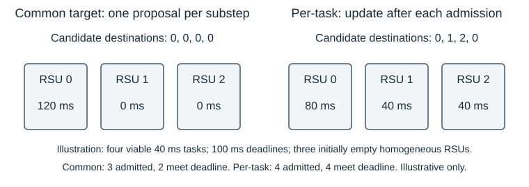
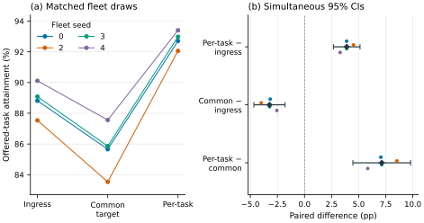

# TrafficTwin: Admission and Dispatch Semantics in Vehicular Edge Computing under a Frozen MAPPO Policy

S M Abdulla Al Mamun  
The University of Manchester  
Master's dissertation — substantive revision for author review, 8 September 2026  
Supervisor: Dr Sandra Sampaio

This draft uses evidence baseline `04f3b6a95c7bc06c80ed95b54762f12861bba183`. The September starting draft and historical August manuscript are preserved separately. Programme title, student identifier and submission declarations require author confirmation; they are listed in the accompanying [author-review record](AUTHOR_INPUTS.md) rather than represented as completed declarations here.

## Abstract

Vehicular edge computing requires decisions about whether to accept offloaded tasks and where to execute them. These decisions can alter measured performance even when the vehicle policy is unchanged. This dissertation studies infrastructure admission and roadside-unit (RSU) dispatch in a trace-driven simulator using a frozen multi-agent proximal policy optimisation actor. The contribution is an implementation comparison and explanation, not a new learning or scheduling family.

Source inspection and recorded accounting checks distinguish offered tasks, admitted work and deadline success, while identifying a legacy scoring limitation. A five-draw capacity study remains inconclusive when compute service is fixed. The subsequent comparison holds the backlog admission rule constant and contrasts strongest-link ingress execution, one common least-workload destination per task substep, and sequential placement with immediate admitted-work reservations.

Across four matched incident fleet draws, common-target placement falls 2.122 percentage points below ingress, whereas an adaptive per-task extension exceeds ingress by 0.527 points. A separately declared morning replication excludes its inspected pilot and uses four new draws. Corresponding differences are −3.232 and +3.899 points, with simultaneous intervals supporting both directions. The practical per-task gains are approximately 53 and 390 additional deadline successes per 10,000 offered tasks, respectively. Scenario differences prevent attribution of the larger morning effect solely to traffic density.

A post-hoc audit explains repeated use of RSUs 0–4 through five shared-target decisions, empty batch starts and deterministic ties. Recorded targets, reconstructed workloads and source-based deductions are distinguished; they do not establish a complete counterfactual performance explanation. Single-draw report-age and fixed-forwarding-cost sensitivities qualify information assumptions. The results show that precise dispatch and reconciliation semantics can reverse scheduler rankings within this evaluator. Global service-work knowledge, aggregate queue timing and limited replication restrict physical deployment and broader generalisation claims.

## 1. Introduction

### 1.1 Problem and motivation

A vehicle with a computational task can process it locally, send it to another vehicle, or enter roadside infrastructure. Each option combines communication and computation differently. A strong radio connection may reach a busy server; an idle server may require an additional transfer; accepting a task may consume resources without completing it before its deadline. Mobile edge computing consequently couples radio and computational resource management, as organised in Mao et al.'s survey [[1]](#ref-1). For an evaluation, the practical question is which part of that coupled system caused an observed improvement.

TrafficTwin addresses this question through a trace-driven vehicular edge computing (VEC) evaluator and an evidence-oriented software artifact. The evaluator reuses an existing trained MAPPO vehicle policy. Its three actions are Local, vehicle-to-infrastructure (V2I) and vehicle-to-vehicle (V2V). The actor does not select an exact RSU. The environment identifies a radio ingress, and infrastructure logic determines where an admitted V2I task executes. Holding the actor fixed makes this downstream layer experimentally accessible without introducing a new learning algorithm or retraining confound [[S4]](#source-s4).

The initial question concerned queue capacity: a larger waiting room can retain more work without producing more on-time completions. Comparisons therefore require every offered task to be accounted for, with admission distinguished from deadline success. These requirements motivated E0 validation and offered-task deadline attainment as the primary outcome [[S0]](#source-s0).

A second problem emerged when two least-busy implementations produced opposite rankings against ingress execution. One chose a shared destination for a group; the other reconsidered after each admitted reservation. Both used workload information and the same gate predicate, yet generated different queues. Their operational semantics therefore became central to the research question.

### 1.2 Related work and the position of this study

The closest intellectual comparison is task dispatch to parallel servers, particularly the information used to estimate waiting time and the point at which an assignment changes that information. RL supplies the upstream policy, but it does not define the downstream scheduling problem. The following synthesis positions the completed experiments retrospectively: these papers were newly inspected during manuscript revision and are not presented as having guided the historical experiments.

**Queue count and remaining work.** Shortest-queue dispatch compares numbers of jobs; shortest-workload dispatch compares their outstanding service requirements. With heterogeneous task sizes, these orderings can disagree. Harchol-Balter, Crovella and Murta explicitly study dynamic least-work-remaining assignment when service demand is known, alongside random, round-robin and size-based assignment. Their model assumes immediate per-arrival assignment, identical hosts, non-preemptive first-come-first-served service and Poisson arrivals. Their analysis shows that preferred assignment policies depend on task-size variability [[2]](#ref-2). Consequently, neither choosing the least workload nor achieving balanced allocation establishes universal optimality. TrafficTwin's inherited `jsq` name is misleading if read literally: the implemented selector compares service milliseconds, while a separate task count enforces finite admission capacity.

**Batch decisions and reservations.** Batching does not inherently imply sending a batch to one server. Sparrow pools probes across a parallel job and spreads its tasks over selected workers; late binding queues reservations and assigns tasks when workers become ready. Its discussion identifies both queue-count prediction errors and races between schedulers using apparently idle workers [[9]](#ref-9). This distinguishes two issues that a generic “batch versus per-task” description would conflate: sharing information across candidates can help, whereas committing many assignments against one unchanged destination can concentrate work. TrafficTwin evaluates the latter implementation. Its immediate service-work reservation is also different from Sparrow's worker-triggered task binding: TrafficTwin assumes the necessary information and acknowledgement are already available.

Ying, Srikant and Kang make the reservation distinction especially explicit: batch-filling samples queue counts, assigns tasks one by one and updates the chosen queue after each assignment. Their analysis assumes identical servers, exponential service, Poisson batch arrivals and random ties [[13]](#ref-13). This is close prior art for sequential within-batch updates. Although the evaluator comments mention their batch-filling work, its common-target reconciliation does not implement that destination rule. TrafficTwin's causal change is therefore an adaptation of established dispatch semantics, evaluated with workload information and deadline admission, rather than a novel batching principle.

**Local information and common destinations.** Vargaftik, Keslassy and Orda's Local Shortest Queue (LSQ) policies maintain possibly outdated queue-count estimates at multiple dispatchers. Their slotted model can send all jobs arriving at one dispatcher in a slot to one locally shortest queue, with random tie-breaking. Algorithms update local estimates by the jobs sent and refresh selected entries through communication. Their stability result requires stated arrival/service assumptions and bounded expected estimation error [[10]](#ref-10). This is particularly useful counterevidence to an overbroad novelty claim: common destinations and local updates both predate TrafficTwin. What differs here is service-work information, deterministic index ties, a backlog gate, five ordered task slots and one-second aggregate draining. Neither the LSQ stability theorem nor its distributed communication results transfer directly to these finite-horizon deadline outcomes.

**Admission and useful completion.** Niño-Mora jointly studies admission and routing to heterogeneous multiserver queues, charging separately for rejection and admitted deadline misses. The model uses Poisson arrivals, exponential service, soft deadlines and state-dependent index policies; admitted late jobs remain until completion [[11]](#ref-11). This establishes admission as an optimisation decision with consequences beyond the admitted population. TrafficTwin instead preserves a simple inherited backlog filter to make the placement contrast interpretable. The gate does not estimate the complete response time or promise success. Counting successes over all offered tasks makes a reject-all policy score zero and prevents selective admission from concealing failures. That denominator is a deliberate measurement choice, not a newly invented admission algorithm.

Table 1 locates the comparison along operational dimensions. The papers identify relevant mechanisms and alternatives; they are not external benchmark arms. Their arrival processes, objectives and resource models differ too much for published performance percentages to be compared as controlled results.

*Table 1. Closest-work comparison. “Work” means remaining service demand; “count” means queued jobs. TrafficTwin rows describe the frozen implementation, not a scheduling-family definition.*

| Work / decision layer and arrivals | Information and update semantics | Admission / objective | Relationship to TrafficTwin |
|---|---|---|---|
| Harchol-Balter et al. [2]: dispatch each arrival | Known service work; central per-arrival choice | FCFS response time and slowdown | Closest least-workload comparator; no vehicular gate |
| Sparrow [9]: parallel-job task placement | Sampled workers; queued reservations; worker replies bind tasks | Job response time; placement constraints | Batch spreading differs from one common destination; communication is explicit |
| Ying et al. [13]: tasks within an arriving batch | Sampled counts; update after each assignment; random ties | Delay and sampling cost | Closest within-batch update rule; no deadline gate |
| LSQ [10]: dispatcher batch per time slot | Local queue counts; own-assignment increments and sampled/pushed updates | Stability under specified assumptions | Common routing is established; random ties and distributed estimates differ |
| Niño-Mora [11]: joint admission/routing per arrival | Queue counts and model-based indices | Rejection and deadline-miss costs | Supports joint evaluation, not the inherited backlog predicate |
| TrafficTwin common-target: one choice per substep | Global service work; vectorised candidate offsets and three reconciliations | Backlog gate plus finite task limit | Frozen vehicle policy; instantaneous logical forwarding |
| TrafficTwin per-task: ordered candidate scan | Global service work; actual admitted work reserved immediately | Same predicate and limit, causal admission | Tested implementation change; global information is assumed |

**Attribution and simulation validity.** Sargent distinguishes verification of a computer model from operational validation for its intended application [[12]](#ref-12). TrafficTwin's conservation and replay checks primarily establish the former; observed physical RSU service and network measurements would be needed for stronger deployment claims. SUMO supplies a microscopic simulation framework [[8]](#ref-8), but importing its trajectories does not independently validate a coupled radio/computing model. This distinction explains why a source-correct result can be scientifically useful while remaining conditional on simulation semantics.

PPO and MAPPO remain relevant as provenance of the reused actor [[3]](#ref-3), [[4]](#ref-4). They do not show that this checkpoint is optimal, that it learns an execution destination, or that freezing weights guarantees identical actions under changed observations. The actual input/action agreement checks therefore matter. Henderson et al. and Agarwal et al. motivate reporting variation and finite-run uncertainty [[5]](#ref-5), [[6]](#ref-6); Gorsane et al. emphasise exposing implementation choices and the source of improvement in cooperative MARL evaluation [[7]](#ref-7). Here the independent unit is a fleet draw, not a training run or individual task. Those papers support careful reporting, rather than authorising a particular small-sample distributional assumption.

The resulting contribution is an implementation study at a defined control boundary. Established scheduling ideas are used to resolve an attribution problem in an inherited VEC evaluator: a combined placement/admission improvement initially obscured a weaker placement implementation. Gate-held comparisons, explicit reconciliation semantics and replication then revealed opposite rankings against ingress execution. The comparison is worth studying because a plausible scheduler label and favourable workload balance were insufficient to predict deadline attainment. It adds empirical discrimination and a conditional mechanism explanation within TrafficTwin, without claiming a new scheduler family or proving that all common-target policies are inferior.

### 1.3 Aim, research questions and contribution

The aim is to determine whether deterministic infrastructure-side RSU load management improves offered-task deadline attainment under a frozen vehicle policy, and to establish which claims the available evidence can support. The questions developed with the programme; the morning replication questions and analysis were declared before its new outcomes, while the mechanism audit was explicitly post-hoc.

**RQ1 — Measurement and capacity.** After repairing task accounting, does increasing the RSU waiting-room limit at fixed compute service improve offered-task deadline attainment? This question requires correct rejection handling and conservation before any performance interpretation.

**RQ2 — Admission and dispatch semantics.** Under matched inputs and the inherited workload-based admission rule, how do ingress execution, common-target least-busy placement and sequential per-task least-busy placement compare in the incident scenario? The distinction concerns the implemented decision process, including its reconciliation semantics.

**RQ3 — Replication and mechanism.** Does the incident ordering recur across newly declared fleet draws in the morning scenario, and what recorded or reconstructable behaviour explains the common-target scheduler's repeatedly selected RSU identities? The replication and the subsequent explanatory audit have different evidential roles.

**RQ4 — Bounded sensitivities.** Within one incident fleet draw, how do aged placement-workload reports and a fixed forwarding overhead affect the comparison? These studies test specific model assumptions descriptively, without establishing population-level robustness or a physical backhaul design.

The contributions are a source-audited evaluation foundation with recorded accounting checks; a controlled decomposition of queue capacity, admission and placement; an implementation-dependent incident ranking reversal; a three-arm replication excluding an inspected pilot; and a mechanism audit separating recorded observations from reconstructed intermediate states. The accompanying TrafficTwin artifact preserves evidence identity and makes these distinctions reviewable. Its value lies in connecting a performance claim to a particular executable model and experiment, rather than presenting a dashboard value without provenance [[S11]](#source-s11).

### 1.4 Scope and report structure

The study uses one actor, a provisional fleet model and two Manchester traces. It neither retrains the policy nor learns V2V neighbours, deploys infrastructure or models packet-level inter-RSU forwarding. The optional resource-scaling campaign remains unexecuted and separate from these completed follow-ups. Section 2 specifies the model and inferential design; Section 3 evaluates results and technical achievement; Section 4 answers the questions and prioritises future work. Appendix A identifies project evidence separately from scholarly references.

## 2. Methodology

### 2.1 Research design and evidence hierarchy

The design combines controlled simulator experiments with implementation validation and a subsequent read-only mechanism audit. A frozen policy permits downstream interventions under matched traffic, fleet and task inputs. This is suitable for attributing differences within the evaluator because it limits changes to defined infrastructure conditions. Retraining a policy for each condition would answer a different question about adaptation and would combine training variation with placement effects. Conversely, treating the whole system as a black box would conceal whether a change arose from admission or execution assignment.

Evidence progresses from validation to exploratory comparisons and then matched replication. This sequence is not presented as one prospectively registered programme: observations from earlier stages informed later questions. E2c excludes the seed used to discover its hypothesis; the morning replication separately excludes its already inspected pilot. Frozen source, manifests and accepted records determine experimental meaning. Reports summarise those records, while implementation correspondence helps clarify intended behaviour. Product diagrams and literature do not override executable experimental semantics [[S0]](#source-s0)–[[S8]](#source-s8).

### 2.2 Architecture and information boundaries

Figure 1 separates three decisions. The actor chooses an offloading mode; the environment chooses a communication target; the infrastructure chooses an execution RSU and applies admission. For V2I, the ingress is the RSU with the strongest current simulated radio link. In ingress execution, it is also the execution node. In load-balancing arms, the radio ingress remains fixed while execution may move elsewhere. A selected target is only a proposal until the task passes the live admission checks [[S4]](#source-s4).


*Figure 1. Experimental responsibility boundaries. Only admitted V2I work enters the selected execution queue; logical forwarding applies when ingress and execution differ. Resource scaling is outside the completed comparison.*

The checkpoint uses a 17-dimensional observation comprising task descriptors, vehicle load and queue summaries, state of charge, link-quality summaries, nearby compute availability, a task-presence flag, vehicle compute tier, an electric-vehicle flag and the observed V2V target's compute tier. It does not receive the current RSU workload vector. MAPPO consequently cannot directly implement the infrastructure's least-workload rule through its action space. The actor observes a separately sampled task descriptor and selects one mode per active vehicle per second. That mode is reused for independently sampled operational tasks whose descriptors replace the observation task during processing. This inherited convention limits claims about task-conditioned policy quality; matched infrastructure comparisons retain the same convention.

V2V target selection is environmental: exclude the source and peers whose queues are full, then select the remaining strongest instantaneous simulated link. Distance contributes to link quality, but fading also contributes; this is not simply nearest-neighbour selection. Peer workload and capability affect latency after selection, while capability is not itself the target-ranking criterion. Observation and operational link calculations use separate fading samples. The correspondence confirms this and the per-vehicle-second decision convention as intended inherited behaviour, not an accidental change introduced by the placement study [[S4]](#source-s4).

### 2.3 Scenarios, actor and controlled inputs

Table 2 identifies the two scenarios. Traffic positions are imported from saved traces; the evaluator does not rerun SUMO during each scheduling comparison. The morning input audit reconstructs the canonical trace arrays from their source records and checks entry markers and slot assignment. This matters because padded array slots are not necessarily permanent vehicle identities. On morning vehicle entry, the recorded convention resets vehicle queues for the new visit; state of charge is not reset by that queue operation. The incident trace retains its earlier convention without the same entry channel [[S7]](#source-s7).

*Table 2. Scenario identity and fixed placement controls. Differences between scenarios are retained and documented, not treated as a single-factor intervention.*

| Setting | Incident scenario | Morning scenario |
|---|---|---|
| Date and local window | 15 March 2024, 20:00–21:00 | 15 October 2024, 08:00–11:00 |
| One-second steps | 3,600 | 10,800 |
| Padded vehicle slots | 2,488 | 215 |
| RSUs | 10 | 9 |
| SUMO seed | 43 | 42 |
| Vehicle queue convention | Conserved, legacy trace convention | Conserved, canonical per-visit reset |
| Placement-study RSU limit | 6,220 tasks per RSU | 6,220 tasks per RSU |
| Service / forwarding / scaling | 1× / 0 ms / off | 1× / 0 ms / off |

The same one-hot-17 MAPPO checkpoint, identified by its archived hash, is retained throughout. Its inherited training provenance is Model C with synthetic mobility, 128 environments, learning rate 0.003 and training seed 100. Those facts identify the input artifact; they are not a training reproduction performed here. The provisional UK2030 fleet preset samples RPi-, Jetson- and GPU-vehicle tiers with probabilities (0.40, 0.35, 0.25), and electric-vehicle status with probability 0.22. These are modelling assumptions, not measured Manchester fleet shares. Fleet seeds vary between replicates, while evaluator seed 0 remains fixed. Thus the estimand concerns fleet variability conditional on the actor and scenario, not uncertainty over training or traffic generation.

Each active vehicle offers min(Poisson(1.5), 5) tasks per second; inactive slots offer none. Operational task types are independently sampled with probabilities (0.20, 0.30, 0.50). Types 1–3 have deadlines (100, 500, 100) ms, mean input sizes (1, 0.0012, 0.001) MB and workloads (1,254, 2,100, 15) million cycles. Input sizes multiply their type mean by an independent uniform 0.8–1.2 factor. The five-slot cap changes offered work as well as scheduling opportunities [[S4]](#source-s4).

For homogeneous RSUs, service milliseconds are s = ξ × C_t / [2.2 × 1.5 × min(12, p_t) × 0.9 × min(5, g_t)], where C_t is million cycles, p_t = (4, 4, 2), g_t = (40, 5, 1), and ξ is uniform on 0.9–1.1. The denominator uses 2.2 GHz, 1.5 instructions per cycle, effective cores, utilisation and capped GPU acceleration. Million-cycle/GHz conversion yields milliseconds. Before noise, services are approximately (21.111, 35.354, 2.525) ms. All placement arms use service multiplier 1.

An absolute capacity setting is essential across traces. The incident ratio of 2.5 times padded fleet width resolves to 6,220 tasks per RSU. Reusing that ratio on the smaller morning trace would produce a 538-task limit. The morning protocol instead explicitly fixes 6,220, avoiding an unintended queue-limit intervention. It still cannot make the two scenarios identical: density, duration, layout, RSU count and entry conventions differ.

### 2.4 Time, queues, admission and outcomes

A batch advances simulated time by one second. Five internal task substeps order admissions; they are not five 200 ms clock advances. Work accumulates across them before one service drain. Let W[r] denote remaining service milliseconds at RSU r, Q[r] its aggregate task count and C the task limit. These variables serve different purposes: identical counts can represent different work, and increasing C does not accelerate service [[S4]](#source-s4).

For each offered task i, let a[i] indicate admission, y[i] indicate the recorded deadline success, and z[i,c] indicate terminal failure category c. The intended accounting contract requires one admission or failure and no success for rejected work. The per-run primary outcome and validation requirements are:

**(1)** A = N_met / N_offered = Σ y[i] / N_offered; reported percentage = 100A.

**(2)** a[i] + Σ z[i,c] = 1; y[i] ≤ a[i]; N_offered = N_admitted + N_failed.

Here N_failed includes both rejection and unavailability. Categories distinguish local queue rejection, V2V queue rejection or unavailability, and V2I unavailability, backlog-gate rejection or capacity rejection. Gate failure takes precedence over capacity failure when both apply. Selected targets are proposals; rejected tasks neither execute nor reserve work (Figure 2). Admitted attainment uses N_admitted instead, so must not replace Equation (1). Offered, admitted and successful-task latency means similarly have different populations.


*Figure 2. Offered tasks remain in the primary denominator. Admission, execution assignment and deadline outcome are separate fields; selecting an RSU does not establish that work executed there.*

The inherited gate tests existing effective workload, including the candidate offset O[i], against deadline D[i]:

**(3)** W[r] + O[i] < D[i], together with an available task-count place.

The inequality is strict. It excludes the candidate's service, radio transfer and forwarding cost, and therefore is a backlog filter rather than an end-to-end feasibility guarantee. Candidate ordering and offsets differ between algorithms (§2.5). Admission uses positive ingress link quality as its coarse radio condition; the latency model additionally requires quality at least 0.15 for a usable transmission. Consequently, admission can still lead to a transmission-related deadline miss.

For viable V2I execution, the modelled response latency is:

**(4)** L_raw[i] = T(input[i], q, c) + W[r] + O[i] + s[i,r] + T(0.001, q, c) + f · 1(r ≠ ingress[i]).

T(b,q,c) is 0.1 + 1,000 × 8b/c milliseconds for q ≥ 0.15 and capacity c > 0.000000001 Mbps, with b in MB; otherwise it uses a 10⁹ ms failure value (up to the 0.1 ms propagation addition). The 0.001 MB return term reuses the ingress quality and capacity. It is not a separately simulated downlink or inter-RSU route. The fixed forwarding charge f is added once. Local latency is vehicle backlog plus local service; V2V adds input/return transfers on the selected peer link, peer backlog, preceding local/V2V reservations and peer service. Service s derives from task cycles, device frequency, parallelism, utilisation and acceleration, with a sampled 0.9–1.1 multiplier. The placement code reserves the same sampled work used for latency: exact service knowledge is a declared information assumption.

The gate-enabled placement paths pass final admission into latency scoring, giving rejected tasks sentinel latency. Historical `off` instead passes the earlier coarse eligibility mask while enqueueing uses refined admission. An in-substep capacity rejection therefore need not receive the sentinel in that path. Section 3.1 distinguishes recorded validation from this implementation limitation; no historical false-success discrepancy is established. The final mapping is L[i] = 10D[i] when L_raw[i] ≥ 10⁸ ms, and L[i] = L_raw[i] otherwise. This replaces sentinel failures, without clipping every finite latency. Deadline attainment uses L[i] ≤ D[i], inclusively.

For each queue over an interval, work accounting requires:

**(5)** W_initial + Σ admitted service = Σ served service + W_final.

After the fifth substep, S[r] = min(W_post[r], 1,000) is served and W_next[r] = W_post[r] − S[r]. If this empties the queue, its task count becomes zero. Otherwise the evaluator subtracts floor(Q_post[r] × S[r]/W_post[r]), retaining at least one task while positive work remains. This aggregate carry approximation has no individual departure-event model. Equation (5) checks the declared dynamics, not their physical calibration.

### 2.5 Placement algorithms and their implementation

Table 3 separates execution destination from the gate switch. The identifier `jsq` actually selects least service workload, not shortest task count. `dla` combines this common-target selector with Equation (3); these inherited names do not define canonical scheduling algorithms [[S2]](#source-s2), [[S4]](#source-s4).

*Table 3. Infrastructure conditions. All retain strongest-link radio ingress. “Live” eligibility is refreshed at each substep; the historical off mode retains step-entry coarse eligibility.*

| Mode | Execution destination | Backlog gate | Coarse eligibility |
|---|---|---|---|
| `off` | Ingress | Off | Step entry |
| `jsq` | Common least-workload target | Off | Live |
| `ingress_dla` | Ingress | On | Live |
| `dla` | Common least-workload target | On | Live |
| `per_task_dla` | Causal least-workload target | On | Live |

Both placement algorithms below operate once per task substep, using its entry state W, Q. Index i follows ascending padded-vehicle order, not arrival-time or deadline priority. Each candidate has actual service s[i,r], deadline D[i] and a fixed actor action and radio ingress. Every argmin considers all RSUs and breaks ties by lowest index; a full selected RSU is rejected rather than excluded and retried elsewhere.

For common-target reconciliation, let E[i] mean active V2I attempt, positive ingress quality and Q[r[i]] < C at substep entry. For an admission mask M, define O[i,M] as the sum of s[j,r[i]] over earlier j < i with the same target and M[j] true; H[i,M] is their count. Offsets are exclusive: a candidate's own service is omitted. Algorithm 1 follows the frozen implementation's three simultaneous replacements, without claiming convergence.

```text
Algorithm 1: common-target placement with gate (one substep)
r[i] = lowest-index argmin(W), shared by all candidates
M = E
repeat exactly three times:
    compute O[i,M] and H[i,M] from the previous whole mask
    M_new[i] = E[i] and (W[r[i]] + O[i,M] < D[i])
                       and (H[i,M] < C - Q[r[i]])
    M = M_new simultaneously
recompute final offsets O[i,M] for latency
label E-candidates failing the final workload test as gate failures
label remaining E-candidates excluded by M as capacity failures
commit each M-admitted task and its full service once
unavailable or rejected tasks reserve nothing
```

Target selection never changes during reconciliation. The final admission mask and the offsets recomputed from it determine the recorded processing; three passes are an implementation constant, not a proof of a fixed point. Ingress with the gate uses the same offset/reconciliation machinery with individual ingress targets instead of the common argmin. Gate-off modes omit the workload test.

```text
Algorithm 2: causal per-task placement with gate (one substep)
repeat exactly three complete passes:
    working_W = W; working_Q = Q       # restart, not cumulative
    for i in ascending padded-vehicle order:
        r[i] = lowest-index argmin(working_W)
        O[i] = working_W[r[i]] - W[r[i]]
        require active V2I, positive quality and Q[r[i]] < C
        test working_W[r[i]] < D[i], then working_Q[r[i]] < C
        if admitted:
            working_W[r[i]] += s[i,r[i]]
            working_Q[r[i]] += 1
        otherwise label failure; reserve nothing
retain the last pass; commit its admitted work once
```

The causal gate and capacity see earlier admissions immediately. Repeated passes begin from identical initial state and reproduce the same decisions; they do not triple reservations. Physical queue arrays receive the final result once, before the next substep. Both algorithms drain service only after all five substeps. Thus the comparison changes selection frequency, reservation visibility and reconciliation semantics; it is not an isolated change to argmin frequency.

For an illustrative scheduling calculation, assume three empty identical RSUs, four viable 40 ms tasks with 100 ms deadlines, nonbinding capacity and negligible communication. Common-target chooses RSU 0; its masks settle at three admissions and one gate rejection. The admitted offsets are 0, 40 and 80 ms, leaving 120, 0, 0 ms: the third admitted task misses its deadline despite passing the backlog gate. Per-task selects 0, 1, 2, 0, leaves 80, 40, 40 ms and all four meet deadlines under these assumptions. Figure 3 depicts the proposals. This constructed example explains mechanics; it is neither a recorded task group nor an estimate of recoverable historical failures.



*Figure 3. Four illustrative proposals. The common destination remains fixed through reconciliation; causal placement updates after admissions. The accompanying worked example states admissions and deadline outcomes under deliberately simplified assumptions.*

### 2.6 Experimental progression and inference

E0 validates recorded accounting before performance analysis. E1 compares three queue limits at fixed service across five matched fleet draws. E2 and E2b are exploratory single-draw studies separating placement and admission. E2c evaluates common-target against ingress on four new incident draws, seeds 1–4. E2d is an adaptive extension after inspecting E2c: it adds per-task placement on those previously examined draws and reuses the exact controls. They are not new independent observations [[S0]](#source-s0)–[[S3]](#source-s3).

The morning pilot uses seed 1 for ingress and per-task placement. After inspecting it, the replication declares seeds 0, 2, 3 and 4 and all three arms, yielding twelve new full runs. The primary contrasts are per-task minus ingress, common-target minus ingress, and per-task minus common-target. The pilot is excluded; a supplementary two-arm five-draw summary is descriptive. The local protocol and manifest preceded the new outcomes, but there was no external preregistration [[S7]](#source-s7), [[S8]](#source-s8).

For each contrast, a fleet draw supplies one paired difference in percentage points. Draws receive equal weight. The mean difference has a Student-t interval, mean ± t × sample standard deviation / square root of n. Incident E2c/E2d retain their reported individual 95% intervals. The morning protocol additionally uses Bonferroni simultaneous intervals for three contrasts, with critical value t at probability 1 − 0.05/(2 × 3), three degrees of freedom. Its reversal criterion requires the simultaneous common-target-minus-ingress interval below zero and the per-task-minus-ingress interval above zero. Four draws cannot strongly diagnose distributional assumptions; these small-sample intervals remain conditional parametric summaries, not task-level significance tests.

### 2.7 Sensitivities, mechanism audit and validation

The state-information pilot uses incident fleet seed 1 and delays of 0, 100, 500 and 1,000 ms, alongside ingress. Only placement workload reports are aged; admission uses actual queues with immediate acknowledgements. If B is the previous batch's post-admission workload, a positive delay d supplies max(B − (1,000 − d), 0). This explicitly adds a continuous-service interpretation between batches without redistributing task arrivals. Current-batch admitted reservations are added immediately to the placement view. Startup has no history and uses live state with recorded age zero [[S5]](#source-s5).

The forwarding study adds fixed costs of 1, 2.5, 5 and 10 ms to admitted forwarded tasks' modelled latency. Four direct ten-step probes qualify a transformation of saved full-run records because these charges do not affect admission, queues or actions in the frozen model. No full positive-cost simulations were run. The study cannot represent backhaul congestion, topology, migration protocols or delayed task arrival. Ambiguous penalty-equal latencies are not invented to compute a new mean [[S6]](#source-s6).

The five-RSU audit reads the four saved morning common-target runs. It checks per-second targets and queue endpoints, reconstructs intermediate admitted service work, and compares the resulting minima with frozen tie-breaking logic. It is post-hoc and launches no simulations. The proposed rotating-tie-break prefix test remains unrun [[S9]](#source-s9), [[S10]](#source-s10).

Execution validation checks input/source identity, finite values, exclusive outcomes, matched fleet/task/action/ingress streams, conservation and probe-to-full-prefix agreement. All twelve morning 300-step probes preceded their full runs. Stop rules concerned invalidity, drift, errors, storage and timeouts, never an unfavourable effect. Historical passing tests qualify particular cases; they do not constitute replication of whole campaigns.

Compatibility checks compare parent and zero-delay output shapes, types, bytes and scientific summary fields, excluding runtime. Treatment checks instead test positive report ages, report construction and conservation: a changed treatment need not reproduce parent outputs. These serve different purposes, and the full studies retain their own recorded validation.

## 3. Evaluation and Reflection

### 3.1 Accounting validity and the capacity question

E0 addressed a concrete mismatch between task scoring and queue admission. In the legacy clamp path, the evaluator scored eligible V2I tasks and multiplied their combined service work by the fraction fitting the task-count ceiling. Surplus tasks were not individually identified in earlier scoring. The 5 August repair introduced per-task admission/rejection and full enqueueing of admitted work. Source history credits Randy's implementation and Abdulla's motivating accounting analysis; E0 qualified recorded accounting in that configuration [[S0]](#source-s0), [[S12]](#source-s12).

An illustrative reconstruction shows why the distinction matters. Suppose one queue place remains and two otherwise viable candidates each require 40 ms. Legacy fractional enqueue adds (1/2) × 80 = 40 ms, yet both candidates can remain in the previously scored population. The queue represents only half their combined demand. Corrected reject-mode admission accepts one candidate in the declared order, rejects the other, enqueues the accepted 40 ms in full and gives the rejected task a failure outcome. These are explanatory numbers, not a historical measured task pair. With unequal service times, fractional enqueue can additionally differ from the work of the particular task actually admitted.

The relevant invariant is that offered tasks partition into admitted and declared failed attempts, and rejected tasks do not execute. E0's validator cross-checks active records, terminal categories and summary counts. Its archived regression fixture changes offered count from two to three without adding a record and requires failure; another changes offered vehicle work from 10 to 11 ms against an 8 + 2 ms partition. However, summary work partition alone is weak evidence of dynamics because rejected work is calculated as offered minus admitted. Later independent reconstruction checks enqueue, drain and endpoints directly.

The smoke/full references passed their recorded checks, including agreement of deadline flags with successful outcomes. This does not prove universal scoring correctness: source inspection found the `off` mask exception in §2.4 in the actual E0/E1 revision. E0 recorded 834,120 capacity rejections, so admission rejection occurred, but existing receipts do not establish a resulting false success or quantify a latency error. Historical results are retained, with their implementation scope made explicit. No defective-versus-repaired performance effect or physical validation is claimed.

E1 then varied waiting-room capacity across five matched draws. The mean offered-attainment difference for 99,520 versus 1,866 tasks per RSU was −0.01094 percentage points, with a 95% interval from −0.02465 to +0.00276 points. The interval includes zero. RQ1 therefore has an inconclusive performance answer at this replication size: larger capacity did not establish an improvement, but the study also did not establish equivalence or a statistically supported degradation [[S1]](#source-s1).

Secondary outcomes explain why admission cannot stand in for useful service. Increasing the limit admitted more tasks and reduced rejection, yet mean admitted latency rose from approximately 3.77 seconds at the lowest capacity to 12.19 seconds at the middle setting and 132.49 seconds at the highest. Admitted-task attainment also declined. These quantities describe the accepted population and should not be read as contradictory to the small, inconclusive primary difference. The additional waiting-room space can retain work that does not become additional on-time service.

E1 redirected the study toward allocating existing service. Placement could be investigated with service and capacity fixed; compute scaling would change the service budget. The inconclusive result motivates the next question without being recast as equivalence.

### 3.2 From admission decomposition to the incident reversal

E2's exploratory seed-0 comparison showed offered attainment of approximately 68.362% for strongest-link execution without the deadline gate, 67.568% for inherited least-busy placement without the gate, and 69.494% for inherited least-busy placement with the gate. The last comparison changed both placement and admission relative to the strongest-link reference. Its improvement could not establish that load balancing itself helped [[S2]](#source-s2).

E2b added ingress execution with the same deadline gate, reaching approximately 71.577%. The strongest-link contrast was +3.215 points and the common-target contrast +1.926 points, giving an interaction of −1.290 points. However, `off` uses step-entry coarse saturation eligibility while `ingress_dla` refreshes eligibility per substep. Their contrast and interaction bundle the gate with this timing difference and retain the legacy scoring-mask exception (§2.4). The manifest records 138 unavailable V2I attempts among 13,076,234 offered tasks in off; that count does not bound downstream effects. E2b identifies a stronger comparator without assigning its entire gain solely to the gate. Subsequent gate-held placement comparisons use live eligibility and refined scoring masks in all arms. In the exploratory draw, common-target remained 2.083 points below ingress with the gate.

E2c tested the common-target comparison on four new incident fleet draws, excluding discovery seed 0. Its mean difference from ingress was −2.122 points, with an individual 95% interval of [−2.234, −2.011]. All four paired differences were negative. Inspection then established that the inherited scheduler chose one common target per task substep. E2d introduced the causal per-task implementation under the same actor, trace, gate predicate, queue ceiling, service and forwarding controls. Table 4 retains all four draw-level results [[S3]](#source-s3).

*Table 4. Incident offered-task deadline attainment, expressed as percentages. E2d reused the exact E2c ingress and common-target controls; these are four paired draws, not separate sets of independent controls.*

| Fleet seed | Ingress | Common-target | Per-task | Per-task − ingress, pp |
|---|---:|---:|---:|---:|
| 1 | 72.003 | 69.794 | 72.467 | +0.464 |
| 2 | 70.369 | 68.317 | 70.956 | +0.587 |
| 3 | 70.298 | 68.153 | 70.805 | +0.507 |
| 4 | 70.887 | 68.805 | 71.438 | +0.551 |

Per-task placement exceeded ingress by a mean 0.527 points, with an individual 95% interval of [+0.442, +0.612]. Its secondary contrast with common-target was +2.649 points, interval [+2.621, +2.678]. RQ2 therefore has a conditional answer: common-target performed worse than ingress, whereas causal per-task placement performed better on those four draws. The intervals summarise an adaptive extension on examined draws; the morning protocol supplies stronger prospective replication. The actor was frozen and the intervention occurred in infrastructure logic.

The stronger ingress comparator determines the practical interpretation. Against mean ingress attainment of 70.889%, the +0.527-point gain represents about 53 additional on-time tasks per 10,000 offered, or a 0.744% relative increase in successes. These conversions are descriptive scales of the same mean contrast, not new inferential tests. The much larger +2.649-point contrast diagnoses an unfavourable common-target implementation; it should not be advertised as the gain over the stronger reference. Both workload-based implementations remain constrained by the backlog filter and the same communication model, so neither result establishes optimal dispatch.

### 3.3 Morning replication with the inspected pilot excluded

The morning pilot offered 1,744,116 tasks. Ingress achieved 91.075% attainment and per-task placement 94.028%, a difference of 2.953 points or 51,503 additional deadline successes in that draw. This favourable result motivated further work and was already inspected. It therefore remains exploratory; including it among supposedly unseen confirmation runs would misstate the sequence of evidence [[S7]](#source-s7).

The subsequent protocol declared four new fleet seeds and the common-target arm before their outcomes. Table 5 reports the resulting twelve full runs. Every draw follows the incident ordering, common-target below ingress below per-task. Mean attainment was 88.887%, 85.655% and 92.785% for ingress, common-target and per-task respectively. The lower primary-draw mean relative to the pilot illustrates why the pilot alone should not define the expected effect or baseline level [[S8]](#source-s8).

*Table 5. Morning primary replication. Seed 1 is absent because it was the inspected pilot; each row is a matched fleet draw on the same morning trace.*

| Fleet seed | Ingress, % | Common-target, % | Per-task, % | Per-task − ingress, pp |
|---|---:|---:|---:|---:|
| 0 | 88.817 | 85.660 | 92.705 | +3.888 |
| 2 | 87.536 | 83.537 | 92.060 | +4.524 |
| 3 | 89.082 | 85.862 | 92.978 | +3.896 |
| 4 | 90.113 | 87.559 | 93.399 | +3.286 |

The prespecified primary analysis in Table 6 accounts for the family of three contrasts. The simultaneous interval for per-task minus ingress is entirely positive, and that for common-target minus ingress entirely negative. The declared uncertainty-based reversal criterion is therefore met, beyond the descriptive observation that all four rows share an ordering. Figure 4 displays the archived primary replication results.

*Table 6. Morning paired contrasts in percentage points. Individual intervals are two-sided 95% Student-t intervals; simultaneous intervals use the prespecified three-contrast Bonferroni adjustment. The replication unit is the fleet draw, n = 4.*

| Contrast | Mean | Individual 95% interval | Simultaneous 95% interval |
|---|---:|---|---|
| Per-task − ingress | +3.899 | [+3.094, +4.703] | [+2.671, +5.126] |
| Common-target − ingress | −3.232 | [−4.176, −2.289] | [−4.672, −1.793] |
| Per-task − common-target | +7.131 | [+5.385, +8.877] | [+4.466, +9.795] |



*Figure 4. Redrawn from archived morning primary data. Left: within-draw attainment. Right: draw differences, mean diamonds and three-contrast Bonferroni intervals. The inspected pilot is excluded; uncertainty concerns four newly declared fleet draws, conditional on the frozen actor and morning scenario [[S8]](#source-s8).*

The supplementary five-draw ingress/per-task summary, which explicitly includes the pilot, has a descriptive mean difference of +3.709 points. It does not replace Table 6 or contribute to its intervals. No common-target result is invented for the pilot. This separation retains useful completed evidence without erasing the distinction between hypothesis generation and replication.

The morning gain over ingress is about 390 extra on-time tasks per 10,000 offered, a 4.386% relative increase over the 88.887% mean baseline. It is practically larger within this model than the incident gain. However, that contrast between scenarios is not a causal estimate of traffic density. The morning scenario changes RSU layout and count, date, duration, padded fleet width and entry conventions as well as operating conditions. The incident and morning analyses therefore remain separate. Together they support recurrence of the implementation-dependent ordering in two Manchester scenarios. They do not identify which scenario difference enlarged the effect, estimate a pooled Manchester-wide benefit or establish geographical generalisation.

### 3.4 Post-hoc explanation of the five-RSU pattern

Workload diagnostics revealed a striking morning contrast. Common-target admitted work used only RSUs 0–4, while per-task placement used all nine. Mean common-target workload shares were approximately 48.34%, 30.33%, 14.63%, 5.21% and 1.48% across those five RSUs, with zero work at RSUs 5–8. Per-task shares were close to one ninth each. Figure 5 is descriptive evidence of allocation, not proof that workload equality alone caused the attainment difference [[S8]](#source-s8).


*Figure 5. Admitted service-work distribution, redrawn from archived CSVs. Bars are means; whiskers are observed minima/maxima over four fleet draws, not confidence intervals. Aggregate shares motivated a separate post-hoc audit; they do not by themselves establish intermediate scheduling decisions or counterfactual task outcomes.*

The audit examined 43,200 recorded seconds and 216,000 task substeps across the four common-target runs. Every recorded end-of-second RSU workload and task count was zero, covering 388,800 RSU/second entries per field. Of 179,427 substeps with an observable V2I target, every one selected RSU k at substep k, with zero exceptions. The remaining 36,573 substeps had no recorded V2I attempt; their internal selector output is not treated as an observed measurement. The full-run union was five RSUs, but all five were used in only 15,803 individual seconds [[S9]](#source-s9).

Intermediate substep workloads were not directly saved for common-target. They were reconstructed from recorded admissions and execution destinations using the previously qualified service-work reference and frozen replay. Every saved endpoint matched exactly, but all-zero endpoints have limited power to distinguish intermediate states. The stronger combined support is the qualified service reference, recorded admissions, frozen enqueue semantics and agreement with every observable target's lowest-index workload minimum. Maximum reconstructed pre-drain workloads ranged from approximately 534.281 to 538.730 ms, below the 1,000 ms service interval; maximum task counts were 22–25, far below 6,220.

A conditional deduction from Algorithm 1 explains the concentration. With K substeps and R RSUs, at most min(K, R) distinct destinations receive new assignments in one batch: each substep contributes at most one target, so their union has at most K members. This bound does not require empty queues or a particular tie rule, and concerns new assignments rather than all work already present.

The repeated low-index prefix requires additional assumptions. At an empty batch start, lowest-index ties select RSU 0. Positive admitted work makes that RSU busier than untouched empty nodes; without intervening draining, the next productive substep selects the next empty index. Induction gives a prefix when R ≥ K; a substep adding no work does not advance it. Complete end-of-batch clearing restores the initial tie. The recorded endpoints and reconstructed maxima satisfy those conditions here. Without clearing or deterministic ties, the per-batch bound could still hold while the full-run union covered all nine RSUs. This is analysis of the stated model, not a universal theorem against batching.

The arrays recorded 511,684 deadline-gate rejections and zero RSU-capacity rejections. In the reconstructed state, every gate rejection occurred with at least five other RSUs idle and possessing spare admission capacity. This shows that unused infrastructure coexisted with rejection and that enlarging the waiting room would not address the observed bottleneck. It does not mean all 511,684 tasks could have met their deadlines elsewhere. Redistribution changes later workload and admission decisions, and another RSU's spare task capacity is not proof of end-to-end feasibility.

Candidate-level offsets and reconciliation masks were not saved. Thus the audit explains destinations without attributing the entire performance gap to the five-RSU mechanism. The proposed rotating-tie-break prefix test predicts changed identities but unchanged concentration, with outcome invariance conditional on homogeneous service and zero forwarding charges. It remains unrun [[S10]](#source-s10).

### 3.5 Bounded state-information and forwarding sensitivities

The incident state-information pilot supplies an important example of a nominal treatment that does not always change the information used. Fresh per-task placement achieved 72.46695% attainment in seed 1, compared with ingress at 72.00328%. The 100 ms condition exactly matched fresh outcomes. The 500 ms condition reached 72.46856%, while 1,000 ms reached 72.45510%. Relative to fresh, those latter differences are approximately +0.00161 and −0.01185 percentage points. They are descriptive outcomes from one draw, without a confidence interval or equivalence conclusion [[S5]](#source-s5).

The report-state audit explains the 100 ms equality. Across 35,990 non-startup RSU/batch observations, live batch-entry workload was zero and all 100 ms workload reports were identical to fresh. The queues had emptied before those capture times. In contrast, 500 ms reports differed from fresh in approximately 79.58% of observations, and 1,000 ms reports differed in all of them. Identical 100 ms performance therefore demonstrates an inactive workload-information perturbation in this setting; it does not show that communication delay is harmless.

The live admission model also matters. Even when placement uses an old workload report, the selected RSU checks its actual state, and successful reservations are acknowledged immediately into the current placement view. This protects against some effects of stale reports by construction. A controller with stale capacity information, delayed acknowledgements or dispersed arrivals would implement a different information system. The pilot answers RQ4 only for the defined report-age model and should not be promoted into a general conclusion about distributed infrastructure resilience.

The forwarding sensitivity similarly has a precise scope. At 0, 1, 2.5, 5 and 10 ms fixed overhead, per-task attainment was approximately 72.46695%, 72.44783%, 72.41882%, 72.37240% and 72.28579%. At the largest tested cost it remained 0.28251 points above ingress, corresponding to 36,942 additional deadline successes in that draw. The cost introduced 23,689 extra misses relative to zero forwarding overhead [[S6]](#source-s6).

These are full-record transformed outcomes qualified by four direct short probes, not four newly executed full simulations. The method is valid within the checked frozen accounting path because forwarding charges are applied after admission and do not feed back into queues or actions. It cannot predict effects of network congestion or arrival postponement. A further 104 forwarded tasks had penalty-equal latency ambiguity but were already deadline misses and remained misses under every non-negative cost. Their exact latency values were left unresolved; no reconstructed mean-latency claim depends on filling them in. The positive advantage at 10 ms is evidence at that grid point, not an estimated break-even threshold beyond it.

### 3.6 Technical achievement and attribution

The difficult engineering problem was preserving experimental meaning while exposing internal decisions. A selected RSU is not necessarily an executing RSU: gate rejection can leave a valid target proposal but no admitted work. Separate ingress, selected-target, actual-execution and forwarding fields made this distinction testable. The added path instrumentation was qualified against parent outputs before use. For per-task placement, the reservation uses the same service-time random subkey as execution; introducing an extra random draw would change workload as well as scheduling. Reusing the subkey and isolating the selector avoided that confound [[S4]](#source-s4).

Table 7 makes the allocation of work assessable without treating repository possession as proof of sole authorship. “Project contribution” denotes work evidenced within the candidate's project; personal unaided implementation cannot be established from Git alone. The correspondence documents Abdulla's analysis and supervisory engagement, while source history and agent records establish substantial supplied and assisted work [[S12]](#source-s12).

*Table 7. Component ownership and evidence. Attribution certainty concerns what the records establish, not a declaration of independent authorship.*

| Component | Inherited starting point | Candidate contribution (project record) | Validation evidence | Attribution certainty |
|---|---|---|---|---|
| Actor, environment and radio targets | Randy's trained actor and VEC model; PPO/MAPPO/JAX reused | Analyse control boundary; hold actor and inputs fixed | Randy's confirmations; actor/input/action checks | Supplied origin clear; no training contribution claimed |
| Accounting corrections | Randy's reject-mode, co-batch, vehicle-queue and lifecycle repairs | Accounting questions and clamp reconstruction credited to Abdulla; project E0 qualification | Commits 4cb7c06/0f01f4d; E0 records and negative fixtures | Requirements credit explicit; repair code supplied, unaided analysis unverified |
| Experimental design and analysis | Existing evaluator and traces | Capacity, admission/placement decomposition, paired replication and bounded follow-ups | Frozen manifests, exclusions, tables and correspondence | Project-level work clear; personal/AI allocation requires confirmation |
| Per-task selector | Common-target selector and three-pass evaluator | Causal selector, matching service reservations, compatibility validation | vec_env 2f63706; selector tests and production probes | Project change verified; Git author does not prove unaided coding |
| TrafficTwin evidence software | Python, typed models, Streamlit and existing infrastructure | Canonical evidence, provenance and reviewable comparison workflows | Source contracts, validation and release records | AI agent involvement recorded; individual component ownership unresolved |
| Dissertation revision | Preserved September manuscript and scientific archives | Author review and acceptance pending | Source, arithmetic and render checks | Substantive Codex-assisted research and drafting; no author approval inferred |

Canonical representations solve a different problem from numerical precision. Imported traces have padded slots, entry events and source-specific fields; treating slot indices as permanent vehicles could carry one visit's queue into another. Canonical entry markers and queue reset rules make that interpretation explicit. In the wider artifact, typed canonical records separate source parsing from deterministic metrics, while provenance links results back to inputs. The provenance model rejects edges referencing absent nodes, and canonical serialisation excludes volatile timestamps while retaining substantive fields. This permits stable comparison of equivalent evidence exports without confusing their generation time with scientific content [[S11]](#source-s11).

For example, the generic imported-bundle comparison retains accepted task rows' source file/row identities. A completion-rate difference traces to both eligibility ledgers: each completed row contributes its indicator divided by its own run's denominator, negative for baseline and positive for variation. Their sum must reconcile with the ordinary metric difference; disagreement returns an error. This exposes denominator changes without falsely matching task identities across runs. It is an implemented provenance capability, not a reanalysis of the VEC campaigns; SUMO/TOS adapters do not support that decomposition.

Two trade-offs are central. First, vectorised fixed-count reconciliation fits the inherited JAX execution path, but does not offer the transparent candidate-level causality of a scan. The per-task implementation gains that transparency while retaining repeated scans for compatibility, at the cost of redundant work and sequential dependence; no scheduler-runtime superiority is claimed. Second, retaining aggregate service-work and task-count carry makes the existing experiments tractable and comparable, but cannot reproduce individual completion events. A discrete-event redesign could improve temporal fidelity while changing the experimental model and requiring new qualification. Neither trade-off is resolved by counting tests or features.

The morning records provide concrete validation: fleet/task streams, actions and ingress matched within each seed, logits agreed within 0.00001, and full-run prefixes matched their probes. A separate reference calculation reproduced workload endpoints and task-count carry, with maximum accumulated work-balance discrepancy about 0.00174 ms. This is independent calculation within the project, not replication by another research group. It strengthens attribution to the defined infrastructure implementation, while Table 8 links remaining limits to the claims they restrict.

*Table 8. Validity limits and their consequences for interpretation.*

| Limitation | Claim restricted | Consequence / evidence needed |
|---|---|---|
| Batched arrivals, aggregate departures, backlog-only gate | Physical deadline feasibility | Interpret as evaluator outcomes; validate an event/transfer model against measurements |
| Global actual service work; immediate reservations | Distributed deployability | Measure estimation error and coordination delay before implementation claims |
| Four fleet draws, one actor/task seed per scenario | Population uncertainty and generalisation | Intervals condition on these controls; more independent draws and streams needed |
| Bundled scenario changes | Morning gain caused by lower density | Separate scenario analyses; factor-controlled evidence needed |
| Legacy off eligibility/scoring masks differ | Universal rejection-latency validity; gate-only E2b attribution | Recorded checks do not quantify mask effects; later gate-enabled arms use refined masks |
| Missing reconciliation masks; reconstructed intermediate work | Complete causal explanation or rescue count | Destination mechanism supported; counterfactual outcome attribution untested |
| Single-draw sensitivities | General staleness/forwarding robustness | Describe tested information and fixed-cost models only |
| Incomplete remote preservation and unresolved ownership | Unrestricted reproduction and individual achievement | Arrange marker access/backup and confirm component/AI attribution |

The archive contains compact results, source snapshots, figures and validation receipts, but 87 raw array files (about 1.76 GB) were recorded as local-only. Actor and trace hashes likewise do not back up their bytes. Private links are not automatically available to examiners. Before submission, an authorised evidence package or agreed access route must provide the required files and dependencies. This revision checks archived summaries and source semantics; it does not repeat the historical raw-array analyses.

## 4. Conclusion

This dissertation establishes an implementation-dependent ranking reversal under a frozen vehicle policy: common-target least-workload dispatch performed below ingress execution, whereas causal per-task placement performed above it in both Manchester scenarios. Its contribution is the controlled application and explanation of established workload and reservation ideas within an inherited evaluator, not a new scheduling family.

For RQ1, explicit rejection replaced fractional enqueueing. E0 checked the recorded population, while the legacy off scoring-mask exception prevents a universal correctness claim. Later workload reconstruction strengthened evidence about dynamics without physical calibration. Increasing task-count capacity at fixed service produced an inconclusive five-draw attainment difference despite more admissions and higher admitted latency. Larger waiting rooms did not establish additional useful service; equivalence remains unsupported.

For RQ2, the exploratory decomposition identified admission-enabled ingress as the stronger comparator. Its gate contrast retains eligibility/scoring differences, preventing gate-only attribution. Subsequent gate-held comparisons found common-target at −2.122 percentage points and per-task at +0.527 points relative to ingress across four incident draws; the per-task extension was adaptive. The gain against ingress is the practical improvement; the larger common-target contrast diagnoses that implementation. Matched inputs, actions and ingress support attribution to the defined infrastructure implementation.

For RQ3, four newly declared morning draws excluded the inspected pilot. Their +3.899-point per-task and −3.232-point common-target contrasts against ingress met the prespecified simultaneous-interval reversal criterion. This recurrence strengthens the finding without isolating density or establishing geographical generalisation. The post-hoc audit then explained the repeated RSUs 0–4 through the per-batch destination bound, empty starts, positive reservations and lowest-index ties. Observed targets and endpoints agree with reconstructed states, supporting the identity mechanism without attributing the full performance gap or counting recoverable tasks.

For RQ4, identical 100 ms workload reports made that treatment inactive. Older reports were tested with live admission and immediate acknowledgements, protections that restrict transfer to a distributed controller. Fixed forwarding charges reduced the per-task advantage but left it positive at 10 ms in one incident draw. Qualified saved-record transformations support that narrow result; they do not model congestion, task migration or delayed arrivals.

Admission/execution fields, matched service reservations and canonical evidence make these distinctions inspectable. Records credit Abdulla's accounting analysis, Randy's supplied code and AI assistance, but personal component ownership needs confirmation. Examiner access requires the actual inputs and raw records; hashes and private links are insufficient.

Future work should first resolve internal attribution: saved reconciliation masks and the proposed tie-break intervention could separate destination identity, concentration and admission effects. Next, independent task streams, fleet draws and geographical traces would test recurrence beyond the present controls. Finally, measured service uncertainty, acknowledgement delay and a calibrated forwarding model would test deployability. Learning adaptation becomes meaningful after those assumptions are qualified. None of these studies has been completed in this revision. 

## References

<a id="ref-1"></a>
[1] Y. Mao, C. You, J. Zhang, K. Huang and K. B. Letaief. “A Survey on Mobile Edge Computing: The Communication Perspective.” *IEEE Communications Surveys & Tutorials*, 19(4), 2322–2358, 2017. DOI: 10.1109/COMST.2017.2745201. [Author manuscript](https://arxiv.org/abs/1701.01090).

<a id="ref-2"></a>
[2] M. Harchol-Balter, M. E. Crovella and C. D. Murta. “On Choosing a Task Assignment Policy for a Distributed Server System.” *Computer Performance Evaluation (TOOLS 1998)*, LNCS 1469, 231–242, 1998. DOI: 10.1007/3-540-68061-6_19. [Author manuscript](https://www.cs.cmu.edu/~harchol/Papers/tools.pdf).

<a id="ref-3"></a>
[3] J. Schulman, F. Wolski, P. Dhariwal, A. Radford and O. Klimov. “Proximal Policy Optimization Algorithms.” arXiv:1707.06347, 2017. [Author manuscript](https://arxiv.org/abs/1707.06347).

<a id="ref-4"></a>
[4] C. Yu, A. Velu, E. Vinitsky, J. Gao, Y. Wang, A. Bayen and Y. Wu. “The Surprising Effectiveness of PPO in Cooperative Multi-Agent Games.” *Advances in Neural Information Processing Systems*, 35, 24611–24624, 2022. [Proceedings paper](https://papers.nips.cc/paper/2022/file/9c1535a02f0ce079433344e14d910597-Paper-Datasets_and_Benchmarks.pdf).

<a id="ref-5"></a>
[5] P. Henderson, R. Islam, P. Bachman, J. Pineau, D. Precup and D. Meger. “Deep Reinforcement Learning That Matters.” *Proceedings of the AAAI Conference on Artificial Intelligence*, 32(1), 2018. DOI: 10.1609/aaai.v32i1.11694. [Publisher record](https://ojs.aaai.org/index.php/AAAI/article/view/11694).

<a id="ref-6"></a>
[6] R. Agarwal, M. Schwarzer, P. S. Castro, A. Courville and M. G. Bellemare. “Deep Reinforcement Learning at the Edge of the Statistical Precipice.” *Advances in Neural Information Processing Systems*, 34, 29304–29320, 2021. [Proceedings record](https://proceedings.neurips.cc/paper/2021/hash/f514cec81cb148559cf475e7426eed5e-Abstract.html).

<a id="ref-7"></a>
[7] R. Gorsane, O. Mahjoub, R. de Kock, R. Dubb, S. Singh and A. Pretorius. “Towards a Standardised Performance Evaluation Protocol for Cooperative MARL.” *Advances in Neural Information Processing Systems*, 35, 5510–5521, 2022. [Author manuscript](https://arxiv.org/abs/2209.10485).

<a id="ref-8"></a>
[8] P. Alvarez Lopez, M. Behrisch, L. Bieker-Walz, J. Erdmann, Y.-P. Flötteröd, R. Hilbrich, L. Lücken, J. Rummel, P. Wagner and E. Wießner. “Microscopic Traffic Simulation using SUMO.” *21st International Conference on Intelligent Transportation Systems (ITSC)*, 2575–2582, 2018. DOI: 10.1109/ITSC.2018.8569938. [DLR author repository](https://elib.dlr.de/127994/).

<a id="ref-9"></a>
[9] K. Ousterhout, P. Wendell, M. Zaharia and I. Stoica. “Sparrow: Distributed, Low Latency Scheduling.” *24th ACM Symposium on Operating Systems Principles*, 69–84, 2013. DOI: 10.1145/2517349.2522716. [Proceedings paper](https://sigops.org/s/conferences/sosp/2013/papers/p69-ousterhout.pdf).

<a id="ref-10"></a>
[10] S. Vargaftik, I. Keslassy and A. Orda. “LSQ: Load Balancing in Large-Scale Heterogeneous Systems With Multiple Dispatchers.” *IEEE/ACM Transactions on Networking*, 28(3), 1186–1198, 2020. DOI: 10.1109/TNET.2020.2980061. [Author manuscript](https://webee.technion.ac.il/~isaac/p/ton20_lsq.pdf).

<a id="ref-11"></a>
[11] J. Niño-Mora. “Admission and routing of soft real-time jobs to multiclusters: Design and comparison of index policies.” *Computers & Operations Research*, 39, 3431–3444, 2012. DOI: 10.1016/j.cor.2012.05.004. [Author manuscript, deposited 2022](https://arxiv.org/abs/2207.12815).

<a id="ref-12"></a>
[12] R. G. Sargent. “Verification and Validation of Simulation Models.” *Proceedings of the 2011 Winter Simulation Conference*, 183–198, 2011. [Proceedings paper](https://www.informs-sim.org/wsc11papers/016.pdf).

<a id="ref-13"></a>
[13] L. Ying, R. Srikant and X. Kang. “The Power of Slightly More than One Sample in Randomized Load Balancing.” *IEEE INFOCOM*, 1131–1139, 2015. [doi:10.1109/INFOCOM.2015.7218487](https://doi.org/10.1109/INFOCOM.2015.7218487). [Author technical manuscript](https://bpb-us-w2.wpmucdn.com/sites.coecis.cornell.edu/dist/9/287/files/2019/08/Srikant-1-YinSriKan14tech.pdf).

## Appendix A. Evidence sources and reproducibility

The sources below are project evidence, separate from the scholarly references. Relative links resolve in the preserved repository checkout; the [baseline tree](https://github.com/Abdulla4akash/traffictwin/tree/04f3b6a95c7bc06c80ed95b54762f12861bba183) fixes their contents. The accompanying [claim-to-source map](CLAIM_SOURCE_MAP.md) provides claim-level limits and additional receipts.

<a id="source-s0"></a>
**S0 — Accounting validity.** [E0 report and evidence](../../evaluation/vec_followup_2026-09-07/historical_e0_e2d/experiments/E0/README.md). Full evidence commit `29d8945862b7df1bd5d7879ba1d980a388f6be0d`.

<a id="source-s1"></a>
**S1 — Waiting-room capacity.** [E1 report](../../evaluation/vec_followup_2026-09-07/historical_e0_e2d/experiments/E1/README.md), with five-draw comparison and validation records.

<a id="source-s2"></a>
**S2 — Exploratory admission/placement decomposition.** [E2b report and factorial evidence](../../evaluation/vec_followup_2026-09-07/historical_e0_e2d/experiments/E2b/README.md).

<a id="source-s3"></a>
**S3 — Incident replication and reversal.** [E2c report](../../evaluation/vec_followup_2026-09-07/historical_e0_e2d/experiments/E2c/README.md) and [E2d report](../../evaluation/vec_followup_2026-09-07/historical_e0_e2d/experiments/E2d/README.md). Frozen E2d evaluator commit `2f63706f46319433a2ba3af1df97afd0e56a95d1`; exact E2c controls reused.

<a id="source-s4"></a>
**S4 — Experimental architecture and implementation.** [Frozen method](../../evaluation/vec_followup_2026-09-07/historical_e0_e2d/docs/METHODOLOGY.md), [per-task source](../../evaluation/vec_followup_2026-09-07/frozen_evaluator/eval/e2d_per_task_placement.py), [evaluator source](../../evaluation/vec_followup_2026-09-07/frozen_evaluator/eval/eval_sumo_stage1_mc.py), [environment source](../../evaluation/vec_followup_2026-09-07/frozen_evaluator/jaxmarl/env/vec_jax.py), and [implementation correspondence](../../correspondence/sandra_randy_vec_progress_email_thread_2026-08-18.md), PDF pages 1–2 for Randy's confirmations.

<a id="source-s5"></a>
**S5 — State-information sensitivity.** [Timing contract](../../evaluation/vec_followup_2026-09-07/frozen_evaluator/docs/RSU_STATE_DELAY.md), [five-cell comparison](../../evaluation/vec_followup_2026-09-07/state-delay-pilot-2026-09-07/comparison.csv) and [report-state audit](../../evaluation/vec_followup_2026-09-07/state-delay-pilot-2026-09-07/mechanism_audit.json).

<a id="source-s6"></a>
**S6 — Forwarding sensitivity.** [Qualification](../../evaluation/vec_followup_2026-09-07/forwarding-sensitivity-2026-09-07/qualification.json), [outcomes](../../evaluation/vec_followup_2026-09-07/forwarding-sensitivity-2026-09-07/forwarding_sensitivity.csv) and [analysis validation](../../evaluation/vec_followup_2026-09-07/forwarding-sensitivity-2026-09-07/analysis_validation.json).

<a id="source-s7"></a>
**S7 — Morning exploratory pilot.** [Results](../../evaluation/vec_followup_2026-09-07/generalisation-pilot-2026-09-07/RESULTS.md) and [canonical input validation](../../evaluation/vec_followup_2026-09-07/generalisation-pilot-2026-09-07/input_validation.json).

<a id="source-s8"></a>
**S8 — Morning primary replication.** [Protocol](../../evaluation/vec_followup_2026-09-07/generalisation-replication-2026-09-07/PROTOCOL.md), [manifest](../../evaluation/vec_followup_2026-09-07/generalisation-replication-2026-09-07/manifest.json), [paired differences](../../evaluation/vec_followup_2026-09-07/generalisation-replication-2026-09-07/paired_differences.csv) and [paired intervals](../../evaluation/vec_followup_2026-09-07/generalisation-replication-2026-09-07/paired_intervals.csv). Full follow-up evaluator commit `908bd10f86542de94fc38af90dd56c2ccc08cf9b`.

<a id="source-s9"></a>
**S9 — Five-RSU mechanism audit.** [Completed post-hoc report](../../evaluation/common_target_mechanism_audit_2026-09-07/evidence/REPORT.md) and [audit results with input identities](../../evaluation/common_target_mechanism_audit_2026-09-07/evidence/audit_results.json).

<a id="source-s10"></a>
**S10 — Unrun falsification proposal.** [Rotating-tie-break prefix protocol](../../evaluation/common_target_mechanism_audit_2026-09-07/TIEBREAK_PREFIX_PROPOSAL.md).

<a id="source-s11"></a>
**S11 — Artifact and preservation.** [Product architecture](../../architecture_current_release.md), [release/execution boundary](../../quality/final_release_status_20260815.md), [evidence archive inventory](../../evaluation/vec_followup_2026-09-07/ARCHIVE_INVENTORY.json) and [compact verification receipt](../../evaluation/vec_followup_2026-09-07/COMPACT_VERIFICATION.json). The separate E3 Dynamic Resource V2 campaign remains unexecuted.

<a id="source-s12"></a>
**S12 — Contribution and repair history.** Read-only inspection of `vec_env` commits [4cb7c06](https://github.com/Abdulla4akash/vec_env/commit/4cb7c06aab1b455d68f71ea9143172463784dea9), [0f01f4d](https://github.com/Abdulla4akash/vec_env/commit/0f01f4d2082d3e8b735e74a873095ab8eeba37cc) and [2f63706](https://github.com/Abdulla4akash/vec_env/commit/2f63706f46319433a2ba3af1df97afd0e56a95d1), and TrafficTwin [E0 validation tests at 29d894](https://github.com/Abdulla4akash/traffictwin/blob/29d8945862b7df1bd5d7879ba1d980a388f6be0d/tests/test_validate_e0_smoke.py). Source comments explicitly credit Abdulla's questions; commit authorship does not establish independent human authorship.

The follow-up CPU runtime records CPython 3.11.15, JAX/JAXlib 0.4.30 and NumPy 1.26.4, with CPU execution and 64-bit JAX mode disabled. Historical experiments retain their own runtime manifests. The actor, trace and evaluator hashes are preserved in the individual manifests rather than inferred from filenames. The morning protocol fixes fleet seeds 0, 2, 3 and 4, evaluator seed 0, the provisional UK2030 preset, 6,220 tasks per RSU, service 1×, forwarding 0 ms and scaling off.

Reproduction requires the referenced frozen source and runtime, the identified actor and traffic inputs, the declared commands and successful validity checks. Compact archives permit checking reported arithmetic and claim provenance, but do not contain all underlying arrays or inputs. Private correspondence and repository access are not assumed available to every external reader. No new simulation, evaluator modification or author/supervisor approval is implied by manuscript preparation. The accompanying revision record distinguishes document checks from scientific review.


**Assistance and author review.** Codex assisted substantive literature research, source inspection, arithmetic checking and drafting. This is not a statement of unaided student authorship, student reading or approved submission. The [author checklist](AUTHOR_INPUTS.md) records pending assessment-specific AI instructions, ownership, main-claim and algorithm review, statistical assumptions, submission details and examiner access. A truthful final disclosure must reflect the assistance actually used.
