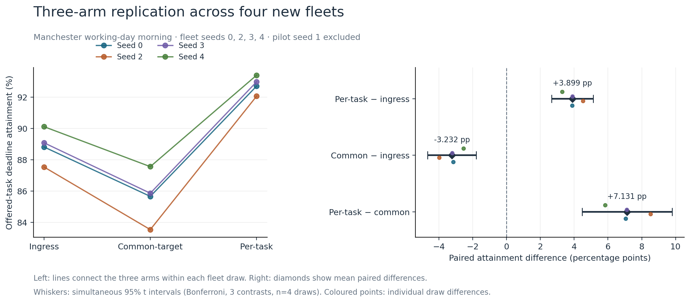
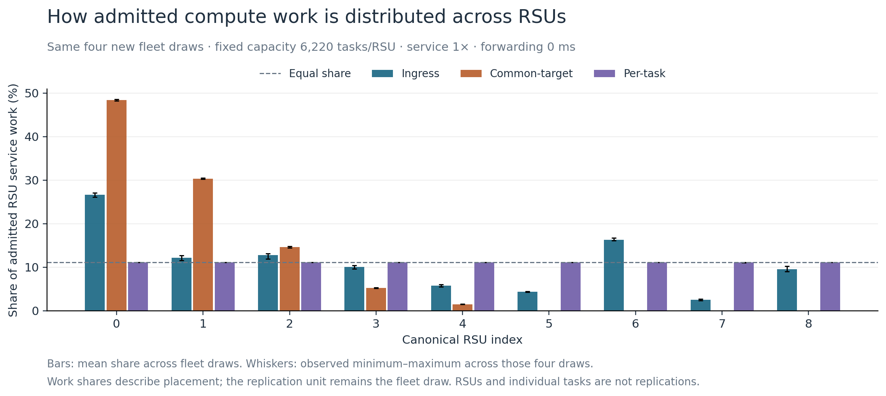

# Deterministic RSU load management: integrated evaluation and reflection

**Evidence cut-off: 7 September 2026.** This current dissertation results
section integrates the frozen E0–E2d programme with the completed follow-ups.
It is intended to replace overlapping evaluation prose during manuscript
revision. The [evidence map](vec_evidence_map_2026-09-07.md) records the source
and limitation of each principal claim; the
[private archive](../evaluation/vec_followup_2026-09-07/README.md) contains the
supporting tables, figures, manifests and validation receipts.

## Evaluation question and measurement foundation

The evaluation asks whether deterministic infrastructure-side RSU load
management can improve deadline performance while the trained vehicle policy
remains fixed. MAPPO selects Local, V2I or V2V; communication-target selection,
execution placement and admission are separate responsibilities. This separation
makes it possible to compare infrastructure implementations without retraining
the actor or enlarging its action space. The conclusions remain conditional on
that actor and the specified evaluator.

The primary outcome is **offered-task deadline attainment**, defined as the
number of deadline-met tasks divided by all offered tasks. Rejected and
unavailable tasks remain in the denominator. Admission, execution placement,
forwarding and deadline success are recorded separately. This prevents a
configuration from appearing successful merely because difficult tasks are
removed from the evaluated population. Fleet draws, rather than the millions
of individual task records, provide the replication units.

E0 established the measurement foundation through corrected accounting and
validation. Its full-hour reference checked terminal outcomes, rejection,
finite values and vehicle/RSU service-work conservation. E0 is evidence that
the specified accounting checks passed, not evidence that a scheduler improves
performance. The subsequent programme then separated queue capacity, admission
and placement. [E0 record](../evaluation/vec_followup_2026-09-07/historical_e0_e2d/experiments/E0/README.md),
[method and estimands](../evaluation/vec_followup_2026-09-07/historical_e0_e2d/docs/METHODOLOGY.md).

| Stage | Controlled question | Recorded interpretation |
|---|---|---|
| E1 | Increase waiting-room capacity at fixed service | More work was admitted, but the primary deadline-attainment comparison was inconclusive across five draws. |
| E2 | Apply inherited least-busy placement | Better execution balance did not itself ensure better deadline attainment in the pilot. |
| E2b | Separate placement from deadline-aware admission | Admission helped under both placement rules; inherited least-busy remained below ingress under the same gate in one draw. |
| E2c | Replicate common-target placement | Common-target was below ingress in all four new incident draws. |
| E2d | Refresh the placement target after each admitted candidate | Per-task placement was above ingress in all four matched incident draws. |

The E1 result must remain **inconclusive at the available replication size**.
It neither demonstrates equivalence nor proves that capacity has no effect.
Its secondary latency and admission changes illustrate why waiting-room
capacity must be distinguished from compute service. E2 and E2b were
exploratory and motivated the later matched comparisons.
[E1](../evaluation/vec_followup_2026-09-07/historical_e0_e2d/experiments/E1/README.md),
[E2](../evaluation/vec_followup_2026-09-07/historical_e0_e2d/experiments/E2/README.md),
[E2b](../evaluation/vec_followup_2026-09-07/historical_e0_e2d/experiments/E2b/README.md).

## Incident scenario: why implementation semantics matter

The implementation audit found that the inherited `dla` selector chose one
minimum-workload RSU per task substep and broadcast that target across its
candidates. Sequential `per_task_dla` instead selected an RSU for each candidate,
applied admission checks, and updated temporary workload only after admission.
Both used remaining compute workload, but they differed in when the target and
workload view were updated. The distinction is part of the operational
scheduler definition.

Across incident fleet seeds 1–4, common-target placement was **2.122 percentage
points below ingress** on average, with a paired 95% Student-t interval of
**[−2.234, −2.011] pp**. E2d per-task placement was **0.527 pp above ingress**,
with interval **[+0.442, +0.612] pp**. Its explicitly secondary contrast with
common-target was **+2.649 pp**, with interval **[+2.621, +2.678] pp**.
E2d reused the matched E2c controls; these were not independent new control
draws. All four differences had the relevant sign in each comparison.
[E2c result](../evaluation/vec_followup_2026-09-07/historical_e0_e2d/experiments/E2c/README.md),
[E2d result](../evaluation/vec_followup_2026-09-07/historical_e0_e2d/experiments/E2d/README.md).

This establishes the programme's central result: two implementations described
broadly as least-busy scheduling produced opposite comparisons with ingress
under matched controls. It does not establish universal superiority of
per-task scheduling, or show that target-refresh frequency is the sole cause
of every outcome difference. The recorded reconciliation and admission
semantics remain part of each implementation.

## Replication in the Manchester morning scenario

The completed follow-up used the canonical working-day trace for 15 October
2024, 08:00–11:00, with 10,800 one-second rows, 215 padded vehicle slots and
nine RSUs. Independent reconstruction from the supplied FCD source matched
the canonical trace, including entry markers. Within each matched comparison,
the actor, task seed, fleet draw, trace, queue-reset convention, service and
admission settings were fixed. Capacity was an **absolute 6,220 tasks per RSU**;
retaining the incident ratio command would instead have produced an unintended
538-task capacity for the smaller padded fleet. Service stayed at 1×,
forwarding overhead at zero, and scaling off.
[Input audit](../evaluation/vec_followup_2026-09-07/generalisation-pilot-2026-09-07/input_validation.json),
[frozen replication manifest](../evaluation/vec_followup_2026-09-07/generalisation-replication-2026-09-07/manifest.json).

The initial seed-1 pilot produced 91.07548% attainment for ingress and
94.02844% for per-task placement: **+2.95296 pp**, or **51,503 additional
deadline successes**. Because this inspected result influenced the decision
to replicate, it was excluded from primary inference. Before inspecting new
outcomes, the follow-up fixed seeds **0, 2, 3 and 4**, three arms, three paired
contrasts and the analysis method. All twelve full runs were retained.
The protocol was locally prespecified; it was not an external preregistration.
[Pilot](../evaluation/vec_followup_2026-09-07/generalisation-pilot-2026-09-07/RESULTS.md),
[protocol](../evaluation/vec_followup_2026-09-07/generalisation-replication-2026-09-07/PROTOCOL.md).

| Arm | Mean offered-task deadline attainment, four new draws |
|---|---:|
| Ingress execution with deadline-aware admission | 88.88685% |
| Common-target least-busy with inherited admission | 85.65460% |
| Sequential per-task least-busy with inherited admission | 92.78537% |

| Paired contrast | Mean difference (pp) | Simultaneous 95% family interval (pp) |
|---|---:|---:|
| Per-task − ingress | +3.89852 | [+2.67129, +5.12575] |
| Common-target − ingress | −3.23225 | [−4.67178, −1.79273] |
| Per-task − common-target | +7.13078 | [+4.46611, +9.79544] |

The ordering **common-target < ingress < per-task** occurred in all four new
draws. The simultaneous intervals retained both signs required by the
prespecified reversal criterion. These intervals use equal-weighted paired
fleet-draw differences, three degrees of freedom and a Bonferroni correction
across three contrasts. They are small-sample parametric estimates conditional
on the fixed scenario and evaluator/task seed. Individual intervals and every
draw are available in the [full results](../evaluation/vec_followup_2026-09-07/generalisation-replication-2026-09-07/RESULTS.md).

*Figure 1. Paired results for the four new fleet draws and the three contrasts.
The exploratory pilot is excluded. Error bars represent the prespecified
simultaneous intervals.*

The separate five-draw descriptive summary, including the exploratory pilot,
gives **+3.70941 pp** for per-task minus ingress. It must not be described as
five previously unseen confirmation draws, and no seed-1 common-target result
was added or imputed.

## Workload distribution and validity checks

Common-target admitted compute work occupied RSUs 0–4, with mean work shares
of approximately 48.34%, 30.33%, 14.63%, 5.21% and 1.48%; RSUs 5–8 received
none. Per-task placement distributed work almost evenly across all nine RSUs,
at about 11.1% each. Mean V2I deadline-gate rejections were 127,921 for
common-target, 66,948.5 for ingress and 1,942 for per-task. These averages and
work shares are descriptive diagnostics consistent with the implementation
effect. [Workload data](../evaluation/vec_followup_2026-09-07/generalisation-replication-2026-09-07/rsu_workload_distribution.csv),
[rejection data](../evaluation/vec_followup_2026-09-07/generalisation-replication-2026-09-07/runs.csv).

*Figure 2. Mean admitted service-work share across four new draws. Whiskers
show observed minimum and maximum shares, not confidence intervals.*

All twelve preflight probes and twelve full runs passed the declared checks.
Task streams, fleet, actions and ingress matched within each draw; actor logits
met the declared absolute tolerance of 0.00001. Task accounting, outcome
taxonomy and full-run prefixes passed. Independent work reconstruction matched
RSU queue endpoints exactly, with exact task-count carry and a maximum absolute
service-work balance error below 0.002 ms. Common-target selections were
verified to be minimum-workload RSUs. The runner required **41.43 minutes**,
including probes, validation and analysis; preparation and figure production
were additional. These measured morning-scenario times supersede the earlier
incident-based runtime forecast for this completed campaign.
[Analysis receipt](../evaluation/vec_followup_2026-09-07/generalisation-replication-2026-09-07/analysis_validation.json),
[completion receipt](../evaluation/vec_followup_2026-09-07/generalisation-replication-2026-09-07/completion.json).

### Why the same five RSUs receive work

A separate post-hoc audit examined the saved common-target records across all
four morning draws: **43,200 seconds and 216,000 task substeps**. Every recorded
end-of-second RSU workload and task count was zero. All **179,427 observable
target selections** followed substep `k` → RSU `k`, with zero exceptions.
The remaining 36,573 substeps had no recorded V2I attempt; their internal
targets were not directly observed. Common-target used all five RSUs in
15,803 seconds and fewer in the others.

The frozen code makes one common-target choice per substep and drains queues
only after all five substeps. With an empty workload vector, the lowest-index
tie-break selects RSU 0. Positive admitted work removes it from the zero-workload
tie, so the next choice is RSU 1, and the process continues. If no work is
admitted, the minimum does not advance. The five decisions limit new placements
to at most five RSUs within a second; repeated empty starts and lowest-index
ties explain why the same prefix, RSUs 0–4, recurs across seconds.

Intermediate workloads were reconstructed from archived admissions, destinations
and the bound service-work reference. Every saved endpoint matched exactly;
all reconstructed pre-drain workloads were below 1,000 ms. At each of the
**511,684 gate-rejected tasks**, at least five other RSUs remained idle with
spare admission capacity. There were zero RSU-capacity rejections. The
6,220-task waiting-room ceiling was therefore not the observed bottleneck.

This audit explains the fixed destination identities under the recorded
conditions. It does not establish that all rejected tasks would meet deadlines
after redistribution or that this mechanism alone explains the performance
contrast. Candidate-level working offsets and intermediate admission masks
were not saved; matching empty endpoints alone would not establish every
intermediate decision. The reconstruction also depends on the frozen service
reference and enqueue semantics. [Complete mechanism audit and evidence](../evaluation/common_target_mechanism_audit_2026-09-07/README.md).

A separate [two-prefix tie-break test](../evaluation/common_target_mechanism_audit_2026-09-07/TIEBREAK_PREFIX_PROPOSAL.md)
would rotate the preferred RSU index across seconds while retaining the five
common-target decisions. It predicts all nine identities across the prefix
but at most five within any second. This is an unrun proposal; no improved
balance, unchanged deadline outcome or other test result is claimed.

## Bounded incident sensitivity studies

The state-information pilot evaluated fresh placement and workload-report ages
of 100, 500 and 1,000 ms, with an ingress control, in incident fleet seed 1.
Only placement workload was delayed. Admission and queue evolution remained
live, and acknowledged admissions immediately updated the scheduler's view.
The original ordered task slots remained at one batch time; continuous service
between batches defined intermediate report states. This extended the
information model without distributing arrivals across the second.
[Frozen timing contract](../evaluation/vec_followup_2026-09-07/frozen_evaluator/docs/RSU_STATE_DELAY.md).

Fresh attainment was **72.46695%**, versus **72.00328%** for ingress. Relative
to fresh, the 100 ms result was unchanged, 500 ms gave **+0.00161 pp**, and
1,000 ms gave **−0.01185 pp**. These are one-draw descriptive effects. The
100 ms equality has a structural explanation: every audited live batch-entry
workload and 100 ms report was zero. Under the deadline gate and service bound,
the preceding workload cleared before the 100 ms report time. Thus this
treatment supplied identical workload values and does **not** establish
general resilience to stale state. Nonempty queues still formed within batches.
[Comparison](../evaluation/vec_followup_2026-09-07/state-delay-pilot-2026-09-07/comparison.csv),
[mechanism audit](../evaluation/vec_followup_2026-09-07/state-delay-pilot-2026-09-07/mechanism_audit.json).

The forwarding sensitivity applied fixed overheads of **0, 1, 2.5, 5 and
10 ms** to admitted forwarded tasks from the fresh incident run. Source checks
and four direct ten-step nonzero-cost probes qualified an exact transformation
of the full task records. No additional full positive-cost simulation was
needed. Under this evaluator, the cost is added after admission and does not
change queue arrival, placement or service.

At 10 ms, attainment was **72.28579%**: **23,689 additional misses** relative
to zero cost, but still **+0.28251 pp** and **36,942 successes** above ingress.
The 104 already-missed forwarded records with ambiguous penalty-equal point
latencies remained misses; they were retained in the denominator, and no
reconstructed mean-latency claim was made. The evaluated advantage persisted
over the tested grid, within this one-draw fixed-overhead model.
[Qualification and results](../evaluation/vec_followup_2026-09-07/forwarding-sensitivity-2026-09-07/RESULTS.md).

*Figure 3. Qualified fixed-latency sensitivity in incident fleet seed 1. This
is not a measurement of a physical backhaul network.*

## Critical reflection and bounded conclusion

The morning replication extends the implementation-dependent ranking reversal
to another Manchester operating scenario. It tests fleet variability within
that scenario. It does not establish independent geographic generalisation,
and its larger effect cannot be assigned to traffic conditions alone. The
scenarios also differ in date/window, density, RSU layout/count, padded-slot
assignment and entry-marker availability. Equal seed numbers across scenarios
do not create identical realised fleets at different padded widths.

The sensitivity studies answer narrower questions than a complete physical
coordination model. State delay retains live admission and immediate
acknowledgements; forwarding retains instantaneous queue placement and charges
only latency. Delayed acknowledgements, distributed task arrivals, routing,
bandwidth contention and transfer-dependent execution arrivals remain untested.
Neither the follow-ups nor E2d evaluated a real Kubernetes deployment.

The combined evidence supports a precise contribution: **the implementation
of deterministic RSU dispatch can reverse the deadline-performance comparison
with ingress execution under a frozen vehicle policy**. The replicated morning
result strengthens that conclusion, while the state-delay audit identifies a
timing boundary and the forwarding analysis measures a bounded cost sensitivity.
The separate morning mechanism audit explains why common-target repeatedly
selects the same five RSU identities, while preserving the distinction between
that explanation and attribution of the whole performance difference.
Further studies should address these specific limits. They are not prerequisites
for reporting the completed programme.
