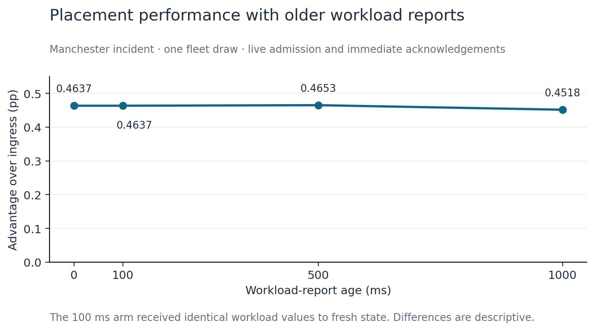
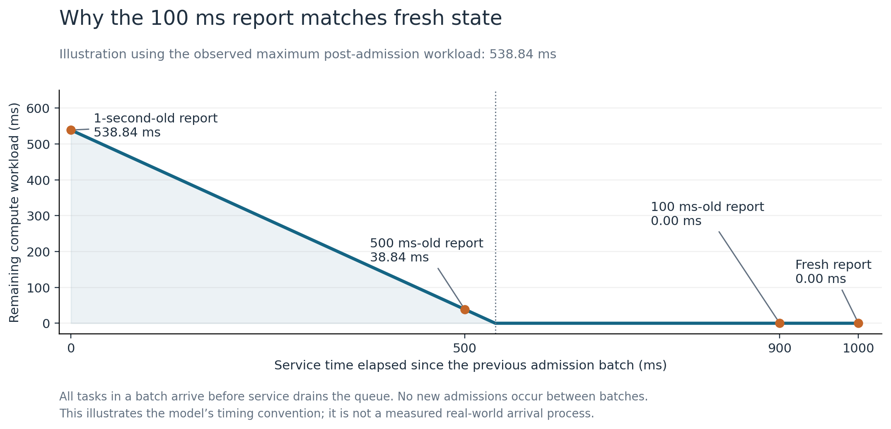
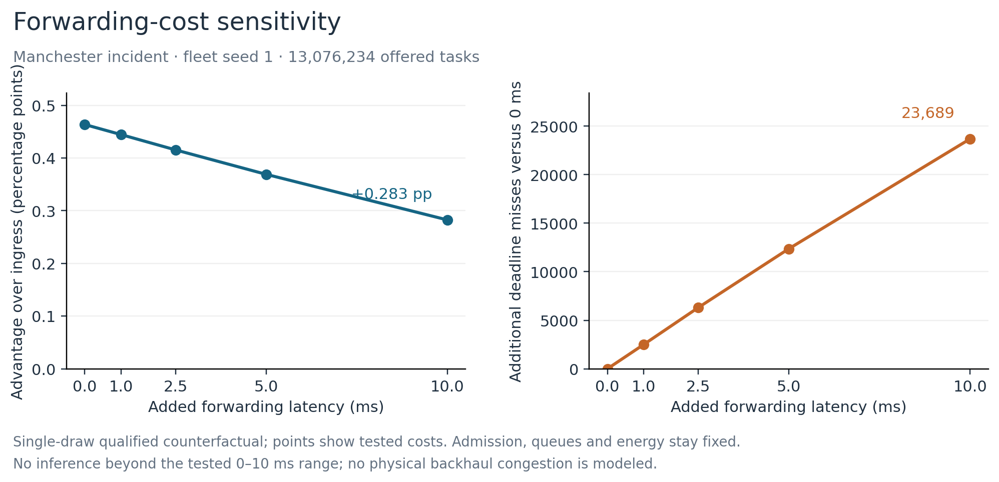

# Infrastructure scheduling with delayed workload information and forwarding overhead

## Experimental purpose and controls

Two bounded sensitivity studies were used to examine the infrastructure-side
assumptions behind per-task sequential least-busy placement. The first varied
the age of the workload report available to the placement scheduler. The
second varied a fixed latency charge for admitted tasks whose execution RSU
differed from their radio-ingress RSU. Both studies retained the frozen MAPPO
actor and the existing separation between vehicle-level mode selection and
infrastructure placement and admission.

The common input was the Manchester incident trace for 15 March 2024,
20:00–21:00 local time, containing 3,600 one-second rows and a maximum padded
width of 2,488 vehicle slots. Ten RSUs were configured. The UK2030 fleet
preset, fleet seed 1 and evaluator seed 0 were fixed. The actor had 17 input
features and selected Local, V2I or V2V once per active vehicle-step.
No actor training or action-space change was performed.

The primary outcome was offered-task deadline attainment:

`number of tasks meeting their deadlines / number of all offered tasks`.

The shared denominator was **13,076,234 offered tasks**. Rejected and
unavailable tasks remained in this denominator. Sequential queue accounting,
explicit rejection admission, conserved vehicle queues, a cap of 6,220 tasks
per RSU, arrival rate 1.5, and the fixed 1× RSU service setting were retained.
Kubernetes-inspired scaling was disabled. The one-draw design supports
descriptive paired comparisons; individual tasks were not treated as
independent experimental replications.

## Workload-report age: model and timing

The placement scheduler received either fresh RSU compute workloads or
reports aged 100, 500 or 1,000 ms. Only the workload information used to choose
an execution RSU was delayed. The chosen RSU applied the inherited admission
tests to its live workload and task count. Actual latency and queue accounting
also used live state. The scheduler immediately incorporated acknowledged
admissions into its view before considering subsequent candidates. This
represents delayed placement reports with immediate admission acknowledgements.

The timing convention is central to interpretation. Model C places its K_MAX
ordered task slots at the same logical batch time; the slots do not each
advance time by 200 ms. The existing one-second queue drain was retained.
Intermediate report states were defined by continuous service between these
admission batches. If `B` is the previous batch's post-admission workload, a
report of age `d`, for `0 < d <= 1000 ms`, is reconstructed as:

`reported workload = max(B - (1000 - d), 0)`.

At age 1,000 ms, the report includes the previous batch's admissions before
service. Fresh placement uses the original live-state selector. During the
first batch, no history exists, so delayed conditions use initial live state
and record actual age zero. From the second batch onward, recorded actual
ages equal the requested ages. All reported ages and source timestamps were
checked against the saved true pre-drain state.

## Workload-report age: results

| Condition | Deadline attainment | Difference from fresh (pp) | Difference from ingress (pp) |
|---|---:|---:|---:|
| Fresh per-task | 72.46695% | +0.00000 | +0.46367 |
| 100 ms report age | 72.46695% | +0.00000 | +0.46367 |
| 500 ms report age | 72.46856% | +0.00161 | +0.46529 |
| 1-second report age | 72.45510% | -0.01185 | +0.45183 |
| Ingress DLA | 72.00328% | -0.46367 | +0.00000 |

The fresh scheduler exceeded ingress DLA by **0.46367 percentage points**.
The 100 ms condition matched fresh attainment exactly. Relative to fresh,
the 500 ms condition increased attainment by **0.00161 points**, while the
1-second condition reduced it by **0.01185 points**. The 1-second condition
still exceeded ingress by **0.45183 points**. These small numerical changes
are reported descriptively without a confidence interval or equivalence claim.

*Figure 1. Offered-task deadline-attainment advantage over ingress under the
four workload-report ages, for one fleet draw. Lines connect evaluated
settings; they do not represent a fitted response model.*

### Mechanism diagnostic and the 100 ms interpretation

A post-hoc diagnostic examined 35,990 RSU/report observations in each arm:
3,599 batches after startup multiplied by ten RSUs. The live batch-entry
workload was zero in every audited observation. At 100 ms, all reports were
also zero and therefore identical to current workload. At 500 ms, 79.58% of
RSU reports differed from current workload, with mean error 12.89 ms and
maximum error 38.71 ms. At 1,000 ms, all reports differed, with mean error
502.51 ms and maximum error 538.64 ms.

This behavior follows from the admission and timing conventions. The largest
task deadline is 500 ms, and the live admission gate accepts a candidate only
when its target backlog is below that candidate's deadline. Under fixed 1×
service, the maximum single-task RSU service work is approximately 38.8889 ms,
including its bounded service-time variation. A causal admission therefore
leaves no more than approximately 538.8889 ms of workload, apart from
floating-point rounding. A report taken after 900 ms of service, as in the
100 ms condition, necessarily observes an empty queue under these controls.
The observed maximum post-admission workload in the fresh and 100 ms arms
was 538.8381 ms.

*Figure 2. Illustration using the observed maximum workload. The queue empties
before both the 100 ms-old and fresh report times. The example represents the
specified batched-arrival model, not a measured physical arrival process.*

Empty queues at batch boundaries do not imply an absence of queueing. Work
accumulates during each ordered admission batch, and tasks can wait or fail
admission within that batch. Nevertheless, the equality of fresh and 100 ms
results cannot be interpreted as general resilience to stale information:
the 100 ms treatment supplied identical workload values. Changing fleet seeds
alone would not remove this structural property under the same task,
admission and timing settings.

## Fixed forwarding-overhead sensitivity: method

The second analysis asked whether the fresh per-task placement advantage
survives a nonzero transfer cost when execution is remote from ingress.
Extra fixed overheads of **0, 1, 2.5, 5 and 10 ms** were evaluated. These values
are controlled sensitivity settings and are not claims about measured
backhaul latency.

The frozen source adds forwarding overhead to the selected V2I latency after
queue and service calculations. The backlog-based admission gate does not
include forwarding overhead. Within this evaluator, changed latency and
deadline outcomes affect reporting and reward but do not feed back into
placement, admission, queue service, actor observations or energy. The actor
is frozen, and evaluator reward is not used to update the policy. This
separation permits a task-record counterfactual under the stated semantics.

Before applying the transformation to the full trace, four new ten-step
runs evaluated each positive forwarding cost directly. The zero-cost short
record was bound exactly to the corresponding prefix of the completed full
run. Each direct nonzero run then matched the transformed task latencies,
deadline indicators and outcome codes byte-for-byte. Unchanged actor outputs,
actions, task inputs, execution paths, admissions, queue state and energy were
also checked. These source and execution checks qualified reuse of the full
records; no further full-length simulation was launched.

For an admitted forwarded task with identifiable latency, float32 overhead
was added to its archived zero-cost latency. The inclusive rule
`latency <= task deadline` was reapplied using its original task type.
Non-forwarded tasks and rejected tasks were retained. The zero-cost full-data
reconstruction matched original outcomes and counts exactly, including
per-task-type deadline counts. The resulting response was checked to be
non-increasing with cost and to create no new successes from positive delay.

There were 104 already-missed forwarded tasks with a recorded latency equal
to a failure penalty. The archive alone cannot uniquely distinguish clipped
failure latency from an actual equal point latency. This ambiguity does not
change their deadline outcomes: under either interpretation, adding a
nonnegative cost cannot restore success. These tasks remain misses and stay
in the offered denominator. Their positive-cost point latencies are treated
as unknown, so no reconstructed mean-latency result is claimed for this analysis.

## Fixed forwarding-overhead sensitivity: results

| Added forwarding latency | Deadline attainment | Advantage over ingress (pp) | Additional misses versus 0 ms |
|---|---:|---:|---:|
| 0 ms | 72.46695% | +0.46367 | 0 |
| 1 ms | 72.44783% | +0.44455 | 2,500 |
| 2.5 ms | 72.41882% | +0.41554 | 6,294 |
| 5 ms | 72.37240% | +0.36912 | 12,364 |
| 10 ms | 72.28579% | +0.28251 | 23,689 |

The ingress baseline remained at **72.00328%** because admitted ingress tasks
did not incur inter-RSU forwarding. The per-task arm contained **600,885
admitted forwarded tasks**. At 10 ms, deadline attainment decreased from
72.46695% to **72.28579%**, corresponding to **23,689 additional misses** among
all offered tasks. The per-task arm still produced **36,942 more deadline-met
tasks** than ingress, leaving an advantage of **0.28251 percentage points**.

*Figure 3. Qualified fixed-overhead forwarding sensitivity for the fresh
per-task arm. The left panel shows the advantage over the fixed ingress
baseline; the right shows additional deadline misses relative to zero cost.*

No tested cost from 0 through 10 ms reversed the ordering. This supports a
bounded statement: in this fleet draw and fixed-overhead model, the placement
advantage persisted across the evaluated range while decreasing with cost.
The study does not identify a break-even cost outside the tested grid.
The admitted task set, rejection counts and energy remained fixed by this
counterfactual model, rather than through a general claim that physical
forwarding has no such effects.

## Scope, limitations and reproducibility

The two studies vary different infrastructure assumptions. Workload-report
age changes placement information; forwarding overhead in this analysis
changes task latency after placement and admission. Both preserve the
existing E2d evaluator's live queue semantics. Broader state staleness would
require explicit sub-second task arrivals, status delivery and acknowledgement
timing. A physical forwarding study would need transfer-dependent execution
arrival times, topology, link capacity and congestion. Those mechanisms were
not tested here. Neither study involved a real Kubernetes deployment.

Only fleet seed 1 was used. The results therefore do not establish
replicate-level statistical significance, equivalence, geographic
generalisation, or universal scheduler superiority. Earlier E2d evidence is
preserved under its original recorded assumptions. The present results add
bounded sensitivity evidence and identify a timing-model limitation that
must be stated when discussing information freshness.

The evaluator is pinned to merged commit
`908bd10f86542de94fc38af90dd56c2ccc08cf9b` in `Abdulla4akash/vec_env`. The
runtime uses CPython 3.11.15, JAX/JAXlib 0.4.30 and NumPy 1.26.4 on the Mac's
CPU. Exact actor, trace, source and package identities appear in the
[forwarding manifest](manifest.json) and the
[original pilot manifest](../state-delay-pilot-2026-09-07/manifest.json).
The [qualification receipt](qualification.json),
[full analysis receipt](analysis_validation.json),
[analysis script](forwarding_analysis.py) and
[tabulated results](forwarding_sensitivity.csv) accompany this section.
Original task archives and validation records were not overwritten.
