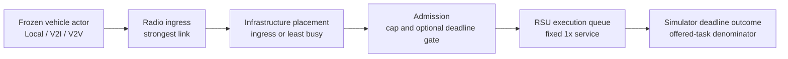

# TrafficTwin VEC/RSU Research Programme

## Overview

This repository is the public research-progress and evidence record for a one-week experimental programme at the intersection of vehicular edge computing (VEC), intelligent transportation systems, distributed resource management, queueing and scheduling, deadline-aware admission, and reproducible systems evaluation. The work progressed from evaluator validation (E0), through queue-capacity and placement studies (E1–E2c), to a construct-validity test (E2d) that reversed the earlier placement result. It is not the TrafficTwin product repository, contains no large raw simulator arrays, and grants no authority to run a further experiment.

> **Headline result.** Against the same strongest-link baseline and deadline-feasibility rule, common-target-per-substep least-busy placement was **2.12 percentage points lower** in E2c, whereas per-task sequential least-busy placement was **0.53 percentage points higher** in E2d. The dispatch granularity reversed the observed direction.

## What I worked on this week

| Stage | Question | Method | Result | Why it mattered / next step |
|---|---|---|---|---|
| [E0](experiments/E0/README.md) | Can the evaluator's task lifecycle and work accounting be trusted? | Corrected terminal-outcome accounting, finite queues, rejection semantics, and service-work ledgers. | Task and work conservation passed. | Established the measurement foundation; E0 was not a scheduler comparison. |
| [E1](experiments/E1/README.md) | Does a larger RSU waiting room improve deadline performance at fixed service? | Five matched fleet draws at 0.75×, 2.5× and 40× queue caps. | 40×−0.75× mean −0.0109 pp; 95% CI included zero. Larger caps admitted more work but sharply increased latency. | **Inconclusive at this replication size**; demonstrated that queue capacity is not compute capacity. |
| [E2](experiments/E2/README.md) | Does infrastructure-side least-busy placement help? | One-draw native placement pilot: strongest-link, inherited least-busy, and least-busy plus deadline-aware admission. | Placement greatly improved balance but lowered offered deadline attainment; the combined DLA arm improved it. | Placement and admission were confounded, motivating E2b. |
| [E2b](experiments/E2b/README.md) | Was the DLA result caused by placement or admission? | Added strongest-link plus the same deadline gate, completing a 2×2 mechanism table. | Admission helped under both placement rules; inherited placement remained lower under the same gate. | One draw generated a clean hypothesis for matched replication. |
| [E2c](experiments/E2c/README.md) | Does that same-gate placement deficit persist? | Four new matched fleet draws, seeds 1–4; tasks were not treated as replicates. | All four differences were negative; mean −2.122 pp, 95% t CI [−2.234, −2.011] pp. | Source audit found that the inherited selector chose one common target per task substep. |
| Implementation audit | What exactly did “least busy” mean in code? | Traced selector state, candidate ordering, tie-breaking, path records and queue updates. | The implementation broadcast one `argmin(rsu_busy_ms)` target across a substep rather than recomputing per task. | Created a construct-validity question rather than invalidating the tested E2c implementation. |
| [E2d](experiments/E2d/README.md) | Does the E2c direction survive per-task sequential dispatch? | New per-task least-busy mode; four matched draws against reused, hash-verified E2c controls. | All four differences were positive; mean +0.527 pp, 95% t CI [+0.442, +0.612] pp. | The direction reversed; implementation semantics were an important mechanism. |

The full decision trail is in [Weekly Research Progress](docs/WEEKLY_RESEARCH_PROGRESS.md) and [Experimental Timeline](docs/EXPERIMENTAL_TIMELINE.md).

## Essential distinctions

- **Waiting-room capacity is not compute service capacity.** More queued tasks do not increase execution rate.
- **Vehicle action is not execution-RSU choice.** The frozen 17-dimensional MAPPO actor selects only Local, V2I or V2V. It neither observes current RSU load nor selects an execution RSU.
- **Radio ingress is not execution placement.** A V2I task may enter through its strongest-link RSU and execute elsewhere.
- **Placement is not admission.** Placement chooses a prospective execution site; admission decides whether work enters that site's queue.
- **Offered tasks are not admitted tasks.** Rejected work remains part of system performance, so the primary deadline denominator is all offered tasks.
- **Tasks are not independent experimental replicates.** Fleet draws/fleet seeds are the replication units.

## Research architecture

The experimental interventions were infrastructure-side systems/resource-management changes. The actor stayed frozen throughout and did not select the infrastructure execution target.

## Experiments at a glance

| Study | Question | Replication | Intervention | Main result | Status |
|---|---|---:|---|---|---|
| E0 | Can evaluator accounting be trusted? | Validation | Accounting and conservation | Complete task outcomes and conserved V2I/vehicle work | Closed foundation |
| E1 | Does larger waiting-room capacity help? | 5 fleet draws | Queue cap | Primary interval included zero; strong admission/latency trade-off | Closed, inconclusive primary |
| E2 | Does least-busy placement help? | 1 fleet draw | Placement and combined DLA | Better balance, lower attainment for inherited placement | Descriptive pilot |
| E2b | Placement or admission? | 1 fleet draw | 2×2 mechanism decomposition | Admission helped; inherited placement lower under same gate | Hypothesis-generating |
| E2c | Does the same-gate deficit replicate? | 4 new fleet draws | Common-target-per-substep placement | −2.122 pp vs strongest-link | Bounded matched replication |
| E2d | Does it survive per-task dispatch? | 4 matched fleet draws | Per-task sequential placement | +0.527 pp vs strongest-link; direction reversal | Bounded construct-validity study |

## Major progression: result, audit, falsification

E2c supported a precise but implementation-specific claim: under one common least-busy target per task substep, placement produced lower offered-task deadline attainment than strongest-link execution when both used the same admission rule. That result was valid for the tested implementation.

The subsequent source audit exposed a construct-validity limitation. E2d therefore changed only the dispatch granularity: candidates were processed deterministically and the least-busy target was recomputed after every admitted reservation. All other frozen conditions were preserved. The sign then reversed in every matched draw.

## Final conclusions

1. Queue capacity must not be confused with compute service capacity.
2. Offered-task and admitted-task metrics can yield materially different interpretations.
3. Deadline-aware admission and execution placement must be isolated experimentally.
4. A more balanced execution distribution is not, by itself, evidence of better deadline performance.
5. Scheduler implementation details can reverse a scientific conclusion: the common-target and per-task versions of the same broad least-busy idea produced opposite directions against strongest-link execution.
6. Measurement and reproducibility controls—conservation, path observability, matched action/task streams, predeclaration, exact identities, checksums and independent exact-head technical review—were part of the research contribution.

The bounded E2d conclusion is: **within four matched Manchester incident draws, per-task sequential least-busy placement exceeded strongest-link execution under the shared deadline-feasibility rule.** The inherited common-target-per-substep convention was an important mechanism behind E2c's negative direction; it was not proven to be the sole cause.

## Validation and reproducibility

- Each scientific stage has exact commit and manifest identities in [Provenance](docs/PROVENANCE.md).
- E1, E2c and E2d paired statistics are independently recomputed by [verify_statistics.py](analysis/verify_statistics.py).
- Public figures are generated from committed CSV files by [generate_figures.py](analysis/generate_figures.py).
- Compact validation/comparison records are included. Records containing private local paths were transformed into explicitly named public-sanitized derivatives; their original and public hashes are both recorded.
- Large raw `.npz` arrays remain outside Git. Their frozen checksum-ledger identities are documented for controlled verification or later archival publication.
- Independent exact-head technical review was used as an internal quality-control gate. This is not a claim of scholarly peer review.

See [Reproducibility](docs/REPRODUCIBILITY.md) and [Evidence Publication Policy](docs/EVIDENCE_POLICY.md).

## Repository map

- [Weekly research progress](docs/WEEKLY_RESEARCH_PROGRESS.md) — supervisor-facing diary and decision chain
- [Research question](docs/RESEARCH_QUESTION.md) — questions, estimands and conceptual model
- [Methodology](docs/METHODOLOGY.md) — frozen setup, denominators and validity gates
- [Experimental timeline](docs/EXPERIMENTAL_TIMELINE.md) — E0→E2d progression
- [Cumulative findings](docs/CUMULATIVE_FINDINGS.md) — connected scientific interpretation
- [Limitations](docs/LIMITATIONS.md) — scope and claim boundaries
- [Provenance](docs/PROVENANCE.md) — exact private evidence identities and public transformations
- [`experiments/`](experiments/) — one concise record per stage
- [`data/`](data/) — cumulative public-safe CSV extracts
- [`figures/`](figures/) — generated academic figures
- [`analysis/`](analysis/) — independent statistic verification and figure generation

## Limitations

The placement evidence is bounded to one Manchester incident hour, a provisional `uk2030` fleet, four new E2c/E2d fleet draws, evaluator seed 0, one 2.5× cap, fixed 1× service, zero-cost backhaul, a backlog-only deadline gate, a frozen actor and simulator deadline outcomes. There was no ordinary/free-flow control. E2d reused hash-verified E2c controls. The work does not establish population-wide, Manchester-wide, universal least-busy/JSQ, physical-deployment, Kubernetes or task-level significance claims.

## Citation and licence

Citation metadata is in [CITATION.cff](CITATION.cff). Newly authored documentation, compact data extracts, analysis code and figures in this repository are available under the [MIT License](LICENSE). Referenced upstream/private source code and raw artifacts are not included or relicensed.
