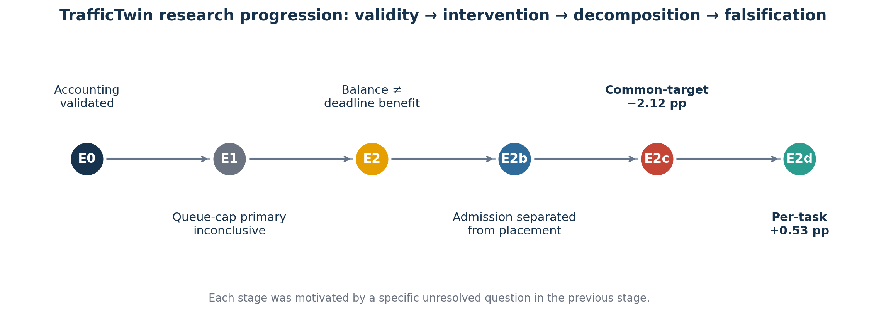

# Experimental Timeline

| Date (2026) | Stage | Scientific transition | Outcome |
|---|---|---|---|
| 7 Aug | E0 | Correct evaluator/task/work accounting before performance interpretation | Corrected smoke and full reference passed conservation and terminal-outcome gates |
| 8–9 Aug | E1 | Change waiting-room capacity while holding service fixed | Primary five-draw contrast inconclusive; larger queues admitted more but accumulated severe latency |
| 9 Aug | E2 | Add native ingress/selection/execution paths; test placement | Inherited least-busy balanced execution but lowered offered attainment; DLA combined placement and admission |
| 10 Aug | E2b | Add missing strongest-link-plus-deadline-gate cell | Admission helped under both placement rules; same-gate placement difference was negative in one draw |
| 10–11 Aug | E2c | Replicate the clean same-gate placement contrast over seeds 1–4 | Four negative differences; mean −2.122 pp; bounded interval excluded zero |
| 11 Aug | Source audit | Trace exact inherited selector semantics | Found one common `argmin(rsu_busy_ms)` target per task substep |
| 11 Aug | E2d pre-run | Implement per-task sequential least-busy placement | First approved runner stopped before any trace due to phase-order mismatch; corrected package received fresh approval |
| 11–12 Aug | E2d | Run construct-validity intervention over matched seeds 1–4 | Four positive differences; mean +0.527 pp; direction reversed |



## Decision chain

```text
Can the measurements be trusted?
  ↓ E0: yes, after accounting/conservation corrections
Does a larger queue help at fixed service?
  ↓ E1: primary inconclusive; admission/latency trade-off
Does least-busy placement help?
  ↓ E2: better balance, worse deadlines; DLA is confounded
Placement or admission?
  ↓ E2b: gate helps; inherited placement lower under same gate
Does that repeat across fleet draws?
  ↓ E2c: four negative matched differences
What did the inherited selector actually do?
  ↓ audit: one common target per substep
Does the conclusion survive per-task dispatch?
  ↓ E2d: no—the observed direction reverses
```
