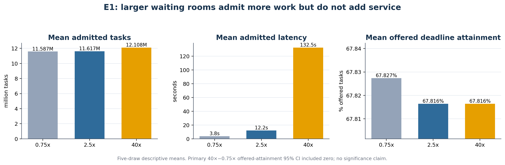

# E1 — Waiting-Room Capacity at Fixed Service

## Hypothesis

Increasing RSU waiting-room capacity may reduce rejection, but at fixed compute service it need not improve offered-task deadline attainment and may increase queueing latency.

## Design

Five matched fleet draws compared 0.75× (1,866 tasks/RSU), 2.5× (6,220) and 40× (99,520). RSU service remained fixed at 1×.

## Primary result

The 40×−0.75× offered-attainment differences were:

`−0.000171609043, −0.000122129965, 0, −0.000253436884, 0`

Mean: `−0.000109435178`

95% Student-t interval: `[−0.000246462456, +0.000027592099]`

The interval included zero. The correct decision is **inconclusive at this replication size**, not equivalence, a tie or statistically significant degradation.

## Secondary pattern

Across the five draws, increasing the waiting room admitted more tasks and rejected fewer. Mean admitted latency rose from about 3.77 s at 0.75× to 12.19 s at 2.5× and 132.49 s at 40×, while mean admitted-task attainment declined from 0.76545 to 0.73237. This is the queue-capacity versus compute-capacity distinction in data.

## Authoritative identities

- Final evidence commit: `a1423e604078f70c95d4115287d3f0391348becf`
- Manifest SHA-256: `0631f7b80a8575139c5dcbb7a110487fa57a0952555f0518a5bb9d37a1b93a2d`

## Public evidence and data

- [Cap aggregates](data/e1_capacity_aggregate.csv)
- [Primary paired differences](data/e1_primary_paired_differences.csv)
- [Byte-identical comparison JSON](evidence/e1_multidraw_physical_campaign_comparison_v1.json)
- [Byte-identical validation JSON](evidence/e1_multidraw_physical_campaign_validation_v1.json)
- [Public-sanitized manifest](evidence/e1_multidraw_physical_campaign_manifest_v1_public_sanitized.json)
