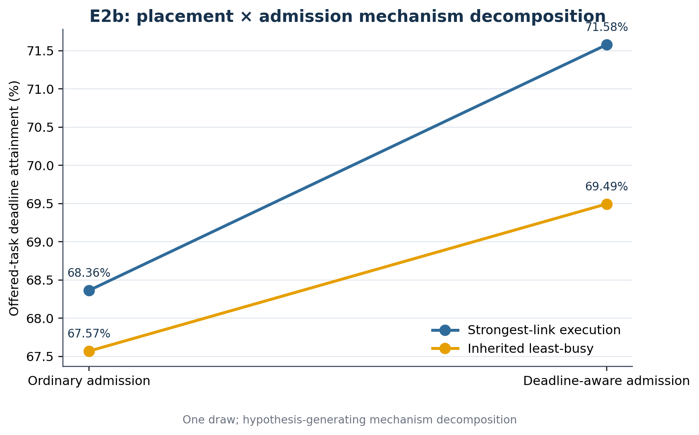

# E2b — Placement × Admission Decomposition

## Purpose

Complete the missing 2×2 cell needed to separate execution placement from deadline-aware admission.

## New cell

`ingress_dla` kept execution at strongest-link ingress while enabling the exact same deadline-aware gate as `dla`. It never forwarded work.

## Seed-0 result

`ingress_dla` offered 13,076,234 tasks, admitted 10,424,749, met 9,359,618 deadlines and produced offered attainment 0.715773211. It admitted 580,907 V2I tasks, gate-rejected 2,071,344, cap-rejected none and forwarded none.

## Factorial table

| Placement | Gate off | Gate on |
|---|---:|---:|
| Strongest-link | `off` = 0.683619229 | `ingress_dla` = 0.715773211 |
| Inherited least-busy | `jsq` = 0.675681775 | `dla` = 0.694939919 |

Contrasts in offered-task attainment:

- Placement without gate (`jsq - off`): −0.007937454
- Placement with gate (`dla - ingress_dla`): −0.020833292
- Admission under strongest-link: +0.032153983
- Admission under inherited least-busy: +0.019258144
- Interaction: −0.012895838

## Decision

Admission improved offered attainment under both placement rules. Under the same gate, inherited least-busy placement remained worse in this one draw. E2b was hypothesis-generating, so E2c tested the clean placement contrast over four new matched fleet draws.

## Authoritative identities

- Final evidence commit: `fe2ed4e9bd9043b19b96a5f179390db629b01ccb`
- Manifest SHA-256: `9383ec767dccf2f390b498e0c20283a74cd64fa521d6137fe23ce38d0022af91`
- vec_env commit: `0e5ed2f79b50011fe0475a5c2069978f9fdd778d`

## Public evidence and data

- [Factorial data](data/e2b_factorial.csv)
- [Byte-identical path summary](evidence/e2b_placement_admission_path_summary_v1.json)
- [Public-sanitized comparison](evidence/e2b_placement_admission_factorial_comparison_v1_public_sanitized.json)
- [Public-sanitized validation](evidence/e2b_placement_admission_factorial_validation_v1_public_sanitized.json)
- [Public-sanitized manifest](evidence/e2b_placement_admission_factorial_manifest_v1_public_sanitized.json)
