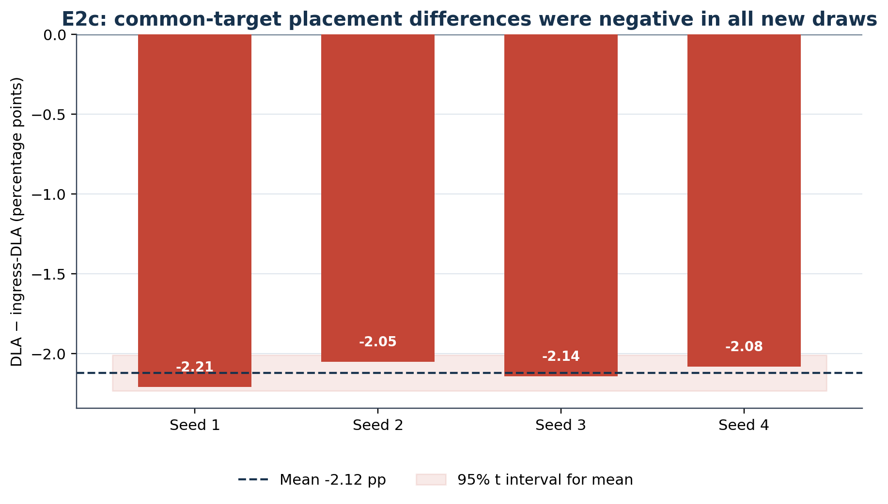

# E2c — Matched Multi-Draw Common-Target Placement Replication

## Hypothesis

The negative same-admission placement difference observed in E2b would reproduce in four new matched fleet draws.

## Design

Fleet seeds 1–4 were the primary replication sample; hypothesis-generating seed 0 was excluded. Each seed compared strongest-link `ingress_dla` against inherited `dla`, with the same deadline-aware gate, task/action streams, cap, service and zero-cost backhaul.

## Primary result

| Fleet seed | `ingress_dla` | `dla` | `dla - ingress_dla` |
|---:|---:|---:|---:|
| 1 | 0.720032770903 | 0.697935735931 | −0.022097034972 |
| 2 | 0.703688003748 | 0.683168869569 | −0.020519134179 |
| 3 | 0.702976483902 | 0.681529100810 | −0.021447383092 |
| 4 | 0.708874512340 | 0.688049020842 | −0.020825491499 |

Mean difference: −0.021222260935 (−2.122 pp). Sample SD: 0.000699457605. 95% Student-t interval: [−0.022335254070, −0.020109267800]. All four new differences were negative.

## Mechanism audit

The inherited DLA selector chose one `argmin(rsu_busy_ms)` target once per task substep and broadcast it across V2I candidates. It was therefore **common-target-per-substep least-busy placement**, not per-task JSQ. It forwarded roughly 85% of admitted V2I tasks but executed work on only five RSUs.

## Decision

E2c established a bounded directional result for the tested common-target implementation. The source finding created a construct-validity question, motivating E2d rather than a universal least-busy claim.

## Authoritative identities

- Scientific execution commit: `676f132406877bbc6fb92b6c2a08b675571aa9fa`
- Original scientific evidence commit: `715ce2cf1e943951e13586756f07d7432e24fe69`
- Frozen final reporting head: `1a08d6e148a1e8c430da39c3d575eda3f8ea5929`
- Manifest SHA-256: `fcaf2ee34b68ca4e4ef2e088d72ce2c5a410cf66ff9934a451fd8047204c480a`
- vec_env commit: `0e5ed2f79b50011fe0475a5c2069978f9fdd778d`

## Public evidence and data

- [Paired results](data/e2c_paired_results.csv)
- [Mechanism summary](data/e2c_mechanism_summary.csv)
- Public-sanitized [comparison](evidence/e2c_gated_placement_multidraw_comparison_v1_public_sanitized.json), [validation](evidence/e2c_gated_placement_multidraw_validation_v1_public_sanitized.json), [mechanism record](evidence/e2c_gated_placement_mechanism_summary_v1_public_sanitized.json) and [manifest](evidence/e2c_gated_placement_multidraw_manifest_v1_public_sanitized.json)
