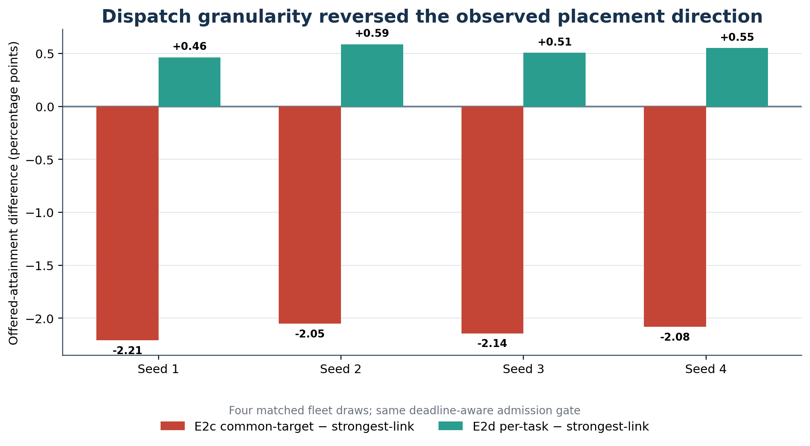

# E2d — Per-Task Sequential Least-Busy Placement Robustness

## Hypothesis

If E2c's negative direction was substantially shaped by common-target-per-substep dispatch, recomputing the least-busy RSU for every task candidate could materially improve performance and reverse the result.

## Implementation

`per_task_dla` used remaining RSU compute-service workload in milliseconds. Candidate order was task-substep index ascending, then padded vehicle-slot index ascending. `jnp.argmin` gave lowest-index deterministic ties. Effective workload was updated only after admission using the real service-work reservation; rejected tasks reserved no work.

## Pre-run orchestration correction

The first E2d package received exact-head internal approval. Before any trace process launched, a runner-order mismatch was found: it would have run a seed's full cell before later seeds' smokes. Execution correctly stopped with zero trace runs. The runner and manifest were corrected to require all eight smokes before any full cell, new identities were frozen and a fresh review returned `APPROVE`. No evidence was discarded.

## Execution gates

- Existing-mode ten-step replays: 8/8 passed
- New-arm repeated smokes: 8/8 passed
- New 3,600-step full cells: 4/4 passed
- Failures/retries/discarded evidence: 0/0/0

## Primary result

| Seed | `per_task_dla` | `ingress_dla` | Primary difference |
|---:|---:|---:|---:|
| 1 | 0.724669503467 | 0.720032770903 | +0.004636732564 |
| 2 | 0.709555289390 | 0.703688003748 | +0.005867285642 |
| 3 | 0.708048280568 | 0.702976483902 | +0.005071796666 |
| 4 | 0.714384432093 | 0.708874512340 | +0.005509919752 |

Mean: +0.005271433656 (+0.527 pp). Sample SD: 0.000533733895. SE: 0.000266866947. 95% Student-t interval: [+0.004422143925, +0.006120723387]. All four differences were positive.

The secondary `per_task_dla - common-target dla` mean was +0.026493694591 (+2.649 pp), with interval [+0.026210763951, +0.026776625232]. It remains explicitly secondary.

## Mechanism evidence

Per-task placement used all ten RSUs, forwarded about 600,000 admitted V2I tasks per draw, switched selected targets about 643,000 times within substeps and achieved an execution-share range of 0.000706–0.001387. Common-target DLA used one selected target per active substep, switched zero times and executed on five RSUs. Strongest-link used all ten RSUs and forwarded none.

## Bounded conclusion

Within these four matched incident draws, per-task sequential least-busy placement exceeded strongest-link execution under the shared deadline-feasibility rule. The common-target convention was an important mechanism behind E2c's negative direction; it was not proven to be the sole cause.

## Authoritative identities

- Approved execution head: `095e0c1fbd5307b60722cac2be89ae480911e7df`
- Final independently approved evidence head: `80e8ae55dfbcc0aa271ed7ed1d67aeae8f384761`
- vec_env commit: `2f63706f46319433a2ba3af1df97afd0e56a95d1`
- tos-data commit: `a75bbdb1a956f828ee0e9b97b33506bd32d31b85`
- Manifest SHA-256: `f77afb231f7d0be2c13627e9fbdc6bf635ea86b351bf0a0e7c83295ef0435740`
- Raw root ledger SHA-256: `eb5de7ce1eea202fee4d08d28bf7f4e38888b24709550cfc78dca71b16b250ca`
- Post-run internal review verdict: `APPROVE`

## Public evidence and data

- [Paired results](data/e2d_paired_results.csv)
- [New-arm full metrics](data/e2d_per_task_dla_results.csv)
- [Mechanism summary](data/e2d_mechanism_summary.csv)
- Public-sanitized [comparison](evidence/e2d_per_task_placement_robustness_comparison_v1_public_sanitized.json), [validation](evidence/e2d_per_task_placement_robustness_validation_v1_public_sanitized.json), [mechanism record](evidence/e2d_per_task_placement_mechanism_summary_v1_public_sanitized.json) and [manifest](evidence/e2d_per_task_placement_robustness_manifest_v1_public_sanitized.json)
