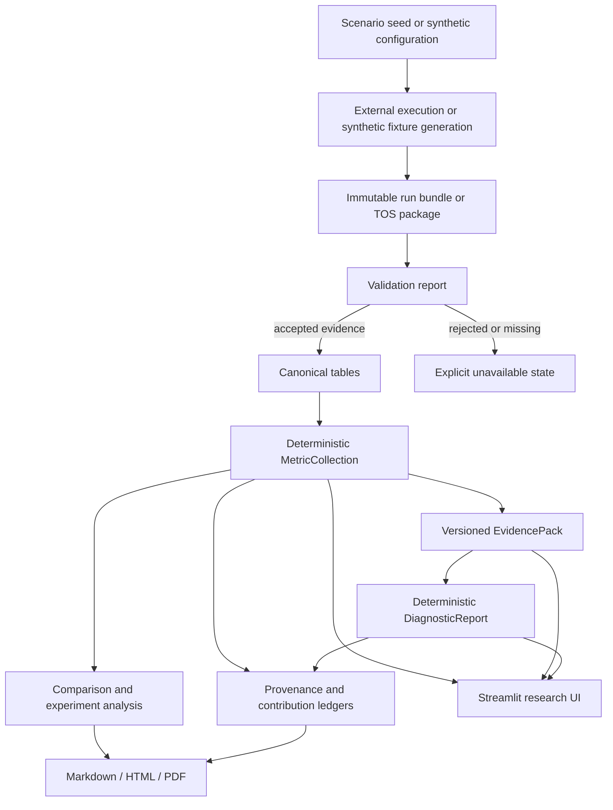

# TrafficTwin Complete Product And Usage Guide

This is the single starting point for using TrafficTwin as a software demonstration, research
instrument, historical-results analyser, or dissertation evidence generator. It consolidates the
normal workflow and links to the detailed contracts where exact schemas or command options matter.

TrafficTwin is an **import-first replay-and-scenario research prototype** for urban traffic and
vehicular edge-computing analysis. It validates historical run artifacts, converts supported input
to canonical records, calculates deterministic metrics, compares scenarios, evaluates
evidence-linked diagnostic hypotheses, and traces outputs back to their source rows. It also
provides deterministic synthetic scenarios when external data or simulators are unavailable.

TrafficTwin exposes one exact Randy/VEC evaluator through conditional request-preflight-gated
foreground execution. It does not provide a general Randy/SUMO launcher, background job service,
live Manchester data, or any claim that synthetic outputs are real-world predictions. Unsupported
functions remain visibly unavailable.

## Contents

1. [What TrafficTwin Is For](#what-traffictwin-is-for)
2. [Who Can Use It](#who-can-use-it)
3. [Capabilities And Boundaries](#capabilities-and-boundaries)
4. [How The System Works](#how-the-system-works)
5. [Installation](#installation)
6. [Fastest Ways To Start](#fastest-ways-to-start)
7. [Core Concepts](#core-concepts)
8. [Complete Use-Case Catalogue](#complete-use-case-catalogue)
9. [Streamlit UI Reference](#streamlit-ui-reference)
10. [CLI Cookbook](#cli-cookbook)
11. [Inputs And Data Contracts](#inputs-and-data-contracts)
12. [Outputs And How To Interpret Them](#outputs-and-how-to-interpret-them)
13. [Reporting And Dissertation Use](#reporting-and-dissertation-use)
14. [Deployment And Sharing](#deployment-and-sharing)
15. [Reproducibility And Quality Assurance](#reproducibility-and-quality-assurance)
16. [Safety, Privacy, And Research Integrity](#safety-privacy-and-research-integrity)
17. [Troubleshooting](#troubleshooting)
18. [Known Limitations](#known-limitations)
19. [Recommended Workflows By Goal](#recommended-workflows-by-goal)
20. [Further Documentation](#further-documentation)

## What TrafficTwin Is For

TrafficTwin supports four practical activities:

1. **What-if experimentation:** define or import scenario configurations, compare a baseline with
   an intervention, and describe measurable differences.
2. **Traffic and VEC observability:** inspect task outcomes, offloading decisions, RSU pressure,
   traffic observations, vehicle coordinates, and journey records when the evidence exists.
3. **Diagnostic support:** apply deterministic rules R0-R8 to versioned EvidencePacks and produce
   candidate hypotheses with explicit evidence, alternatives, missing information, and conditional
   follow-up actions.
4. **Research auditability:** preserve raw inputs, validate them before analysis, record
   fingerprints and provenance, export reproducible protocols, and generate reports suitable for
   review or dissertation appendices.

The product is designed around a guaranteed workflow:

```text
Create or receive a scenario seed
              ↓
Generate externally, or receive, a completed run bundle
              ↓
Validate and preserve the raw input
              ↓
Canonicalise supported records
              ↓
Compute deterministic metrics
              ↓
Build an EvidencePack
              ↓
Compare scenarios and evaluate deterministic rules
              ↓
Inspect provenance and export reports
```

The repository also contains a deterministic synthetic generator. It exercises the same workflow
without pretending to be SUMO, Randy's environment, a radio model, or a calibrated Manchester
simulation.

## Who Can Use It

| User | Typical purpose | Useful areas |
|---|---|---|
| Traffic or transport analyst | Compare historical/simulated scenarios and inspect traffic or journey effects | Replay, Comparison, Journey-Time Lens, Reports |
| VEC/offloading researcher | Analyse task completion, latency, decisions, RSU pressure, and training-validation drift | Run Overview, Infrastructure, Diagnostics, TOS Results |
| Experiment coordinator | Design matched multi-seed studies and track externally executed slots | Experiment Planner, protocol export, tracking |
| Supervisor or examiner | Audit claims, inspect evidence, and reproduce figures or tables | Guided Demo, Provenance Explorer, PDF reports, supervisor pack |
| Data provider | Check whether an output package satisfies a documented contract | Bundle validation, TOS contract, readiness report |
| Software developer | Extend adapters, metrics, rules, reports, or UI over tested library interfaces | Architecture, API reference, developer guide, test suite |
| Evaluation researcher | Prepare an approved expert study and analyse only appropriately labelled data | Draft evaluation materials and synthetic-mock analyser |

The current interface is a research UI. It is not an operational traffic-control system and should
not be used to make safety-critical or public-infrastructure decisions.

## Capabilities And Boundaries

| Capability | Status | Safe interpretation |
|---|---|---|
| Deterministic synthetic demo | Implemented | Software demonstration and controlled fixtures only |
| Standard bundle validation/import | Implemented | Directory or safe ZIP, subject to manifest and row validation |
| CSV manifest inference | Implemented, confirmation-gated | Deterministic bounded suggestions only; explicit mapping/unit review required |
| Canonical task/infrastructure/vehicle/traffic/trip/incident records | Implemented | In-memory accepted records; missing evidence stays unavailable |
| Deterministic metrics and comparisons | Implemented | Calculated from accepted canonical records |
| EvidencePacks and rules R0-R8 | Implemented | R6 needs typed temporal evidence; R7 needs an exact operational group contract; R8 needs exact completed-task energy; all outputs are candidate hypotheses |
| Verified nearest-flip analysis | Implemented for R5/R7/R8 | Exact one-axis sensitivity after support admission; no persisted or recommended threshold |
| Interactive threshold sensitivity | Implemented for R5/R7/R8 | Complete bounded grid, all statuses, sampled/exact boundary separation, explicit session config exchange |
| Cross-rule reasoning | Implemented for bounded R0/R1/R2/R4 policy | Additive conflict/corroboration/suppression records; originals retained, no probability or ranking |
| Declarative YAML rules | Implemented for trusted local files | Closed EvidencePack threshold/boolean grammar; no arbitrary code, uploaded-rule UI, or sandbox claim |
| Metric/rule/source provenance | Implemented | Derivation audit plus bounded path-safe DOT/GraphML graph view; not causal attribution |
| Experiment planning and protocol tracking | Implemented | Coordination records; no workload is launched |
| Winner maps and transparent portfolio study | Implemented, synthetic | Research workflow prototype, not a trained selector |
| Markdown, HTML, A4 PDF, LaTeX tables, and static figures | Implemented | Deterministic output; visually inspect submission copies |
| Append-only analyst annotations | Implemented | Declared human commentary in a separate report section; not computed evidence or authenticated approval |
| Structured report diffing | Implemented | Typed metric/rule/comparison snapshots only; rendering and annotations excluded; descriptive and non-causal |
| One-page executive summary | Implemented | Deterministic bounded index into one typed report; all warnings/limitations retained; PDF overflow refused |
| Read-only TOS Results Workbench | Implemented, partial | Imported historical simulation results with source-specific semantics |
| SUMO 1.27 tripinfo/summary import | Implemented, bounded | Synthetic/public or declared completed outputs; FCD and launch unavailable |
| Read-only environment doctor | Implemented | Runtime/dependency versions, optional integrations, capability blockers, workspace/registry/cache integrity, and advisory permissions; no repair or launcher path |
| RO-Crate research object | Implemented for accepted ordinary generic bundles | Permission-aware deterministic attached archive with CFF citation, checksums, typed evidence, and offline verification; SUMO/TOS unsupported in v1 |
| General external-source contract | Implemented for reviewed SUMO/TOS references | Exact fail-closed discovery and deterministic inspection expose different semantics, provenance, conversion, and blockers without false equivalence or dynamic adapter code |
| VEC snapshot/preprocess/evaluate workbench | Implemented, conditional | Exact pinned sources and typed requests only; foreground execution requires accepted request-specific preflight |
| Public synthetic static site | Implemented | Precomputed synthetic values only |
| Full Randy/VEC canonical conversion | Partial | Occupancy/task/trip source joins and admitted metrics exist, but unsupported canonical completion/energy/infrastructure/fairness fields stay unavailable |
| Direct Randy/VEC or SUMO launch | Adapter-specific | Exact VEC foreground evaluation is conditional; generic/SUMO launch remains unsupported |
| Near-live or true-live traffic | Unsupported | Imported file recency is not live operation |
| Real participant evaluation | Not performed | Requires ethics and supervisory approval first |
| LLM diagnosis or recommendations | Not implemented | The available prose renderer only restates computed findings |
| XAI and trained portfolio selection | Not implemented | Requires suitable decision-time evidence and research evaluation |

## How The System Works

TrafficTwin keeps presentation thin and calculations testable:



Important design rules:

- raw inputs are read without modification;
- validation precedes metrics and diagnosis;
- metrics are calculated only by deterministic library code;
- diagnostic hypotheses are evaluated only by deterministic rules;
- missing information is unavailable, never silently replaced with zero;
- synthetic and imported evidence are clearly labelled;
- direct launch exists only if an external execution contract is proven;
- prose generation may not introduce facts beyond the computed report.
- custom metric code must be reviewed and explicitly registered locally; no upload, automatic
  discovery, or sandbox is provided.

## Installation

### Requirements

- Python 3.11 or newer;
- Git for source management;
- a modern browser for Streamlit;
- optional Docker for the container deployment;
- optional NumPy/TOS dependencies for Randy's external package;
- optional Chromium for the automated browser regression audit.

### Editable development installation

From the repository root:

```bash
python3.12 -m venv .venv
source .venv/bin/activate
python -m pip install --upgrade pip
python -m pip install -e ".[dev]"
```

Confirm the command is installed:

```bash
traffictwin --help
traffictwin capabilities
```

### Optional TOS support

```bash
python -m pip install -e ".[dev,tos]"
```

The optional dependency enables local NPZ inspection. It does not install or launch Randy's
environment or SUMO.

### Browser-audit support

```bash
python -m playwright install chromium
```

### Container build

```bash
docker build -t traffictwin:0.1.0 .
docker run --rm -p 8501:8501 traffictwin:0.1.0
```

Open `http://localhost:8501`. The container contains a synthetic workspace only.

## Fastest Ways To Start

### Option A: use the public synthetic demonstration

Open <https://traffictwin-research-demo.netlify.app>.

Use this when you need a quick shareable overview. It contains precomputed synthetic scenarios. It
is not the full Streamlit application and cannot import bundles or run new analyses.

### Option B: launch the complete standalone product

```bash
traffictwin demo initialise .demo
traffictwin demo status .demo
traffictwin demo launch .demo
```

The workspace contains validated synthetic bundles, a SQLite registry, reports, and exports. Open
**Guided Demo** and choose **Standalone synthetic**.

### Option C: analyse one existing bundle from the CLI

```bash
traffictwin bundle validate tests/fixtures/bundles/baseline_valid
traffictwin metrics compute tests/fixtures/bundles/baseline_valid
traffictwin diagnose bundle tests/fixtures/bundles/baseline_valid
traffictwin provenance metric tests/fixtures/bundles/baseline_valid \
  task.completion.rate
```

### Option D: inspect Randy's separate TOS package

```bash
traffictwin integration tos inspect ../external/tos-data
traffictwin integration tos validate ../external/tos-data
traffictwin integration tos readiness ../external/tos-data --format json
```

### Option E: use the typed VEC workbench

```bash
traffictwin integration vec snapshot \
  --vec-repo ../external/vec_env --tos-data-repo ../external/tos-data
traffictwin integration vec contract
```

Open **VEC Reproduction Workbench** for request validation, foreground preprocessing/evaluation,
receipt inspection, VEC-09 comparison, and export. Execution requires a complete typed request and
accepted request-specific preflight; there is no command field or persistent queue. See the
[VEC-10 guide](integration/vec_interface.md).

### Option F: verify or rebuild the sanitised VEC dissertation pack

```bash
uv run pytest -q tests/integration/test_vec_publication.py
uv run python scripts/build_vec_dissertation_pack.py \
  --tos-data-repo ../external/tos-data \
  --vec-env-repo ../external/vec_env \
  --scientific-report docs/reference/generated/vec_scientific_admission_report.json \
  --output /tmp/vec-dissertation-pack
```

The destination must not exist. This publishes only three rounded pseudonymous sample rows,
VEC-09 aggregate states, and their permission manifest. It does not publish raw identities,
checkpoints, or SUMO assets. See the [VEC-11 guide](integration/vec_dissertation_pack.md).

### Option G: verify or rebuild the complete VEC research artifact

```bash
traffictwin integration vec research-verify \
  docs/reference/generated/vec_end_to_end_research_artifact.zip

uv run python scripts/build_vec_end_to_end_artifact.py \
  --generated-root docs/reference/generated \
  --output /tmp/vec_end_to_end_research_artifact.zip \
  --receipt /tmp/vec_end_to_end_research_artifact_receipt.json
```

Verification is offline and does not extract the archive. The destination ZIP and receipt must not
exist before a rebuild. An accepted rebuild is byte-identical to the checked-in VEC-12 archive and
binds VEC-01–VEC-11 evidence without including raw NPZ/XML, checkpoints, source repositories,
identity mappings, private paths, or third-party SUMO assets. See the
[VEC-12 guide](integration/vec_end_to_end_research_artifact.md).

### Option H: inspect and import existing SUMO outputs

```bash
traffictwin integration sumo contract
traffictwin integration sumo validate tests/fixtures/sumo/square_public
traffictwin integration sumo metrics tests/fixtures/sumo/square_public
traffictwin integration sumo import tests/fixtures/sumo/square_public \
  --registry .demo/registry.sqlite
```

This accepts checksummed SUMO 1.27 tripinfo/summary results only. It does not install or launch
SUMO, and summary occupancy is not relabelled as canonical traffic count.

This is read-only historical-result inspection. Do not describe it as direct execution, a standard
TrafficTwin bundle, or live data.

### Option G: infer and confirm external CSV mappings

```bash
traffictwin manifest infer raw-csv-directory \
  --format yaml --output mapping-draft.yaml
traffictwin manifest confirm mapping-draft.yaml raw-csv-directory \
  --accept-suggestions --confirmed-by "analyst-role" \
  --output canonicalisation.yaml
traffictwin manifest apply canonicalisation.yaml manifest-template.yaml \
  --output manifest.yaml
```

The first artifact is always non-executable. Review ties, fields, and units before confirmation;
then run ordinary bundle validation after placing the completed manifest beside unchanged CSVs and
`seed.yaml`. The wizard does not invent bundle/run/environment metadata.

## Core Concepts

### Scenario seed

A versioned YAML configuration describing the intended traffic, workload, fleet, infrastructure,
policy, and reproducibility settings. A seed is a proposed experiment input; it is not proof that
an external run executed those settings.

### Experiment

A registered research design with a question, baseline/variation seeds, policy labels, common
random seeds, and planned run slots. Registering an experiment creates no result data.

### Run bundle

A directory or safe ZIP containing `manifest.yaml` plus declared plain CSV, gzip-CSV, or flat
scalar Parquet files. The manifest records identity, provenance, physical format/compression,
units, schemas, and file roles. TrafficTwin preserves the source and builds accepted canonical
records in memory.

### Validation report

A machine-readable set of findings with stable code, severity, source location, affected
capabilities, and continuation policy. A rejected bundle must not be presented as valid evidence.

### Canonical records

Validated representations of tasks, infrastructure state, vehicle state, traffic observations,
trips, and incidents. Adapters isolate source-specific schemas from metrics and rules.

### MetricCollection

A versioned collection of deterministic metric values. Each value is `available`, `partial`,
`unavailable`, or `invalid` and contains units and evidence information.

### WindowedMetricSeries

A versioned fixed-window artifact containing the alignment/range contract, table anchors, visible
empty or excluded-partial intervals, source counts, warnings, and an ordinary metric collection
for every included interval. Coverage describes requested-range overlap, not sensor completeness.

### EvidencePack

The only supported input to diagnostic rules. It packages versioned metrics, evidence
availability, provenance, configuration, and experiment context.

### DiagnosticReport

The R0-R8 output containing rule statuses, findings, candidate hypotheses, alternatives, missing
evidence, conflicts, and conditional follow-up actions. It is not a causal conclusion.

### NearestFlipAnalysis

A versioned sensitivity artifact for eligible non-triggered R5/R7/R8 results. It records the exact
source and verified candidate configs, unchanged discrete support constraints, units, absolute
delta, ties, evidence/result fingerprints, and explicit unsupported/not-applicable reasons. It
does not persist a threshold or make a calibration recommendation.

### ThresholdSensitivityReport

A versioned DIA-06 artifact containing the complete requested/evaluated R5/R7/R8 threshold grid,
ordinary point statuses/configs/result fingerprints, trigger stability, sampled transition
intervals, and embedded exact DIA-05 output when admissible. It keeps support/dimension settings
fixed and does not persist or recommend a default.

### CrossRuleReasoningReport

A versioned DIA-07 artifact embedded in every current DiagnosticReport. It records the closed
R1/R2 conflict, R1/R4 contextual corroboration, and R0 explicit-blocker suppression policies,
exact evidence overlap, precedence, retained result fingerprints, suppressed/unclassified IDs,
and provenance. It never changes confidence/status or deletes a result.

### ProvenanceTrace and contribution ledger

A trace connects a metric or rule to definitions, canonical records, source rows, manifest, seed,
run, and fingerprint. A contribution ledger lists every accepted candidate row and its deterministic
inclusion state. Neither assigns causal weight to individual rows.

A `DifferenceContributionReport` combines two compatible eligibility ledgers. It exposes signed
terms only for the closed direct-formula registry and null-weight lineage for non-decomposable
metrics; every export states that lineage is not causality.

A `ProvenanceCompletenessReport` inventories the exact typed metric, rule, and comparison claims
in a selected run, diagnostics, comparison, or full report. Unavailable claims remain in the
denominator. Only non-empty reconciled accepted-row lineage enters the equal-weight numerator;
aggregate-only/unavailable receive zero and an empty report scores null. This is a traceability
measure for that named template, not truth, quality, causality, or rejected-row coverage.

### Data-mode label

| Label | Meaning |
|---|---|
| `SYNTHETIC` | Repository-generated fixture data |
| `IMPORTED` | User-supplied historical artifacts accepted by validation |
| `HISTORICAL REPLAY` | Logical timestamp replay over stored records |
| `NEAR-LIVE` | Unsupported future mode |
| `TRUE LIVE` | Unsupported future mode requiring an evidenced live source |

## Complete Use-Case Catalogue

### UC1: Demonstrate TrafficTwin without external dependencies

**Use when:** presenting the platform, testing a fresh installation, or developing without Randy's
package.

**Input:** none beyond this repository.

**Steps:**

```bash
traffictwin demo initialise .demo
traffictwin demo launch .demo
```

In the UI, open **Guided Demo**, choose **Standalone synthetic**, and progress through validation,
metrics, replay, comparison, diagnostics, provenance, and reports.

**Output:** synthetic bundles, registry records, metrics, EvidencePacks, diagnostic reports,
comparisons, provenance traces, and reports.

**Interpretation:** this proves software behavior and workflow integration, not Manchester or VEC
performance.

### UC2: Validate and import a completed run bundle

**Use when:** a collaborator gives you a completed directory or ZIP.

**CLI:**

```bash
traffictwin bundle validate PATH_TO_BUNDLE
traffictwin bundle inspect PATH_TO_BUNDLE
traffictwin bundle import PATH_TO_BUNDLE --registry data/registry/traffictwin.sqlite
```

**UI:** open **Bundle Import & Validation**, enter the path, validate, inspect findings and evidence
availability, then import only when permitted.

**Output:** validation report, canonical evidence summary, and an idempotent registry import.

**Decision rule:** do not use fatal/rejected input for metrics or diagnosis. Warnings may limit
downstream evidence and should remain visible in reports.

**Batch variant:** use `traffictwin bundle batch-validate 'PATH_OR_GLOB'` or `batch-import ...
--registry REGISTRY`, or expand **Batch validate or import** on the same UI page. Resolution is
bounded, sorted, and deduplicated. Each accepted candidate imports in its own transaction, so a
rejected/conflicting neighbour remains visible without rolling back successful imports. A partial
batch exits non-zero; inspect the summary because some imports may still have committed. Batch
import registers metadata and does not automatically compute/store every candidate's metrics or
EvidencePack. See [Batch bundle import](integration/batch_bundle_import.md).

**Large-bundle variant:** use `traffictwin bundle stream-validate PATH` or `stream-import PATH
--registry REGISTRY`, or enable **Use chunked canonicalisation for a large bundle** on the same UI
page. Row and decoded-byte bounds keep the parser working set bounded, while temporary disk-backed
state preserves exact duplicate/reference checks. Streaming import registers metadata only.
Chunks supplied to Python consumers are provisional until the final report permits import; use
collected mode only when the full canonical result fits memory. See
[Chunked and streaming canonicalisation](integration/streaming_canonicalisation.md).

**Repeated-analysis cache variant:** use `traffictwin bundle cache-validate PATH --cache-root
CACHE_DIRECTORY` for an accepted ordinary generic bundle. The cache stores six derived typed
Parquet tables outside raw evidence, re-fingerprints raw bytes before every hit, and returns the
exact cold validation result. It does not cache streaming, SUMO/TOS, metrics, rules, or reports.
See [Canonical-table caching](canonical_table_caching.md).

**Read-only operational diagnosis:** run `traffictwin doctor` for the current runtime, optionally
adding `--workspace PATH`, `--registry FILE`, or the paired `--bundle PATH --cache-root DIRECTORY`.
JSON output is suitable for support/CI inspection. A healthy report may still show absent optional
tools, unknown external permission, and deliberately unsupported launch capabilities. Doctor does
not install, initialise, migrate, repair, create, execute, launch, or change permissions. See
[TrafficTwin doctor](doctor.md).

### UC3: Calculate KPIs for one run

**Use when:** checking completion, latency, offloading behavior, RSU state, traffic, or journeys.

```bash
traffictwin metrics compute PATH_TO_BUNDLE
traffictwin metrics report PATH_TO_BUNDLE --format json
```

In the UI, use **Run Overview**, **Infrastructure & Congestion**, and **Journey-Time Lens**.

Possible outputs include task completion/incomplete rates, observed deadline misses, latency
statistics, decision shares, offload rate, RSU queue/utilisation summaries, traffic count/speed,
and trip-duration statistics. Availability depends on source evidence.

### UC4: Replay historical vehicle, traffic, task, and infrastructure state

**Use when:** explaining what happened over simulation or recorded time.

Open **Replay**, choose a validated **Replay dataset**, and use play, pause, resume, restart, step,
scrubber, speed, timestamp jump, and evidence filters. Each dataset option states its distinct
vehicle count and incident-record count. The standalone demo initially chooses **Stressed Demand**
so both the Vehicle and Incident filters are immediately usable; **Baseline** remains available as
the incident-free reference.

If vehicle x/y values exist, TrafficTwin draws a source-coordinate corridor plane. The axes are
non-geographic. If coordinates do not exist, the map remains unavailable rather than being
fabricated.

**Interpretation:** replay follows recorded timestamps; it does not rerun a simulator or consume a
live stream.

### UC5: Identify a possible infrastructure bottleneck

**Use when:** task performance degrades and RSU state exists.

1. Validate and load the bundle.
2. Open **Infrastructure & Congestion**.
3. Inspect queue length, utilisation, per-RSU summaries, and saturation episodes.
4. Open **Diagnostics & Evidence** and inspect R2.
5. Review missing evidence and alternative explanations.
6. Compare a controlled capacity/intervention scenario before making a claim.

The default saturation threshold is a configurable synthetic-demo value, not a validated universal
threshold. R2 is a hypothesis that infrastructure may constrain performance; it does not prove
placement or capacity is the cause.

### UC6: Investigate possible policy under-offloading

**Use when:** safety-critical task performance is poor while evidenced infrastructure capacity
appears available.

```bash
traffictwin diagnose bundle .demo/bundles/under_offloading
traffictwin diagnose render .demo/bundles/under_offloading \
  --format markdown --output under-offloading-findings.md
```

Inspect R1, evidence keys, alternatives, missing cross-tab/link evidence, and conditional follow-up
experiments. The renderer restates the structured report and performs no new diagnosis.

### UC7: Compare a baseline with a what-if variation

**Use when:** evaluating higher demand, an incident, reduced RSU capacity, a lane closure, event
surge, or another controlled seed change.

```bash
traffictwin compare BASELINE_BUNDLE VARIATION_BUNDLE --format json
traffictwin report compare BASELINE_BUNDLE VARIATION_BUNDLE \
  --output comparison.pdf
```

The comparison reports compatibility, seed differences, baseline and variation values, absolute
delta, relative delta, and neutral direction. A change is not automatically called beneficial or
causal.

To audit that delta, use **What-if Compare → Difference provenance** or run:

```bash
traffictwin provenance difference-contributors BASELINE_BUNDLE VARIATION_BUNDLE \
  task.completion.rate --format json --output difference-provenance.json
traffictwin provenance export BASELINE_BUNDLE \
  --root-type metric --root-id task.completion.rate \
  --format graphml --redaction safe --max-nodes 120 --max-edges 240 \
  --output completion-provenance.graphml
```

Direct count/sum/mean/rate formulas expose signed accepted-row terms only after reconciliation.
Percentiles and other non-decomposable scalar metrics retain both eligible populations with null
weights. This is arithmetic/eligible lineage, not causal attribution. See
[difference provenance](difference_provenance.md).

For a visual lineage artifact, open **Provenance Explorer → Graph** or use `provenance export`
with `dot` or `graphml`. Graph views retain the root, enforce explicit bounds, report exact omitted
counts, and recursively redact local paths. `structure_only` removes descriptions, attributes,
and source references, but neither profile guarantees anonymity. See
[provenance graph exports](provenance_graph_exports.md).

To audit whole-report traceability, open the PRO-03 expander in **Provenance Explorer** or the
comparison completeness section in **Comparison**, or run:

```bash
traffictwin provenance completeness BASELINE_BUNDLE \
  --report-type run --format csv --output run-completeness.csv
traffictwin provenance comparison-completeness BASELINE_BUNDLE VARIATION_BUNDLE \
  --format json --output comparison-completeness.json
```

Always report the template, denominator, exclusions, and three class counts with the score. See
[provenance completeness](provenance_completeness.md).

### UC8: Build a reproducible external experiment protocol

**Use when:** TrafficTwin cannot launch the environment but you need an exact run matrix for a
collaborator or cluster job.

In **Experiment Planner**:

1. select registered baseline and variation seeds;
2. select policy labels;
3. specify common random seeds;
4. record the research question and hypothesis;
5. validate the design matrix;
6. export versioned YAML and CSV protocols;
7. register the plan if ready.

CLI export for an existing experiment:

```bash
traffictwin experiment protocol --registry .demo/registry.sqlite \
  --experiment-id EXPERIMENT_ID --format yaml --output protocol.yaml
traffictwin experiment protocol --registry .demo/registry.sqlite \
  --experiment-id EXPERIMENT_ID --format csv --output run-sheet.csv
```

TrafficTwin records proposed slots only. Policy labels, suggested IDs, and manifests do not prove
that external execution occurred.

### UC9: Match returned bundles to a protocol and track progress

```bash
traffictwin experiment match-bundle COMPLETED_BUNDLE \
  --registry .demo/registry.sqlite --experiment-id EXPERIMENT_ID
traffictwin experiment track-init --registry .demo/registry.sqlite \
  --experiment-id EXPERIMENT_ID
traffictwin experiment track-list --registry .demo/registry.sqlite \
  --protocol-id PROTOCOL_ID
traffictwin experiment track-update --registry .demo/registry.sqlite \
  --protocol-id PROTOCOL_ID --slot-id SLOT_ID --status validated
```

Matching returns `exact`, `compatible`, `mismatch`, or `unmatched`. Tracking is administrative and
does not alter the returned bundle.

### UC10: Detect an uninformative experiment

**Use when:** several algorithms or policy profiles have nearly identical results.

Open **Triviality & Winner Map** or build experiment evidence:

```bash
traffictwin experiment evidence --registry .demo/registry.sqlite \
  --experiment-id EXPERIMENT_ID
traffictwin experiment winner-map --registry .demo/registry.sqlite \
  --experiment-id EXPERIMENT_ID
```

R3 evaluates whether dispersion is too small for the experiment to distinguish policies. If R3
triggers, harden the scenario or improve evidence rather than claiming a winner.

### UC11: Explore winner maps and the transparent portfolio

```bash
traffictwin experiment winner-map --registry .demo/registry.sqlite \
  --experiment-id EXPERIMENT_ID
traffictwin experiment portfolio --registry .demo/registry.sqlite \
  --experiment-id EXPERIMENT_ID
traffictwin experiment portfolio-study --registry .demo/registry.sqlite \
  --experiment-id exp-synthetic-portfolio-study --format markdown
```

Outputs include per-seed ranks, regret, selected policy, variability, failure cases, and pairwise
dominance. The built-in selector is transparent and synthetic; it is not a trained production
policy.

### UC12: Evaluate diagnostic software with controlled faults

```bash
traffictwin diagnose evaluate tests/fixtures/diagnostics/cases.json --extended
```

The expanded matrix covers R0-R5 across severity and deterministic seed variants and reports
true/false positives/negatives, precision, recall, false-positive rate, specificity, robustness,
split summaries, and failure IDs.

Use these results as software fault-injection evidence. They do not establish diagnostic validity
on real Manchester or Randy/VEC data.

### UC13: Generate a complete synthetic case-study pack

```bash
traffictwin synthetic case-study-pack --output case-study --overwrite
```

The output contains baseline, incident/demand, and reduced-infrastructure bundles, metrics,
diagnostics, comparisons, reports, SHA-256 checksums, and a manifest. It is suitable for a
repeatable demonstration or dissertation-method appendix with explicit synthetic labelling.

### UC14: Audit a metric or diagnosis back to its source

```bash
traffictwin provenance metric PATH_TO_BUNDLE task.completion.rate
traffictwin provenance contributors PATH_TO_BUNDLE \
  task.latency.mean_ms --format csv --output contributors.csv
traffictwin provenance difference-contributors BASELINE_BUNDLE VARIATION_BUNDLE \
  task.latency.p95_ms --format csv --output difference-lineage.csv
traffictwin provenance rule PATH_TO_BUNDLE R2 --format markdown
traffictwin provenance source PATH_TO_BUNDLE tasks.csv 2
```

The UI **Provenance Explorer** supports metric, rule, source-row, and run-metadata views. Use this
workflow to answer “where did this displayed value come from?” It does not answer “did this row
cause the outcome?”

### UC15: Generate dissertation-ready deterministic reports

```bash
traffictwin report run PATH_TO_BUNDLE --output run.pdf
traffictwin report diagnostics PATH_TO_BUNDLE --output diagnostics.html
traffictwin report full VARIATION_BUNDLE \
  --comparison-baseline BASELINE_BUNDLE --output full-report.pdf
traffictwin report latex-metrics PATH_TO_BUNDLE \
  --output metrics.tex --figure metrics.svg
traffictwin report latex-comparison BASELINE_BUNDLE VARIATION_BUNDLE \
  --output comparison.tex --figure comparison.pdf
```

PDF output uses A4 pages with stable headers, footers, and page numbers. HTML has no required remote
assets. Report rendering does not calculate new metrics. Render final PDFs to images and visually
inspect them before submission.

LaTeX tables and their optional static figures derive from one bounded typed projection and share
its fingerprint. They preserve source mode, unavailable results, warnings, methods/units, and exact
rule statuses. Compile `.tex` fragments inside the final document and review their layout. Full
usage, statistical-study/rule examples, the Python API, and safety limits are documented in
[LaTeX research tables and static figures](latex_research_exports.md).

To record human review context without changing evidence, append a typed annotation and pass the
registry during report generation:

```bash
traffictwin registry annotation-add --registry registry.sqlite \
  --target-kind run --target-id RUN_ID --author "Analyst" \
  --decision-label follow_up --note "Verify this limitation before publication."
traffictwin report run PATH_TO_BUNDLE --registry registry.sqlite --output annotated.html
```

The ordered history appears only in **Analyst Annotations — Non-computed**. See
[analyst annotations](analyst_annotations.md).

To compare two report versions without treating wording as evidence, save typed JSON and run the
structured comparator:

```bash
traffictwin report run BASELINE_BUNDLE --output baseline-report.json
traffictwin report run VARIATION_BUNDLE --output variation-report.json
traffictwin report diff baseline-report.json variation-report.json \
  --output structured-report-diff.json
```

The complete output classifies typed sections/claims and publishes exact JSON Pointer changes.
Rendered prose, timestamps, warnings, labels, commands, and annotations are excluded. See
[structured report diffing](structured_report_diffing.md).

Create a supervisor-facing summary from either saved typed report:

```bash
traffictwin report executive baseline-report.json \
  --output baseline-executive.pdf
```

The same command accepts `.json`, `.md`, or `.html` output. It exposes complete availability and
bounded omission counts, all warnings and limitations, and source/claim provenance links. It does
not recalculate evidence, include annotations, or remove caveats to make PDF content fit. See
[one-page executive summary](executive_summary.md).

### UC16: Inspect Randy's TOS evaluation package without modifying it

```bash
export TOS_DATA_PATH=../external/tos-data
traffictwin integration tos contract
traffictwin integration tos validate "$TOS_DATA_PATH"
traffictwin integration tos matrix "$TOS_DATA_PATH"
traffictwin integration tos compare-campaigns \
  "$TOS_DATA_PATH" baseline ukfleettrain_mappo
traffictwin integration tos audit "$TOS_DATA_PATH"
```

In the UI use **TOS Data Import**, **TOS Results**, **TOS Mobility & RSU Replay**, and **TOS Training
& Audit**.

Source-specific meanings remain separate from canonical metrics. For example, `rsu_load` is an
in-flight task count and its capacity ratio is concurrency pressure, not CPU utilisation. Vehicle
array slots are time-local, not persistent identities.

### UC16A: Run one predeclared VEC request conditionally

First run `integration vec validate --kind run` with the request, input root, and both pinned
repositories. Only an accepted report permits the matching `integration vec run` command or UI
button. The operation runs in the current foreground process and publishes through VEC-07 atomic
new-only output handling. It does not support extra flags, detachment, training, or remote jobs.

### UC17: Prepare a private TOS supervisor pack

```bash
traffictwin integration tos supervisor-pack "$TOS_DATA_PATH" \
  --output supervisor-pack --variation ukfleettrain_mappo
```

The pack contains checksummed reports, readiness gates, evaluation notes, viva material, and a
screenshot checklist. Keep it private until permission to share Randy-derived values is recorded.

### UC18: Stage a public-safe synthetic dashboard

```bash
traffictwin demo initialise .netlify-demo
traffictwin release stage-demo-site .netlify-demo --output public
```

Open `public/index.html` or deploy the directory with the included Netlify configuration. The
staged site contains precomputed synthetic output, not SQLite, raw bundles, TOS data, or Python
execution.

### UC19: Analyse a labelled synthetic mock evaluation dataset

```bash
traffictwin participant-evaluation analyse-mock \
  docs/evaluation/mock_results.json --output mock-analysis.json
```

The analyser accepts only `dataset_mode: synthetic_mock`, excludes withdrawn records, and computes
descriptive task, time, assistance, rating, and supplied comment-code summaries. It performs no
participant recruitment, ethics inference, automated qualitative coding, or population estimate.

Real evaluation may begin only after the relevant approval and consent process.

### UC20: Run browser and semantic UI regression checks

```bash
python scripts/ui_browser_audit.py --output output/ui-audit
```

The script captures five desktop pages and a mobile Home view and checks main headings, visible
interactive names, image alternatives, duplicate IDs, and horizontal overflow. This is a bounded
regression aid, not WCAG conformance or assistive-technology evaluation.

### UC21: Locate when a run changed with fixed-window metrics

**Use when:** a whole-run average hides a temporary task, infrastructure, traffic, or journey
change.

```bash
traffictwin metrics windows BUNDLE --width-s 60 \
  --format json --output windows.json
traffictwin provenance window-metric BUNDLE task.completion.rate \
  --width-s 60 --window-ordinal 0 --format json
```

In the UI, open **Temporal Metrics**, choose the width, alignment, optional explicit range, and
partial-edge policy, then compute the series. Empty intervals remain visible and unavailable.
Tasks are arrival cohorts and trips are departure cohorts. Windowing alone does not diagnose a
change; the separate typed R6 workflow below still does not prove incident causality. See
[Time-windowed metrics](time_windowed_metrics.md).

### UC22: Audit operational group balance without inventing fairness evidence

**Use when:** a validated canonical bundle contains repeated vehicle-tier and RSU observations and
you need to inspect whether outcomes or normalised loads differ across those operational groups.

Open **Fairness Evidence**, select the bundle, and review the group tables before the scalar gap or
Jain cards. The policy requires two groups, support of two per group, and complete coverage. Keep
the displayed policy/group-set fingerprints with exported results when comparing runs. If the
page reports unavailable, correct the source contract or collect the missing evidence; do not
substitute zero or discard a thin group. These are operational balance measures, not protected-
attribute or causal fairness conclusions.

### UC23: Inspect exact target-RSU outcomes and source-frame spatial cells

**Use when:** a validated bundle declares exact V2I execution targets or an explicit vehicle
coordinate-frame/grid contract.

Open **Spatial & RSU Evidence** and select the bundle. Review target coverage and the task-to-RSU
contract before interpreting per-RSU counts, completion, misses, or load. Review the frame ID,
metre-based cell geometry, and coordinate coverage before interpreting the grid table. Unavailable
means the evidence contract is absent or incomplete; do not assign a nearest RSU, drop unmatched
tasks, interpolate task positions, or call source cells geographic locations.

### UC24: Add a reviewed local deterministic metric

Use `PluginMetricContract` and `MetricPluginRegistry` in local application code, declare the exact
canonical tables/fields, availability and row policy, unit/scope/version, closed output schema,
optional window anchor, and provenance mapping, then pass the registry explicitly to the metric
service. TrafficTwin evaluates the callable twice, validates the output, embeds the contract, and
isolates failures as unavailable. Do not build an upload or arbitrary-module loader around this
API. See [Custom metric plugins](custom_metric_plugins.md).

### UC25: Diagnose sustained temporal degradation and recovery

**Use when:** an eligible scalar window metric appears to move adversely for consecutive intervals
and you need an auditable candidate hypothesis or declared-event recovery state.

```bash
traffictwin diagnose temporal BUNDLE --width-s 10 \
  --metric-key task.deadline_miss.completed_observed_rate \
  --event-time-s 20 --event-label incident \
  --format json --output temporal-diagnosis.json
```

The evidence projection preserves every interval. Missing, partial, excluded, low-coverage, or
unavailable windows break consecutive runs rather than becoming zero. R6 uses the selected
metric's declared direction and unit, an exact baseline, an absolute adverse delta, a sustained
count, and bounded recovery states. The event is optional and must be supplied; it is never
inferred. Defaults are provisional, and the result is neither statistical change detection nor a
causal incident claim. See [Temporal diagnosis](temporal_diagnosis.md).

### UC26: Diagnose an operational completion disparity with R7

**Use when:** exact stable vehicle tiers or exact execution-target RSUs have complete supported
completion evidence and the study predeclares an operational disparity threshold.

```bash
traffictwin diagnose fairness BUNDLE \
  --dimension vehicle_tier_completion \
  --minimum-outcome-gap 0.20 \
  --minimum-group-support 2 \
  --format json
```

In **Fairness Evidence**, select exactly one dimension and inspect the status, cited metric,
alternatives, missing evidence, configuration fingerprint, and limitations. R7 does not establish
protected-attribute fairness, discrimination, statistical significance, geography, or causality.
See [R7 operational outcome-disparity diagnosis](fairness_diagnosis.md).

### UC27: Add a bounded trusted-local diagnostic rule

**Use when:** a reviewed study needs a deterministic threshold or exact boolean rule over an
already-computed EvidencePack metric without changing the core Python registry.

```bash
traffictwin diagnose rule-contract --format json
traffictwin diagnose rule-validate local-rule.yaml --format json
traffictwin diagnose rule-evaluate local-rule.yaml BUNDLE --format json
```

Preserve the YAML and definition fingerprint. The grammar is bounded and rejects arbitrary code,
imports, formulas, aliases, dynamic metric keys, and reserved core IDs. It is trusted local
configuration, not a security sandbox or proof that the chosen threshold is scientifically valid.
See [Declarative diagnostic rules](declarative_rules.md).

### UC28: Diagnose a completed-task energy candidate with R8

**Use when:** an exact canonical task-energy contract provides completely covered completed-task
energy and the study predeclares an energy boundary and minimum support.

```bash
traffictwin diagnose energy BUNDLE \
  --minimum-energy-per-completed-task-j 1.50 \
  --minimum-completed-tasks 10 \
  --format json
```

In **Energy Evidence**, inspect the contract fingerprint, coverage, counts, R8 status, findings,
alternatives, and limitations. A high value with thin support is conflicting; missing, partial, or
mixed-unit evidence is insufficient. R8 is not a statistical anomaly test, hardware benchmark,
causal diagnosis, or efficiency standard. See [R8 energy diagnosis](energy_diagnosis.md).

### UC29: Audit the nearest triggering boundary for R5, R7, or R8

**Use when:** an admitted R5/R7/R8 result is non-triggered and you need an exact, reproducible
description of how far its current severity threshold is from the observed boundary.

```bash
traffictwin diagnose nearest-flip BUNDLE R8 --format json
```

For a non-default current configuration, export the complete `RuleSetConfig` first and pass it with
`--rule-config ruleset.json`. Confirm that the output is `available`, the discrete constraints are
satisfied, and the candidate status is `triggered`. Treat the reported threshold as descriptive
sensitivity selected from the observed evidence—not a recommended, calibrated, statistically
significant, or optimal default. See [nearest-flip analysis](nearest_flip_analysis.md).

### UC30: Explore complete threshold stability without changing defaults

**Use when:** you need to audit every ordinary R5/R7/R8 status over a predeclared bounded range,
including conflicts or insufficiency, rather than reporting only one boundary.

Open **Threshold Sensitivity**, select the rule, declare inclusive bounds and point count, and run
the sweep. Inspect the neutral chart/table, status counts, sampled transition intervals, fixed
support settings, and exact DIA-05 output when available. Use explicit complete-config download or
session import if configuration exchange is required. Range and selection controls never write a
default, registry row, bundle, or raw input. See
[threshold-sensitivity explorer](threshold_sensitivity_explorer.md).

### UC31: Audit mixed or blocked diagnostic hypotheses

**Use when:** several rules trigger, or R0 marks ordinary diagnoses non-actionable because evidence
is incomplete.

```bash
traffictwin diagnose cross-rule BUNDLE --format json
```

Inspect relationship type, exact shared keys, precedence, presentation effect, and the retained
result fingerprints. Treat R1/R2 conflict as competing candidates with no winner, R1/R4
corroboration as compatible context without added confidence, and R0 suppression as a temporary
actionability warning while the unchanged target remains visible. No relationship is inferred for
undeclared pairs. See [deterministic cross-rule reasoning](cross_rule_reasoning.md).

### UC32: Evaluate one common-seed paired experiment

**Use when:** a registered experiment has completed baseline and variation metric collections for
the same declared random seeds and you need a reproducible effect, uncertainty interval, and
paired null test.

Open **Statistical Study**, choose the registered experiment, exact baseline/variation plan,
algorithm/checkpoint, scalar metric, objective, and resampling settings, then evaluate. Inspect the
pairing audit before the estimate: every missing, unmatched, duplicate, unavailable, or incompatible
replicate remains visible. Report the original-unit variation-minus-baseline mean, paired bootstrap
interval, two-sided sign-flip p-value/mode, paired effects, assumptions, and fingerprints together.
Download JSON, Markdown, or the pair-audit CSV. See
[common-seed paired statistical studies](statistical_studies.md).

### UC33: Rank several policies over complete common seeds

**Use when:** a registered experiment has at least two policies and completed repeated metrics for
the same declared random seeds, and you need an objective-aware order plus uncertainty.

Open **Statistical Study**, choose **N-way policy ranking (STA-02)**, then predeclare scenario
families, policies, checkpoint, metric, objective, tie tolerance, interval, repetitions, and seed.
Inspect the complete/incomplete/incompatible seed audit before the ranking. Every policy mean uses
the identical complete cohort. Report the winner-map rank/ties/regret and joint-bootstrap mean/rank
uncertainty together. A numerical tie or overlapping interval is not equivalence. See
[N-way common-seed policy ranking](n_way_ranking.md).

### UC34: Test one predeclared practical equivalence claim

**Use when:** a registered baseline/variation common-seed study has a defensible practical margin
for one scalar metric and you need positive evidence that its mean difference lies inside that
region.

Open **Statistical Study**, choose **Paired equivalence TOST (STA-03)**, then select the registered
contrast and declare the positive symmetric margin in the metric's original unit, its practical,
literature, or provisional basis, written justification, required literature reference, and
one-sided alpha. Inspect the exact inherited STA-01 pair/exclusion audit, both one-sided p-values,
and the corresponding `1 - 2 alpha` Student-t interval. Equivalence is demonstrated only when both
nulls reject and the interval lies strictly inside the margin. Failed TOST is not proof of
difference. Download JSON, Markdown, or audit CSV. See
[paired equivalence testing](equivalence_testing.md).

### UC35: Enforce a versioned numerical regression contract in CI

**Use when:** a completed metric collection or paired STA-01 study must remain within deliberately
accepted scalar boundaries across a software/release change or compatible repeated run.

Generate a candidate golden with `traffictwin experiment regression-golden`, review its source
identity, expected values, units/versions, absolute/relative tolerances, and context, then create an
explicitly approved version. Evaluate it with `traffictwin experiment regression-gate` or upload it
under **Statistical Study → Versioned regression gate (STA-04)**. Exit/status `passed` means all
selected scalars passed, `failed` means at least one complete scalar exceeded tolerance, and
`unavailable` means approval or evidence compatibility was incomplete. Commit the golden and CI
JSON together with its justification; never interpret pass as equivalence or validation of
unselected fields. See [versioned regression gates](regression_gates.md).

### UC36: Plan common-seed replicates prospectively

**Use when:** one future baseline-versus-variation comparison needs a reproducible pair count from
a defensible target effect and prospective paired-difference variance.

Open **Statistical Study → Power analysis helper (STA-05)** or run `traffictwin experiment
power-analysis`. Declare the metric/unit, signed target effect, paired-difference variance,
two-sided alpha, target power, separate input bases/justifications, required literature references
or pilot sample size, synthetic label, and bounded maximum. Report the smallest qualifying
common-seed pair count, twice that many total policy runs, achieved and preceding approximate
power, and every small/synthetic/provisional warning. Treat this as prospective planning under a
normal fixed-variance approximation—not guaranteed achieved power, retrospective evidence, or
exact STA-01 sign-flip power. See [paired common-seed power analysis](power_analysis.md).

### UC37: Publish And Verify A Citable Research Object

**Use when:** one accepted ordinary generic run bundle and its derived TrafficTwin evidence need a
self-describing, checksummed, citable archive for private handoff or approved publication.

```bash
traffictwin archive create path/to/bundle build/run-ro-crate.zip \
  --publication-date 2026-07-21 \
  --raw-evidence reference
traffictwin archive verify build/run-ro-crate.zip
```

Choose `embed` only for labelled synthetic or explicitly permitted imported raw evidence. Choose
`reference` for a controlled private archive that may reveal raw names/hashes, and `exclude` when
those identifiers must not be disclosed. For public imported embed/reference, supply confirmed
permission, its written basis, and the raw licence. Review the archive-specific `CITATION.cff`,
licence statement, publication date, and identifier before sharing. A valid checksum proves byte
identity—not rights, truth, or causality. See [RO-Crate research objects](research_objects.md).

### UC38: Discover And Audit An External Result Package

**Use when:** a completed external package may be supported and you need to identify its reviewed
adapter, validation boundary, provenance gaps, exact conversions, and blockers before importing or
making claims.

```bash
traffictwin integration external discover path/to/source
traffictwin integration external inspect path/to/source --deep --format json
```

Require `one_match`; no match remains unknown, ambiguity needs explicit source ownership, and
symbolic links are blocked. Then read `accepted_for_declared_import` only within that adapter's
scope. SUMO may expose partial canonical trips while keeping summary/FCD unavailable. TOS may expose
aggregate summary and replay views while canonical task/RSU conversion and public rights remain
unavailable or unknown. Do not rank conversion labels or infer cross-source compatibility. See the
[general external-source contract](integration/external_source_contract.md).

## Streamlit UI Reference

Launch directly:

```bash
streamlit run src/traffictwin/ui/app.py
```

For a configured standalone workspace, prefer `traffictwin demo launch .demo`.

| Page | Primary purpose | Does not do |
|---|---|---|
| Home | Status, registry counts, capabilities, limitations, entry actions | Calculate results or launch simulators |
| Guided Demo | Route users through synthetic and imported-TOS evidence tracks | Create a second analysis pipeline |
| Experiment Manager | Browse seeds, experiments, runs, metrics, evidence, reports, tracking | Modify result data or execute runs |
| Reports | Search/download/regenerate reports, export fingerprinted LaTeX/static figures, manage typed append-only analyst history, compare saved structured report JSON, and render bounded one-page executive summaries | Regenerate automatically, edit/delete annotation history, parse rendered prose as evidence, calculate scientific values in the page, or hide caveats to fit |
| Search | Deterministic read-only lexical search over six labelled registry/report categories with bounded snippets and path redaction | Search raw rows/the web, rank scientific importance, or mutate an index |
| Experiment Planner | Validate multi-condition designs and export protocols | Execute algorithms or create result runs |
| Parameter Sweep | Expand bounded closed grids into seeds, local labelled synthetic responses, or unexecuted external requests | Launch an external simulator, infer commands, or claim calibration/optimality |
| Scenario Mutations | Produce a separately validated labelled synthetic/evaluation copy using one deterministic row-dropout, timestamp-jitter, or RSU-removal operator with exact provenance | Edit imported/raw evidence, infer rerouting, mutate compressed/Parquet targets, or launch a simulator |
| Scenario Builder | Author deterministic synthetic generator configurations, including bounded audited EXP-03 observation noise/dropout | Model real traffic/sensor physics or run SUMO |
| Manifest Inference Wizard | Suggest, review/edit, and confirm external CSV mappings | Import or analyse an unconfirmed draft |
| Bundle Import & Validation | Validate/register one bundle, a failure-isolated explicit batch, or one opt-in chunked large bundle | Accept rejected evidence silently, hide outcomes, or imply streamed rows are final before validation |
| SUMO Output Import | Validate/import declared SUMO 1.27 tripinfo and summary outputs | Launch SUMO or infer FCD/traffic-flow semantics |
| TOS Data Import | Inspect and optionally register external source summaries | Canonicalise the full package or modify it |
| Comparison | Describe baseline-versus-variation metric deltas | Infer causality automatically |
| Statistical Study | Evaluate a predeclared compatible paired contrast, per-family N-way policy ranking, paired TOST equivalence claim, approved versioned regression gate, or prospective paired power plan | Select a favourable subgroup, impute missing runs, infer a margin/tolerance/effect/variance, self-approve a golden, calculate retrospective power, treat non-significance/regression pass as equivalence, or prove causality |
| TOS Results | Explore source evaluation matrix and paired campaigns | Rank algorithms causally |
| TOS Mobility & RSU Replay | Inspect source mobility, RSU pressure, and task samples | Provide persistent vehicle identity or live state |
| TOS Training & Audit | Review training history, generalisation labels, and exports | Retrain a policy |
| Triviality & Winner Map | Inspect R3/R5, rankings, regret, and synthetic portfolio evidence | Train a selector |
| Run Overview | Present task, latency, contract-gated energy, offload, and evidence KPIs | Replace unavailable metrics with zero or infer energy semantics from a unit label |
| Temporal Metrics | Explore 60 applicable metrics over a declared fixed-window contract and download JSON | Hide empty/partial windows or call range overlap sensor completeness |
| Energy Evidence | Inspect exact energy contracts/coverage and evaluate R8 configuration | Convert units, admit partial energy, or claim statistical/hardware/causal anomaly |
| Replay | Logical historical playback and non-geographic coordinate view | Launch simulation or show a geographic/live map |
| Infrastructure & Congestion | Queue, utilisation, RSU summaries, saturation | Prove infrastructure causality |
| Fairness Evidence | Inspect evidence-gated vehicle-tier/RSU measures and evaluate selected R7 operational disparity configuration | Infer protected attributes, drop thin groups, tune post hoc, or claim causal fairness |
| Threshold Sensitivity | Evaluate every R5/R7/R8 point in a bounded grid and explicitly exchange complete configs | Hide statuses, calibrate/recommend a threshold, lower support, or silently persist controls |
| Spatial & RSU Evidence | Inspect exact V2I target-RSU outcomes and contracted source-frame grid summaries | Infer nearest targets, task positions, geography, or causality |
| About | Inspect version metadata and the trusted custom-metric boundary | Upload, discover, or sandbox plugin code |
| Journey-Time Lens | Imported or synthetic trip-duration summaries | Predict live Manchester journeys |
| Diagnostics & Evidence | EvidencePack, R0-R8 status, typed cross-rule relationships, retained originals, findings, and constrained prose | Rank causes, change confidence, hide suppressed results, or produce LLM diagnoses |
| Provenance Explorer | Trace metrics, rules, rows, and run metadata | Assign causal weights |
| Mock Evaluation Analysis | Analyse labelled synthetic mock records | Analyse unapproved participant data |
| Settings | Store session-scoped UI preferences | Create accounts or persistent profiles |
| About | Show versions, commit, licence status, and limitations | Assert deployment or integration readiness |

## CLI Cookbook

The following is a task-oriented subset. For every option and exit behavior, use the
[CLI reference](cli_reference.md) or run `traffictwin COMMAND --help`.

### Seeds and capability discovery

```bash
traffictwin validate-seed examples/seeds/arena_gridlock.yaml
traffictwin normalise-seed SOURCE.yaml NORMALISED.yaml
traffictwin capabilities
```

### Registry

```bash
traffictwin registry init data/registry/traffictwin.sqlite
traffictwin registry inspect data/registry/traffictwin.sqlite
traffictwin registry migration-status data/registry/traffictwin.sqlite
traffictwin registry migration-contract --format json
traffictwin registry migrate data/registry/traffictwin.sqlite
```

`migration-status` is the non-mutating check. `init`, `inspect`, and ordinary registry operations
upgrade recognised older schemas through the same atomic plan. Back up valuable registries before
an explicit upgrade; see [registry schema migrations](registry_migrations.md).

### Bundle ingestion

```bash
traffictwin bundle validate BUNDLE
traffictwin bundle inspect BUNDLE
traffictwin bundle report BUNDLE --format json
traffictwin bundle import BUNDLE --registry REGISTRY
```

### Metrics, evidence, diagnosis, comparison

```bash
traffictwin metrics compute BUNDLE
traffictwin metrics plugin-api --format json
traffictwin metrics windows BUNDLE --width-s 60 --format json
traffictwin metrics report BUNDLE --format json
traffictwin evidence build BUNDLE --output evidence.json
traffictwin diagnose bundle BUNDLE
traffictwin diagnose report BUNDLE --format json
traffictwin diagnose render BUNDLE --format markdown --output findings.md
traffictwin compare BASELINE VARIATION --format json
```

### Provenance

```bash
traffictwin provenance metric BUNDLE METRIC_KEY --format markdown
traffictwin provenance contributors BUNDLE METRIC_KEY --format csv
traffictwin provenance window-metric BUNDLE METRIC_KEY --width-s 60 --window-ordinal 0
traffictwin provenance window-contributors BUNDLE METRIC_KEY \
  --width-s 60 --window-ordinal 0 --output window-ledger.json
traffictwin provenance rule BUNDLE RULE_ID --format markdown
traffictwin provenance run BUNDLE --format json
traffictwin provenance source BUNDLE FILE ROW --context-rows 2
traffictwin provenance graph-contract --format text
traffictwin provenance export BUNDLE --root-type metric --root-id METRIC_KEY \
  --format dot --max-nodes 120 --max-edges 240 --redaction safe --output trace.dot
```

### Synthetic generation

```bash
traffictwin synthetic presets
traffictwin synthetic generate-preset baseline --output synthetic-baseline
traffictwin synthetic measurement-contract
traffictwin synthetic generate-config \
  --config examples/synthetic_measurement_imperfections.yaml \
  --output measurement-robustness
traffictwin synthetic experiment-generate-preset trivial_multi_algorithm \
  --seeds 1,2,3 --output synthetic-experiment
traffictwin synthetic verify .demo
traffictwin synthetic case-study-pack --output case-study
```

### Reports

```bash
traffictwin report run BUNDLE --output run.md
traffictwin report compare BASELINE VARIATION --output comparison.html
traffictwin report diagnostics BUNDLE --output diagnostics.pdf
traffictwin report full VARIATION --comparison-baseline BASELINE --output full.pdf
traffictwin report latex-metrics BUNDLE --output metrics.tex --figure metrics.svg
traffictwin report latex-comparison BASELINE VARIATION \
  --output comparison.tex --figure comparison.pdf
traffictwin report latex-study STUDY.json --output study.tex
traffictwin report latex-rules BUNDLE --output rules.tex
traffictwin registry annotation-list --registry registry.sqlite --format json
traffictwin report run BUNDLE --registry registry.sqlite --output annotated.html
traffictwin report run BASELINE --output baseline-report.json
traffictwin report run VARIATION --output variation-report.json
traffictwin report diff baseline-report.json variation-report.json \
  --output structured-report-diff.json
traffictwin report executive baseline-report.json \
  --output baseline-executive.pdf
```

### Release status

```bash
traffictwin release status --format json
traffictwin release stage-demo-site .demo --output public
```

## Inputs And Data Contracts

### Standard run bundle

A standard bundle is a directory or safe ZIP. `manifest.yaml` is mandatory and declares the files
TrafficTwin may read. Supported logical tables include:

| Table | Examples of supported evidence |
|---|---|
| `tasks` | arrival, class, decision, completion, latency, deadline status |
| `infra_state` | timestamp, RSU, queue, utilisation, active tasks, capacity where available |
| `vehicle_state` | timestamp, source vehicle ID, x/y, speed, lane, tier where available |
| `traffic_obs` | timestamp, sensor, count, average speed |
| `trips` | departure, arrival, duration, route where available |
| `incidents` | time, type, location text, severity, duration, lane/vehicle references |

Exact required/optional columns, units, and validation rules are documented in the
[run-bundle specification](run_bundle_spec.md) and [data contract](data_contract.md). For externally
named CSVs, the [manifest inference wizard](integration/manifest_inference_wizard.md) can prepare a
confirmed mapping without bypassing normal validation.

Independently authored manifests can mix plain CSV, gzip-CSV, and Parquet. All three representations
use the same mappings, units, checksums, validation, canonical records, metrics, and provenance.
Format/compression must be explicit; see the
[declared tabular input guide](integration/tabular_formats.md).

### Raw-data preservation

TrafficTwin reads source files and retains source file/row references. It does not rewrite the
input bundle in place. Generated normalization, reports, exports, and registry payloads should be
stored separately.

### Validation severities

| Severity | Meaning |
|---|---|
| `info` | Context only |
| `warning` | Processing may continue with a visible evidence limitation |
| `error` | Invalid input; continuation depends on the explicit finding policy |
| `fatal` | Safe validation cannot continue |

### TOS package boundary

The TOS package is not a standard bundle. It is handled by a separate, read-only source adapter
with versioned semantics and a readiness report. Source evaluation measures stay distinct from the
canonical metric catalogue.

## Outputs And How To Interpret Them

| Output | Use | Interpretation boundary |
|---|---|---|
| Normalised seed YAML | Reproducible configuration exchange | Proposed configuration, not execution proof |
| Validation JSON/text | Data-quality and compatibility gate | Finding severity controls downstream use |
| MetricCollection JSON | Reproducible numeric analysis | Only accepted evidence; availability is explicit |
| EvidencePack JSON | Stable rule input and dissertation appendix | Does not itself diagnose |
| DiagnosticReport JSON | Candidate diagnostic hypotheses | Requires controlled verification |
| NearestFlipAnalysis JSON | Exact verified R5/R7/R8 threshold sensitivity | Not a calibration recommendation; discrete support is unchanged |
| ThresholdSensitivityReport JSON | Complete R5/R7/R8 grid and status stability | Sampled intervals are not exact/calibrated boundaries; controls do not persist |
| CrossRuleReasoningReport JSON | Typed relationship and precedence audit over retained RuleResults | No probability, confidence change, ranking, suppression deletion, or causal claim |
| Constrained findings Markdown/JSON | Human-readable rendering | Adds no metrics, findings, or advice |
| ComparisonReport | Descriptive baseline/variation deltas | Does not establish causality |
| Winner map/portfolio report | Per-seed rankings and regret | Synthetic prototype unless backed by real matched runs |
| ProvenanceTrace | Derivation and source audit | Not causal attribution |
| Contribution ledger CSV/JSON | Complete accepted candidate-row eligibility | No fabricated per-row weight |
| DifferenceContributionReport JSON/CSV | Reconciled arithmetic or eligible two-run lineage | Not causal attribution or influence for non-additive metrics |
| Markdown/HTML/PDF report | Review, sharing, appendices | Retains synthetic/imported disclaimers |
| LaTeX table plus SVG/PDF figure | Reproducible dissertation tables and compact static summaries | Renderer only; bars do not imply favourability/probability and final layout needs review |
| AnalystAnnotation history | Human review context linked to a typed artifact | Append-only declared commentary; not a finding, authenticated signature, approval, or evidence rewrite |
| Static synthetic site | Public software demonstration | Precomputed and synthetic only |
| TOS results/supervisor pack | Private source-result review | Permission required before wider sharing |
| Browser audit JSON/screenshots | UI regression evidence | Not formal accessibility certification |
| Mock participant analysis | Pipeline testing | Not real participant evidence |

### Reading unavailable values

`unavailable` does not mean zero. It means a required source table, field, unit, compatible pair,
or evidence relationship is absent or invalid. The reason code and evidence availability should be
reported alongside any available metrics.

### Reading diagnostic statuses

- `triggered`: rule conditions are satisfied by the available EvidencePack;
- `not_triggered`: sufficient evidence exists and the conditions are not satisfied;
- `insufficient_evidence`: the rule cannot be evaluated safely;
- conflicts and alternatives: other observations that weaken or qualify the candidate hypothesis.

## Reporting And Dissertation Use

TrafficTwin can support dissertation chapters in the following ways:

| Dissertation need | TrafficTwin artifact |
|---|---|
| Architecture and workflow | Canonical design, architecture diagram, capability manifest |
| Data and validation method | Bundle contract, validation codes, accepted/rejected examples |
| Metrics method | Generated metric catalogue, formulas, golden tests |
| Diagnostic method | EvidencePack, R0-R8 catalogue, temporal/R7/R8/declarative contracts, fault-injection report |
| Threshold sensitivity | Verified NearestFlipAnalysis plus complete-grid ThresholdSensitivityReport, exact config/result fingerprints, unchanged support constraints |
| Scenario sensitivity | Experiment protocol, winner map, portfolio variability report |
| Case studies | Checksummed three-scenario case-study pack |
| Auditability | Provenance traces and complete contribution ledgers |
| Software correctness | Test, lint, type, build, PDF, and browser-audit evidence |
| Reproducible tables/figures | Fingerprinted LaTeX fragments and deterministic SVG/PDF figures from typed artifacts |
| Human evaluation | Draft materials first; real results only after approval and collection |

Recommended citation discipline:

- label all repository fixtures and generated case studies as synthetic;
- label TOS outputs as imported historical simulation results;
- distinguish source-defined measures from canonical TrafficTwin metrics;
- describe rules as candidate diagnostic hypotheses;
- report provisional thresholds and missing evidence;
- include exact commands, package version, input fingerprint, and random seeds;
- do not treat fault-injection precision/recall as external validation;
- do not claim participant findings from `mock_results.json`.

## Deployment And Sharing

### Static synthetic deployment

The Netlify-compatible site contains only precomputed synthetic output. It is suitable for a public
software demonstration.

```bash
traffictwin release stage-demo-site .demo --output public
```

### Complete Streamlit deployment

Use the root Dockerfile for the full standalone UI. The container initializes a synthetic
workspace and exposes port 8501.

```bash
docker build -t traffictwin:0.1.0 .
docker run --rm -p 8501:8501 traffictwin:0.1.0
```

### TOS-derived output

Keep Randy-derived reports private unless publication permission is recorded. Public staging is a
separate, explicit command:

```bash
traffictwin integration tos stage-public-atlas "$TOS_DATA_PATH" \
  --output public-tos-atlas --confirm-publication-permission
```

Do not use the attestation flag as a substitute for actual written permission. The repository also
requires an explicit licence before public source reuse terms are clear.

## Reproducibility And Quality Assurance

### Reproduce an analysis

Record:

- TrafficTwin package version and Git commit;
- bundle or package fingerprint;
- seed and generator version;
- algorithm/profile and checkpoint metadata when evidenced;
- random seed set;
- metric and diagnostic ruleset versions;
- exact command and output format;
- validation and evidence-availability reports;
- any provisional thresholds.

### Full software gate

```bash
.venv/bin/ruff check .
.venv/bin/mypy
.venv/bin/pytest -q
.venv/bin/python -m build
.venv/bin/python scripts/generate_reference_docs.py
.venv/bin/python scripts/ui_browser_audit.py --output output/ui-audit
```

In CI or from a clean committed tree, follow reference generation with
`git diff --exit-code docs/reference/generated` to detect stale generated references.

Optional coverage:

```bash
.venv/bin/pytest --cov=traffictwin --cov-report=term-missing
```

The browser audit must not be represented as formal WCAG compliance. Render final PDFs to images
and inspect page layout before submission.

## Safety, Privacy, And Research Integrity

- Do not place secrets, credentials, participant identifiers, or private host metadata in bundles.
- Do not execute code embedded in imported archives; TrafficTwin reads only declared supported
  data files.
- Do not publish TOS-derived values without the relevant permission.
- Do not recruit participants until ethics and supervisory approval permit it.
- Honour consent, withdrawal, minimisation, and retention requirements for any future study.
- Do not call imported files live data.
- Do not infer a missing metric as zero.
- Do not present a diagnostic hypothesis as a proven root cause.
- Do not use an LLM to calculate metrics, invent findings, or recommend unsupported actions.
- Do not use synthetic fixtures to make performance claims about Manchester, SUMO, or real VEC
  policies.

## Troubleshooting

### `traffictwin` is not found

Activate the virtual environment and reinstall the package:

```bash
source .venv/bin/activate
python -m pip install -e ".[dev]"
```

### The UI does not show the demo workspace

Launch with the wrapper so the required environment variables are set:

```bash
traffictwin demo status .demo
traffictwin demo launch .demo
```

### A bundle is rejected

Run:

```bash
traffictwin bundle report BUNDLE --format json
```

Resolve the exact manifest, schema, unit, row, or reconciliation finding in the source-producing
workflow. Do not edit raw evidence merely to make validation pass.

### A metric is unavailable

Inspect the validation report, evidence availability, metric definition, and provenance trace. The
source may not contain the required table/field, or the records may have been rejected.

### A diagnostic rule is insufficient

Inspect `missing_evidence` and the EvidencePack availability. Add evidence only through a supported
and documented source mapping; do not invent fields.

### A returned bundle does not match an experiment slot

Use `experiment match-bundle` and compare seed identity, policy label, random seed, run metadata,
and fingerprint. Treat a mismatch as unresolved provenance rather than forcing the association.

### TOS validation fails or a view is unavailable

Use `integration tos inspect`, `validate`, `contract`, and `readiness`. Confirm optional dependencies
are installed and the selected path is the package root. Unsupported arrays remain unavailable.

### PDF content looks correct but layout is unsuitable

Render the PDF to images, inspect every page, and adjust the reporting layout rather than editing
the calculated values. Report content and calculation remain separate.

## Known Limitations

- No complete canonical Randy/VEC converter or general SUMO launcher. The exact VEC evaluator is
  available only through typed, request-preflight-gated foreground execution.
- Manifest inference is limited to the six current generic CSV kinds and does not learn arbitrary
  schemas or prove external semantics.
- Ordinary generic tables remain capped at 10,000,000 decoded bytes. Opt-in streaming
  canonicalisation supports larger explicitly bounded generic tables without retaining all
  canonical rows; streaming metadata import does not automatically compute metrics.
- No arbitrary simulator, detached job, remote execution, or training launcher.
- No live or near-live Manchester feed.
- No persistent canonical analytical row store.
- The OPS-02 Parquet cache is disposable derived reuse, not a primary evidence store or queryable
  analytical database; it has no automatic retention/eviction or remote/shared-cache service.
- No materialised metric-to-row table; complete ledgers are reconstructed on demand.
- No real calibrated thresholds for R1-R5.
- No trained or externally validated portfolio selector.
- No completed formal expert/operator/participant study.
- No formal WCAG, keyboard, screen-reader, or contrast evaluation.
- No authentication, multi-user settings, or production operations controls.
- No repository licence file yet.
- TOS conversion remains blocked by missing producer/writer/checkpoint, persistent identity,
  eventual completion, action-target/link, trip/SUMO, and fixture-permission evidence.

## Recommended Workflows By Goal

### “I need a five-minute overview”

1. Open the public synthetic site.
2. Switch between baseline, stressed demand, under-offloading, and bottleneck scenarios.
3. Read the limitations banner.

### “I need to demonstrate the complete dissertation artifact”

1. Initialise `.demo`.
2. Launch the Streamlit app.
3. Follow **Guided Demo → Standalone synthetic**.
4. Show baseline/variation comparison.
5. Show R1/R2 with evidence limitations.
6. Trace one metric and one rule in Provenance Explorer.
7. Download a PDF report.

### “I received new results from a collaborator”

1. Preserve the received directory/ZIP unchanged.
2. Validate it.
3. Review evidence availability and findings.
4. Match it to the registered protocol.
5. Import only if permitted.
6. Compute metrics and evidence.
7. Compare against an exact compatible baseline.
8. Export provenance and a report.

### “I need to send Randy an experiment request”

1. Register/import the intended seed configurations.
2. Create an Experiment Planner design.
3. Use common random seeds across conditions.
4. Export protocol YAML and CSV.
5. Send the protocol rather than an informal parameter list.
6. Track returned slots and validate every bundle.

### “I need dissertation evaluation evidence”

1. Run the full software quality gate.
2. Generate the extended fault matrix.
3. Generate the checksummed case-study pack.
4. Export winner-map/portfolio reports from compatible experiments.
5. Capture browser audit artifacts.
6. Produce and visually inspect PDF reports.
7. Separate software evidence, synthetic diagnostic evaluation, imported historical evidence, and
   any approved human evaluation in the write-up.

### “I need to inspect Randy's package safely”

1. Install the optional TOS dependency.
2. Inspect and validate the external path read-only.
3. Review the source contract and readiness gates.
4. Use source-specific TOS views and measures.
5. Create a private supervisor pack.
6. Do not stage public results without permission.

## Further Documentation

Start with these documents when more detail is required:

- [User guide](user_guide.md) — page-by-page UI instructions;
- [CLI reference](cli_reference.md) — every command and option;
- [Standalone demo](standalone_demo.md) — offline demo lifecycle;
- [Run-bundle specification](run_bundle_spec.md) — manifest and source-file contract;
- [Data contract](data_contract.md) — canonical record semantics;
- [Metrics catalogue](metrics_catalogue.md) — deterministic formulas and availability;
- [Time-windowed metrics](time_windowed_metrics.md) — fixed-window contract, usage, and limits;
- [Diagnostic rules](diagnostic_rules.md) — R0-R8 conditions and limits;
- [Nearest-flip analysis](nearest_flip_analysis.md) — exact R5/R7/R8 threshold sensitivity;
- [Cross-rule reasoning](cross_rule_reasoning.md) — bounded additive relationship policy;
- [Declarative diagnostic rules](declarative_rules.md) — closed YAML grammar and usage;
- [R7 fairness diagnosis](fairness_diagnosis.md) — operational disparity semantics and limits;
- [R8 energy diagnosis](energy_diagnosis.md) — exact energy admission, configuration, and limits;
- [Temporal diagnosis](temporal_diagnosis.md) — typed evidence and R6 recovery semantics;
- [EvidencePack specification](evidence_pack_spec.md) — versioned rule input;
- [Provenance Explorer](provenance_explorer.md), [provenance model](provenance_model.md), and
  [bounded graph exports](provenance_graph_exports.md);
- [Experiment protocol](experiment_protocol.md) and
  [experiment research tools](experiment_research_tools.md);
- [Advanced research tools](advanced_research_tools.md);
- [TOS Data adapter](integration/tos_data_adapter.md) and
  [TOS Results Workbench](integration/tos_results_workbench.md);
- [Report export](report_export.md) and [deployment](deployment.md);
- [LaTeX research tables and static figures](latex_research_exports.md);
- [Structured report diffing](structured_report_diffing.md);
- [One-page executive summary](executive_summary.md);
- [Reproducibility guide](reproducibility.md) and [testing strategy](testing_strategy.md);
- [Security and privacy](security_and_privacy.md);
- [Limitations and future work](limitations_and_future_work.md);
- [Canonical design specification v0.5](traffictwin-design-v0_5.md).
- [Historical design proposal v0.4](traffictwin-design-v0_4.md).
