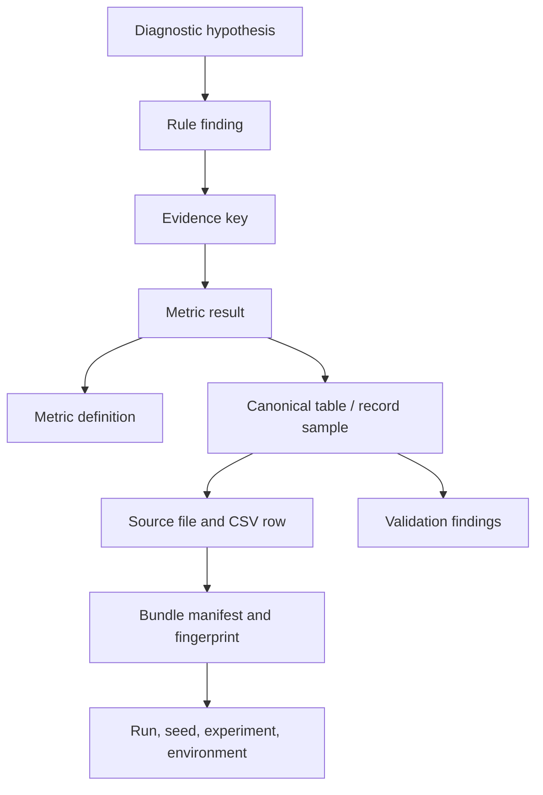

# Provenance Explorer

The Provenance Explorer is a read-only inspection feature for TrafficTwin. It traces displayed
metrics and deterministic diagnostic hypotheses through the implemented pipeline:



Provenance shows how TrafficTwin derived a result from available records and configured rules. It
does not establish real-world causality.

## Implemented Entry Points

The current implementation can start a trace from:

- a run bundle;
- a run context;
- a metric key in an accepted bundle;
- a metric result in an accepted bundle;
- a diagnostic rule result in an accepted bundle;
- a CSV source file and line number;
- an EvidencePack-only diagnostic fixture, with canonical/source-row links marked unavailable.

The primary Streamlit entry point is the `Provenance Explorer` page.

## CLI Examples

```bash
traffictwin provenance metric tests/fixtures/bundles/baseline_valid task.completion.rate
traffictwin provenance rule tests/fixtures/bundles/variation_valid R2
traffictwin provenance source tests/fixtures/bundles/baseline_valid tasks.csv 2
traffictwin provenance export tests/fixtures/bundles/baseline_valid \
  --root-type metric \
  --root-id task.completion.rate \
  --format markdown \
  --output provenance-task-completion.md
```

## Streamlit Workflow

1. Launch the app with `streamlit run src/traffictwin/ui/app.py`.
2. Select or enter a bundle path through the existing bundle workflow.
3. Open `Provenance Explorer`.
4. Choose a trace root:
   - `Metric`;
   - `Diagnostic rule`;
   - `Source file row`;
   - `Run metadata`.
5. Inspect completeness, lineage, grouped nodes, source-row previews, and export buttons.

## Source-Row Inspection

Source-row previews are CSV-only in the current prototype. The preview:

- uses bundle-relative source paths;
- rejects absolute paths and `..` traversal;
- reuses the Phase 2 safe ZIP loader;
- reads only the requested row window;
- shows raw values, canonical values, declared mapping/units, and row-level validation findings;
- returns a structured unavailable result when the original bundle is absent.

## Aggregate Metric Limitation

Metrics such as `task.completion.rate`, `infra.utilisation.p95`, and `trip.duration.p95_s` are
aggregate outputs. The trace reports:

- required canonical tables and fields;
- eligible record counts;
- bounded source-row samples;
- validation findings affecting sampled rows;
- unavailable links where evidence is missing.

It does not assign fabricated contribution weights to individual rows.

## EvidencePack-Only Traces

Phase 5 diagnostic fault-injection fixtures are EvidencePack-level cases. They can trace rule
findings to metric results and metric definitions, but they cannot inspect canonical records or CSV
rows unless the original source bundle is also available. The explorer represents those missing
links as `unavailable_reference` nodes.

## Export Formats

The explorer supports:

- JSON matching the `ProvenanceTrace` schema;
- deterministic Markdown suitable for viva appendices, supervisor review, or debugging notes.

Exports avoid machine-specific absolute paths and do not include large raw tables.

## Related Documents

- [Provenance model](provenance_model.md)
- [Viva traceability demo](viva_traceability_demo.md)
- [EvidencePack specification](evidence_pack_spec.md)
- [Diagnostic report specification](diagnostic_report_spec.md)
- [Standalone demo](standalone_demo.md)
- [Report export](report_export.md)
- [Architecture](architecture.md)
