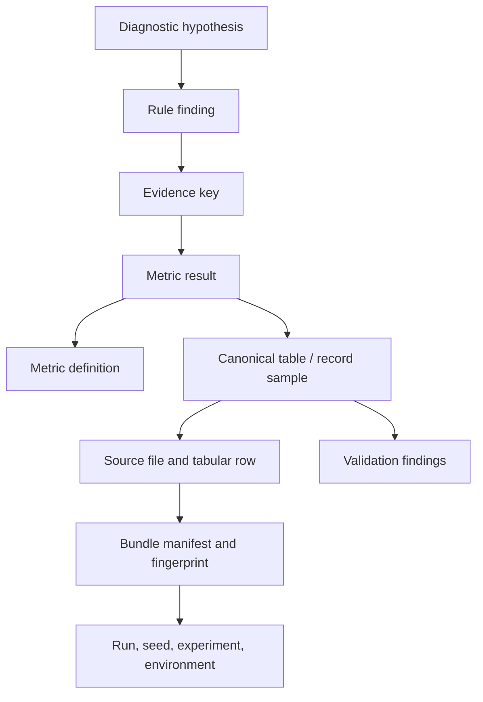

# Provenance Explorer

The Provenance Explorer is a read-only inspection feature for TrafficTwin. It traces displayed
metrics and deterministic diagnostic hypotheses through the implemented pipeline:



Provenance shows how TrafficTwin derived a result from available records and configured rules. It
does not establish real-world causality.

## Implemented Entry Points

The current implementation can start a trace from:

- a run bundle;
- a run context;
- a metric key in an accepted bundle;
- a metric result in an accepted bundle;
- a diagnostic rule result in an accepted bundle;
- a declared CSV, gzip-CSV, or Parquet source file and record number;
- an EvidencePack-only diagnostic fixture, with canonical/source-row links marked unavailable.

The primary Streamlit entry point is the `Provenance Explorer` page.

Compatible comparison-difference lineage is rendered separately in **What-if Compare**, because it
requires two bundle contexts rather than one trace root. It uses the same read-only provenance
library and mandatory non-causality language.

For a trusted custom metric, the result embeds the validated plugin definition and contract
fingerprint. The explorer can therefore show the definition and complete declared-input row ledger
without rediscovering or re-executing plugin code. This remains software lineage, not validation of
the plugin's scientific method.

## CLI Examples

```bash
traffictwin provenance metric tests/fixtures/bundles/baseline_valid task.completion.rate
traffictwin provenance rule tests/fixtures/bundles/variation_valid R2
traffictwin provenance source tests/fixtures/bundles/baseline_valid tasks.csv 2
traffictwin provenance contributors tests/fixtures/bundles/baseline_valid \
  task.latency.mean_ms --format csv --output contribution-ledger.csv
traffictwin provenance difference-contract --format text
traffictwin provenance difference-contributors \
  tests/fixtures/bundles/baseline_valid \
  tests/fixtures/bundles/variation_valid \
  task.completion.rate --format json --output difference-provenance.json
traffictwin provenance graph-contract --format text
traffictwin provenance completeness-contract --format text
traffictwin provenance completeness tests/fixtures/bundles/baseline_valid \
  --report-type run --format csv --output report-claim-completeness.csv
traffictwin provenance export tests/fixtures/bundles/baseline_valid \
  --root-type metric --root-id task.completion.rate \
  --format graphml --max-nodes 120 --max-edges 240 \
  --redaction structure_only --output completion-provenance.graphml
traffictwin provenance window-metric tests/fixtures/bundles/baseline_valid \
  task.generated.count --width-s 5 --start-s 0 --end-s 10 \
  --window-ordinal 0 --format json
traffictwin provenance window-contributors tests/fixtures/bundles/baseline_valid \
  task.generated.count --width-s 5 --start-s 0 --end-s 10 \
  --window-ordinal 0 --output window-ledger.json
traffictwin provenance export tests/fixtures/bundles/baseline_valid \
  --root-type metric \
  --root-id task.completion.rate \
  --format markdown \
  --output provenance-task-completion.md
```

## Streamlit Workflow

1. Launch the app with `streamlit run src/traffictwin/ui/app.py`.
2. Select or enter a bundle path through the existing bundle workflow.
3. Open `Provenance Explorer`.
4. Expand **Report claim provenance completeness (PRO-03)**, choose the run or diagnostics
   template, and inspect the denominator, three class counts, score, exclusions, and complete
   claim table.
5. Choose a trace root:
   - `Metric`;
   - `Diagnostic rule`;
   - `Source file row`;
   - `Run metadata`.
6. Inspect trace completeness, the bounded graph, lineage, grouped nodes, source-row previews, and
   export buttons.
7. In **Graph**, choose node/edge limits and the safe or structure-only disclosure profile, then
   inspect exact omission/redaction counts and a selected node.

## Source-Row Inspection

Source-row previews support manifest-declared CSV, gzip-CSV, and flat scalar Parquet. The preview:

- uses bundle-relative source paths;
- rejects absolute paths and `..` traversal;
- reuses the Phase 2 safe ZIP loader;
- returns only the requested row window after the same bounded decoding used by ingestion;
- shows decoded raw scalar values, canonical values, declared format/compression, mapping/units,
  and row-level validation findings;
- returns a structured unavailable result when the original bundle is absent.

## Aggregate Metric Limitation

Metrics such as `task.completion.rate`, `infra.utilisation.p95`, and `trip.duration.p95_s` are
aggregate outputs. The trace reports:

- required canonical tables and fields;
- eligible record counts;
- bounded source-row samples;
- validation findings affecting sampled rows;
- unavailable links where evidence is missing.

The metric view also exposes an unbounded `MetricContributionReport` ledger containing every
accepted canonical candidate row, its source location, canonical values, eligibility state, and
inclusion reason. It does not assign fabricated contribution weights to individual rows. Rows
rejected before canonicalisation remain in the validation report rather than the accepted-row
ledger.

Window provenance first assigns canonical records to the selected effective `[start,end)` slice
using the versioned table anchors, then applies ordinary metric eligibility and lineage. Excluded
partial windows have no metric collection and fail visibly rather than returning an empty trace.

For a two-run comparison, `DifferenceContributionReport` retains both complete eligibility
ledgers. Direct scalar count/sum/mean/rate formulas expose signed arithmetic terms that must sum to
the ordinary variation-minus-baseline delta. Percentile and other non-decomposable scalar metrics
show the eligible rows with null weights. This is calculation lineage, not causal attribution. See
[Difference provenance](difference_provenance.md).

## EvidencePack-Only Traces

Phase 5 diagnostic fault-injection fixtures are EvidencePack-level cases. They can trace rule
findings to metric results and metric definitions, but they cannot inspect canonical records or CSV
rows unless the original source bundle is also available. The explorer represents those missing
links as `unavailable_reference` nodes.

## Export Formats

The explorer supports:

- JSON matching the `ProvenanceTrace` schema;
- deterministic Markdown suitable for viva appendices, supervisor review, or debugging notes;
- deterministic bounded Graphviz DOT and typed GraphML, with safe or structure-only disclosure;
- complete metric contribution ledgers as JSON or CSV;
- compatible difference-contribution or lineage-only ledgers as JSON or CSV, with the mandatory
  non-causality statement in both formats.
- complete PRO-03 report-claim inventories as JSON or one-denominator-row-per-claim CSV.

Graph exports avoid machine-specific absolute paths, enforce explicit limits, and report exact
omissions. Safe graph mode can still contain domain identifiers and scalar values; it is not an
anonymisation guarantee. See [Provenance graph exports](provenance_graph_exports.md).

## Related Documents

- [Provenance model](provenance_model.md)
- [Difference provenance](difference_provenance.md)
- [Provenance graph exports](provenance_graph_exports.md)
- [Provenance completeness](provenance_completeness.md)
- [Viva traceability demo](viva_traceability_demo.md)
- [EvidencePack specification](evidence_pack_spec.md)
- [Diagnostic report specification](diagnostic_report_spec.md)
- [Standalone demo](standalone_demo.md)
- [Report export](report_export.md)
- [Architecture](architecture.md)
