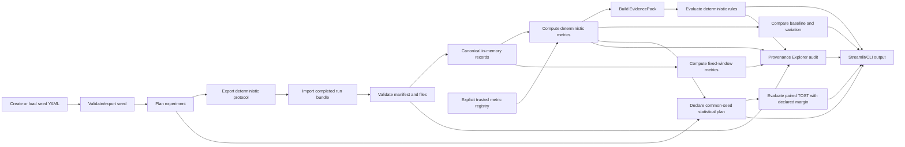
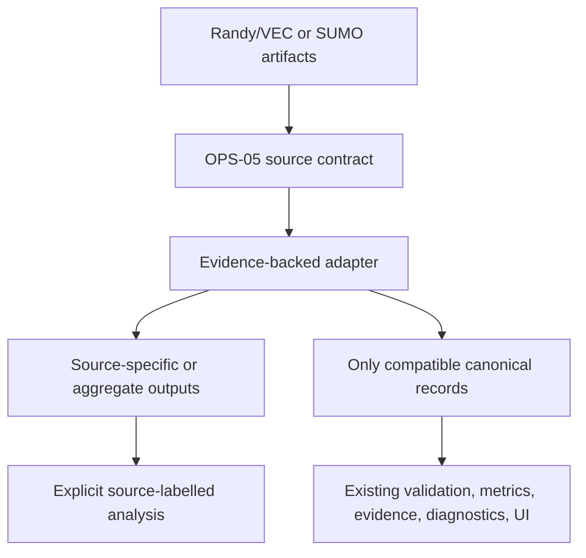

# System Overview

TrafficTwin is a modular what-if experimentation and decision-support prototype for urban traffic
and vehicular edge-computing research. The repository implements the protected vertical slice,
synthetic fixtures, imported CSV/gzip/Parquet bundles, confirmation-gated generic CSV mapping, and bounded public
SUMO 1.27 tripinfo/summary ingestion. Full Randy/VEC conversion, other SUMO outputs, live data, and
launch remain evidence-gated. A closed OPS-05 interface now exposes distinct SUMO and TOS
discovery, validation, semantics, capabilities, provenance, conversion, and blockers without
claiming source equivalence.

## Problem Addressed

The project targets a research workflow where traffic and VEC experiment evidence is scattered across scenario parameters, source files, metrics scripts, plots, and informal interpretation. TrafficTwin turns that workflow into a reproducible pipeline:

```text
scenario seed -> run bundle -> validation -> canonical records -> metrics -> evidence -> diagnostics -> comparison/provenance/UI
```

The goal is not to replace a simulator. The goal is to make imported simulator or environment outputs traceable, validated, comparable, and easier to inspect.

## Platform Vision

The design specification records Sandra's broader vision: a digital-twin-style app for a complex traffic environment, with what-if scenarios, traffic outcomes, VEC outcomes, and decision-support views. The current implementation is a replay-and-scenario research prototype, not a live mirror of Manchester.

OffloadLens is the VEC module within TrafficTwin. It focuses on task completion, latency, decisions, RSU queue/utilisation, offloading behavior, and diagnostic hypotheses about under-offloading, infrastructure pressure, or scenario triviality.

## Current Protected Vertical Slice

Implemented:

- Versioned `ScenarioSeed` YAML.
- Generic run-bundle contract.
- Directory and ZIP bundle validation.
- Manifest-driven plain CSV, gzip-CSV, and flat scalar Parquet canonicalisation.
- Opt-in row/byte-bounded streaming canonicalisation with exact disk-backed global checks.
- Deterministic bounded CSV manifest suggestions that require explicit field/unit confirmation.
- In-memory canonical record tables.
- Deterministic metrics.
- Contract-gated task energy, operational fairness, exact target-RSU outcomes, and named
  source-frame vehicle-grid summaries with explicit unavailable/partial states.
- Explicit trusted local custom metrics with typed canonical inputs, two-run repeatability checks,
  closed outputs, isolated failures, and embedded-contract provenance; no uploaded code or sandbox.
- Deterministic fixed-window metrics with explicit alignment, boundaries, gaps, partial edges,
  coverage semantics, and per-window provenance.
- EvidencePack generation.
- Baseline-versus-variation comparison.
- Predeclared common-seed paired statistical study with a complete compatibility/exclusion audit,
  deterministic bootstrap uncertainty, sign-flip inference, paired effects, and reproducibility
  fingerprints.
- Predeclared per-scenario-family N-way policy ranking over identical complete common-seed rows,
  reusing winner-map ranks/ties/regret and adding deterministic joint-bootstrap mean/rank
  uncertainty; interval overlap is not equivalence and incompatible contracts receive no rank.
- Predeclared paired TOST equivalence testing over the unchanged STA-01 cohort, requiring an
  original-unit margin with basis/justification and both one-sided rejections; failed TOST does not
  prove difference.
- Versioned regression gates over completed metric collections or STA-01 artifacts, requiring an
  approved golden, typed context/source policy, and explicit scalar tolerances; machine outcomes
  separate pass, complete numerical fail, and unavailable comparison.
- Prospective paired common-seed power planning over a declared target effect and paired-difference
  variance, with smallest-integer normal-approximation verification and visible small-sample,
  synthetic, provisional, assumption, and planning-only qualifications.
- Compatible accepted-row difference provenance with reconciled arithmetic for a closed set of
  direct scalar formulas and weight-free eligible lineage for non-decomposable metrics.
- Deterministic bounded provenance graph projection with stable node/edge identities, exact
  omission counts, local-path redaction, structure-only disclosure, DOT/GraphML export, and a thin
  explorer view.
- Explicit report-claim provenance completeness over typed run/diagnostics/comparison/full
  denominators, with unavailable retention, complete accepted-row rules, named exclusions, and a
  null empty-report policy.
- Bounded parameter sweeps over closed seed/synthetic scalar fields, with labelled local fixture
  responses and explicitly unexecuted external requests.
- Deterministic row-dropout, timestamp-jitter, and exact-ID RSU-removal operators over copied,
  validated, explicitly labelled synthetic/evaluation CSV bundles, with exact change provenance,
  no rerouting inference, and no external launch.
- Deterministic diagnostic hypotheses R0-R8, including typed sustained temporal degradation,
  declared-event recovery, exact operational outcome disparity, and contract-gated completed-task
  energy evidence.
- Verified one-axis nearest-flip sensitivity for eligible non-triggered R5/R7/R8 results, with
  unchanged discrete support and no configuration persistence.
- Complete-grid interactive R5/R7/R8 threshold sensitivity with every status retained, sampled
  transitions separated from exact DIA-05 output, and explicit session-only config exchange.
- Deterministic DIA-07 conflict/corroboration/R0-suppression relationships over retained rule
  results, with exact overlap, explicit precedence, unchanged confidence, and no inferred pairs.
- A bounded trusted-local declarative YAML threshold/boolean grammar over existing EvidencePack
  metrics; no arbitrary code, imported formulas, or UI-side rule evaluation.
- Experiment-level EvidencePacks, Triviality analysis, winner maps, and transparent synthetic
  portfolio evaluation.
- Manual protocol execution tracking without launch.
- Read-only Provenance Explorer for metric, diagnostic, source-row, and run traces.
- Streamlit pages for the synthetic/imported workflow.
- CLI commands for validation, metrics, evidence, comparison, registry, diagnostics, and provenance.
- Five-version ordered transactional SQLite registry migration with immutable checksummed history,
  whole-plan rollback, historical payload preservation, and non-mutating status inspection.
- Import-only SUMO 1.27 tripinfo/summary validation, canonical trip metrics, registry import, and
  source-specific summary inspection.
- Runtime-checkable read-only external-source discovery and inspection with exact fail-closed
  markers, deterministic portable reports, a SUMO partial-canonical profile, and a TOS
  aggregate-summary profile.

Synthetic-only:

- Baseline and variation bundles.
- Partial and invalid bundles.
- Fault-injection diagnostic cases.
- S5 stadium-event/RSU-siting and S6 road-clearing/lane-closure workflow fixtures.

Blocked:

- Full Randy/VEC canonical converter and launcher.
- SUMO FCD, detector, network, and unsupported-version adapters.
- Direct launch.
- Near-live and true-live data.

## User Roles

| Role | Current support | Notes |
|---|---|---|
| Dissertation author/developer | Implemented | Runs tests, updates docs, extends adapters after evidence is supplied. |
| Research supervisor/examiner | Implemented | Can inspect architecture, reproducibility, limitations, and demo flow. |
| Traffic/VEC researcher | Partially implemented | Can use synthetic and generic imported bundles; real environment support is blocked. |
| Traffic operator | Future work | Requires real data, external validation, and user evaluation. |

## Current Workflow



The protocol is a manual coordination artifact while direct launch is unavailable. Suggested slot,
run, and bundle identifiers make later manifest matching auditable; they do not establish that an
external environment executed the plan correctly.

## Why Import-First

Import-first is the safe baseline because Randy/VEC and SUMO execution details are not evidenced in the repository. The architecture can accept direct launch later, but only as an adapter capability after a real headless command, runtime behavior, output directory contract, and failure semantics are documented and tested.

This protects the dissertation from fabricated simulator claims and keeps reproducibility centred on files that can be inspected.

## Synthetic Fixtures And Future Real Integration

The synthetic fixtures are hand-auditable engineering fixtures. They prove that the TrafficTwin pipeline works end to end, but they do not prove real-world diagnostic validity.

Future real integration should produce standard TrafficTwin run bundles from real artifacts:



The adapter may map only semantically compatible fields into canonical records; other evidence stays
source-specific or unavailable. It must not bypass validation, metrics, EvidencePack, diagnostic,
permission, or provenance boundaries.

## What Is Not Implemented

- No real Manchester data ingestion.
- No Randy/VEC schema mapping.
- No SUMO FCD, detector, or network parser; tripinfo and summary support is bounded to 1.27.x.
- No live dashboard.
- No launch button that runs external simulation.
- No LLM-generated recommendations.
- No XAI instrumentation.
- No uploaded, remote, automatically discovered, or sandboxed custom metric execution; the
  implemented extension API is explicit trusted local application code only.
- No trained or externally calibrated portfolio selector; the available ruleset is a transparent
  synthetic prototype only.
- No externally validated diagnostic claims.

Related documents:

- [Architecture](architecture.md)
- [Implementation status](implementation-status.md)
- [Provenance Explorer](provenance_explorer.md)
- [Provenance graph exports](provenance_graph_exports.md)
- [Experiment research tools](experiment_research_tools.md)
- [Randy/SUMO artifact inventory](integration/randy_artifact_inventory.md)
- [SUMO output adapter](integration/sumo_output_adapter.md)
- [Limitations and future work](limitations_and_future_work.md)
