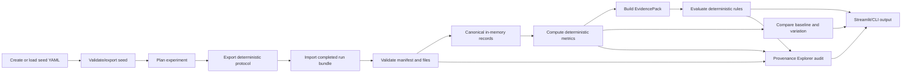
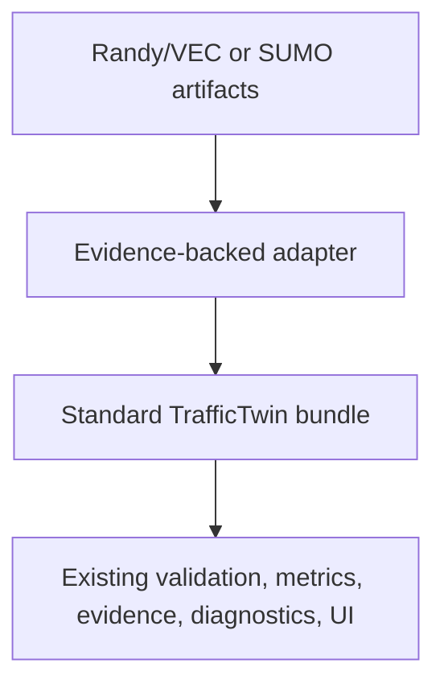

# System Overview

TrafficTwin is a modular what-if experimentation and decision-support prototype for urban traffic and vehicular edge-computing research. The current repository implements the protected vertical slice using synthetic fixtures and imported run bundles; real Randy/VEC and SUMO integration is deliberately blocked until source artifacts, schemas, units, and execution contracts are available.

## Problem Addressed

The project targets a research workflow where traffic and VEC experiment evidence is scattered across scenario parameters, source files, metrics scripts, plots, and informal interpretation. TrafficTwin turns that workflow into a reproducible pipeline:

```text
scenario seed -> run bundle -> validation -> canonical records -> metrics -> evidence -> diagnostics -> comparison/provenance/UI
```

The goal is not to replace a simulator. The goal is to make imported simulator or environment outputs traceable, validated, comparable, and easier to inspect.

## Platform Vision

The design specification records Sandra's broader vision: a digital-twin-style app for a complex traffic environment, with what-if scenarios, traffic outcomes, VEC outcomes, and decision-support views. The current implementation is a replay-and-scenario research prototype, not a live mirror of Manchester.

OffloadLens is the VEC module within TrafficTwin. It focuses on task completion, latency, decisions, RSU queue/utilisation, offloading behavior, and diagnostic hypotheses about under-offloading, infrastructure pressure, or scenario triviality.

## Current Protected Vertical Slice

Implemented:

- Versioned `ScenarioSeed` YAML.
- Generic run-bundle contract.
- Directory and ZIP bundle validation.
- Manifest-driven CSV canonicalisation.
- In-memory canonical record tables.
- Deterministic metrics.
- EvidencePack generation.
- Baseline-versus-variation comparison.
- Deterministic diagnostic hypotheses R0-R3.
- Read-only Provenance Explorer for metric, diagnostic, source-row, and run traces.
- Streamlit pages for the synthetic/imported workflow.
- CLI commands for validation, metrics, evidence, comparison, registry, diagnostics, and provenance.

Synthetic-only:

- Baseline and variation bundles.
- Partial and invalid bundles.
- Fault-injection diagnostic cases.

Blocked:

- Randy/VEC adapter.
- SUMO adapter.
- Direct launch.
- Near-live and true-live data.

## User Roles

| Role | Current support | Notes |
|---|---|---|
| Dissertation author/developer | Implemented | Runs tests, updates docs, extends adapters after evidence is supplied. |
| Research supervisor/examiner | Implemented | Can inspect architecture, reproducibility, limitations, and demo flow. |
| Traffic/VEC researcher | Partially implemented | Can use synthetic and generic imported bundles; real environment support is blocked. |
| Traffic operator | Future work | Requires real data, external validation, and user evaluation. |

## Current Workflow



The protocol is a manual coordination artifact while direct launch is unavailable. Suggested slot,
run, and bundle identifiers make later manifest matching auditable; they do not establish that an
external environment executed the plan correctly.

## Why Import-First

Import-first is the safe baseline because Randy/VEC and SUMO execution details are not evidenced in the repository. The architecture can accept direct launch later, but only as an adapter capability after a real headless command, runtime behavior, output directory contract, and failure semantics are documented and tested.

This protects the dissertation from fabricated simulator claims and keeps reproducibility centred on files that can be inspected.

## Synthetic Fixtures And Future Real Integration

The synthetic fixtures are hand-auditable engineering fixtures. They prove that the TrafficTwin pipeline works end to end, but they do not prove real-world diagnostic validity.

Future real integration should produce standard TrafficTwin run bundles from real artifacts:



The adapter step may map real logs, XML, or generated CSV into the existing canonical records. It must not bypass validation, metrics, EvidencePack, or diagnostic boundaries.

## What Is Not Implemented

- No real Manchester data ingestion.
- No Randy/VEC schema mapping.
- No SUMO FCD, tripinfo, detector, or network parser.
- No live dashboard.
- No launch button that runs external simulation.
- No LLM-generated recommendations.
- No XAI instrumentation.
- No portfolio selector.
- No externally validated diagnostic claims.

Related documents:

- [Architecture](architecture.md)
- [Implementation status](implementation-status.md)
- [Provenance Explorer](provenance_explorer.md)
- [Randy/SUMO artifact inventory](integration/randy_artifact_inventory.md)
- [Limitations and future work](limitations_and_future_work.md)
