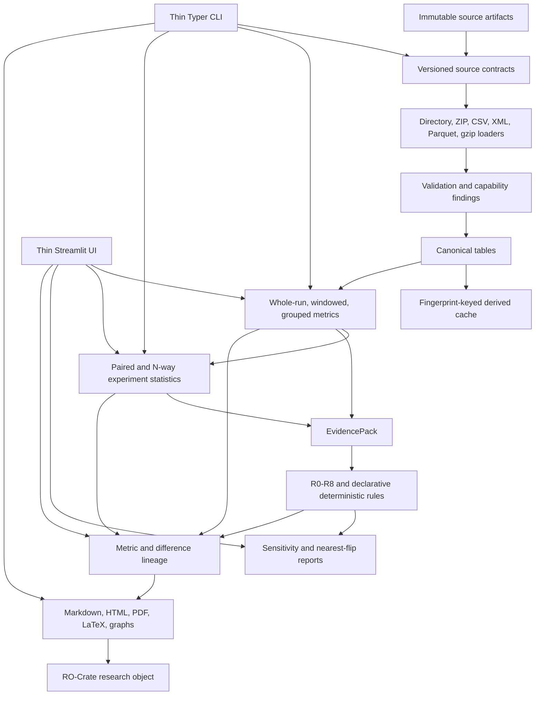

# TrafficTwin — Design Specification (v0.5)

**Working title:** TrafficTwin — a deterministic, import-first experimentation and
decision-support platform for urban traffic and vehicular edge computing, with OffloadLens as its
VEC analysis module
**Project:** Dynamic Resource Management for Intelligent Transportation System Applications
(Project 237)
**Author:** Abdulla Al Mamun Akash
**Status:** Repository-owner-approved design target; planned capabilities are not implementation claims
**Date:** 19 July 2026

> v0.5 supersedes v0.4 for future product and architecture decisions. The
> [v0.4 proposal](traffictwin-design-v0_4.md) remains the historical rationale and supervisor-
> meeting traceability record. Current implementation truth remains in
> [implementation-status.md](implementation-status.md).

## 1. Purpose and changes from v0.4

TrafficTwin remains a modular replay-and-scenario research prototype that imports completed run
evidence, validates it, canonicalises supported fields, computes deterministic metrics, builds
EvidencePacks, evaluates deterministic diagnostic hypotheses, compares experiments, and traces
outputs back to accepted source evidence. Manchester and Randy's TOS/VEC artifacts remain case
studies, not architectural boundaries.

v0.5 retains the existing v0.4 vertical slice and adds a complete design for:

- public SUMO result ingestion and a general external-source adapter contract;
- larger and more varied import workflows;
- temporal, energy, fairness, spatial, and extensible metrics;
- experiment-level deterministic statistics and regression checks;
- temporal, fairness, and energy diagnostic rules;
- declarative rule authoring and threshold sensitivity analysis;
- comparison-difference lineage and provenance completeness;
- parameter sweeps and robustness mutations;
- research-oriented exports, annotations, archival objects, and operational tooling.

This document intentionally contains no calendar or delivery estimates. Capabilities advance only
when their evidence and acceptance gates are satisfied.

## 2. Non-negotiable constraints

These constraints apply to every v0.5 capability.

1. **Import-first is guaranteed.** Direct Randy/VEC or SUMO execution remains unsupported until a
   separately evidenced launcher contract exists. A SUMO *output adapter* does not imply a SUMO
   launcher.
2. **All computations are deterministic.** Metrics, statistical estimates, diagnostic rules,
   sensitivity results, provenance, rankings, power calculations, and regression decisions are
   produced by versioned code. Resampling algorithms use explicit recorded seeds.
3. **Unavailable is not zero.** Missing, invalid, incompatible, or semantically unresolved evidence
   produces an explicit unavailable state with a reason code.
4. **Raw inputs are immutable.** Original CSV, XML, Parquet, compressed, NPZ, and metadata files are
   fingerprinted and preserved unchanged. Derived caches and canonical tables are separate.
5. **Synthetic evidence stays labelled synthetic.** Synthetic fixtures, mutations, dropout models,
   parameter sweeps, mock participant data, and derived reports cannot be presented as real-world
   or externally validated results.
6. **No fabricated integration.** Unknown Randy, VEC, SUMO, Manchester, sensor, energy, vehicle-tier,
   RSU-target, spatial, or execution semantics remain unknown or unavailable.
7. **Thin interfaces.** Streamlit and Typer collect inputs and render typed library outputs; they do
   not contain scientific formulas, statistical tests, diagnostic calculations, or provenance
   derivation.
8. **EvidencePack remains the diagnostic boundary.** Rules cannot read raw files or silently
   recalculate metrics.
9. **Lineage is not causality.** Difference provenance identifies deterministic contributors and
   arithmetic lineage. It must not claim that a row, vehicle, RSU, or incident caused an outcome.
10. **Annotations cannot rewrite evidence.** Analyst notes are clearly separated from computed
    findings and cannot change metric values, rule statuses, fingerprints, or provenance.
11. **No live-data, LLM, or direct-simulation expansion is introduced by v0.5.** The existing
    deterministic findings renderer may restate already-computed findings, but no LLM may calculate,
    diagnose, rank, attribute, or recommend.
12. **Public data requires provenance and permission.** Public SUMO fixtures record source URL,
    version, licence, retrieval date, checksums, and any redistribution restrictions.

## 3. Research questions and intended contributions

### 3.1 Research questions

- **RQ1 — Interoperability:** Can an import-first canonical contract support synthetic TrafficTwin
  bundles, public SUMO outputs, and evidenced external result packages without fabricating absent
  semantics?
- **RQ2 — Temporal insight:** Do time-windowed metrics reveal degradation, incidents, and recovery
  patterns hidden by whole-run aggregates?
- **RQ3 — Experimental evidence:** Can deterministic common-seed statistics quantify effect,
  uncertainty, equivalence, and required sample size across repeated experiments?
- **RQ4 — Diagnostic transparency:** How stable are deterministic diagnostic hypotheses to
  threshold choices, missing evidence, noise, and controlled mutations?
- **RQ5 — Extensibility:** Can declarative metric and rule contracts extend the framework while
  preserving evidence requirements, provenance, deterministic execution, and unavailable states?
- **RQ6 — Traceability:** Can comparison differences be traced to accepted contributing evidence
  without making causal claims?
- **RQ7 — Research reproducibility:** Can TrafficTwin emit regression-checkable, citable research
  objects and dissertation-ready artifacts from the same versioned evidence pipeline?

### 3.2 Intended contributions

The v0.5 design aims to support, subject to implementation and evaluation evidence:

1. an evidenced public SUMO-output ingestion path and reusable external-source contract;
2. a deterministic temporal and multi-run statistical analysis layer;
3. a sensitivity-auditable, declaratively extensible diagnostic-rule framework;
4. comparison-difference lineage over accepted source contributors;
5. systematic robustness evaluation through parameter sweeps, mutations, and measurement-noise
   models;
6. reproducible research exports spanning LaTeX, regression gates, provenance graphs, and RO-Crate.

These are intended contributions, not claims of effectiveness. Dissertation claims require the
evaluation specified in §11.

## 4. Status and capability semantics

Every capability has one of four states:

| State | Meaning |
|---|---|
| `implemented` | Code, tests, documentation, and evidence gates exist in the current repository. |
| `partial` | A bounded subset exists; unsupported portions remain explicit. |
| `planned` | Approved by this design but not yet implemented. |
| `blocked` | Design exists, but required data, semantics, permission, or external evidence is absent. |

Adding a capability to this document changes its design state only. It does not change the
implementation state, feature matrix, public claims, or capability manifest.

The existing v0.4 standalone/import-first product, R0–R5, accepted-row contribution ledgers,
synthetic portfolio study, report formats, replay, and read-only TOS workbench are the v0.5
baseline. The new catalogue in §7 begins as `planned` unless a row explicitly identifies an
existing partial foundation.

## 5. Layered architecture



### 5.1 Dependency direction

- Loaders may inspect bytes and container structure but cannot invent semantics.
- Adapters map evidenced source fields into canonical records and validation findings.
- Metrics consume canonical records and evidence availability, never source files directly.
- Statistical studies consume compatible versioned metric collections.
- Rules consume EvidencePacks only.
- Sensitivity tools call the same rule engine with explicit alternative configurations.
- Provenance traces existing calculations; it does not recompute them.
- Reports and research objects render or package existing typed artifacts.
- UI and CLI call library services and contain no scientific computation.

### 5.2 Extensibility boundaries

The custom metric and YAML-rule mechanisms are trusted local extensions, not arbitrary uploaded
code execution. Each extension declares its identifier, version, required evidence, units,
determinism contract, unavailable behavior, output schema, and provenance mapping. Invalid,
ambiguous, duplicate, or cyclic definitions are rejected before evaluation.

## 6. New and extended domain artifacts

The exact schemas require ADRs before implementation, but v0.5 reserves the following concepts:

| Artifact | Required meaning |
|---|---|
| `SourceContract` | Source identity, version, licence/permission, units, field semantics, supported capabilities, and blockers. |
| `CanonicalisationManifest` | Confirmed mappings selected by the user, including any deterministic inference suggestions and their confirmation state. |
| `MetricScope` | Whole run, fixed window, vehicle tier, RSU, spatial group, task class, or another declared grouping. |
| `MetricWindow` | Half-open interval `[start, end)`, width, alignment origin, coverage, and partial-window policy. |
| `StatisticalStudy` | Compatible run IDs, pairing keys, estimand, method, resampling seed, repetitions, assumptions, exclusions, and results. |
| `RuleDefinition` | Versioned YAML rule declaration with evidence requirements, predicates, outputs, and insufficiency behavior. |
| `SensitivityReport` | Evaluated threshold grid, trigger stability, flip boundaries, source rule configuration, and deterministic fingerprint. |
| `NearestFlip` | Smallest admissible threshold/configuration change that changes one rule status, with ties and constraints explicit. |
| `DifferenceContributionReport` | Baseline/variation contributors, eligibility, arithmetic contribution where defined, grouping, exclusions, and non-causality warning. |
| `ProvenanceCompletenessReport` | Claim inventory, trace depth, complete/aggregate/unavailable classifications, numerator, denominator, and exclusions. |
| `MutationManifest` | Parent fingerprint, deterministic mutation operator, parameters, seed, changed rows/files, and synthetic label. |
| `AnalystAnnotation` | Author label, timestamp, target artifact, note, decision label, and immutable separation from computed evidence. |
| `ResearchObjectManifest` | Checksummed inventory connecting raw bundle, canonical contract, metrics, evidence, diagnostics, provenance, reports, software version, and citation metadata. |

## 7. Complete v0.5 capability catalogue

### 7.1 Ingestion and adapters

| ID | Capability | Design requirement and acceptance evidence | Initial state |
|---|---|---|---|
| `ING-01` | SUMO output adapter | Parse evidenced `tripinfo.xml` and `summary.xml`; add FCD only with an explicit mapping. Validate against a legally reusable public scenario, preserve raw XML, emit stable validation codes, and never imply launch support. | implemented; see ADR-011 |
| `ING-02` | Manifest inference wizard | Deterministically suggest mappings from headers and bounded value patterns. The user must confirm or edit the draft; inferred mappings cannot silently enter analysis. Golden tests cover stable suggestions and rejection of ambiguity. | implemented; see ADR-012 |
| `ING-03` | Parquet and gzipped-CSV input | Admit declared Parquet and gzip files through the same manifest, validation, fingerprint, unit, and provenance contracts as CSV. Compression does not change logical bundle identity rules without a documented decision. | implemented; see ADR-013 |
| `ING-04` | Batch bundle import | Validate/import an explicit glob or path set with per-bundle and consolidated summaries. One failed bundle cannot corrupt or relabel another; idempotency and conflict behavior remain unchanged. | implemented; see ADR-014 |
| `ING-05` | Chunked/streaming canonicalisation | Provide memory-bounded parsing with output equivalence to ordinary ingestion. Benchmarks record memory and runtime on generated large fixtures; chunk boundaries cannot change results. | implemented; see ADR-015 |

### 7.2 Metrics

| ID | Capability | Design requirement and acceptance evidence | Initial state |
|---|---|---|---|
| `MET-01` | Time-windowed metrics | Compute every *applicable* metric over fixed configurable windows with declared boundary, alignment, coverage, and partial-window semantics. Windowed results carry the same availability and provenance guarantees as whole-run results. | implemented; see ADR-016 |
| `MET-02` | Complete latency percentile family | Retain existing P50/P95 and add P99 using the versioned percentile method. Small-sample behavior and unavailable states are explicit; golden projections prove exact values. | implemented |
| `MET-03` | Energy metric family | Add per-task energy, energy per completed task, and energy-delay product only when source unit and eligibility semantics are confirmed. Cross-source comparison requires compatible contracts. | implemented for explicit generic/synthetic v1.0 contracts; SUMO/TOS canonical family unavailable |
| `MET-04` | Fairness metric family | Promote and extend existing Jain load-balance evidence with explicitly grouped vehicle-tier/RSU disparity measures. Do not infer protected or demographic attributes; require group coverage and minimum support. | implemented for evidenced generic/synthetic operational groups; SUMO/TOS unavailable; see ADR-019 |
| `MET-05` | Spatial and per-RSU breakdowns | Compute per-RSU completion, load, miss, and supported spatial summaries only when task-to-target or location joins are evidenced. Unknown targets/coordinates remain unavailable. | implemented for explicitly contracted generic/synthetic target and source-coordinate evidence; SUMO/TOS unavailable; see ADR-020 |
| `MET-06` | Custom metric plugin API | Register trusted deterministic metric functions that declare inputs, units, scopes, availability rules, version, and provenance. Contract, determinism, duplicate-key, and failure-isolation tests are mandatory. | implemented as explicit trusted in-process registration; no uploaded/dynamic code; see ADR-021 |

### 7.3 Diagnostic rules and sensitivity

| ID | Capability | Design requirement and acceptance evidence | Initial state |
|---|---|---|---|
| `DIA-01` | R6 temporal degradation/drift | Evaluate sustained within-run deterioration and post-event recovery over compatible windowed metrics. Require minimum windows/coverage and separate deterioration from missing intervals. | implemented over typed fixed-window EvidencePack evidence with optional declared event context; see ADR-022 |
| `DIA-02` | R7 tier/spatial fairness | Detect supported outcome disparity while retaining alternatives and insufficiency states. Implement the reference rule through the declarative mechanism where evidence permits. | implemented for evidenced generic/synthetic operational vehicle-tier or exact target-RSU completion; SUMO/TOS unavailable; see ADR-023 |
| `DIA-03` | R8 energy anomaly | Compare energy cost with completed work using compatible energy evidence; do not trigger from missing energy or mixed units. | implemented over exact canonical v1.0 completed-task energy with provisional synthetic-development configuration; SUMO/TOS unavailable; see ADR-024 |
| `DIA-04` | Declarative YAML rule authoring | Compile bounded threshold/boolean rules into ordinary `RuleResult` evaluation with evidence citations and insufficiency handling. No arbitrary code, imports, formulas outside the supported grammar, or UI-side evaluation. | implemented as a closed trusted-local static YAML grammar over EvidencePack metrics; see ADR-023 |
| `DIA-05` | Nearest-flip analysis | For an eligible non-triggered rule, return the smallest admissible configuration change that flips status. Report ties, discrete constraints, unsupported rules, and the fact that this is sensitivity—not a recommended threshold. | implemented for verified single-boundary R5/R7/R8 analysis; compound and arbitrary declarative rules remain explicit unsupported; see ADR-025 |
| `DIA-06` | Interactive threshold-sensitivity explorer | UI controls call a library sweep service, show trigger stability and flip boundaries, label provisional defaults, and never persist changed defaults without an explicit config export/import action. | implemented for bounded complete-grid R5/R7/R8 sweeps with session-only explicit complete-config exchange; see ADR-026 |
| `DIA-07` | Cross-rule reasoning | Record deterministic conflict, corroboration, or suppression using explicit precedence/evidence-overlap rules. Do not invent probabilistic confidence; suppression must retain the original result and its reason. | implemented as a bounded additive R0/R1/R2/R4 policy; undeclared pairs remain unclassified; see ADR-027 |

### 7.4 Comparison and statistics

| ID | Capability | Design requirement and acceptance evidence | Initial state |
|---|---|---|---|
| `STA-01` | Experiment-level statistical comparison | Aggregate compatible common-seed replicates, declare the estimand, and produce paired differences, deterministic seeded-bootstrap intervals, justified permutation/randomisation tests, and appropriate effect sizes. Cliff's delta may be reported where its assumptions fit, but is not automatically the primary effect size for paired data. Method choice must be recorded in an ADR and validated on known distributions. | implemented as one strict baseline-versus-variation common-seed study with paired bootstrap, sign-flip inference, paired effect sizes, and complete exclusion/provenance audit; see ADR-028 |
| `STA-02` | N-way comparison and ranking | Compare multiple compatible policies/runs with explicit objective direction, ties, missingness, and uncertainty. Extend rather than duplicate the existing winner map. Incompatible contracts are excluded, not ranked. | implemented as per-scenario-family common-seed policy ranking with joint paired bootstrap; see ADR-029 |
| `STA-03` | Equivalence testing | Implement TOST or another predeclared method with a justified equivalence margin. Never interpret ordinary non-significance as equivalence. | implemented as predeclared paired-mean TOST over the STA-01 common-seed cohort; see ADR-030 |
| `STA-04` | Regression gate | Compare a validated bundle/study with a versioned golden contract and explicit tolerances; return machine-readable pass/fail/unavailable outcomes suitable for CI. | implemented for completed MetricCollection and STA-01 artifacts with approved goldens, typed compatibility/source policies, and scalar tolerance audits; see ADR-031 |
| `STA-05` | Power analysis helper | Estimate required common-seed replicates from declared effect, variance, alpha, target power, and method assumptions. Label small-sample or synthetic estimates appropriately. | implemented as prospective two-sided paired-mean normal-approximation planning with explicit bases/labels and typed unavailable states; see ADR-032 |

### 7.5 Provenance

| ID | Capability | Design requirement and acceptance evidence | Initial state |
|---|---|---|---|
| `PRO-01` | Difference provenance | Extend accepted-row ledgers to compatible baseline/variation comparisons. For decomposable metrics, expose arithmetic contributions; for percentile or non-decomposable metrics, expose eligible lineage without fabricated weights. JSON/CSV exports carry a non-causality statement. | implemented for ordinary compatible generic/synthetic scalar comparisons; see ADR-033 |
| `PRO-02` | Provenance graph export and view | Export deterministic DOT and GraphML from the existing trace DAG and render a bounded explorer view. Node/edge IDs, labels, redaction, and path safety remain stable. | implemented with bounded root-centred views, safe/structure-only disclosure, and stable DOT/GraphML; see ADR-034 |
| `PRO-03` | Provenance completeness score | Inventory report claims and classify each as source-row complete, aggregate-only, or unavailable. Publish the denominator, exclusions, and trace-depth rules so the score cannot conceal missing claims. | implemented for typed generic/import-first run, diagnostics, comparison, and full reports; see ADR-035 |

### 7.6 Experiments and synthetic robustness

| ID | Capability | Design requirement and acceptance evidence | Initial state |
|---|---|---|---|
| `EXP-01` | Parameter sweep composer | Expand a bounded declared grid into deterministic seeds/bundles or external run requests, execute only supported local analysis, and emit response-surface data with full parameter provenance. It must not imply unsupported simulator execution. | implemented for strict seed/synthetic bases, labelled local synthetic bundles, and explicitly unexecuted external requests; see ADR-036 |
| `EXP-02` | Scenario mutation operators | Apply controlled deterministic mutations such as row dropout, timestamp jitter, or RSU removal to copied synthetic/evaluation fixtures. Record exact changes and parent fingerprint; never mutate raw source evidence in place. | implemented for one closed operator over an ordinary-valid labelled synthetic/evaluation CSV bundle copy; see ADR-037 |
| `EXP-03` | Noise and dropout models | Add explicit measurement-imperfection parameters to the synthetic generator, with deterministic seeds, bounded distributions, validation, and synthetic labels. Use them for robustness evaluation, not real-sensor claims. | implemented as a closed bounded-uniform generated-observation layer with exact seeded row dropout and a typed manifest audit; see ADR-038 |

### 7.7 Reporting and UI

| ID | Capability | Design requirement and acceptance evidence | Initial state |
|---|---|---|---|
| `REP-01` | LaTeX export | Emit escaped `.tex` fragments for metric, comparison, statistical, and rule tables plus deterministic SVG/PDF figures. Fixtures compile in a minimal document and contain no absolute local paths. | implemented through one bounded typed projection, shared output fingerprint, explicit source mode, path-safe escaped LaTeX2e, deterministic SVG/invariant PDF, exact-file publication, CLI/UI/library workflows, golden fixtures, and real minimal-document compilation; see ADR-039 |
| `REP-02` | Analyst annotations | Attach append-only notes/decisions to typed artifact references in the registry. Reports distinguish analyst-authored text from computed findings and preserve history. | implemented through typed path-free targets, registry-verified stored references, database-enforced append-only history, bounded pagination, report attachment, CLI/UI/library workflows, and distinct Markdown/HTML/PDF rendering; see ADR-040 |
| `REP-03` | Report diffing | Compare compatible structured report payloads before rendering and classify added, removed, changed, and unavailable sections. Do not diff rendered prose as scientific evidence. | implemented through prose-free typed claim snapshots, strict compatibility, canonical JSON Pointer changes, bounded JSON/Markdown exports, and CLI/UI/library workflows; see ADR-041 |
| `REP-04` | One-page executive summary | Render a bounded supervisor-facing summary from existing computed artifacts with source mode, limitations, availability, and provenance links visible. It cannot omit warnings to fit the page. | implemented through a typed five-highlight projection, complete availability/warning/limitation retention, relative provenance links, four renderers, and fail-closed single-page A4 verification; see ADR-042 |
| `REP-05` | Full-text registry search | Search findings, annotations, report metadata/text, runs, experiments, and evidence references with deterministic ranking and clear category labels. Search is read-only and respects source redaction policy. | implemented through an on-demand six-category typed projection, read-only SQLite mode, bounded direct report-text ingestion, pre-match local-path redaction, published lexical ranking/ties, CLI/UI/library workflows, and exact result fingerprints; see ADR-043 |

### 7.8 Infrastructure and research outputs

| ID | Capability | Design requirement and acceptance evidence | Initial state |
|---|---|---|---|
| `OPS-01` | Registry schema migrations | Replace additive ad-hoc upgrades with versioned, ordered, transactional migrations. Test upgrades from representative historical schemas, idempotency, rollback on failure, and data preservation. | implemented for five ordered SQLite versions plus known unversioned repository-era schemas; see ADR-044 |
| `OPS-02` | Canonical-table caching | Cache derived canonical tables in Parquet or an equivalently typed format keyed by raw fingerprint, adapter version, manifest mapping, and canonical schema. Stale or incompatible caches are rejected and never replace raw evidence. | implemented for accepted ordinary generic bundles with six typed Parquet tables, exact cold/warm equivalence, content-addressed invalidation, and fail-closed verification; see ADR-045 |
| `OPS-03` | `traffictwin doctor` | Report Python/dependency versions, optional integrations, registry/workspace integrity, permissions, cache status, and capability blockers without changing state by default. | implemented as a typed always-read-only v1 command with immutable registry inspection, bounded workspace checks, OPS-02 cache verification, explicit status/exit semantics, complete adapter capability summaries, and no repair mode; see ADR-046 |
| `OPS-04` | RO-Crate archival export and citation | Package raw/approved evidence references, fingerprints, metrics, EvidencePack, diagnostics, provenance, reports, software metadata, licence/permission statements, and `CITATION.cff` into a checksummed research object. Unsupported private data is referenced or excluded according to policy. | implemented for accepted ordinary generic bundles with explicit embed/reference/exclude policy, deterministic attached RO-Crate 1.3/CFF 1.2, offline verification, and atomic publication; see ADR-047 |
| `OPS-05` | Generalised external-source contract | Extract the evidenced TOS boundary into a documented adapter interface covering discovery, validation, semantics, capabilities, provenance, conversion level, and blockers. TOS and public SUMO become reference implementations without being forced into false equivalence. | implemented through a closed runtime-checkable v1 interface, exact fail-closed discovery, portable inspection, distinct SUMO partial-canonical and TOS aggregate-summary reference contracts, and no dynamic adapter loading; see ADR-048 |

## 8. Primary workflows

### 8.1 Public SUMO import

```text
public source + licence metadata
    -> immutable XML fingerprint
    -> SourceContract
    -> SUMO structural/semantic validation
    -> supported canonical trips/traffic/vehicle records
    -> metrics and availability
    -> provenance and research-object export
```

Unsupported SUMO elements remain in the raw artifact and validation inventory. A public SUMO
adapter does not confirm compatibility with Randy's private pipeline.

### 8.2 Temporal diagnosis

```text
canonical timestamps
    -> declared fixed windows
    -> windowed MetricCollections
    -> temporal EvidencePack
    -> R6
    -> threshold sweep + nearest flip
    -> comparison/provenance/report
```

Window boundaries, empty windows, incomplete final windows, incident alignment, and recovery
horizons must be declared before an R6 result is admissible.

### 8.3 Multi-run statistical study

```text
experiment protocol
    -> compatible completed bundles
    -> common-seed pairing audit
    -> declared estimand/method
    -> deterministic statistics
    -> effect/uncertainty/equivalence/power outputs
    -> provenance and regression contract
```

Statistical tests cannot repair incompatible policy, checkpoint, metric, environment, unit, or
seed provenance.

### 8.4 Extensible diagnostics

```text
validated RuleDefinition YAML
    -> supported grammar
    -> evidence-key/type check
    -> compiled deterministic evaluator
    -> ordinary RuleResult
    -> sensitivity and provenance
```

R7 is the reference proof of the declarative mechanism. R8 is a separate deterministic core rule
over exact canonical completed-task energy and denominator evidence. Its default is explicitly
provisional synthetic-development configuration; only sources that satisfy `MET-03` are eligible.

### 8.5 Robustness evaluation

```text
labelled parent fixture
    -> deterministic sweep/mutation/noise manifest
    -> ordinary validation/metrics/evidence/rules
    -> stability and failure-case report
```

Every derived case remains synthetic or mutated-evaluation evidence and retains its parent link.

## 9. Deterministic statistical and sensitivity policy

- The analysis plan declares primary metric, objective, pairing key, estimand, method, effect size,
  interval/test parameters, resampling seed, and multiple-comparison handling before results are
  inspected.
- Paired common-seed designs use paired estimators and paired resampling. An unpaired effect size is
  not used as the primary paired estimate without a written justification.
- Bootstrap and permutation/randomisation procedures record algorithm version, seed, repetition
  count, and exact eligible observations.
- Equivalence margins come from a documented practical threshold, literature, or explicitly
  provisional design choice; they are not chosen after seeing results.
- Power calculations state their distributional/method assumptions and are planning aids, not
  guarantees.
- Sensitivity sweeps report the entire evaluated grid and stability, not only the most favourable
  threshold.
- Nearest-flip output describes a mathematical boundary, not a recommendation to change the rule.
- Cross-rule reasoning uses explicit deterministic precedence and overlap rules, not invented
  confidence probabilities.

## 10. Presentation and research-integrity policy

- All views show source mode: synthetic, imported historical, public third-party simulation, or
  unavailable.
- Windowed charts show interval semantics and coverage.
- Statistical views show `n`, pairing/exclusion counts, method, effect, uncertainty, and assumptions.
- Fairness/energy/spatial views show evidence coverage and cannot collapse unavailable groups into
  zero.
- Difference-provenance views use *contributor*, *lineage*, and *arithmetic contribution* language,
  never causal attribution.
- Analyst annotations are visually and structurally distinct from computed findings.
- Executive summaries retain warnings, limitations, and links to detailed evidence.
- LaTeX, PDF, HTML, Markdown, graph, CSV, JSON, and RO-Crate outputs derive from the same typed
  artifacts and must reconcile.

## 11. Evaluation and acceptance gates

### 11.1 Correctness

- Golden tests cover public fixture projections, percentile values, windows, statistics,
  declarative-rule compilation, sensitivity boundaries, difference lineage, report fragments, and
  regression outcomes where exact output is expected.
- Property tests cover determinism, window partition invariants, streaming/non-streaming
  equivalence, metric eligibility, rule monotonicity where mathematically required, and mutation
  reproducibility.
- Registry migration tests prove data preservation across representative historical versions.
- RO-Crate and graph exports pass schema/parser checks and checksum verification.

### 11.2 Method validity

- Statistical methods are verified on constructed datasets with known null, effect, pairing, and
  equivalence behavior.
- Threshold defaults have a written basis: literature, development-set percentile, sweep result,
  or explicitly provisional default.
- Fault-injection evaluation includes severity, seeds, held-out cases, combined faults, confounds,
  missing evidence, noise, and dropout.
- Independent blind cases are called blind only when authored without access to rule definitions;
  AI- or author-generated cases are not relabelled as independent.
- Energy, fairness, spatial, and SUMO claims are evaluated only on sources with adequate semantics,
  coverage, permission, and provenance.

### 11.3 Performance and operational evidence

- Batch and streaming ingestion publish fixture size, peak memory, runtime, and equivalence results.
- Cache benchmarks separate cold validation/canonicalisation from warm reuse and prove invalidation.
- Search and graph views have bounded-result policies for large registries.
- `doctor` is tested on healthy, missing-optional, corrupt-registry-copy, stale-cache, and
  permission-limited fixtures without mutating them.

### 11.4 Completion rule

A capability moves from `planned` or `blocked` to `implemented` only when code, unit/integration
tests, golden tests where output changes, relevant documentation, generated references, provenance,
limitations, and the repository quality gates all agree. Implementation status and the capability
manifest change in the same reviewed work item.

## 12. Dependency gates — no timeline

The following are dependency groups, not dates or promises.

1. **Contract and persistence gate:** source-contract interface, registry migration strategy,
   typed artifact schemas, and permission/licence policy.
2. **Ingestion gate:** public SUMO fixture, format loaders, manifest confirmation, batch semantics,
   and streaming equivalence.
3. **Metric gate:** window model, percentile extension, supported energy/fairness/spatial evidence,
   and plugin admission contract.
4. **Study gate:** compatibility audit, predeclared statistical methods, N-way ranking,
   equivalence, power, and regression contracts.
5. **Diagnostic gate:** R6 window evidence, YAML grammar, R7/R8 evidence, nearest-flip model,
   sensitivity service, and deterministic cross-rule policy.
6. **Provenance gate:** comparison contribution semantics, graph schema, completeness denominator,
   and redaction rules.
7. **Robustness gate:** sweep bounds, mutation manifests, noise/dropout semantics, held-out and
   confound evaluation design.
8. **Research-output gate:** LaTeX, annotations, structured report diff, executive summary, search,
   doctor, caching, RO-Crate, citation, and final reconciliation tests.

Work may proceed in any order that respects these dependencies. An evidence-blocked feature remains
visible as blocked rather than being completed with synthetic or assumed semantics.

## 13. Risks and mitigations

| Risk | Mitigation |
|---|---|
| Feature breadth obscures research questions | Every capability must map to an RQ, evaluation artifact, or operational dependency; otherwise it stays unimplemented. |
| Public SUMO fixture is unavailable or not redistributable | Record provenance/licence; use a tiny legally generated fixture or keep the adapter blocked. |
| Window boundaries produce misleading results | Version interval/alignment/coverage semantics and test boundary cases. |
| Statistical sophistication exceeds available replicates | Report descriptive results and insufficiency; never manufacture power or precision. |
| Difference provenance is mistaken for causality | Enforce terminology, schemas, warnings, and non-decomposable-metric handling. |
| YAML rules become an arbitrary-code surface | Use a closed grammar, trusted local files, schema validation, and no dynamic imports/eval. |
| Cross-rule suppression hides evidence | Preserve all original results and add a separate traceable relationship record. |
| Energy/fairness/spatial fields are absent or incompatible | Remain unavailable; do not infer identity, units, groups, or targets. |
| Streaming/cache paths change scientific output | Require equivalence tests and fingerprint/version invalidation. |
| Annotations are confused with findings | Separate schemas, styles, permissions, history, and export sections. |
| Research object leaks private artifacts | Permission-aware inclusion, redaction, checksums, and explicit external references. |
| UI grows scientific logic | Require typed library service outputs and UI tests that assert rendering/state only. |

## 14. Open design decisions

1. Which additional SUMO versions and output families justify separate evidenced adapter
   contracts beyond the implemented 1.27 tripinfo/summary boundary?
2. Should a later canonical model add a distinct network-occupancy field, rather than relabelling
   SUMO summary `running` as interval traffic count?
3. Resolved for fixed windows by ADR-016 and R6 evidence by ADR-022: aligned half-open intervals
   retain explicit edge/coverage semantics, and an optional declared event maps to its containing
   fixed window. Event-aligned metric recomputation remains future work.
4. Resolved for `MET-01` and extended by ADR-019/ADR-020/ADR-021: the 60 current core applicable task,
   infrastructure, traffic, trip, energy, fairness, and contracted spatial/per-RSU metrics use the
   fixed-window contract. Explicit trusted plugin registries may add windowed definitions with a
   canonical input anchor without mutating the global core catalogue.
5. Resolved for `STA-01` by ADR-028: preserve exact random-seed pairs; use the original-unit mean
   variation-minus-baseline difference, deterministic paired percentile bootstrap, two-sided exact
   sign flips through 16 pairs and seeded Monte Carlo above that, with Cohen's dz and matched-pairs
   rank-biserial as secondary effects. Cliff's delta is not automatic for the paired primary design.
6. Resolved for the `STA-03` method boundary by ADR-030: TrafficTwin requires a finite positive
   symmetric absolute margin, basis, written justification, and literature reference when claimed;
   paired-mean TOST demonstrates equivalence only when both one-sided tests reject. The actual
   dissertation metric margins remain study-specific research decisions and are never inferred or
   supplied as universal defaults by the software.
7. Resolved for `STA-04` v1.0 by ADR-031: approved versioned goldens target completed
   `MetricCollection` or STA-01 `StatisticalStudy` artifacts; each finite scalar assertion uses the
   inclusive maximum of its declared absolute and relative error boundary. Exact-source and
   compatible-context policies are explicit, and missing/incompatible evidence is unavailable.
8. Resolved for `STA-05` v1.0 by ADR-032: prospective paired-mean planning uses a two-sided normal
   approximation over a researcher-declared target effect and paired-difference variance. It
   returns the smallest bounded common-seed count meeting target power, labels small-pilot,
   small-planned, synthetic, and provisional inputs, and never reports retrospective achieved
   power or a guarantee.
9. Resolved for canonical v1.0 generic/synthetic task energy by ADR-018: per-task total joules,
   explicit row-level and eligibility semantics, and equal semantic fingerprints for comparison.
   Compatibility of future external energy sources remains evidence-gated. R8 v1.0 semantics are
   resolved by ADR-024: exact completed-task energy/denominator admission, an inclusive provisional
   `1.50 J/task` boundary, minimum support of 10, and no trigger from partial or mixed-unit evidence.
10. Resolved for `MET-04` by ADR-019: require at least two exact operational groups, two eligible
   observations in every observed group, and complete in-scope coverage. Never infer protected or
   demographic attributes, and keep incompatible source contracts unavailable.
11. Resolved for generic/synthetic `MET-05` by ADR-020: exact contracted V2I `target_id` to canonical
   `rsu_id` joins require complete coverage; source-frame grids require a named frame, metre units,
   fixed geometry, and complete finite coordinates. External contract compatibility remains
   evidence-gated.
12. Resolved for `DIA-04` and reference R7 by ADR-023: a bounded flat `all`/`any` grammar admits
    finite scalar thresholds, mapping maximum gaps, exact booleans, units, scalar metadata, and
    group support only. It rejects arbitrary code, imports, formulas, aliases, and dynamic keys.
13. Resolved for `DIA-05` v1.0 by ADR-025: R5, R7, and R8 admit one exact inclusive continuous
    severity boundary after unchanged discrete support admission. The candidate lowers only that
    threshold to the admitted observation and must trigger under ordinary rule-engine
    re-evaluation. R0-R4, R6, and arbitrary declarative rules remain explicitly unsupported until
    a separate monotonicity, distance, and constraint contract exists.
14. Resolved for `DIA-06` v1.0 by ADR-026: evaluate a bounded inclusive linear grid only over the
    R5/R7/R8 axes contracted by ADR-025, retain every ordinary rule status, report sampled
    trigger-membership intervals separately from the exact DIA-05 boundary, keep all other config
    fixed, and require explicit complete-config download/import for session-only exchange.
15. Resolved for `DIA-07` v1.0 by ADR-027: R0 readiness has presentation precedence 100 over
    equal-precedence ordinary rules at 50; R1/R2 conflict and R1/R4 corroboration require both
    triggers plus their declared exact shared key; R0 suppression requires explicit
    `blocked_rules` metadata. Every original RuleResult is retained, confidence is unchanged, and
    undeclared pairs produce no inferred relationship.
16. Resolved for `PRO-01` v1.0 by ADR-033: a closed registry admits direct scalar counts, sums,
    means, and rates whose accepted-row terms reconcile to the ordinary variation-minus-baseline
    delta. Percentiles, extrema, distinct/episode metrics, grouped/fairness/spatial aggregates, and
   plugins without a separate formula expose eligible lineage only when a scalar comparison is
   available; mapping-valued differences remain unavailable rather than being flattened.
17. Resolved for `PRO-02` v1.0 by ADR-034: project the existing trace through deterministic
   root-centred undirected breadth-first selection; default to 120 nodes/240 edges with hard maxima
   of 500/2,000; preserve safe node IDs, derive stable edge IDs, exclude volatile timestamps, and
   offer path-safe or structure-only disclosure. Renderer layout is not evidence.
18. Resolved for `PRO-03` v1.0 by ADR-035: the denominator is every explicit typed metric, rule,
    or comparison result reference in the selected run, diagnostics, comparison, or full report
    template; unavailable references remain included. Named prose/metadata/validation/context
    exclusions are published. The unweighted numerator contains only non-empty reconciled
    accepted-canonical-row claims; aggregate-only/unavailable receive zero, and an empty
    denominator yields null rather than 100%.
19. Resolved for `EXP-01` v1.0 by ADR-036: accept one strict synthetic-config or seed base; expose
    only closed scalar paths; cap requests at four axes, 16 values per axis, 256 complete points,
    16 response metrics, published per-path value ranges, and 2,000,000 estimated local rows;
    execute only the labelled local synthetic generator plus ordinary
    validation/metrics. External requests remain `not_executed` with no launcher or command.
20. Resolved for `OPS-01` v1.0 by ADR-044: support formal schema versions 1–4 plus empty and
    known unversioned repository-era additive SQLite shapes; validate recognised objects/columns,
    preserve payload bytes, record immutable checksummed history, and reject unknown, inconsistent,
    future, or downgrade states.
21. Resolved for `OPS-02` v1.0 by ADR-045: re-fingerprint raw evidence on every lookup; key six
    typed Parquet canonical tables by raw, adapter, validator, mapping, canonical-schema, and cache-
    format identity; publish accepted results atomically outside raw bundles; verify checksums,
    schemas, typed rows, evidence/report consistency, and counts; and reject rather than overwrite
    stale, incompatible, corrupt, or symlinked entries. Retention, shared caches, streaming/SUMO/TOS
    caching, and representative future workload sizes remain outside v1.
22. Resolved for `OPS-04` v1.0 by ADR-047: raw evidence has explicit `embed`, `reference`, or
    `exclude` disposition. Imported embedding and public references require confirmed permission,
    written basis, and a licence; unknown/denied public imported evidence is excluded. Derived
    paths are redacted, row samples require embed, and no licence/permission/identifier is inferred.
23. What benchmark sizes represent expected dissertation and future workloads?
24. Which new capabilities are central dissertation evidence versus general research-software
    support?
25. Resolved for `EXP-02` v1.0 by ADR-037: admit one ordinary-valid explicitly labelled
    synthetic/evaluation bundle and one closed operator; support seeded exact row dropout, bounded
    common-delta timestamp jitter, or exact RSU infrastructure-row removal over a declared
    uncompressed CSV target. Retain task targets after RSU removal, require a complete changed-row
    ledger, cap files/bytes/rows/changes/jitter, derive a separate validated bundle, and never edit
    the parent or infer rerouting/external execution.
26. Resolved for `EXP-03` v1.0 by ADR-038: apply only bounded-uniform hash-derived noise to
    generated vehicle position/speed, traffic speed/count, and infrastructure utilisation/queue
    measurements; perform exact hash-ranked dropout only on the three observation streams; retain
    one row; keep tasks/trips/incidents/timestamps/outcomes/routing unchanged; bind the complete
    configuration and observed bounds/counts into a strict synthetic/not-calibrated manifest audit.
27. Resolved for `REP-01` v1.0 by ADR-039: project existing `MetricCollection`,
    `ComparisonReport`, STA-01 `StatisticalStudy`, and `DiagnosticReport` artifacts into one bounded
    fingerprinted renderer model. Emit escaped package-free LaTeX2e table fragments and optional
    self-contained SVG or invariant PDF figures; preserve source mode, units, availability,
    warnings, and categorical rule status; redact absolute paths; and publish only explicit exact
    targets. The exporter performs no scientific calculation or prose inference.
28. Resolved for `REP-02` v1.0 by ADR-040: use a closed typed target catalogue, optional exact
    artifact fingerprint, content-bound annotation IDs, SQLite monotonic sequence ordering, and
    update/delete rejection triggers. Registry-resident target kinds must exist before append;
    generated report/study references remain explicit detached references. Matching history is
    rendered only in a dedicated analyst-authored section and never enters computed findings,
    source fingerprints, provenance, availability, or the scientific claim denominator.
29. Resolved for `REP-03` v1.0 by ADR-041: add prose-free typed claim snapshots to run,
    diagnostics, comparison, and full report payloads; require matching schema, type, source mode,
    denominator, and complete inventory; compare canonical claim JSON at JSON Pointer paths; and
    classify sections/claims as unchanged, added, removed, changed, or unavailable. Titles,
    timestamps, rendered bodies, warnings, labels, exclusions, reproduction commands, and analyst
    annotations remain outside the scientific fingerprint and diff.
30. Resolved for `REP-04` v1.0 by ADR-042: project one compatible structured report through a
    closed five-highlight quota policy; publish complete availability and omitted-claim counts;
    retain all mandatory/source warnings and exact limitations; expose relative source/claim links
    and fingerprints; exclude annotations and scientific recomputation; and refuse A4 PDF output
    unless every projected item fits legibly on exactly one page.
31. Resolved for `OPS-03` v1.0 by ADR-046: inspect Python/core and optional dependencies, static
    adapter capability truth, a bounded standalone workspace, immutable OPS-01 registry state,
    advisory local access, and an explicit OPS-02 bundle/cache pair. Derive overall health only
    from requested required checks; run no external command; create, migrate, repair, install,
    launch, or change nothing; and expose unknown permissions and unsupported launch visibly.
32. Resolved for `OPS-05` v1.0 by ADR-048: use a closed runtime-checkable four-operation adapter
    protocol; discover only exact direct non-symlink markers; refuse no-match and ambiguous
    selection; project existing source validators into deterministic path-free inspections; retain
    confirmed/inferred/unknown/unsupported meanings, complete capability truth, provenance,
    non-ordinal conversion profiles, blockers, and required evidence. Public SUMO remains partial
    canonical trip conversion; TOS remains aggregate-summary/source-specific with no canonical
    task/RSU conversion; generic bundles keep their first-party path. Dynamic or uploaded adapters,
    source repair, registry mutation, automatic conversion, and launch remain excluded.

## 15. Out of scope unless a later design explicitly changes it

- direct Randy/VEC or SUMO launch;
- asynchronous simulation queues or training orchestration;
- near-live or true-live Manchester feeds;
- a learned traffic forecaster;
- new base DRL algorithms or modifications to Randy's training code;
- LLM metric calculation, diagnosis, attribution, ranking, or recommendation;
- causal claims from observational provenance;
- inferred demographic or protected attributes;
- city-scale operational deployment;
- unapproved participant recruitment or participant-data collection.

## Appendix A — v0.5 feature traceability

| Design area | Capability IDs |
|---|---|
| Ingestion and adapters | `ING-01`–`ING-05` |
| Metrics | `MET-01`–`MET-06` |
| Diagnostics and sensitivity | `DIA-01`–`DIA-07` |
| Comparison and statistics | `STA-01`–`STA-05` |
| Provenance | `PRO-01`–`PRO-03` |
| Experiments and robustness | `EXP-01`–`EXP-03` |
| Reporting and UI | `REP-01`–`REP-05` |
| Infrastructure and research outputs | `OPS-01`–`OPS-05` |

All 39 catalogue capabilities are represented and implemented within the evidence-bounded scopes
recorded in §7. Unsupported source-specific extensions remain unavailable until separate evidence
and acceptance gates exist.

## Appendix B — relationship to v0.4

The following v0.4 decisions remain unchanged:

- import-first operation is unconditional;
- Manchester is a case study rather than an architectural boundary;
- seeds, experiments, runs, canonical records, MetricCollections, EvidencePacks,
  DiagnosticReports, and provenance remain first-class versioned artifacts;
- metrics and diagnostic hypotheses are deterministic;
- findings are hypotheses with alternatives and missing evidence, not proven causes;
- the UI is thin and unsupported capabilities remain visible;
- synthetic scenarios support software and controlled-method evaluation only;
- formal participant evidence remains ethics- and approval-gated;
- optional prose rendering cannot add claims;
- direct execution, live data, and uncertain external semantics remain capability-gated.

The meeting-source traceability and original Manchester/OffloadLens rationale remain in
[v0.4 Appendix C](traffictwin-design-v0_4.md#appendix-c--traceability-design-element--source).
