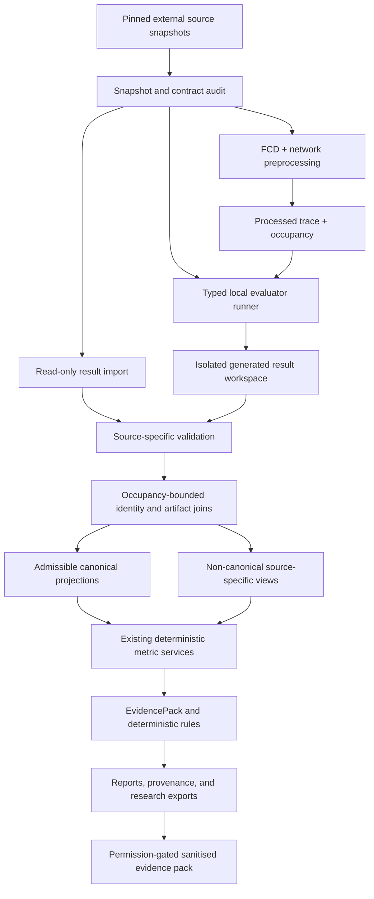

# TrafficTwin — Randy/VEC Reproducible Integration Design (v0.6)

**Working title:** TrafficTwin v0.6 — evidence-gated Randy/VEC reproduction, canonical joins, and
research integration
**Project:** Dynamic Resource Management for Intelligent Transportation System Applications
(Project 237)
**Author:** Abdulla Al Mamun Akash
**Status:** Repository-owner-approved design; VEC-01 through VEC-12 implemented and accepted within
their recorded evidence boundaries
**Date:** 21 July 2026

> v0.6 supersedes v0.5 for future product and architecture decisions. The
> [v0.5 specification](traffictwin-design-v0_5.md) remains the fully implemented, import-first
> baseline. Current implementation truth remains in
> [implementation-status.md](implementation-status.md).

## 1. Purpose

TrafficTwin v0.5 deliberately kept direct Randy/VEC execution and stronger TOS canonicalisation
unavailable because the producer, checkpoint, identity, action-target, trip, FCD, and reuse
evidence was incomplete. On 21 July 2026 Randy supplied a written response identifying:

- the `vec_env` producer commit and the trace/instrumented-output writers;
- frozen actor checkpoints and an exact evaluator command in `tos-data`;
- occupancy spans joining padded slots to exact `sumo_vehicle_id` values;
- per-step tier/EV fields and chosen RSU/V2V action targets;
- `tripinfo` outputs for all four scenario days;
- an arbitrary one-second SUMO FCD plus network-file preprocessing path; and
- permission to use sanitised samples and aggregate results in this repository and dissertation,
  subject to citation, engine-version, and selected-seed labelling conditions.

Remote-ref inspection found the referenced `vec_env` main commit
`068b4ea33e640f206ce6a7d04f3d6fae2ac831f4` and `tos-data` main commit
`f6c67acbed3360dba3a0d5c8d1fd557caa99ecff`. The current local clones remain on older commits.
Therefore, the reply is design evidence, while the actual new files and schemas remain unverified
until the source-snapshot gate in §10 passes.

This increment designs the strongest integration that can be built from that evidence without
weakening TrafficTwin's deterministic, import-first, immutable-evidence model.

## 2. Relationship to v0.5

All 39 v0.5 catalogue capabilities remain implemented within their documented boundaries. v0.6
does not replace or rewrite them. It adds a source-specific case-study layer through reusable
contracts:

- generic TrafficTwin bundles remain the guaranteed standalone workflow;
- the existing read-only TOS workbench remains usable when execution dependencies are absent;
- SUMO result import remains separate from SUMO or VEC execution;
- v0.6 capabilities fail closed and independently; and
- a failed or unavailable external run cannot make the v0.5 core unhealthy.

## 3. Non-negotiable constraints

The v0.5 constraints continue to apply. v0.6 adds these requirements:

1. **Synchronisation is not trust.** A remote branch, email, filename, or successful clone does not
   establish schema meaning. Exact commits, file hashes, writer code, dictionary text, and observed
   outputs must reconcile.
2. **Import-first remains unconditional.** Existing results can always be inspected without
   enabling the evaluator. Direct execution is an optional capability with its own acceptance
   gate.
3. **No arbitrary command execution.** The launcher constructs one allowlisted command from typed
   fields. It accepts no shell fragments, extra unrecognised flags, dynamic Python modules, or
   uploaded code.
4. **External repositories are read-only inputs.** TrafficTwin does not edit, commit, clean,
   switch, or push `vec_env` or `tos-data`. Generated outputs go to a separate explicit workspace.
5. **Raw and generated evidence remain distinct.** Source files, checkpoints, traces, FCD, network
   files, and generated results have separate identities and provenance roles.
6. **Owner wording does not erase field boundaries.** Deadline success, eventual physical
   completion, task execution, trip completion, target eligibility, chosen target, active-task
   count, backlog time, CPU utilisation, and queue length remain different concepts.
7. **Padded slots are not identities.** A slot becomes longitudinal vehicle evidence only inside
   a validated occupancy span joined to an exact `sumo_vehicle_id`.
8. **Operational groups are not protected attributes.** Tier and EV fields support technical
   grouping only and cannot be presented as demographic fairness evidence.
9. **Reproduction claims are graded.** Bitwise, numerically equivalent, structurally valid, and
   scientifically compatible reproduction are reported separately. Hardware/JAX variation is not
   hidden.
10. **Permission is scoped.** The written response permits sanitised samples and aggregates with
    stated citation conditions. It does not imply blanket relicensing or redistribution of full
    repositories, raw datasets, actors, checkpoints, or third-party SUMO assets.
11. **No inferred energy or infrastructure semantics.** Per-task energy remains unavailable unless
    an exact task-level joule field and eligibility contract are observed. `rsu_load` and
    `rsu_busy_ms` retain their source meanings unless a separate canonical mapping is approved.
12. **The UI stays thin.** Every button renders or calls tested library services. It cannot build
    commands, join scientific records, calculate metrics, or decide capability truth.

## 4. Goals and research questions

### 4.1 Goals

v0.6 is intended to:

- reproduce one approved Randy/VEC evaluation from pinned inputs;
- ingest its instrumented outputs through a versioned immutable contract;
- replace time-local slot assumptions with occupancy-bounded vehicle identity;
- join task class, tier/EV, selected action target, mobility, and trip evidence where exact;
- admit arbitrary compatible one-second SUMO FCD/network pairs into the trace pipeline;
- expose stronger TOS case-study metrics and diagnostic evidence without relabelling incompatible
  fields; and
- produce a sanitised, citable, permission-bounded dissertation evidence pack.

### 4.2 Research questions

- **RQ8 — Reproducible external execution:** Can a pinned external evaluator be run through a safe,
  typed contract while keeping import-only operation independent?
- **RQ9 — Cross-artifact identity:** Can occupancy spans reconcile padded simulation slots with
  persistent SUMO vehicles across task, mobility, action-target, and trip evidence?
- **RQ10 — Evidence strengthening:** Which existing metrics and deterministic hypotheses become
  admissible when exact identity, tier, target, and trip evidence is added?
- **RQ11 — Reuse discipline:** Can a useful public/dissertation case-study fixture be produced
  within narrow permission, citation, and selected-seed constraints?

## 5. Evidence baseline

| Evidence | Design interpretation | Required verification |
|---|---|---|
| `vec_env` commit `068b4ea…` | Candidate producer and writer implementation | Inspect exact commit and parent history; fingerprint referenced scripts |
| `eval/build_trace.py` and `eval/place_rsus_cover.py` | Candidate FCD/network-to-trace path | Verify arguments, units, output schema, failure behavior, and deterministic controls |
| `eval/eval_sumo_stage1_mc.py` | Candidate headless evaluator and instrumented writer | Verify actor loading, seed controls, output flags, paths, exit behavior, and outputs |
| `tos-data` commit `f6c67ac…` | Candidate evidence/data snapshot | Inspect dictionary, checkpoints, occupancy, tripinfo, traces, summaries, and licences |
| Frozen baseline and `ukfleettrain-MAPPO` actors | Candidate reproduction inputs | Hash files, record actor identity, verify observation compatibility, and do not redistribute without permission |
| Occupancy tables | Candidate exact slot-to-vehicle intervals | Reconcile non-overlap, bounds, coverage, and trace dimensions |
| `slot_tier`, `slot_is_ev` | Candidate operational vehicle attributes | Verify shape, dtype, allowed values, occupancy alignment, and source definition |
| `veh_best_rsu`, `veh_best_v2v` | Candidate selected offload targets | Verify action-conditioned meaning and `-1` semantics in writer and dictionary |
| Scenario `tripinfo` files | Candidate trip/journey evidence | Verify SUMO version, vehicle join coverage, time units, completion eligibility, and source day |
| Written reuse response | Permission for sanitised samples and aggregates | Preserve evidence date/basis; cite both repositories, engine `v2_post_nrsus_fix`, and `_s102` selection label |

The VEC-01 audit has now inspected these snapshots. Current evidence and residual limits are
recorded in the capability catalogue and implementation status rather than inferred from this
original evidence baseline.

## 6. Architecture

### 6.1 Dependency direction

- Snapshot services identify and verify external evidence but do not interpret scientific fields.
- Source adapters validate and map observed fields; they cannot launch.
- The runner consumes a completed typed request and emits an execution receipt; it cannot define
  metrics or canonical semantics.
- Joins consume only validated source artifacts and explicit occupancy intervals.
- Existing metric and rule engines remain authoritative for compatible canonical evidence.
- Source-specific metrics use separately versioned definitions and cannot masquerade as ordinary
  canonical metrics.
- Reports and publication packs render accepted artifacts and permissions; they do not expand
  reuse rights.

### 6.2 External repository boundary

The updated repositories remain outside `diss/`. A snapshot record stores repository URL, exact
commit, dirty-state observation, relative evidence paths, and file hashes. TrafficTwin refuses to
execute from an uncommitted or unexpected source state unless a future design explicitly defines a
separate developer mode; v0.6 has no such mode.

## 7. New typed artifacts

| Artifact | Required meaning |
|---|---|
| `ExternalRepositorySnapshot` | Repository identity, exact commit, expected branch/ref, observed dirty state, evidence files, hashes, and inspection result |
| `VecSourceContractV2` | Writer versions, array/table schemas, units, identity semantics, joins, capabilities, permission, and explicit blockers |
| `VecRunRequest` | Pinned actor, trace or FCD/network input, scenario, seeds, fleet, capacity, bounded runtime controls, and output destination |
| `VecExecutionReceipt` | Constructed argv, working directory identity, environment fingerprint, start/end state, exit code, logs, output inventory, hashes, and source immutability audit |
| `OccupancySpan` | Exact vehicle ID, padded slot, audited inclusive visit interval, source day/trace, and validation provenance |
| `VecVehicleAttributeObservation` | Occupancy-aligned tier and EV values with source meaning and coverage |
| `VecTaskActionObservation` | Task coordinates, class, deadline outcome, action, chosen target, target eligibility state, and exact vehicle/slot/time join |
| `VecTripJoin` | SUMO trip record joined to one exact vehicle identity and source scenario, including join eligibility and exclusions |
| `VecReproductionReport` | Expected-versus-observed schema, counts, aggregates, tolerances, hashes, environment differences, and graded outcome |
| `VecPublicationManifest` | Included sanitised/aggregate artifacts, exclusions, hashes, citation text, engine version, seed-selection labels, and permission basis |

All schemas are strict, versioned, serialisable, path-safe in portable output, and fingerprinted
from canonical JSON.

## 8. Mapping rules

| Source evidence | Admissible projection | Prohibited interpretation |
|---|---|---|
| Occupancy `sumo_vehicle_id`, slot, visit bounds | Persistent vehicle identity inside exact spans | Treating slot number alone as a vehicle |
| `slot_tier` | Operational compute-tier grouping when occupancy-aligned | Protected/demographic class or value outside its observed span |
| `slot_is_ev` | Technical EV/non-EV grouping when occupancy-aligned | Demographic fairness or an immutable person attribute |
| `task_type` | Source T1/T2/T3 task class after code reconciliation | Inferred workload class when missing/invalid |
| `task_met` or source completion aggregate | Deadline-success evidence under its source denominator | Eventual physical completion unless the updated writer proves it |
| `veh_action` | Source local/V2I/V2V decision | Exact selected RSU/peer without a target join |
| `veh_best_rsu`, `veh_best_v2v` | Chosen target only after writer/dictionary reconciliation | Treating `-1` as failure, drop, or miss without evidence |
| `tripinfo` joined on `sumo_vehicle_id` | Trip duration/distance/arrival projection for eligible completed trips | Filling missing tasks, vehicles, or incomplete trips with zero |
| `rsu_load` | Source active in-flight task count | CPU utilisation or queue length |
| `rsu_busy_ms` | Source remaining compute backlog | Normalised utilisation without an approved formula/contract |
| Aggregate energy per arrival | Source aggregate metric with exact denominator | Per-task joules or canonical energy contribution rows |

Every join publishes matched, unmatched, duplicate, out-of-range, and excluded counts. Incomplete
coverage produces an unavailable or partial result according to the target metric's contract.

## 9. v0.6 capability catalogue

All rows began as `planned`. The table now records the reconciled current state after each
capability's acceptance evidence passed.

| ID | Capability | Acceptance boundary | Current state |
|---|---|---|---|
| `VEC-01` | Pinned source-snapshot audit | Verify exact remote commits, clean source state, evidence inventory, writer/checkpoint/dictionary paths, hashes, and scoped permission without modifying either repository | implemented and accepted with scoped blockers |
| `VEC-02` | TOS/VEC source contract v2 | Publish observed schemas, shapes, units, identities, joins, capabilities, rights, and blockers from the updated snapshots; golden and negative fixtures required | implemented with accepted real sanitised Gate-B pack |
| `VEC-03` | Occupancy-bounded vehicle identity | Validate non-overlapping slot spans and exact `sumo_vehicle_id` coverage; join mobility/task evidence only inside audited inclusive intervals | implemented for all five audited trace/occupancy pairs |
| `VEC-04` | Tier, EV, task, action, and target joins | Reconcile per-step/task shapes and code meanings; expose complete coverage and no-target states without inventing failure or link quality | implemented for all six matched instrumented task runs |
| `VEC-05` | Trip and journey-time integration | Import all approved scenario `tripinfo` files, join exact vehicles, preserve raw XML, report eligibility/exclusions, and reuse existing trip metrics only when compatible | implemented for all four audited files and five scenario joins |
| `VEC-06` | Arbitrary FCD/network preprocessing | Admit a one-second SUMO FCD XML plus matching network file through the pinned trace builder, record placement/seed/day/window controls, and emit immutable trace/occupancy outputs | implemented and accepted at the bounded library boundary |
| `VEC-07` | Safe local evaluator runner | Construct the exact allowlisted evaluator argv from a strict request; verify dependencies/checkpoint/trace; isolate outputs; capture logs/exit/timeout/cancellation; prove source immutability | implemented and accepted; exposed only through request-preflight-gated foreground execution |
| `VEC-08` | Instrumented reproduction verification | Reproduce one approved run and reconcile output schemas, counts, aggregate summaries, task/step invariants, seed/config identity, and declared numerical tolerances | implemented for the pinned full weekend protocol-seed case |
| `VEC-09` | Evidence-strengthened metrics and rules | Enable only metrics/rules whose existing contracts are satisfied; add separately versioned TOS-specific evidence where fields remain incompatible | implemented for audited task/trip admission; no thresholds or findings evaluated |
| `VEC-10` | Thin CLI/UI integration | Provide snapshot, validate, preprocess, run, monitor-current-process, inspect, compare, and export workflows over library services with capability-gated controls | implemented with foreground, request-preflight-gated execution |
| `VEC-11` | Sanitised dissertation fixture pack | Produce the smallest matched sample and aggregates allowed by the written permission, with citations, hashes, engine label, `_s102` disclosure, and excluded raw/checkpoint inventory | implemented and accepted: three matched rows plus 26 metric states |
| `VEC-12` | End-to-end reproducibility report | Bind snapshots, request, execution, validated outputs, joins, metrics, diagnostics, provenance, environment, and limitations into one offline-verifiable research artifact | implemented and accepted as a deterministic 27-member permission-bounded archive |

## 10. Dependency gates and implementation plan

These are ordered evidence gates, not dates.

### Gate A — Source synchronisation and evidence audit

1. Preserve the current local clone states and confirm they are clean.
2. Update the external clones to the exact reviewed commits without changing `diss/`.
3. Inspect the new dictionary, checkpoints, writers, occupancy tables, tripinfo, traces, and
   licence/permission material.
4. Hash every admitted evidence file and record the exact repository commits.
5. Reconcile Randy's written claims with observed code and files.

Output: `VEC-01` snapshot audit. Any mismatch remains visible and blocks only dependent rows.

### Gate B — Contract and fixture design

1. Define strict schemas for occupancy, attributes, task/action targets, trip joins, requests,
   receipts, and reproduction reports.
2. Create synthetic-schema fixtures for every format and failure mode.
3. Select the smallest owner-permitted real sanitised sample; do not include actors/checkpoints or
   raw third-party assets unless separately authorised.
4. Record ADRs for completion semantics, target meaning, trip eligibility, and launcher safety.

Output: `VEC-02` plus generated contracts and golden fixtures.

### Gate C — Read-only imports and joins

1. Extend validation without changing raw external files.
2. Implement occupancy-bounded vehicle identity.
3. Join tier/EV, task class/outcome, action target, mobility, and trips with complete reconciliation
   reports.
4. Preserve incompatible fields as source-specific views.

Output: `VEC-03`–`VEC-05`. This gate can complete without enabling execution.

### Gate D — FCD preprocessing

1. Validate FCD resolution, network pairing, coordinate/system metadata, and bounded size.
2. Call only the pinned preprocessing API/argv.
3. Isolate and hash trace, RSU placement, and occupancy outputs.
4. Prove deterministic results for a fixed small fixture or document exact permitted tolerance.

Output: `VEC-06`.

### Gate E — Reproduction and launcher

1. Build an environment readiness report without installing or mutating anything.
2. Construct one typed evaluator request using an approved actor and trace.
3. Run in a separate output workspace with a controlled working directory and environment.
4. Test success, non-zero exit, malformed output, timeout, cancellation, path injection, stale
   source, incompatible actor, and partial-output cases.
5. Reconcile the observed output with the documented expected summary.

Output: `VEC-07` and `VEC-08`. This gate is accepted for the pinned case; VEC-10 exposes only the
exact preflight-gated foreground evaluator, while generic/SUMO launch remains false.

### Gate F — Scientific admission

1. Audit which existing metric contracts are now satisfied.
2. Keep per-task energy, CPU utilisation, and canonical queue metrics unavailable unless exact
   source evidence appears.
3. Evaluate R1/R2/R6/R7 readiness using ordinary EvidencePack admission.
4. Calibrate no threshold on the evaluation result being judged; retain development/held-out and
   `_s102` selection labels.

Output: `VEC-09` with method-specific evaluation evidence.

### Gate G — Interfaces and research publication

1. Add thin CLI and UI surfaces only for completed services.
2. Keep unavailable controls visible with the exact missing evidence.
3. Generate the permission-bounded fixture and dissertation pack.
4. Run full quality, security, reproducibility, link, package, and browser gates.

Output: `VEC-10`–`VEC-12`.

Current result: VEC-10, VEC-11, and VEC-12 are accepted. Gate G is complete. The VEC-12 archive
binds the full accepted lineage while preserving every unavailable field, permission limit, and
scientific limitation.

## 11. Safe runner contract

The v0.6 runner is a narrow local reproduction adapter, not a general job platform.

### 11.1 Allowed inputs

- exact clean `vec_env` snapshot;
- exact reviewed actor checkpoint;
- validated processed trace, or an FCD/network result produced by `VEC-06`;
- finite integer evaluator and fleet seeds;
- closed fleet/campaign/observation variants observed in the source contract;
- bounded positive capacity and maximum-step controls supported by the pinned evaluator; and
- an explicit new or empty TrafficTwin-managed output directory.

### 11.2 Required behavior

- use argv execution with no shell;
- allowlist executable, script, flags, values, and environment variables;
- reject symbolic links, path traversal, unexpected dirty source state, incompatible actors, and
  output targets inside raw/source repositories;
- capture stdout/stderr separately with bounded logs;
- record dependency and hardware metadata relevant to JAX/SUMO reproduction;
- support timeout and process-group cancellation without claiming remote scheduler control;
- inventory and hash every produced file before scientific admission; and
- compare source repository status before and after execution.

### 11.3 Explicit exclusions

- training or fine-tuning actors;
- arbitrary Python entry points;
- SLURM submission or remote execution;
- a persistent asynchronous queue;
- multi-user scheduling;
- automatic dependency installation;
- automatic Git clone, branch, merge, commit, or push;
- live Manchester data; and
- a general-purpose SUMO launcher.

## 12. Metrics and diagnostic admission

New fields unlock evidence, not automatic findings.

Potentially admissible after validation:

- vehicle/trip counts and journey-time/distance metrics from eligible `tripinfo` joins;
- completion/action summaries grouped by exact technical tier and EV state;
- task-class by tier/action/target cross-tabs;
- per-target RSU completion/load evidence when chosen-target and task-outcome joins are complete;
- time-windowed task/action/target evidence; and
- stronger R1, R2, R6, or R7 inputs where their existing requirements are exactly met.

Still unavailable without additional fields or decisions:

- per-task energy and accepted-row energy provenance;
- canonical CPU utilisation or queue length derived from active-task/backlog arrays;
- link quality, target availability, or counterfactual action quality if not exported;
- eventual physical task completion if only deadline success is observed;
- causal claims about a vehicle, RSU, target, incident, or policy; and
- real-threshold validity without a predeclared development/held-out evaluation design.

## 13. Permission, citation, and publication

Every repository/dissertation artifact derived from Randy's sources must:

1. be a sanitised sample or aggregate within the written permission;
2. cite both `vec_env` and `tos-data` using their reviewed commits;
3. state engine version `v2_post_nrsus_fix`;
4. retain the `_s102` best-of-seeds label anywhere those selected rows appear;
5. state scenario, fleet seed, evaluator seed, trace day/window, actor, and source-mode labels where
   applicable;
6. exclude secrets, private paths, machine names, full checkpoints, and non-permitted raw assets;
7. distinguish owner permission from a formal software/data licence; and
8. preserve a manifest of included, excluded, transformed, and redacted artifacts.

Public hosting remains blocked until the TrafficTwin project licence and every included external
artifact's publication basis are explicit.

The accepted VEC-11 pack applies this policy to three pseudonymised, rounded matched task/trip rows
and all 26 VEC-09 aggregate metric states. It retains no pseudonym mapping and claims no anonymity;
its manifest binds the VEC-04, VEC-05, and VEC-09 fingerprints and keeps raw/checkpoint/source
assets visibly excluded.

## 14. Testing and acceptance

### 14.1 Contract tests

- exact schema/dtype/shape and unit checks;
- extra/missing/renamed field failures;
- unsafe NPZ/XML/path/container rejection;
- occupancy overlap, reuse, gap, bounds, and identity reconciliation;
- task/action/target/trip matched and unmatched accounting; and
- permission/citation/selection-label validation.

### 14.2 Determinism and reproduction tests

- stable typed fingerprints and generated references;
- unchanged source and input hashes before/after every operation;
- fixed-request command and receipt determinism excluding declared runtime fields;
- repeat-run output comparison using a predeclared exact or numeric-tolerance policy;
- aggregate reconciliation against the evaluator's summary JSON/master CSV; and
- explicit hardware/software differences when bitwise equality is not promised.

### 14.3 Runner security tests

- shell metacharacter and unrecognised-flag rejection;
- path traversal, symlink, source-tree output, overwrite, and dirty-snapshot refusal;
- incompatible checkpoint/observation/trace rejection;
- timeout, cancellation, crash, malformed output, and partial output;
- bounded log/output handling; and
- no network, install, Git mutation, or external scheduler action by TrafficTwin.

### 14.4 Scientific acceptance

- canonical projections satisfy their existing versioned contracts;
- every partial/unavailable metric has a reason code;
- source-specific metrics use distinct identifiers and definitions;
- diagnostic rules consume only admitted EvidencePack values;
- selected-seed and in-domain/held-out labels survive every report; and
- no validation, provenance, or comparison output uses causal wording.

### 14.5 Completion rule

A capability becomes `implemented` only when code, unit/integration/golden tests, a reviewed real
acceptance case where required, generated references, documentation, provenance, limitations,
security checks, and repository quality gates agree. `VEC-07` also requires a successful local
end-to-end run; possessing a command and checkpoint is insufficient.

## 15. Residual questions

These questions do not block Gate A, but they block individual claims:

1. Do the updated per-task outputs contain an exact eventual physical-completion field, or only
   deadline success and per-run completion aggregates?
2. Do any updated task rows contain per-task energy joules and an eligibility/denominator contract?
3. Does writer inspection confirm that `veh_best_rsu`/`veh_best_v2v` are chosen destinations rather
   than best eligible candidates, and what precisely does `-1` mean for each action?
4. What licence or permission governs redistribution of actor checkpoints, full occupancy/trip
   files, and any third-party SUMO network/FCD assets beyond sanitised samples and aggregates?
5. What numerical tolerance is scientifically justified across supported CPU/GPU/JAX platforms?
6. Which exact small run is the approved reproduction smoke case and expected-output reference?
7. Which v0.6 outputs are central dissertation evidence rather than supporting software evidence?

Answers are established from the updated source and a local smoke run first. Randy should be asked
again only if the observed artifacts do not resolve them.

## 16. Out of scope

- modifying Randy's training algorithms or environment physics;
- actor training, fine-tuning, hyperparameter search, or model selection;
- SLURM/cloud orchestration or a persistent simulation service;
- near-live or live traffic feeds;
- inferred link quality, counterfactual policies, demographic attributes, or causal effects;
- general arbitrary-script execution;
- redistribution beyond the written permission/licence scope;
- city-scale operational deployment; and
- LLM calculation, diagnosis, attribution, ranking, or recommendation.

## Appendix A — v0.6 traceability

| Randy response area | v0.6 capability IDs |
|---|---|
| Producer provenance and writers | `VEC-01`, `VEC-02`, `VEC-08`, `VEC-12` |
| Checkpoints and evaluator command | `VEC-01`, `VEC-07`, `VEC-08` |
| Completion, occupancy identity, tier/EV, and targets | `VEC-02`–`VEC-04`, `VEC-09` |
| Tripinfo and journey-time evidence | `VEC-05`, `VEC-09` |
| Arbitrary one-second FCD/network pipeline | `VEC-06`–`VEC-08` |
| Sanitised sample and aggregate reuse | `VEC-11`, `VEC-12` |

## Appendix B — historical initial status

At approval time all v0.6 capabilities were `planned`. The remote commits and written response made
v0.6 feasible but did not by themselves prove schemas, safe local execution, canonical
compatibility, scientific validity, or public redistribution rights. VEC-01 through VEC-12 have
since passed their recorded acceptance gates without broadening those residual boundaries.
