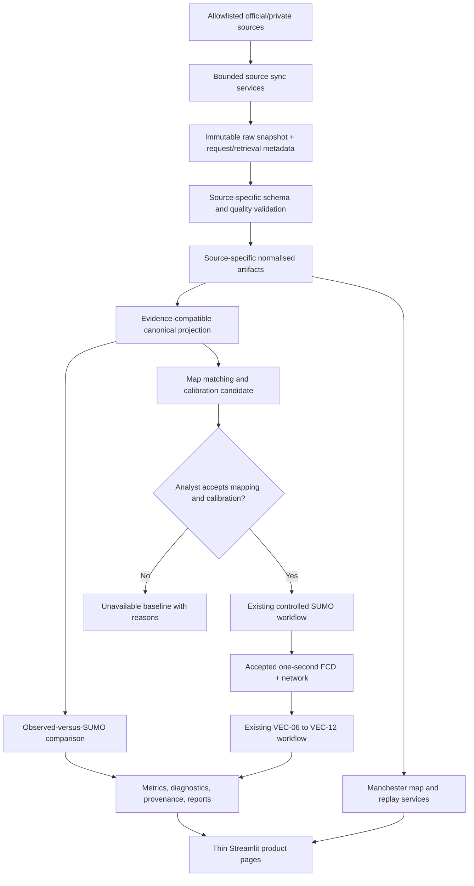
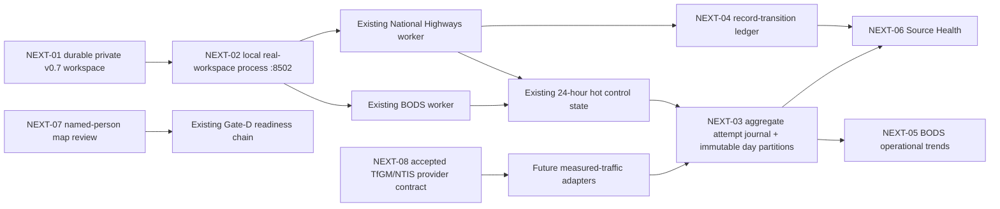

# TrafficTwin — Manchester Evidence and Product Experience Design (v0.7)

**Working title:** TrafficTwin v0.7 — Manchester historical/live evidence, observed-versus-simulated
comparison, and a research-focused product interface

**Project:** Dynamic Resource Management for Intelligent Transportation System Applications
(Project 237)

**Author:** Abdulla Al Mamun Akash

**Status:** Repository-owner-approved design; implementation not yet accepted

**Date:** 3 August 2026

**Revision:** Post-Phase-189 durable real-workspace, operational-history, source-health,
map-review, and provider-gated measured-traffic programme

> v0.7 supersedes v0.6 for future product and architecture decisions. The immutable
> [`v0.6.0`](https://github.com/Abdulla4akash/traffictwin/tree/v0.6.0) release remains the
> reproducible implemented baseline. This document does not mark a v0.7 capability implemented;
> current truth remains in [implementation-status.md](implementation-status.md).

## 1. Purpose

TrafficTwin v0.6 provides an evidence-gated, import-first research platform with controlled SUMO
and VEC execution for narrowly accepted cases. It can validate, measure, compare, diagnose,
replay, and package evidence, but its product interface remains broad and engineering-oriented,
and it does not yet integrate an official Manchester observation source.

v0.7 adds two connected improvements:

1. **Manchester evidence integration:** historical road counts, near-live strategic-road
   observations, live bus positions, traffic-signal infrastructure, and optional Randy evidence
   are acquired through explicit source adapters and immutable snapshot contracts.
2. **A focused product experience:** a map-led home and Manchester Operations workflow replaces
   the flat feature catalogue as the main way researchers move from observed conditions to a
   reproducible scenario, controlled run or import, comparison, diagnosis, and export.

The increment is evidence-led. It does not present buses as general traffic, historical surveys as
live sensors, motorway measurements as city-centre coverage, or a downloaded response as fresh
merely because it was retrieved recently.

## 2. Relationship to v0.6

v0.7 is additive. It retains every accepted v0.6 boundary:

- import-first operation remains the unconditional workflow;
- the generic TrafficTwin bundle, metric, diagnostic, provenance, and reporting contracts remain
  authoritative;
- controlled SUMO and Randy/VEC execution remain request-specific and preflight-gated;
- VEC-01 through VEC-12 retain their exact accepted evidence, scientific, and publication limits;
- synthetic Manchester-like fixtures remain labelled synthetic and non-Manchester;
- external evidence is preserved unchanged and never silently canonicalised; and
- unsupported sources, fields, modes, controls, or claims remain visibly unavailable.

The `v0.6.0` tag identifies commit `1c50a25246426128ac6e8530240eff362d16be02` and must never be
moved. v0.7 development uses a separate branch, package version, workspace namespace, and cache
schema. A v0.7 application may read or copy accepted v0.6 records through a versioned compatibility
service, but it must not silently migrate or mutate a valuable v0.6 workspace in place.

## 3. Non-negotiable constraints

The v0.6 constraints continue to apply. v0.7 adds the following:

1. **Observation time is not retrieval time.** Every source record distinguishes when a condition
   was observed from when TrafficTwin retrieved it.
2. **Freshness is source-specific.** A snapshot is called live, near-live, historical, stale, or
   unavailable only through a versioned source policy using source timestamps and documented
   update behaviour.
3. **Transit positions are not road-flow measurements.** Bus Open Data Service vehicle locations
   remain transit-vehicle observations and are never coerced into private-vehicle count or speed.
4. **Infrastructure is not telemetry.** TfGM signal locations are a reference layer, not traffic
   observations, signal states, queues, timings, or incidents.
5. **Road domain is explicit.** WebTRIS observations and National Highways operational feeds
   describe only their covered Strategic Road Network; neither can be presented as complete
   Manchester city-road coverage.
6. **Survey counts retain their denominator.** DfT count-point records are dated survey evidence;
   annual averages or survey-hour counts are not instantaneous SUMO demand.
7. **No direct observation-to-demand shortcut.** “Use as SUMO baseline” requires accepted
   map-matching, temporal profiling, calibration, uncertainty, and refusal contracts.
8. **No source is silently merged.** Source-specific records retain their schema, quality flags,
   licence, and snapshot identity. Canonical projection is a separate, deterministic artifact.
9. **No page fetches arbitrary data.** The UI reads accepted local snapshots through tested
   services. Network acquisition is a separate bounded sync operation.
10. **No arbitrary URL or query execution.** Adapters use allowlisted HTTPS hosts, typed parameters,
    bounded pages and response sizes, timeouts, and safe parsers.
11. **Credentials are private.** Secrets are supplied through environment or `st.secrets`, never
    committed, rendered, logged, fingerprinted into public artifacts, or sent to unrelated hosts.
12. **Raw evidence is immutable.** Original response bytes, request metadata, hashes, and licence
    basis are stored before transformation; normalisation writes new artifacts.
13. **The interface is progressive.** Primary research actions lead; capability IDs, manifests,
    hashes, and limitations remain available in contextual detail or Advanced pages.
14. **The UI stays thin and native.** Streamlit pages call tested services, use native navigation,
    state, caching, fragments, forms, and charts, and do not duplicate scientific logic.
15. **No AI-authored science.** Metrics and hypotheses remain deterministic. An LLM may only render
    already-computed findings under the existing rules.

## 4. Goals, non-goals, and research questions

### 4.1 Goals

v0.7 is intended to:

- integrate at least one legally reusable official Manchester observation source through a
  production-quality adapter;
- offer historical replay and the latest accepted observation in one coherent workflow;
- show live Bee Network bus locations without mislabelling them as general traffic;
- show near-live National Highways closures/incidents, imposed temporary speed restrictions, and
  digital VMS status as separate Strategic Road Network operational layers;
- overlay Manchester traffic signals and observation sites on a map with complete provenance;
- compare compatible observed and SUMO-generated traffic evidence deterministically;
- turn an accepted observation window into a calibrated, reviewable SUMO baseline candidate;
- pass accepted one-second SUMO FCD/network output into the existing VEC pipeline;
- replace the flat page inventory with task-oriented navigation and a map-led home page;
- preserve offline use through accepted cached snapshots with visible stale status; and
- keep v0.6 independently runnable and scientifically reproducible.

### 4.2 Non-goals

v0.7 does not promise:

- a complete real-time digital twin of Greater Manchester;
- live private-vehicle counts or speeds for every city-centre road;
- signal phase, controller state, queue, city/local-road incident, parking, pedestrian, or cyclist
  telemetry unless a later accepted source contract provides it; the accepted National Highways
  operational contract is limited to covered Strategic Road Network events and signs;
- traffic prediction, learned demand inference, route optimisation, or automatic policy selection;
- automatic calibration acceptance without analyst review;
- causal claims from observed-versus-simulated differences;
- a replacement for SUMO, Randy's VEC environment, TfGM systems, BODS, WebTRIS, or DfT services;
- a React rewrite, custom design system, persistent multi-user service, or cloud scheduler; or
- public redistribution of Randy/private/third-party artifacts outside their recorded permission.

### 4.3 Research questions

- **RQ12 — Heterogeneous urban evidence:** Can official sources with different spatial, temporal,
  and modal scopes be integrated without erasing their evidence boundaries?
- **RQ13 — Observed-to-simulated traceability:** Can a Manchester observation window be transformed
  into a reviewable SUMO calibration candidate with complete source-to-edge provenance?
- **RQ14 — Model-versus-observation diagnosis:** Which deterministic differences between observed
  and simulated counts, speeds, and temporal profiles can be reported without causal overclaiming?
- **RQ15 — Integrated traffic/VEC workflow:** Can an observation-grounded SUMO run be passed into
  the accepted FCD-to-VEC workflow while retaining every source, calibration, execution, and result
  boundary?
- **RQ16 — Research-tool usability:** Does a map-led, task-oriented interface improve completion,
  interpretation, and provenance discovery compared with the v0.6 page catalogue?

## 5. Evidence-source portfolio

Source capability is defined by the accepted adapter contract, not by the marketing name of an
API. Initial source facts were reviewed on 22 July 2026 and must be re-audited during implementation.

| Source | Initial intended use | Time semantics | Geographic/modal boundary | Explicit exclusions |
|---|---|---|---|---|
| DfT Road Traffic Statistics | Historical Manchester count-point map, survey-hour profiles, vehicle-class counts, long-term context | Dated historical surveys; dataset currently spans 1993–2025 | Manchester local-authority road count points | No measured speed; not continuous or live; AADF is not instantaneous demand |
| National Highways WebTRIS | Latest accepted and historical strategic-road volume/speed observations | Source-reported intervals, commonly 15 minutes | Covered motorway/trunk-road sites, including relevant M56/M60/M62 approaches | Not city-road coverage; service availability may be interrupted; retrieval time is not freshness |
| National Highways operational REST feeds | Near-live road/lane closures and incidents, imposed temporary speed restrictions, and digital VMS status | DATEX II `publicationTime` plus record validity/message times where present | Strategic Road Network features inside a caller-declared broad Manchester study envelope | Not complete Manchester coverage; temporary limit is not measured speed; no traffic volume/congestion; observed VMS payload exposes status/reason metadata but no literal displayed message text |
| TfGM traffic-signal locations | Signal and controller-reference map overlay | Reference dataset updated periodically | Published signal sites in Greater Manchester | No signal state, phase, timing, traffic count, queue, or live incident meaning |
| DfT Bus Open Data Service | Live or recent Bee Network bus positions and service context | SIRI-VM source timestamps | Bus/transit vehicles and services in England | Not private-vehicle flow, road speed, congestion, or a complete fleet guarantee |
| Randy/TOS Manchester case-study artifacts | Optional case-study evidence where the exact audited contract and permission permit | Artifact-specific | Exact supplied scenarios, traces, tasks, and trip joins | Not a public live feed; no broader licence, city coverage, or redistribution inference |
| Synthetic TrafficTwin fixtures | Offline development, tests, and demo fallback | Declared deterministic synthetic clock | Deliberately artificial geometry and records | Not Manchester, not Randy, not observed, not validation of external fidelity |

### 5.1 Official source references

- DfT Manchester road traffic statistics:
  <https://roadtraffic.dft.gov.uk/local-authorities/E08000003>
- DfT road traffic API documentation:
  <https://roadtraffic.dft.gov.uk/api-documentation>
- National Highways WebTRIS API:
  <https://webtris.nationalhighways.co.uk/api/swagger/ui/index>
- WebTRIS service notices:
  <https://webtris.nationalhighways.co.uk/Home/News>
- National Highways current API catalogue:
  <https://developer.data.nationalhighways.co.uk/apis>
- National Highways API terms and attribution:
  <https://developer.data.nationalhighways.co.uk/terms>
- National Highways API FAQ, scope, product limits, and rate limit:
  <https://developer.data.nationalhighways.co.uk/faq>
- TfGM traffic-signal supporting information:
  <https://odata.tfgm.com/opendata/downloads/TrafficSignals/TrafficSignalsSupportingInfo.pdf>
- BODS user guidance:
  <https://www.gov.uk/guidance/find-and-use-bus-open-data>
- BODS SIRI-VM technical guidance:
  <https://www.gov.uk/government/publications/technical-guidance-publishing-location-data-using-the-bus-open-data-service-siri-vm>

The initial DfT Manchester page reports 342 count points and 39,072 raw count records for
1993–2025. These numbers are discovery evidence only; implementation must record the retrieved
source snapshot and must not hard-code them as permanent truths.

“Co-op Live” is a historical TrafficTwin case-study label from the
[v0.4 design](traffictwin-design-v0_4.md), where it denotes the arena-egress Manchester scenario.
It is not a source name, freshness claim, or permission claim. v0.7 uses the label only when an
accepted source/scenario manifest explicitly binds an artifact to that case study.

## 6. Product modes and truth labels

The Manchester Operations mode selector contains:

1. **Historical replay** — a selected past date/window from an accepted immutable snapshot.
2. **Latest available** — the newest accepted record for each enabled road source, with source
   observation time and freshness shown independently.
3. **Live vehicles** — recent BODS transit-vehicle locations, labelled as buses/transit, with
   independently classified National Highways operational overlays where accepted. The overlays
   remain `near_live` or `stale`, never `live_vehicle`.

The following evidence-state values are mandatory and mutually explicit:

| State | Meaning |
|---|---|
| `historical` | Observation is intentionally outside the source's current freshness window. |
| `near_live` | Road observation is within the adapter's accepted source-specific latency window but is not claimed as instantaneous. |
| `live_vehicle` | Transit vehicle position is within the BODS live-position policy. |
| `stale` | An otherwise usable accepted snapshot is older than the source-specific freshness threshold. |
| `unavailable` | No accepted evidence exists for the requested source/window or the source failed closed. |
| `synthetic` | Deterministic generated evidence with no observed-Manchester claim. |

The interface must never collapse these values into one green “live” badge. Each source card shows:

- source name and dataset/product identity;
- observation interval and timezone;
- `observed_at_utc` or source date/window;
- `retrieved_at_utc`;
- computed latency/freshness status and policy version;
- quality state, coverage, exclusions, and validation findings;
- snapshot and projection fingerprints; and
- licence/attribution basis.

## 7. Architecture



### 7.1 Dependency direction

- Acquisition clients know transport and source protocols, but not TrafficTwin metrics.
- Snapshot services preserve bytes and provenance before parsing.
- Source validators know one source schema and quality contract, but not UI state or SUMO argv.
- Normalisers preserve source meaning and cannot declare canonical compatibility.
- Projectors create only evidenced canonical records and publish reconciliation findings.
- Map-matching and calibration consume accepted projections and versioned networks.
- Existing SUMO/VEC services remain the only execution authorities.
- Metrics and rules consume accepted typed evidence; pages only render their outputs.
- Publication services enforce licence and permission before copying any source-derived artifact.

### 7.2 Proposed module boundary

```text
src/traffictwin/integration/manchester/
    models.py          # strict source, snapshot, freshness, and projection models
    snapshots.py       # immutable raw snapshot publication and verification
    transport.py       # allowlisted bounded HTTP transport selected by the Gate-A ADR
    xml.py             # hardened bounded XML/SIRI parsing selected by the Gate-A ADR
    dft.py             # DfT road-count adapter
    webtris.py         # National Highways site/report adapter
    tfgm.py            # traffic-signal reference adapter
    bods.py            # SIRI-VM transit-position adapter
    randy.py           # optional permission-gated artifact bridge
    validation.py      # cross-source invariants and findings
    projection.py      # source-specific to admitted TrafficTwin projection
    freshness.py       # source-time policies and truth labels
    spatial.py         # CRS transformation and geographic-layer admission
    map_matching.py    # observation/site to SUMO edge candidates
    calibration.py     # bounded deterministic calibration candidate
    comparison.py      # observed-versus-simulated evidence
    service.py         # UI/CLI application service
```

Transport clients and parsers may be split further, but source semantics must not leak into generic
canonical modules or Streamlit pages.

## 8. Immutable snapshot contract

Every acquisition produces a `ManchesterSourceSnapshot` before any normalisation. It includes:

- source and adapter version;
- allowlisted endpoint identity with secrets and sensitive query values removed;
- typed request parameters, page/interval bounds, and response content type;
- retrieval start/end in UTC and source response timestamps where available;
- HTTP status and safe response metadata;
- exact raw-member inventory, byte sizes, SHA-256 hashes, and aggregate snapshot fingerprint;
- licence/terms identifier, attribution text, and access date;
- validation status, findings, schema version, and freshness-policy version;
- prior-snapshot relationship and duplicate/no-change state; and
- an explicit publication class: `private`, `redistributable_raw`, `redistributable_derived`, or
  `metadata_only`.

Raw responses live outside Git in a configured Manchester workspace. Publication is atomic,
new-only, and read-only after acceptance. A failed or partial fetch remains quarantined and cannot
replace the last accepted snapshot. Logs contain source/request IDs, never response bodies,
credentials, private paths, or raw vehicle identifiers beyond the accepted operational need.

## 9. Source-specific models and projection

### 9.1 Common observation envelope

Source-specific records share an envelope without pretending their payloads are identical:

```text
source
source_record_id
observed_at_utc or observed_window
retrieved_at_utc
latitude / longitude when supplied
source_timezone
quality_flag
snapshot_fingerprint
source_schema_version
licence_id
```

Road count/speed observations additionally expose only when evidenced:

```text
site_id
interval_seconds
direction
vehicle_class
count
average_speed_mps
location_description
```

The current canonical `TrafficObservationRecord` remains unchanged in v0.7. Absolute time,
interval, direction, vehicle class, latitude/longitude, and source quality remain in
`ManchesterRoadObservation`. A canonical projection is permitted only when a strict
`ManchesterTimeBasis` binds one UTC analysis anchor and defines
`timestamp_s = observed_at_utc - analysis_anchor_utc` in seconds. The projection report retains the
anchor, source timezone, original interval, source row identity, exclusions, and both artifact
fingerprints. The anchor is the explicitly requested accepted analysis-window start in UTC; it is
never inferred from the first returned row or retrieval clock. Date-only evidence, ambiguous DST
times, or rows outside the declared analysis window cannot receive a fabricated `timestamp_s` and
remain source-specific. No source-specific field becomes canonical merely because it is useful to
the map. Extending `TrafficObservationRecord` itself requires a later reviewed canonical-schema
capability rather than an implicit v0.7 change.

### 9.2 DfT projection

- Preserve count point, direction, count date, hour, coordinates, vehicle-class counts, and total
  motor vehicles when present in the accepted schema.
- Represent measured speed as unavailable; never fill it from road limits or another source.
- Keep survey-hour records distinct from AADF/annual aggregates.
- Use survey profiles as calibration evidence only through an explicit date/day-type/season policy.
- Publish exact missing, suppressed, duplicate, revised, and out-of-area counts.

### 9.3 WebTRIS projection

- Preserve site identity, report interval, carriageway/direction information, total volume, source
  speed, quality markers, and coverage.
- Convert miles per hour to metres per second with one tested deterministic formula and retain the
  original value/unit.
- Reject or mark unavailable malformed intervals, unknown units, non-finite values, duplicate rows,
  and site records outside the approved geographic/network scope.
- Treat a service interruption or delayed publication as unavailable/stale evidence, not zero flow.

### 9.4 TfGM signal projection

- Preserve the published site/reference ID, description, type, controller reference, source
  coordinates, and dataset version where available.
- Transform coordinates only through a versioned, tested projection service.
- Render sites as infrastructure with last-update metadata.
- Never infer a signal phase, cycle, queue, traffic volume, operational state, or SUMO programme.

### 9.5 BODS projection

- Gate A records the exact BODS access/authentication mechanism, credential scope, rate limits,
  and terms; v0.7 does not assume that “public” means anonymous access.
- A versioned `BeeNetworkServiceScope` identifies eligible Bee Network records from accepted BODS
  operator/NOC, service, line, and journey metadata. Display-name substring matching alone is
  prohibited. Unknown or unmatched services remain ordinary BODS evidence and cannot receive a
  Bee Network label.
- Parse accepted SIRI-VM safely and preserve vehicle/service/journey identifiers according to the
  permitted retention and display policy.
- Preserve source timestamp, coordinates, bearing, line/service context, and validity fields when
  evidenced.
- Emit `LiveTransitVehicleObservation`, not `TrafficObservationRecord`.
- Apply bounded deduplication and staleness logic without inventing intermediate positions.
- Aggregate displays must still say “buses” or “transit vehicles,” never “traffic volume.”
- Publish matched, unmatched, ambiguous, missing-identifier, stale, and excluded service/vehicle
  counts so feed or scope incompleteness remains visible.

### 9.6 National Highways operational projection

- Use only the exact current REST host and product paths frozen in the Gate-A extension; the
  subscription key is a transient secret header and can never enter persisted metadata.
- Preserve each gzip/identity response byte-for-byte before bounded decoding and DATEX II JSON
  parsing. Bind parser output to both the raw entity and decoded-payload hashes.
- Emit three separate source families: closures/incidents, imposed temporary speed restrictions,
  and VMS status/message metadata. Never fuse their record counts into traffic volume.
- Use `publicationTime` for snapshot freshness; retrieval time cannot upgrade it. A conservative
  ten-minute display threshold is a TrafficTwin policy, not a provider cadence or SLA claim.
- Treat `temporarySpeedLimit` as an imposed source limit in km/h, not observed vehicle speed.
- Admit only source WGS84 vertices inside the caller-declared broad study envelope. The envelope is
  not an official Manchester or Greater Manchester boundary.
- Retain the exact required attribution `Powered by National Highways’ Transport Data Feeds` and
  keep accepted raw snapshots private in v0.7 until release/publication review is reconciled.

### 9.7 Randy evidence bridge

The existing v0.6 audit and permission contracts remain authoritative. Any Manchester display:

- uses only accepted sanitised samples or aggregates;
- cites both reviewed repositories, engine `v2_post_nrsus_fix`, and `_s102` where applicable;
- cannot call the artifacts live or general Manchester telemetry;
- keeps source vehicle identity, completion, targets, energy, and publication limits unchanged; and
- remains optional so the public-source and standalone workflows do not depend on private files.

## 10. Geographic and temporal scope

The product must force an explicit scope choice:

- **Manchester local authority** for DfT Manchester count-point analysis;
- **Greater Manchester** for TfGM reference layers and eligible Bee Network services; and
- **strategic approaches** for selected WebTRIS sites; and
- **National Highways Manchester study envelope** for operational Strategic Road Network features;
  the reviewed initial envelope is latitude 53.30–53.70 and longitude −2.60–−1.90 and explicitly
  is not an administrative boundary.

These scopes may be displayed together on one map but cannot be reported as equal coverage.
Boundary geometry, coordinate reference system, and version are recorded as reference artifacts.

Every geographic layer requires a versioned spatial admission record: source CRS, target CRS,
transformation/version, coordinate bounds, geometry or point meaning, uncertainty, and an accepted
validation result. This applies equally to DfT/WebTRIS sites, TfGM signals, BODS positions, SUMO
networks/vehicles, Randy traces, and analysis RSU sites. Source-local x/y values, generated coverage
locations, or unknown projections stay off the geographic map; they may remain available in a
clearly non-geographic replay. Visual proximity never establishes an identity or join.

All internal absolute timestamps use UTC. Display may use `Europe/London`, but conversion must
handle BST and DST transitions explicitly. Historical hour labels retain their source timezone and
ambiguity. Tests cover missing and repeated local hours. A source date without an exact timestamp
is never converted into a fabricated instant.

## 11. Freshness and availability policy

Each adapter publishes a versioned `SourceFreshnessPolicy` containing:

- expected source timestamp field and timezone;
- accepted latency window for `near_live` or `live_vehicle`;
- stale threshold and maximum offline-fallback age;
- unknown/missing timestamp behaviour;
- scheduled-publication or survey semantics;
- service-notice override state; and
- display wording.

Freshness is computed from the source observation timestamp, not file modification time or HTTP
retrieval time. If the source lacks an exact observation timestamp, the record cannot be labelled
live. The UI may show the most recent accepted snapshot during an outage, but it must be labelled
stale and must never silently replace the requested window with another one.

## 12. Manchester Operations experience

Manchester Operations becomes the main observed-data workspace.

### 12.1 Page structure

1. A concise header states the selected evidence mode, geographic scope, and latest source time.
2. A `st.segmented_control` selects **Historical replay**, **Latest available**, or
   **Live vehicles**.
3. A primary map shows only admitted layers: roads/sites, traffic signals, analysis RSUs, accepted
   SUMO network/results, live buses, and separately styled National Highways operational features.
4. A responsive metric row shows coverage-appropriate values, never mixed-source totals.
5. Time, site, direction, vehicle-class, and layer controls appear in a bounded form/sidebar or
   contextual popover.
6. Source cards show freshness, validation, licence, snapshot, and exclusions.
7. Compatible charts show count, speed, vehicle-class mix, or bus-location history with clear
   units and source labels.
8. “Compare with SUMO” and “Prepare SUMO baseline” call tested services and remain disabled with
   exact reason codes when prerequisites are absent.
9. Raw manifests, hashes, reconciliation tables, and validation findings remain reachable through
   Evidence/Advanced views.

### 12.2 Map rules

- The initial renderer is native `st.pydeck_chart` with PyDeck declared directly by the v0.7
  package. Gate A freezes the base-tile provider, offline behaviour, attribution, and licence. A
  custom JavaScript map or third-party Streamlit component requires a later reviewed decision.
- Map legends distinguish observation sites, signals, buses, simulated vehicles/edges, and RSUs.
- Colour never carries the only meaning; icons, shape, labels, and accessible text also distinguish
  layers.
- A layer's source/freshness state is visible without opening a raw manifest.
- Geographic uncertainty and map-match confidence are visible.
- A layer without an accepted spatial admission record is disabled with its exact CRS/projection
  reason; the UI never guesses or silently reprojects it.
- Clustering or aggregation cannot imply road occupancy or continuity between observations.
- The map remains useful when one or more sources are unavailable.

### 12.3 Refresh behaviour

The page reads the latest accepted local snapshot. A separately refreshing `st.fragment` may poll
the local snapshot registry, not the external API. Network synchronisation runs through a CLI,
scheduled service, or explicit bounded sync action. Source data loaders use bounded `st.cache_data`
entries; reusable clients use `st.cache_resource`; cheap filters run after the cached load.

## 13. Product information architecture and visual design

v0.7 replaces the current single `st.sidebar.radio` over `PAGE_GROUPS` with task-oriented groups
implemented through `st.navigation(..., position="sidebar")` and `st.Page`. The entry point remains
`src/traffictwin/ui/app.py`; direct page scripts live under
`src/traffictwin/ui/app_pages/` so they do not activate Streamlit's legacy reserved `pages/`
auto-discovery. Shared business logic remains in services/modules rather than page scripts.

Each group answers one question a researcher actually has, and no group exceeds nine pages.

| Group | Question it answers | Pages |
|---|---|---|
| Overview | Where am I, and what should I do next? | Home, Manchester Operations, Guided workflow, Search |
| Build & run | How do I define and execute an experiment? | Experiment planner, Parameter sweep, Scenario mutations, Scenario builder, Bundle import, SUMO import, TOS import, VEC workbench, Experiments |
| Results | What did this run produce? | Run overview, Journey time, Temporal metrics, Energy, Fairness, Infrastructure, Spatial/RSU |
| Compare & test | How do runs differ, and is the difference real? | Compare, Statistics, Threshold sensitivity, Triviality |
| Source evidence | What did the imported source material say? | TOS results, TOS replay, TOS training, Replay |
| Evidence & reports | What is the lineage, and what can I export? | Diagnostics, Provenance, Reports, Mock evaluation |
| Advanced | How do I configure and inspect boundaries? | Manifest inference, Settings, About |

**Why this replaced the earlier five-group split.** The original `Analyse` group held 14 of the 34
pages and mixed three unrelated concerns: imported source material, per-run metrics, and comparison
testing. A reader looking for journey time had to scan past replay and training pages to reach it,
and `Statistics` sat under `Evidence` where an analyst would not look for it. Splitting by the
question each page answers keeps every group scannable, and configuration stays last so it is
reached deliberately rather than stumbled into.

[Appendix D](#appendix-d--complete-v06-page-migration-inventory) is the normative migration
inventory for all 34 current `UiPage` values. The new router cannot replace the v0.6 router until
every row has an accepted destination, stable URL, page-level test, and cross-page state result.
During development an incomplete v0.7 regroup keeps the complete v0.6 navigation active; no page is
removed or hidden merely because its replacement has not landed.

The grouped router is the normal route on the v0.7 development branch. The complete v0.6 router
remains available through `TRAFFICTWIN_V07_NAVIGATION=legacy`, while the immutable `v0.6.0` tag is
unchanged. Development-default routing does not change capability truth or release acceptance;
the complete Appendix-D inventory and minimum/locked-version, direct-URL, browser-history,
cross-page-state, packaging, accessibility, mobile, and screenshot gates must still pass together.

The v0.7 UI requires `streamlit>=1.58,<2`; the reviewed development lock is
`streamlit==1.59.2`. That floor covers
`st.navigation`/`st.Page`, `st.pills`, `st.segmented_control`, horizontal containers, width-based
sizing, and optional thread-safe `st.fragment(parallel=True)` cards. The project must test its
declared minimum as well as the locked development version before UX acceptance.

### 13.1 Home page

The home page leads with:

> Model a traffic scenario. Run or import it. Compare the evidence.

Its dominant visual is the Manchester evidence map or the latest accepted research context. It
offers two or three primary actions such as **Explore Manchester**, **Create scenario**, and
**Open latest run**. A small responsive KPI row shows meaningful, non-truncated values such as
accepted sources, latest observation time, imported runs, and comparisons. Recent activity and the
next reproducible action follow. Capability manifests and long caveats move to Advanced, while
critical limitations remain contextual to the affected action.

### 13.2 Visual language

- Use a restrained transport palette through `.streamlit/config.toml`: deep navy/slate structure,
  amber for attention/road activity, cyan for selected evidence, and semantic success/warning/error
  colours.
- Prefer native bordered containers, responsive horizontal containers, and no more than four fixed
  columns.
- Use Material Symbols for navigation and actions; use emojis only where they add meaning.
- Use sentence casing and short action-led copy.
- Use captions for metadata, callouts only for material instructions/warnings, and fewer dividers.
- Prefer native/Altair charts with human-readable labels and explicit units.
- Use `width="stretch"` or normal defaults; UX-03 removes every existing
  `use_container_width` call and prohibits new ones.
- Keep custom CSS exceptional and reviewed; prefer native Streamlit theming and components.
- Preserve desktop and mobile screenshot/accessibility regression checks.

### 13.3 Interaction and performance

- Batch acquisition, calibration, and multi-field filters with `st.form` where intermediate reruns
  are unnecessary.
- Use `st.segmented_control` for compact single-mode selection and `st.pills` for small layer sets.
- Guard expensive tab/expander content or use explicit conditional views.
- Initialise shared per-user state once in the entry point and prefix page-specific keys.
- Keep expensive compute and source loading cached with finite TTL or entry bounds.
- Use fragments for independent accepted-snapshot refresh and
  `st.fragment(parallel=True)` only for independent cards with disjoint session-state writes.
- Remove sensitive fields before passing frames to the browser; hiding a dataframe column is not a
  security control.

## 14. Observed-to-SUMO workflow

“Use as SUMO baseline” is a staged evidence workflow, not a conversion button.

1. **Select evidence.** Choose an accepted source, geographic scope, and observation window.
2. **Validate suitability.** Confirm source completeness, time semantics, units, quality, and
   calibration eligibility.
3. **Select network.** Bind one versioned SUMO network, projection, and geographic boundary.
4. **Map-match.** Generate candidate sensor/site-to-edge matches using distance, direction, road
   class, and geometry where available.
5. **Review ambiguity.** Require explicit analyst confirmation for ambiguous, distant, conflicting,
   or many-to-one matches. Preserve rejected candidates.
6. **Build temporal profile.** Construct a day-type/time-of-day profile with exact source dates and
   exclusions; do not fill unobserved intervals without an approved method.
7. **Calibrate demand.** Produce a bounded deterministic calibration candidate against eligible
   count/speed evidence and publish objective, parameters, bounds, residuals, and uncertainty.
8. **Accept or refuse.** Analyst acceptance creates a versioned `ManchesterSumoBaseline`; failed
   gates create an unavailable artifact with reasons.
9. **Run.** Pass only the accepted baseline to the existing controlled SUMO service.
10. **Import and compare.** Validate/import outputs through existing contracts and compute
    compatible observed-versus-simulated evidence.

Raw counts are never turned directly into vehicle generation rates. DfT AADF is not an hourly
demand value. WebTRIS volume is not automatically transferable from a motorway site to an
unobserved city edge. Calibration never edits the original observation, network, or source bundle.

## 15. Observed-versus-simulated comparison

Comparison requires compatible site/edge mapping, interval, time basis, unit, vehicle scope, and
coverage. It can report:

- paired observed and simulated counts by eligible interval;
- paired average speed where both sides provide compatible measured/simulated speed;
- absolute and signed differences with explicit direction, units, and denominators;
- MAE/RMSE or other registered deterministic goodness-of-fit measures after a metric contract is
  approved;
- temporal-profile and coverage plots;
- excluded/missing interval counts and reasons; and
- source, snapshot, network, calibration, run, and metric fingerprints.

`MAN-10` owns a versioned `ManchesterComparisonMetricContract` before MAE, RMSE, or any other
goodness-of-fit value becomes available. It fixes pairing keys, interval aggregation, weighting,
units, missing/excluded records, denominators, direction, output precision, and interpretation.
Until that contract passes, paired rows and coverage may be inspected but goodness-of-fit metrics
remain unavailable with reason codes.

It cannot report “better,” “accurate,” “caused by,” or “valid model” from one score without a
predeclared acceptance design. No missing record is filled with zero. Multiple-source views remain
separate unless a versioned fusion contract is later approved.

## 16. SUMO-to-VEC research chain

An accepted Manchester-calibrated SUMO result may enter VEC only through existing gates:

1. SUMO produces a matching network file and one-second FCD under a controlled receipt.
2. VEC-06 validates caller-declared pairing, one-second resolution, bounds, projection metadata,
   immutable hashes, and generated analysis-site meaning.
3. VEC-07 preflights and runs only the accepted evaluator request.
4. VEC-08 grades reproduction only where an accepted reference/tolerance exists.
5. VEC-09 admits only compatible scientific evidence.
6. VEC-10–VEC-12 render, import, compare, and package within their existing limits.

A successful Manchester SUMO run does not automatically make a Randy actor scientifically valid
for that domain. VEC analysis sites remain generated coverage locations unless separately joined
to evidenced infrastructure. Source and simulation clocks, network versions, actor identities,
and calibration status stay visible through the full chain.

## 17. CLI, scheduling, and workspace

The CLI follows the existing external-source convention under
`traffictwin integration manchester`; v0.7 does not introduce a competing top-level namespace.
Illustrative command families are:

```text
traffictwin integration manchester sources
traffictwin integration manchester sync --source dft --scope manchester --date ...
traffictwin integration manchester sync --source webtris --sites ... --from ... --to ...
traffictwin integration manchester sync --source tfgm-signals
traffictwin integration manchester sync --source bods --scope greater-manchester
traffictwin integration manchester snapshots list
traffictwin integration manchester snapshots verify <snapshot-id>
traffictwin integration manchester project <snapshot-id>
traffictwin integration manchester map-match <projection-id> --network <path>
traffictwin integration manchester calibrate <mapping-id> --request <path>
traffictwin integration manchester compare <observed-id> <run-id>
```

Exact commands are implemented only after the associated typed service is accepted. The CLI takes
typed values and paths, not arbitrary URLs, SQL, shell fragments, parser classes, or executable
names.

Recurring sync, if deployed, runs outside the Streamlit request cycle through an explicitly
configured local scheduler or service. v0.7 does not claim an always-on daemon merely because a
local page supports refresh. Each source has bounded frequency, concurrency, retention, and
backoff. Offline use loads the last accepted snapshot and shows stale/unavailable status.

Recommended workspace separation:

```text
workspace-v0.7/
    registry/
    manchester/
        raw/
        accepted/
        projections/
        mappings/
        calibrations/
        comparisons/
    runs/
    exports/
```

Private/generated data remains ignored by Git. A public fixture pack contains only reviewed,
redistributable minimal examples and generated contracts.

## 18. Security, privacy, resilience, and performance

### 18.1 Acquisition security

- allowlist exact HTTPS scheme/host/path families;
- resolve redirects only within the approved policy;
- enforce connect/read/total timeouts, maximum pages, rows, bytes, and decompressed bytes;
- validate content type and reject unexpected archives or executable content;
- disable DTD and external-entity resolution for XML/SIRI;
- reject archive traversal, absolute paths, symlinks, duplicate members, and decompression bombs;
- use bounded retries with jitter/backoff only for retryable failures;
- publish through private temporary files and atomic rename;
- hash before parsing and recheck before publication; and
- redact credentials, tokens, vehicle identifiers, response bodies, and private paths from logs.

### 18.2 Privacy and retention

Live bus identifiers may create longitudinal movement traces. The BODS contract must record terms,
retention, display, aggregation, and public-export policy before acceptance. Public demos should
prefer current aggregate counts or redacted short-lived fixtures unless exact terms permit more.
TrafficTwin does not infer passengers, drivers, people, demographics, destinations, or behaviour.

### 18.3 Resilience

- API failure does not corrupt or replace the last accepted snapshot.
- Schema drift blocks projection and produces actionable findings.
- A source outage degrades one source card, not the whole application.
- Service notices can explicitly override nominal freshness.
- Cached offline replay remains available with a stale label.
- Map, charts, and comparison render partial source availability without filling values.
- Source adapters and page fragments have bounded memory/cache entries.

## 19. Licence, attribution, and publication

Every snapshot records its licence/terms basis and access date. Initial expectations, subject to
implementation audit, are:

- DfT road-traffic and TfGM open-data outputs retain required Open Government Licence attribution;
- WebTRIS usage follows its current source basis; National Highways operational REST snapshots
  retain the separate current Transport Data Feeds terms and exact required attribution;
- BODS access, retention, and republication follow current service terms and SIRI-VM guidance;
- Randy-derived evidence follows the exact v0.6 written permission, repository citation, engine,
  seed-selection, sanitisation, and exclusion contract; and
- map tiles, boundary geometry, and SUMO network assets receive their own source/licence records.

The existence of a public endpoint is not publication permission. Static/public builds include
only artifacts whose manifest explicitly permits that form of redistribution. Private snapshots
may support local research while remaining excluded from Git and public exports.

## 20. Capability catalogue

All v0.7 rows are `planned` until their complete acceptance evidence passes.

| ID | Capability | Acceptance boundary | Initial state |
|---|---|---|---|
| `MAN-01` | Manchester snapshot and source contract | Gate-A source/legal/schema/transport audit plus Gate-B immutable raw acquisition, request/response metadata, hashes, licence, freshness, atomic acceptance, and safe failure | planned until both gates pass |
| `MAN-02` | DfT historical road-count adapter | Exact schema/API audit, Manchester scope, survey/AADF distinction, classes/directions, nulls/revisions, raw preservation, and golden/negative fixtures | planned |
| `MAN-03` | WebTRIS strategic-road adapter | Exact site/report schema, interval/quality semantics, mph-to-m/s conversion, service-outage handling, bounds, and accepted real fixture | planned |
| `MAN-04` | TfGM signal reference layer | Versioned download, coordinate conversion, exact field mapping, licence, infrastructure-only semantics, and map acceptance | planned |
| `MAN-05` | BODS live transit adapter | Audited access/authentication, versioned Bee Network service scope, safe SIRI-VM client/parser, timestamp/freshness, deduplication, retention/privacy, bus-only semantics, outage handling, and acceptance fixture | planned |
| `MAN-06` | Optional Randy Manchester bridge | Existing audited contract and permission enforced in the new map/workflow without relabelling it live/public/canonical | planned |
| `MAN-07` | Manchester projection and freshness service | Source-specific models, deterministic canonical projection, complete reconciliation, UTC/BST policy, truth states including National Highways `publicationTime` near-live/stale classification, and unavailable reasons | planned |
| `MAN-08` | Manchester Operations map and replay | Historical/latest/live-vehicle modes, spatial admission for every geographic layer, separately attributed National Highways operational overlays, layered map, filters, source cards, charts, offline stale mode, and thin UI tests | planned |
| `MAN-09` | Observation-to-SUMO baseline | Network binding, map-match candidates, manual ambiguity review, temporal profile, bounded calibration, residuals, and fail-closed acceptance | planned |
| `MAN-10` | Observed-versus-simulated comparison | Approved versioned comparison-metric contract, compatible intervals/units/coverage, deterministic metrics, exclusions, complete lineage, and non-causal wording | planned |
| `MAN-11` | Manchester SUMO-to-VEC workflow | Accepted baseline through existing controlled SUMO, FCD/network, VEC-06–VEC-12 gates with no domain-validity shortcut | planned |
| `UX-01` | Task-oriented navigation | `st.navigation`/`st.Page`, all 34 current pages mapped, five coherent groups, direct URLs, shared state, atomic fallback to complete v0.6 navigation, Material icons, and no feature loss | planned |
| `UX-02` | Map-led home and research workflow | Focused hero/actions, meaningful KPIs, recent evidence/run state, contextual limits, and desktop/mobile acceptance | planned |
| `UX-03` | Visual, responsive, and accessible system | Streamlit `>=1.58,<2` minimum/lock acceptance, native theme/components, deprecated-width migration, concise copy, charts/units, keyboard/contrast/semantic checks, bounded caches/forms/fragments, and screenshot regression | planned |
| `REL-01` | v0.6 compatibility and v0.7 release isolation | Immutable `v0.6.0`, separate workspace/cache/registry, copy-on-write compatibility, migration backup/refusal, release and rollback tests | planned |

## 21. Dependency gates and implementation plan

These are acceptance gates, not timelines.

`REL-01` isolation is an implementation precondition from the first v0.7 change: source sync,
fixtures, registries, caches, and generated outputs use the v0.7 workspace and cannot touch the
v0.6 workspace. Gate F is the final acceptance of that continuously enforced boundary, not the
first time it is applied.

### Gate A — Source, legal, and schema audit

1. Reconfirm official endpoints, schemas, geographic scope, update cadence, service notices, terms,
   and attribution.
2. Select minimal legal real fixtures and define public/private publication classes.
3. Freeze source-specific time, quality, unit, privacy, freshness, BODS authentication, and Bee
   Network scope semantics.
4. Confirm the `ManchesterTimeBasis` UTC-anchor projection contract and date-only/DST refusal
   behaviour.
5. Publish ADRs selecting and version-bounding the HTTP transport, hardened XML/SIRI parser,
   compression/archive handling, PyDeck map renderer, tile provider, and offline behaviour.
6. Confirm the `streamlit>=1.58,<2` floor and `streamlit==1.59.2` development lock against all UX
   APIs.
7. Publish the complete threat model, source-contract matrix, and dependency decision record.

Output: the audit half of `MAN-01`—source matrix, schema/legal/time/security audit, and dependency
decisions. `MAN-01` remains `planned`; no acquisition or network adapter is accepted by Gate A
alone.

### Gate B — Immutable adapters

1. Implement the common snapshot service and the exact audited transport/parser controls.
2. Implement DfT, WebTRIS, TfGM, BODS, and the three current National Highways operational REST
   adapters independently.
3. Preserve raw bytes and produce source-specific validated artifacts.
4. Implement `ManchesterTimeBasis`, source-specific projections, and freshness policies.
5. Prove deterministic parsing, projection, fingerprints, offline replay, and source isolation.

Output: `MAN-01`–`MAN-07`. `MAN-01` completes only when the Gate-A audit and Gate-B common snapshot
service both pass. One source adapter may complete without enabling or weakening another.

### Gate C — Manchester product workflow

1. Publish and test the complete Appendix-D mapping for all 34 v0.6 pages, then implement grouped
   navigation and the map-led home page under the in-package `app_pages/` structure.
2. Build Manchester Operations from accepted local services.
3. Add historical/latest/live-vehicle modes, source cards, filters, maps, charts, provenance, and
   unavailable states.
4. Retain the complete v0.6 router as an explicit compatibility route until the replacement
   inventory passes atomically; never alter the immutable `v0.6.0` release.
5. Treat the normal v0.7 development router as candidate evidence, not an accepted release cutover
   or capability state; `TRAFFICTWIN_V07_NAVIGATION=legacy` must continue to select the complete
   compatibility router.
6. Pass minimum-version, locked-version, unit, AppTest, direct-URL/history, cross-page-state,
   packaged-wheel, browser, screenshot, mobile, and
   accessibility gates, including removal of existing `use_container_width` calls.

Output: `MAN-08`, `UX-01`–`UX-03`.

### Gate D — SUMO mapping, calibration, and comparison

1. Bind one reviewed Manchester SUMO network and licence.
2. Implement candidate map-matching and analyst confirmation.
3. Define one bounded calibration objective and uncertainty/exclusion contract.
4. Approve the `ManchesterComparisonMetricContract` before enabling goodness-of-fit metrics.
5. Run a predeclared held-out or out-of-window comparison where possible.
6. Keep the baseline and metric actions unavailable when their evidence or contract fails.

Output: `MAN-09` and `MAN-10`.

### Gate E — VEC chain and research evaluation

1. Produce compatible one-second FCD/network outputs from an accepted baseline run.
2. Enter the existing VEC gates without broadening their claims.
3. Build end-to-end source-to-result lineage and a permission-aware research pack.
4. Evaluate the Manchester workflow against the predeclared research and usability design.

Output: `MAN-11` and scoped RQ12–RQ16 evidence.

### Gate F — Compatibility and release

1. Run v0.6 and v0.7 in separate clean checkouts and workspaces.
2. Prove v0.7 can inspect/import accepted v0.6 evidence without mutation.
3. Test migration backup, interruption, rollback, and refusal.
4. Pass complete quality, security, packaging, documentation, and CI gates.
5. Create an annotated immutable v0.7 release tag only after all claimed capabilities agree.

Output: `REL-01` and a release whose capability manifest matches implementation truth.

## 22. Testing and acceptance

### 22.1 Adapter and schema tests

- official legally reusable minimal golden fixtures plus synthetic edge fixtures;
- exact keys/types/units and extra/missing/renamed field failures;
- pagination, duplicate pages/rows, revision and stable-order handling;
- null, suppressed, negative, non-finite, overflow, and unknown-enum values;
- mph-to-m/s and coordinate-conversion golden values;
- UTC/BST conversion, DST missing/repeated hours, date-only evidence, and clock skew;
- content type, compression, archive, XML DTD/entity, path, response-size, and page-count bounds;
- exact audited HTTP redirect/timeout/retry behaviour and hardened XML-parser configuration;
- retry classification, outage, timeout, partial response, rate limit, and schema drift;
- raw byte/hash immutability and atomic accepted/quarantine publication;
- credential/private-value log redaction; and
- deterministic records, findings, inventories, and fingerprints.

### 22.2 Scientific boundary tests

- DfT has no fabricated speed and survey/AADF semantics never cross;
- WebTRIS stays strategic-road/site evidence;
- National Highways operational records stay Strategic Road Network closure/restriction/sign
  evidence and never become measured traffic speed, volume, congestion, or complete city coverage;
- BODS observations never become road count/speed rows;
- Bee Network labels require the accepted service-scope mapping; unmatched/ambiguous services stay
  unlabelled and reconciled;
- TfGM signals never become signal states or traffic observations;
- Randy artifacts retain every v0.6 source and permission limit;
- stale/unavailable records never become zero or fresh;
- source fusion is refused without a contract;
- every geographic layer is disabled until its CRS/projection admission passes;
- map-match distance/direction/network ambiguity is complete and reviewable;
- calibration refuses insufficient, incompatible, or non-identifiable evidence;
- comparison excludes incompatible intervals and publishes denominators;
- goodness-of-fit values remain unavailable until the MAN-10 metric contract passes;
- no deterministic result uses causal or unsupported favourability wording; and
- Manchester SUMO/VEC outputs retain synthetic, calibrated, held-out, and domain labels exactly.

### 22.3 Interface tests

- an exact 34-row page/group inventory, unique stable direct URLs, and no duplicate/unmapped page;
- no lost v0.6 function after regrouping and complete-v0.6-router fallback before atomic cutover;
- the declared `streamlit>=1.58,<2` floor and exact locked version both pass the UI suite;
- controls enabled only from capability and request-specific preflight truth;
- mode/layer/filter state survives expected reruns and resets explicitly;
- live fragment reads local accepted state without hidden external fetch;
- forms submit once and disabled actions explain prerequisites;
- empty, partial, stale, error, loading, and long-label states;
- charts display units/source and tables remove sensitive columns before render;
- no `use_container_width` remains in v0.7 UI source;
- desktop/mobile screenshots, keyboard order, contrast, landmark/label semantics, and no truncated
  critical copy; and
- response-time/cache bounds for representative accepted datasets.

### 22.4 Compatibility and release tests

- clean checkout of `v0.6.0` installs and starts independently;
- v0.6 and v0.7 run on separate ports/workspaces without lock or registry collision;
- v0.7 reads/copies a v0.6 registry without modifying the original bytes;
- schema upgrade is transactional, backed up, versioned, repeatable, and rollback-tested;
- downgrade never opens a migrated workspace unsafely;
- private Manchester data and secrets are absent from Git/package/public docs; and
- tag, package version, capability manifest, generated references, docs, and CI agree.

### 22.5 Completion rule

A v0.7 capability becomes `implemented` only when code, unit/integration/golden tests, an accepted
real-source case where required, generated contracts, documentation, provenance, security and
licence checks, browser acceptance, and repository quality gates agree. Successful API access,
parser output, a visible map, or this design document is insufficient.

## 23. Research evaluation

The dissertation evaluation should separate:

1. **Adapter correctness:** deterministic fixture, schema, unit, freshness, and provenance tests.
2. **Source coverage:** site/time/modal coverage and unavailable/excluded evidence by source.
3. **Calibration fit:** predeclared count/speed measures with development versus held-out windows
   where the available data supports them.
4. **End-to-end reproducibility:** source snapshot through projection, baseline, SUMO, comparison,
   VEC, and research archive fingerprints.
5. **Usability:** representative tasks such as finding the latest evidence, replaying a historical
   window, explaining a stale source, creating a baseline candidate, comparing a run, and locating
   provenance.

No observed comparison is presented as a causal intervention study. No user-study result is
collected without the existing ethics/supervisor gate. Synthetic tests validate software behaviour,
not Manchester realism.

## 24. Compatibility, migration, and rollback

- `v0.6.0` remains the exact runnable baseline and release comparison point.
- v0.7 initially opens a new workspace by default.
- Compatibility import is read-only and copy-on-write.
- A migration preview reports source version, target version, tables/files affected, backup path,
  checksums, required free space, and unsupported records.
- Migration writes to a new database/artifact and switches only after full verification.
- Original registry, bundles, raw inputs, accepted outputs, and exports remain unchanged.
- If interrupted, the new partial target is quarantined; the source remains usable.
- v0.7 may preserve unknown v0.6 fields, but cannot silently drop or reinterpret them.
- Users can run v0.6 and v0.7 side by side with different ports and workspace environment values.

## 25. Open decisions and evidence still required

1. Is the primary case-study boundary Manchester local authority or all ten Greater Manchester
   boroughs?
2. Does TfGM or Randy provide an authorised, documented live city-road count/speed feed, and under
   what credentials, retention, and publication terms?
3. Which exact DfT, WebTRIS, TfGM, and BODS endpoint/schema versions and rate limits will be frozen
   at v0.7 Gate A? The current National Highways operational REST paths/schema are frozen by the
   24 July 2026 extension but still require re-audit if the provider changes them.
4. What source-specific near-live/stale thresholds are defensible?
5. Which Manchester SUMO network, generation method, projection, date, and licence are approved?
6. What deterministic map-matching distance/direction/road-class rules and confidence categories
   are acceptable?
7. Which calibration objective, parameters, constraints, uncertainty, and held-out design are
   scientifically justified?
8. Which BODS identifiers may be retained, displayed, exported, and published, and for how long?
9. Where will recurring sync run for the intended deployment, if anywhere?
10. Which public map tile/boundary/network sources and attribution rules will be used?
11. Is a formal usability study required, and what ethics/supervisor approval applies?
12. Which v0.7 artifacts are central dissertation evidence versus supporting software evidence?
13. Which exact HTTP transport, hardened XML/SIRI parser, compression/archive tools, and bounded
    versions will the Gate-A dependency ADR approve?
14. Which accepted operator/NOC/service identifiers define Bee Network membership, what BODS
    authentication is required, and how should unmatched or incomplete feed coverage be reported?
15. Which immutable workspace, release-manifest, or checkout evidence proves that a compatibility
    source was produced by the exact `v0.6.0` release before any schema migration is accepted?
16. What private retention duration, backup cadence, disk ceiling, deletion authority, and public
    output class apply to the identifier-free operational day aggregates in `NEXT-03`?
17. For each TfGM SCOOT/UTC/UTMC/counter or NTIS measured-traffic product offered in response to
    the provider enquiry, what exact access, cost, schema, rate, time/DST, detector,
    security-sensitive-field, retention, licence, derived-result, and publication contract applies?

Unknown answers block only their dependent capability. Historical replay can be useful without a
true live city-road feed; live bus positions can be useful without being misrepresented as general
traffic; v0.6 remains fully usable if every Manchester source is unavailable.

## 26. Explicit limitations

- Public sources do not collectively create complete live Manchester road telemetry.
- BODS provides bus evidence, not general road traffic.
- DfT count data is historical survey/statistical evidence and has no measured speed field in the
  intended raw-count use.
- WebTRIS coverage is limited to its strategic-road sites and may experience service interruption.
- National Highways operational coverage is limited to the Strategic Road Network and active VSS
  information; it does not provide general Manchester traffic counts, measured speeds, or
  congestion. The observed VMS response does not expose literal displayed sign text.
- TfGM signal locations provide infrastructure reference only.
- A calibrated simulation remains a model with residual error, not a copy of reality.
- Map matching and source fusion introduce decisions that must remain reviewable.
- Observed-versus-simulated differences are descriptive unless a separate causal design exists.
- A Manchester-calibrated SUMO trace does not automatically validate a Randy policy in-domain.
- Offline cached data may be useful but must remain visibly stale.
- No design statement grants a source licence, credential, public-hosting right, or scientific
  acceptance.

## 27. Post-Phase-189 durable real-evidence programme

Phases 188 and 189 added process-lifetime automatic refresh for the three National Highways
operational products and BODS live vehicle positions. They did not leave a durable real workspace,
an always-on service, long-term operational history, event-transition evidence, a complete source
health surface, or a completed human map review. TfGM/NTIS measured traffic also remains
unavailable while the provider enquiry is unanswered.

This section freezes the next eight designs. The labels `NEXT-01`–`NEXT-08` are programme-slice
labels, not new capability IDs and not implementation claims. Each slice must be implemented,
verified, documented, and reconciled separately. Completing one slice does not accept a `MAN-*`,
`UX-*`, or `REL-01` capability.



### 27.1 Shared operating and evidence rules

- The synthetic demonstration remains on port 8501 and retains `synthetic` truth. The real
  workspace, if explicitly created and populated by the owner, uses a separate foreground process
  on port 8502.
- A workspace marker proves layout and schema compatibility only. It does not prove source
  presence, licence acceptance, freshness, calibration readiness, or scientific standing.
- Source acquisition continues through the existing immutable snapshot, quarantine-before-parse,
  bounded transport, OS lock, and typed receipt boundaries. UI reruns never fetch a provider.
- The existing BODS and National Highways control files remain bounded hot state. Longer history is
  additive and cannot weaken their request-frequency, stale-fallback, or corruption refusals.
- Stored timestamps are UTC. `Europe/London` is a display/grouping projection that retains UTC,
  offset, and fold. A local day may contain 23 or 25 hours; neither is normalised to 24.
- A safe aggregate contains no credential, raw response, vehicle or journey identifier, private
  path, free-form provider body, participant data, or row-level bus trajectory.
- Private local use and public publication are separate decisions. No new history, event, trend,
  detector, or health artifact is publicly exportable until its exact source and project policy
  allows that output.
- Worker receipts, trends, and health observations are operational/software evidence. They do not
  become traffic measurements, scientific findings, source SLAs, or provider guarantees.

### 27.2 `NEXT-01` — durable real v0.7 workspace

#### Goal and operator flow

Create one owner-selected, durable workspace outside the repository without searching for or
overwriting a prior private workspace. A local directory such as
`<owner-selected-external-root>/TrafficTwin/workspace-v0.7` is illustrative only; no absolute path
is committed or made canonical.

1. Preview a new-only workspace plan and report containment, ownership, permissions, required
   layout, registry schema, free-space threshold, and collision/refusal state without mutation.
2. Require exact owner confirmation of the plan digest before initialisation.
3. Create the existing `V07WorkspaceManifest` layout with owner-only directory/file permissions,
   fsync the marker and registry, then reopen it through the normal read-only inspector.
4. Create and restore-verify an empty baseline backup before the first source acquisition.
5. Return a path-free receipt with an opaque workspace handle, manifest digest, registry digest,
   backup digest, creation time, and `contains_accepted_source_data=false`.

Phase 191 implements `V07DurableWorkspacePlan`, `V07BaselineBackupReceipt`, and
`V07DurableWorkspaceReceipt` as the bounded `NEXT-01` workflow. `V07LocalRunProfile` remains the
separate `NEXT-02` contract. Private paths exist only in local runtime configuration. The run
profile binds the workspace/registry handles, expected port, enabled source-worker names, and
environment-variable *names*; it never stores environment values.

#### Refusals and acceptance

Initialisation refuses an existing marker, non-empty target, symlink, repository descendant,
group/other-writable parent, unsupported registry schema, insufficient free space, failed fsync,
or failed restore drill. It never repairs, imports, activates a historical store, or acquires data
as a side effect.

Acceptance requires new-only/idempotency tests, injected interruption at each publication step,
permission and symlink adversarial tests, backup/restore verification, an unchanged-source check,
path/secret screening, and a final read-only inspector pass. A real initialisation remains an
explicit owner operation and receives a separate local receipt; synthetic tests alone do not prove
it occurred.

**Implementation reconciliation (Phase 191).** The preview-confirmed new-only workflow, atomic
publication, owner-only permissions, empty-registry backup, isolated restore drill, path-free
receipt, exact retry, CLI and focused adversarial tests are implemented. No owner-selected real
target was created during verification, and this bounded foundation does not accept `REL-01` or
any `MAN-*` capability.

### 27.3 `NEXT-02` — local real-workspace process on port 8502

#### Goal and preflight

Run the existing BODS one-minute worker and National Highways five-minute worker together in one
foreground Streamlit process while leaving the synthetic demo independently usable on 8501.
`V07RealWorkspaceRunPreflight` reports only:

- valid workspace/registry contract and opaque handle;
- port availability and loopback-only bind intent;
- BODS key present/not present, request-box valid/invalid, and interval enabled/disabled;
- National Highways key present/not present and interval enabled/disabled;
- control-file integrity, lock availability, last terminal receipt, and local scene availability;
- source contract/freshness versions and unresolved licence/privacy blockers; and
- a fixed launch plan digest with no key, value, raw path, or shell fragment.

The launch remains foreground-only and uses the existing fixed application entry point. A worker
starts only after the app receives its first configured session, uses its existing coordinator,
and stops with the Streamlit process. The page's 30-second watcher reads local receipt/scene state
only. Manual actions remain fallbacks and share the same source-specific locks.

#### Failure and acceptance

One worker failing cannot stop or relabel the other. A failed request preserves the last accepted
scene, records a safe failure code, and allows display-time ageing to `stale`. Missing credentials
produce `not_configured`, not a stack trace or a false outage. Port conflicts, invalid workspaces,
unsafe control files, invalid boxes, and unsupported intervals refuse before launch.

Acceptance covers simultaneous-worker lifecycle, exact 60/300-second default scheduling,
single-owner locking, manual/automatic contention, restart recovery, key/path/log screening,
stale fallback, independent failure, port separation, and graceful shutdown. A local smoke may
verify worker wiring with synthetic transports; a real smoke requires the owner's workspace and
credentials and remains private operational evidence.

**Implementation reconciliation (Phase 192).** The durable-receipt-gated, mutation-free preflight,
fixed loopback port-8502 plan, source configuration/control/lock/scene/version reports, exact
confirmation, dry run and fixed-argv foreground launcher are implemented. The existing app starts
the two workers independently after a configured session and retains its manual, lock, rate and
stale-fallback semantics. No owner-selected workspace or credential was used for verification, no
provider request or public process was started, and this bounded local profile does not accept a
capability.

### 27.4 `NEXT-03` — privacy-safe aggregate history beyond 24 hours

#### Two-tier persistence

The existing 24-hour/240-entry control files remain the hot UI and coordination cache. They are not
expanded into unbounded JSON. A separate `ManchesterOperationalAggregateJournal` appends exactly
one terminal attempt record after each coordinated BODS or National Highways attempt:

```text
source family and contract version
automatic/operator trigger
attempted_at_utc and terminal_at_utc
success/failure and allowlisted failure code
request-scope fingerprint (never the box or key)
accepted/excluded/stale aggregate counts
source publication/observation range where documented
receipt fingerprint and prior journal-chain digest
aggregates_only=true; public_export_available=false
```

Records are canonical, size-bounded, owner-only, hash-chained, fsynced, and idempotent by terminal
receipt fingerprint. A crash before journal publication is reconciled from the control receipt on
restart; a partial or divergent chain is quarantined and cannot silently lose or replace history.

Completed UTC days are deterministically compacted into immutable
`ManchesterOperationalDayAggregate` artifacts. Each partition reconciles attempted, successful,
failed, missing-cadence, automatic, and operator-triggered totals and preserves per-source
denominators. A new closed adapter registers only this schema as `SAFE_ANALYSIS_SUMMARY` in the
existing aggregate historical store. It cannot admit generic JSON or reopen raw quarantine.

#### Retention, time, and publication

Long-term aggregate retention is controlled by a versioned `ManchesterAggregateRetentionPolicy`
with private-retention duration, backup cadence, disk ceiling, compaction delay, public-output
class, and owner decision identity. Until that policy is approved, day partitions may be previewed
but operational activation remains unavailable. This does not change the separate raw BODS
snapshot cleanup policy and never deletes raw evidence automatically.

Storage partitions use UTC dates. London-local charts derive labels at query time and retain
offset/fold, so DST transitions remain explicit. Negative source age/clock skew is counted as a
quality finding and is never clamped to zero.

Acceptance requires deterministic replay and compaction, duplicate/reordered receipt handling,
crash recovery, chain mutation detection, daily and lifetime count reconciliation, DST tests,
bounded query plans, complete backup/isolated restore, no identifier/path/secret fields, and proof
that refusal leaves the hot control state and last accepted source scene unchanged.

Phase 193 implements this as a dormant policy-gated library: the strict safe record, canonical
chain verification and append, UTC compaction, London offset/fold projection, immutable private
day publication and closed historical-store adapter are present, with read-only status/preview
commands. Because no owner policy has been approved and no worker writer has been activated,
restart reconciliation and automatic quarantine movement are not operational; partial or
divergent journals are detected and refused in place for owner investigation. The existing hot
controls and scenes are not mutated by this library.

### 27.5 `NEXT-04` — National Highways event and state transitions

#### Comparison contract

The current `record_token` is the stable privacy-safe comparison key and
`source_record_fingerprint` is the content identity. `NationalHighwaysTransitionService` compares
only consecutive, complete, accepted snapshots with the same product, envelope, schema, and source
contract. It emits a complete reconciliation across these states:

| Transition | Required evidence | Permitted wording |
|---|---|---|
| `first_seen` | Token absent from prior complete snapshot and present now | New in the accepted feed |
| `content_changed` | Same token, different record fingerprint | Source record changed |
| `unchanged` | Same token and fingerprint | Unchanged between accepted snapshots |
| `no_longer_listed` | Token present before and absent from the next complete snapshot | No longer listed in the latest accepted feed |
| `validity_expired` | Source validity end passed under documented UTC | Source validity expired |
| `reappeared` | A previously absent token returns | Reappeared in the accepted feed |

`no_longer_listed` is never shortened to “road cleared” or “sign removed” unless an explicit source
field supports that stronger statement. A failed, partial, stale, scope-changed, or schema-drifted
refresh creates no disappearance transitions. VMS working status, message-information types and
reason/time metadata may change, but literal displayed message text remains unavailable.

`NationalHighwaysRecordTransition` retains product, opaque token, previous/current fingerprints,
source publication times, an allowlisted changed-field set, transition reason, and lineage. Local
private views may join the current accepted record for map context. Long-term public artifacts use
aggregate transition counts unless a later source-publication review permits row-level output.

#### Experience and acceptance

Manchester Operations gains a source-separated **Changes** view with product filters, a timeline,
new/changed/no-longer-listed counts, and current map selection. It never mixes these with measured
speed, flow, congestion, or BODS counts.

Acceptance covers all six transitions for closures, restrictions, and VMS; changed-field
allowlisting; complete set reconciliation; duplicate/order independence; outage/partial/scope
refusals; reappearance; validity timing; DST-independent UTC comparison; private/public
projections; and exact prior/current snapshot lineage.

Phase 194 implements the pure accepted-snapshot comparison, bounded reappearance memory, private
row projection and aggregate-only public candidate for all three product contracts. It does not
activate a writer or the Changes page, and public row publication remains unavailable.

### 27.6 `NEXT-05` — BODS operational trends

#### Aggregate contract

`BodsOperationalAttemptAggregate` extends the safe attempt record with values computed inside the
existing refresh boundary before row-level observations are discarded:

- accepted, live-at-fetch, source-stale-at-fetch, outside-box, malformed/refused, duplicate, and
  missing/ambiguous membership counts with complete denominators;
- verified Bee-operator counts only for the accepted versioned allowlist, plus other/unknown row
  and distinct-operator totals without retaining arbitrary operator names;
- minimum, median, 95th-percentile and maximum source age from documented BODS UTC timestamps;
- negative-age/clock-skew count, earliest/latest source time, and between-snapshot source-time
  cadence where comparable; and
- attempt result, safe refusal code, contract/policy fingerprints, and coverage limitations.

No vehicle, journey, block, service, trip, coordinate, bearing, or salted/pseudonymised token enters
this artifact. A distinct-operator total is feed coverage for the observed response, not guaranteed
Bee fleet or service coverage. Position gaps do not become road speed, bus progression speed, or a
continuous trajectory; those require their separate aggregate contract.

#### Experience and acceptance

The BODS trends view shows live/stale composition, verified-versus-other coverage, source-age
distribution, successful-update cadence, and failure/refusal counts over explicit UTC or
London-display windows. Every chart shows its denominator, missing intervals, policy version, and
private/public state. Single-point history remains status-only rather than drawing a trend.

Acceptance uses multi-day synthetic sequences with outages, repeated source timestamps, old rows,
clock skew, operator changes, empty valid responses, parser refusals, DST boundaries, and process
restarts. Tests prove exact quantiles/counts, no speed/fleet-completeness inference, no raw or
pseudonymised identifiers, and stable daily rollups in the `NEXT-03` store.

### 27.7 `NEXT-06` — read-only Source Health page

Source Health is an additive **Overview** route answering “what is configured, running, fresh,
retained, and blocked?” It reads only validated workspace markers, control receipts, accepted scene
metadata, aggregate-store integrity, worker registries, and frozen source contracts. It performs no
fetch, credential test request, file repair, cleanup, approval, or scientific calculation.

Each source card/table row includes:

- source family, product/scope, evidence role, time basis, freshness policy, and capability state;
- configured/not configured for required credential and request scope, never the value, length,
  hash, prefix, or private path;
- worker `disabled`, `not_configured`, `starting`, `running`, `degraded`, or `stopped`, with last
  heartbeat/attempt/success and next locally eligible attempt;
- last source observation/publication time, retrieval time, current truth state, age, and exact
  safe failure code;
- hot-history and long-term-partition coverage, integrity/backup status, and gaps;
- documented request limit or `provider_limit_unknown`, plus TrafficTwin's own conservative
  interval without presenting it as the provider quota;
- licence, retention, identifier, publication, and security-field decision status; and
- precise links to Manchester Operations, Match Review, the local runbook, and the relevant
  decision record.

The primary surface uses semantic status plus text/icons, not colour alone. Machine fingerprints
and complete limitation sets sit under Evidence/Advanced. A metadata download is allowlisted and
path/secret/identifier-free; it does not itself approve public hosting.

Acceptance covers all configuration and worker states, one-source degradation, stale projection,
mutated control/store refusal, unknown quota/time/licence wording, empty workspaces, 30-second local
rerendering without network access, responsive/keyboard/contrast checks, and adversarial values
that resemble secrets or paths.

### 27.8 `NEXT-07` — resumable named-person map-match review

The existing ledger remains authoritative: one named person decides one count point at a time;
accept, reject-all, or defer are explicit; revisions supersede rather than overwrite; and the
strongest result is `analyst_reviewed_candidate`. The workflow is redesigned for the current 174
queued rows without adding a bulk or automatic decision path.

#### Review workspace

- Select an exact registered match artifact/queue from the validated workspace lineage instead of
  requiring arbitrary file-path entry. Manual path selection moves to a bounded operator import
  action outside the page.
- Reopen the unsealed working ledger automatically by queue and policy fingerprint, verify it, and
  resume at the first pending row or the reviewer's last explicit bookmark.
- Show pending/accepted/rejected/deferred totals, session progress, no-candidate rows, changed-
  decision count, and queue/policy identity.
- Filter/search by count-point ID, signed road reference, review reason, candidate count,
  disposition, or decision state. Sorting changes presentation only.
- Present source point, candidate road groups, direction/class/reference evidence, distance,
  override use, missing evidence, and admitted map geometry together. Visual proximity never makes
  the decision.
- Capture the real reviewer name and role once per local session, display them on every form, and
  still bind them into every submitted decision. No placeholder or agent identity is permitted.
- Persist one decision atomically, fsync, read it back, recompute status, then offer **Next pending**.
  Auto-advance occurs only after verified persistence and never auto-submits another row.
- Allow correction only through an explicit superseding decision with the prior decision and both
  reasons visible. Sealing produces a new tamper-evident export and leaves the working ledger
  untouched.

No “accept recommended,” bulk reject, confidence shortcut, LLM suggestion, unattended review, or
scientific threshold choice is added. Deferred and nine no-suitable-candidate rows remain unresolved
until a person records their treatment. Completing the queue does not approve the calibration
objective, demand design, baseline, or comparison contract.

Acceptance requires exact 174-row resume, filter/bookmark/restart tests, atomic-write interruption,
queue/policy/row/candidate mismatch refusal, concurrent-editor refusal, supersession lineage,
sealed-ledger mutation detection, next-row behavior, keyboard-only operation, map/text equivalence,
no bulk endpoint, no path exposure, and a full synthetic reviewer session. Real decisions must be
made by the named authorised person and are not test fixtures.

### 27.9 `NEXT-08` — provider-gated TfGM/NTIS measured-traffic adapters

#### Provider-access contract first

TfGM SCOOT, UTC, UTMC, automatic counter, and any NTIS measured speed/flow source remain
`unavailable_awaiting_provider_contract`. The static TfGM signal-location adapter and current
National Highways operational adapters stay separate and cannot be widened to stand in for
telemetry.

Before code or a credentialed probe, one signed/dated `RestrictedTrafficFeedAccessContract` must
record, for each product independently:

1. academic availability and provider/data-owner contact;
2. live, delayed, historical, or periodic-export delivery mode;
3. free, paid, or bespoke-commercial status and approved budget authority;
4. application, account, credential, IP allowlist, and data-sharing-agreement process;
5. exact request frequency, concurrency, daily/monthly volume, pagination, and export limits;
6. licence, attribution, retention, backup, deletion, derived-result, and publication conditions;
7. detector identifier/location retention and research-output treatment;
8. timestamp field, timezone, clock change, DST fold/gap, interval-boundary, and revision semantics;
9. commercially/security-sensitive fields and required exclusions; and
10. endpoint/protocol, schema/sample, geographic/network coverage, units, quality flags, outage,
    support, and change-notification behavior.

Unknown values stay unknown and block only their dependent stage. A paid/bespoke response creates
a quotation decision, not spending authority or an adapter. Provider prose, agreement files, and
credentials remain private; committed records contain only reviewed contract facts, digests, safe
citations, and explicit exclusions.

#### Adapter stages

After contract acceptance, each source follows its own Gate-A/B chain:

1. freeze an exact allowlisted transport/export mechanism and credential role;
2. conduct one minimum-volume private read-only probe within the documented limit;
3. preserve immutable raw bytes and a secret-free request/response receipt before parsing;
4. implement a strict source-specific parser with complete input/output reconciliation;
5. retain source units, interval, detector identity/location policy, quality and revision flags;
6. admit geography through an explicit CRS/network-location contract;
7. compute source freshness only from documented timestamps;
8. publish only a source-specific local view until projection compatibility is approved; and
9. enable observed-to-SUMO/calibration use only through separate map-match, time-basis, metric, and
   scientific contracts.

No SCOOT measure, UTC/UTMC field, counter value, or provider-defined quality state is assumed in
advance. Occupancy, flow, saturation, journey time, imposed limit, and measured speed remain
different quantities unless the accepted source schema and metric contract prove equivalence.
Ambiguous local timestamps, unapproved detector retention, unknown request limits, sensitive
locations, or prohibited derived publication fail closed rather than receiving defaults.

Acceptance includes exact-schema golden and drift fixtures, quota/backoff/concurrency enforcement,
credential redaction, raw immutability, timezone/DST and interval tests, detector/public-projection
policy tests, sensitive-field removal before browser/export, outage/revision replay, licence and
attribution checks, spatial admission, and proof that one provider's acceptance cannot enable
another source.

### 27.10 Sequencing and traceability

| Order | Slice | Can start before provider reply? | Existing capability relationship |
|---|---|---|---|
| 1 | `NEXT-01` durable workspace | Yes | `REL-01`, `MAN-01` |
| 2 | `NEXT-02` port-8502 run profile | Yes, after `NEXT-01` | `MAN-05`, `MAN-08`, `REL-01` |
| 3 | `NEXT-03` aggregate history | Bounded library/tests yes; real retention activation needs owner policy | `MAN-01`, `MAN-05`, `MAN-07`, `MAN-08` |
| 4 | `NEXT-04` National Highways transitions | Yes, after aggregate journal contract | `MAN-07`, `MAN-08` |
| 5 | `NEXT-05` BODS trends | Yes, after aggregate journal contract | `MAN-05`, `MAN-07`, `MAN-08` |
| 6 | `NEXT-06` Source Health | Yes, after status/query contracts | `MAN-01`, `MAN-05`, `MAN-07`, `MAN-08`, `UX-01`–`UX-03` |
| 7 | `NEXT-07` review workflow | Yes, independently | `MAN-09`, `UX-01`–`UX-03` |
| 8 | `NEXT-08` TfGM/NTIS adapters | Contract scaffolding only; source code waits for accepted reply | `MAN-01`, `MAN-07`–`MAN-10` |

Implementation should keep `NEXT-01` and `NEXT-02` separate: creating a safe empty workspace is not
authorisation to acquire data. `NEXT-03` supplies the shared storage boundary before either trend
feature. `NEXT-04` and `NEXT-05` can then proceed independently, followed by the read-only health
page. `NEXT-07` is disjoint and may progress in parallel because it uses existing private Gate-D
artifacts, not live source workers. `NEXT-08` must stop at contract intake until the provider reply,
data-sharing agreement, schema, rate, time, identifier, security, and publication decisions are
evidenced.

## Appendix A — Proposed typed artifacts

| Artifact | Owning capability | Purpose |
|---|---|---|
| `ManchesterSourceDefinition` | `MAN-01` | Source identity, endpoint policy, scope, units, time/freshness rules, licence, and adapter version |
| `ManchesterSourceSnapshot` | `MAN-01` | Immutable request/retrieval/raw-response inventory and validation result |
| `ManchesterRoadObservation` | `MAN-02`, `MAN-03`, `MAN-07` | Source-specific count/speed record with time, geography, interval, quality, and original units |
| `LiveTransitVehicleObservation` | `MAN-05` | BODS vehicle-position evidence that cannot be used as road volume |
| `NationalHighwaysOperationalRecord` | `MAN-01`, `MAN-07` | Source-separated closure/incident, imposed temporary-limit, or VMS status feature inside an explicit study envelope |
| `BeeNetworkServiceScope` | `MAN-05` | Versioned operator/NOC/service membership and reconciliation policy |
| `ManchesterInfrastructureSite` | `MAN-04`, `MAN-06`, `MAN-08` | Signal, detector, analysis-site, or RSU reference with explicit kind and source |
| `ManchesterTimeBasis` | `MAN-07` | Explicit UTC analysis anchor and deterministic absolute-to-relative time projection |
| `ManchesterProjectionReport` | `MAN-07` | Canonical/source-specific projected rows, exclusions, findings, hashes, and availability |
| `SourceFreshnessPolicy` | `MAN-07` | Versioned state computation and display contract |
| `ManchesterMapLayerManifest` | `MAN-08` | Layer source, spatial admission, snapshot, fields, style meaning, bounds, freshness, and attribution |
| `SumoEdgeMatchCandidate` | `MAN-09` | Site-to-edge candidate, features, confidence category, reasons, and review state |
| `ManchesterSumoBaseline` | `MAN-09` | Accepted mapping, temporal profile, calibration request/result, network, residuals, and limitations |
| `ManchesterComparisonMetricContract` | `MAN-10` | Pairing, aggregation, units, missingness, denominators, precision, and interpretation |
| `ObservedSimulationComparison` | `MAN-10` | Compatible paired rows, measures, exclusions, fingerprints, and non-causal interpretation |
| `ManchesterResearchLineage` | `MAN-11` | Snapshot-to-projection-to-SUMO-to-VEC-to-report provenance graph |
| `V07WorkspaceContract` | `REL-01` | Separate workspace, active-registry, cache, compatibility-copy, and refusal policy |
| `V07WorkspaceManifest` | `REL-01` | Strict marker binding one workspace to the v0.7 namespace and exact required layout |
| `V06RegistryCopyPreview` | `REL-01` | Read-only source schema/hash/size, destination, free-space, blocker, and action preview |
| `V06RegistryCopyReceipt` | `REL-01` | Source/copy/active-registry reconciliation for a byte-exact non-active copy |
| `V07DurableWorkspacePlan` | `REL-01`, `NEXT-01` | Mutation-free new-workspace, permission, layout, collision, space, registry, and backup preview |
| `V07DurableWorkspaceReceipt` | `REL-01`, `NEXT-01` | Path-free initialisation, reopen, baseline-backup, and restore-drill evidence |
| `V07RealWorkspaceRunPreflight` | `MAN-05`, `MAN-08`, `NEXT-02` | Secret-free workspace, port, worker, configuration, control-state, and local-run readiness |
| `ManchesterOperationalAggregateJournal` | `MAN-01`, `MAN-07`, `NEXT-03` | Hash-chained terminal-attempt records containing safe counts and receipts only |
| `ManchesterOperationalDayAggregate` | `MAN-05`, `MAN-08`, `NEXT-03` | Immutable UTC-day partition with attempt, success, failure, gap, and source-specific reconciliation |
| `ManchesterAggregateRetentionPolicy` | `MAN-01`, `REL-01`, `NEXT-03` | Private duration, backup, disk, compaction, deletion, and publication decision boundary |
| `NationalHighwaysRecordTransition` | `MAN-07`, `MAN-08`, `NEXT-04` | Complete prior/current transition and changed-field lineage over one source product |
| `BodsOperationalAttemptAggregate` | `MAN-05`, `MAN-07`, `NEXT-05` | Identifier-free live/stale, coverage, latency, cadence, quality, and refusal summary |
| `ManchesterSourceHealthReport` | `MAN-01`, `MAN-08`, `NEXT-06` | Read-only configuration, worker, freshness, history, integrity, licence, and blocker view |
| `RestrictedTrafficFeedAccessContract` | `MAN-01`, `NEXT-08` | Reviewed provider access, schema, quota, time, licence, identifier, sensitivity, and publication facts |

## Appendix B — v0.7 traceability

| Product addition | Capability IDs |
|---|---|
| Official Manchester historical road evidence | `MAN-01`, `MAN-02`, `MAN-03`, `MAN-07`, `MAN-08` |
| Traffic-signal reference map | `MAN-01`, `MAN-04`, `MAN-08` |
| Live Bee Network bus locations | `MAN-01`, `MAN-05`, `MAN-07`, `MAN-08` |
| Near-live National Highways operational overlays | `MAN-01`, `MAN-07`, `MAN-08` |
| Randy evidence in Manchester workflow | `MAN-06`, `MAN-08`, `MAN-11` |
| Historical/latest/live-vehicle map | `MAN-07`, `MAN-08`, `UX-02`, `UX-03` |
| Observed-to-SUMO baseline and comparison | `MAN-09`, `MAN-10` |
| SUMO-to-VEC research chain | `MAN-11` plus existing `VEC-06`–`VEC-12` |
| Focused navigation and visual redesign | `UX-01`–`UX-03` |
| Independent v0.6 operation and rollback | `REL-01` |
| Durable real-workspace local operation | `REL-01`, `MAN-01`, `MAN-05`, `MAN-08`, `NEXT-01`, `NEXT-02` |
| Long-term privacy-safe operational history and trends | `MAN-01`, `MAN-05`, `MAN-07`, `MAN-08`, `NEXT-03`–`NEXT-06` |
| Resumable named-person map review | `MAN-09`, `UX-01`–`UX-03`, `NEXT-07` |
| Future provider-gated TfGM/NTIS measurements | `MAN-01`, `MAN-07`–`MAN-10`, `NEXT-08` |

## Appendix C — initial implementation truth

At approval time every `MAN-*`, `UX-*`, and `REL-01` capability is planned. The current application
continues to provide the accepted v0.6 feature set. The presence of SUMO 1.27.1, a live internet
connection, official source documentation, or a design-approved source does not enable a v0.7
capability until its complete gate passes.

## Appendix D — Complete v0.6 page migration inventory

This 34-row inventory is normative for `UX-01`. Page titles may be shortened in the visible menu,
but each current `UiPage` needs one tested destination, stable URL path, and preserved service
workflow. The new Manchester Operations page uses group **Overview** and URL path `manchester`; it
is additive and is not counted among the 34 v0.6 rows.

| Current v0.6 `UiPage` | v0.7 group | Stable URL path | Migration destination |
|---|---|---|---|
| Home | Overview | `home` | Map-led home and latest accepted research context |
| Guided Demo | Overview | `guided-workflow` | Guided workflow |
| Search | Overview | `search` | Registry and report search |
| Experiment Planner | Build & run | `experiment-planner` | Experiment planner |
| Parameter Sweep | Build & run | `parameter-sweep` | Parameter sweep |
| Scenario Mutations | Build & run | `scenario-mutations` | Scenario mutations |
| Scenario Builder | Build & run | `scenario-builder` | Scenario builder |
| Bundle Import & Validation | Build & run | `bundle-import` | Generic bundle import |
| SUMO Output Import | Build & run | `sumo` | SUMO import and controlled execution |
| TOS Data Import | Build & run | `tos-import` | TOS data import |
| VEC Reproduction Workbench | Build & run | `vec` | Controlled VEC and reproduction workbench |
| Experiment Manager | Build & run | `experiments` | Experiment and run manager |
| Run Overview | Results | `run-overview` | Run overview |
| Journey-Time Lens | Results | `journey-time` | Journey and mobility analysis |
| Temporal Metrics | Results | `temporal-metrics` | Temporal metrics |
| Energy Evidence | Results | `energy` | Energy evidence |
| Fairness Evidence | Results | `fairness` | Operational fairness evidence |
| Infrastructure & Congestion | Results | `infrastructure` | Infrastructure and congestion |
| Spatial & RSU Evidence | Results | `spatial-rsu` | Spatial and RSU evidence |
| Comparison | Compare & test | `compare` | Run and policy comparison |
| Statistical Study | Compare & test | `statistics` | Statistical studies |
| Threshold Sensitivity | Compare & test | `threshold-sensitivity` | Threshold sensitivity |
| Triviality & Winner Map | Compare & test | `triviality` | Triviality and winner map |
| TOS Results | Source evidence | `tos-results` | TOS results |
| TOS Mobility & RSU Replay | Source evidence | `tos-replay` | TOS mobility and RSU replay |
| TOS Training & Audit | Source evidence | `tos-training` | TOS training and audit |
| Replay | Source evidence | `replay` | Generic historical replay |
| Diagnostics & Evidence | Evidence & reports | `diagnostics` | Diagnostics and evidence readiness |
| Provenance Explorer | Evidence & reports | `provenance` | Provenance explorer |
| Reports | Evidence & reports | `reports` | Reports and research exports |
| Mock Evaluation Analysis | Evidence & reports | `mock-evaluation` | Ethics-gated evaluation support |
| Manifest Inference Wizard | Advanced | `manifest-inference` | Manifest inference |
| Settings | Advanced | `settings` | Local settings and doctor links |
| About | Advanced | `about` | Versions, capabilities, limitations, and attribution |
