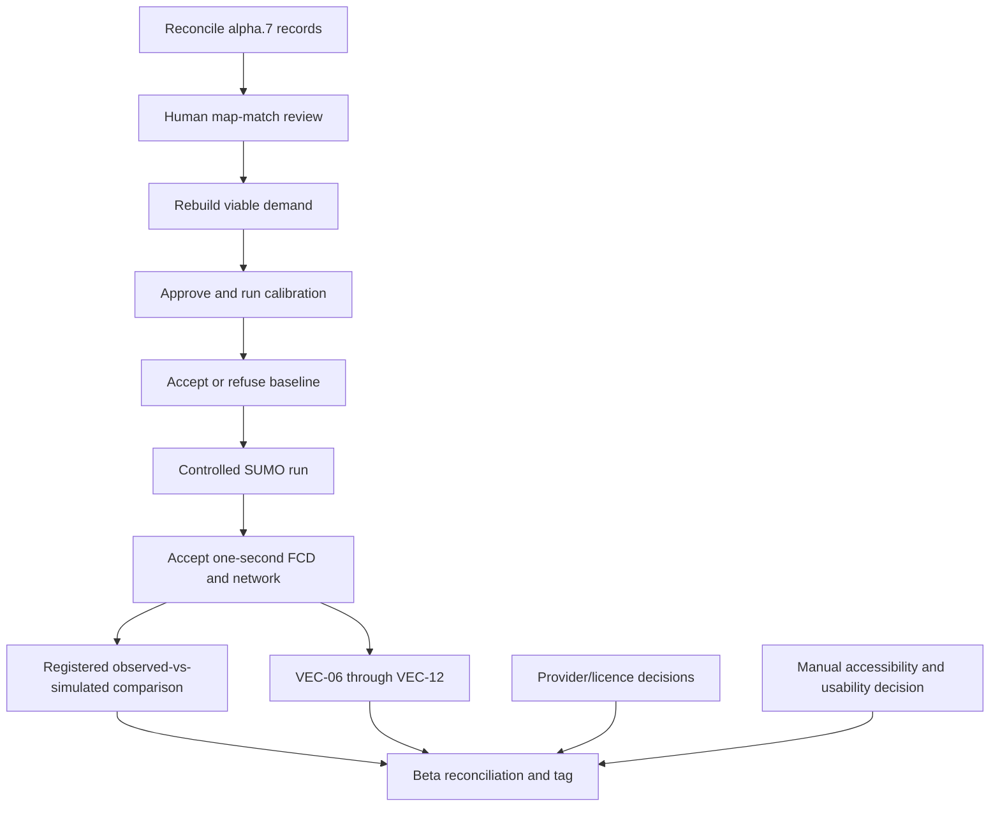

# TrafficTwin v0.7 Beta Goals — Completion Backlog

**Status:** planning supplement; no capability or gate is accepted by this document

**Snapshot date:** 25 July 2026

**Evidence baseline:** remote `claude/complete-v0.7` at
`e4c0d88620fdd7e0d4781631b98cf263fa77e9af`, tagged `v0.7.0-alpha.7`

**Canonical product specification:** [TrafficTwin design v0.7](traffictwin-design-v0_7.md)

**Formal capability truth:** [Implementation status](implementation-status.md)

## 1. Purpose

This document collects every v0.7 feature that is not fully accepted at the alpha.7 checkpoint and
turns the remaining work into one beta completion backlog. It does not replace the canonical v0.7
design, approve a scientific decision, answer a provider question, record human review, or move a
`MAN-*`, `UX-*`, or `REL-01` capability away from `planned`.

In this document, **beta goal** means a target for the next integrated checkpoint. It is not a new
formal capability state. The v0.7 completion rule still requires code, tests, accepted real-source
evidence where applicable, provenance, security and licence review, browser evidence,
documentation, and repository quality gates to agree.

## 2. Verified alpha.7 starting point

The following repository facts were checked directly before this document was written:

- the Claude integration worktree is clean at `e4c0d88` before this documentation-only slice;
- `origin/claude/complete-v0.7` points to the same commit;
- the annotated `v0.7.0-alpha.7` tag exists on GitHub and resolves to `e4c0d88`;
- `origin/codex/traffictwin-v0.7` remains at `b6aa9a9` (`v0.7.0-alpha.6`), so alpha.7 has not been
  integrated into the official v0.7 branch;
- `main` and the immutable `v0.6.0` release line remain unchanged; and
- the alpha.7 evidence record reports 3,162 passing tests, repository-wide Ruff and strict mypy
  success, an unchanged lock, no generated-reference drift, and no tracked private paths. These
  recorded checks were not re-run merely to create this planning document.

Alpha.7 contains a substantial research foundation: real DfT acquisition, a Greater Manchester
network, owner-policy map-match candidates, network review, a real temporal profile,
count-constrained candidate demand, a controlled SUMO boundary, deterministic comparison
components, a 33-command Manchester CLI, source/UI/release reconciliation tests, and the Phase 12
presentation overhaul. It does **not** contain an accepted calibrated baseline, a usable
Manchester FCD run, a real observed-versus-simulated result, or a completed Manchester VEC chain.

## 3. Status vocabulary

| Term | Meaning in this document |
|---|---|
| `working_bounded` | A useful real or local workflow exists, but its complete acceptance boundary has not passed. |
| `foundation_only` | Important deterministic contracts or libraries exist, but the main end-to-end outcome does not. |
| `external_blocked` | Completion needs a provider, supervisor, analyst, licence, ethics, or deployment decision that code cannot invent. |
| `dependency_blocked` | Completion waits for an upstream accepted artifact, such as a viable FCD/network pair. |
| `unavailable` | Current evidence or authority does not support the feature; the UI must continue to say so. |

All 15 formal v0.7 capability rows remain `planned`, even where this document uses a more detailed
practical state.

## 4. Beta exit goals

A v0.7 beta candidate should not be created until all of the following are true:

1. Project records agree on the branch, commit, tag, phase state, measured values, and blockers.
2. One reviewable Manchester mapping set is completed by a person under the recorded policy.
3. A revised candidate demand can run through SUMO without the measured gridlock failure that
   invalidated the alpha.7 diagnostic.
4. One bounded calibration and uncertainty contract is approved and executed.
5. One versioned comparison contract is registered and exercised on compatible real observed and
   simulated evidence.
6. One controlled SUMO run produces an accepted one-second FCD/network pair.
7. The eligible VEC-06 through VEC-12 stages are executed without broadening the accepted v0.6
   claims, or the exact remaining stage refusal is recorded as a beta limitation.
8. Gate-B source gaps are either closed with evidence or explicitly deferred with unchanged
   unavailable states.
9. The manual accessibility checklist and required human usability decision are recorded honestly.
10. The official v0.7 branch, package version, generated records, documentation, CI, container
    smoke evidence, and proposed beta tag agree.

## 5. Capability-by-capability beta backlog

### 5.1 Manchester sources and projection

| Capability | Alpha.7 practical state and evidence | Work required for beta completion | Blocking reason or owner |
|---|---|---|---|
| `MAN-01` Manchester snapshot/source contract | `working_bounded`: Gate A is accepted; bounded transport, quarantine, hashing, atomic publication, replay and source-specific adapters exist. | Complete one formal Gate-B reconciliation across source identity, rate limits, time basis, licence, retention, publication class, schema drift and replay evidence. Record which source slices are accepted and which remain unavailable. | Provider replies and release/licence review. |
| `MAN-02` DfT historical road counts | `working_bounded`: the real Manchester acquisition contains 342 count points and 39,072 raw counts for local authority 85; the join and real temporal profile are measured. | Resolve or formally defer the raw-count `hour` timezone; freeze rate-limit/SLA assumptions; reconcile bulk acquisition, profile eligibility, UI and publication evidence; retain `Counted` versus `Estimated`. | `GA-DFT-1` needs a provider answer. Historical local clock labels must not be converted to UTC meanwhile. |
| `MAN-03` WebTRIS strategic-road evidence | `working_bounded`: accepted historical site/day/quality parsing and replay exist; the recency probe correctly refuses WebTRIS as `near_live`. | Resolve or defer source clock semantics, complete bounded multi-site/provider acceptance, and document outage/service-continuity behaviour. Preserve the Strategic Road Network boundary. | `GA-WT-1` needs a provider answer. WebTRIS remains historical/latest-available, not live. |
| `MAN-04` TfGM signal reference layer | `working_bounded`: the real 2,529-row static archive, conversion, attribution and map layer exist. | Complete common Gate-B/licence/release reconciliation and define the re-audit procedure for the provider's overwrite-in-place release URL. | Human release/licence reconciliation; any future archive hash change requires re-audit. |
| `MAN-05` BODS live transit | `working_bounded`: authenticated bounded SIRI-VM acquisition, live/stale bus positions, outage fallback, aggregate history and five verified Bee operator identifiers exist. | Obtain and encode identifier retention, display, export and republication terms; resolve `BNVB` and complete versioned Bee operator/NOC/service scope; run final provider acceptance and privacy review. | Provider/registration terms and incomplete membership evidence. Buses must never become general traffic. |
| `MAN-06` Randy Manchester bridge | `working_bounded`: the permission-safe VEC-11 panel exposes only reviewed samples, aggregates, citations, fingerprints and limits. | Complete integration acceptance in the Manchester research workflow and publication review without adding raw identity, live/geographic relabelling, or public hosting. | Existing Randy permission and v0.6 evidence limits are permanent boundaries, not implementation gaps. |
| `MAN-07` projection and freshness | `working_bounded`: UTC contracts, source truth states, BODS/National Highways freshness, spatial admission, exclusions and offline boundaries exist. | Complete broad real-source projection acceptance; enable exact UTC projection only for sources whose observation time is evidenced; reconcile every excluded and unavailable row. | DfT and WebTRIS time semantics remain unresolved. Retrieval time cannot replace observation time. |
| `MAN-08` Manchester Operations | `working_bounded`: historical/latest/live-vehicle modes, source-separated layers, manual BODS and National Highways refreshes, filters, source cards, stale fallback, Randy panel and metadata-only export exist. | Finish upstream source acceptance, broader/multi-site evidence, public-export decisions, actionable empty-workspace guidance, manual accessibility review and any approved participant evaluation. | Depends on `MAN-01`–`MAN-07`, provider terms and human acceptance. |

### 5.2 Observation-to-SUMO research core

| Capability | Alpha.7 practical state and evidence | Work required for beta completion | Blocking reason or owner |
|---|---|---|---|
| `MAN-09` observation-to-SUMO baseline | `foundation_only`: the Greater Manchester network is built; policy v1.1 produced 131 owner-policy accepted candidates, 165 manual-review rows and 9 no-candidate rows; 39,072 DfT records form a complete candidate profile; candidate demand contains 746,440 vehicles over 1,788 cells and 149 edges, achieves 91.32% of counts with zero overflow, and has 159 underflow cells. The controlled runner exists. | Complete human review of the 165 rows; record a defensible treatment of the 9 unmatched sites; redesign the route pool with a realistic trip-length mix; regenerate demand and prove a viable run; approve calibration objective, parameters, bounds, uncertainty and held-out design; execute calibration; create and explicitly accept or refuse a versioned `ManchesterSumoBaseline`. | Human map review and scientific policy are required. The current demand gridlocks, so downstream artifacts would be misleading. |
| `MAN-10` observed-versus-simulated comparison | `foundation_only`: deterministic pairing, exclusions, missingness protection, coverage, lineage and goodness-of-fit code exist. Candidate contract fingerprint: `b1d31a1b122be3a50756ec8e51d1fb17cb6a79c684d48848f1f5df60e45aba3b`. | Lead-review and register one production contract; decide whether GEH is an acceptance criterion and its threshold; bind compatible mapping/projection/run fingerprints; run the predeclared comparison and held-out evaluation; publish denominators, exclusions, residuals and non-causal interpretation. | Contract registration is a lead action; metric/uncertainty/held-out choices require scientific approval; compatible simulation output does not yet exist. |
| `MAN-11` Manchester SUMO-to-VEC workflow | `foundation_only`: a strict path-free lineage graph and missing-stage reporting exist. | Produce and validate one accepted one-second FCD/network pair; enter VEC-06 through VEC-12 through their existing gates; materialise complete source-to-result lineage; assemble the permission-aware research pack and scoped RQ12–RQ16 evidence. | `dependency_blocked` by `MAN-09` and `MAN-10`. No eligible FCD pair exists. |

### 5.3 Product experience and release

| Capability | Alpha.7 practical state and evidence | Work required for beta completion | Blocking reason or owner |
|---|---|---|---|
| `UX-01` task-oriented navigation | `working_bounded`: all 34 v0.6 pages have stable destinations; the active design now uses seven question-led groups, direct routes, legacy fallback and shared-state tests. | Reconcile the canonical inventory and all project records to the seven-group implementation; make the formal cutover decision; verify the declared minimum and locked Streamlit versions after final integration; retain the complete legacy route. | Lead release reconciliation and human accessibility acceptance. |
| `UX-02` map-led home/workflow | `working_bounded`: focused home actions and accepted-context summaries exist. | Improve first-run and empty-registry guidance so pages do not present large undirected empty states; prove the home and Manchester workflow against accepted local evidence; complete the human usability/participant decision. | Real accepted downstream artifacts and human evaluation are missing. |
| `UX-03` responsive/accessibility system | `working_bounded`: native theme/components, responsive page harvests, seven-group presentation conventions, automated accessibility checks and browser snapshots exist. | Perform and sign the manual keyboard, screen-reader, contrast and 200% zoom checklist; resolve any findings; run final desktop/mobile/light/dark regression after integration; do not claim WCAG conformance from automation alone. | Requires a person and, if RQ16 proceeds, the applicable ethics/supervisor path. |
| `REL-01` v0.6/v0.7 isolation | `foundation_only`: separate workspaces, read-only v0.6 copying, attested activation, backup/interruption/rollback, side-by-side operation and release reconciliation tests exist. | Integrate alpha.7 into the official v0.7 branch through review; align package/version/manifests/docs; define cross-schema migration only if schemas diverge; run the container build/demo smoke; repeat clean-checkout side-by-side verification at the beta head; create an immutable beta tag only after all claimed truth agrees. | Docker evidence, lead merge/release action and final capability reconciliation. |

## 6. Critical beta work packages

### `BETA-REC-01` — Reconcile the project records

Before more capability claims, correct the current record drift:

- `current_workflow_and_todo.md` still points to `b50f27d`, calls Phase 12 unfinished and says the
  alpha.7 tag has not been created;
- `current_progress_v0_7.md` predates the real map-matching, demand and SUMO diagnostic work;
- `v07_alpha7_checkpoint_handoff.md` records the tag as created at `d586d87`, while Git and GitHub
  show that `v0.7.0-alpha.7` resolves to `e4c0d88`; and
- the older progress table says five navigation groups, while the canonical design and alpha.7
  implementation now use seven.

The correction must preserve historical measurements rather than silently replacing them. Where
an earlier candidate recorded 1,800 cells/150 edges/91.73%, distinguish it from the corrected
alpha.7 artifact of 1,788 cells/149 edges/91.32%.

### `BETA-D-01` — Complete analyst map review

Provide a bounded review workflow and have a person decide each of the 165 review-required rows.
Keep the 9 no-candidate rows explicit. Preserve every rejected alternative, reason, reviewer,
timestamp, policy version and fingerprint. Owner-policy acceptance must never be relabelled as
analyst or supervisor approval.

### `BETA-D-02` — Replace the gridlocking demand candidate

The alpha.7 diagnostic is a refusal, not a baseline. During one simulated hour, halting share rose
from 49.8% to 88.8%, teleports rose from 113 to 21,669, 35.7% of inserted vehicles teleported,
insertion rate more than halved, and only 8.1% of demand entered the network.

Freeze a revised route-pool policy with a realistic trip-length distribution, regenerate the route
pool and demand under a new provenance identity, and run bounded feasibility diagnostics. Do not
overwrite the alpha.7 candidate or tune merely until a preferred score appears.

### `BETA-D-03` — Calibrate and decide one baseline

Approve one bounded objective, parameters, bounds, exclusions, uncertainty treatment and held-out
design. Execute the existing deterministic evaluator against accepted mapping/profile/demand
artifacts. Produce a `ManchesterSumoBaseline` that records an explicit analyst acceptance or a
typed refusal; never infer acceptance from a successful process exit.

### `BETA-D-04` — Register and run one comparison

Review the candidate comparison contract and register its exact fingerprint only if its pairing,
interval, unit, missingness, weighting, denominator, precision and interpretation rules are
approved. Run it on compatible real observed and simulated artifacts. Report coverage and
exclusions even when goodness-of-fit remains unavailable.

### `BETA-E-01` — Produce the accepted FCD/network pair

Run only the accepted baseline through the controlled SUMO boundary. Require a zero exit, frozen
command/seed/step, one-second resolution, matching network identity, bounded output, complete
receipt and immutable hashes. A large or syntactically valid FCD is not sufficient if the traffic
state fails the approved feasibility/quality contract.

### `BETA-E-02` — Execute the gated VEC chain

Feed the accepted pair through VEC-06 and proceed only through request-specific preflight and the
already accepted VEC-07–VEC-12 boundaries. Preserve every v0.6 limitation: a Manchester-calibrated
SUMO trace does not prove Randy policy validity, physical completion, per-task energy, confirmed
targets, protected-attribute fairness or general Manchester coverage.

### `BETA-B-01` — Close or defer source contracts

Record provider replies for DfT time semantics, WebTRIS clock basis and BODS retention/
republication. Reconcile Bee Network membership and all licence/publication classes. If an answer
does not arrive, beta may retain a source as historical, private or unavailable, but must not imply
that the missing acceptance was completed.

### `BETA-C-01` — Complete human product evidence

Run the manual accessibility checklist, correct actionable findings, improve first-run guidance,
and decide whether RQ16 includes a participant study. Do not create participant data without the
required ethics and supervisor approval.

### `BETA-F-01` — Integrate and checkpoint honestly

Review alpha.7 and subsequent beta commits, merge or fast-forward the official v0.7 branch without
touching `main`, run full quality/security/package/generated-reference/container/side-by-side
checks, reconcile every status record, and create the beta tag only after the tag message matches
the evidence. Never move `v0.6.0` or an existing alpha tag.

## 7. Features that remain unavailable rather than beta build promises

The following are explicit design non-goals or lack an authorised evidence source. They must stay
visible as unavailable unless a later audited source and design amendment changes the boundary:

| Requested function | Beta treatment | Reason |
|---|---|---|
| Manchester-wide live private-vehicle counts, speed, density or congestion | Keep unavailable | BODS is bus evidence; National Highways feeds cover the Strategic Road Network and operational events, not all Manchester traffic. |
| Live TfGM signal phases, timings, queues or controller state | Keep unavailable | The accepted TfGM source is a static infrastructure-location archive. |
| Guaranteed complete Bee Network fleet/service coverage | Keep partial/unavailable | Complete versioned membership and feed-completeness evidence is absent. |
| Public raw/live scene hosting | Keep unavailable | Provider retention/publication terms and whole-release licence review are incomplete. |
| External online road basemap | Keep unavailable under the current decision | The application deliberately uses offline official boundaries and no hidden tile-provider dependency. |
| Always-on daemon, cloud scheduler or unattended live service | Keep out of scope | v0.7 supports explicit bounded operator-triggered acquisition, not a persistent hosted deployment. |
| Automatic calibration or automatic scientific acceptance | Keep prohibited | The design requires a deterministic contract and explicit analyst review. |
| Causal or “model is accurate” conclusions from one comparison score | Keep prohibited | `MAN-10` is descriptive and non-causal without a separate predeclared study. |

## 8. Dependency order

The critical engineering path is map review → demand feasibility → calibration → accepted baseline
→ FCD → comparison/VEC. Provider enquiries, manual accessibility work and release reconciliation
can progress beside that path, but they cannot be silently assumed complete.

## 9. Evidence required in the beta handoff

The beta handoff must contain:

- exact branch, commit, annotated tag object and peeled commit;
- a clean-worktree statement and complete changed-file inventory;
- immutable source/network/mapping/profile/demand/baseline/run/comparison/VEC fingerprints;
- exact human decisions with reviewer role and no invented signatures;
- commands and test results for focused, Manchester, full, UI/browser, mypy, Ruff, lock,
  generated-reference, packaging, container and side-by-side checks;
- provider/licence/publication answers or explicit unresolved blockers;
- measured demand and SUMO feasibility results, including failures and exclusions;
- a capability/gate table reconciled against `implementation-status.md`; and
- explicit confirmation that `main`, `v0.6.0`, prior alpha tags, valuable workspaces, secrets,
  raw private evidence and external repositories were not modified.

## 10. Update rule

Update this backlog only from measured evidence. When a goal finishes, link its accepted artifact
and tests, move its remaining blocker to the next dependent goal, and reconcile the formal project
records. Do not delete failed alpha evidence, replace unknowns with assumptions, or mark a feature
complete solely because its library, CLI command, page or API request exists.
