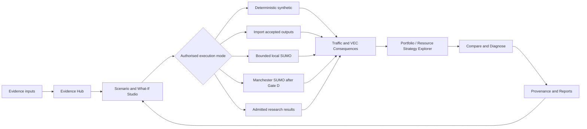

# TrafficTwin Product Design Document V2

**Subtitle:** Supervisor-aligned what-if experimentation, Manchester evidence, algorithm selection, and dynamic-resource decision support  
**Document version:** 2.0 — proposed product direction  
**Product baseline:** `main` at `4d78d3e5fde0652965897a54c3dd94fe02818308`  
**Project:** Dynamic Resource Management for Intelligent Transportation System Applications  
**Student:** S M Abdulla Al Mamun  
**Supervisor:** Dr Sandra Sampaio  
**Institution:** The University of Manchester  
**Date:** 8 August 2026  
**Status:** **PROPOSED** — scientific contracts, provider access, ethics, research admission, and release authority remain separate approvals.

> **Purpose.** This document does not replace the demonstrable v0.7 baseline. It defines how TrafficTwin can progress from a clean, truthful demo into the fuller supervisor-aligned product: a bounded what-if decision-support application that joins traffic and vehicular-edge consequences without fabricating live data, scientific approval, participant results, or control authority.

## 1. Executive decision and design stance

TrafficTwin is already demo-ready: a clean user can launch the app, create a deterministic synthetic workspace in one click, inspect 62 registered runs and three comparisons, compare baseline and variation bundles, inspect provenance, and download reports. The merged Manchester context slice also gives Home a truthful geographical identity without claiming live traffic. `[S6]`

Product V2 is not a restart and not a license to build every historical backlog item. It is a supervisor-aligned expansion plan focused on the capabilities that remain distinctive and user-visible:

1. a complete one-click what-if loop;
2. traffic and VEC consequence lenses;
3. challenging scenario families;
4. algorithm-portfolio exploration;
5. bounded Manchester evidence activation;
6. an accepted observation-to-SUMO path;
7. admitted dynamic-resource research integration;
8. genuine user evaluation; and
9. a citable reproducible release.

> **Primary V2 decision.** Build the synthetic what-if and consequence loop first because it is high-value, fully under product control, and directly reflects Sandra’s stated differentiator. Run scientific, provider, research, and ethics work as parallel gated tracks. Never let an unavailable external input block the truthful synthetic product, and never let the synthetic product masquerade as Manchester evidence.

### 1.1 What V2 must achieve

- A user can author a challenging baseline and intervention in the application and generate or import the two outcome bundles without memorising paths or leaving the product.
- The product shows both traffic consequences and vehicular-edge-computing consequences with evidence status, denominators, exclusions, and non-causal wording.
- A transparent algorithm portfolio view explains which constituent is selected for a scenario and how that choice compares with observed constituents; synthetic and admitted modes remain visibly separate.
- Manchester evidence progresses only through explicit source, licence, retention, map-matching, calibration, baseline, and comparison gates.
- Dynamic resource strategy results enter the product only after the separate research lane produces and admits reproducible evidence.
- A formal, ethics-compliant user evaluation measures usability, usefulness, trust, and interpretation of evidence labels.
- The final release is reproducible, citable, locally runnable, and bounded enough to explain in the dissertation and viva.

### 1.2 Non-goals

- city-wide production digital twin;
- continuous Manchester private-vehicle telemetry;
- public SaaS or mobile deployment;
- autonomous road/RSU control;
- social-media surveillance;
- a learned selector or forecaster without stronger evidence than transparent baselines;
- a real Kubernetes deployment;
- treating “implemented”, “live”, “accepted”, and “scientifically validated” as synonyms.

## 2. Source basis and authority order

Authority order:

1. supervisor intent;
2. official Project 237 brief;
3. formal implementation/scientific status;
4. current code and reproducible tests;
5. admitted research outputs; and
6. recommendations in this document.

| ID | Source | Role |
|---|---|---|
| S1 | Supervisor Meeting 1 notes | Traffic data-engineering platform, complete current view, forecasting as one part, challenging scenarios, citation and contribution expectations. |
| S2 | Supervisor Meeting 2 notes | Manchester digital-twin framing, what-if differentiator, challenging seeds, algorithm combination/selector, simple UI, formal user evaluation. |
| S3 | Official Project 237 brief | ITS use cases, runtime profiling, cloud-resource strategies, dynamic management proposals. |
| S4 | Meeting 1–3 live feature-gap audit | Current live/non-live truth. |
| S5 | Implementation status and open questions | Formal capability truth and blockers. |
| S6 | Post-merge audit at `4d78d3e` | Verified current journey, counts, tests, and limitations. |
| S7 | Supervisor scientific-contract form | Human decisions required for map matching, calibration, and comparison. |
| S8 | What-If Composer and controlled live-twin designs | Existing draft-only and bounded execution contracts. |
| S9 | Experiment tools and portfolio backend | Existing selector, winner-map, held-out synthetic evaluation, challenge seeds. |
| S10 | Research direction / E1 records | Scheduling, admission, scaling and stale-state work owned by research. |

## 3. Current product baseline

The V2 branch must start from `main` at `4d78d3e5fde0652965897a54c3dd94fe02818308` or the actual latest reviewed main. It must not use the research checkout.

| Capability | Current verified state | V2 treatment |
|---|---|---|
| Clean launch | One-click demo workspace with 62 runs and 3 comparisons. | Preserve as default offline path. |
| Manchester identity | Static ONS boundaries, correct attribution, no live claim. | Geographic context only. |
| Guided demo | Eight-stage synthetic workflow. | Extend, do not replace. |
| Scenario Builder | Incidents, demand, tasks, fleet, RSU, policies, imperfections. | Reuse as authoring engine. |
| What-If Composer | Predicts and drafts unsigned campaign; cannot execute. | Keep draft-only; add a separate safe synthetic execution path. |
| Compare and reports | Deterministic cross-domain metrics, provenance, reports. | Add consequence summary. |
| Portfolio backend | Transparent selector and held-out synthetic evaluation. | Add dedicated UI. |
| Manchester integration | Strong foundations; no accepted complete scene/baseline. | Gate scientifically. |
| Resource research | Separate research campaign. | Integrate only admitted results. |
| User evaluation | Draft materials only. | Complete genuinely after ethics route. |

## 4. Product problem

A traffic analyst should be able to describe a challenging scenario, generate or import an authorised baseline and intervention, inspect both traffic and VEC consequences, understand which algorithm or infrastructure strategy is suitable under the observed conditions, trace every result to its evidence, and export a reproducible report. Today that journey is fragmented, and the real Manchester version remains gated.

## 5. V2 product definition

> **TrafficTwin V2 is a local, evidence-labelled what-if experimentation and decision-support application for traffic and vehicular edge computing, demonstrated through Manchester. It combines source-separated evidence, bounded scenario authoring, authorised simulation or import, traffic/VEC consequence comparison, transparent algorithm and resource-strategy exploration, provenance, and reproducible reporting.**

### 5.1 Success tiers

| Tier | Definition |
|---|---|
| V2-A | Offline supervisor-aligned product: what-if pair, consequence lenses, challenge seeds, portfolio UI, provenance, reports. |
| V2-B | Evidence-activated Manchester case study: accepted sources, scientific contracts, baseline, observed-vs-simulated comparison. |
| V2-C | Research-integrated resource strategy decision support. |
| V2-D | Ethics-compliant evaluated, tagged, reproducible release. |

## 6. Personas and principal journeys

| Persona | Primary need | V2 outcome |
|---|---|---|
| Traffic analyst | Explore a scenario without scripts. | What-If Studio, consequence lenses, comparison, report. |
| VEC researcher | Compare policies, RSU pressure, tasks and evidence. | Portfolio and Resource Strategy Explorers. |
| Supervisor/examiner | Verify contribution and limits. | Guided demo, traceability, provenance, exact non-claims. |
| Road user/planner | Understand bounded journey consequences. | Departure/clearance view only with compatible evidence. |
| System owner | Control source, approvals, retention, execution and release. | Explicit gates and receipts. |

Primary journey:

`Home → What-If Studio → challenge seed → change ledger → generate pair → Traffic Consequences → VEC Consequences → Portfolio Explorer → Compare → Provenance → Reports`

## 7. Scope decisions

| Product area | Decision |
|---|---|
| What-If Experiment Studio | BUILD NOW |
| Traffic and VEC consequence lenses | BUILD NOW |
| Algorithm Portfolio Explorer | BUILD NOW |
| Challenge seed library / triviality | BUILD NOW |
| Manual incident input | BUILD NOW |
| Manchester evidence activation | BUILD WITH GATES |
| Observation-to-SUMO baseline | SCIENTIFIC GATE |
| Resource strategy view | RESEARCH-DEPENDENT |
| Formal user evaluation | HUMAN / ETHICS GATE |
| Social-media ingestion | DEFER |
| Learned road forecast | DEFER UNTIL DATA |
| Real Kubernetes / autonomous control | REJECT FOR MSc PRODUCT |
| Public/mobile SaaS | DEFER |

## 8. Feature epics

### 8.1 One-click What-If Experiment Studio

**User story:** choose a baseline, change incident/demand/task/fleet/RSU/policy parameters, click **Generate comparison**, and receive a registered compatible baseline/variation pair.

Required behaviour:

- reuse the existing scenario schema and deterministic generator;
- show a changed-parameter ledger before generation;
- generate and register both bundles transactionally;
- use explicit experiment and baseline/variation identity;
- set selected paths and route to Consequences;
- roll back a partial failure;
- display synthetic/non-Manchester labels everywhere.

Initial non-goals: generic SUMO execution, campaign approval, LLM metrics, or real Manchester claims.

### 8.2 Traffic and VEC Consequence Lenses

Traffic outcomes:

- trip cohort and incomplete journeys;
- mean/P50/P95 duration;
- speed/count evidence;
- incident/event window;
- recovery/clearance only when supported.

VEC outcomes:

- offered, admitted, rejected, forwarded, started, compute-completed, returned, dropped and deadline-success tasks;
- completion over offered work and conditional admitted completion;
- latency, energy, decisions, forwarding, queue/utilisation and scaling cost.

Every headline must carry unit, denominator, availability, warnings and evidence references.

### 8.3 Algorithm Portfolio Explorer

Reuse the existing transparent selector and winner-map backend.

Modes:

- synthetic workflow demonstration;
- admitted experiment cohort;
- learned selector only after a signed, disjoint development/held-out protocol.

Show scenario features, selected constituent, matched rationale, constituent ranks/scores/regret, support, exclusions, held-out results, dominance matrix, and downloadable fingerprints.

### 8.4 Challenge Seed Library

Small named families:

1. arena egress surge;
2. lane closure / road clearing;
3. T1-heavy weak fleet;
4. RSU waiting-room squeeze;
5. load-aware forwarding / placement;
6. stale-state scheduling; and
7. scaling strategy.

Each seed is versioned, replayable, linked to its parent and changed parameters, and checked for triviality. An expected challenge is a hypothesis, not an expected result.

### 8.5 Manchester Evidence Hub and bounded incident intake

Maintain source separation:

- DfT = historical;
- WebTRIS = historical/latest within accepted semantics;
- BODS = live/recent buses, not general traffic;
- National Highways = strategic-road operations, not Manchester city-road coverage;
- TfGM references = infrastructure unless telemetry is supplied;
- TfGM/NTIS measured traffic = unavailable until provider contract;
- manual incident = authored scenario input, not observation;
- social media = deferred.

Provide owner activation readiness, freshness, coverage, rights/retention, last receipts, and truthful unavailable states. Never display secrets.

### 8.6 Manchester observation-to-SUMO and accepted baseline

Gate sequence:

1. boundary/network/licence decision;
2. map-matching policy and 174 named-person reviews;
3. viable demand;
4. calibration contract;
5. accepted baseline;
6. registered observed-vs-simulated comparison;
7. controlled SUMO/FCD output; and
8. SUMO-to-VEC lineage.

Stop whenever a required human/scientific/provider input is absent. “Software default” is not a scientific basis.

### 8.7 Dynamic Resource Strategy Explorer

Research-owned candidate arms:

- strongest-link;
- JSQ/load-aware placement;
- P2C;
- deadline-aware admission/placement;
- fixed 1× and static overprovisioning;
- reactive and proactive simulated scaling;
- learned scheduler only after deterministic baselines.

Required output includes offered/admitted/rejected/completed/deadline-success counts, conservation, latency, energy, forwarding, state age, RSU queue/utilisation, scale actions, actuation delay, cooldown and resource cost.

Use **Kubernetes-style simulated resource control** until a real Kubernetes deployment exists. Never auto-apply a strategy.

### 8.8 Formal user evaluation

Recommended tasks:

- explain evidence state on Home;
- create a what-if pair;
- identify traffic and VEC consequences;
- explain a portfolio decision and limitation;
- trace a report claim;
- state what the product cannot conclude or control.

Recommended measures: task completion/error, path/time, usefulness, ease of use, trust calibration, interpretability, qualitative feedback, and approved accessibility observations.

No recruitment before the correct ethics route. No raw participant data in the repository. Mock results remain synthetic.

### 8.9 Release and dissertation evidence

- version/tag/licence and publication decisions;
- clean install and deterministic reproduction;
- viva-reproduction branch/tag;
- guided supervisor/viva demo;
- reports, contracts, provenance, research admission and evaluation artifacts;
- truthful implementation status and limitations.

## 9. Architecture and execution modes

Principles:

- one scenario schema;
- one evidence vocabulary;
- one pair-orchestration service;
- thin UI over tested services;
- adapter-bound authorised execution;
- human decisions as fingerprinted inputs;
- isolated product and research lanes.

| Mode | What it may do | Evidence ceiling |
|---|---|---|
| A Synthetic | Generate bounded bundles locally. | Synthetic software evidence. |
| B Import | Validate/import accepted contracted artifacts. | Inherits source/admission. |
| C Local SUMO | Pinned, allowlisted fixed-argv engineering execution. | Engineering evidence. |
| D Manchester SUMO | Accepted Gate-D network/scenario/calibration. | Bounded Manchester simulation evidence. |
| E Research integration | Read admitted scheduler/scaling artifacts. | Admitted research evidence. |
| F External/cloud/operator | Only with concrete account, budget, endpoint and authority. | Deployment-specific; outside default MSc product. |

## 10. Core contracts

- `WhatIfPairRequest`
- `WhatIfPairReceipt`
- `ConsequenceSummary`
- `ScenarioChallengeRecord`
- `PortfolioDecision`
- `ResourceStrategyResult`
- `ManchesterScientificContract`
- `EvidenceContext`
- `ParticipantResultRecord`

Every page/export distinguishes authored configuration, synthetic evidence, imported unadmitted data, admitted research evidence, historical observation, latest available, near-live operations, live transit, simulation, static geography, and unavailable.

## 11. Delivery roadmap

```mermaid
flowchart TB
    subgraph Product
      S1[What-If pair orchestration] --> S2[Consequence lenses] --> S3[Portfolio + challenge seeds] --> S4[V2 demo route] --> S5[Release]
    end
    subgraph Science
      G1[Boundary/network] --> G2[Map review + viable demand] --> G3[Calibration + baseline] --> G4[Observed vs simulated] --> G5[SUMO to VEC]
    end
    subgraph Research
      R1[Corrected scheduler experiments] --> R2[Deterministic baselines] --> R3[Scaling/stale state] --> R4[Admission] --> R5[Resource Strategy Explorer]
    end
    subgraph Human
      H1[Supervisor contracts] --> H2[Provider/rights] --> H3[Ethics] --> H4[Participants] --> H5[Release sign-off]
    end
```

Immediate product sequence:

1. V2-S1 What-If pair orchestration;
2. V2-S2 Consequence lenses;
3. V2-S3 Portfolio Explorer and challenge seeds;
4. V2-S4 Home/Guided Demo route and V2-A release candidate.

Parallel owner actions: supervisor contracts, boundary/network, 174 reviews, provider terms, owner workspace, ethics, and permissions.

Later sequence: Manchester activation → map/demand/calibration → observed-vs-simulated → resource strategy integration → formal evaluation → release.

## 12. Gates and testing

| Gate | Evidence |
|---|---|
| A Synthetic loop | Transaction, rollback, AppTest journey, deterministic report reconciliation, no-network proof. |
| B Portfolio visible | Backend parity, held-out display, fingerprints, synthetic/admitted labels. |
| C Scientific inputs | Signed decisions, human review, viable demand. |
| D Accepted Manchester | Baseline, controlled run, comparison, lineage. |
| E Research integration | Admitted compatible artifacts and limitations. |
| F Human evaluation | Ethics, consent, anonymised results, analysis. |
| G Release | Clean build/install, tag/licence, archive, demo, documentation truth. |

Testing:

- unit and property/conservation tests;
- golden structured artifacts;
- UI/AppTests for the complete journey and failures;
- affected integration tests;
- no-network/no-credential tests;
- rendered-browser/a11y checks;
- independent Claude review and exact-head merge verification.

## 13. Research/product boundary

Product owns orchestration, UI, source standing, consequence presentation, provenance and reports. Research owns experiment design/execution, actor/checkpoint, manifests, seeds, metrics, statistical analysis, interpretation and admission. Product integrates only an exact admitted artifact and never reruns or silently reinterprets it.

## 14. User evaluation, release and dissertation evidence

Dissertation package should include architecture, traceability, pair receipt, consequence summary, portfolio analysis, Manchester contracts, admitted resource results, provenance, reports, user evaluation, and release/reproduction evidence.

Supported claims:

- modular evidence-bounded what-if experimentation platform;
- deterministic versioned baseline/variation workflow;
- integrated traffic/VEC consequence presentation;
- transparent scenario-aware portfolio/strategy analysis;
- bounded Manchester case study only as evidence supports;
- evaluated software artifact only after genuine participant evidence.

## 15. Risks

Main risks: scope explosion, synthetic/real confusion, provider delay, scientific contract delay, research incompatibility, ethics delay, selector overfitting, metric-semantic error, privacy/path leaks, regression of the current demo, and documentation overclaim.

Mitigation principle: preserve the offline V2-A product, fail closed at every evidence/authority gate, and complete one independently reviewed user-visible slice at a time.

## 16. Definition of done and stop rules

### V2-A done

- one coherent in-app scenario-pair journey;
- reconciled traffic/VEC consequences;
- visible portfolio and challenge seeds;
- offline operation;
- current Manchester/source truth preserved;
- independent review for every meaningful PR.

### Full evaluated V2 done

- Manchester path either accepted or exactly disclosed as blocked;
- at least one admitted resource result integrated, or exact incompatibility disclosed;
- genuine approved user evaluation completed, or absence disclosed;
- release/tag/licence/install/archive/demo package complete;
- implementation status and dissertation claims match evidence.

### Stop rules

Stop when a proposed change does not materially improve a supported supervisor requirement, core journey, validity or evaluation evidence. Stop real-data work without rights/schema/retention. Stop scientific work without contracts. Stop research integration without admission. Stop release claims without tests, provenance and authority.

## Appendix A — Supervisor traceability

| Direction | V2 response | Gate |
|---|---|---|
| Complete current view | Source-separated Manchester Evidence Hub | Provider/owner gated |
| Forecasting as one component | Consequence lens now; validated forecast later | Data/science gated |
| What-if differentiator | One-click What-If Studio | Build now |
| Challenging seeds | Challenge library and triviality | Build now |
| Algorithm combination/selector | Portfolio Explorer | UI now; real claim research-gated |
| Simple buttons/screens | Guided V2 route | Build now |
| Formal user evaluation | Ethics-compliant tasks and analysis | Human gated |
| RSU/model/infrastructure analysis | VEC lens and Resource Strategy Explorer | Research gated |
| Dynamic resource management | Strategy condition map with cost | Research integrated |

## Appendix B — Proposed slices

| Slice | Suggested branch | Outcome |
|---|---|---|
| V2-S1 | `agent/product-whatif-pair-v2` | Pair transaction and What-If Studio |
| V2-S2 | `agent/product-consequence-lenses-v2` | Traffic/VEC consequence view |
| V2-S3 | `agent/product-portfolio-explorer-v2` | Portfolio UI and challenge seeds |
| V2-S4 | `agent/product-v2-demo-route` | Home/Guide integration and V2-A demo |
| V2-M1 | `agent/product-manchester-activation` | Source activation UX |
| V2-M2 | `agent/product-manchester-gated-baseline` | Scientific Gate-D baseline |
| V2-M3 | `agent/product-observed-simulated` | Comparison and lineage |
| V2-R1 | `agent/product-resource-strategy-view` | Admitted resource-result presentation |
| V2-U1 | `agent/product-evaluation-release` | Approved evaluation support and release |

## Appendix C — Source register

- S1: `meeting 1 notes.docx`
- S2: `meeting 2.docx`
- S3: Project 237 Taught Project Explorer
- S4: `docs/meeting_1_2_3_live_feature_gap_audit.md`
- S5: `docs/implementation-status.md`, `docs/open-questions.md`
- S6: `Pasted markdown(20260808-222920).md`
- S7: `docs/evaluation/supervisor_contract_decision_form.md`
- S8: `docs/platform/whatif_composer_design.md`, `docs/platform/controlled_live_twin_adapter_design.md`
- S9: `docs/experiment_research_tools.md`, `src/traffictwin/experiments/portfolio.py`
- S10: research direction / E1 records
- Code baseline: `4d78d3e5fde0652965897a54c3dd94fe02818308`

> **Final status: PROPOSED.** V2-S1–S3 can proceed as product engineering after owner approval. Manchester scientific work, provider activation, resource-management evidence, participant evaluation, and release claims remain gated.
